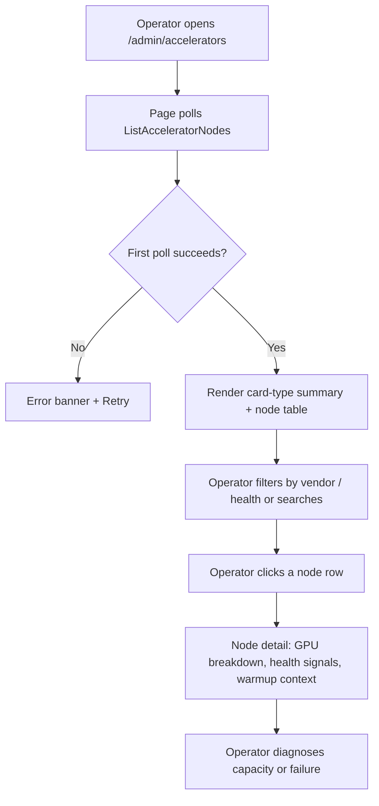

# Accelerator Inventory & Health (GPU Operator Integration) — Requirement Analysis and UI/UX Design

| Attribute | Content |
| --- | --- |
| Feature point | Accelerator inventory & health — per-node GPU fleet visibility: node, driver version, device-plugin status, GPU model/count/allocated-free, health/readiness (backlog row 18) |
| Document scope | Requirement analysis, competitive research, the admin-surface page design for `/admin/accelerators`, the page → API surface table, and numbered acceptance criteria |
| Owning modules | `web` admin console (`AcceleratorsPage`), `pkg/server` gateway (admin-prefix binding), a new accelerator-inventory service or an extension of `infer`/`image` (node + GPU inventory projection), `Controller` (node/GPU status collection), `k8s` (node, device-plugin, and extended-resource reads) |
| Related documents | [Architecture Design](./architecture.md) — §2.3 heterogeneous compute, §2.4 image module, §2.7 Controller · [Image Management](./image-management.md) — the "node inventory" this feature provides, warmup task per-node results · [Model Catalog & One-Click Deployment](./model-catalog-deployment.md) — card type (`accelerator_type`) and accelerator selection · [Inference Autoscaling](./inference-autoscaling.md) — node-level capacity context · [Console Surface Separation](./console-surface-separation.md) — the admin surface this page lives on |
| Status | Design complete, handed to the Architect agent |

---

## 1. Background

go-taas serves inference on **heterogeneous accelerators** — NVIDIA GPU, Iluvatar CoreX, and MetaX — and the architecture delegates driver, device-plugin, and node-label management to each vendor's GPU Operator (architecture §2.3). Today the operator has **no visibility into the accelerator fleet**. The deploy form (feature #2) lets an administrator pick an accelerator and a free-text card type (`A800`, `H800`, `BI-V150`), and the image module (feature #3) filters images by accelerator and reports per-node warmup results — but nothing tells the operator *which nodes actually carry which GPUs, whether the driver and device plugin are healthy, or how much of each card type is free*. The image-management design explicitly defers a "node inventory" and the compatibility matrix defers a "card-type inventory"; both are prerequisites this feature provides.

That gap has four concrete consequences visible today:

1. **Blind capacity planning.** An operator cannot answer "how many free `A800` do I have?" — the deploy form accepts any card type, and a request for a card type with no free capacity fails only at the Kubernetes scheduler, after the message reaches the Controller.
2. **No health signal.** A node whose GPU driver or device plugin is degraded still appears in the cluster; inference services scheduled onto it fail at runtime with no operator-facing explanation.
3. **No fleet overview.** With three accelerator vendors, each with its own driver and device-plugin lifecycle, there is no single place to see driver versions, node labels, and readiness across the fleet.
4. **No foundation for the matrix.** The compatibility matrix (row 19) and node-level cache inventory (deferred in feature #3) both need a card-type inventory that does not exist.

This feature adds a **read-only accelerator inventory and health view** on the admin console: a page that lists every compute node, its accelerator vendor, the GPU model(s) it carries, how many are allocated vs free, the driver and device-plugin status, and the node's readiness. It is the smallest independently valuable increment of Phase 3's "heterogeneous accelerators" roadmap item: it gives the operator the fleet picture that every downstream accelerator feature (compatibility matrix, node-aware warmup, capacity-aware deployment) builds on.

### 1.1 How Comparable Products Expose Accelerator / Node Inventory

| Product | Inventory surface | What it shows | Health signal | Notable pitfalls |
| --- | --- | --- | --- | --- |
| **NVIDIA GPU Operator + DCGM** | `kubectl get nodes`, `nvidia-smi`, DCGM exporter dashboards (Grafana) | Per-node GPU model, driver version, device-plugin status, GPU utilization, memory, temperature | DCGM health checks; node `Ready` condition; device-plugin `Healthy` | Raw `kubectl`/`nvidia-smi` output is not a product surface; dashboards are separate tooling the operator must assemble |
| **RunPod** | Pod/GPU inventory in the console | Available GPU types, per-type count and price, per-pod GPU allocation | Pod status | No driver/device-plugin health; inventory is a marketplace, not a fleet view |
| **Vast.ai** | GPU marketplace with per-host cards | Per-host GPU model, count, price, utilization | Host online/offline | Marketplace-oriented; no driver version or device-plugin detail |
| **Lambda / cloud GPU hosts** | Instance catalog | GPU type and count per instance | Instance status | No per-node driver/health detail; catalog is static |
| **KServe / Kubeflow** | Node and accelerator labels via Kubernetes | Node labels, extended resources (`nvidia.com/gpu`), taints | Node conditions | No consolidated fleet health; requires Kubernetes knowledge |
| **Volcengine Ark / Aliyun Bailian** | Compute instance catalog | GPU card type and count per instance type | Instance status | No driver/device-plugin health; catalog is static |

### 1.2 Distilled Patterns and Decisions

Patterns worth adopting: (1) **a fleet table as the primary view** — every surveyed product shows GPUs as rows with model, count, and allocation; (2) **health as a first-class column** — DCGM and Kubernetes node conditions prove that readiness and device-plugin health must be visible at a glance, not buried in logs; (3) **card-type aggregation** — RunPod and Vast.ai show that operators think in "how many of card X are free", so the page needs both a per-node table and a card-type summary; (4) **read-only by default** — inventory is telemetry, not a CRUD surface; the operator reads it, and any mutation (draining, cordoning) belongs to Kubernetes tooling, not this page.

Pitfalls to avoid: exposing raw `kubectl`/`nvidia-smi` output as the product surface (NVIDIA) — the page must be a curated projection; a marketplace that hides driver/device-plugin health (RunPod, Vast.ai) — health is the point of this feature; and a static catalog with no live allocation (Lambda, cloud hosts) — the operator needs *current* free capacity.

**Decisions for go-taas**:

| # | Decision | Rationale |
| --- | --- | --- |
| D1 | **Read-only inventory.** The page lists nodes and GPUs and shows health; it performs no mutation (no cordon, drain, or label editing) | Inventory is telemetry. Mutations belong to Kubernetes tooling and would expand scope into node lifecycle management, which is not this feature |
| D2 | **Two views on one page: a card-type summary and a per-node table.** The summary answers "how many of card X are free"; the table answers "which node, which driver, which health" | Operators plan capacity by card type (D1 of feature #2) but debug by node; both questions need one page |
| D3 | **Health is a composite of three signals**: node `Ready` condition, device-plugin `Healthy` status, and driver-version presence. A node is `Healthy` only when all three hold | A node can be `Ready` while its device plugin is degraded, or have a device plugin while the driver is missing; collapsing them hides the failure mode |
| D4 | **The inventory is a projection of Kubernetes node + extended-resource state**, collected by the Controller and served through the admin gateway; it is not a new database table | The source of truth is the cluster (node labels, `nvidia.com/gpu`-style extended resources, device-plugin status). A projection avoids a second source of truth that drifts from the cluster |
| D5 | **Accelerator vendor is derived from node labels** (`nvidia` / `iluvatar` / `metax`), and card type from the node's accelerator-specific extended-resource name or label; a node with no accelerator label is shown as `unspecified` | Matches the architecture's node-labeling model (§2.3); the vendor drives the icon/badge and the card-type parsing |
| D6 | **Allocated vs free is computed from the node's allocatable vs allocated extended resources** for each card type; the page shows both numbers and a utilization bar | "Free capacity" is the operator's planning question; allocatable/allocated is the Kubernetes-native answer |
| D7 | **The page is admin-surface only** (`/admin/accelerators` + `/api/v1/admin/accelerators/*`). Tenants never see the fleet | The accelerator fleet is operator-internal orchestration state (like inference services' replicas and images); a tenant consumes models, not nodes |
| D8 | **A new error code 10208 `CodeAcceleratorNodeNotFound`** for a node id that does not exist in the inventory | Mirrors the per-module code allocation pattern (10207 for image reference); a stale node id must not be silently treated as an empty node |
| D9 | **The inventory is polled, not pushed.** The page polls `ListAcceleratorNodes` on an interval and shows a last-updated timestamp; there is no websocket | Matches the existing console's `usePolling` pattern (feature #17) and keeps the API stateless |
| D10 | **Card-type summary groups by `(vendor, card_type)`** and shows total / allocated / free / nodes; a card type with zero free capacity is visually flagged | The operator's capacity question is per card type; the flag surfaces "you cannot deploy this card type right now" before the deploy form fails at the scheduler |

## 2. Goals and Non-goals

**Goals**: a read-only admin page `/admin/accelerators` that lists every compute node with its accelerator vendor, GPU model(s), allocated/free counts, driver version, device-plugin status, and readiness (D1–D3); a card-type summary that answers "how many of card X are free" (D2, D10); vendor and card-type derivation from node labels and extended resources (D5, D6); a node detail view with per-GPU breakdown and warmup-task context (D4); the page → API surface table with the exact admin prefix (D7); per-page interactive states including empty, error, and permission-denied; numbered acceptance criteria testable in Nightwatch against the compose stack.

**Non-goals**: any mutation of nodes (cordon, drain, label editing, driver upgrade) — D1; tenant-facing accelerator visibility — D7; the compatibility matrix (row 19, consumes this inventory); node-aware warmup targeting beyond what feature #3 already provides; node-level autoscaling (deferred in feature #16); a Grafana-style metrics dashboard (utilization over time is out of scope — this page shows a point-in-time snapshot); RDMA/network health (a separate Phase 4 concern).

## 3. Personas and Journeys

| Role | Surface | Journey |
| --- | --- | --- |
| **Platform operator** | admin | Opens `/admin/accelerators` → sees the card-type summary ("12 × A800 free, 0 × H800 free") → drills into a node to see its driver version and device-plugin health → spots a degraded node and investigates before scheduling |
| **Platform operator (capacity planning)** | admin | Before deploying a model, checks the card-type summary to confirm the requested card type has free capacity → deploys with confidence instead of failing at the scheduler |
| **Support engineer** | admin | A tenant reports a failed inference call → opens `/admin/accelerators`, finds the node the service runs on, and sees the device-plugin or driver health that explains the failure |
| **Tenant developer / Agent** | neither | Consumes models over the OpenAI-compatible endpoint; never sees the accelerator fleet (D7) |

> Terminology: the consumer-side caller is an **Agent** in English and 「智能体」 in Chinese, consistent with the repository convention.

## 4. Feature Requirements

### FR1 — Card-type summary

- **FR1.1** The page shows a summary of card types grouped by `(vendor, card_type)`: **Vendor** (badge: nvidia / iluvatar / metax / unspecified), **Card type** (e.g. `A800`, `H800`, `BI-V150`), **Total GPUs**, **Allocated**, **Free**, **Nodes** (count of nodes carrying that card type), and a **utilization bar** (allocated/total).
- **FR1.2** A card type with zero free GPUs is flagged with a "No free capacity" badge and a muted row style; a card type with zero total GPUs is not shown.
- **FR1.3** The summary is sorted by vendor, then by free capacity ascending (most constrained first), so the operator sees scarcity at the top.

### FR2 — Per-node table

- **FR2.1** The page lists compute nodes in a table: **Node** (name), **Vendor** (badge), **Card type(s)** (comma-separated), **GPUs** (allocated/free), **Driver version**, **Device plugin** (Healthy / Degraded / Unknown badge), **Readiness** (Ready / NotReady / Unknown badge), **Health** (composite badge: Healthy / Degraded / Unknown), **Last updated** (relative time).
- **FR2.2** The list is filterable by vendor (nvidia / iluvatar / metax / unspecified) and by health (Healthy / Degraded / Unknown), searchable by node name, and paginated (`offset`/`limit`, default 20, max 100).
- **FR2.3** The empty state reads "No accelerator nodes found — install a GPU Operator and label your compute nodes" with a hint linking to the architecture's heterogeneous-compute section. A banner lists any supported vendor (nvidia / iluvatar / metax) with zero nodes.
- **FR2.4** A node row expands (or links to a detail view) to show per-GPU breakdown: each GPU's index, model, allocated/free, and any per-GPU health note.

### FR3 — Node detail

- **FR3.1** Clicking a node opens a detail view showing: node name, vendor, readiness, device-plugin status, driver version, node labels (accelerator-relevant), taints, the full per-GPU breakdown, and the node's allocatable vs allocated extended resources per card type.
- **FR3.2** The detail view shows the node's **warmup-task context** (feature #3): any warmup tasks that targeted this node and their per-node outcome, so the operator can correlate "node is cold" with "warmup failed here".
- **FR3.3** A missing node id returns the new **10208 `CodeAcceleratorNodeNotFound`** and the page shows a "Node not found — it may have been removed" state with a link back to the list.

### FR4 — Health semantics

- **FR4.1** Health is the composite of node `Ready`, device-plugin `Healthy`, and driver-version presence (D3). The page shows the composite badge and, on the detail view, the three underlying signals separately.
- **FR4.2** A node with no accelerator label is shown as vendor `unspecified` and its health is based on node readiness alone; it is still listed so the operator can see unlabeled nodes.

### FR5 — Surface and API binding

- **FR5.1** The page lives on the **admin surface**: route `/admin/accelerators`, API prefix `/api/v1/admin/accelerators/*`. It is added to the `AdminShell` navigation (feature #17) as "Accelerators".
- **FR5.2** The page calls only `/api/v1/admin/accelerators/*` routes; it contains no `/api/v1/*` (user-prefix) string (feature #17, D8).
- **FR5.3** The inventory is polled on an interval (default 30 s) with a last-updated timestamp (D9); a failed poll shows a stale-data banner rather than clearing the table.

## 5. UI Design

### 5.1 Page: `/admin/accelerators` — Accelerator Inventory & Health

**Purpose**: give the platform operator a read-only, at-a-glance view of the heterogeneous accelerator fleet — capacity by card type and health by node — so capacity planning and failure diagnosis happen without Kubernetes tooling.

**Surface**: admin — route `/admin/accelerators`, API `/api/v1/admin/accelerators/*`.

**Layout**: rendered inside `AdminShell` (feature #17). A page header ("Accelerators", subtitle "GPU fleet capacity and health across NVIDIA, Iluvatar CoreX, and MetaX") with a **Refresh** action (secondary) and a **Last updated** timestamp. Below the header, two stacked regions:

1. **Card-type summary** — a horizontal strip of summary cards (one per `(vendor, card_type)`), each showing vendor badge, card type, `Free / Total` GPUs, a utilization bar, and a "No free capacity" flag when free = 0. A "0 nodes" vendor banner sits above the strip when a supported vendor has no nodes.
2. **Node table** — the per-node table (FR2.1) with vendor and health filters, node-name search, and pagination. Each row's **Node** cell links to the detail view.

**Interactive states**:

| State | Behaviour |
| --- | --- |
| Default | Summary cards + node table render from the first successful poll; last-updated shows the poll time |
| Loading | Skeleton rows in the table and skeleton summary cards; Refresh is disabled |
| Empty | "No accelerator nodes found — install a GPU Operator and label your compute nodes" with a link to the architecture's heterogeneous-compute section; the vendor banner lists vendors with zero nodes |
| Error | An error banner with the message and a Retry button; the table keeps its last good data with a "Showing stale data" banner (FR5.3) |
| Disabled | Refresh is disabled while a poll is in flight; filters are always enabled |
| Permission-denied | A session without the required role receives 10036 and the page shows the standard permission-denied state (feature #17) with a link back to the admin home |

**Filters**: Vendor (select: all / nvidia / iluvatar / metax / unspecified), Health (select: all / Healthy / Degraded / Unknown), Node name (text search). Server-side filtering via `ListAcceleratorNodes` parameters; pagination `offset`/`limit`.

**Table columns**: Node (link), Vendor (badge), Card type(s), GPUs (allocated/free), Driver version, Device plugin (badge), Readiness (badge), Health (composite badge), Last updated (relative time). Sortable by Node, GPUs free, and Last updated.

### 5.2 Page: `/admin/accelerators/:nodeId` — Node Detail

**Purpose**: show everything about one node — per-GPU breakdown, driver/device-plugin health signals, labels/taints, and warmup-task context — so the operator can diagnose a failure or confirm capacity.

**Surface**: admin — route `/admin/accelerators/:nodeId`, API `/api/v1/admin/accelerators/{node_id}`.

**Layout**: a detail page under `AdminShell` with a back link to the list. A header with the node name and the composite health badge. Below, stacked cards:

1. **Overview** — vendor, readiness, device-plugin status, driver version, last updated.
2. **GPU breakdown** — a table of per-GPU rows: index, model, allocated/free, health note.
3. **Resources** — allocatable vs allocated extended resources per card type, with utilization bars.
4. **Labels & taints** — accelerator-relevant node labels and taints (read-only).
5. **Warmup context** — warmup tasks that targeted this node and their per-node outcome (feature #3).

**Interactive states**: loading (skeletons), error (banner + retry), not-found (10208 → "Node not found — it may have been removed" + link back), permission-denied (10036 → standard state).

### 5.3 Flow

## 6. API Surface Implications

All routes are on the **admin prefix** `/api/v1/admin/accelerators/*` (D7). The inventory is a projection of Kubernetes node + extended-resource state collected by the Controller (D4).

| RPC | Route | Status | Purpose |
| --- | --- | --- | --- |
| `ListAcceleratorNodes` | `GET /api/v1/admin/accelerators/nodes` | **new** | Fleet list with vendor/health filters, search, pagination; returns per-node summary (vendor, card types, allocated/free, driver, device-plugin, readiness, health, last-updated) |
| `GetAcceleratorNode` | `GET /api/v1/admin/accelerators/nodes/{node_id}` | **new** | Node detail: per-GPU breakdown, labels, taints, resources, warmup-task context |
| `ListCardTypeSummary` | `GET /api/v1/admin/accelerators/card-types` | **new** | `(vendor, card_type)` → total / allocated / free / nodes, for the summary strip |

**Contract notes for the Architect agent**:

1. `ListAcceleratorNodes` supports `vendor` and `health` filters, `search` (node name), and `offset`/`limit` pagination; `AcceleratorNodeSummary` carries `node_id`, `name`, `vendor`, `card_types[]`, `gpus_allocated`, `gpus_free`, `driver_version`, `device_plugin_state` (healthy / degraded / unknown), `readiness` (ready / not_ready / unknown), `health` (healthy / degraded / unknown), `last_updated_at`.
2. `GetAcceleratorNode` returns the summary plus `gpus[]` (index, model, allocated, free, note), `labels`, `taints`, `resources[]` (card_type, allocatable, allocated), and `warmup_tasks[]` (task_id, state, per-node outcome).
3. `ListCardTypeSummary` returns `(vendor, card_type, total, allocated, free, node_count)` rows, sorted by vendor then free ascending.
4. A missing `node_id` returns **10208 `CodeAcceleratorNodeNotFound`** (D8).
5. Health is computed server-side as the composite of readiness, device-plugin state, and driver presence (D3); the client renders the badge, it does not compute it.

## 7. Acceptance Criteria

| # | Criterion | Level |
| --- | --- | --- |
| AC1 | `ListAcceleratorNodes` returns every labeled compute node with its vendor, card types, allocated/free GPU counts, driver version, device-plugin state, readiness, and composite health; an unlabeled node is `unspecified` | FVT |
| AC2 | `ListCardTypeSummary` returns `(vendor, card_type, total, allocated, free, node_count)` rows sorted by vendor then free ascending, and omits card types with zero total | FVT |
| AC3 | `GetAcceleratorNode` returns the per-GPU breakdown, labels, taints, resources, and warmup-task context; a missing `node_id` returns 10208 | FVT |
| AC4 | Health is `healthy` only when readiness is `ready`, device-plugin is `healthy`, and a driver version is present; any single failure degrades the composite | Unit test + FVT |
| AC5 | The `/admin/accelerators` page renders the card-type summary strip and the node table from the first successful poll, with a last-updated timestamp | E2E |
| AC6 | The page's vendor and health filters, node-name search, and pagination work against the server-side parameters | E2E |
| AC7 | A card type with zero free GPUs shows the "No free capacity" flag; a supported vendor with zero nodes shows the vendor banner | E2E |
| AC8 | The empty state ("No accelerator nodes found…") renders when the inventory is empty | E2E |
| AC9 | A failed poll keeps the last good data with a "Showing stale data" banner and a Retry action | E2E |
| AC10 | The node detail page shows the per-GPU breakdown, health signals, resources, and warmup context; a missing node shows the 10208 not-found state | E2E |
| AC11 | The page is reachable only on the admin surface: it is in the `AdminShell` navigation, its route is `/admin/accelerators`, and every API call it makes uses the `/api/v1/admin/accelerators/*` prefix with no `/api/v1/*` string | E2E (surface separation) |
| AC12 | A session without the required role receives 10036 and the page shows the standard permission-denied state | E2E |

## 8. Out of Scope (tracked elsewhere)

| Item | Where |
| --- | --- |
| Model × engine × card-type compatibility matrix | Row 19 (consumes this inventory) |
| Node-aware warmup targeting beyond feature #3's node selector | Feature #3 |
| Node-level autoscaling / vertical GPU sizing | Feature #16 follow-up |
| Node mutation (cordon, drain, label editing, driver upgrade) | Kubernetes tooling, not a console feature |
| Utilization-over-time metrics dashboard | Future observability feature |
| RDMA / network health | Phase 4 networking concern |
| Tenant-facing accelerator visibility | Deliberately absent (D7) |