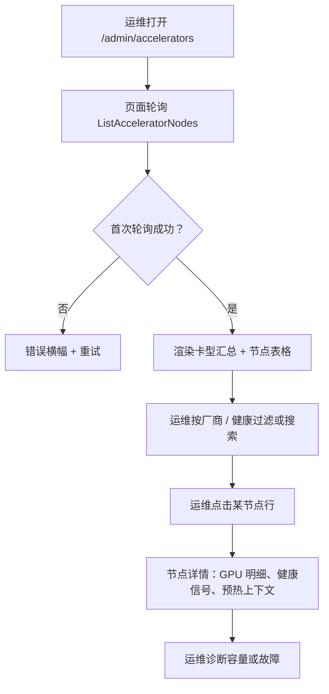

# 加速器清单与健康（GPU Operator 集成）— 需求分析与 UI/UX 设计

| 属性 | 内容 |
| --- | --- |
| 特性点 | 加速器清单与健康 —— 按节点展示 GPU 集群全貌：节点、驱动版本、设备插件状态、GPU 型号/数量/已分配-空闲、健康/就绪（backlog 第 18 行） |
| 文档范围 | 需求分析、竞品调研、`/admin/accelerators` 管理面页面设计、页面 → API 面对照表，以及编号可测的验收标准 |
| 归属模块 | `web` 管理控制台（`AcceleratorsPage`）、`pkg/server` 网关（admin 前缀绑定）、新增的加速器清单服务或对 `infer`/`image` 的扩展（节点 + GPU 清单投影）、`Controller`（节点/GPU 状态采集）、`k8s`（节点、设备插件与扩展资源读取） |
| 相关文档 | [架构设计](./architecture.zh-cn.md) — 第 2.3 节异构计算、第 2.4 节镜像模块、第 2.7 节 Controller · [镜像管理](./image-management.zh-cn.md) — 本特性提供的「节点清单」、预热任务按节点结果 · [模型目录与一键部署](./model-catalog-deployment.zh-cn.md) — 卡型（`accelerator_type`）与加速器选择 · [推理自动扩缩容](./inference-autoscaling.zh-cn.md) — 节点级容量上下文 · [控制台面分离](./console-surface-separation.zh-cn.md) — 本页面所在的管理面 |
| 状态 | 设计完成，已交付架构师智能体 |

---

## 1. 背景

go-taas 在**异构加速器**上提供推理服务 —— NVIDIA GPU、Iluvatar CoreX 与 MetaX —— 架构把驱动、设备插件与节点标签管理委托给各厂商的 GPU Operator（架构第 2.3 节）。但今天运维人员对加速器集群**没有任何可见性**。部署表单（特性 #2）允许管理员选择加速器与自由文本卡型（`A800`、`H800`、`BI-V150`），镜像模块（特性 #3）按加速器过滤镜像并上报按节点的预热结果 —— 但没有任何东西告诉运维人员：*哪些节点实际承载哪些 GPU、驱动与设备插件是否健康、每种卡型还剩多少空闲*。镜像管理设计明确把「节点清单」延后，兼容矩阵设计把「卡型清单」延后；两者都是本特性要提供的前置条件。

这个缺口带来四个具体后果，今天都能看到：

1. **盲目的容量规划。** 运维人员无法回答「我还有多少空闲 `A800`？」—— 部署表单接受任意卡型，而请求一个没有空闲容量的卡型，只会在消息到达 Controller 之后、由 Kubernetes 调度器拒绝。
2. **没有健康信号。** 一个 GPU 驱动或设备插件已降级的节点仍出现在集群里；调度到它上面的推理服务在运行时失败，却没有任何面向运维人员的解释。
3. **没有集群全貌。** 面对三家加速器厂商、各自独立的驱动与设备插件生命周期，没有一个统一的地方能看到驱动版本、节点标签与整个集群的就绪状态。
4. **矩阵没有地基。** 兼容矩阵（第 19 行）与节点级缓存清单（特性 #3 延后）都需要一个尚不存在的卡型清单。

本特性在管理控制台上新增一个**只读的加速器清单与健康视图**：一个页面列出每个计算节点、其加速器厂商、承载的 GPU 型号、已分配/空闲数量、驱动与设备插件状态、以及节点就绪度。这是 Phase 3「异构加速器」路线图条目中最小、可独立交付的增量：它给运维人员提供后续每个加速器特性（兼容矩阵、节点感知预热、容量感知部署）都依赖的集群全貌。

### 1.1 竞品如何暴露加速器/节点清单

| 产品 | 清单面 | 展示内容 | 健康信号 | 主要陷阱 |
| --- | --- | --- | --- | --- |
| **NVIDIA GPU Operator + DCGM** | `kubectl get nodes`、`nvidia-smi`、DCGM exporter 仪表盘（Grafana） | 每节点 GPU 型号、驱动版本、设备插件状态、GPU 利用率、显存、温度 | DCGM 健康检查；节点 `Ready` 条件；设备插件 `Healthy` | 裸 `kubectl`/`nvidia-smi` 输出不是产品面；仪表盘是需要运维自行拼装的独立工具 |
| **RunPod** | 控制台中的 Pod/GPU 清单 | 可用 GPU 类型、每类型数量与价格、每 Pod GPU 分配 | Pod 状态 | 无驱动/设备插件健康；清单是市场而非集群视图 |
| **Vast.ai** | 带每主机卡片的 GPU 市场 | 每主机 GPU 型号、数量、价格、利用率 | 主机在线/离线 | 面向市场；无驱动版本或设备插件细节 |
| **Lambda / 云 GPU 主机** | 实例目录 | 每实例 GPU 型号与数量 | 实例状态 | 无按节点的驱动/健康细节；目录是静态的 |
| **KServe / Kubeflow** | 通过 Kubernetes 暴露节点与加速器标签 | 节点标签、扩展资源（`nvidia.com/gpu`）、污点 | 节点条件 | 无整合的集群健康；需要 Kubernetes 知识 |
| **火山方舟 / 阿里云百炼** | 计算实例目录 | 每实例类型的 GPU 卡型与数量 | 实例状态 | 无驱动/设备插件健康；目录是静态的 |

### 1.2 归纳出的模式与决策

值得采纳的模式：(1) **以集群表格为主视图** —— 每个被调研的产品都把 GPU 展示为带型号、数量与分配的行；(2) **健康作为一等列** —— DCGM 与 Kubernetes 节点条件证明，就绪度与设备插件健康必须一眼可见，而不是埋在日志里；(3) **按卡型聚合** —— RunPod 与 Vast.ai 表明运维人员以「卡型 X 还剩多少」来思考，因此页面既需要按节点表格，也需要卡型汇总；(4) **默认只读** —— 清单是遥测而非 CRUD 面；运维人员读取它，任何变更（cordon、drain）都属于 Kubernetes 工具，不属于本页面。

要避免的陷阱：把裸 `kubectl`/`nvidia-smi` 输出当作产品面（NVIDIA）—— 页面必须是经过整理的投影；一个隐藏驱动/设备插件健康的市场（RunPod、Vast.ai）—— 健康正是本特性的意义所在；以及没有实时分配的静态目录（Lambda、云主机）—— 运维人员需要的是*当前*空闲容量。

**go-taas 的决策**：

| # | 决策 | 理由 |
| --- | --- | --- |
| D1 | **只读清单。** 页面列出节点与 GPU 并展示健康；不做任何变更（不 cordon、不 drain、不改标签） | 清单是遥测。变更属于 Kubernetes 工具，会扩大范围进入节点生命周期管理，这不是本特性 |
| D2 | **一页两视图：卡型汇总 + 按节点表格。** 汇总回答「卡型 X 还剩多少空闲」；表格回答「哪个节点、哪个驱动、什么健康」 | 运维按卡型规划容量（特性 #2 的 D1），但按节点排查问题；两个问题需要一页解决 |
| D3 | **健康是三个信号的复合**：节点 `Ready` 条件、设备插件 `Healthy` 状态、驱动版本是否存在。只有三者同时成立节点才 `Healthy` | 节点可能 `Ready` 但设备插件已降级，或设备插件在而驱动缺失；合并会掩盖失败模式 |
| D4 | **清单是 Kubernetes 节点 + 扩展资源状态的投影**，由 Controller 采集、经管理网关提供；不是新的数据库表 | 事实来源是集群（节点标签、`nvidia.com/gpu` 式扩展资源、设备插件状态）。投影避免出现与集群漂移的第二个事实来源 |
| D5 | **加速器厂商从节点标签推导**（`nvidia` / `iluvatar` / `metax`），卡型从节点上加速器专属的扩展资源名或标签推导；无加速器标签的节点显示为 `unspecified` | 与架构的节点标签模型一致（第 2.3 节）；厂商驱动图标/徽章与卡型解析 |
| D6 | **已分配 vs 空闲由节点每种卡型的可分配 vs 已分配扩展资源计算**；页面同时展示两个数字与利用率条 | 「空闲容量」是运维的规划问题；可分配/已分配是 Kubernetes 原生答案 |
| D7 | **页面仅限管理面**（`/admin/accelerators` + `/api/v1/admin/accelerators/*`）。租户永远看不到集群 | 加速器集群是运维内部的编排状态（如同推理服务的副本与镜像）；租户消费的是模型，不是节点 |
| D8 | **新增错误码 10208 `CodeAcceleratorNodeNotFound`**，用于清单中不存在的节点 id | 与按模块分配错误码的模式一致（镜像引用为 10207）；过期的节点 id 不能被静默当作空节点 |
| D9 | **清单是轮询而非推送。** 页面按间隔轮询 `ListAcceleratorNodes` 并显示最后更新时间戳；无 websocket | 与现有控制台的 `usePolling` 模式一致（特性 #17），并保持 API 无状态 |
| D10 | **卡型汇总按 `(vendor, card_type)` 分组**并显示总数/已分配/空闲/节点数；空闲为零的卡型做视觉标记 | 运维的容量问题是按卡型的；该标记在部署表单于调度器失败之前就暴露「现在无法部署这种卡型」 |

## 2. 目标与非目标

**目标**：一个只读管理页 `/admin/accelerators`，列出每个计算节点及其加速器厂商、GPU 型号、已分配/空闲数量、驱动版本、设备插件状态与就绪度（D1–D3）；一个回答「卡型 X 还剩多少空闲」的卡型汇总（D2、D10）；从节点标签与扩展资源推导厂商与卡型（D5、D6）；带逐 GPU 明细与预热任务上下文的节点详情视图（D4）；带精确管理前缀的页面 → API 面对照表（D7）；包括空态、错误态与权限拒绝态的逐页面交互状态；可在 compose 栈上由 Nightwatch 测试的编号验收标准。

**非目标**：任何节点变更（cordon、drain、改标签、驱动升级）—— D1；面向租户的加速器可见性 —— D7；兼容矩阵（第 19 行，消费本清单）；超出特性 #3 已有能力的节点感知预热定向；节点级自动扩缩容（特性 #16 延后）；Grafana 式指标仪表盘（随时间变化的利用率超出范围 —— 本页面展示时间点快照）；RDMA/网络健康（Phase 4 的独立关注点）。

## 3. 角色与旅程

| 角色 | 面 | 旅程 |
| --- | --- | --- |
| **平台运维** | admin | 打开 `/admin/accelerators` → 看到卡型汇总（「12 × A800 空闲，0 × H800 空闲」）→ 下钻到某个节点查看其驱动版本与设备插件健康 → 在调度前发现并排查一个降级节点 |
| **平台运维（容量规划）** | admin | 部署模型前，先查卡型汇总确认所需卡型有空闲容量 → 放心部署，而不是在调度器处失败 |
| **支持工程师** | admin | 租户报告一次推理调用失败 → 打开 `/admin/accelerators`，找到服务所在节点，看到解释失败的设备插件或驱动健康 |
| **租户开发者 / 智能体** | 无 | 通过 OpenAI 兼容端点消费模型；永远看不到加速器集群（D7） |

> 术语：消费侧调用方在英文中为 **Agent**，中文为「智能体」，与仓库约定一致。

## 4. 功能需求

### FR1 — 卡型汇总

- **FR1.1** 页面按 `(vendor, card_type)` 分组展示卡型汇总：**厂商**（徽章：nvidia / iluvatar / metax / unspecified）、**卡型**（如 `A800`、`H800`、`BI-V150`）、**GPU 总数**、**已分配**、**空闲**、**节点数**（承载该卡型的节点数量），以及**利用率条**（已分配/总数）。
- **FR1.2** 空闲 GPU 为零的卡型以「无空闲容量」徽章与弱化行样式标记；总数为零的卡型不展示。
- **FR1.3** 汇总按厂商排序，再按空闲容量升序（最紧缺的排最前），让运维一眼看到稀缺。

### FR2 — 按节点表格

- **FR2.1** 页面以表格列出计算节点：**节点**（名称）、**厂商**（徽章）、**卡型**（逗号分隔）、**GPU**（已分配/空闲）、**驱动版本**、**设备插件**（Healthy / Degraded / Unknown 徽章）、**就绪度**（Ready / NotReady / Unknown 徽章）、**健康**（复合徽章：Healthy / Degraded / Unknown）、**最后更新**（相对时间）。
- **FR2.2** 列表可按厂商（nvidia / iluvatar / metax / unspecified）与健康（Healthy / Degraded / Unknown）过滤，可按节点名搜索，并分页（`offset`/`limit`，默认 20，最大 100）。
- **FR2.3** 空态文案为「未找到加速器节点 —— 请安装 GPU Operator 并为计算节点打标签」，并附链接指向架构的异构计算章节。当任一受支持厂商（nvidia / iluvatar / metax）节点数为零时，显示横幅。
- **FR2.4** 节点行可展开（或链接到详情视图）展示逐 GPU 明细：每个 GPU 的索引、型号、已分配/空闲，以及任何逐 GPU 健康备注。

### FR3 — 节点详情

- **FR3.1** 点击节点打开详情视图，展示：节点名、厂商、就绪度、设备插件状态、驱动版本、节点标签（加速器相关）、污点、完整逐 GPU 明细，以及节点每种卡型的可分配 vs 已分配扩展资源。
- **FR3.2** 详情视图展示该节点的**预热任务上下文**（特性 #3）：任何定向到该节点的预热任务及其按节点结果，让运维能把「节点是冷的」与「预热在这里失败」关联起来。
- **FR3.3** 缺失的节点 id 返回新的 **10208 `CodeAcceleratorNodeNotFound`**，页面显示「未找到节点 —— 可能已被移除」状态并附返回列表的链接。

### FR4 — 健康语义

- **FR4.1** 健康是节点 `Ready`、设备插件 `Healthy` 与驱动版本存在三者的复合（D3）。页面展示复合徽章，详情视图分别展示三个底层信号。
- **FR4.2** 无加速器标签的节点显示为厂商 `unspecified`，其健康仅基于节点就绪度；仍会列出，让运维能看到未打标签的节点。

### FR5 — 面与 API 绑定

- **FR5.1** 页面位于**管理面**：路由 `/admin/accelerators`，API 前缀 `/api/v1/admin/accelerators/*`。加入 `AdminShell` 导航（特性 #17），名为「Accelerators」。
- **FR5.2** 页面只调用 `/api/v1/admin/accelerators/*` 路由；不含任何 `/api/v1/*`（用户前缀）字符串（特性 #17，D8）。
- **FR5.3** 清单按间隔轮询（默认 30 秒）并显示最后更新时间戳（D9）；轮询失败时显示过期数据横幅，而不是清空表格。

## 5. UI 设计

### 5.1 页面：`/admin/accelerators` — 加速器清单与健康

**目的**：让平台运维人员以只读、一览无余的方式查看异构加速器集群 —— 按卡型的容量与按节点的健康 —— 从而无需 Kubernetes 工具即可完成容量规划与故障诊断。

**面**：admin —— 路由 `/admin/accelerators`，API `/api/v1/admin/accelerators/*`。

**布局**：渲染在 `AdminShell`（特性 #17）内。页面头部（「Accelerators」，副标题「跨 NVIDIA、Iluvatar CoreX 与 MetaX 的 GPU 集群容量与健康」）带**刷新**操作（次要）与**最后更新**时间戳。头部下方是两个堆叠区域：

1. **卡型汇总** —— 一排汇总卡片（每个 `(vendor, card_type)` 一张），各显示厂商徽章、卡型、`空闲 / 总数` GPU、利用率条，以及空闲为零时的「无空闲容量」标记。当某受支持厂商节点数为零时，区域上方显示「0 节点」横幅。
2. **节点表格** —— 按节点表格（FR2.1），带厂商与健康过滤、节点名搜索与分页。每行的**节点**单元格链接到详情视图。

**交互状态**：

| 状态 | 行为 |
| --- | --- |
| 默认 | 首次成功轮询后渲染汇总卡片 + 节点表格；最后更新显示轮询时间 |
| 加载中 | 表格骨架行 + 汇总卡片骨架；刷新被禁用 |
| 空态 | 「未找到加速器节点 —— 请安装 GPU Operator 并为计算节点打标签」并附链接指向架构的异构计算章节；厂商横幅列出节点数为零的厂商 |
| 错误 | 错误横幅带消息与重试按钮；表格保留最后的好数据并显示「正在显示过期数据」横幅（FR5.3） |
| 禁用 | 轮询进行中时刷新被禁用；过滤始终可用 |
| 权限拒绝 | 无所需角色的会话收到 10036，页面显示标准权限拒绝状态（特性 #17）并附返回管理首页的链接 |

**过滤**：厂商（下拉：全部 / nvidia / iluvatar / metax / unspecified）、健康（下拉：全部 / Healthy / Degraded / Unknown）、节点名（文本搜索）。通过 `ListAcceleratorNodes` 参数做服务端过滤；分页 `offset`/`limit`。

**表格列**：节点（链接）、厂商（徽章）、卡型、GPU（已分配/空闲）、驱动版本、设备插件（徽章）、就绪度（徽章）、健康（复合徽章）、最后更新（相对时间）。可按节点、空闲 GPU、最后更新排序。

### 5.2 页面：`/admin/accelerators/:nodeId` — 节点详情

**目的**：展示单个节点的一切 —— 逐 GPU 明细、驱动/设备插件健康信号、标签/污点、预热任务上下文 —— 让运维能诊断失败或确认容量。

**面**：admin —— 路由 `/admin/accelerators/:nodeId`，API `/api/v1/admin/accelerators/{node_id}`。

**布局**：`AdminShell` 下的详情页，带返回列表的返回链接。头部为节点名与复合健康徽章。下方堆叠卡片：

1. **概览** —— 厂商、就绪度、设备插件状态、驱动版本、最后更新。
2. **GPU 明细** —— 逐 GPU 行表格：索引、型号、已分配/空闲、健康备注。
3. **资源** —— 每种卡型的可分配 vs 已分配扩展资源，带利用率条。
4. **标签与污点** —— 加速器相关的节点标签与污点（只读）。
5. **预热上下文** —— 定向到该节点的预热任务及其按节点结果（特性 #3）。

**交互状态**：加载中（骨架）、错误（横幅 + 重试）、未找到（10208 →「未找到节点 —— 可能已被移除」+ 返回链接）、权限拒绝（10036 → 标准状态）。

### 5.3 流程

## 6. API 面影响

所有路由都在**管理前缀** `/api/v1/admin/accelerators/*` 上（D7）。清单是 Controller 采集的 Kubernetes 节点 + 扩展资源状态的投影（D4）。

| RPC | 路由 | 状态 | 用途 |
| --- | --- | --- | --- |
| `ListAcceleratorNodes` | `GET /api/v1/admin/accelerators/nodes` | **新增** | 集群列表，带厂商/健康过滤、搜索、分页；返回按节点汇总（厂商、卡型、已分配/空闲、驱动、设备插件、就绪度、健康、最后更新） |
| `GetAcceleratorNode` | `GET /api/v1/admin/accelerators/nodes/{node_id}` | **新增** | 节点详情：逐 GPU 明细、标签、污点、资源、预热任务上下文 |
| `ListCardTypeSummary` | `GET /api/v1/admin/accelerators/card-types` | **新增** | `(vendor, card_type)` → 总数 / 已分配 / 空闲 / 节点数，供汇总条使用 |

**给架构师智能体的契约说明**：

1. `ListAcceleratorNodes` 支持 `vendor` 与 `health` 过滤、`search`（节点名）与 `offset`/`limit` 分页；`AcceleratorNodeSummary` 携带 `node_id`、`name`、`vendor`、`card_types[]`、`gpus_allocated`、`gpus_free`、`driver_version`、`device_plugin_state`（healthy / degraded / unknown）、`readiness`（ready / not_ready / unknown）、`health`（healthy / degraded / unknown）、`last_updated_at`。
2. `GetAcceleratorNode` 返回汇总外加 `gpus[]`（index、model、allocated、free、note）、`labels`、`taints`、`resources[]`（card_type、allocatable、allocated）与 `warmup_tasks[]`（task_id、state、按节点结果）。
3. `ListCardTypeSummary` 返回 `(vendor, card_type, total, allocated, free, node_count)` 行，按厂商再按空闲升序排序。
4. 缺失的 `node_id` 返回 **10208 `CodeAcceleratorNodeNotFound`**（D8）。
5. 健康由服务端计算为就绪度、设备插件状态与驱动存在的复合（D3）；客户端只渲染徽章，不计算。

## 7. 验收标准

| # | 标准 | 层级 |
| --- | --- | --- |
| AC1 | `ListAcceleratorNodes` 返回每个已打标签的计算节点及其厂商、卡型、已分配/空闲 GPU 数、驱动版本、设备插件状态、就绪度与复合健康；未打标签节点为 `unspecified` | FVT |
| AC2 | `ListCardTypeSummary` 返回按厂商再按空闲升序排序的 `(vendor, card_type, total, allocated, free, node_count)` 行，并省略总数为零的卡型 | FVT |
| AC3 | `GetAcceleratorNode` 返回逐 GPU 明细、标签、污点、资源与预热任务上下文；缺失的 `node_id` 返回 10208 | FVT |
| AC4 | 仅当就绪度为 `ready`、设备插件为 `healthy` 且存在驱动版本时健康才为 `healthy`；任一失败都会使复合降级 | 单元测试 + FVT |
| AC5 | `/admin/accelerators` 页面在首次成功轮询后渲染卡型汇总条与节点表格，并带最后更新时间戳 | E2E |
| AC6 | 页面的厂商与健康过滤、节点名搜索与分页针对服务端参数生效 | E2E |
| AC7 | 空闲 GPU 为零的卡型显示「无空闲容量」标记；节点数为零的受支持厂商显示厂商横幅 | E2E |
| AC8 | 清单为空时渲染空态（「未找到加速器节点…」） | E2E |
| AC9 | 轮询失败时保留最后的好数据并显示「正在显示过期数据」横幅与重试操作 | E2E |
| AC10 | 节点详情页展示逐 GPU 明细、健康信号、资源与预热上下文；缺失节点显示 10208 未找到状态 | E2E |
| AC11 | 页面仅在管理面可达：位于 `AdminShell` 导航中，路由为 `/admin/accelerators`，其每次 API 调用都使用 `/api/v1/admin/accelerators/*` 前缀且不含 `/api/v1/*` 字符串 | E2E（面分离） |
| AC12 | 无所需角色的会话收到 10036，页面显示标准权限拒绝状态 | E2E |

## 8. 范围外（另行跟踪）

| 项 | 位置 |
| --- | --- |
| 模型 × 引擎 × 卡型兼容矩阵 | 第 19 行（消费本清单） |
| 超出特性 #3 节点选择器的节点感知预热定向 | 特性 #3 |
| 节点级自动扩缩容 / 垂直 GPU 规格 | 特性 #16 后续 |
| 节点变更（cordon、drain、改标签、驱动升级） | Kubernetes 工具，非控制台特性 |
| 随时间变化的利用率指标仪表盘 | 未来可观测性特性 |
| RDMA / 网络健康 | Phase 4 网络关注点 |
| 面向租户的加速器可见性 | 刻意缺失（D7） |