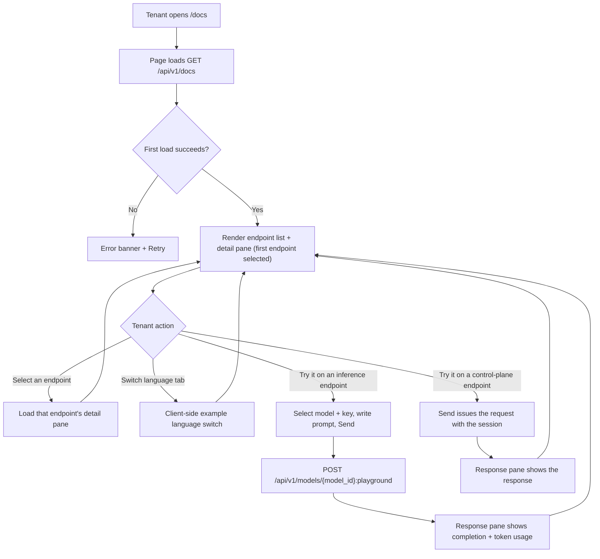
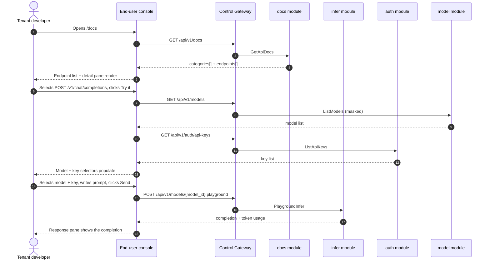

# API Documentation Explorer — Requirement Analysis and UI/UX Design

| Attribute | Content |
| --- | --- |
| Feature point | API documentation explorer — an interactive API reference page with endpoint list, request/response examples, and try-it-in-console (backlog row 38) |
| Document scope | Requirement analysis, competitive research, the end-user-surface API docs page for `/docs`, the page → API surface table, and numbered acceptance criteria |
| Owning modules | `docs` (new — serves the curated user-realm API catalog), `pkg/server` gateway (user-prefix bindings), `web` end-user console (`ApiDocsPage` in `UserShell`), `infer` (reused: the model-based playground proxy for try-it), `auth` (reused: API-key list for try-it), `model` (reused: masked model list for try-it) |
| Related documents | [Architecture Design](./architecture.md) — §3.2 data-plane gateway, §3.3 API-key authentication chain · [Console Surface Separation](./console-surface-separation.md) — the end-user surface this page lives on, the `UserShell` conventions, the masked-projection rule · [SDK / Quickstart](./sdk-quickstart.md) — the sibling onboarding page and its language-tab / base-URL / playground-proxy conventions · [Request Logs & API Playground](./request-logs-playground.md) — the `PlaygroundInfer` proxy this feature reuses for try-it · [Model Catalog & One-Click Deployment](./model-catalog-deployment.md) — the model list this page consumes |
| Status | Design complete, handed to the Architect agent |

---

## 1. Background and Competitive Research

### 1.1 Why the API Docs Explorer Comes Now

go-taas sells OpenAI-compatible inference access to **Agents / SDKs**. The quickstart page (feature #21) walks a tenant through the four steps to a working integration — key, model, base URL, and a canonical snippet. But a tenant who wants to go beyond the quickstart's three canned snippets — to call embeddings, to understand the exact request/response shape of every endpoint, to see the error codes, or to try an endpoint interactively — has nowhere to go. The generated `docs/api/taas/*/v1/*.swagger.json` files exist in the repository but are not served in the console, they include admin endpoints, and they do not document the data-plane inference API (`/v1/chat/completions`, `/v1/embeddings`) that Agents actually call. A tenant must leave the platform and read external documentation that does not exist yet.

This feature adds an **API documentation explorer**: an interactive API reference page with an endpoint list, request/response examples, and try-it-in-console. It is the smallest independently valuable increment of the "developer onboarding" story: it turns "I have a working quickstart snippet" into "I can discover every endpoint I am allowed to call, see its exact shape, and try it in the console". It is a **read-only** surface — nothing in the inference, metering, or billing pipelines changes.

### 1.2 How Comparable Products Expose an API Reference

| Product | API reference surface | Endpoint list | Request/response examples | Try-it-in-console | Notable pitfalls |
| --- | --- | --- | --- | --- | --- |
| **OpenAI Platform** | Docs site API reference | Grouped by resource | Per-endpoint request/response JSON | No in-console try-it (docs only) | Docs are a separate site, not in the console; no live try-it |
| **Stripe** | Docs API reference | Grouped by resource | Per-endpoint examples with language tabs | No in-console try-it (docs only) | Docs are a separate site; examples assume the Stripe API key |
| **Swagger UI** | Interactive API reference generated from OpenAPI | Grouped by tag | Per-operation request/response | **Yes** — "Try it out" sends a real request | Generated from the raw spec; exposes every endpoint including admin/operator internals; no curated user view |
| **ReadMe** | Interactive API reference from OpenAPI | Grouped by category | Per-endpoint examples with language tabs | **Yes** — "Try It!" sends a real request | Third-party SaaS; requires an OpenAPI spec; try-it needs auth wiring |
| **Postman** | API reference + collection runner | Grouped by collection | Per-request examples | **Yes** — send from the collection | Heavy desktop tool; not a console surface |
| **Anthropic Console** | Docs + workbench | Grouped by resource | Per-endpoint examples | Workbench try-it | Message format is **not** OpenAI-compatible |

### 1.3 Distilled Patterns and Decisions

Patterns worth adopting:

1. **A two-pane layout: endpoint list on the left, detail pane on the right** — Swagger UI, ReadMe, Stripe, and OpenAI all use a left nav of endpoints grouped by category and a right detail pane with the method, path, parameters, and examples.
2. **Request/response examples per endpoint** — every product shows a real request/response pair; ReadMe and Stripe add language tabs (Python / Node / curl).
3. **Try-it-in-console** — Swagger UI's "Try it out" and ReadMe's "Try It!" send a real request and show the response; this is the interaction that turns documentation into a working integration.
4. **A curated, user-realm catalog** — Swagger UI's pitfall is exposing every endpoint from the raw spec; go-taas must curate a small, scannable set of the endpoints a tenant/Agent can actually call, with no admin endpoints and no operator internals.
5. **Error-code documentation** — ReadMe's best practice is to document error codes and how to resolve them; the explorer shows the error codes each endpoint can return.

Pitfalls to avoid: exposing the raw generated spec (Swagger UI) — the swagger.json files include admin endpoints and operator internals, so the explorer must serve a curated user-realm projection; a separate docs site (OpenAI, Stripe) — go-taas owns the docs in its own console; a non-OpenAI-compatible schema (Anthropic) — go-taas is OpenAI-compatible, so the inference examples must use `chat.completions`; try-it that bypasses metering — the inference try-it must go through the real metered path (the playground proxy); and persisting secrets into examples — the try-it uses the tenant's own key/session, never a stored secret.

**Decisions for go-taas** (recorded rationale, per the autonomous-decision rule):

| # | Decision | Rationale |
| --- | --- | --- |
| D1 | **The API docs explorer lives on the end-user surface only**: route `/docs`, API prefix `/api/v1/docs/*`. It is added to the `UserShell` navigation as "API Docs" (「API 文档」). There is **no admin surface** — the docs explorer is for API consumers (Agents/SDKs) discovering the endpoints they can call; the admin console has its own operational pages | The docs explorer answers the tenant's "what can I call and how" question; the operator's operational pages are already surfaced in the admin console. Consistent with the end-user-only quickstart (feature #21) |
| D2 | **The catalog is served by a new user-realm endpoint `GET /api/v1/docs`** returning a curated, user-realm API catalog: endpoints grouped by category, each with method, path, parameters, request/response examples, and error codes. It is a **curated projection** — it lists only the endpoints a tenant/Agent can call (the OpenAI-compatible inference API plus the user-realm control-plane APIs), and never exposes admin endpoints or operator internals | The generated swagger.json files include admin endpoints and omit the data-plane inference API; a curated catalog keeps the surface controlled, scannable, and testable (the "curated, scannable set" pattern) |
| D3 | **The catalog is curated server-side in a new `docs` module** (a static, versioned catalog), not derived from the swagger.json at runtime | The swagger.json files are generated from protos and include admin endpoints; the docs explorer needs a curated user-realm view with OpenAI-compatible inference examples that are not in the protos. A curated catalog keeps the surface controlled and testable |
| D4 | **Try-it-in-console works on every endpoint in the catalog.** For the **inference API** endpoints (`/v1/chat/completions`, `/v1/embeddings`), try-it reuses the model-based playground proxy `POST /api/v1/models/{model_id}:playground` (feature #12 D14) with a selected model and API key, so the call goes through the real metered path. For **control-plane** endpoints, try-it issues the actual request with the user's session token and shows the response | The inference try-it must exercise the real metered path so test calls are visible in usage (the Chinese-platform pitfall); the playground proxy already exists and routes through the real path. Control-plane try-it uses the user's own session, so it is authorized and testable |
| D5 | **The page is a two-pane layout**: a left endpoint list grouped by category, and a right detail pane with the method, path, parameters, request/response examples, error codes, and a "Try it" panel | Swagger UI, ReadMe, Stripe, and OpenAI all use this layout; it is the canonical API-reference interaction |
| D6 | **Code examples use language tabs Python / Node / curl**, each with a copy button, consistent with the quickstart (feature #21 D6) | The standard trio; copy buttons are the primary interaction |
| D7 | **The catalog is versioned and read-only** — it is a static, versioned projection; the page writes nothing and mutates nothing, and is audited only for access | The feature is a pure read of a curated catalog; the audit trail (feature #15) already covers the underlying writes. No new audit events are needed |
| D8 | **New error codes in a docs block (12201–12299)**: **12201 `CodeDocsEndpointNotFound`** (an unknown endpoint id in the catalog). No range validation is needed (the catalog is a static projection) | The docs module is new (D3), so its codes live in a fresh block after the resource-metrics block (121xx); distinct not-found keeps "unknown endpoint" actionable |

### 1.4 Scope Boundary

**In scope**: an end-user API docs page (`/docs`) with a two-pane layout (endpoint list + detail pane), request/response examples with language tabs, error-code documentation, and try-it-in-console for every catalog endpoint; a new `docs` module serving the curated user-realm catalog; and the try-it wiring that reuses the playground proxy and the user's session.

**Out of scope** (tracked by other feature points): the quickstart onboarding flow (feature #21 — the sibling page with the three canonical snippets); an admin-surface API reference (deliberately absent, D1); a full OpenAPI/Swagger UI renderer of the raw generated specs (deliberately absent, D2 — the catalog is curated); request/response body capture or a persistent "my requests" list (the try-it is stateless); and any change to the inference, metering, or billing pipelines (read-only feature).

---

## 2. User Roles

| Role | Description | Interaction with the API docs explorer |
| --- | --- | --- |
| **Tenant developer / Agent** | The consumer who builds an integration against the go-taas inference API | Opens `/docs`, browses the endpoint list, reads request/response examples, and tries endpoints in the console to verify the integration |
| **Platform administrator** | The operator who runs the go-taas cluster | Never uses the docs explorer; manages the platform through the admin console's operational pages |

> Terminology: the consumer-side caller is called an **Agent** (English) / 「智能体」(Chinese), consistent with the repo convention. This feature is end-user-only, so the operator-side terminology does not apply to a tenant surface.

---

## 3. User Stories

| # | As a… | I want to… | So that… |
| --- | --- | --- | --- |
| US1 | Tenant developer | open `/docs` and see every endpoint I am allowed to call, grouped by category | I can discover the API surface without leaving the platform |
| US2 | Tenant developer | read the request/response examples for an endpoint in Python / Node / curl | I can copy a working call into my Agent |
| US3 | Tenant developer | see the error codes an endpoint can return | I can handle failures correctly |
| US4 | Tenant developer | try an endpoint in the console | I can verify the integration works before writing code |
| US5 | Tenant developer | try the inference API with my own model and key | I can confirm a real metered call succeeds |
| US6 | Agent / SDK | call the inference endpoint with an API key | I get completions without touching the docs page |

---

## 4. Functional Requirements

### FR1 — Curated user-realm catalog

- **FR1.1** `GET /api/v1/docs` returns the curated user-realm API catalog: `categories[]`, each with `category_id`, `category_name`, and `endpoints[]`. Each endpoint carries `endpoint_id`, `method` (`GET` / `POST` / `PUT` / `DELETE`), `path`, `summary`, `description`, `parameters[]` (each with `name`, `in` (`path` / `query` / `body` / `header`), `required`, `type`, `description`), `request_example` (JSON string), `response_example` (JSON string), `error_codes[]` (each with `code`, `constant`, `message`), and `tryable` (whether try-it is available).
- **FR1.2** The catalog covers the **inference API** (data plane, OpenAI-compatible): `POST /v1/chat/completions` and `POST /v1/embeddings`; and the **user-realm control-plane** APIs: `GET /api/v1/models`, `GET /api/v1/auth/api-keys`, `POST /api/v1/auth/api-keys`, `GET /api/v1/usage`, and `GET /api/v1/inference-endpoint`.
- **FR1.3** The catalog never exposes admin endpoints (`/api/v1/admin/*`) or operator internals (service ids, replica counts, pod names) (D2).
- **FR1.4** An unknown `endpoint_id` in a try-it or detail request returns **12201 `CodeDocsEndpointNotFound`** (D8).

### FR2 — API docs page structure and navigation

- **FR2.1** The end-user console gains a `/docs` route rendered inside `UserShell` (D1). The `UserShell` navigation gains an item "API Docs" (`user-nav-api-docs`).
- **FR2.2** The page is a two-pane layout (D5): a left **endpoint list** grouped by category, and a right **detail pane** for the selected endpoint.

### FR3 — Endpoint detail pane

- **FR3.1** The detail pane shows the selected endpoint's method badge, path, summary, description, parameters (with name, location, required, type, description), request example, response example, and error codes.
- **FR3.2** Code examples use language tabs **Python / Node / curl** (`docs-lang-python`, `docs-lang-node`, `docs-lang-curl`), each with a copy button (`docs-copy`). The active example is templated with the inference base URL (from `GET /api/v1/inference-endpoint`) and the tenant's selected key or `YOUR_API_KEY` placeholder (D6).

### FR4 — Try-it-in-console

- **FR4.1** The detail pane includes a **Try it** panel (`docs-try-it`) for every `tryable` endpoint. For the **inference API** endpoints, the panel has a model selector (from `GET /api/v1/models`), a key selector (from `GET /api/v1/auth/api-keys`), and a prompt editor; **Send** (`docs-try-send`) calls `POST /api/v1/models/{model_id}:playground` (reused, feature #12 D14) and shows the completion plus token usage in a response pane (`docs-try-response`) (D4).
- **FR4.2** For **control-plane** endpoints, the Try it panel shows the request (with the user's session token) and a **Send** button that issues the actual request, showing the response in the response pane (D4).
- **FR4.3** Send is disabled until the endpoint's required inputs are set (a model and key for inference endpoints; no extra inputs for control-plane reads). A failed call renders the error inline in the response pane.

### FR5 — Interactive states

- **FR5.1** The page implements the six interactive states (default, loading, empty, error, disabled, permission-denied) with the copy given per section in §5.
- **FR5.2** Every control carries a `data-testid` in the console's `kebab-case` style (`docs-endpoint-list`, `docs-endpoint-{endpoint_id}`, `docs-lang-python`, `docs-copy`, `docs-try-it`, `docs-try-send`, `docs-try-response`, …).
- **FR5.3** Error copy maps business codes to sentences (never a bare code), per the console's centralized mapping.

### FR6 — Surface and API binding

- **FR6.1** The API docs page lives on the **end-user surface**: route `/docs`, API prefix `/api/v1/docs/*` (D1).
- **FR6.2** The page calls only `/api/v1/*` routes: `GET /api/v1/docs` (new), `GET /api/v1/models`, `GET /api/v1/auth/api-keys`, `GET /api/v1/inference-endpoint`, and `POST /api/v1/models/{model_id}:playground`. It contains no `/api/v1/admin/*` string (feature #17, D1).
- **FR6.3** The new `GET /api/v1/docs` is a user-realm read; there is no admin-surface variant in this feature.

---

## 5. Page and Flow Design

### 5.1 Surface Assignment

| Feature | Surface | Web route | API prefix |
| --- | --- | --- | --- |
| API docs catalog (new) | end-user | `/docs` | `/api/v1/docs` |
| Masked model list (reused) | end-user | `/docs` (try-it) | `/api/v1/models` |
| API-key list (reused) | end-user | `/docs` (try-it) | `/api/v1/auth/api-keys` |
| Inference base URL (reused) | end-user | `/docs` (examples) | `/api/v1/inference-endpoint` |
| Inference try-it (reused) | end-user | `/docs` (try-it) | `/api/v1/models/{model_id}:playground` |

### 5.2 Page Map

| Page / component | Purpose |
| --- | --- |
| **API Docs page** (`/docs`) | Interactive API reference: endpoint list grouped by category, detail pane with method/path/parameters/examples/error codes, and try-it-in-console |

### 5.3 Page: `/docs` — API Docs (end-user)

**Purpose**: give the tenant developer a single surface to discover every endpoint they can call, read its exact request/response shape, and try it in the console.

**Surface**: end-user — route `/docs`, API `/api/v1/docs/*`.

**Layout**: rendered inside `UserShell` (feature #17). A page header ("API Docs", subtitle "Reference for the go-taas inference and account APIs") with a **Refresh** action (secondary). Below, a two-pane layout (D5):

1. **Left: endpoint list** — grouped by category (Inference / Models / API Keys / Usage / Inference endpoint). Each endpoint is a row with a method badge and the path; clicking selects it.
2. **Right: detail pane** — for the selected endpoint: the method badge and path, a summary, a description, a **Parameters** section (name, location, required, type, description), a **Request** section with language tabs (Python / Node / curl) and a copy button, a **Response** section with the response example, an **Error codes** section, and a **Try it** panel.

**Interactive states**:

| State | Behaviour |
| --- | --- |
| Default | Endpoint list + detail pane render from the first successful load; the first endpoint in the first category is selected |
| Loading | Skeleton list and detail pane; Refresh is disabled |
| Empty | "No API documentation available." with a hint that the catalog appears after the platform starts; the list stays visible |
| Error | An error banner with the message and a Retry button; the page keeps its last good data with a "Showing stale data" banner |
| Disabled | Refresh is disabled while a load is in flight; Try-it Send is disabled until the endpoint's required inputs are set |
| Permission-denied | A session without the required role receives 10036 and the page shows the standard permission-denied state (feature #17) with a link back to the user home |

**Endpoint list**: grouped by category; each row shows a method badge (GET green, POST blue, PUT amber, DELETE red) and the path. Clicking a row selects it and loads the detail pane.

**Detail pane**: method badge + path, summary, description, Parameters (name, location, required, type, description), Request (language tabs + copy button), Response (response example), Error codes (code, constant, message), and Try it panel.

**Try it panel**: for inference endpoints, a model selector, a key selector, and a prompt editor; Send calls the playground proxy and shows the completion + token usage. For control-plane endpoints, Send issues the actual request with the user's session and shows the response.

### 5.4 Flows

---

## 6. API Surface Implications

The docs RPC belongs to the **`docs` module** (D3), served as HTTP via the Control Gateway on the **user prefix** `/api/v1/docs` (D1). The try-it reuses the existing `infer` playground proxy, the `auth` API-key list, and the `model` masked model list (D4). There is **no admin-prefix binding** (D1).

| RPC | Route | Prefix | Status | Purpose |
| --- | --- | --- | --- | --- |
| `GetApiDocs` (`taas.docs.v1`) | `GET /api/v1/docs` | user | **new** | Return the curated user-realm API catalog: categories, endpoints, parameters, examples, and error codes |

**Contract notes for the Architect agent**:

1. `GetApiDocs` returns `categories[]`, each with `category_id`, `category_name`, and `endpoints[]`. Each endpoint carries `endpoint_id`, `method`, `path`, `summary`, `description`, `parameters[]`, `request_example`, `response_example`, `error_codes[]`, and `tryable` (FR1.1).
2. The catalog is a static, versioned projection in the `docs` module (D3); it is not derived from the swagger.json at runtime. It covers the inference API (`/v1/chat/completions`, `/v1/embeddings`) and the user-realm control-plane APIs (`/api/v1/models`, `/api/v1/auth/api-keys`, `/api/v1/usage`, `/api/v1/inference-endpoint`), and never exposes admin endpoints or operator internals (FR1.3).
3. Try-it for inference endpoints reuses `POST /api/v1/models/{model_id}:playground` (feature #12 D14) with a selected model and key, so the call goes through the real metered path (D4). Try-it for control-plane endpoints issues the actual request with the user's session token (D4).
4. Wire conventions unchanged: HTTP 200 on success, business errors as `{"code": <int>, "message": "..."}`, int64 fields serialized as JSON strings.

Error codes (existing blocks, `pkg/errors/codes.go`):

| Condition | Code | Constant | Notes |
| --- | --- | --- | --- |
| Unknown `endpoint_id` | 12201 | `CodeDocsEndpointNotFound` | **New** (D8) |

---

## 7. Acceptance Criteria

| # | Criterion | Level |
| --- | --- | --- |
| AC1 | `GetApiDocs` returns the curated user-realm catalog with categories, endpoints, parameters, request/response examples, and error codes; it exposes no `/api/v1/admin/*` endpoint and no operator internals | FVT |
| AC2 | The catalog covers the inference API (`/v1/chat/completions`, `/v1/embeddings`) and the user-realm control-plane APIs (`/api/v1/models`, `/api/v1/auth/api-keys`, `/api/v1/usage`, `/api/v1/inference-endpoint`) | FVT |
| AC3 | The `/docs` page renders the endpoint list grouped by category and the detail pane for the first endpoint from the first successful load | E2E |
| AC4 | Selecting an endpoint loads its detail pane; the language tabs switch the example client-side; the copy button copies the active example | E2E |
| AC5 | Try-it on an inference endpoint populates the model and key selectors, sends via `POST /api/v1/models/{model_id}:playground`, and shows the completion plus token usage in the response pane | E2E |
| AC6 | Try-it on a control-plane endpoint issues the actual request with the user's session and shows the response; Send is disabled until the endpoint's required inputs are set | E2E |
| AC7 | The API docs page is reachable only on the end-user surface: route `/docs`, every API call uses the `/api/v1/*` prefix with no `/api/v1/admin/*` string | E2E (surface separation) |
| AC8 | A session without the required role receives 10036 on the `/docs` page and the page shows the standard permission-denied state | E2E |

---

## 8. Out of Scope (tracked elsewhere)

| Item | Where |
| --- | --- |
| The quickstart onboarding flow (key → model → base URL → snippet) | Feature #21 SDK / Quickstart |
| An admin-surface API reference | Deliberately absent (D1) — the docs explorer is for API consumers |
| A full OpenAPI/Swagger UI renderer of the raw generated specs | Deliberately absent (D2) — the catalog is curated |
| Request/response body capture or a persistent "my requests" list | The try-it is stateless |
| Any change to the inference, metering, or billing pipelines | Read-only feature |