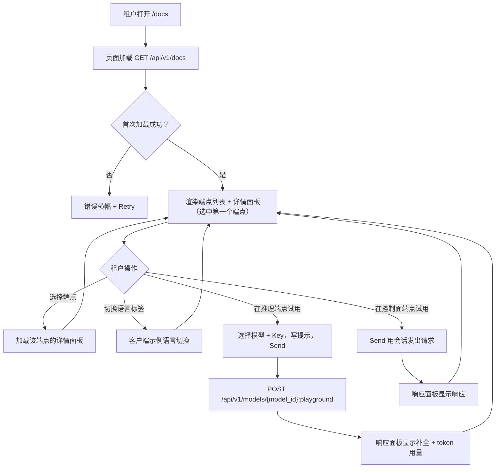
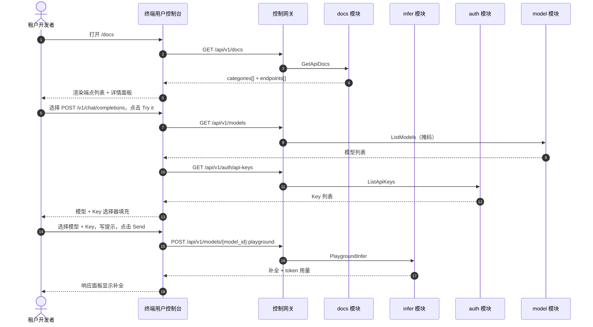

# API 文档浏览器 — 需求分析与 UI/UX 设计

| 属性 | 内容 |
| --- | --- |
| 特性点 | API 文档浏览器 — 交互式 API 参考页，含端点列表、请求/响应示例与控制台内试用（backlog 第 38 行） |
| 文档范围 | 需求分析、竞品调研、`/docs` 终端用户面 API 文档页、页面 → API 面映射表，以及编号验收标准 |
| 归属模块 | `docs`（新增 — 提供精选的用户面 API 目录）、`pkg/server` 网关（用户前缀绑定）、`web` 终端用户控制台（`UserShell` 中的 `ApiDocsPage`）、`infer`（复用：试用用的基于模型的 playground 代理）、`auth`（复用：试用用的 API Key 列表）、`model`（复用：试用用的掩码模型列表） |
| 相关文档 | [架构设计](./architecture.md) — 第 3.2 节数据面网关、第 3.3 节 API Key 认证链 · [控制台面分离](./console-surface-separation.md) — 本页面所在的终端用户面、`UserShell` 约定、掩码投影规则 · [SDK / 快速开始](./sdk-quickstart.md) — 姊妹引导页及其语言标签 / 基础 URL / playground 代理约定 · [请求日志与 API Playground](./request-logs-playground.md) — 本特性试用复用的 `PlaygroundInfer` 代理 · [模型目录与一键部署](./model-catalog-deployment.md) — 本页面消费的模型列表 |
| 状态 | 设计完成，已移交架构师代理 |

---

## 1. 背景与竞品调研

### 1.1 为什么现在做 API 文档浏览器

go-taas 向**智能体 / SDK** 出售 OpenAI 兼容的推理访问。快速开始页（特性 #21）引导租户完成集成四步 — Key、模型、基础 URL 与规范代码片段。但想超越快速开始三个固定片段的租户 — 想调用 embeddings、理解每个端点的精确请求/响应形状、查看错误码、或在控制台内交互式试用端点 — 无处可去。仓库中的 `docs/api/taas/*/v1/*.swagger.json` 生成文件存在但未在控制台提供，它们包含管理端点，且未记录智能体实际调用的数据面推理 API（`/v1/chat/completions`、`/v1/embeddings`）。租户必须离开平台去读尚不存在的外部文档。

本特性新增**API 文档浏览器**：交互式 API 参考页，含端点列表、请求/响应示例与控制台内试用。这是「开发者引导」故事中最小可独立交付的增量：它把「我有可用的快速开始片段」变成「我能发现每个被允许调用的端点、看到其精确形状、并在控制台内试用」。它是**只读**面 — 推理、计量或计费管线均无改动。

### 1.2 竞品如何呈现 API 参考

| 产品 | API 参考面 | 端点列表 | 请求/响应示例 | 控制台内试用 | 主要陷阱 |
| --- | --- | --- | --- | --- | --- |
| **OpenAI Platform** | 文档站 API 参考 | 按资源分组 | 每端点请求/响应 JSON | 无控制台内试用（仅文档） | 文档是独立站点，不在控制台内；无实时试用 |
| **Stripe** | 文档 API 参考 | 按资源分组 | 每端点示例带语言标签 | 无控制台内试用（仅文档） | 文档是独立站点；示例假定 Stripe API Key |
| **Swagger UI** | 从 OpenAPI 生成的交互式 API 参考 | 按 tag 分组 | 每操作请求/响应 | **有** —「Try it out」发送真实请求 | 从原始规范生成；暴露每个端点含管理/运营者内部信息；无精选用户视图 |
| **ReadMe** | 从 OpenAPI 生成的交互式 API 参考 | 按类别分组 | 每端点示例带语言标签 | **有** —「Try It!」发送真实请求 | 第三方 SaaS；需要 OpenAPI 规范；试用需认证接线 |
| **Postman** | API 参考 + 集合运行器 | 按集合分组 | 每请求示例 | **有** — 从集合发送 | 重型桌面工具；非控制台面 |
| **Anthropic Console** | 文档 + workbench | 按资源分组 | 每端点示例 | workbench 试用 | 消息格式**非** OpenAI 兼容 |

### 1.3 提炼出的模式与决策

值得采纳的模式：

1. **双栏布局：左侧端点列表，右侧详情面板** — Swagger UI、ReadMe、Stripe 与 OpenAI 都用按类别分组的左侧端点导航与含方法、路径、参数与示例的右侧详情面板。
2. **每端点请求/响应示例** — 每个产品都展示真实请求/响应对；ReadMe 与 Stripe 增加语言标签（Python / Node / curl）。
3. **控制台内试用** — Swagger UI 的「Try it out」与 ReadMe 的「Try It!」发送真实请求并显示响应；这是把文档变成可用集成的交互。
4. **精选的用户面目录** — Swagger UI 的陷阱是暴露原始规范中的每个端点；go-taas 必须精选租户/智能体实际可调用的小而可扫读的端点集合，无管理端点、无运营者内部信息。
5. **错误码文档** — ReadMe 的最佳实践是记录错误码及如何解决；浏览器展示每个端点可返回的错误码。

需要避免的陷阱：暴露原始生成规范（Swagger UI）— swagger.json 文件含管理端点与运营者内部信息，因此浏览器必须提供精选的用户面投影；独立文档站（OpenAI、Stripe）— go-taas 在自己的控制台内拥有文档；非 OpenAI 兼容模式（Anthropic）— go-taas 是 OpenAI 兼容的，因此推理示例必须用 `chat.completions`；绕过计量的试用 — 推理试用必须走真实计量路径（playground 代理）；以及把密钥持久化进示例 — 试用使用租户自己的 Key/会话，绝不使用存储的密钥。

**go-taas 的决策**（依据自主决策规则记录理由）：

| # | 决策 | 依据 |
| --- | --- | --- |
| D1 | **API 文档浏览器仅存在于终端用户面**：路由 `/docs`，API 前缀 `/api/v1/docs/*`。它作为「API 文档」加入 `UserShell` 导航。**无管理面** — 文档浏览器面向发现可调用端点的 API 消费者（智能体/SDK）；管理控制台已有自己的运营页面 | 文档浏览器回答租户「我能调用什么、怎么调用」的问题；运营者的运营页面已在管理控制台呈现。与仅终端用户面的快速开始（特性 #21）一致 |
| D2 | **目录由新增用户面端点 `GET /api/v1/docs` 提供**，返回精选的用户面 API 目录：按类别分组的端点，每个含方法、路径、参数、请求/响应示例与错误码。它是**精选投影** — 只列出租户/智能体可调用的端点（OpenAI 兼容推理 API 加用户面控制面 API），绝不暴露管理端点或运营者内部信息 | 生成的 swagger.json 文件含管理端点且遗漏数据面推理 API；精选目录保持面可控、可扫读、可测试（「精选可扫读集合」模式） |
| D3 | **目录在新增 `docs` 模块中服务端精选**（静态、版本化目录），而非运行时从 swagger.json 推导 | swagger.json 文件从 proto 生成且含管理端点；文档浏览器需要含 proto 中不存在的 OpenAI 兼容推理示例的精选用户面视图。精选目录保持面可控且可测试 |
| D4 | **控制台内试用对目录中每个端点可用。** 对**推理 API** 端点（`/v1/chat/completions`、`/v1/embeddings`），试用复用基于模型的 playground 代理 `POST /api/v1/models/{model_id}:playground`（特性 #12 D14），带所选模型与 API Key，使调用走真实计量路径。对**控制面**端点，试用用用户会话令牌发出实际请求并显示响应 | 推理试用必须走真实计量路径，使测试调用在用量中可见（中国平台陷阱）；playground 代理已存在且走真实路径。控制面试用用用户自己的会话，因此已授权且可测试 |
| D5 | **页面为双栏布局**：左侧按类别分组的端点列表，右侧含方法、路径、参数、请求/响应示例、错误码与「Try it」面板的详情面板 | Swagger UI、ReadMe、Stripe 与 OpenAI 都用此布局；它是规范的 API 参考交互 |
| D6 | **代码示例用语言标签 Python / Node / curl**，各带复制按钮，与快速开始一致（特性 #21 D6） | 标准三件套；复制按钮是主要交互 |
| D7 | **目录是版本化且只读的** — 它是静态、版本化投影；页面不写数据、不改变任何东西，且仅对访问审计 | 该特性是对精选目录的纯读取；审计轨迹（特性 #15）已覆盖底层写入。无需新增审计事件 |
| D8 | **新增文档错误块（12201–12299）**：**12201 `CodeDocsEndpointNotFound`**（目录中未知的端点 id）。无需范围校验（目录是静态投影） | docs 模块是新增的（D3），因此其代码位于资源指标块（121xx）之后的新块；独立的 not-found 让「未知端点」可操作 |

### 1.4 范围边界

**范围内**：终端用户 API 文档页（`/docs`），双栏布局（端点列表 + 详情面板），带语言标签的请求/响应示例、错误码文档，以及目录中每个端点的控制台内试用；新增 `docs` 模块提供精选用户面目录；复用 playground 代理与用户会话的试用接线。

**范围外**（由其他特性点跟踪）：快速开始引导流程（特性 #21 — 含三个规范片段的姊妹页）；管理面 API 参考（刻意缺失，D1）；原始生成规范的完整 OpenAPI/Swagger UI 渲染器（刻意缺失，D2 — 目录是精选的）；请求/响应体捕获或持久化「我的请求」列表（试用是无状态的）；以及推理、计量或计费管线的任何改动（只读特性）。

---

## 2. 用户角色

| 角色 | 描述 | 与 API 文档浏览器的交互 |
| --- | --- | --- |
| **租户开发者 / 智能体** | 针对 go-taas 推理 API 构建集成的消费者 | 打开 `/docs`，浏览端点列表，阅读请求/响应示例，并在控制台内试用端点以验证集成 |
| **平台管理员** | 运行 go-taas 集群的运营者 | 从不使用文档浏览器；通过管理控制台的运营页面管理平台 |

> 术语：消费侧调用方称为 **Agent**（英文）/「智能体」（中文），与仓库约定一致。本特性仅终端用户面，因此运营侧术语不适用于租户面。

---

## 3. 用户故事

| # | 作为… | 我想要… | 以便… |
| --- | --- | --- | --- |
| US1 | 租户开发者 | 打开 `/docs` 并按类别分组看到每个被允许调用的端点 | 无需离开平台即可发现 API 面 |
| US2 | 租户开发者 | 用 Python / Node / curl 阅读端点的请求/响应示例 | 把可用调用复制进我的智能体 |
| US3 | 租户开发者 | 看到端点可返回的错误码 | 正确处理失败 |
| US4 | 租户开发者 | 在控制台内试用端点 | 写代码前验证集成可用 |
| US5 | 租户开发者 | 用自己的模型与 Key 试用推理 API | 确认真实计量调用成功 |
| US6 | 智能体 / SDK | 用 API Key 调用推理端点 | 获得补全结果，无需接触文档页 |

---

## 4. 功能需求

### FR1 — 精选用户面目录

- **FR1.1** `GET /api/v1/docs` 返回精选用户面 API 目录：`categories[]`，每个含 `category_id`、`category_name` 与 `endpoints[]`。每个端点携带 `endpoint_id`、`method`（`GET` / `POST` / `PUT` / `DELETE`）、`path`、`summary`、`description`、`parameters[]`（每个含 `name`、`in`（`path` / `query` / `body` / `header`）、`required`、`type`、`description`）、`request_example`（JSON 字符串）、`response_example`（JSON 字符串）、`error_codes[]`（每个含 `code`、`constant`、`message`）与 `tryable`（试用是否可用）。
- **FR1.2** 目录覆盖**推理 API**（数据面，OpenAI 兼容）：`POST /v1/chat/completions` 与 `POST /v1/embeddings`；以及**用户面控制面** API：`GET /api/v1/models`、`GET /api/v1/auth/api-keys`、`POST /api/v1/auth/api-keys`、`GET /api/v1/usage` 与 `GET /api/v1/inference-endpoint`。
- **FR1.3** 目录绝不暴露管理端点（`/api/v1/admin/*`）或运营者内部信息（服务 id、副本数、Pod 名）（D2）。
- **FR1.4** 试用或详情请求中的未知 `endpoint_id` 返回 **12201 `CodeDocsEndpointNotFound`**（D8）。

### FR2 — API 文档页结构与导航

- **FR2.1** 终端用户控制台新增 `/docs` 路由，在 `UserShell` 内渲染（D1）。`UserShell` 导航新增「API 文档」项（`user-nav-api-docs`）。
- **FR2.2** 页面为双栏布局（D5）：左侧按类别分组的**端点列表**，右侧所选端点的**详情面板**。

### FR3 — 端点详情面板

- **FR3.1** 详情面板显示所选端点的方法徽标、路径、摘要、描述、参数（名称、位置、必填、类型、描述）、请求示例、响应示例与错误码。
- **FR3.2** 代码示例用语言标签 **Python / Node / curl**（`docs-lang-python`、`docs-lang-node`、`docs-lang-curl`），各带复制按钮（`docs-copy`）。活动示例用推理基础 URL（来自 `GET /api/v1/inference-endpoint`）与租户所选 Key 或 `YOUR_API_KEY` 占位符模板化（D6）。

### FR4 — 控制台内试用

- **FR4.1** 详情面板为每个 `tryable` 端点包含 **Try it** 面板（`docs-try-it`）。对**推理 API** 端点，面板有模型选择器（来自 `GET /api/v1/models`）、Key 选择器（来自 `GET /api/v1/auth/api-keys`）与提示编辑器；**Send**（`docs-try-send`）调用 `POST /api/v1/models/{model_id}:playground`（复用，特性 #12 D14）并在响应面板（`docs-try-response`）显示补全与 token 用量（D4）。
- **FR4.2** 对**控制面**端点，Try it 面板显示请求（带用户会话令牌）与**Send** 按钮，发出实际请求并在响应面板显示响应（D4）。
- **FR4.3** 在端点的必填输入就绪前 Send 禁用（推理端点需模型与 Key；控制面读取无需额外输入）。失败调用在响应面板内联渲染错误。

### FR5 — 交互状态

- **FR5.1** 页面实现六种交互状态（默认、加载中、空、错误、禁用、权限拒绝），文案按 §5 各节给出。
- **FR5.2** 每个控件携带控制台 `kebab-case` 风格的 `data-testid`（`docs-endpoint-list`、`docs-endpoint-{endpoint_id}`、`docs-lang-python`、`docs-copy`、`docs-try-it`、`docs-try-send`、`docs-try-response`、…）。
- **FR5.3** 错误文案把业务码映射为句子（绝不裸码），按控制台集中映射。

### FR6 — 面与 API 绑定

- **FR6.1** API 文档页位于**终端用户面**：路由 `/docs`，API 前缀 `/api/v1/docs/*`（D1）。
- **FR6.2** 页面仅调用 `/api/v1/*` 路由：`GET /api/v1/docs`（新增）、`GET /api/v1/models`、`GET /api/v1/auth/api-keys`、`GET /api/v1/inference-endpoint` 与 `POST /api/v1/models/{model_id}:playground`。它不含任何 `/api/v1/admin/*` 字符串（特性 #17，D1）。
- **FR6.3** 新增 `GET /api/v1/docs` 是用户面读取；本特性无管理面变体。

---

## 5. 页面与流程设计

### 5.1 面分配

| 特性 | 面 | Web 路由 | API 前缀 |
| --- | --- | --- | --- |
| API 文档目录（新增） | end-user | `/docs` | `/api/v1/docs` |
| 掩码模型列表（复用） | end-user | `/docs`（试用） | `/api/v1/models` |
| API Key 列表（复用） | end-user | `/docs`（试用） | `/api/v1/auth/api-keys` |
| 推理基础 URL（复用） | end-user | `/docs`（示例） | `/api/v1/inference-endpoint` |
| 推理试用（复用） | end-user | `/docs`（试用） | `/api/v1/models/{model_id}:playground` |

### 5.2 页面地图

| 页面 / 组件 | 用途 |
| --- | --- |
| **API 文档页**（`/docs`） | 交互式 API 参考：按类别分组的端点列表，含方法/路径/参数/示例/错误码的详情面板，以及控制台内试用 |

### 5.3 页面：`/docs` — API 文档（end-user）

**用途**：给租户开发者一个单一面发现每个可调用端点、阅读其精确请求/响应形状并在控制台内试用。

**面**：end-user — 路由 `/docs`，API `/api/v1/docs/*`。

**布局**：在 `UserShell`（特性 #17）内渲染。页头（「API Docs」，副标题「Reference for the go-taas inference and account APIs」）带 **Refresh** 操作（次要）。其下为双栏布局（D5）：

1. **左侧：端点列表** — 按类别分组（Inference / Models / API Keys / Usage / Inference endpoint）。每个端点是带方法徽标与路径的行；点击选中。
2. **右侧：详情面板** — 对所选端点：方法徽标与路径、摘要、描述、**Parameters** 区（名称、位置、必填、类型、描述）、**Request** 区（语言标签 Python / Node / curl + 复制按钮）、**Response** 区（响应示例）、**Error codes** 区与 **Try it** 面板。

**交互状态**：

| 状态 | 行为 |
| --- | --- |
| 默认 | 端点列表 + 详情面板从首次成功加载渲染；第一类别的第一个端点被选中 |
| 加载中 | 骨架列表与详情面板；Refresh 禁用 |
| 空 | 「No API documentation available.」并提示目录在平台启动后出现；列表保持可见 |
| 错误 | 错误横幅含消息与 Retry 按钮；页面保留最后良好数据并显示「Showing stale data」横幅 |
| 禁用 | 加载进行中 Refresh 禁用；端点的必填输入就绪前 Try-it Send 禁用 |
| 权限拒绝 | 无所需角色的会话收到 10036，页面显示标准权限拒绝状态（特性 #17）并带返回用户首页的链接 |

**端点列表**：按类别分组；每行显示方法徽标（GET 绿、POST 蓝、PUT 琥珀、DELETE 红）与路径。点击行选中并加载详情面板。

**详情面板**：方法徽标 + 路径、摘要、描述、Parameters（名称、位置、必填、类型、描述）、Request（语言标签 + 复制按钮）、Response（响应示例）、Error codes（代码、常量、消息）与 Try it 面板。

**Try it 面板**：对推理端点，模型选择器、Key 选择器与提示编辑器；Send 调用 playground 代理并显示补全 + token 用量。对控制面端点，Send 用用户会话发出实际请求并显示响应。

### 5.4 流程

---

## 6. API 面影响

docs RPC 属于 **`docs` 模块**（D3），经控制网关以 HTTP 在**用户前缀** `/api/v1/docs` 提供（D1）。试用复用既有 `infer` playground 代理、`auth` API Key 列表与 `model` 掩码模型列表（D4）。**无管理前缀绑定**（D1）。

| RPC | 路由 | 前缀 | 状态 | 用途 |
| --- | --- | --- | --- | --- |
| `GetApiDocs`（`taas.docs.v1`） | `GET /api/v1/docs` | user | **新增** | 返回精选用户面 API 目录：类别、端点、参数、示例与错误码 |

**给架构师代理的契约说明**：

1. `GetApiDocs` 返回 `categories[]`，每个含 `category_id`、`category_name` 与 `endpoints[]`。每个端点携带 `endpoint_id`、`method`、`path`、`summary`、`description`、`parameters[]`、`request_example`、`response_example`、`error_codes[]` 与 `tryable`（FR1.1）。
2. 目录是 `docs` 模块中的静态、版本化投影（D3）；不运行时从 swagger.json 推导。它覆盖推理 API（`/v1/chat/completions`、`/v1/embeddings`）与用户面控制面 API（`/api/v1/models`、`/api/v1/auth/api-keys`、`/api/v1/usage`、`/api/v1/inference-endpoint`），绝不暴露管理端点或运营者内部信息（FR1.3）。
3. 推理端点试用复用 `POST /api/v1/models/{model_id}:playground`（特性 #12 D14），带所选模型与 Key，使调用走真实计量路径（D4）。控制面端点试用用用户会话令牌发出实际请求（D4）。
4. 线上约定不变：成功返回 HTTP 200，业务错误为 `{"code": <int>, "message": "..."}`，int64 字段序列化为 JSON 字符串。

错误码（既有块，`pkg/errors/codes.go`）：

| 条件 | 代码 | 常量 | 说明 |
| --- | --- | --- | --- |
| 未知 `endpoint_id` | 12201 | `CodeDocsEndpointNotFound` | **新增**（D8） |

---

## 7. 验收标准

| # | 标准 | 级别 |
| --- | --- | --- |
| AC1 | `GetApiDocs` 返回含类别、端点、参数、请求/响应示例与错误码的精选用户面目录；它不暴露任何 `/api/v1/admin/*` 端点或运营者内部信息 | FVT |
| AC2 | 目录覆盖推理 API（`/v1/chat/completions`、`/v1/embeddings`）与用户面控制面 API（`/api/v1/models`、`/api/v1/auth/api-keys`、`/api/v1/usage`、`/api/v1/inference-endpoint`） | FVT |
| AC3 | `/docs` 页从首次成功加载渲染按类别分组的端点列表与第一个端点的详情面板 | E2E |
| AC4 | 选择端点加载其详情面板；语言标签在客户端切换示例；复制按钮复制活动示例 | E2E |
| AC5 | 推理端点试用填充模型与 Key 选择器，经 `POST /api/v1/models/{model_id}:playground` 发送，并在响应面板显示补全 + token 用量 | E2E |
| AC6 | 控制面端点试用用用户会话发出实际请求并显示响应；端点的必填输入就绪前 Send 禁用 | E2E |
| AC7 | API 文档页仅终端用户面可达：路由 `/docs`，每个 API 调用使用 `/api/v1/*` 前缀且不含 `/api/v1/admin/*` 字符串 | E2E（面分离） |
| AC8 | 无所需角色的会话在 `/docs` 页收到 10036，页面显示标准权限拒绝状态 | E2E |

---

## 8. 范围外（在其他处跟踪）

| 项 | 位置 |
| --- | --- |
| 快速开始引导流程（Key → 模型 → 基础 URL → 片段） | 特性 #21 SDK / 快速开始 |
| 管理面 API 参考 | 刻意缺失（D1）— 文档浏览器面向 API 消费者 |
| 原始生成规范的完整 OpenAPI/Swagger UI 渲染器 | 刻意缺失（D2）— 目录是精选的 |
| 请求/响应体捕获或持久化「我的请求」列表 | 试用是无状态的 |
| 推理、计量或计费管线的任何改动 | 只读特性 |