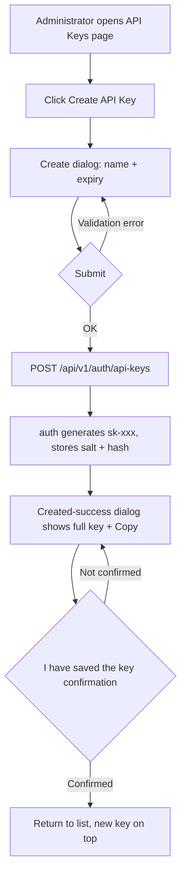
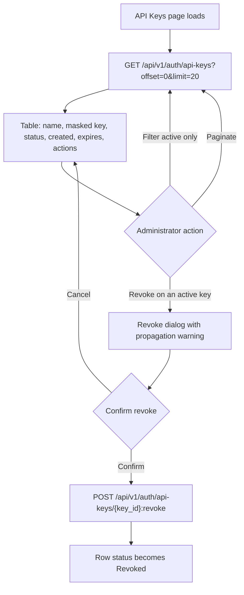
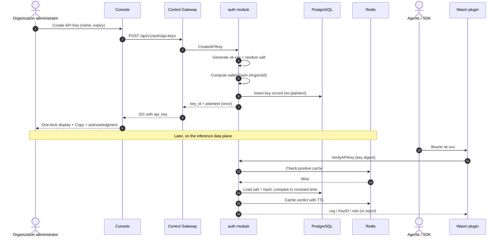
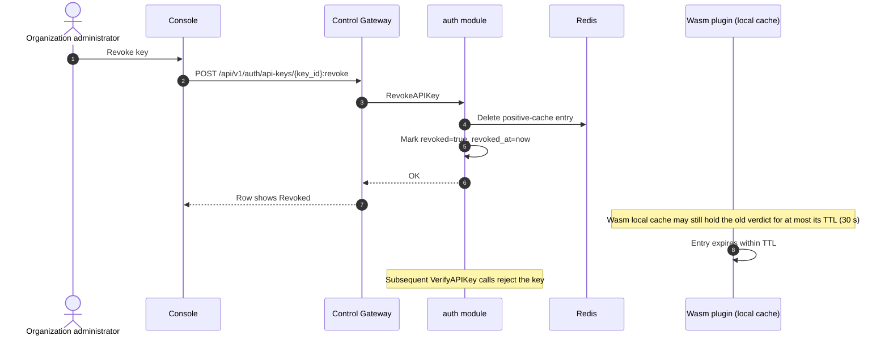

# API Key Lifecycle Management — Requirement Analysis and UI/UX Design

| Attribute | Content |
| --- | --- |
| Feature point | API Key lifecycle management (create / list / revoke, salted-hash storage) |
| Document scope | Requirement analysis and UI/UX design for the API Key management capability of the `auth` module: console pages, user flows, API surface, and acceptance criteria |
| Owning module | `auth` (control plane, served through the Control Gateway) |
| Related documents | [Architecture Design](./architecture.md) — Section 2.1 `auth` responsibilities and Section 3.3 the Inference Gateway's API Key authentication chain |
| Status | Design complete, handed to the Architect agent |

---

## 1. Background and Competitive Research

### 1.1 Why API Keys Come First

Every request on the go-taas inference data plane is authenticated with an API Key. The key is the unit that ties an **agent / SDK** caller to an organization, drives per-key token metering (feature point #4), and anchors per-key settlement. Without a complete, safe, and usable API Key lifecycle, no other consumer-facing feature can ship. This is also why the platform's roadmap places "API Keys" in the Phase 1 (MVP) scope.

### 1.2 How Comparable Products Manage API Keys

| Product | Creation UX | Secret display | Listing / masking | Revocation & rotation | Notable pitfalls |
| --- | --- | --- | --- | --- | --- |
| **OpenAI Platform** | Create key from the API key page, optionally scoped to a Project; name required | Full secret shown **only once** in a modal at creation; if lost, create a new key | List shows name, prefix, creation date, last-used; secret never shown again | Delete (trash icon) is immediate and irreversible; no in-place rotation — users create a new key, switch, then delete the old one | Users who lose the secret must rotate; deleted keys break dependent applications with no grace period |
| **Anthropic Console** | Create key per workspace, name required | Secret shown once at creation, copy button | List shows name, prefix, created date; masked everywhere else | Revoke from the key list; revocation is immediate | Region-locked console; workspace-scoped keys require the workspace concept to exist first |
| **Together AI** | Create key from account settings | Secret shown once, copy button | Masked list with prefix + creation date | Delete/revoke from list | Minimal scoping — keys are account-wide, which multiplies blast radius of a leak |
| **SiliconFlow** | "新建 API 密钥" one-click creation on the API keys page | Secret shown once with copy | Masked list | Delete from list | No expiry; no per-key scoping — simple but coarse |
| **Aliyun Bailian (Model Studio)** | Create key dialog: choose owning account (primary or RAM user) and business space; optional custom permission with IP whitelist and model-scope | Existing keys can be **re-copied from the list** (weaker posture) | List with copy action; up to 20 keys per business space | Delete takes effect immediately; keys also die when the owning account is removed from the business space | Re-copyable secrets mean the plaintext (or an equivalent) is retrievable after creation; per-key permission adds UI complexity |
| **Volcengine Ark** | Create API Key on the API Key page; keys are region-scoped | Secret shown once at creation | Masked list | Delete/disable from list | Region coupling confuses users who mix endpoints across regions |

### 1.3 Distilled Patterns and Decisions

Common industry patterns worth adopting:

1. **One-time secret display** — the plaintext key is returned exactly once, in the creation response, with a copy button and a "store it now" warning. OpenAI, Anthropic, Together, and Volcengine Ark all follow this; Aliyun Bailian's re-copyable key is the outlier and is considered a weaker security posture.
2. **Masked listing with a stable prefix** — the list never shows the full secret; it shows a short prefix (e.g. `sk-abc123…`) plus name, creation time, expiry, and status, so users can identify keys without exposing them.
3. **Revocation is immediate at the authority (`auth` module) and propagates to the data plane within the gateway cache TTL** — the platform must be explicit about this propagation window instead of pretending revocation is instantaneous everywhere.
4. **Rotation is create-new + switch + revoke-old** — none of the surveyed products offer in-place secret rotation; the safe, universally understood pattern is to make creating a replacement key trivially easy.
5. **Optional expiry** — keys may carry an `expires_at`; expired keys are rejected exactly like revoked keys.

Pitfalls to avoid:

- **Re-copyable secrets** (Aliyun Bailian) — requires storing recoverable material; conflicts with go-taas's salted-hash-only storage requirement.
- **Silent revocation** — revoking a key that an agent is actively using causes hard failures; the UI must warn and confirm.
- **No propagation disclosure** — users expect "revoked" to mean "rejected on the very next request"; the UI must state the cache-TTL bound.

**Decisions for go-taas** (recorded rationale, per the autonomous-decision rule):

| # | Decision | Rationale |
| --- | --- | --- |
| D1 | Plaintext key format `sk-<43 random chars>` (46 chars total: `sk-` prefix + 43 base62 characters, about 256 bits of entropy), shown exactly once at creation | Matches the OpenAI-compatible ecosystem's `sk-` convention that agents and SDKs already expect; one-time display is the industry-standard posture |
| D2 | Store only `salt + salted-hash` (per-key random salt, Argon2id or bcrypt); never store plaintext or anything recoverable | Non-negotiable security requirement from the architecture; also rules out the re-copy pattern |
| D3 | List shows a masked prefix (first 8 chars after `sk-`, e.g. `sk-a3f9k2…`) plus metadata; never the secret | Identifiability without exposure |
| D4 | Revocation is a soft state (`revoked=true` + `revoked_at`), effective immediately at `auth`; data-plane propagation bounded by the gateway cache TTL (≤ 30 s by default) | Preserves audit history (needed by metering/settlement) while giving a clear propagation guarantee |
| D5 | Rotation = create new key, update the agent, revoke the old one; the creation dialog links to this guidance | Avoids inventing a rotation primitive no comparable product has |
| D6 | Optional `expires_at` at creation (never / 30 / 90 / 365 days or a custom date); expiry behaves like revocation | Cheap to implement, matches enterprise expectations |
| D7 | Keys are organization-scoped; every key belongs to exactly one organization, and the list is filtered by the caller's organization | Aligns with the multi-tenancy model; per-project or per-key permission scoping is deferred to feature point #6 |

### 1.4 Scope Boundary

**In scope**: key creation (with name and optional expiry), one-time secret display, masked listing with pagination, revocation with confirmation, expiry handling, and the salted-hash storage requirement.

**Out of scope** (tracked by other feature points): per-key permission scoping and IP whitelists (#6 multi-tenancy), per-key usage statistics and bills (#4, #5), SSO login and account management (#7), and the gateway-side Wasm verification chain (already specified in the architecture document, Section 3.3).

---

## 2. User Roles

| Role | Description | Interaction with API Keys |
| --- | --- | --- |
| **Organization administrator** | A platform user who administers an organization (the operator who signed up or was provisioned) | Creates, lists, and revokes the organization's API Keys; sees all keys of the organization |
| **Organization member (future)** | A user invited into an organization with a limited role | Out of scope for this feature point; the API surface reserves organization-scoped filtering so member roles can be added without breaking changes |
| **Agent / SDK** | The programmatic consumer that calls `/v1/chat/completions` etc. with `Authorization: Bearer sk-xxx` | Never calls the management API; only presents the key on the data plane, where the Wasm plugin verifies it via `auth` |

> Terminology: the consumer-side caller is called an **Agent** (English) / 「智能体」(Chinese), consistent with the repo convention.

---

## 3. User Stories

| # | As a… | I want to… | So that… |
| --- | --- | --- | --- |
| US1 | Organization administrator | create an API Key with a meaningful name and optional expiry | I can tell keys apart and limit how long a key stays valid |
| US2 | Organization administrator | see the full plaintext key exactly once, with a copy button, at creation time | I can configure my agent/SDK immediately, and the secret is never retrievable afterwards |
| US3 | Organization administrator | list all keys of my organization with a masked prefix, status, and creation/expiry times | I can audit which keys exist and how they are used without exposing secrets |
| US4 | Organization administrator | revoke a key immediately when I suspect it leaked | compromised keys stop working right away |
| US5 | Organization administrator | know how fast a revocation takes effect on the data plane | I can reason about the security window after revoking |
| US6 | Organization administrator | rotate a key without downtime | I can replace a leaked key while my agent keeps running |
| US7 | Agent / SDK | have my key verified on every inference request with sub-millisecond overhead | my requests are both secure and fast |
| US8 | Organization administrator | be unable to recover a lost plaintext key | a database leak cannot reveal usable secrets (defense in depth) |

---

## 4. Functional Requirements

### FR1 — Create API Key

- **FR1.1** The console provides a "Create API Key" action on the API Keys page, opening a dialog with: **Name** (required, 1–64 chars), **Expiry** (optional: never / 30 / 90 / 365 days / custom date, default never).
- **FR1.2** On submit, the platform generates a plaintext key of the form `sk-<43 random chars>` (46 chars total), stores only `salt + salted-hash`, and returns the plaintext **exactly once** in the creation response.
- **FR1.3** The creation-success screen shows the full key in a monospace field with a **Copy** button and the warning: "This key will not be shown again. Store it securely now." The dialog cannot be dismissed without an explicit "I have saved the key" confirmation (checkbox or button).
- **FR1.4** Duplicate names are allowed (keys are identified by `key_id`), but the UI shows a hint when a key with the same name already exists.
- **FR1.5** `expires_at` must be in the future when provided; validation rejects past dates with a clear message.

### FR2 — List API Keys

- **FR2.1** The API Keys page lists the caller's organization's keys in a table: **Name**, **Key** (masked, e.g. `sk-a3f9k2…`), **Status** (Active / Revoked / Expired), **Created**, **Expires**, **Actions**.
- **FR2.2** The list is paginated (`offset`/`limit`, default limit 20, max 100) and sorted by creation time, newest first.
- **FR2.3** Revoked and expired keys remain visible (for audit) with their status; a filter toggle allows showing only active keys.
- **FR2.4** The list never contains the plaintext key or the hash — only the masked prefix and metadata.

### FR3 — Revoke API Key

- **FR3.1** Each active key row offers a "Revoke" action that opens a confirmation dialog naming the key and warning: "Agents using this key will immediately receive 401 errors (within the gateway cache TTL, at most 30 seconds)."
- **FR3.2** Revocation sets `revoked=true` and `revoked_at`; the row's status becomes "Revoked"; revocation is idempotent — revoking an already-revoked key succeeds without error.
- **FR3.3** Revoking a non-existent `key_id` or a key of another organization returns a "not found" error (no information leak about other organizations' keys).
- **FR3.4** There is no "un-revoke"; the recovery path is creating a new key (D5).

### FR4 — Expiry

- **FR4.1** A key whose `expires_at` has passed is treated exactly like a revoked key: verification rejects it with 401.
- **FR4.2** The list computes the "Expired" status lazily from `expires_at` (no background job required for correctness); the status column shows "Expired" when `now > expires_at`.

### FR5 — Verification (data-plane integration)

- **FR5.1** `VerifyAPIKey` accepts the key digest and returns the organization, Key ID, and role context needed for metering; it rejects revoked, expired, and unknown keys.
- **FR5.2** Verification is backed by the Redis positive cache; revocation invalidates the Redis entry at revoke time, so the worst-case propagation delay is bounded by the Wasm local cache TTL (≤ 30 s).
- **FR5.3** The plaintext key never leaves the creation response: it is not logged, not cached in Redis, and not returned by any list/get API.

### FR6 — Storage Security (non-negotiable)

- **FR6.1** The database stores per key: `key_id`, `name`, `prefix` (first 8 chars of the plaintext, for masking), `salt`, `salted_hash`, `organization_id`, `created_at`, `expires_at`, `revoked`, `revoked_at`. **No plaintext column exists.**
- **FR6.2** The salt is a fresh random value per key (16+ bytes); the hash uses a memory-hard KDF (Argon2id preferred, bcrypt acceptable).
- **FR6.3** Verification hashes the presented key with the stored salt and compares in constant time.

---

## 5. Page and Flow Design

### 5.1 Page Map

| Page / component | Purpose |
| --- | --- |
| **API Keys page** (`/api-keys`) | The list of the organization's keys with create entry point, filters, and per-row actions |
| **Create dialog** | Name + expiry form |
| **Created-success dialog** | One-time secret display with copy and acknowledgment |
| **Revoke dialog** | Confirmation with propagation warning |

### 5.2 Create-and-Reveal-Once Flow

### 5.3 List and Revoke Flow

### 5.4 Creation and Verification Sequence

### 5.5 Revocation Propagation Sequence

---

## 6. API Surface Implications

All management APIs belong to the **`taas.auth.v1.AuthService`** (proto: `proto/taas/auth/v1/auth.proto`), served as HTTP via the Control Gateway (`grpc-gateway`). The current proto already defines the needed surface; this design confirms and constrains it:

| RPC | HTTP | Purpose | Notes |
| --- | --- | --- | --- |
| `CreateAPIKey` | `POST /api/v1/auth/api-keys` | Create a key; response carries `api_key` (plaintext, once) + `key_id` | `name` required, `expires_at` optional (0 = never) |
| `ListAPIKeys` | `GET /api/v1/auth/api-keys` | Paginated list of the caller's organization's keys | Returns `APIKeySummary` (masked prefix, never the secret) |
| `RevokeAPIKey` | `POST /api/v1/auth/api-keys/{key_id}:revoke` | Soft-revoke a key | Idempotent; ownership-checked |
| `VerifyAPIKey` | gRPC only (no HTTP mapping) | Data-plane verification for the Wasm plugin | Input is the key digest; backed by Redis positive cache |

Constraints on the contract:

1. `CreateAPIKeyResponse.api_key` is the **only** field in the entire API surface that ever carries the plaintext; no other response may add it.
2. `APIKeySummary` must expose `key_id`, `name`, `prefix`, `created_at`, `expires_at`, `revoked`; a `revoked_at` field is a recommended addition for audit display.
3. `RevokeAPIKey` must be idempotent and must return "not found" for keys outside the caller's organization.
4. Error codes follow the platform's unified `taas.common.v1.Response` envelope; revocation-propagation semantics (cache TTL bound) belong to documentation, not the contract.

---

## 7. Acceptance Criteria

| # | Criterion | Verification |
| --- | --- | --- |
| AC1 | `CreateAPIKey` returns a plaintext key matching `^sk-[A-Za-z0-9]{43}$` and a `key_id`; a second call never returns the same plaintext | Unit test + FVT |
| AC2 | After creation, the database row contains `salt` and `salted_hash` but **no** column or log holds the plaintext | Unit test (schema assertion) + log scan |
| AC3 | `ListAPIKeys` returns summaries with `prefix` masked (≤ 8 chars of the key) and never the plaintext or hash; pagination (`offset`/`limit`) works and `page_meta.total` is correct | FVT |
| AC4 | The plaintext key from AC1 passes `VerifyAPIKey` (returns org / KeyID / role) before revocation | FVT |
| AC5 | After `RevokeAPIKey`, `VerifyAPIKey` rejects the key; the Redis positive-cache entry for the key is deleted at revoke time | FVT with cache assertion |
| AC6 | Revocation is idempotent: revoking an already-revoked key returns success; revoking a `key_id` of another organization returns "not found" | Unit test |
| AC7 | A key created with `expires_at` in the past is rejected at creation; a key whose `expires_at` passes is rejected by `VerifyAPIKey` without any background job | Unit test |
| AC8 | The console's created-success dialog shows the key once with a copy button and requires acknowledgment before closing; the list shows the masked prefix and status | Manual / E2E |
| AC9 | The revoke dialog states the propagation bound ("at most 30 seconds, the gateway cache TTL") | Manual / E2E |
| AC10 | No management API other than `CreateAPIKey` returns the plaintext; grep of generated swagger shows `api_key` only in the creation response | Contract review |

---

## 8. Open Items Deferred

| Item | Deferred to |
| --- | --- |
| Per-key permission scoping (model allowlist, IP whitelist) | Feature #6 multi-tenancy |
| Per-key usage statistics and cost attribution | Feature #4 metering & settlement |
| Key last-used timestamp (requires gateway feedback loop) | Feature #4 (metering events carry KeyID) |
| Immediate-revocation cache-invalidation broadcast | Architecture decision; default is TTL-bound propagation |
