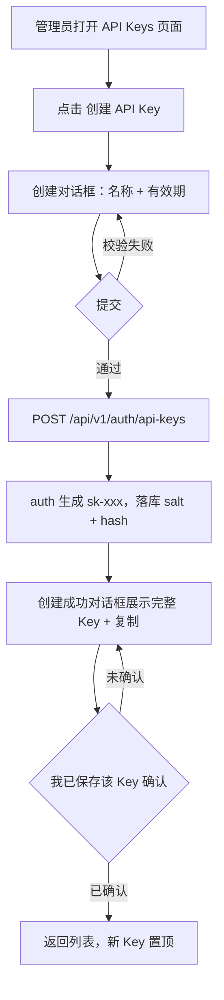
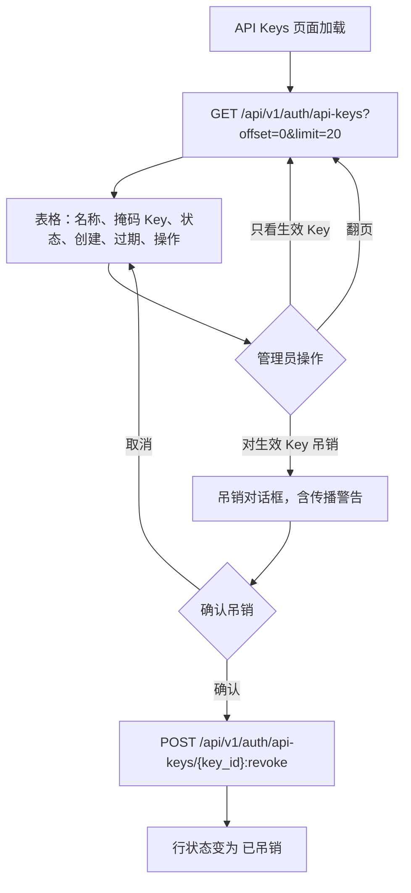
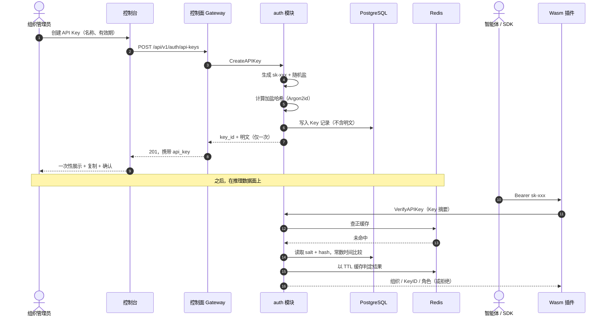
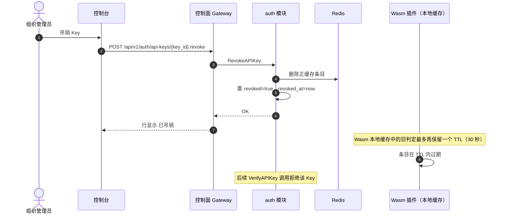

# API Key 生命周期管理 —— 需求分析与 UI/UX 设计

| 属性 | 内容 |
| --- | --- |
| 特性点 | API Key 生命周期管理（创建 / 列表 / 吊销，加盐哈希存储） |
| 文档范围 | `auth` 模块 API Key 管理能力的需求分析与 UI/UX 设计：控制台页面、用户流程、API 面与验收标准 |
| 归属模块 | `auth`（控制面，经控制面 Gateway 对外服务） |
| 相关文档 | [架构设计文档](./architecture.zh-cn.md) —— 第 2.1 节 `auth` 职责、第 3.3 节推理 Gateway 的 API Key 鉴权调用链 |
| 状态 | 设计完成，已移交 Architect agent |

---

## 1. 背景与竞品调研

### 1.1 为什么 API Key 排在第一位

go-taas 推理数据面的每一次请求都以 API Key 鉴权。Key 是把**智能体 / SDK** 调用方与组织绑定起来的基本单元，是按 Key 进行 Token 计量（特性点 #4）的锚点，也是按 Key 结算的基础。没有一套完整、安全、好用的 API Key 生命周期管理，其他面向消费方的特性都无法交付。这也是平台路线图把「API Keys」放入 Phase 1（MVP）范围的原因。

### 1.2 竞品的 API Key 管理方式

| 产品 | 创建交互 | 密钥展示 | 列表 / 掩码 | 吊销与轮换 | 值得注意的坑 |
| --- | --- | --- | --- | --- | --- |
| **OpenAI Platform** | 在 API key 页面创建，可按 Project 圈定范围；名称必填 | 完整密钥仅在创建时的弹窗中展示**一次**；丢失只能新建 | 列表展示名称、前缀、创建日期、最近使用；密钥不再展示 | 删除（垃圾桶图标）立即生效且不可恢复；没有原地轮换——用户先建新 Key、切换、再删旧 Key | 丢失密钥只能轮换；被删除的 Key 会让依赖它的应用直接失败，没有宽限期 |
| **Anthropic Console** | 按 workspace 创建 Key，名称必填 | 密钥创建时展示一次，带复制按钮 | 列表展示名称、前缀、创建时间；其余位置一律掩码 | 从列表吊销，立即生效 | 控制台有区域限制；按 workspace 圈定 Key 要求先有 workspace 概念 |
| **Together AI** | 在账户设置中创建 | 密钥展示一次，带复制 | 掩码列表，含前缀与创建日期 | 从列表删除 | 几乎没有范围控制——Key 是账户级的，泄露影响面被放大 |
| **SiliconFlow** | API 密钥页「新建 API 密钥」一键创建 | 密钥展示一次，带复制 | 掩码列表 | 从列表删除 | 无有效期、无按 Key 授权——简单但粗糙 |
| **阿里云百炼** | 创建对话框：选择归属账号（主账号或 RAM 用户）与业务空间；可选自定义权限（IP 白名单、模型范围） | 已有 Key 可在列表中**再次复制**（较弱的安全姿态） | 列表带复制操作；每个业务空间最多 20 个 Key | 删除立即生效；账号被移出业务空间时 Key 也随之失效 | 可再次复制意味着创建后仍能取回明文（或等价物）；按 Key 的权限配置增加了交互复杂度 |
| **火山方舟 Ark** | 在 API Key 页面创建；Key 与地域绑定 | 密钥创建时展示一次 | 掩码列表 | 从列表删除 / 停用 | 地域耦合容易让跨地域混用端点的用户困惑 |

### 1.3 提炼出的模式与决策

值得采纳的业界共性模式：

1. **一次性密钥展示** —— 明文 Key 仅在创建响应中返回一次，配复制按钮与「立即保存」提醒。OpenAI、Anthropic、Together、火山方舟均如此；阿里云百炼的「可再次复制」是异类，属于较弱的安全姿态。
2. **带稳定前缀的掩码列表** —— 列表永不展示完整密钥，只展示短前缀（如 `sk-abc123…`）加名称、创建时间、有效期与状态，让用户不暴露密钥也能辨认 Key。
3. **吊销在权威方（`auth` 模块）立即生效，并按网关缓存 TTL 向数据面传播** —— 平台必须明确披露这个传播窗口，而不是假装吊销处处即时。
4. **轮换 = 新建 + 切换 + 吊销旧 Key** —— 调研的所有产品都没有原地换密钥能力；让「创建替代 Key」变得极其轻便是公认的安全模式。
5. **可选有效期** —— Key 可携带 `expires_at`；过期 Key 与被吊销 Key 同样被拒绝。

要避免的坑：

- **可再次复制的密钥**（阿里云百炼）—— 需要存储可恢复材料，与 go-taas 只存加盐哈希的要求冲突。
- **无提示吊销** —— 吊销一个智能体正在使用的 Key 会造成硬失败；UI 必须警告并确认。
- **不披露传播延迟** —— 用户期望「已吊销」意味着「下一个请求就被拒绝」；UI 必须说明缓存 TTL 的边界。

**go-taas 的决策**（依据自主决策规则记录理由）：

| # | 决策 | 理由 |
| --- | --- | --- |
| D1 | 明文 Key 格式 `sk-<43 位随机字符>`（总长 46：`sk-` 前缀 + 43 位 base62 字符，约 256 位熵），创建时仅展示一次 | 契合智能体 / SDK 已习惯的 OpenAI 兼容 `sk-` 约定；一次性展示是业界标准姿态 |
| D2 | 只存 `salt + 加盐哈希`（每 Key 独立随机盐，Argon2id 或 bcrypt）；绝不存明文或任何可恢复内容 | 架构的安全底线要求；同时排除「可再次复制」模式 |
| D3 | 列表展示掩码前缀（`sk-` 后前 8 位，如 `sk-a3f9k2…`）加元数据；永不展示密钥 | 可辨认但不暴露 |
| D4 | 吊销是软状态（`revoked=true` + `revoked_at`），在 `auth` 侧立即生效；数据面传播以网关缓存 TTL 为上界（默认 ≤ 30 秒） | 保留审计历史（计量 / 结算需要），同时给出明确的传播保证 |
| D5 | 轮换 = 新建 Key、更新智能体配置、吊销旧 Key；创建对话框内嵌该指引 | 不发明竞品都没有的轮换原语 |
| D6 | 创建时可选 `expires_at`（永不 / 30 / 90 / 365 天或自定义日期）；过期行为等同吊销 | 实现成本低，符合企业预期 |
| D7 | Key 按组织圈定；每个 Key 恰好归属一个组织，列表按调用方组织过滤 | 与多租户模型对齐；按项目或按 Key 的权限圈定推迟到特性点 #6 |

### 1.4 范围边界

**范围内**：Key 创建（名称 + 可选有效期）、一次性密钥展示、带分页的掩码列表、带确认的吊销、过期处理，以及加盐哈希存储要求。

**范围外**（由其他特性点跟踪）：按 Key 的权限圈定与 IP 白名单（#6 多租户）、按 Key 的用量统计与账单（#4、#5）、SSO 登录与账号管理（#7），以及网关侧 Wasm 鉴权链路（架构文档第 3.3 节已定义）。

---

## 2. 用户角色

| 角色 | 描述 | 与 API Key 的关系 |
| --- | --- | --- |
| **组织管理员** | 管理一个组织的平台用户（注册或被预置的运营者） | 创建、列表、吊销本组织的 API Key；可见组织内全部 Key |
| **组织成员（未来）** | 被邀请加入组织、角色受限的用户 | 本特性点范围外；API 面预留组织级过滤，后续增加成员角色不破坏兼容性 |
| **智能体 / SDK** | 以 `Authorization: Bearer sk-xxx` 调用 `/v1/chat/completions` 等端点的程序化消费方 | 不调用管理 API；只在数据面出示 Key，由 Wasm 插件经 `auth` 校验 |

> 术语：消费方调用者称为 **Agent**（英文）/「智能体」（中文），与仓库约定一致。

---

## 3. 用户故事

| # | 作为…… | 我想要…… | 以便…… |
| --- | --- | --- | --- |
| US1 | 组织管理员 | 创建带语义名称与可选有效期的 API Key | 能区分各 Key，并限制 Key 的存活时长 |
| US2 | 组织管理员 | 创建时一次性看到完整明文 Key，带复制按钮 | 能立即配置智能体 / SDK，且密钥事后不可再取回 |
| US3 | 组织管理员 | 列出本组织全部 Key，含掩码前缀、状态与创建 / 过期时间 | 不暴露密钥也能审计哪些 Key 存在、如何使用 |
| US4 | 组织管理员 | 怀疑泄露时立即吊销 Key | 被泄露的 Key 马上失效 |
| US5 | 组织管理员 | 知道吊销在数据面的生效速度 | 能评估吊销后的安全窗口 |
| US6 | 组织管理员 | 不停机轮换 Key | 替换泄露 Key 的同时智能体持续运行 |
| US7 | 智能体 / SDK | 每次推理请求的 Key 校验都保持亚毫秒开销 | 请求既安全又快 |
| US8 | 组织管理员 | 无法找回丢失的明文 Key | 数据库泄露也无法还原可用密钥（纵深防御） |

---

## 4. 功能需求

### FR1 —— 创建 API Key

- **FR1.1** 控制台在 API Keys 页面提供「创建 API Key」入口，打开对话框，包含：**名称**（必填，1–64 字符）、**有效期**（可选：永不 / 30 / 90 / 365 天 / 自定义日期，默认永不）。
- **FR1.2** 提交后，平台生成形如 `sk-<43 位随机字符>`（总长 46）的明文 Key，只落库 `salt + 加盐哈希`，并在创建响应中**仅一次**返回明文。
- **FR1.3** 创建成功页以等宽字体展示完整 Key，配**复制**按钮与警告：「该 Key 不会再次展示，请立即妥善保存。」对话框必须经显式的「我已保存」确认（复选框或按钮）才能关闭。
- **FR1.4** 允许重名（Key 以 `key_id` 标识），但同名 Key 已存在时 UI 给出提示。
- **FR1.5** `expires_at` 若提供必须晚于当前时间；校验拒绝过去日期并给出明确报错。

### FR2 —— 列表 API Key

- **FR2.1** API Keys 页面以表格列出调用方组织的 Key：**名称**、**Key**（掩码，如 `sk-a3f9k2…`）、**状态**（生效 / 已吊销 / 已过期）、**创建时间**、**过期时间**、**操作**。
- **FR2.2** 列表分页（`offset`/`limit`，默认每页 20，最大 100），按创建时间倒序。
- **FR2.3** 已吊销与已过期的 Key 仍可见（供审计）并标注状态；提供「只看生效 Key」的过滤开关。
- **FR2.4** 列表永不包含明文 Key 或哈希——只有掩码前缀与元数据。

### FR3 —— 吊销 API Key

- **FR3.1** 每个生效 Key 的行内提供「吊销」操作，打开确认对话框，点名该 Key 并警告：「使用该 Key 的智能体将立即收到 401 错误（受网关缓存 TTL 影响，最迟 30 秒内生效）。」
- **FR3.2** 吊销置 `revoked=true` 与 `revoked_at`；行状态变为「已吊销」；吊销幂等——对已吊销 Key 再次吊销同样成功、不报错。
- **FR3.3** 吊销不存在的 `key_id` 或其他组织的 Key 返回「未找到」错误（不泄露其他组织 Key 的存在性）。
- **FR3.4** 不提供「恢复吊销」；恢复路径就是新建 Key（D5）。

### FR4 —— 有效期

- **FR4.1** `expires_at` 已过期的 Key 与被吊销的 Key 完全同义：校验以 401 拒绝。
- **FR4.2** 列表按 `expires_at` 惰性计算「已过期」状态（正确性不依赖后台任务）；当 `now > expires_at` 时状态列显示「已过期」。

### FR5 —— 校验（数据面集成）

- **FR5.1** `VerifyAPIKey` 接收 Key 摘要，返回组织、Key ID 与计量所需的角色上下文；拒绝已吊销、已过期与未知的 Key。
- **FR5.2** 校验以 Redis 正缓存加速；吊销时删除对应 Redis 条目，最坏传播延迟以 Wasm 本地缓存 TTL（≤ 30 秒）为上界。
- **FR5.3** 明文 Key 不离开创建响应：不写日志、不进 Redis 缓存、不被任何 list/get API 返回。

### FR6 —— 存储安全（不可妥协）

- **FR6.1** 数据库每个 Key 存储：`key_id`、`name`、`prefix`（明文前 8 位，用于掩码展示）、`salt`、`salted_hash`、`organization_id`、`created_at`、`expires_at`、`revoked`、`revoked_at`。**不存在明文列。**
- **FR6.2** 每个 Key 的盐为独立随机值（16+ 字节）；哈希使用内存困难 KDF（首选 Argon2id，可接受 bcrypt）。
- **FR6.3** 校验时以存储的盐对呈上的 Key 重新哈希，并以常数时间比较。

---

## 5. 页面与流程设计

### 5.1 页面地图

| 页面 / 组件 | 用途 |
| --- | --- |
| **API Keys 页面**（`/api-keys`） | 组织 Key 列表，含创建入口、过滤与行内操作 |
| **创建对话框** | 名称 + 有效期表单 |
| **创建成功对话框** | 一次性密钥展示，含复制与确认 |
| **吊销对话框** | 带传播警告的确认 |

### 5.2 创建与一次性展示流程

### 5.3 列表与吊销流程

### 5.4 创建与校验时序

### 5.5 吊销传播时序

---

## 6. API 面影响

所有管理 API 归属 **`taas.auth.v1.AuthService`**（proto：`proto/taas/auth/v1/auth.proto`），由控制面 Gateway（`grpc-gateway`）以 HTTP 对外服务。现有 proto 已定义所需接口；本设计予以确认并施加约束：

| RPC | HTTP | 用途 | 说明 |
| --- | --- | --- | --- |
| `CreateAPIKey` | `POST /api/v1/auth/api-keys` | 创建 Key；响应携带 `api_key`（明文，仅一次）+ `key_id` | `name` 必填，`expires_at` 可选（0 = 永不） |
| `ListAPIKeys` | `GET /api/v1/auth/api-keys` | 分页列出调用方组织的 Key | 返回 `APIKeySummary`（掩码前缀，绝不含密钥） |
| `RevokeAPIKey` | `POST /api/v1/auth/api-keys/{key_id}:revoke` | 软吊销 Key | 幂等；校验归属 |
| `VerifyAPIKey` | 仅 gRPC（无 HTTP 映射） | 供 Wasm 插件进行数据面校验 | 入参为 Key 摘要；以 Redis 正缓存加速 |

对契约的约束：

1. `CreateAPIKeyResponse.api_key` 是整个 API 面中**唯一**携带明文的字段；任何其他响应不得添加它。
2. `APIKeySummary` 必须暴露 `key_id`、`name`、`prefix`、`created_at`、`expires_at`、`revoked`；建议补充 `revoked_at` 字段用于审计展示。
3. `RevokeAPIKey` 必须幂等，且对调用方组织之外的 Key 返回「未找到」。
4. 错误码遵循平台统一的 `taas.common.v1.Response` 信封；吊销传播语义（缓存 TTL 上界）属于文档内容，不进契约。

---

## 7. 验收标准

| # | 标准 | 验证方式 |
| --- | --- | --- |
| AC1 | `CreateAPIKey` 返回匹配 `^sk-[A-Za-z0-9]{43}$` 的明文 Key 与 `key_id`；两次调用绝不返回相同明文 | 单元测试 + FVT |
| AC2 | 创建后数据库行包含 `salt` 与 `salted_hash`，但**没有任何列或日志**持有明文 | 单元测试（schema 断言）+ 日志扫描 |
| AC3 | `ListAPIKeys` 返回的摘要中 `prefix` 为掩码（≤ 8 位），绝不含明文或哈希；分页（`offset`/`limit`）可用且 `page_meta.total` 正确 | FVT |
| AC4 | AC1 得到的明文 Key 在吊销前能通过 `VerifyAPIKey`（返回组织 / KeyID / 角色） | FVT |
| AC5 | `RevokeAPIKey` 之后 `VerifyAPIKey` 拒绝该 Key；吊销时对应 Redis 正缓存条目被删除 | FVT（含缓存断言） |
| AC6 | 吊销幂等：对已吊销 Key 再次吊销返回成功；吊销其他组织的 `key_id` 返回「未找到」 | 单元测试 |
| AC7 | `expires_at` 为过去时间的创建请求被拒绝；`expires_at` 到期后 `VerifyAPIKey` 拒绝该 Key，无需任何后台任务 | 单元测试 |
| AC8 | 控制台创建成功对话框仅展示一次 Key，带复制按钮，且必须确认后才能关闭；列表展示掩码前缀与状态 | 人工 / E2E |
| AC9 | 吊销对话框说明传播上界（「最迟 30 秒，即网关缓存 TTL」） | 人工 / E2E |
| AC10 | 除 `CreateAPIKey` 外没有任何管理 API 返回明文；检索生成的 swagger，`api_key` 仅出现在创建响应中 | 契约评审 |

---

## 8. 延期的开放项

| 事项 | 延期至 |
| --- | --- |
| 按 Key 的权限圈定（模型白名单、IP 白名单） | 特性 #6 多租户 |
| 按 Key 的用量统计与成本归集 | 特性 #4 计量与结算 |
| Key 最近使用时间（需要网关反馈链路） | 特性 #4（计量事件携带 KeyID） |
| 即时吊销的缓存失效广播 | 架构决策；默认为 TTL 上界传播 |
