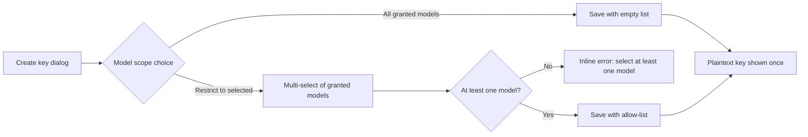

# API Key Model Scoping — Requirement Analysis and UI/UX Design

| Attribute | Content |
| --- | --- |
| Feature point | Per-API-key model allow-lists enforced on the inference data plane (backlog row 46) |
| Document scope | Restrict an API key to an allow-list of models, edit the scope in the end-user console, surface the scope read-only on the admin API surface, and enforce it at the inference gateway alongside org-level model authorization |
| Owning modules | `auth` (key model scope storage, verdict cache, VerifyAPIKey enforcement), `model` (catalog model list for the scope picker), `audit` (scope changes), `web` end-user + admin consoles |
| Related documents | [Architecture Design](./architecture.md) — API key verification and the data-plane verdict cache · [API Key Management](./api-key-management.md) — key lifecycle, salted-hash storage, revocation · [Per-tenant Model Authorization](./model-authorization.md) — org-level grants this feature layers on top of · [Per-key Rate Limits & Org Spend Limits](./rate-limits-spend-limits.md) — the other per-key restriction axis · [Console Surface Separation](./console-surface-separation.md) |
| Status | Design complete; handoff pending |

## 1. Background and Competitive Research

API keys today carry rate limits (row 11) and inherit the organization's model grants (row 13), but every key of an organization can call every model the organization is granted. Tenants asked for the ability to hand a key to a person, agent, or CI job that should only ever reach a subset of models — for cost control, blast-radius reduction after a key leak, and separating production traffic from experiments.

### 1.1 Comparable products

| Product | Documented pattern | go-taas decision |
| --- | --- | --- |
| OpenAI | Project-scoped API keys: a key belongs to a project, and model access follows the project's settings; the platform UI shows which models a key can reach. | Adopt the per-key model allow-list as the go-taas equivalent of project scoping; do not introduce a project/group construct. |
| Anthropic | Console keys carry permissions (workspace-level scoping) and the docs recommend least-privilege keys for automation. | Adopt optional least-privilege scoping with a clear "all granted models" default; keep the scope editable for the key's lifetime. |
| Volcengine Ark | API keys can be restricted to authorized models per key; unauthorized model calls are rejected with a permission error. | Adopt gateway-side enforcement with a distinct business error code so callers can distinguish key-scope denial from org-level denial. |
| Aliyun Bailian | Service accounts (a key-like credential) can be limited to specific model endpoints. | Adopt the same "credential → endpoint subset" mental model, expressed as model IDs from the catalog. |

Research: [OpenAI API keys and projects](https://platform.openai.com/docs/guides/production-best-practices/managing-api-keys), [Anthropic API keys and permissions](https://docs.anthropic.com/en/docs/administration/api-keys), and [Volcengine Ark API-key authorization](https://www.volcengine.com/docs/82379/1330310). The shared pattern is: the scope is optional, defaults to unrestricted, is enforced on the data plane, and is visible in the console. go-taas adopts exactly that; it rejects per-key endpoint pinning, per-key pricing, and project/group constructs.

### 1.2 Decisions and scope

| # | Decision | Rationale |
| --- | --- | --- |
| D1 | The scope is an optional allow-list of catalog model IDs stored on the key row. An empty list means "all models the organization is granted" (today's behavior). | Backward compatible: existing keys keep working unchanged; scoping is opt-in per key. |
| D2 | Enforcement lives in `VerifyAPIKey` next to the org-level model authorization check: a request for a model not in the key's allow-list is rejected with a new business code (10039) before metering. | One enforcement point on the data plane; the caller gets a precise, distinguishable error; no billing side effects for denied calls. |
| D3 | The allow-list is part of the cached key verdict, so the existing positive-verdict cache (30s default) also carries the scope; editing the scope invalidates the verdict cache for that key, mirroring revocation propagation. | Keeps the data plane at one cache lookup; scope edits propagate within the same bound as revocation. |
| D4 | Scope editing is end-user surface only: the key owner manages the scope from the end-user console. The admin surface exposes the scope read-only through the deprecated admin key-list binding (`GET /api/v1/admin/auth/api-keys` returns each row's `models[]`); the admin console has no key-management page to extend, and none is added. | The key is the tenant's credential; operators inspect but do not manage tenant key scopes. |
| D5 | The scope picker lists only models the organization is currently granted (the same list the playground/model pages use). Saving a scope containing a model the organization later loses does not auto-migrate the list; calls to that model fail org-level authorization first. | The picker prevents invalid scopes at write time; runtime behavior stays the composition "key scope AND org grant". |
| D6 | Scope changes are audited (`api_key.scope_updated`, matching the `api_key.revoke` action naming) with actor, key id, and before/after model lists, following the audit conventions of rows 1/11. | Scope changes are security-relevant events and must be attributable. |

**In scope:** per-key model allow-list storage, end-user scope editing UI, admin read-only scope column, data-plane enforcement with a distinct error code, verdict-cache propagation, audit events. **Out of scope:** per-key endpoint pinning, per-key pricing or discount overrides, key-scoped rate limits (row 11), project/group constructs, per-key request-path restrictions (source IP), and wildcard/pattern scopes.

## 2. User Roles

| Role | Surface | Capability |
| --- | --- | --- |
| Tenant developer (key owner) | End-user `/api-keys` | Create scoped keys, edit the scope of an existing key, see the scope on the keys list |
| Tenant operator (org admin) | End-user `/api-keys` | Same as the key owner for the organization's keys (existing key-management permissions apply) |
| Platform operator | Admin API (deprecated transitional binding) | See each key's scope (read-only) via `GET /api/v1/admin/auth/api-keys` for support and incident response; the admin console has no key-management page |
| Platform auditor | Admin audit log | Review `api_key.scope_updated` events with before/after lists |

## 3. User Stories

| # | Story |
| --- | --- |
| US1 | As a tenant developer, I want to create a key that can only call two specific models, so a leaked key cannot consume my quota on every model. |
| US2 | As a tenant developer, I want to edit a key's model list later without rotating the key, so automation using the key keeps working while I tighten or widen its reach. |
| US3 | As a tenant developer, I want an immediate, precise error when a scoped key calls a model outside its list, so misconfiguration is obvious in my client logs. |
| US4 | As a platform operator, I want to see which models a key is scoped to when investigating an incident, without being able to change tenant key scopes. |
| US5 | As a platform auditor, I want every scope change recorded with who/when/before/after, so scope tightening is reviewable. |

## 4. Functional Requirements

### FR1 — Key scope storage and lifecycle

- **FR1.1** The API key row gains an optional model allow-list (ordered list of catalog model IDs, 0–50 entries). An empty/absent list means unrestricted (all org-granted models).
- **FR1.2** The allow-list is settable at key creation and editable any time before revocation. Editing a revoked key's scope is rejected with the existing key-state error.
- **FR1.3** Duplicate model IDs in one list are rejected; the list is stored de-duplicated. Unknown model IDs (not in the catalog) are rejected at write time.
- **FR1.4** The plaintext key is never re-displayed; scoping does not rotate the key material.

### FR2 — Data-plane enforcement

- **FR2.1** `VerifyAPIKey` rejects a request whose model is not in the key's allow-list with business code **10039 API_KEY_MODEL_NOT_ALLOWED**, before rate limiting and metering.
- **FR2.2** Enforcement order is: key validity → key scope (10039) → org model authorization (existing 10105 MODEL_NOT_AUTHORIZED). A model outside the key scope fails with 10039 even when the organization is granted the model.
- **FR2.3** The allow-list travels in the cached verdict; a scope edit deletes the key's cached verdict so the change propagates within the existing cache TTL bound (≤ 30s default, immediate on cache delete).
- **FR2.4** Unscoped keys behave exactly as today (no new denials, no cache shape change beyond the empty list).

### FR3 — End-user console (scope management)

- **FR3.1** The create-key dialog gains an optional "Model scope" section: an "All granted models" default choice and a "Restrict to selected models" choice with a multi-select of the organization's granted models.
- **FR3.2** The keys list row shows the current scope: "All granted models" or the model chip list, with an **Edit scope** action opening the same picker pre-filled (the user console has a single keys page; there is no key detail page).
- **FR3.3** Saving an edited scope shows a confirmation of the resulting model list; the list refreshes in place without page reload.
- **FR3.4** The keys list shows a compact scope indicator per row (e.g. "All models" / "3 models"); the row's Edit scope action opens the picker.

### FR4 — Admin console (read-only visibility)

- **FR4.1** The deprecated admin binding of the key list (`GET /api/v1/admin/auth/api-keys`) returns each row's `models[]` read-only (empty = unrestricted). The admin console has no key-management page (the legacy page is unrouted since console-surface separation); no admin UI change is made.
- **FR4.2** The admin surface exposes no scope-editing action; the API rejects scope writes on the admin prefix with the existing method-mismatch/permission semantics.

### FR5 — Audit

- **FR5.1** Every scope change emits an `api_key.scope_updated` audit event with actor, key id, organization, before/after model lists, and timestamp.
- **FR5.2** Scope changes appear in the existing audit log surfaces (end-user org activity and admin audit log) without a new page.

## 5. Page and Flow Design

### 5.1 End-user: create-key dialog (existing dialog, extended)

- The scope section sits below the existing name/rate-limit fields, collapsed to "All granted models" by default.
- The multi-select lists granted models with model ID and display name; selection order is preserved as stored order.

### 5.2 End-user: keys list scope editing (existing page, extended)

| State | Rendering |
| --- | --- |
| Unscoped | A "Model scope" row reading "All granted models" with the Edit scope action |
| Scoped | A "Model scope" row with model chips (ID + display name), each chip linking to the model page, plus Edit scope |
| Editing | The picker dialog pre-filled with the current list; Save applies immediately (no key rotation) |
| Save error | Error banner with the business message; the previous scope stays active |

### 5.3 Admin: read-only API visibility (no page)

- The deprecated admin binding `GET /api/v1/admin/auth/api-keys` returns `models[]` per row (read-only; empty = unrestricted).
- The admin console has no key-management page and none is added; operators inspect scopes via the API and the audit log.

### 5.4 Internationalization and accessibility

- All new strings ship in `en` and `zh-cn` locales (`uapikeys.scope*` keys, matching the existing page prefix).
- The multi-select is keyboard operable (arrow keys, enter to toggle); chips have removable buttons with `aria-label`s; the scope row is a definition list readable by screen readers.

## 6. API Surface Implications

| Surface | Endpoint | Change |
| --- | --- | --- |
| End-user | `POST /api/v1/auth/api-keys` (create) | Accepts optional `models[]` (0–50 catalog model IDs) |
| End-user | `GET /api/v1/auth/api-keys` (list) | Each row returns `models[]` (empty = unrestricted) |
| End-user | `PUT /api/v1/auth/api-keys/{key_id}/scope` (new) | Replaces the allow-list; body `*` (`{keyId, models: [...]}`); empty array clears the scope |
| Admin | `GET /api/v1/admin/auth/api-keys` (deprecated transitional binding) | List rows gain `models[]` read-only |
| Data plane | `VerifyAPIKey` (gRPC, internal) | Response unchanged; new rejection 10039 when the requested model is outside the key scope |

Notes: the scope-edit endpoint is a dedicated resource (not a generic key update) so the audit event and cache invalidation are unambiguous. The admin prefix registers no scope-write binding.

## 7. Acceptance Criteria

| # | Criterion |
| --- | --- |
| AC1 | Creating a key with a selected model list stores the list; the keys list shows the scope indicator and the edit picker shows the chips pre-selected; the plaintext key is shown exactly once as before. |
| AC2 | A scoped key calling an allowed model succeeds and meters normally; calling any other model fails with 10039 and no metering row is written. |
| AC3 | An unscoped key's behavior is byte-for-byte unchanged (no new errors, same cache behavior). |
| AC4 | Editing the scope takes effect within the cache bound (≤ 30s; immediate after the verdict-cache delete) without key rotation. |
| AC5 | The scope picker offers exactly the organization's granted models; saving a list with an unknown or duplicate model is rejected inline. |
| AC6 | The deprecated admin key-list binding returns each key's `models[]` read-only; the admin prefix registers no scope-write binding (the scope endpoint is not routed under `/api/v1/admin`) and no admin UI offers scope editing. |
| AC7 | Every scope change emits an `api_key.scope_updated` audit event with before/after lists visible in the audit log. |
| AC8 | Cross-tenant: another organization's key list/scope endpoints never expose or accept this key (existing 10007 masking). |

## 8. Out of Scope (tracked elsewhere)

- Per-key rate limits and org spend limits — row 11.
- Org-level model grants — row 13.
- Key rotation and revocation semantics — row 1.
- Project/group constructs, per-key pricing, endpoint pinning, wildcard scopes — not backlogged.
