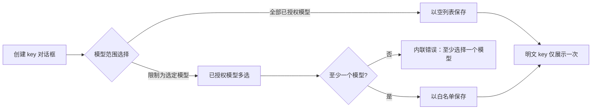

# API Key 模型范围限制 — 需求分析与 UI/UX 设计

| 属性 | 内容 |
| --- | --- |
| 功能点 | 按 API Key 限制可调用的模型白名单，并在推理数据面强制执行（backlog 第 46 行） |
| 文档范围 | 为 API Key 配置模型白名单、在用户控制台编辑范围、在管理 API 端面只读展示、并在推理网关与组织级模型授权一同强制执行 |
| 所属模块 | `auth`（key 模型范围存储、verdict 缓存、VerifyAPIKey 强制执行）、`model`（范围选择器使用的模型目录列表）、`audit`（范围变更审计）、`web` 用户端与管理端控制台 |
| 相关文档 | [架构设计](./architecture.md) — API Key 校验与数据面 verdict 缓存 · [API Key 管理](./api-key-management.md) — key 生命周期、加盐哈希存储、吊销 · [租户级模型授权](./model-authorization.md) — 本功能叠加其上的组织级授权 · [每 Key 限流与组织消费限额](./rate-limits-spend-limits.md) — 另一条按 key 限制的轴线 · [控制台分离](./console-surface-separation.md) |
| 状态 | 设计完成；待交接 |

## 1. 背景与竞品调研

当前 API Key 携带限流配置（第 11 行）并继承组织的模型授权（第 13 行），但组织内的每个 key 都能调用组织被授权的所有模型。租户希望可以签发"只能访问部分模型"的 key 给某个人、Agent 或 CI 任务 —— 用于成本控制、缩小 key 泄露后的影响面，以及区分生产流量与实验流量。

### 1.1 竞品对照

| 产品 | 文档化模式 | go-taas 决策 |
| --- | --- | --- |
| OpenAI | 项目级 API Key：key 归属项目，模型访问随项目设置；控制台展示 key 可达的模型。 | 采用"按 key 的模型白名单"作为项目级隔离的等价物；不引入项目/分组概念。 |
| Anthropic | 控制台 key 携带权限（工作区级范围），文档建议为自动化配置最小权限 key。 | 采用可选的最小权限范围，默认"全部已授权模型"；范围在 key 生命周期内可编辑。 |
| Volcengine Ark | API Key 可限制为仅能调用已授权模型；未授权模型调用返回权限错误。 | 采用网关侧强制执行，并使用独立业务错误码，让调用方能区分 key 范围拒绝与组织级拒绝。 |
| Aliyun Bailian | 服务账号（类 key 凭证）可限制为特定模型端点。 | 采用同样的"凭证 → 端点子集"心智模型，以目录中的模型 ID 表达。 |

调研来源：[OpenAI API keys 与项目](https://platform.openai.com/docs/guides/production-best-practices/managing-api-keys)、[Anthropic API keys 与权限](https://docs.anthropic.com/en/docs/administration/api-keys)、[Volcengine Ark API-key 授权](https://www.volcengine.com/docs/82379/1330310)。共同模式是：范围可选、默认不限制、在数据面强制执行、在控制台可见。go-taas 恰好采纳这些；拒绝按 key 端点绑定、按 key 定价和项目/分组概念。

### 1.2 决策与范围

| # | 决策 | 理由 |
| --- | --- | --- |
| D1 | 范围是存储在 key 行上的可选模型 ID 白名单（目录模型）。空列表表示"组织已授权的全部模型"（即现状行为）。 | 向后兼容：存量 key 行为不变；范围按 key 自愿开启。 |
| D2 | 强制执行位于 `VerifyAPIKey`，紧邻组织级模型授权检查：请求的模型不在 key 白名单内时，以新业务码（10039）拒绝，且不计量。 | 数据面单一执行点；调用方获得精确可区分的错误；被拒调用无计费副作用。 |
| D3 | 白名单随缓存的 key verdict 一同返回，现有正向 verdict 缓存（默认 30s）同样携带范围；编辑范围会删除该 key 的 verdict 缓存，与吊销传播一致。 | 数据面保持一次缓存查询；范围变更与吊销在同一个传播上界内生效。 |
| D4 | 范围编辑仅在用户端：key 所有者在用户控制台管理范围。管理端通过已废弃的管理 key 列表绑定（`GET /api/v1/admin/auth/api-keys` 返回每行的 `models[]`）只读展示范围；管理控制台没有 key 管理页面可扩展，也不新增。 | key 是租户的凭证；运营方只查看不代管租户 key 范围。 |
| D5 | 范围选择器只列出组织当前已授权的模型（与 playground/模型页相同的列表）。保存后组织若失去某模型授权，列表不自动迁移；对该模型的调用先失败于组织级授权。 | 选择器在写入时阻止无效范围；运行时行为保持"key 范围 AND 组织授权"的组合语义。 |
| D6 | 范围变更写入审计（`api_key.scope_updated`，与 `api_key.revoke` 的动作命名一致），含操作者、key id、前后模型列表，沿用第 1/11 行的审计约定。 | 范围变更是安全相关事件，必须可归因。 |

**范围内**：按 key 的模型白名单存储、用户端范围编辑 UI、管理端只读 API 可见性、带独立错误码的数据面强制执行、verdict 缓存传播、审计事件。**范围外**：按 key 端点绑定、按 key 定价或折扣、key 级限流（第 11 行）、项目/分组概念、按 key 的来源 IP 限制、通配符/模式范围。

## 2. 用户角色

| 角色 | 端面 | 能力 |
| --- | --- | --- |
| 租户开发者（key 所有者） | 用户端 `/api-keys` | 创建带范围的 key、编辑存量 key 的范围、在 key 列表查看范围 |
| 租户管理员 | 用户端 `/api-keys` | 对本组织 key 具备与所有者相同的能力（沿用现有 key 管理权限） |
| 平台运营 | 管理 API（已废弃过渡绑定） | 通过 `GET /api/v1/admin/auth/api-keys` 只读查看每个 key 的范围，用于支持与应急响应；管理控制台无 key 管理页面 |
| 平台审计员 | 管理端审计日志 | 审阅含前后列表的 `api_key.scope_updated` 事件 |

## 3. 用户故事

| # | 故事 |
| --- | --- |
| US1 | 作为租户开发者，我希望签发只能调用两个指定模型的 key，这样 key 泄露也无法消耗我在所有模型上的配额。 |
| US2 | 作为租户开发者，我希望之后无需轮换 key 即可编辑其模型列表，这样使用该 key 的自动化不受影响，同时我可以收紧或放宽其权限。 |
| US3 | 作为租户开发者，我希望带范围的 key 调用列表外模型时立即得到精确错误，这样配置错误在我的客户端日志里一目了然。 |
| US4 | 作为平台运营，我希望在排查事件时能看到 key 的模型范围，但不能修改租户 key 范围。 |
| US5 | 作为平台审计员，我希望每次范围变更都记录谁/何时/前后列表，这样范围收紧可被审阅。 |

## 4. 功能需求

### FR1 — key 范围存储与生命周期

- **FR1.1** API key 行新增可选模型白名单（有序的目录模型 ID 列表，0–50 项）。空/缺失列表表示不限制（组织已授权的全部模型）。
- **FR1.2** 白名单可在创建 key 时设置，也可在吊销前随时编辑。编辑已吊销 key 的范围按现有 key 状态错误拒绝。
- **FR1.3** 列表中的重复模型 ID 被拒绝；存储时去重。写入时拒绝未知（不在目录中的）模型 ID。
- **FR1.4** 明文 key 不再展示；设置范围不轮换 key 材料。

### FR2 — 数据面强制执行

- **FR2.1** `VerifyAPIKey` 对请求模型不在 key 白名单内的调用返回业务码 **10039 API_KEY_MODEL_NOT_ALLOWED**，先于限流与计量。
- **FR2.2** 执行顺序：key 有效性 → key 范围（10039）→ 组织模型授权（现有 10105 MODEL_NOT_AUTHORIZED）。模型在 key 范围之外时，即使组织已授权该模型也返回 10039。
- **FR2.3** 白名单随 verdict 缓存携带；编辑范围会删除该 key 的缓存 verdict，使变更在现有缓存上界内（默认 ≤ 30s，缓存删除后立即）生效。
- **FR2.4** 无范围 key 的行为与现状完全一致（无新增拒绝，缓存结构除空列表外不变）。

### FR3 — 用户端控制台（范围管理）

- **FR3.1** 创建 key 对话框新增可选"模型范围"区块：默认"全部已授权模型"，可选"限制为选定模型"并从组织已授权模型中多选。
- **FR3.2** key 列表行展示当前范围：“全部已授权模型”或模型 chip 列表，并提供 **编辑范围** 操作打开预填的同一选择器（用户端只有一个 key 页面，没有 key 详情页）。
- **FR3.3** 保存编辑后的范围时确认结果模型列表；列表原地刷新，无需整页重载。
- **FR3.4** key 列表每行展示紧凑范围标识（如"全部模型"/"3 个模型"）；行内编辑范围操作打开选择器。

### FR4 — 管理端控制台（只读可见性）

- **FR4.1** 已废弃的管理 key 列表绑定（`GET /api/v1/admin/auth/api-keys`）只读返回每行的 `models[]`（空 = 不限制）。管理控制台没有 key 管理页面（控制台分离后旧页面已不再路由）；不做管理端 UI 变更。
- **FR4.2** 管理端不提供范围编辑操作；管理前缀上的范围写入按现有方法不匹配/权限语义拒绝。

### FR5 — 审计

- **FR5.1** 每次范围变更发出 `api_key.scope_updated` 审计事件，含操作者、key id、组织、前后模型列表与时间戳。
- **FR5.2** 范围变更出现在现有审计日志端面（用户端组织动态与管理端审计日志），不新增页面。

## 5. 页面与流程设计

### 5.1 用户端：创建 key 对话框（扩展现有对话框）

- 范围区块位于现有名称/限流字段之下，默认折叠为"全部已授权模型"。
- 多选列表展示已授权模型的 ID 与显示名；选择顺序保留为存储顺序。

### 5.2 用户端：key 列表范围编辑（扩展现有页面）

| 状态 | 呈现 |
| --- | --- |
| 无范围 | "模型范围"行显示"全部已授权模型"，附编辑范围操作 |
| 有范围 | "模型范围"行显示模型 chip（ID + 显示名），每个 chip 链接到模型页，附编辑范围 |
| 编辑中 | 选择器对话框预填当前列表；保存立即生效（不轮换 key） |
| 保存失败 | 错误横幅展示业务信息；原范围保持生效 |

### 5.3 管理端：只读 API 可见性（无页面）

- 已废弃的管理绑定 `GET /api/v1/admin/auth/api-keys` 每行只读返回 `models[]`（空 = 不限制）。
- 管理控制台没有 key 管理页面，也不新增；运营方通过 API 与审计日志查看范围。

### 5.4 国际化与可访问性

- 所有新增文案提供 `en` 与 `zh-cn` 两种语言（`uapikeys.scope*` 键，沿用现有页面前缀）。
- 多选组件支持键盘操作（方向键、回车切换）；chip 的移除按钮带 `aria-label`；范围行为可被屏幕阅读器读取的定义列表。

## 6. API 端面影响

| 端面 | 端点 | 变更 |
| --- | --- | --- |
| 用户端 | `POST /api/v1/auth/api-keys`（创建） | 接受可选 `models[]`（0–50 个目录模型 ID） |
| 用户端 | `GET /api/v1/auth/api-keys`（列表） | 每行返回 `models[]`（空 = 不限制） |
| 用户端 | `PUT /api/v1/auth/api-keys/{key_id}/scope`（新增） | 替换白名单；请求体 `*`（`{keyId, models: [...]}`）；空数组清除范围 |
| 管理端 | `GET /api/v1/admin/auth/api-keys`（已废弃过渡绑定） | 列表行只读新增 `models[]` |
| 数据面 | `VerifyAPIKey`（gRPC，内部） | 响应结构不变；请求模型超出 key 范围时新增拒绝 10039 |

说明：范围编辑使用独立资源端点（而非通用 key 更新），使审计事件与缓存失效语义明确。管理前缀不注册范围写入绑定。

## 7. 验收标准

| # | 标准 |
| --- | --- |
| AC1 | 创建 key 时选择模型列表会保存该列表；key 列表展示范围标识、编辑选择器预选 chip；明文 key 仍仅展示一次。 |
| AC2 | 带范围 key 调用白名单内模型成功并正常计量；调用其他模型返回 10039 且不写计量记录。 |
| AC3 | 无范围 key 的行为逐字节不变（无新增错误，缓存行为一致）。 |
| AC4 | 编辑范围在缓存上界内生效（≤ 30s；verdict 缓存删除后立即），且不轮换 key。 |
| AC5 | 范围选择器恰好提供组织已授权的模型；保存含未知或重复模型的列表被内联拒绝。 |
| AC6 | 已废弃的管理 key 列表绑定只读返回每个 key 的 `models[]`；管理前缀不注册范围写入绑定（scope 端点不路由到 `/api/v1/admin`），管理 UI 不提供范围编辑。 |
| AC7 | 每次范围变更发出 `api_key.scope_updated` 审计事件，前后列表可在审计日志查看。 |
| AC8 | 跨租户：其他组织的 key 列表/范围端点不暴露也不接受该 key（沿用现有 10007 掩蔽）。 |

## 8. 范围外（另行跟踪）

- 每 key 限流与组织消费限额 — 第 11 行。
- 组织级模型授权 — 第 13 行。
- key 轮换与吊销语义 — 第 1 行。
- 项目/分组概念、按 key 定价、端点绑定、通配符范围 — 未列入 backlog。
