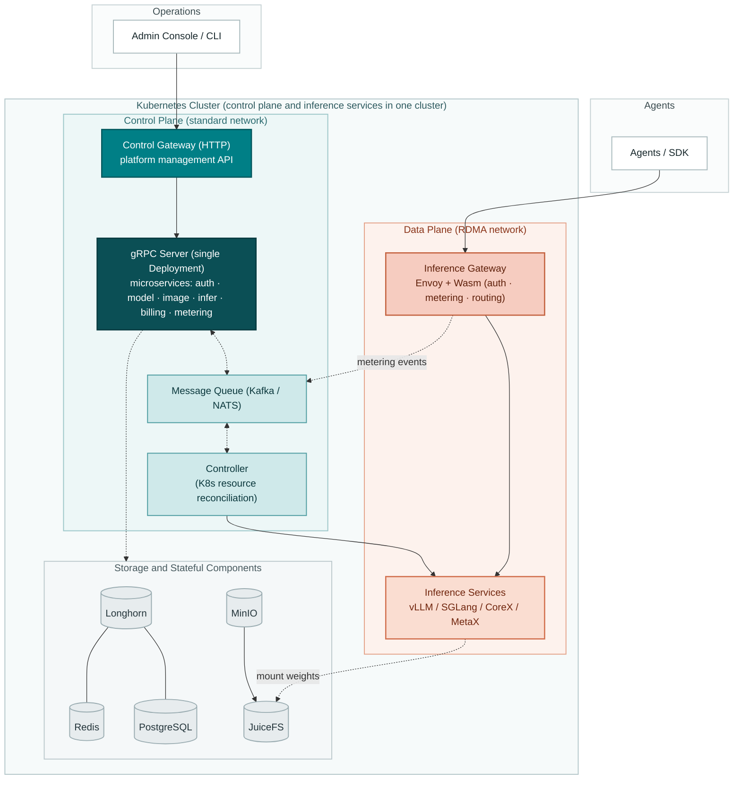
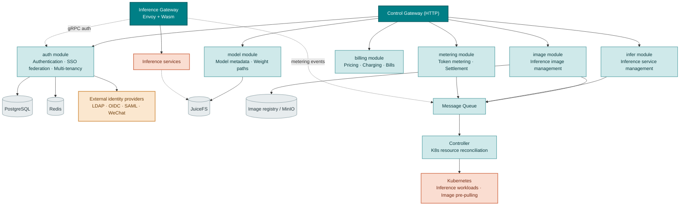
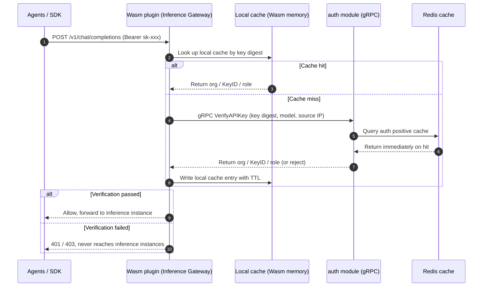
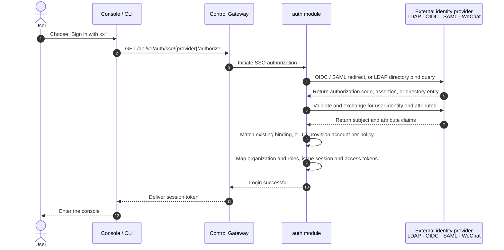
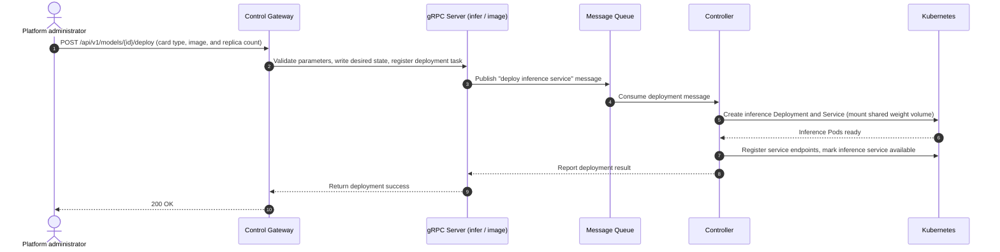
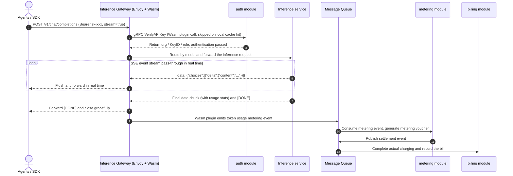

# Go TaaS Architecture Design

| Attribute | Content |
| --- | --- |
| Project name | Go TaaS (Token as a Service) |
| Overall positioning | A one-stop, open-source LLM inference service and metering/billing platform built on Kubernetes, providing OpenAI-compatible inference access and metered settlement for agents / SDKs |
| Document scope | Defines the system topology, component responsibility boundaries, control plane/data plane partitioning, and collaboration flows; implementation details such as data models, storage parameters, and runtime configuration are carried by each module's detailed design documents |
| Core architecture principles | Separate control plane and data plane gateways; microservice gRPC servers deployed as a single unit and decoupled from the Controller through a message queue; inference services and the control plane deployed in the same Kubernetes cluster |

---

## 1. Architecture Overview and Topology Design

### 1.1 Control Plane / Data Plane Separation

- **Control plane**: hosts the platform's own APIs — SSO federated login, users and organizations, API Keys, model and image management, inference service orchestration, pricing, and bills. Its entry point is the **Control Gateway** (HTTP), auto-generated from the Protobuf contract by `grpc-gateway` and backed by the unified gRPC Server.
- **Data plane**: hosts inference service APIs — OpenAI-compatible endpoints such as `/v1/chat/completions` and `/v1/embeddings`. Its entry point is the **Inference Gateway**, built on **Envoy** and serving programmatic callers such as **agents / SDKs**; authentication, metering, and routing are all performed at the gateway by **Wasm plugins**.
- **Independent deployment**: the two gateways are deployed as separate workloads. Control plane APIs and inference APIs are fully isolated in scaling, upgrade cadence, and failure domains — an overloaded or upgrading Inference Gateway does not affect platform management capabilities, and vice versa.

### 1.2 Service Topology and Communication Mechanisms

- **Unified gRPC service process**: the gRPC servers of all microservices (`auth`, `model`, `image`, `infer`, `billing`, `metering`) are deployed together in a single Deployment; modules call each other in-process, with no separate process per module;
- **Message queue decouples gRPC servers from the Controller**: the message queue (Kafka / NATS) carries **message passing between the microservice gRPC servers and the Controller**. gRPC servers only expose APIs, write desired state, and publish messages; the Controller consumes messages and drives Kubernetes resources, so the two can scale and restart independently;
- **Auto-generated RESTful APIs**: control plane HTTP/JSON APIs and OpenAPI documents are auto-generated from the Protobuf contract by `grpc-gateway`;
- **The data plane bypasses business processes**: inference requests are proxied by Envoy directly to inference instances; authentication and metering happen inside Wasm plugins, so business processes never become a forwarding bottleneck and streaming responses are not copied twice.

### 1.3 Deployment and Resource Model

- **Single cluster**: inference services and the control plane are deployed in the **same Kubernetes cluster**, sharing one control plane, message queue, and observability stack;
- **No quota module**: the platform does not introduce a standalone quota/rate-limiting module. When creating inference services, administrators can use the **entire cluster's available resources**; cluster capacity is naturally bounded by the Kubernetes scheduler and node resources;
- **Workload isolation**: inference workloads and control plane workloads are isolated through Namespaces, node labels, and taints/tolerations, so they coexist stably within one cluster.

---

## 2. Component Responsibilities

The dependencies and responsibility boundaries between components are as follows:

### 2.1 `auth` — Authentication, SSO Federation, and Multi-Tenancy

**Core responsibilities:**

- **Local account authentication**: user registration, login, and password policies; credentials are stored only as salted hashes;
- **Third-party SSO federated authentication**: a built-in **pluggable identity provider (IdP) framework** connects directly to existing enterprise account systems, without re-implementing the login chain for every protocol:
  - **OIDC / OAuth 2.0**: GitHub, Google, GitLab, and self-hosted enterprise IdPs;
  - **SAML 2.0**: enterprise-grade single sign-on;
  - **LDAP / LDAPS**: connects to enterprise directory services (Active Directory, OpenLDAP, etc.), supporting user-DN bind and group-based filtering;
  - **WeChat**: QR-code login via WeChat Open Platform and WeCom (Enterprise WeChat);
- **Multiple coexisting IdPs with pluggable configuration**: administrators can enable multiple IdPs at the same time, configuring protocol parameters, visibility scope, default organization, and whether auto-registration is allowed for each one; new providers plug in as independent extensions without touching the core login logic;
- **Account binding and JIT provisioning**: stable identifiers such as `issuer + subject` (OIDC / SAML) or `DN` (LDAP) serve as the primary key of the external identity and are bound to platform accounts; the first login can auto-create an account (Just-In-Time Provisioning), or auto-creation can be disabled so that administrators pre-assign accounts;
- **Attribute and role mapping**: maps the username, email, group, and role claims returned by the IdP to platform organizations, projects, and roles, delivering permissions based on the enterprise organizational structure;
- **Sessions and tokens**: after a successful SSO login, the platform issues a session and an access token, supporting token rotation and Single Logout; local password login can be toggled independently, coexisting with SSO or disabled entirely;
- Management and isolation of the two-level (organization / project) multi-tenancy model;
- Full API Key lifecycle management (creation, verification, revocation, expiry control); the plaintext is shown only once at creation, and the system stores only the salted hash digest;
- **API Key verification for the Control Gateway and the data plane Inference Gateway**: exposes an authentication gRPC interface for the Inference Gateway's Wasm plugin to call on every request, backed by a Redis positive cache for high-concurrency, low-latency verification;

**External dependencies:** PostgreSQL (accounts, tenants, and identity bindings), Redis (auth cache and sessions), external identity providers (LDAP / OIDC / SAML / WeChat)

### 2.2 `model` — Model Asset Management

**Core responsibilities:**

- Metadata registration and version management for open-source LLMs (Qwen, DeepSeek, LLaMA, etc.);
- Maintenance of model weight paths in object storage, so inference services can mount them directly through the shared file system;
- Tenant-level model authorization, deciding the set of models each tenant may consume.

**External dependencies:** PostgreSQL (model metadata), MinIO and JuiceFS (weight storage)

### 2.3 `image` — Inference Image Management

**Core responsibilities:**

- Unified management of inference engine container images: registration, versioning, and adaptation relationships for NVIDIA (vLLM / SGLang / TensorRT-LLM), Iluvatar CoreX, and MetaX images;
- Maintains the adaptation matrix between images and card types, engines, and model formats, providing the selectable image list for inference service orchestration;
- Drives image pre-pulling and caching: publishes pre-pull tasks to the message queue, which the Controller executes to pull images onto compute nodes ahead of time, shortening inference replica cold-start time;
- Verifies image provenance and integrity to keep untrusted images out of the inference chain.

**External dependencies:** image registry / MinIO (image and metadata storage), message queue (pre-pull task delivery)

### 2.4 `infer` — Inference Service Management

**Core responsibilities:**

- Heterogeneous compute management: unified support for the three hardware platforms — NVIDIA GPU, Iluvatar (CoreX), and MetaX;
- Lifecycle management of inference services: desired-state maintenance and change delivery for deployment, scaling, upgrade, and decommissioning;
- Inference engine adaptation: presents a unified OpenAI-compatible surface that hides engine differences;
- Health status and available endpoint registration of inference instances, used by the data plane gateway for routing;
- No quota limits: inference services are created with the administrator-specified replica count and card types, using the cluster's available resources.

**External dependencies:** message queue (change delivery), MinIO and JuiceFS (shared mounting of weights and images)

### 2.5 `metering` — Token Metering

**Core responsibilities:**

- Consumes metering events published by the data plane gateway's Wasm plugin, extracting token usage (Prompt / Completion / Cached / Reasoning);
- Generates tamper-proof metering vouchers;
- Delivers them asynchronously to the billing chain through the message queue, decoupling the inference chain from the accounting chain.

**External dependencies:** Redis (metering buffer), message queue (Kafka / NATS)

### 2.6 `billing` — Billing and Accounting

**Core responsibilities:**

- Maintains the "model × card type" price matrix, supporting tiered pricing and packages;
- Fund reservation at request admission and actual settlement after the request completes;
- Charge management for both account modes: balance (prepaid) and quota (postpaid);
- Bill generation, usage statistics, and reconciliation.

**External dependencies:** PostgreSQL (accounting data), message queue (metering event consumption)

### 2.7 Controller — Resource Reconciliation

**Core responsibilities:**

- Consumes change messages from the message queue and turns them into actual Kubernetes actions: creating/updating/deleting inference workloads, Services, and Endpoints;
- Executes image pre-pulling: lands the pre-pull tasks published by the `image` module onto specific nodes;
- Continuous reconciliation: observes gaps between actual and desired state and converges them, keeping inference services available;
- Decoupled from the gRPC servers through the message queue, so it can scale, restart, and upgrade independently.

**External dependencies:** message queue (message consumption), Kubernetes API, MinIO and JuiceFS (weight and image mounting)

---

## 3. Gateway Design

### 3.1 Control Gateway

- **Positioning**: the entry point for platform management APIs, serving only administrators and the console;
- **Implementation**: `grpc-gateway` auto-generates the HTTP/JSON proxy and OpenAPI documents from the Protobuf contract; all business logic lives in the unified gRPC Server;
- **Capabilities**: SSO federated login entry (authorization initiation and callback), model and image management, inference service orchestration, API Key and organization management, pricing and bill queries, and more;
- **Carries no inference traffic**: fully separated from the inference data plane for independent releases and fault isolation;
- **Admin/user surface separation**: management APIs consumed by the admin console are served under `/api/v1/admin/*` (model catalog, image management, inference service orchestration, API Key management, pricing and bills), while user-facing account APIs (login, signup) stay under `/api/v1/auth/*`. The admin web console is served under the `/admin` path prefix (`/admin/models`, `/admin/inference-services`, `/admin/api-keys`, …), keeping the regular-user surface (future user portal, feature #7) cleanly separated.

### 3.2 Data Plane (Inference) Gateway: Envoy + Wasm

The Inference Gateway is built on **Envoy** and implements the following capabilities at the gateway through **Wasm plugins**, so that inference traffic never passes through business processes:

| Capability | Description |
| --- | --- |
| **Authentication** | Parses the API Key from the `Authorization` header and **verifies it by calling the `auth` module's verification interface over gRPC**; invalid or revoked keys are rejected at the gateway and never reach inference instances |
| **Metering** | Parses token usage from streaming (SSE) and non-streaming responses, and emits metering events to the message queue for `metering` and `billing` to consume |
| **Routing** | Selects healthy inference instances per model, load balances, and retries on failure, shielding callers from backend instance changes |
| **Streaming pass-through** | Keeps SSE pass-through with per-event flush, avoiding buffering-induced latency |
| **Observability** | Uniformly produces access logs and metrics for capacity observation and troubleshooting |

> Note: because authentication and metering are pushed down to gateway Wasm plugins, the platform needs no standalone quota/rate-limiting module; if rate limiting is required, it can be enabled on demand as a gateway-side operations policy.

### 3.3 The Inference Gateway's API Key Authentication Chain

Every request on the inference data plane must have its API Key verified, and the authoritative decision belongs to the `auth` module. The Wasm plugin therefore makes no business decisions of its own — it **calls the `auth` module over gRPC** to complete verification:

- **Caller**: Envoy's Wasm plugin, initiating authentication at the request-header phase; implemented preferably with Envoy's `ext_authz` gRPC filter, or with a direct gRPC call from the Wasm plugin;
- **Callee**: the authentication gRPC interface exposed by the `auth` module, taking the API Key digest and request context (model, source IP) as input and returning the organization, Key ID, role, and the context needed for metering; the Wasm plugin **never connects to the database directly**;
- **Layered caching**: the Wasm plugin keeps a TTL-based local cache (30s recommended) keyed by the key digest; on a miss it falls back to `auth`, which is fronted by a Redis positive cache — the two cache layers keep per-request authentication overhead at the sub-millisecond level;
- **Timeout and failure policy**: authentication calls have millisecond-level timeouts and retries; on timeout or `auth` unavailability, requests are rejected under a **fail-closed** policy so that unauthorized traffic never reaches inference instances;
- **Revocation propagation**: the local cache TTL bounds the worst-case delay before a revocation takes effect; the control plane can broadcast cache invalidation to satisfy stricter immediate-revocation requirements;
- **Responsibility boundary**: the Wasm plugin only handles "calling, caching, and deciding"; authoritative judgments — API Key hash comparison, organization ownership, revocation, and expiry — always stay in the `auth` module.

---

## 4. Module Collaboration Flows

### 4.1 SSO Federated Login and Account Mapping

- **Pluggable**: adding an SSO provider only requires implementing the unified IdP plugin interface (authorization, callback, identity and attribute extraction), without touching the `auth` core login logic;
- **Security**: callbacks strictly validate `state` / `nonce` / signatures to prevent request forgery; external identities serve only as binding identifiers, and the platform always authorizes by its internal user ID.

### 4.2 One-Click Model Deployment Flow

### 4.3 Inference Request and Billing Loop

---

## 5. Storage and Network

### 5.1 Storage Tiers

| Storage | Serves | Responsibility |
| --- | --- | --- |
| **Longhorn** | The Kubernetes cluster itself | Provides persistent volumes (PVCs) for the control plane and in-cluster stateful components; block storage and replica redundancy via CSI |
| **MinIO** | Inference services | S3-compatible object storage holding inference engine images and model weight originals, and serving as the backend of JuiceFS |
| **JuiceFS** | Inference services | Mounts object storage as a POSIX file system; multiple replicas share the same weights and images, achieving second-level mounting and node-level caching |

- **Separation of duties**: Longhorn serves only in-cluster components (PostgreSQL, Redis, etc.) and takes no part in the inference data path; inference weights and images uniformly go through MinIO + JuiceFS;
- **Shared acceleration**: inference replicas share one JuiceFS volume, and with node-local caching, no replica re-pulls tens of GB of weights.

### 5.2 Network Tiers

| Network | Traffic carried | Description |
| --- | --- | --- |
| **Standard network** | Control plane traffic | Management APIs, inter-service calls, message queue, and storage access over standard Ethernet |
| **RDMA network** | Inference traffic | Inference requests and responses, KV Cache transfer, and multi-card communication; can use RoCE / InfiniBand to reduce latency and improve throughput |

- **Physical/logical separation**: inference's high-volume, low-latency traffic goes over RDMA while the control plane uses the standard network, avoiding mutual interference;
- **On-demand enablement**: RDMA is an enhancement of the inference network; where RDMA is not deployed, inference traffic can fall back to the standard network.

---

## 6. External System Dependency Boundaries

| External system | Used by | Responsibility |
| --- | --- | --- |
| PostgreSQL | auth · model · image · billing | Business data persistence and the transactional ledger |
| Redis | auth · metering | Auth cache and metering buffer |
| Longhorn | Control plane stateful components | Persistent storage (PVCs) for the cluster itself |
| MinIO | model · image | Object storage: model weights and inference images |
| JuiceFS | model · infer · Controller | Shared multi-replica mounting of weights and images |
| Kubernetes | Controller | Creation and reconciliation of inference workloads and image pre-pulling |
| Kafka / NATS | Microservice gRPC servers · Controller | Message passing between the gRPC servers and the Controller |
| Envoy | Inference Gateway (data plane) | Authentication, metering, and proxying of inference requests |
| External identity providers (LDAP / OIDC / SAML / WeChat) | auth | Third-party SSO federated login and the source of user attributes |

> Authentication chain: before allowing a request through, the Inference Gateway's Wasm plugin verifies the API Key by **calling the `auth` module over gRPC**; on a Wasm local-cache miss it falls back to `auth`, which is fronted by a Redis positive cache — the two cache layers keep latency low under high concurrency, and requests are rejected fail-closed on timeout or unavailability.
