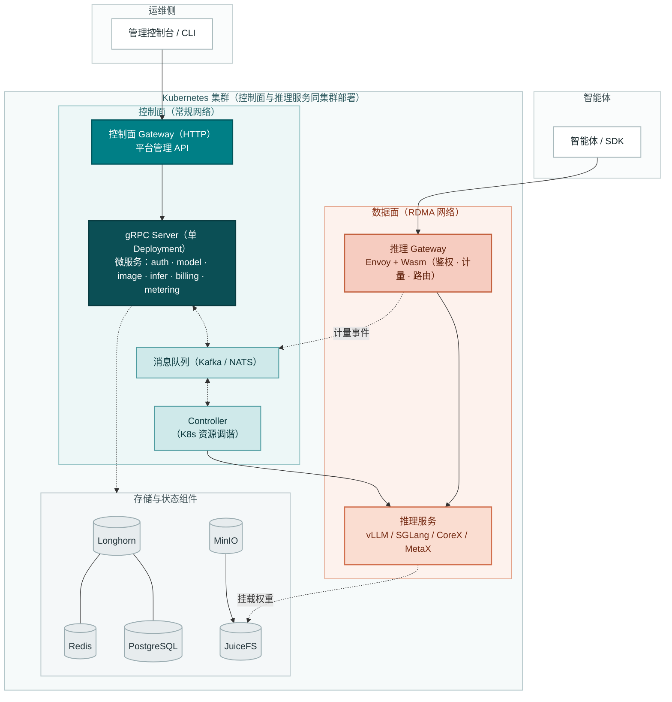
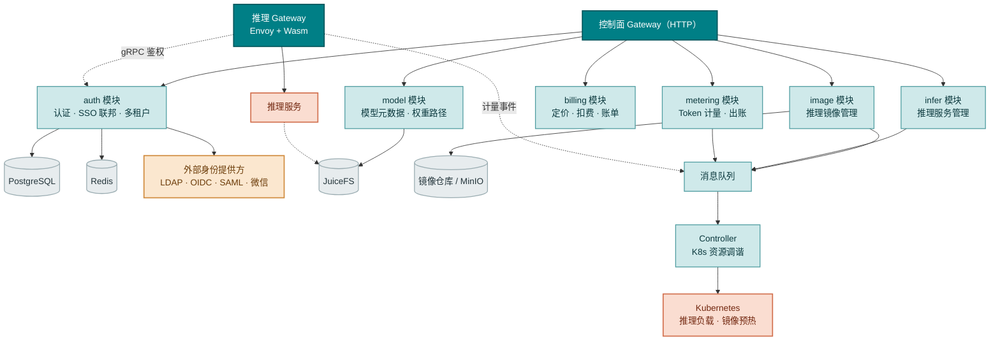
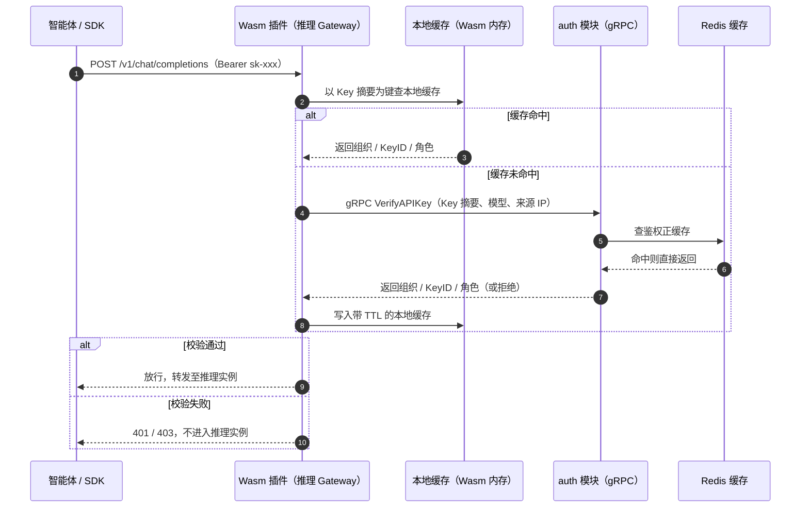
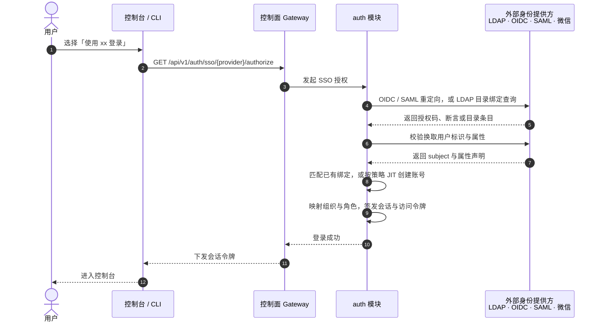
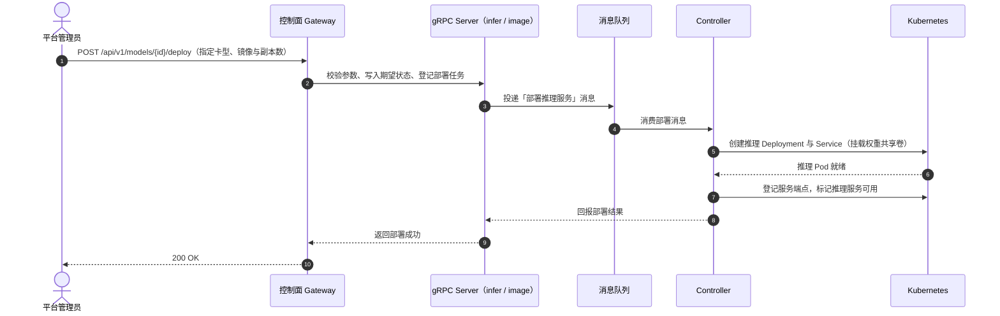
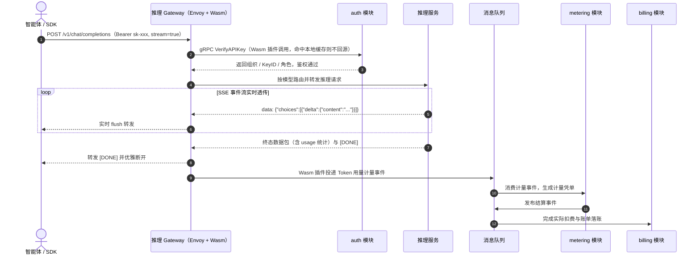

# Go TaaS 架构设计文档

| 属性 | 内容 |
| --- | --- |
| 项目名称 | Go TaaS（Token as a Service） |
| 整体定位 | 基于 Kubernetes 的一站式开源大模型推理服务与计费平台，面向智能体 / SDK 提供 OpenAI 兼容的推理接入与计量结算 |
| 文档范围 | 定义系统拓扑、组件职责边界、控制面/数据面划分与协作流程；数据模型、存储参数、运行时配置等实现细节由各模块的详细设计文档另行承载 |
| 核心架构原则 | 控制面与数据面网关分离；微服务 gRPC server 合并部署并通过消息队列与 Controller 解耦；推理服务与控制面部署于同一 Kubernetes 集群 |

---

## 1. 架构总览与拓扑设计

### 1.1 控制面与数据面分离

- **控制面（Control Plane）**：承载平台自身的 API——SSO 联邦登录、用户与组织、API Key、模型与镜像管理、推理服务编排、定价与账单。入口是**控制面 Gateway**（HTTP），由 `grpc-gateway` 从 Protobuf 契约自动生成，背后是统一的 gRPC Server。
- **数据面（Data Plane）**：承载推理服务的 API——OpenAI 兼容的 `/v1/chat/completions`、`/v1/embeddings` 等端点。入口是**推理 Gateway**，基于 **Envoy** 实现，面向**智能体 / SDK** 等程序化调用方，鉴权、计量与路由均由 **Wasm 插件**在网关侧完成。
- **独立部署**：两个网关各自作为独立工作负载部署。控制面 API 与推理 API 在扩缩容、升级节奏与故障域上完全隔离——推理 Gateway 过载或升级不会影响平台管理能力，反之亦然。

### 1.2 服务形态与通信机制

- **统一 gRPC 服务进程**：各微服务（`auth`、`model`、`image`、`infer`、`billing`、`metering`）的 gRPC server 合并部署于同一个 Deployment，模块间在进程内直接调用，无需为每个模块单独部署进程；
- **消息队列解耦 gRPC server 与 Controller**：消息队列（Kafka / NATS）承担**微服务 gRPC server 与 Controller 之间的消息传递**。gRPC server 只负责对外接口与期望状态写入并投递消息，Controller 消费消息后驱动 Kubernetes 资源，二者可独立扩缩容与重启；
- **RESTful API 自动生成**：控制面 HTTP/JSON 接口与 OpenAPI 文档由 `grpc-gateway` 从 Protobuf 契约自动生成；
- **数据面不经过业务进程**：推理请求由 Envoy 直接代理至推理实例，鉴权与计量在 Wasm 插件内完成，避免业务进程成为转发瓶颈，也避免流式响应的二次拷贝。

### 1.3 部署与资源形态

- **单一集群**：推理服务与控制面部署在**同一个 Kubernetes 集群**内，共享一套控制面、消息队列与可观测性设施；
- **不设配额模块**：平台不引入独立的配额/限流模块。管理员创建推理服务时可使用**整个集群的可用资源**，集群容量由 Kubernetes 调度器与节点资源自然约束；
- **负载隔离**：推理工作负载与控制面工作负载通过 Namespace、节点标签与污点/容忍度隔离，可在同一集群内稳定共存。

---

## 2. 组件职责定义

各组件间的依赖关系与职责边界如下：

### 2.1 `auth` —— 认证、SSO 联邦与多租户管理

**核心职责：**

- **本地账号认证**：用户注册、登录与密码策略，凭据仅以加盐哈希落库；
- **第三方 SSO 联邦认证**：内置**插件化身份提供方（IdP）框架**，可直接对接企业既有账号体系，无需为每种协议重复实现登录链路：
  - **OIDC / OAuth 2.0**：GitHub、Google、GitLab 以及企业自建 IdP；
  - **SAML 2.0**：企业级单点登录；
  - **LDAP / LDAPS**：对接企业目录服务（Active Directory、OpenLDAP 等），支持基于用户 DN 绑定与按组过滤；
  - **微信**：微信开放平台与企业微信扫码登录；
- **多 IdP 并存与可插拔配置**：管理员可同时启用多个 IdP，并分别配置协议参数、可见范围、默认组织与是否允许自动注册；新增提供方以独立插件接入，不侵入核心登录逻辑；
- **账号绑定与 JIT 预置**：以 `issuer + subject`（OIDC / SAML）或 `DN`（LDAP）等稳定标识作为外部身份主键，与平台账号绑定；首次登录可自动创建账号（Just-In-Time Provisioning），亦可关闭自动创建，改由管理员预先分配；
- **属性与角色映射**：把 IdP 返回的用户名、邮箱、组与角色声明映射为平台的组织、项目与角色，实现基于企业组织架构的权限下发；
- **会话与令牌**：SSO 登录成功后签发平台会话与访问令牌，支持令牌轮换与统一登出（Single Logout）；本地密码登录可独立开关，与 SSO 并存或完全禁用；
- 组织 / 项目两级多租户体系的管理与隔离；
- API Key 全生命周期管理（创建、鉴权、吊销、过期控制），明文仅在创建时展示一次，系统只保存加盐哈希摘要；
- **为控制面 Gateway 与数据面推理 Gateway 提供 API Key 校验能力**：对外暴露鉴权 gRPC 接口，供推理 Gateway 的 Wasm 插件逐请求调用，并以 Redis 正缓存支撑高并发低时延校验；

**外部依赖：** PostgreSQL（账户、租户与身份绑定数据）、Redis（鉴权缓存与会话）、外部身份提供方（LDAP / OIDC / SAML / 微信）

### 2.2 `model` —— 模型资产管理

**核心职责：**

- 开源大模型（Qwen、DeepSeek、LLaMA 等）的元数据注册与版本管理；
- 模型权重在对象存储中的路径维护，供推理服务通过共享文件系统直接挂载；
- 租户级模型授权管理，决定各租户可消费的模型范围。

**外部依赖：** PostgreSQL（模型元数据）、MinIO 与 JuiceFS（权重存储）

### 2.3 `image` —— 推理镜像管理

**核心职责：**

- 统一管理推理引擎容器镜像：NVIDIA（vLLM / SGLang / TensorRT-LLM）、天数智芯 CoreX、沐曦 MetaX 各路镜像的登记、版本与适配关系；
- 维护镜像与卡型、引擎、模型格式的适配矩阵，为推理服务编排提供可选的镜像清单；
- 驱动镜像预热与缓存：向消息队列投递预热任务，由 Controller 在各算力节点提前拉取镜像，缩短推理副本冷启动时间；
- 校验镜像来源与完整性，避免不可信镜像进入推理链路。

**外部依赖：** 镜像仓库 / MinIO（镜像与元数据存储）、消息队列（预热任务投递）

### 2.4 `infer` —— 推理服务管理

**核心职责：**

- 异构算力纳管：统一支持 NVIDIA GPU、天数智芯（CoreX）、沐曦（MetaX）三类硬件平台；
- 推理服务的生命周期管理：部署、扩缩容、升级与下线的期望状态维护与变更投递；
- 推理引擎适配：对外统一呈现 OpenAI 兼容能力，屏蔽各引擎差异；
- 推理实例的健康状态与可用端点登记，供数据面 Gateway 路由使用；
- 不设配额限制：创建推理服务时按管理员指定的副本数与卡型使用集群可用资源。

**外部依赖：** 消息队列（变更投递）、MinIO 与 JuiceFS（权重与镜像共享挂载）

### 2.5 `metering` —— Token 计量

**核心职责：**

- 消费数据面 Gateway 的 Wasm 插件投递的计量事件，提取 Token 用量（Prompt / Completion / Cached / Reasoning）；
- 生成防篡改的计量凭单；
- 通过消息队列异步投递给计费链路，解耦推理链路与账务链路。

**外部依赖：** Redis（计量缓冲）、消息队列（Kafka / NATS）

### 2.6 `billing` —— 计费与账务

**核心职责：**

- 维护「模型 × 卡型」价格矩阵，支持阶梯价与套餐；
- 请求准入时的资金预占与请求完成后的实际结算；
- 余额（预付费）与额度（后付费）两种账户模式的扣费管理；
- 账单生成、用量统计与对账。

**外部依赖：** PostgreSQL（账务数据）、消息队列（计量事件消费）

### 2.7 Controller —— 资源调谐

**核心职责：**

- 消费消息队列中的变更消息，将其转化为 Kubernetes 资源的实际动作：创建/更新/删除推理工作负载、Service 与 Endpoint；
- 执行镜像预热：把 `image` 模块投递的预热任务落到具体节点；
- 持续调谐：观测实际状态与期望状态的差异并收敛，保证推理服务可用；
- 与 gRPC server 通过消息队列解耦，可独立扩缩容、重启与升级。

**外部依赖：** 消息队列（消息消费）、Kubernetes API、MinIO 与 JuiceFS（权重与镜像挂载）

---

## 3. 网关设计

### 3.1 控制面 Gateway

- **定位**：平台管理 API 的入口，只服务管理员与控制台；
- **实现**：`grpc-gateway` 从 Protobuf 契约自动生成 HTTP/JSON 代理与 OpenAPI 文档，业务逻辑完全在统一 gRPC Server 内；
- **承载能力**：SSO 联邦登录入口（授权发起与回调）、模型与镜像管理、推理服务编排、API Key 与组织管理、定价与账单查询等；
- **不承载推理流量**：与推理数据面完全分离，便于独立发布与故障隔离；
- **管理员/用户面分离**：管理控制台消费的管理类 API 位于 `/api/v1/admin/*`（模型目录、镜像管理、推理服务编排、API Key 管理、定价与账单），用户账户类 API（登录、注册）位于 `/api/v1/auth/*`。管理控制台 Web 页面位于 `/admin` 路径前缀（`/admin/models`、`/admin/inference-services`、`/admin/api-keys` 等），与普通用户面（未来的用户门户，特性 #7）清晰分离。

### 3.2 数据面（推理）Gateway：Envoy + Wasm

推理 Gateway 基于 **Envoy** 构建，通过 **Wasm 插件**在网关侧实现以下能力，使推理流量不经过业务进程：

| 能力 | 说明 |
| --- | --- |
| **鉴权** | 解析 `Authorization` 头中的 API Key，**通过 gRPC 调用 `auth` 模块的鉴权接口**完成校验；非法或已吊销的 Key 在网关侧直接拒绝，不进入推理实例 |
| **计量** | 从流式（SSE）与非流式响应中解析 Token 用量，生成计量事件投递至消息队列，供 `metering` 与 `billing` 消费 |
| **路由** | 按模型选择健康推理实例、负载均衡与失败重试，屏蔽后端实例变化 |
| **流式透传** | 保持 SSE 逐事件 Flush 透传，避免缓冲导致的额外时延 |
| **可观测性** | 统一产出访问日志与指标，用于容量观测与问题定位 |

> 说明：由于鉴权与计量下沉到网关 Wasm 插件，平台不再需要独立的配额/限流模块；如需限流，可作为网关侧的运维策略按需开启。

### 3.3 推理 Gateway 的 API Key 鉴权调用链

推理数据面的每一次请求都需要校验 API Key，而鉴权的权威判断属于 `auth` 模块。因此 Wasm 插件不自己做业务判断，而是**通过 gRPC 调用 `auth` 模块**完成校验：

- **调用方**：Envoy 的 Wasm 插件，在请求头阶段发起鉴权；实现上优先使用 Envoy 的 `ext_authz` gRPC 过滤器，或由 Wasm 插件直接发起 gRPC 调用；
- **调用目标**：`auth` 模块暴露的鉴权 gRPC 接口，入参为 API Key 摘要与请求上下文（模型、来源 IP），出参为组织、Key ID、角色与计量所需上下文；Wasm 插件**不直连数据库**；
- **缓存分层**：Wasm 插件内维护带 TTL 的本地缓存（建议 30s），以 Key 摘要为键；未命中时再回源 `auth`，`auth` 侧再以 Redis 作为正缓存，两级缓存把逐请求鉴权开销保持在亚毫秒级；
- **超时与失败策略**：鉴权调用设置毫秒级超时与重试，超时或 `auth` 不可用时按 **fail-closed** 策略拒绝请求，避免未授权流量进入推理实例；
- **吊销生效**：本地缓存 TTL 决定吊销的最长生效延迟，可在控制面提供缓存失效广播以满足更严格的即时吊销要求；
- **职责边界**：Wasm 插件只负责“调用、缓存与判定”，API Key 的哈希比对、组织归属、吊销与过期等权威判断始终由 `auth` 模块完成。

---

## 4. 模块协作流程

### 4.1 SSO 联邦登录与账号映射

- **可插拔**：新增一种 SSO 提供方只需实现统一的 IdP 插件接口（授权、回调、标识与属性提取），不改动 `auth` 核心登录逻辑；
- **安全**：回调严格校验 `state` / `nonce` / 签名，避免请求伪造；外部身份仅作为绑定标识，平台始终以内部用户 ID 作为授权主体。

### 4.2 模型一键部署流程

### 4.3 推理请求与计费闭环

---

## 5. 存储与网络

### 5.1 存储分层

| 存储 | 服务对象 | 承担职责 |
| --- | --- | --- |
| **Longhorn** | Kubernetes 集群自身 | 为控制面与集群内有状态组件提供持久卷（PVC）；通过 CSI 提供块存储与副本冗余 |
| **MinIO** | 推理服务 | S3 兼容对象存储，存放推理引擎镜像与模型权重原始件，并作为 JuiceFS 的后端 |
| **JuiceFS** | 推理服务 | 将对象存储挂载为 POSIX 文件系统，多副本共享同一份权重与镜像，实现秒级挂载与节点级缓存 |

- **职责分离**：Longhorn 只面向集群内部件（PostgreSQL、Redis 等），不参与推理数据链路；推理权重与镜像统一走 MinIO + JuiceFS；
- **共享加速**：推理多副本共享 JuiceFS 卷，配合节点本地缓存，避免每个副本重复拉取数十 GB 权重。

### 5.2 网络分层

| 网络 | 承载流量 | 说明 |
| --- | --- | --- |
| **常规网络** | 控制面流量 | 管理 API、微服务间调用、消息队列与存储访问，使用标准以太网 |
| **RDMA 网络** | 推理流量 | 推理请求与响应、KV Cache 传输与多卡通信，可使用 RoCE / InfiniBand，降低时延、提升吞吐 |

- **物理/逻辑分离**：推理的大流量与低时延诉求走 RDMA，控制面走常规网络，避免相互干扰；
- **按需启用**：RDMA 是推理网络的增强能力，未部署 RDMA 时推理流量可回落至常规网络。

---

## 6. 外部系统依赖边界

| 外部系统 | 使用组件 | 承担职责 |
| --- | --- | --- |
| PostgreSQL | auth · model · image · billing | 业务数据持久化与事务账本 |
| Redis | auth · metering | 鉴权缓存、计量缓冲 |
| Longhorn | 控制面有状态组件 | 集群自身持久化存储（PVC） |
| MinIO | model · image | 对象存储：模型权重与推理镜像 |
| JuiceFS | model · infer · Controller | 权重与镜像的多副本共享挂载 |
| Kubernetes | Controller | 推理工作负载与镜像预热的创建与调谐 |
| Kafka / NATS | 微服务 gRPC server · Controller | gRPC server 与 Controller 之间的消息传递 |
| Envoy | 推理 Gateway（数据面） | 推理请求的鉴权、计量与代理转发 |
| 外部身份提供方（LDAP / OIDC / SAML / 微信） | auth | 第三方 SSO 联邦登录与用户属性来源 |

> 鉴权调用链：推理 Gateway 的 Wasm 插件在放行前通过 **gRPC 调用 `auth` 模块**校验 API Key；未命中 Wasm 本地缓存时回源 `auth`，`auth` 再以 Redis 正缓存先承接，两级缓存保证高并发下的低时延，并在超时或不可用时按 fail-closed 拒绝。
