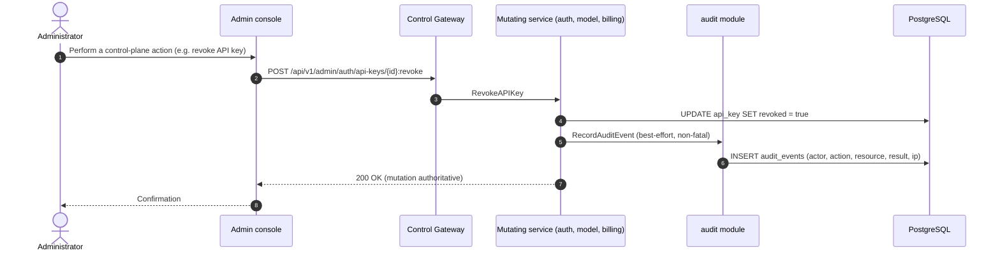
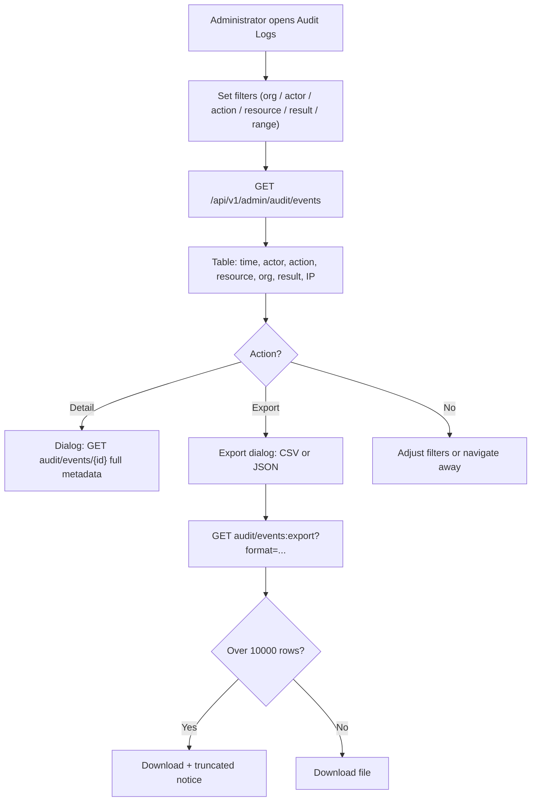
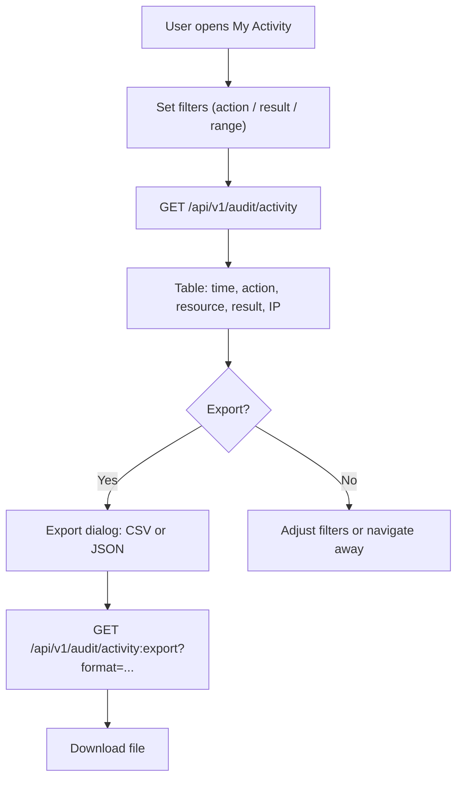

# Audit Logging & Activity Export — Requirement Analysis and UI/UX Design

| Attribute | Content |
| --- | --- |
| Feature point | Audit logging & activity export |
| Document scope | Requirement analysis and UI/UX design for feature-15: the `audit_events` table and its write path (a best-effort, non-fatal audit recorder invoked by every control-plane mutation), the admin Audit Logs page with filterable table, drill-down detail, and CSV/JSON export, the end-user My Activity page with its own scoped export, and acceptance criteria |
| Owning modules | New `audit` module (audit_events table, recorder, list/detail/export RPCs), with `auth` (actor identity, session) and `tenancy` (org scoping) read-only; console web app |
| Related documents | [Architecture Design](./architecture.md) — §2.1 `auth`, §2.6 `billing`, §3.1 admin/user surface separation · [Console Surface Separation](./console-surface-separation.md) — the two-console split this feature's two pages must respect · [Request Logs & API Playground](./request-logs-playground.md) — the diagnostic log this feature complements (request logs are per-inference diagnostics; audit events are control-plane actions) · [Organization Members, Roles & Invitations](./org-members-rbac.md) — the RBAC roles that gate who may view and export audit data |
| Status | Design complete, handed to the Architect agent |

---

## 1. Background

Features #1–#14 closed the accounting, observability, and governance loop: API keys, models, images, inference services, pricing, metering, billing, members, and invitations all have real rows and console pages. But **who changed what, when, and with what result is not recorded anywhere**. The request log (feature #12) captures per-inference diagnostics on the data plane, but the control plane — every console action that mutates a key, a model, a price, a member, or a bill — leaves no trace. When an operator asks "who revoked this API key?", "who changed this price?", or "who invited this member?", the console has no answer. There is no audit trail, no way to attribute a control-plane change to an actor, and no way to export activity for compliance or incident review.

This feature point delivers the audit spine: an `audit_events` table recording every control-plane mutation (actor, action, resource, result, IP, timestamp), a best-effort recorder invoked by every mutating control-plane API, an admin Audit Logs page (filterable table, drill-down detail, CSV/JSON export), and an end-user My Activity page (the caller's own account events, with a scoped export). The two pages live on the two separate console surfaces, per the fixed product decision.

### 1.1 How Comparable Products Implement Audit Logging & Activity Export

| Product | Audit log | Activity export | Filtering | Notable pitfalls |
| --- | --- | --- | --- | --- |
| **AWS CloudTrail** | Management events (who/what/when/result) recorded for every API call; Event history viewable for 90 days | Download a filtered or complete file of the last 90 days of management events; trails deliver to S3 | Filter on a single attribute at a time in Event history; richer queries in CloudTrail Lake | Event history filters on one attribute only; full export is a separate trail/S3 concern; retention is a pricing decision |
| **Google Cloud Audit Logs** | Admin activity, data access, and system event logs per project | Logs exportable to Cloud Storage / BigQuery via sinks | Filter by principal, resource, method, time | Export is sink-based (async, infra-heavy); not a simple console download |
| **OpenAI Platform** | Audit log of org-level actions (member changes, key changes, settings) | CSV export of audit log entries | Filter by actor, action, resource, time | Audit log is admin-only; end-users see no activity trail |
| **Anthropic Console** | Workspace audit log of admin actions | Export of audit log entries | Filter by actor, action, time | Admin-only; coarse action taxonomy |
| **GitHub** | Audit log of org/repo actions (who/what/when/IP) | CSV export of audit log entries | Filter by actor, action, resource, time | Export is capped; large orgs need the API |
| **Stripe** | Activity log of account events | CSV export | Filter by type, time | Event taxonomy is large and noisy |
| **阿里云 / 腾讯云 (Alibaba / Tencent Cloud)** | ActionTrail / CloudAudit of console and API actions | Export to OSS/COS buckets | Filter by user, action, resource, time | Export is bucket-based (async); console download is limited |

### 1.2 Distilled Patterns and Decisions

Patterns worth adopting:

1. **Record every control-plane mutation** — CloudTrail's core insight: every mutating API call leaves an event with actor, action, resource, result, and timestamp. The audit log is the control-plane counterpart to the data-plane request log.
2. **Best-effort, non-fatal write** — an audit write must never fail or block the mutation it records (the request-log D2 pattern). The mutation is authoritative; the audit row is a trace.
3. **A curated action taxonomy** — GitHub and OpenAI use a bounded set of action names (not free text) so the console can render badges and filter reliably. Free-text actions invite drift.
4. **Filterable table + drill-down + export** — the standard audit surface (CloudTrail, GitHub, Stripe): a filterable list that drills into a single event and exports the filtered set.
5. **Two scopes, two surfaces** — the admin sees all tenants' audit events (operations-oriented); the end-user sees only their own account events (task-oriented). This maps exactly to the two-console split.
6. **Synchronous export with a row cap** — a simple console download (CSV/JSON) of the currently filtered set, capped to bound response size. Async/bucket export is deferred.

Pitfalls to avoid:

- **Recording only failures** — a successful destructive action (key revoke, member remove) is exactly what an auditor needs; log both results.
- **Free-text actions** — unconstrained action strings cannot be filtered or rendered as badges. The curated enum is the contract.
- **Audit write on the hot path** — coupling the audit write to the mutation's success path adds latency and a failure point. Best-effort, non-fatal.
- **No retention** — an unbounded audit table grows forever. A configurable retention window bounds storage.
- **Exporting without a cap** — an unbounded export can hang the console. A row cap bounds the response.
- **Mixing the two surfaces** — an admin page must never call a `/api/v1/*` route and a user page must never call `/api/v1/admin/*`. The two audit surfaces are separate pages, separate APIs, separate authorization.

**Decisions for go-taas** (recorded rationale, per the autonomous-decision rule):

| # | Decision | Rationale |
| --- | --- | --- |
| D1 | **New `audit` module** owning the `audit_events` table and the list/detail/export RPCs, with its own error block **106xx** | Audit is a cross-cutting control-plane concern with its own lifecycle and retention; a dedicated module keeps it separable and testable, mirroring how metering owns request logs |
| D2 | **`audit_events` is a separate table from `request_logs`** — same idea, different plane | Request logs are per-inference data-plane diagnostics (30-day retention, feature #12); audit events are control-plane actions (longer retention, compliance value). Sharing a table would force one lifecycle on both |
| D3 | **The audit write is best-effort and non-fatal** — every mutating control-plane API calls the recorder after the mutation succeeds; a recorder failure is logged and never fails or rolls back the mutation | The mutation is authoritative; the audit row is a trace. A failed audit write must never block a key revocation or a price change (the request-log D2 pattern) |
| D4 | **A curated action taxonomy** — a closed enum of action names (e.g. `api_key.revoke`, `member.remove`, `price.update`, `auth.login`), each with a human label, grouped by resource type | A bounded enum is filterable, renderable as a badge, and testable; free-text actions invite drift (pattern 3) |
| D5 | **Both results are recorded** — every event carries `result` (`success`/`failure`); a failed login and a successful key revoke are both audit-worthy | An auditor needs the full picture; recording only failures hides destructive successes (pitfall 1) |
| D6 | **Configurable retention** (default 365 days) enforced by a periodic cleanup runner, separate from request-log cleanup | Audit events have compliance value and a longer window than diagnostics; retention is configuration, not code |
| D7 | **Synchronous export with a row cap** (default 10,000 rows) — the console downloads the currently filtered set as CSV or JSON; async/bucket export is deferred | A simple console download is testable in Nightwatch and bounds the response; bucket export is infrastructure (CloudTrail/Google sink pattern) |
| D8 | **Two audit surfaces** — an admin Audit Logs page (`/admin/audit-logs`, `/api/v1/admin/audit/*`) showing all tenants' events, and an end-user My Activity page (`/activity`, `/api/v1/audit/*`) showing only the caller's own events | The two-console split (feature #17) is binding; admin is operations-oriented, end-user is task-oriented (pattern 5) |
| D9 | **New error codes 10601 `CodeAuditEventNotFound`, 10602 `CodeAuditExportInvalid`, 10603 `CodeAuditRangeInvalid`** | The 106xx block is the audit module's; each failure mode needs its own code so the console renders the right inline message (the metering D9 pattern) |
| D10 | **Deferred**: async/bucket export, real-time streaming of audit events, audit-event webhooks, per-action retention tiers, and audit of the data plane (the data plane stays request-logged, feature #12) | Bucket export and webhooks are infrastructure; streaming is a UX nicety; data-plane audit is a separate concern owned by request logs |

### 1.3 Scope Boundary

**In scope**: the `audit_events` table (audit_event_id, organization_id, actor_user_id, actor_type, action, resource_type, resource_id, result, ip_address, user_agent, metadata, created_at); the best-effort recorder invoked by mutating control-plane APIs; `ListAuditEvents`, `GetAuditEvent`, and `ExportAuditEvents` admin RPCs; `ListMyActivity` and `ExportMyActivity` end-user RPCs; the admin Audit Logs page (filterable table, drill-down detail, CSV/JSON export); the end-user My Activity page (scoped table + export); new error codes 10601–10603.

**Out of scope** (tracked elsewhere): async/bucket export (D10), real-time streaming, audit webhooks, per-action retention tiers, data-plane audit (feature #12 owns request logs), and audit of read-only console views (only mutations and auth events are recorded).

---

## 2. User Roles

| Role | Description | Interaction with audit logging & activity export |
| --- | --- | --- |
| **Platform administrator** | The operator who runs the go-taas cluster | Views and exports audit events across all tenants on the admin Audit Logs page; investigates who changed what and when |
| **Organization administrator** | A tenant-side administrator (feature #10) | Views and exports their org's audit events on the admin Audit Logs page (org-scoped); investigates member, key, and billing changes in their tenant |
| **Organization member / viewer** | A working or read-only member of an org | Sees their own account activity on the end-user My Activity page; cannot see other users' events |
| **End-user / Agent** | The ordinary tenant user consuming models | Views and exports their own account activity (logins, key changes, usage-related events) on the My Activity page |
| **Auditor** | Whoever resolves a compliance or incident question | Uses the admin Audit Logs page filtered by actor/action/resource/result/range to reconstruct a sequence of control-plane changes, and exports the filtered set |
| **Console (this feature)** | The two web UIs | Renders the admin Audit Logs page and the end-user My Activity page |

> Terminology: the consuming caller is called an **Agent** (English) / 「智能体」(Chinese), consistent with the repo convention.

---

## 3. User Stories

| # | As a… | I want to… | So that… |
| --- | --- | --- | --- |
| US1 | Platform administrator | see a filterable list of all audit events across tenants | I can investigate who changed what and when |
| US2 | Platform administrator | drill into a single audit event for full metadata | I can see the actor, resource, result, IP, and context of a specific change |
| US3 | Platform administrator | export the filtered audit events as CSV or JSON | I can archive or analyze activity for compliance |
| US4 | Organization administrator | see and export my org's audit events only | I can audit my tenant without seeing other tenants |
| US5 | End-user | see my own account activity (logins, key changes) | I can confirm my account was not misused |
| US6 | End-user | export my own activity | I can keep a personal record |
| US7 | Auditor | filter by actor, action, resource, result, and time range | I can reconstruct a sequence of changes for an incident |
| US8 | Platform administrator | know that a failed login and a successful key revoke are both recorded | I have the full picture, not just failures |
| US9 | Organization member | be blocked from seeing other users' audit events | I cannot leak another user's activity |

---

## 4. Functional Requirements

### FR1 — `audit_events` table and recorder

- **FR1.1** The `audit_events` table stores one row per control-plane mutation or auth event: `audit_event_id` (UUID v4, primary key), `organization_id` (nullable for platform-level events), `actor_user_id`, `actor_type` (`user`/`system`/`api_key`), `action` (curated enum, D4), `resource_type` (enum), `resource_id` (string), `result` (`success`/`failure`), `ip_address`, `user_agent`, `metadata` (JSONB, extra context), `created_at`.
- **FR1.2** **Best-effort recorder** (D3): every mutating control-plane API calls the audit recorder after the mutation succeeds; a recorder failure is logged and never fails or rolls back the mutation. The recorder is invoked for at least: auth login/logout/login-failure, API key create/revoke, model create/update/deploy/undeploy, image register/delete, inference-service create/scale/delete, member add/remove/role-change, invitation create/revoke/accept/reject, price update, org create/update, and billing payment/auto-recharge/invoice.
- **FR1.3** Indexes: primary key on `audit_event_id`; composite on `(organization_id, created_at)` for org-scoped lists; composite on `(actor_user_id, created_at)` for the end-user activity list; `action` and `result` indexed for filtering.

### FR2 — Retention

- **FR2.1** A retention runner (a `server.Runner`, separate ticker from request-log cleanup) deletes audit events whose `created_at` is older than the configured retention (default **365 days**), in batches (default 1000 rows per pass), logging the count (D6).
- **FR2.2** Retention never touches request logs, vouchers, usage records, or charge records — audit events are the only table with the 365-day window.

### FR3 — Admin query and export APIs

- **FR3.1** `ListAuditEvents` (`GET /api/v1/admin/audit/events`) returns audit events filtered by `organization_id`, `actor_user_id`, `action`, `resource_type`, `result`, and `since`/`until` (unix seconds; defaults `until = now`, `since = until − 24h`), paginated (default 20, cap 100), newest first. `since > until` or a range > 366 days returns 10603.
- **FR3.2** `GetAuditEvent` (`GET /api/v1/admin/audit/events/{audit_event_id}`) returns one audit event with full metadata; unknown ids return 10601.
- **FR3.3** `ExportAuditEvents` (`GET /api/v1/admin/audit/events:export?format=csv|json`) returns the currently filtered set (same filters as `ListAuditEvents`) as CSV or JSON, capped at 10,000 rows (D7). An invalid `format` returns 10602; a filter set wider than the cap returns the first 10,000 rows with a `truncated: true` flag.
- **FR3.4** All three admin RPCs require an authenticated admin session; org-scoped results are gated by the caller's role in the resolved org context (feature #10's RoleGuard) — a caller may only see/export events for orgs they can access.

### FR4 — End-user query and export APIs

- **FR4.1** `ListMyActivity` (`GET /api/v1/audit/activity`) returns the caller's own audit events (where `actor_user_id` = the caller), filtered by `action`, `result`, and `since`/`until`, paginated (default 20, cap 100), newest first. `since > until` or a range > 366 days returns 10603.
- **FR4.2** `ExportMyActivity` (`GET /api/v1/audit/activity:export?format=csv|json`) returns the caller's own filtered events as CSV or JSON, capped at 10,000 rows. An invalid `format` returns 10602.
- **FR4.3** Both end-user RPCs require an authenticated user session and are hard-scoped to the caller — a caller can never see or export another user's events (US9).

### FR5 — Console Audit Logs page (admin)

- **FR5.1** An "Audit Logs" nav item (`/admin/audit-logs`) opens the page: a filter bar (organization, actor, action, resource type, result, time range with presets 24 h / 7 d / 30 d / 90 d / custom) and a table — time, actor, action badge, resource, org, result badge, IP.
- **FR5.2** A row action "Detail" opens a drill-down dialog (`GetAuditEvent`) showing the full metadata: actor, actor type, action, resource type/id, result, IP, user agent, org, metadata JSON, created_at.
- **FR5.3** An "Export" button (`audit-export`) offers CSV and JSON; it exports the currently applied filters (D7). A "truncated" notice appears when the export exceeds the 10,000-row cap.
- **FR5.4** The page shows a data-freshness note ("audit events appear within the ingestion window") and refreshes on a 60-second poll while visible. The empty state reads "No audit events match these filters".

### FR6 — Console My Activity page (end-user)

- **FR6.1** A "My Activity" nav item (`/activity`) opens the page: a filter bar (action, result, time range with presets 24 h / 7 d / 30 d / custom) and a table — time, action badge, resource, result badge, IP.
- **FR6.2** An "Export" button (`activity-export`) offers CSV and JSON; it exports the caller's own filtered events (D7). A "truncated" notice appears when the export exceeds the 10,000-row cap.
- **FR6.3** The page is hard-scoped to the caller (FR4.3); there is no org selector and no drill-down to other users. The empty state reads "No activity yet — your account actions will appear here".

---

## 5. Page and Flow Design

### 5.1 Page Map

| Page / component | Surface | Route | Purpose |
| --- | --- | --- | --- |
| **Audit Logs page** | admin | `/admin/audit-logs` | Filterable table of all tenants' audit events, drill-down detail, CSV/JSON export |
| **Audit event detail dialog** | admin | (on Audit Logs page) | Full metadata of one event |
| **My Activity page** | end-user | `/activity` | The caller's own account events, scoped export |
| **Export dialog** | both | (on each page) | Choose CSV or JSON and download the filtered set |

### 5.2 Surface Assignment Table

| Feature | Surface | Web route | API prefix |
| --- | --- | --- | --- |
| Audit Logs list + filters | admin | `/admin/audit-logs` | `/api/v1/admin/audit/events` |
| Audit event detail | admin | `/admin/audit-logs` (dialog) | `/api/v1/admin/audit/events/{id}` |
| Audit export (CSV/JSON) | admin | `/admin/audit-logs` (export action) | `/api/v1/admin/audit/events:export` |
| My Activity list + filters | end-user | `/activity` | `/api/v1/audit/activity` |
| My Activity export (CSV/JSON) | end-user | `/activity` (export action) | `/api/v1/audit/activity:export` |

> The admin Audit Logs page calls only `/api/v1/admin/audit/*`; the end-user My Activity page calls only `/api/v1/audit/*`. The two surfaces never share a session token (feature #17).

### 5.3 Audit Event Recording Sequence

### 5.4 Audit Logs Page Flow (admin)

### 5.5 My Activity Page Flow (end-user)

---

## 6. API Surface Implications

All audit RPCs belong to a new **`taas.audit.v1.AuditService`** (proto: `proto/taas/audit/v1/audit.proto`), served as HTTP via the Control Gateway. Admin RPCs live under `/api/v1/admin/audit/*`; end-user RPCs live under `/api/v1/audit/*`. The recorder is an internal gRPC call from mutating services to the audit module (in-process, per the single-Deployment topology).

| RPC | HTTP | Status | Purpose | Notes |
| --- | --- | --- | --- | --- |
| `RecordAuditEvent` | (internal gRPC) | **new** | Best-effort recorder invoked by mutating services | Non-fatal; never fails the mutation (D3) |
| `ListAuditEvents` | `GET /api/v1/admin/audit/events` | **new** | All tenants' events, filtered | Admin session; RoleGuard org-scoped; 10603 |
| `GetAuditEvent` | `GET /api/v1/admin/audit/events/{audit_event_id}` | **new** | One event's full metadata | Admin session; 10601 |
| `ExportAuditEvents` | `GET /api/v1/admin/audit/events:export` | **new** | CSV/JSON of the filtered set | Admin session; cap 10,000; 10602 |
| `ListMyActivity` | `GET /api/v1/audit/activity` | **new** | The caller's own events | User session; hard-scoped to caller; 10603 |
| `ExportMyActivity` | `GET /api/v1/audit/activity:export` | **new** | CSV/JSON of the caller's own events | User session; hard-scoped; cap 10,000; 10602 |

Contract constraints:

1. Admin RPCs are under `/api/v1/admin/audit/*` and require an admin session; end-user RPCs are under `/api/v1/audit/*` and require a user session. The two never mix (feature #17).
2. Wire-format conventions unchanged: dotted pagination (`?page.offset=0&page.limit=20`), success HTTP 200, business errors as `{"code": <int>, "message": "..."}`, int64 fields as JSON strings.
3. Export returns the same filter contract as the list RPCs, with `format=csv|json` and a `truncated: true` flag when the cap is hit (D7).
4. The recorder is best-effort and non-fatal: mutating services call it after the mutation succeeds and ignore its failure (D3).

Error codes (audit block 10601–10699, `pkg/errors/codes.go`):

| Condition | Code | Constant | Notes |
| --- | --- | --- | --- |
| Unknown `audit_event_id` on detail | 10601 | `CodeAuditEventNotFound` | **New** (D9) |
| Invalid export `format` (not `csv`/`json`) | 10602 | `CodeAuditExportInvalid` | **New** |
| Invalid time range (`since > until` or > 366 days) | 10603 | `CodeAuditRangeInvalid` | **New** |
| Caller's role below the required role (admin org scope) | 10036 | `CodeForbidden` | Existing (feature #10) |
| Missing/expired/revoked session | 10027 | `CodeSessionInvalid` | Existing (feature #7) |
| Database failure | 500 | `CodeInternal` | Via error normalization |

---

## 7. Acceptance Criteria

| # | Criterion | Verification |
| --- | --- | --- |
| AC1 | `RecordAuditEvent` stores an `audit_events` row with actor, action, resource, result, IP, and timestamp; a mutating API (e.g. key revoke) produces a `success` event | Unit + FVT |
| AC2 | **Best-effort non-fatal** — given a recorder failure, the mutation still succeeds and is acknowledged, and the failure is logged without retry | Unit |
| AC3 | **Both results recorded** — a failed login and a successful key revoke both produce audit events with the correct `result` | Unit + FVT |
| AC4 | `ListAuditEvents` filters by org, actor, action, resource type, result, and range, newest first, paginated; `since > until` or a range > 366 days returns 10603 | FVT |
| AC5 | `GetAuditEvent` returns full metadata; an unknown id returns 10601 | FVT |
| AC6 | `ExportAuditEvents` returns CSV and JSON of the filtered set; an invalid `format` returns 10602; a set over 10,000 rows returns the first 10,000 with `truncated: true` | FVT |
| AC7 | **End-user scoping** — `ListMyActivity`/`ExportMyActivity` return only the caller's own events; a caller can never see or export another user's events | FVT |
| AC8 | **Admin org scoping** — a caller can only see/export events for orgs they can access; an inaccessible org returns 10036 | FVT |
| AC9 | **Retention** — audit events older than 365 days are deleted in batches; request logs, vouchers, usage, and charge records are untouched | Unit |
| AC10 | The admin Audit Logs page renders the table with testid `audit-table` and rows `audit-row-{id}`, filters via `audit-filter-action`/`audit-filter-result`/`audit-filter-range`, drills into `audit-detail-{id}`, and exports via `audit-export` (CSV/JSON) | E2E |
| AC11 | The admin Audit Logs page shows the empty state when no rows match, the truncated notice on an over-cap export, and the data-freshness note | E2E |
| AC12 | The end-user My Activity page renders the table with testid `activity-table` and rows `activity-row-{id}`, filters via `activity-filter-action`/`activity-filter-result`, and exports via `activity-export` (CSV/JSON) | E2E |
| AC13 | **Surface separation** — the admin Audit Logs page calls only `/api/v1/admin/audit/*` and the My Activity page calls only `/api/v1/audit/*`; an unauthenticated visitor to either page is redirected to the correct login (`/admin/login` vs `/login`) | E2E |
| AC14 | Regression: the data plane is unchanged — request logs (feature #12) still capture per-inference diagnostics and audit events do not gate inference traffic | FVT + E2E regression |

---

## 8. Deferred Open Items

| Item | Deferred to |
| --- | --- |
| Async/bucket export (CloudTrail/Google sink pattern) | Future infrastructure |
| Real-time streaming of audit events | Future UX |
| Audit-event webhooks | Future infrastructure |
| Per-action retention tiers | Future |
| Data-plane audit (per-inference actions) | Feature #12 owns request logs |
| Audit of read-only console views | Future (only mutations and auth events are recorded) |