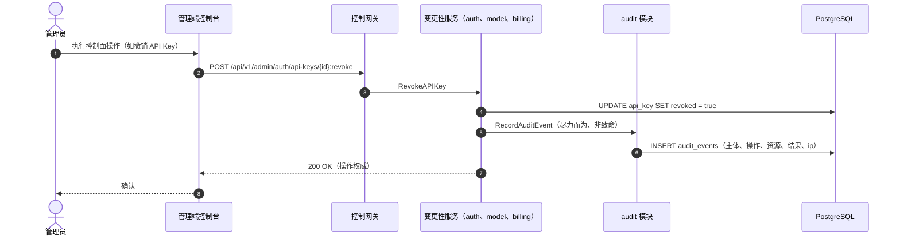
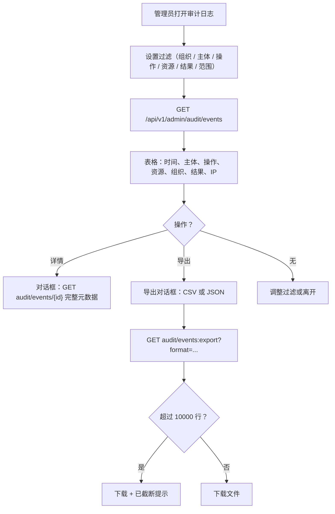
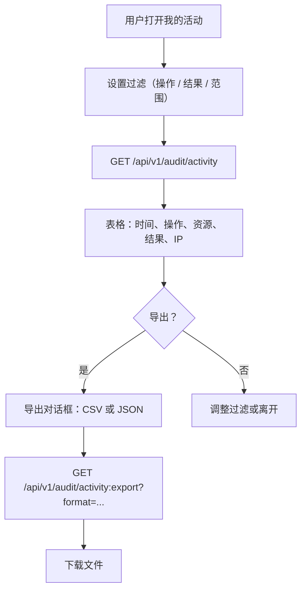

# 审计日志与活动导出 — 需求分析与 UI/UX 设计

| 属性 | 内容 |
| --- | --- |
| 特性点 | 审计日志与活动导出 |
| 文档范围 | 特性 #15 的需求分析与 UI/UX 设计：`audit_events` 表及其写入路径（由每个控制面变更操作调用的尽力而为、非致命审计记录器）、带可过滤表格、下钻详情与 CSV/JSON 导出的管理端「审计日志」页面、带范围限定导出的终端用户「我的活动」页面，以及验收标准 |
| 归属模块 | 新 `audit` 模块（audit_events 表、记录器、列表/详情/导出 RPC），配合 `auth`（主体身份、会话）与 `tenancy`（组织范围）只读；控制台 Web 应用 |
| 相关文档 | [架构设计](./architecture.zh-cn.md) — 第 2.1 节 `auth`、第 2.6 节 `billing`、第 3.1 节 管理端/用户端表面分离 · [控制台表面分离](./console-surface-separation.zh-cn.md) — 本特性两个页面必须遵守的双控制台拆分 · [请求日志与 API 游乐场](./request-logs-playground.zh-cn.md) — 本特性补充的诊断日志（请求日志是每次推理的诊断；审计事件是控制面操作）· [组织成员、角色与邀请](./org-members-rbac.zh-cn.md) — 把关谁能查看与导出审计数据的 RBAC 角色 |
| 状态 | 设计完成，已移交架构师代理 |

---

## 1. 背景

特性 #1–#14 闭环了核算、可观测性与治理：API Key、模型、镜像、推理服务、定价、计量、计费、成员与邀请都有真实的行与控制台页面。但**谁在何时改了什么、结果如何，没有任何地方记录**。请求日志（特性 #12）捕获数据面上的每次推理诊断，但控制面 — 控制台里每次变更 Key、模型、价格、成员或账单的操作 — 不留任何痕迹。当运营者问「谁撤销了这个 API Key？」「谁改了这条价格？」「谁邀请了这位成员？」时，控制台没有答案。没有审计轨迹，无法把控制面变更归因到某个主体，也无法为合规或事件复盘导出活动。

本特性交付审计主干：记录每个控制面变更（主体、操作、资源、结果、IP、时间戳）的 `audit_events` 表、由每个变更性控制面 API 调用的尽力而为记录器、带可过滤表格/下钻详情/CSV/JSON 导出的管理端「审计日志」页面，以及展示调用方自身账户事件（带范围限定导出）的终端用户「我的活动」页面。两个页面位于两个独立控制台表面，遵循既定产品决策。

### 1.1 竞品的审计日志与活动导出实现

| 产品 | 审计日志 | 活动导出 | 过滤 | 主要陷阱 |
| --- | --- | --- | --- | --- |
| **AWS CloudTrail** | 记录每个 API 调用的管理事件（谁/什么/何时/结果）；Event history 可查看 90 天 | 下载最近 90 天管理事件的过滤或完整文件；trail 投递到 S3 | Event history 一次只按单一属性过滤；CloudTrail Lake 中查询更丰富 | Event history 只按单一属性过滤；完整导出是独立的 trail/S3 关注点；保留期是定价决策 |
| **Google Cloud Audit Logs** | 按项目记录管理活动、数据访问与系统事件日志 | 通过 sink 导出到 Cloud Storage / BigQuery | 按主体、资源、方法、时间过滤 | 导出基于 sink（异步、基础设施重）；不是简单的控制台下载 |
| **OpenAI Platform** | 组织级操作（成员变更、Key 变更、设置）的审计日志 | 审计日志条目的 CSV 导出 | 按主体、操作、资源、时间过滤 | 审计日志仅限管理端；终端用户看不到活动轨迹 |
| **Anthropic Console** | 工作区管理操作的审计日志 | 审计日志条目导出 | 按主体、操作、时间过滤 | 仅限管理端；操作分类粗糙 |
| **GitHub** | 组织/仓库操作（谁/什么/何时/IP）的审计日志 | 审计日志条目的 CSV 导出 | 按主体、操作、资源、时间过滤 | 导出有上限；大型组织需要 API |
| **Stripe** | 账户事件的活动日志 | CSV 导出 | 按类型、时间过滤 | 事件分类庞大且嘈杂 |
| **阿里云 / 腾讯云** | 控制台与 API 操作的 ActionTrail / CloudAudit | 导出到 OSS/COS 桶 | 按用户、操作、资源、时间过滤 | 导出基于桶（异步）；控制台下载受限 |

### 1.2 提炼出的模式与决策

值得采纳的模式：

1. **记录每个控制面变更** — CloudTrail 的核心洞见：每个变更性 API 调用都留下带主体、操作、资源、结果与时间戳的事件。审计日志是数据面请求日志的控制面对应物。
2. **尽力而为、非致命写入** — 审计写入绝不能失败或阻塞它所记录的操作（请求日志 D2 模式）。操作是权威；审计行是痕迹。
3. **精选的操作分类** — GitHub 与 OpenAI 使用有界的操作名集合（而非自由文本），控制台才能可靠地渲染徽标与过滤。自由文本操作会招致漂移。
4. **可过滤表格 + 下钻 + 导出** — 标准审计表面（CloudTrail、GitHub、Stripe）：可过滤列表，下钻到单个事件，并导出过滤后的集合。
5. **两种范围、两个表面** — 管理端看到所有租户的审计事件（面向运营）；终端用户只看到自己的账户事件（面向任务）。这正好映射到双控制台拆分。
6. **带行数上限的同步导出** — 当前过滤集合的简单控制台下载（CSV/JSON），设上限以约束响应大小。异步/桶导出延后。

需要避免的陷阱：

- **只记录失败** — 成功的破坏性操作（Key 撤销、成员移除）正是审计者需要的；两种结果都要记录。
- **自由文本操作** — 不受约束的操作字符串无法过滤或渲染为徽标。精选枚举就是契约。
- **审计写入在热路径上** — 把审计写入耦合到操作的成功路径会增加延迟与故障点。尽力而为、非致命。
- **无保留期** — 无界的审计表会无限增长。可配置的保留窗口约束存储。
- **无上限导出** — 无界导出可能挂起控制台。行数上限约束响应。
- **混淆两个表面** — 管理端页面绝不能调用 `/api/v1/*` 路由，用户页面绝不能调用 `/api/v1/admin/*`。两个审计表面是独立页面、独立 API、独立授权。

**go-taas 的决策**（按自主决策规则记录依据）：

| # | 决策 | 依据 |
| --- | --- | --- |
| D1 | **新 `audit` 模块** 拥有 `audit_events` 表与列表/详情/导出 RPC，带自己的错误段 **106xx** | 审计是横切控制面关注点，有自己的生命周期与保留期；专用模块使其可分离、可测试，与计量模块拥有请求日志的方式一致 |
| D2 | **`audit_events` 是与 `request_logs` 独立的表** — 同一思路，不同平面 | 请求日志是数据面每次推理的诊断（30 天保留期，特性 #12）；审计事件是控制面操作（更长保留期、合规价值）。共享一张表会强制两者共用同一生命周期 |
| D3 | **审计写入尽力而为、非致命** — 每个变更性控制面 API 在操作成功后调用记录器；记录器失败被记录，绝不失败或回滚操作 | 操作是权威；审计行是痕迹。失败的审计写入绝不能阻塞 Key 撤销或价格变更（请求日志 D2 模式） |
| D4 | **精选的操作分类** — 封闭的操作名枚举（如 `api_key.revoke`、`member.remove`、`price.update`、`auth.login`），每个带人类可读标签，按资源类型分组 | 有界枚举可过滤、可渲染为徽标、可测试；自由文本操作会招致漂移（模式 3） |
| D5 | **两种结果都记录** — 每个事件携带 `result`（`success`/`failure`）；失败的登录与成功的 Key 撤销都值得审计 | 审计者需要全貌；只记录失败会隐藏破坏性的成功（陷阱 1） |
| D6 | **可配置保留期**（默认 365 天）由周期性清理运行器强制，与请求日志清理分离 | 审计事件有合规价值，窗口比诊断更长；保留期是配置，不是代码 |
| D7 | **带行数上限的同步导出**（默认 10,000 行）— 控制台把当前过滤集合下载为 CSV 或 JSON；异步/桶导出延后 | 简单的控制台下载可在 Nightwatch 中测试并约束响应；桶导出是基础设施（CloudTrail/Google sink 模式） |
| D8 | **两个审计表面** — 展示所有租户事件的管理端「审计日志」页面（`/admin/audit-logs`，`/api/v1/admin/audit/*`），以及只展示调用方自身事件的终端用户「我的活动」页面（`/activity`，`/api/v1/audit/*`） | 双控制台拆分（特性 #17）具有约束力；管理端面向运营，终端用户面向任务（模式 5） |
| D9 | **新错误码 10601 `CodeAuditEventNotFound`、10602 `CodeAuditExportInvalid`、10603 `CodeAuditRangeInvalid`** | 106xx 段属于 audit 模块；每种失败模式需要自己的码，控制台才能渲染正确的内联消息（计量 D9 模式） |
| D10 | **延后**：异步/桶导出、审计事件实时流、审计事件 webhook、按操作保留层级、以及数据面审计（数据面保持请求日志，特性 #12） | 桶导出与 webhook 是基础设施；实时流是 UX 锦上添花；数据面审计是请求日志拥有的独立关注点 |

### 1.3 范围边界

**范围内**：`audit_events` 表（audit_event_id、organization_id、actor_user_id、actor_type、action、resource_type、resource_id、result、ip_address、user_agent、metadata、created_at）；由变更性控制面 API 调用的尽力而为记录器；`ListAuditEvents`、`GetAuditEvent`、`ExportAuditEvents` 管理端 RPC；`ListMyActivity`、`ExportMyActivity` 终端用户 RPC；管理端「审计日志」页面（可过滤表格、下钻详情、CSV/JSON 导出）；终端用户「我的活动」页面（范围限定表格 + 导出）；新错误码 10601–10603。

**范围外**（另行跟踪）：异步/桶导出（D10）、实时流、审计 webhook、按操作保留层级、数据面审计（特性 #12 拥有请求日志）、以及只读控制台视图的审计（只记录变更与认证事件）。

---

## 2. 用户角色

| 角色 | 描述 | 与审计日志及活动导出的交互 |
| --- | --- | --- |
| **平台管理员** | 运营 go-taas 集群的人 | 在管理端「审计日志」页面查看并导出所有租户的审计事件；调查谁在何时改了什么 |
| **组织管理员** | 租户侧管理员（特性 #10） | 在管理端「审计日志」页面查看并导出其组织的审计事件（组织范围）；调查其租户内的成员、Key 与计费变更 |
| **组织成员 / 查看者** | 组织的在职或只读成员 | 在终端用户「我的活动」页面看到自己的账户活动；看不到其他用户的事件 |
| **终端用户 / 智能体** | 消费模型的普通租户用户 | 在「我的活动」页面查看并导出自己的账户活动（登录、Key 变更、用量相关事件） |
| **审计者** | 解决合规或事件问题的人 | 使用管理端「审计日志」页面按主体/操作/资源/结果/范围过滤，重建控制面变更序列，并导出过滤后的集合 |
| **控制台（本特性）** | 两个 Web UI | 渲染管理端「审计日志」页面与终端用户「我的活动」页面 |

> 术语：消费方调用者称为**智能体**（Agent），与仓库惯例一致。

---

## 3. 用户故事

| # | 作为… | 我想要… | 以便… |
| --- | --- | --- | --- |
| US1 | 平台管理员 | 查看跨所有租户的可过滤审计事件列表 | 我可以调查谁在何时改了什么 |
| US2 | 平台管理员 | 下钻到单个审计事件查看完整元数据 | 我可以看到特定变更的主体、资源、结果、IP 与上下文 |
| US3 | 平台管理员 | 把过滤后的审计事件导出为 CSV 或 JSON | 我可以为合规归档或分析活动 |
| US4 | 组织管理员 | 只查看并导出我组织的审计事件 | 我可以审计自己的租户而不看到其他租户 |
| US5 | 终端用户 | 查看自己的账户活动（登录、Key 变更） | 我可以确认账户未被滥用 |
| US6 | 终端用户 | 导出自己的活动 | 我可以保留个人记录 |
| US7 | 审计者 | 按主体、操作、资源、结果与时间范围过滤 | 我可以为事件重建变更序列 |
| US8 | 平台管理员 | 知道失败的登录与成功的 Key 撤销都被记录 | 我有全貌，而非只有失败 |
| US9 | 组织成员 | 被阻止查看其他用户的审计事件 | 我不能泄露其他用户的活动 |

---

## 4. 功能需求

### FR1 — `audit_events` 表与记录器

- **FR1.1** `audit_events` 表每行存储一个控制面变更或认证事件：`audit_event_id`（UUID v4，主键）、`organization_id`（平台级事件可为空）、`actor_user_id`、`actor_type`（`user`/`system`/`api_key`）、`action`（精选枚举，D4）、`resource_type`（枚举）、`resource_id`（字符串）、`result`（`success`/`failure`）、`ip_address`、`user_agent`、`metadata`（JSONB，额外上下文）、`created_at`。
- **FR1.2** **尽力而为记录器**（D3）：每个变更性控制面 API 在操作成功后调用审计记录器；记录器失败被记录，绝不失败或回滚操作。记录器至少为以下操作调用：认证登录/登出/登录失败、API Key 创建/撤销、模型创建/更新/部署/取消部署、镜像注册/删除、推理服务创建/扩缩容/删除、成员增/删/改角色、邀请创建/撤销/接受/拒绝、价格更新、组织创建/更新、以及计费支付/自动充值/发票。
- **FR1.3** 索引：`audit_event_id` 主键；`(organization_id, created_at)` 复合索引用于组织范围列表；`(actor_user_id, created_at)` 复合索引用于终端用户活动列表；`action` 与 `result` 索引用于过滤。

### FR2 — 保留期

- **FR2.1** 保留运行器（`server.Runner`，与请求日志清理分离的独立 ticker）删除 `created_at` 早于配置保留期（默认 **365 天**）的审计事件，分批（默认每批 1000 行），记录数量（D6）。
- **FR2.2** 保留期绝不触碰请求日志、凭证、用量记录或计费记录 — 审计事件是唯一带 365 天窗口的表。

### FR3 — 管理端查询与导出 API

- **FR3.1** `ListAuditEvents`（`GET /api/v1/admin/audit/events`）按 `organization_id`、`actor_user_id`、`action`、`resource_type`、`result` 与 `since`/`until`（unix 秒；默认 `until = now`，`since = until − 24h`）过滤返回审计事件，分页（默认 20，上限 100），最新在前。`since > until` 或范围 > 366 天返回 10603。
- **FR3.2** `GetAuditEvent`（`GET /api/v1/admin/audit/events/{audit_event_id}`）返回带完整元数据的单个审计事件；未知 id 返回 10601。
- **FR3.3** `ExportAuditEvents`（`GET /api/v1/admin/audit/events:export?format=csv|json`）把当前过滤集合（与 `ListAuditEvents` 相同的过滤条件）返回为 CSV 或 JSON，上限 10,000 行（D7）。非法 `format` 返回 10602；超过上限的过滤集合返回前 10,000 行并带 `truncated: true` 标志。
- **FR3.4** 三个管理端 RPC 都需要已认证的管理端会话；组织范围结果由调用方在已解析组织上下文中的角色把关（特性 #10 的 RoleGuard）— 调用方只能查看/导出其可访问组织的审计事件。

### FR4 — 终端用户查询与导出 API

- **FR4.1** `ListMyActivity`（`GET /api/v1/audit/activity`）返回调用方自身的审计事件（`actor_user_id` = 调用方），按 `action`、`result` 与 `since`/`until` 过滤，分页（默认 20，上限 100），最新在前。`since > until` 或范围 > 366 天返回 10603。
- **FR4.2** `ExportMyActivity`（`GET /api/v1/audit/activity:export?format=csv|json`）把调用方自身的过滤事件返回为 CSV 或 JSON，上限 10,000 行。非法 `format` 返回 10602。
- **FR4.3** 两个终端用户 RPC 都需要已认证的用户会话，并硬性限定到调用方 — 调用方绝不能看到或导出其他用户的事件（US9）。

### FR5 — 控制台「审计日志」页面（管理端）

- **FR5.1** 一个「审计日志」导航项（`/admin/audit-logs`）打开页面：过滤栏（组织、主体、操作、资源类型、结果、带 24 小时/7 天/30 天/90 天/自定义预设的时间范围）与表格 — 时间、主体、操作徽标、资源、组织、结果徽标、IP。
- **FR5.2** 行操作「详情」打开下钻对话框（`GetAuditEvent`）展示完整元数据：主体、主体类型、操作、资源类型/id、结果、IP、用户代理、组织、metadata JSON、created_at。
- **FR5.3** 一个「导出」按钮（`audit-export`）提供 CSV 与 JSON；它导出当前应用的过滤条件（D7）。导出超过 10,000 行上限时出现「已截断」提示。
- **FR5.4** 页面显示数据新鲜度提示（「审计事件在摄取窗口内出现」）并在可见时每 60 秒轮询刷新。空状态显示「没有匹配这些过滤条件的审计事件」。

### FR6 — 控制台「我的活动」页面（终端用户）

- **FR6.1** 一个「我的活动」导航项（`/activity`）打开页面：过滤栏（操作、结果、带 24 小时/7 天/30 天/自定义预设的时间范围）与表格 — 时间、操作徽标、资源、结果徽标、IP。
- **FR6.2** 一个「导出」按钮（`activity-export`）提供 CSV 与 JSON；它导出调用方自身的过滤事件（D7）。导出超过 10,000 行上限时出现「已截断」提示。
- **FR6.3** 页面硬性限定到调用方（FR4.3）；没有组织选择器，也没有下钻到其他用户。空状态显示「暂无活动 — 你的账户操作将出现在这里」。

---

## 5. 页面与流程设计

### 5.1 页面地图

| 页面 / 组件 | 表面 | 路由 | 用途 |
| --- | --- | --- | --- |
| **审计日志页面** | 管理端 | `/admin/audit-logs` | 所有租户审计事件的可过滤表格、下钻详情、CSV/JSON 导出 |
| **审计事件详情对话框** | 管理端 | （在审计日志页面上） | 单个事件的完整元数据 |
| **我的活动页面** | 终端用户 | `/activity` | 调用方自身的账户事件、范围限定导出 |
| **导出对话框** | 两者 | （在每个页面上） | 选择 CSV 或 JSON 并下载过滤后的集合 |

### 5.2 表面分配表

| 特性 | 表面 | Web 路由 | API 前缀 |
| --- | --- | --- | --- |
| 审计日志列表 + 过滤 | 管理端 | `/admin/audit-logs` | `/api/v1/admin/audit/events` |
| 审计事件详情 | 管理端 | `/admin/audit-logs`（对话框） | `/api/v1/admin/audit/events/{id}` |
| 审计导出（CSV/JSON） | 管理端 | `/admin/audit-logs`（导出操作） | `/api/v1/admin/audit/events:export` |
| 我的活动列表 + 过滤 | 终端用户 | `/activity` | `/api/v1/audit/activity` |
| 我的活动导出（CSV/JSON） | 终端用户 | `/activity`（导出操作） | `/api/v1/audit/activity:export` |

> 管理端「审计日志」页面只调用 `/api/v1/admin/audit/*`；终端用户「我的活动」页面只调用 `/api/v1/audit/*`。两个表面绝不共享会话令牌（特性 #17）。

### 5.3 审计事件记录时序

### 5.4 审计日志页面流程（管理端）

### 5.5 我的活动页面流程（终端用户）

---

## 6. API 表面影响

所有审计 RPC 属于新 **`taas.audit.v1.AuditService`**（proto：`proto/taas/audit/v1/audit.proto`），经控制网关以 HTTP 提供。管理端 RPC 位于 `/api/v1/admin/audit/*` 下；终端用户 RPC 位于 `/api/v1/audit/*` 下。记录器是变更性服务到 audit 模块的内部 gRPC 调用（进程内，遵循单 Deployment 拓扑）。

| RPC | HTTP | 状态 | 用途 | 备注 |
| --- | --- | --- | --- | --- |
| `RecordAuditEvent` | （内部 gRPC） | **新** | 由变更性服务调用的尽力而为记录器 | 非致命；绝不失败操作（D3） |
| `ListAuditEvents` | `GET /api/v1/admin/audit/events` | **新** | 所有租户的事件，已过滤 | 管理端会话；RoleGuard 组织范围；10603 |
| `GetAuditEvent` | `GET /api/v1/admin/audit/events/{audit_event_id}` | **新** | 单个事件的完整元数据 | 管理端会话；10601 |
| `ExportAuditEvents` | `GET /api/v1/admin/audit/events:export` | **新** | 过滤集合的 CSV/JSON | 管理端会话；上限 10,000；10602 |
| `ListMyActivity` | `GET /api/v1/audit/activity` | **新** | 调用方自身的事件 | 用户会话；硬性限定到调用方；10603 |
| `ExportMyActivity` | `GET /api/v1/audit/activity:export` | **新** | 调用方自身事件的 CSV/JSON | 用户会话；硬性限定；上限 10,000；10602 |

契约约束：

1. 管理端 RPC 位于 `/api/v1/admin/audit/*` 下并需要管理端会话；终端用户 RPC 位于 `/api/v1/audit/*` 下并需要用户会话。两者绝不混用（特性 #17）。
2. 线格式约定不变：点分分页（`?page.offset=0&page.limit=20`）、成功 HTTP 200、业务错误为 `{"code": <int>, "message": "..."}`、int64 字段为 JSON 字符串。
3. 导出与列表 RPC 使用相同的过滤契约，带 `format=csv|json`，命中上限时带 `truncated: true` 标志（D7）。
4. 记录器尽力而为、非致命：变更性服务在操作成功后调用它并忽略其失败（D3）。

错误码（audit 段 10601–10699，`pkg/errors/codes.go`）：

| 条件 | 码 | 常量 | 备注 |
| --- | --- | --- | --- |
| 详情时未知 `audit_event_id` | 10601 | `CodeAuditEventNotFound` | **新**（D9） |
| 非法导出 `format`（非 `csv`/`json`） | 10602 | `CodeAuditExportInvalid` | **新** |
| 非法时间范围（`since > until` 或 > 366 天） | 10603 | `CodeAuditRangeInvalid` | **新** |
| 调用方角色低于所需角色（管理端组织范围） | 10036 | `CodeForbidden` | 现有（特性 #10） |
| 缺失/过期/已撤销会话 | 10027 | `CodeSessionInvalid` | 现有（特性 #7） |
| 数据库失败 | 500 | `CodeInternal` | 经错误归一化 |

---

## 7. 验收标准

| # | 标准 | 验证 |
| --- | --- | --- |
| AC1 | `RecordAuditEvent` 存储带主体、操作、资源、结果、IP 与时间戳的 `audit_events` 行；变更性 API（如 Key 撤销）产生 `success` 事件 | 单元 + FVT |
| AC2 | **尽力而为、非致命** — 给定记录器失败，操作仍成功并被确认，失败被记录且不重试 | 单元 |
| AC3 | **两种结果都记录** — 失败的登录与成功的 Key 撤销都产生带正确 `result` 的审计事件 | 单元 + FVT |
| AC4 | `ListAuditEvents` 按组织、主体、操作、资源类型、结果与范围过滤，最新在前，分页；`since > until` 或范围 > 366 天返回 10603 | FVT |
| AC5 | `GetAuditEvent` 返回完整元数据；未知 id 返回 10601 | FVT |
| AC6 | `ExportAuditEvents` 返回过滤集合的 CSV 与 JSON；非法 `format` 返回 10602；超过 10,000 行的集合返回前 10,000 行并带 `truncated: true` | FVT |
| AC7 | **终端用户范围限定** — `ListMyActivity`/`ExportMyActivity` 只返回调用方自身的事件；调用方绝不能看到或导出其他用户的事件 | FVT |
| AC8 | **管理端组织范围** — 调用方只能查看/导出其可访问组织的事件；不可访问的组织返回 10036 | FVT |
| AC9 | **保留期** — 超过 365 天的审计事件被分批删除；请求日志、凭证、用量与计费记录不受影响 | 单元 |
| AC10 | 管理端「审计日志」页面以 testid `audit-table` 与行 `audit-row-{id}` 渲染表格，经 `audit-filter-action`/`audit-filter-result`/`audit-filter-range` 过滤，下钻 `audit-detail-{id}`，并经 `audit-export`（CSV/JSON）导出 | E2E |
| AC11 | 管理端「审计日志」页面在无匹配行时显示空状态、超上限导出时显示已截断提示、并显示数据新鲜度提示 | E2E |
| AC12 | 终端用户「我的活动」页面以 testid `activity-table` 与行 `activity-row-{id}` 渲染表格，经 `activity-filter-action`/`activity-filter-result` 过滤，并经 `activity-export`（CSV/JSON）导出 | E2E |
| AC13 | **表面分离** — 管理端「审计日志」页面只调用 `/api/v1/admin/audit/*`，「我的活动」页面只调用 `/api/v1/audit/*`；任一页面的未认证访客被重定向到正确的登录页（`/admin/login` 对 `/login`） | E2E |
| AC14 | 回归：数据面不变 — 请求日志（特性 #12）仍捕获每次推理诊断，审计事件不把关推理流量 | FVT + E2E 回归 |

---

## 8. 延后开放项

| 项 | 延后至 |
| --- | --- |
| 异步/桶导出（CloudTrail/Google sink 模式） | 未来基础设施 |
| 审计事件实时流 | 未来 UX |
| 审计事件 webhook | 未来基础设施 |
| 按操作保留层级 | 未来 |
| 数据面审计（每次推理操作） | 特性 #12 拥有请求日志 |
| 只读控制台视图的审计 | 未来（只记录变更与认证事件） |