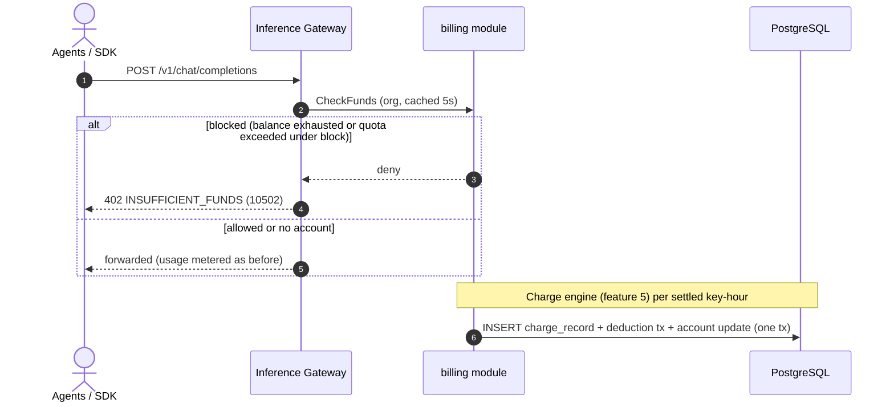

# Balance (Prepaid) & Quota (Postpaid) Account Modes — Requirement Analysis and UI/UX Design

| Attribute | Content |
| --- | --- |
| Feature point | Balance (prepaid) & quota (postpaid) account modes |
| Document scope | Requirement analysis and UI/UX design for the `billing` module's account core: the per-organization billing account with prepaid/postpaid modes, recharge and quota administration, settlement-time deduction, inference gating, monthly cycle reset, the transaction ledger, the console Accounts pages, and acceptance criteria |
| Owning modules | `billing` (accounts, transactions, deduction, cycle reset, gating check), with `infer` (gateway enforcement point); `metering` unchanged |
| Related documents | [Architecture Design](./architecture.md) — §2.6 `billing` · [Token Metering Vouchers & Async Settlement](./metering.md) — the settlement pipeline · [Model × Card-Type Price Matrix & Tiered Pricing](./pricing.md) — the charge engine this feature hooks into (its D9 defers accounts here) · [Multi-Tenancy Isolation](./multi-tenancy.md) — org scoping |
| Status | Design complete, handed to the Architect agent |

---

## 1. Background

Features #1–#7 shipped the accounting spine end to end: API keys identify callers, models deploy one-click on curated images, every inference request leaves a tamper-evident metering voucher that settles hourly **per API key**, the pricing feature turns settled usage into charge records and monthly bills, and **organizations own every resource**. What the platform still cannot answer is "may this call proceed": `GetBalance` is a stub returning 10503, no billing account exists anywhere, and inference is free by construction. This feature closes the money loop with a **per-organization billing account** in one of two modes — **prepaid** (recharge a balance; deductions at settlement draw it down; exhaustion blocks inference) or **postpaid** (a monthly quota; usage accumulates within the cycle; the overdraw policy decides what happens at the cap) — plus an append-only transaction ledger that makes every cent traceable.

### 1.1 How Comparable Products Run Account Money

| Product | Account model | Enforcement at call time | Recharge | Notable pitfalls |
| --- | --- | --- | --- | --- |
| **OpenAI Platform** | Prepaid credits per project | 429 `insufficient_quota` when credits run out | Manual purchase; auto-recharge on enterprise | Exhaustion surfaces as a confusing rate-limit error |
| **Anthropic Console** | Prepaid credits **plus** per-workspace usage limits (a spend cap distinct from balance) | Limit or exhaustion blocks | Auto-recharge threshold | Credits vs limits — two concepts users conflate until labeled apart |
| **SiliconFlow** | Prepaid balance (paid + gift), CNY | 402 insufficient balance | Alipay/WeChat top-up | Split balances complicate refunds |
| **Together AI** | Postpaid pay-as-you-go invoiced monthly (teams); prepaid credits (trials) | Soft — invoice at month end | Card on file | Postpaid without a cap invites surprise bills |
| **Baidu Qianfan** | Postpaid monthly settlement (enterprise) + prepaid resource packages | Package exhaustion blocks the purchased model | Package purchase | Packages and balance are two ledgers in one console |
| **Aliyun Bailian / Volcengine Ark** | Per-account prepaid balance and postpaid pay-as-you-go side by side | Balance ≤ 0 blocks; postpaid capped by configured quota | Console recharge | Mode switching mid-cycle muddles the bill |

### 1.2 Distilled Patterns and Decisions

Patterns worth adopting: (1) **two modes, one account object** — prepaid balance vs postpaid monthly quota are presentations of the same per-org account, not separate systems; (2) **block at the gateway with a distinct documented error** — OpenAI's `insufficient_quota` and SiliconFlow's 402 are instantly recognizable to SDK authors; (3) **integer money** — every surveyed ledger stores minor units, never float; (4) **append-only ledger with idempotency keys** — recharges replayed by retries must credit exactly once; (5) **spend caps are a safety net distinct from funds** — Anthropic's usage limits map to a quota overdraw policy, not a second balance.

Pitfalls to avoid: float arithmetic on money; recharge without idempotency (double crediting); per-request holds (a distributed-lock tar pit — deduction at settlement is the industry default); mode switching that reinterprets history.

**Decisions for go-taas**:

| # | Decision | Rationale |
| --- | --- | --- |
| D1 | **One billing account per organization** (`organization_id` unique). Fields: `mode` (`prepaid`/`postpaid`), `balance_cents` (int64), `monthly_quota_cents` (int64; 0 = unlimited), `used_this_cycle_cents` (int64), `cycle_start` (unix seconds), `overdraw_policy` (`block`/`warn`, postpaid), `currency` (from config) | The org is the ownership boundary (#6); this field set answers both "what is left" and "how much this month" |
| D2 | **Money is integer cents everywhere**; the single platform currency comes from `billing.currency` config (pricing D4) | Float money is the classic billing bug; cents match charge-record amounts exactly |
| D3 | **Deduction happens at settlement**: the feature-#5 charge engine, in the same DB transaction that writes each charge record, writes a `deduction` transaction and updates the account — prepaid decrements `balance_cents`, postpaid increments `used_this_cycle_cents`; idempotency key `charge:{charge_id}` | Per-request holds (reserved 10506) are deferred; hourly settlement lag means an org can overdraw within the final hour — accepted risk (Open Questions) |
| D4 | **Inference gating**: before forwarding, the gateway checks the org's account via an internal `CheckFunds` RPC (per-org cache, default 5 s). Prepaid: `balance_cents ≤ 0` → block. Postpaid: `monthly_quota_cents > 0` and `used_this_cycle_cents ≥ monthly_quota_cents` → block if `overdraw_policy = block`, else allow and flag. **An org with no account is not gated** (transitional open mode) | Mirrors pricing D8's philosophy — an operator gap never takes down inference unless an explicit account says otherwise; the cache keeps the data path fast |
| D5 | Blocked requests return **10502 `CodeInsufficientFunds` mapped to HTTP 402** with a stable, documented message | The recognizable industry error (SiliconFlow 402, OpenAI `insufficient_quota`); 10502 was reserved for exactly this |
| D6 | **The cycle is the calendar month, UTC** — aligned with bills (pricing D9); a runner on the billing reconciliation cadence resets `used_this_cycle_cents = 0` and advances `cycle_start` at the month boundary; condition-based, so retries are idempotent | Quota cycles and bills must reconcile to the same window; anniversary cycles would split bills |
| D7 | **The transaction ledger is append-only**: `transaction_id` (UUID v4), `account_id`, `type` (`recharge`/`deduction`/`refund`), `amount_cents` (positive; direction implied by type), `balance_after_cents`, `idempotency_key` (unique index), `reference` (`charge_id` for deductions, free-text note otherwise), `created_at` | Every cent traceable (the auditor's path); unique idempotency keys make replays harmless |
| D8 | **Recharge and refund are prepaid-only**; postpaid adjustments go through quota edits; both are administrator actions with caller-supplied idempotency keys (the console generates one per dialog submit) | Refunding into a quota is meaningless; payment channels and auto-recharge are future work |
| D9 | **Mode switching preserves both field groups**; only the active mode's fields are enforced and displayed as primary | Switching must never reinterpret history (the Ark pitfall); the ledger keeps both stories |
| D10 | New error codes **10509 `CodeAccountInvalid`** and **10510 `CodeTransactionInvalid`**; 10502/10503 activate; 10504–10506 stay reserved | Validation vs funds vs not-found stay distinct, mirroring the pricing D10 pattern |

## 2. Goals and Non-goals

**Goals**: per-org billing accounts with prepaid/postpaid modes and the D1 field set; admin CRUD, recharge, and quota administration; settlement-time deduction integrated with the feature-#5 charge engine; gateway enforcement with 10502/402; monthly cycle reset; an idempotent append-only transaction ledger; console Accounts list/detail/recharge; activation of the reserved billing error codes.

**Non-goals**: payment channels, invoices, receipts, dunning; auto-recharge thresholds; per-request holds (10506 stays reserved); multi-currency and FX; packages/bundles; tenant self-service recharge and balance visibility (#6/#7 scoping); negative-balance collections; account deletion (accounts are financial records — no delete in v1).

## 3. Personas

| Role | Description | Interaction with accounts |
| --- | --- | --- |
| **Platform administrator** | The operator who runs the cluster; today also the console user | Creates accounts, recharges balances, sets quotas and overdraw policies, reviews ledgers |
| **Organization administrator (future)** | Tenant-side administrator | Will see their own account and ledger (scoped by tenancy, #6) |
| **Agent / SDK** | The programmatic consumer | Experiences gating: 402/10502 with a stable message when funds or quota run out |
| **Billing pipeline** | The feature-#5 charge engine | Writes deduction transactions in the same transaction as charge records |
| **Auditor** | Whoever resolves a balance dispute | Traces balance → ledger → charge records → price entries |

> Terminology: the consumer-side caller is called an **Agent** (English) / 「智能体」(Chinese), consistent with the repo convention.

## 4. User Journeys

| # | Journey | Steps |
| --- | --- | --- |
| J1 | **Prepaid from zero** | Admin creates a prepaid account for an org → recharges $50 → Agents call freely → hourly settlement deducts → balance trends down on the Accounts page → admin recharges again |
| J2 | **Postpaid with a safety cap** | Admin creates a postpaid account, quota $200, overdraw `warn` → usage accumulates → console shows an over-quota badge → admin raises the quota or waits for the month reset |
| J3 | **Agent hits the wall** | Agent's request returns 402 `INSUFFICIENT_FUNDS` → admin recharges → the retry passes within the cache window |
| J4 | **Disputed balance** | Auditor opens the account detail → scans the ledger (recharges, deductions with charge references) → drills into charge records and price entries |

## 5. Feature Requirements and Acceptance Criteria

### FR1 — Account management

- **FR1.1** `CreateAccount` (`POST /api/v1/admin/billing/accounts`) creates the org's single billing account: `mode`, `monthly_quota_cents`, `overdraw_policy`, optional initial `balance_cents`. A second account for the same org returns 10509; accounts are never deleted (financial records).
- **FR1.2** `UpdateAccount` (`PUT .../accounts/{account_id}`) changes `mode`, `monthly_quota_cents`, `overdraw_policy` (D9). `GetAccount`/`ListAccounts` return the full field set plus computed `remaining_cents` (prepaid) or quota usage percent (postpaid).

### FR2 — Recharge and refund

- **FR2.1** `Recharge` (`POST .../accounts/{account_id}/recharge`) credits a prepaid balance: `amount_cents > 0`, caller-supplied `idempotency_key`, optional note; writes one `recharge` transaction with `balance_after_cents`.
- **FR2.2** `Refund` (`POST .../accounts/{account_id}/refund`) credits funds back under the same rules (D8). Recharge/refund on a postpaid account, a non-positive amount, or an idempotency key reused with a different amount returns 10510 and writes nothing.

### FR3 — Settlement deduction

- **FR3.1** The charge engine extends `PriceOnce`: in the same DB transaction as each charge record, it writes a `deduction` transaction (key `charge:{charge_id}`, reference `charge_id`) and updates the account — prepaid `balance_cents -= amount`, postpaid `used_this_cycle_cents += amount`.
- **FR3.2** Unpriced charge records (amount 0, pricing D8) still write a 0-amount deduction so the ledger stays aligned with charges; deduction never blocks or rolls back charging.

### FR4 — Inference gating

- **FR4.1** The gateway checks funds per D4 before forwarding; blocked requests return 10502 (HTTP 402) with a stable message; the check result is cached ≤ 5 s per org.
- **FR4.2** Orgs without an account are not gated; their usage still meters, settles, and charges normally.

### FR5 — Monthly cycle reset

- **FR5.1** A runner resets postpaid accounts at the UTC month boundary per D6: `used_this_cycle_cents = 0`, `cycle_start` advanced; prepaid balances untouched; idempotent under retries.

### FR6 — Ledger queries

- **FR6.1** `ListTransactions` (`GET /api/v1/admin/billing/transactions`) returns the ledger filtered by `account_id`, `type`, and time range, paginated (default 20, cap 100), newest first. `GetBalance` (`GET /api/v1/admin/billing/balance`) returns the mode plus a cents-precision funds snapshot.

### FR7 — Console Accounts pages

- **FR7.1** The console gains the Accounts list, account detail with ledger, recharge dialog, and set-quota dialog (§6).

### Settlement and Gating Sequence

### Acceptance criteria

| # | Criterion | Verification |
| --- | --- | --- |
| AC1 | `CreateAccount` persists the D1 field set; a second account for the same org returns 10509; `ListAccounts` shows it | Unit + E2E |
| AC2 | `Recharge` credits the balance exactly and writes one `recharge` transaction with `balance_after_cents`; replaying the same idempotency key credits nothing further | Unit + E2E |
| AC3 | Recharge/refund on postpaid, a non-positive amount, or key reuse with a different amount → 10510, nothing written | Unit |
| AC4 | After settlement, prepaid `balance_cents` decreases by the charged amounts and each charge record has exactly one `deduction` transaction referencing it; redelivered settlement events never double-deduct | Unit + FVT |
| AC5 | Postpaid `used_this_cycle_cents` increases by charged amounts; `balance_cents` is untouched | Unit |
| AC6 | A prepaid org drained to `balance_cents ≤ 0` has inference blocked with 10502/402; after a recharge the next request passes | FVT + E2E |
| AC7 | A postpaid org past quota with `block` is rejected 10502; with `warn` requests pass and the console shows the over-quota state | FVT + E2E |
| AC8 | At the UTC month boundary `used_this_cycle_cents` resets to 0 and `cycle_start` advances; prepaid balance unchanged; runner retries are idempotent | Unit |
| AC9 | `Refund` credits the balance and appears in the ledger; `ListTransactions` filters by `type` and account, newest first, paginated | Unit + E2E |
| AC10 | Billing queries scope to `X-Organization-Id`: one org's header never returns another org's account or transactions | FVT |
| AC11 | The Accounts page renders rows with testid `account-row-{id}`; the recharge dialog (`recharge-dialog`) credits and refreshes the balance inline; 10509/10510 errors surface inline | E2E |
| AC12 | An org without a billing account is not gated — inference proceeds and usage still meters, settles, and charges | FVT |

## 6. Console Information Architecture

Nav: the existing **Billing** group (Pricing, Bills) gains **Accounts** (`/admin/billing/accounts`).

| Page / component | Purpose | Key testids |
| --- | --- | --- |
| **Accounts list** (`/admin/billing/accounts`) | One row per org account: org, mode badge (prepaid/postpaid), balance or quota progress (`used / quota`), cycle start, updated; actions: recharge, set quota, detail | `account-row-{id}`, `recharge-button-{id}` |
| **Account detail** | Full field view + the transaction ledger (type badge, amount, balance after, reference, time), type filter, 60 s poll | `account-detail`, `transaction-row-{id}` |
| **Recharge dialog** | Amount (major units, currency-labeled), note, confirm; success shows the new balance inline | `recharge-dialog` |
| **Set quota dialog** | Mode select, monthly quota (explicit "unlimited" = 0), overdraw policy radio (block/warn) | `quota-dialog` |

Empty states: "No billing accounts yet — create the first one"; "No transactions in this range". The Bills page header additionally shows the org's remaining balance or quota usage. Color language: prepaid = blue, postpaid = purple, over-quota = amber, exhausted/blocked = red.

## 7. API Surface

All APIs belong to **`taas.billing.v1.BillingService`** (proto: `proto/taas/billing/v1/billing.proto`), served as HTTP via the Control Gateway, org-scoped via `X-Organization-Id`. Proto changes are additive; the legacy `float64 balance` on `GetBalanceResponse` is deprecated in favor of cents fields.

| RPC | HTTP | Status | Purpose |
| --- | --- | --- | --- |
| `CreateAccount` | `POST /api/v1/admin/billing/accounts` | **new** | Create the org's account (one per org) |
| `ListAccounts` | `GET /api/v1/admin/billing/accounts` | **new** | Accounts of the header org |
| `GetAccount` | `GET /api/v1/admin/billing/accounts/{account_id}` | **new** | Detail with computed remaining/quota usage |
| `UpdateAccount` | `PUT /api/v1/admin/billing/accounts/{account_id}` | **new** | Mode, quota, overdraw policy |
| `Recharge` | `POST /api/v1/admin/billing/accounts/{account_id}/recharge` | **new** | Credit prepaid balance (idempotent) |
| `Refund` | `POST /api/v1/admin/billing/accounts/{account_id}/refund` | **new** | Admin-initiated credit return |
| `ListTransactions` | `GET /api/v1/admin/billing/transactions` | **new** | Ledger query (`account_id`, `type`, `since`/`until`) |
| `GetBalance` | `GET /api/v1/admin/billing/balance` | stub → implemented | Mode + cents-precision funds snapshot |
| `CheckFunds` | internal gRPC (no HTTP route) | **new** | Gateway gating check (D4) |

Wire conventions unchanged: dotted pagination, HTTP 200 on success, business errors as `{"code": <int>, "message": "..."}`, int64 cents fields serialized as JSON strings.

## 8. Error Codes

Billing range 10501–10599 (`pkg/errors/codes.go`):

| Condition | Code | Constant | Notes |
| --- | --- | --- | --- |
| Inference blocked — prepaid balance exhausted, or postpaid quota exceeded under `block` | 10502 | `CodeInsufficientFunds` | **Activated**; HTTP 402 |
| Account not found on admin lookups | 10503 | `CodeAccountNotFound` | **Activated** |
| Malformed account — bad mode, negative quota/amounts, duplicate org account | 10509 | `CodeAccountInvalid` | **New** (D10) |
| Invalid transaction — recharge/refund on postpaid, non-positive amount, idempotency key reuse with a different amount | 10510 | `CodeTransactionInvalid` | **New** (D10) |
| Bill not found / settlement failure / holds | 10504–10506 | existing | Stay reserved (no per-request holds in v1) |
| Database / MQ infrastructure failure | 500 | `CodeInternal` | Via error normalization |

## 9. Open Questions

| Question | Leaning |
| --- | --- |
| Should orgs without an account eventually be blocked by default (opt-out enforcement)? | Yes, behind config (`billing.enforce_default`), once tenants exist (#6/#7) |
| Auto-recharge thresholds and payment-channel integration (OpenAI/Anthropic pattern) | Future feature; the recharge RPC's idempotency design is the hook |
| Per-request holds to eliminate the settlement-lag overdraw window (D3) | Defer; 10506 stays reserved until holds are designed |
| Negative-balance carryover, dunning, and collections | Future, together with invoices/receipts |
| Should quota edits take effect mid-cycle or next cycle? | Mid-cycle (immediate) in v1; `used_this_cycle_cents` keeps both computable |
| Tenant self-service balance visibility and recharge | Features #6/#7 scoping first |
