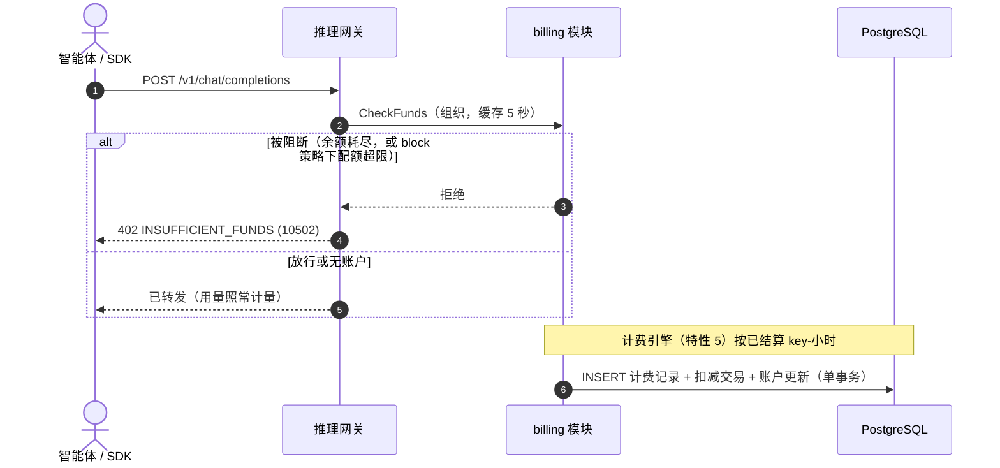

# 余额（预付费）与配额（后付费）账户模式 — 需求分析与 UI/UX 设计

| 属性 | 内容 |
| --- | --- |
| 特性点 | 余额（预付费）与配额（后付费）账户模式 |
| 文档范围 | `billing` 模块账户核心的需求分析与 UI/UX 设计：按组织的计费账户（预付费/后付费两种模式）、充值与配额管理、结算时扣减、推理准入管控、月度周期重置、交易流水账本、控制台「账户」页面，以及验收标准 |
| 归属模块 | `billing`（账户、交易、扣减、周期重置、准入检查），配合 `infer`（网关执行点）；`metering` 不变 |
| 相关文档 | [架构设计](./architecture.zh-cn.md) — 第 2.6 节 `billing` · [Token 计量凭证与异步结算](./metering.zh-cn.md) — 结算管道 · [模型 × 卡型价格矩阵与阶梯定价](./pricing.zh-cn.md) — 本特性挂接的计费引擎（其 D9 将账户延后至此） · [多租户隔离](./multi-tenancy.zh-cn.md) — 组织范围 |
| 状态 | 设计完成，已移交架构师代理 |

---

## 1. 背景与竞品调研

特性 #1–#7 已端到端交付账务主干：API Key 标识调用方，模型在精选镜像上一键部署，每次推理请求都留下防篡改的计量凭证并**按 API Key** 每小时结算，定价特性把已结算用量转换为计费记录与月度账单，且**一切资源归组织所有**。平台仍回答不了的是「这次调用能否放行」：`GetBalance` 是返回 10503 的占位，任何地方都不存在计费账户，推理在构造上就是免费的。本特性以**按组织的计费账户**闭环资金链路，账户处于两种模式之一 — **预付费**（充值余额；结算时扣减将其消耗；耗尽即阻断推理）或**后付费**（月度配额；用量在周期内累计；超额策略决定触顶后发生什么）— 外加一本只追加的交易流水账本，让每一分钱都可追溯。

### 1.1 竞品的账户资金模式

| 产品 | 账户模型 | 调用时执行 | 充值 | 主要陷阱 |
| --- | --- | --- | --- | --- |
| **OpenAI Platform** | 按项目的预付费点数 | 点数耗尽时 429 `insufficient_quota` | 手动购买；企业版自动充值 | 耗尽表现为令人困惑的限流错误 |
| **Anthropic Console** | 预付费点数**外加**按工作区的用量上限（独立于余额的消费上限） | 触顶或耗尽即阻断 | 自动充值阈值 | 点数与上限是两个概念，不明确标注用户就会混淆 |
| **SiliconFlow** | 预付费余额（付费 + 赠送），人民币 | 402 余额不足 | 支付宝/微信充值 | 拆分余额让退款复杂化 |
| **Together AI** | 后付费按量月度开票（团队）；预付费点数（试用） | 软性 — 月末开票 | 绑定银行卡 | 无上限的后付费招来意外账单 |
| **百度千帆** | 后付费月度结算（企业）+ 预付费资源包 | 资源包耗尽阻断所购模型 | 购买资源包 | 资源包与余额是一个控制台里的两本账 |
| **阿里云百炼 / 火山方舟** | 账户级预付费余额与后付费按量并行 | 余额 ≤ 0 阻断；后付费受配置配额封顶 | 控制台充值 | 周期中切换模式搅浑账单 |

### 1.2 提炼出的模式与决策

值得采纳的模式：(1) **两种模式、一个账户对象** — 预付费余额与后付费月度配额是同一按组织账户的两种呈现，而非两套系统；(2) **在网关以独立且文档化的错误阻断** — OpenAI 的 `insufficient_quota` 与 SiliconFlow 的 402 让 SDK 作者一眼认出；(3) **整数金额** — 所有调研过的账本都以最小单位存储，绝不用浮点；(4) **带幂等键的只追加账本** — 重试重放的充值必须恰好入账一次；(5) **消费上限是独立于资金的安全网** — Anthropic 的用量上限对应配额超额策略，而非第二个余额。

需要避免的陷阱：金额上的浮点运算；无幂等的充值（重复入账）；按请求冻结（分布式锁泥潭 — 结算时扣减是行业默认）；重新解释历史的模式切换。

**go-taas 的决策**：

| # | 决策 | 依据 |
| --- | --- | --- |
| D1 | **每个组织一个计费账户**（`organization_id` 唯一）。字段：`mode`（`prepaid`/`postpaid`）、`balance_cents`（int64）、`monthly_quota_cents`（int64；0 = 无上限）、`used_this_cycle_cents`（int64）、`cycle_start`（unix 秒）、`overdraw_policy`（`block`/`warn`，后付费）、`currency`（来自配置） | 组织是所有权边界（#6）；该字段集同时回答「还剩多少」与「本月用了多少」 |
| D2 | **金额处处为整数分**；单一平台币种来自 `billing.currency` 配置（定价 D4） | 浮点金额是经典的计费 bug；分与计费记录金额精确对齐 |
| D3 | **扣减发生在结算时**：特性 #5 的计费引擎在写每条计费记录的同一数据库事务内，写一条 `deduction` 交易并更新账户 — 预付费递减 `balance_cents`，后付费递增 `used_this_cycle_cents`；幂等键 `charge:{charge_id}` | 按请求冻结（预留 10506）延后；小时级结算延迟意味着组织可能在最后一小时内超额 — 已接受的风险（开放问题） |
| D4 | **推理准入管控**：转发前，网关经内部 `CheckFunds` RPC 检查组织账户（按组织缓存，默认 5 秒）。预付费：`balance_cents ≤ 0` → 阻断。后付费：`monthly_quota_cents > 0` 且 `used_this_cycle_cents ≥ monthly_quota_cents` → `overdraw_policy = block` 时阻断，否则放行并标记。**无账户的组织不受管控**（过渡开放模式） | 镜像定价 D8 的哲学 — 运营缺口绝不拖垮推理，除非显式账户另有指示；缓存保持数据路径快速 |
| D5 | 被阻断的请求返回 **10502 `CodeInsufficientFunds` 映射为 HTTP 402**，消息稳定且文档化 | 行业可识别的错误（SiliconFlow 402、OpenAI `insufficient_quota`）；10502 正是为此预留 |
| D6 | **周期为 UTC 自然月** — 与账单对齐（定价 D9）；计费对账节奏上的 runner 在月度边界重置 `used_this_cycle_cents = 0` 并推进 `cycle_start`；基于条件判定，重试幂等 | 配额周期与账单必须对账到同一窗口；周年周期会拆裂账单 |
| D7 | **交易流水账本只追加**：`transaction_id`（UUID v4）、`account_id`、`type`（`recharge`/`deduction`/`refund`）、`amount_cents`（正数；方向由类型隐含）、`balance_after_cents`、`idempotency_key`（唯一索引）、`reference`（扣减为 `charge_id`，其余为自由文本备注）、`created_at` | 每一分钱可追溯（审计者的路径）；唯一幂等键让重放无害 |
| D8 | **充值与退款仅限预付费**；后付费调整走配额编辑；两者均为管理员操作，带调用方提供的幂等键（控制台每次对话框提交生成一个） | 退入配额没有意义；支付渠道与自动充值是未来工作 |
| D9 | **模式切换保留两组字段**；仅活跃模式的字段被执行并作为主展示 | 切换绝不能重新解释历史（方舟陷阱）；账本保留两个故事 |
| D10 | 新错误码 **10509 `CodeAccountInvalid`** 与 **10510 `CodeTransactionInvalid`**；10502/10503 激活；10504–10506 保持预留 | 校验、资金、未找到三类错误保持区分，镜像定价 D10 模式 |

## 2. 目标与非目标

**目标**：带预付费/后付费模式与 D1 字段集的按组织计费账户；管理员 CRUD、充值与配额管理；与特性 #5 计费引擎集成的结算时扣减；带 10502/402 的网关执行；月度周期重置；幂等的只追加交易账本；控制台账户列表/详情/充值；预留计费错误码的激活。

**非目标**：支付渠道、发票、回执、催收；自动充值阈值；按请求冻结（10506 保持预留）；多币种与汇率；套餐/捆绑包；租户自助充值与余额可见性（#6/#7 范围）；负余额催收；账户删除（账户是财务记录 — v1 无删除）。

## 3. 用户角色

| 角色 | 描述 | 与账户的交互 |
| --- | --- | --- |
| **平台管理员** | 运营集群的人；今天也是控制台用户 | 创建账户、充值余额、设置配额与超额策略、审阅账本 |
| **组织管理员（未来）** | 租户侧管理员 | 将看到本组织的账户与账本（按租户范围，#6） |
| **智能体 / SDK** | 程序化消费方 | 体验准入管控：资金或配额耗尽时收到带稳定消息的 402/10502 |
| **计费管道** | 特性 #5 的计费引擎 | 在与计费记录相同的事务内写入扣减交易 |
| **审计者** | 解决余额争议的人 | 沿余额 → 账本 → 计费记录 → 价格条目追溯 |

> 术语：消费方调用者称为**智能体**（Agent），与仓库惯例一致。

## 4. 用户旅程

| # | 旅程 | 步骤 |
| --- | --- | --- |
| J1 | **预付费从零开始** | 管理员为某组织创建预付费账户 → 充值 $50 → 智能体自由调用 → 小时结算扣减 → 账户页余额趋势下行 → 管理员再次充值 |
| J2 | **带安全上限的后付费** | 管理员创建后付费账户，配额 $200，超额 `warn` → 用量累计 → 控制台显示超额徽标 → 管理员上调配额或等待月度重置 |
| J3 | **智能体撞墙** | 智能体的请求返回 402 `INSUFFICIENT_FUNDS` → 管理员充值 → 缓存窗口内重试通过 |
| J4 | **余额争议** | 审计者打开账户详情 → 扫描账本（充值、带计费引用的扣减）→ 下钻计费记录与价格条目 |

## 5. 功能需求与验收标准

### FR1 — 账户管理

- **FR1.1** `CreateAccount`（`POST /api/v1/admin/billing/accounts`）创建组织的唯一计费账户：`mode`、`monthly_quota_cents`、`overdraw_policy`、可选初始 `balance_cents`。同一组织的第二个账户返回 10509；账户永不删除（财务记录）。
- **FR1.2** `UpdateAccount`（`PUT .../accounts/{account_id}`）变更 `mode`、`monthly_quota_cents`、`overdraw_policy`（D9）。`GetAccount`/`ListAccounts` 返回完整字段集，外加计算出的 `remaining_cents`（预付费）或配额使用百分比（后付费）。

### FR2 — 充值与退款

- **FR2.1** `Recharge`（`POST .../accounts/{account_id}/recharge`）为预付费余额入账：`amount_cents > 0`、调用方提供的 `idempotency_key`、可选备注；写入一条带 `balance_after_cents` 的 `recharge` 交易。
- **FR2.2** `Refund`（`POST .../accounts/{account_id}/refund`）按相同规则退回资金（D8）。对后付费账户充值/退款、非正金额、或幂等键以不同金额复用，返回 10510 且不写入任何内容。

### FR3 — 结算扣减

- **FR3.1** 计费引擎扩展 `PriceOnce`：在与每条计费记录相同的数据库事务内，写入一条 `deduction` 交易（键 `charge:{charge_id}`、引用 `charge_id`）并更新账户 — 预付费 `balance_cents -= amount`，后付费 `used_this_cycle_cents += amount`。
- **FR3.2** 未计价的计费记录（金额 0，定价 D8）仍写入一条 0 金额扣减，使账本与计费保持对齐；扣减绝不阻塞或回滚计费。

### FR4 — 推理准入管控

- **FR4.1** 网关按 D4 在转发前检查资金；被阻断的请求返回 10502（HTTP 402）与稳定消息；检查结果按组织缓存 ≤ 5 秒。
- **FR4.2** 无账户的组织不受管控；其用量仍正常计量、结算与计费。

### FR5 — 月度周期重置

- **FR5.1** runner 按 D6 在 UTC 月度边界重置后付费账户：`used_this_cycle_cents = 0`、`cycle_start` 推进；预付费余额不动；重试幂等。

### FR6 — 账本查询

- **FR6.1** `ListTransactions`（`GET /api/v1/admin/billing/transactions`）返回按 `account_id`、`type`、时间范围过滤的账本，分页（默认 20，上限 100），最新在前。`GetBalance`（`GET /api/v1/admin/billing/balance`）返回模式外加分精度的资金快照。

### FR7 — 控制台账户页面

- **FR7.1** 控制台新增账户列表、带账本的账户详情、充值对话框与设置配额对话框（§6）。

### 结算与准入时序

### 验收标准

| # | 标准 | 验证方式 |
| --- | --- | --- |
| AC1 | `CreateAccount` 持久化 D1 字段集；同一组织的第二个账户返回 10509；`ListAccounts` 可见 | 单元 + E2E |
| AC2 | `Recharge` 精确入账余额并写入一条带 `balance_after_cents` 的 `recharge` 交易；重放同一幂等键不再入账 | 单元 + E2E |
| AC3 | 对后付费充值/退款、非正金额、或以不同金额复用幂等键 → 10510，不写入任何内容 | 单元 |
| AC4 | 结算后预付费 `balance_cents` 减少计费金额之和，且每条计费记录恰有一条引用它的 `deduction` 交易；重投的结算事件绝不重复扣减 | 单元 + FVT |
| AC5 | 后付费 `used_this_cycle_cents` 随计费金额递增；`balance_cents` 不动 | 单元 |
| AC6 | 预付费组织耗至 `balance_cents ≤ 0` 后推理被 10502/402 阻断；充值后下一个请求通过 | FVT + E2E |
| AC7 | 超配额的后付费组织在 `block` 下被拒 10502；`warn` 下请求通过且控制台显示超额状态 | FVT + E2E |
| AC8 | UTC 月度边界 `used_this_cycle_cents` 重置为 0、`cycle_start` 推进；预付费余额不变；runner 重试幂等 | 单元 |
| AC9 | `Refund` 入账余额并出现在账本；`ListTransactions` 按 `type` 与账户过滤、最新在前、分页 | 单元 + E2E |
| AC10 | 计费查询限定 `X-Organization-Id` 范围：一个组织的请求头绝不返回另一组织的账户或交易 | FVT |
| AC11 | 账户页渲染 testid 为 `account-row-{id}` 的行；充值对话框（`recharge-dialog`）入账并内联刷新余额；10509/10510 错误内联浮出 | E2E |
| AC12 | 无计费账户的组织不受管控 — 推理照常进行，用量仍计量、结算与计费 | FVT |

## 6. 控制台信息架构

导航：既有 **Billing** 分组（Pricing、Bills）新增**「账户」**（`/admin/billing/accounts`）。

| 页面 / 组件 | 用途 | 关键 testid |
| --- | --- | --- |
| **账户列表**（`/admin/billing/accounts`） | 每个组织账户一行：组织、模式徽标（预付费/后付费）、余额或配额进度（`used / quota`）、周期起点、更新时间；操作：充值、设置配额、详情 | `account-row-{id}`、`recharge-button-{id}` |
| **账户详情** | 完整字段视图 + 交易账本（类型徽标、金额、交易后余额、引用、时间）、类型过滤、60 秒轮询 | `account-detail`、`transaction-row-{id}` |
| **充值对话框** | 金额（主单位、标注币种）、备注、确认；成功后内联展示新余额 | `recharge-dialog` |
| **设置配额对话框** | 模式选择、月度配额（显式「无上限」= 0）、超额策略单选（block/warn） | `quota-dialog` |

空态：「暂无计费账户 — 创建第一个」「该范围内暂无交易」。账单页头部额外展示组织的剩余余额或配额使用。颜色语言：预付费 = 蓝色、后付费 = 紫色、超额 = 琥珀色、耗尽/阻断 = 红色。

## 7. API 面

所有 API 属于 **`taas.billing.v1.BillingService`**（proto：`proto/taas/billing/v1/billing.proto`），经控制网关以 HTTP 提供，经 `X-Organization-Id` 限定组织范围。proto 变更仅增量；`GetBalanceResponse` 上遗留的 `float64 balance` 弃用，改用分字段。

| RPC | HTTP | 状态 | 用途 |
| --- | --- | --- | --- |
| `CreateAccount` | `POST /api/v1/admin/billing/accounts` | **新增** | 创建组织账户（每组织一个） |
| `ListAccounts` | `GET /api/v1/admin/billing/accounts` | **新增** | 请求头组织的账户 |
| `GetAccount` | `GET /api/v1/admin/billing/accounts/{account_id}` | **新增** | 带计算剩余/配额用量的详情 |
| `UpdateAccount` | `PUT /api/v1/admin/billing/accounts/{account_id}` | **新增** | 模式、配额、超额策略 |
| `Recharge` | `POST /api/v1/admin/billing/accounts/{account_id}/recharge` | **新增** | 预付费余额入账（幂等） |
| `Refund` | `POST /api/v1/admin/billing/accounts/{account_id}/refund` | **新增** | 管理员发起的资金退回 |
| `ListTransactions` | `GET /api/v1/admin/billing/transactions` | **新增** | 账本查询（`account_id`、`type`、`since`/`until`） |
| `GetBalance` | `GET /api/v1/admin/billing/balance` | 占位 → 实现 | 模式 + 分精度资金快照 |
| `CheckFunds` | 内部 gRPC（无 HTTP 路由） | **新增** | 网关准入检查（D4） |

线格式惯例不变：点分分页、成功 HTTP 200、业务错误为 `{"code": <int>, "message": "..."}`、int64 分字段序列化为 JSON 字符串。

## 8. 错误码

billing 段 10501–10599（`pkg/errors/codes.go`）：

| 条件 | 码 | 常量 | 备注 |
| --- | --- | --- | --- |
| 推理被阻断 — 预付费余额耗尽，或 `block` 下后付费配额超限 | 10502 | `CodeInsufficientFunds` | **激活**；HTTP 402 |
| 管理端查询账户不存在 | 10503 | `CodeAccountNotFound` | **激活** |
| 畸形账户 — 坏模式、负配额/金额、重复组织账户 | 10509 | `CodeAccountInvalid` | **新增**（D10） |
| 无效交易 — 对后付费充值/退款、非正金额、幂等键以不同金额复用 | 10510 | `CodeTransactionInvalid` | **新增**（D10） |
| 账单不存在 / 结算失败 / 冻结 | 10504–10506 | 既有 | 保持预留（v1 无按请求冻结） |
| 数据库 / MQ 基础设施故障 | 500 | `CodeInternal` | 经错误归一化 |

## 9. 开放问题

| 问题 | 倾向 |
| --- | --- |
| 无账户的组织最终是否默认阻断（可退出的强制模式）？ | 是，置于配置之后（`billing.enforce_default`），待租户存在后（#6/#7） |
| 自动充值阈值与支付渠道集成（OpenAI/Anthropic 模式） | 未来特性；充值 RPC 的幂等设计是挂接点 |
| 按请求冻结以消除结算延迟造成的超额窗口（D3） | 延后；10506 保持预留直至冻结设计完成 |
| 负余额结转、催收与追讨 | 未来，与发票/回执一起 |
| 配额编辑本周期内生效还是下周期生效？ | v1 本周期内（立即）；`used_this_cycle_cents` 让两者皆可计算 |
| 租户自助余额可见性与充值 | 先做 #6/#7 范围界定 |
