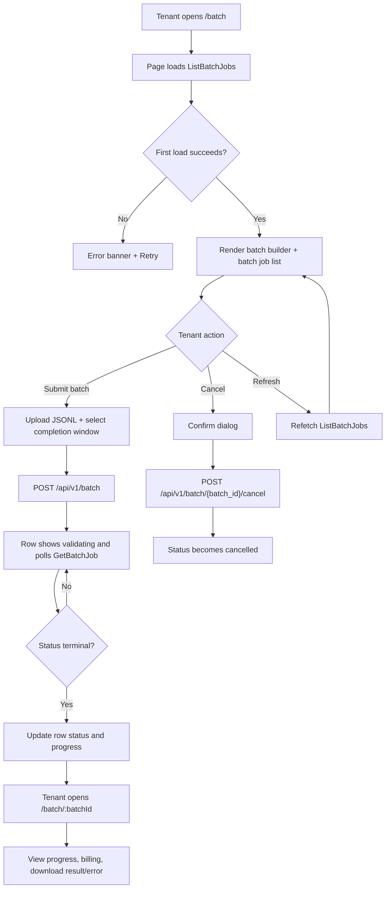
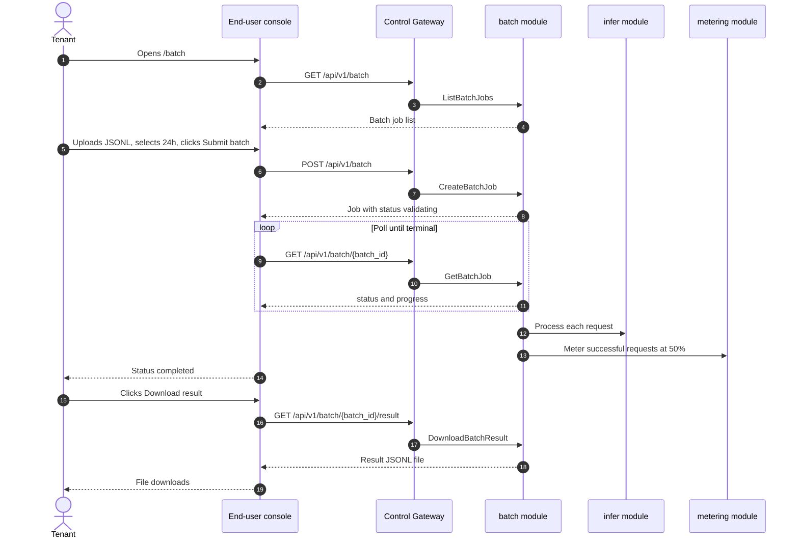

# Batch Inference (Batch Jobs) — Requirement Analysis and UI/UX Design

| Attribute | Content |
| --- | --- |
| Feature point | Batch inference (batch jobs) — submit a JSONL batch of inference requests, process asynchronously at a discounted rate, monitor progress, and download result/error files (backlog row 42) |
| Document scope | Requirement analysis, competitive research, the end-user batch page for `/batch`, the admin batch page for `/admin/batch`, the page → API surface table, and numbered acceptance criteria |
| Owning modules | `batch` (new — owns the batch-job lifecycle, the JSONL input/output file store, and the async batch worker), `infer` (read-only: the inference endpoint the batch worker calls), `metering` (read-only: per-request token/cost attribution for batch jobs), `pkg/server` gateway (user- and admin-prefix bindings), `web` end-user console (`BatchPage` in `UserShell`) and admin console (`AdminBatchPage` in `AdminShell`) |
| Related documents | [Architecture Design](./architecture.md) — §2.5 `metering`, §2.6 `billing`, §3.1 (admin/user surface separation) · [Request Logs & API Playground](./request-logs-playground.md) — the sibling inference surface and its request-log conventions · [Billing Reports & CSV Export](./billing-reports.md) — the sibling async-job and Excel-friendly-CSV conventions · [Data Export & Privacy](./data-export-privacy.md) — the sibling async-job lifecycle and tenant-scoping conventions · [Console Surface Separation](./console-surface-separation.md) — the two surfaces this feature lives on, the `UserShell`/`AdminShell` conventions, the masked-projection rule |
| Status | Design complete, handed to the Architect agent |

---

## 1. Background and Competitive Research

### 1.1 Why Batch Inference Comes Now

go-taas serves inference through an OpenAI-compatible gateway (feature #2, #12): an Agent sends a request and receives a completion in real time. But a large class of workloads does not need a real-time response — model evaluation, data labeling, bulk classification, offline summarization, and embedding backfills all process thousands or millions of requests that can wait minutes or hours. Sending those one-by-one through the real-time endpoint is slow, wasteful, and expensive. Every major inference platform ships a **batch API** for exactly this: submit a file of requests, process them asynchronously, and download the results when done, at a discounted rate.

This feature adds a **batch inference** capability: a tenant uploads a JSONL file of inference requests, the platform processes them asynchronously as a batch job, the tenant monitors progress and downloads the result and error files. It is the smallest independently valuable increment of the batch-processing capability: it turns "I have a large offline workload" into "submit a batch, watch it progress, download the results". It is a **new `batch` module** that orchestrates the existing inference and metering pipelines — nothing in the real-time inference path changes.

### 1.2 How Comparable Products Implement Batch Inference

| Product | Batch surface | Input format | Lifecycle | Pricing | Notable pitfalls |
| --- | --- | --- | --- | --- | --- |
| **OpenAI Batch API** | API + dashboard | JSONL file (uploaded via `/v1/files`) | `validating` → `in_progress` → `finalizing` → `completed` / `failed` / `expired` / `cancelled` | 50% of real-time price | 24h completion window; results expire after 30 days |
| **Anthropic Message Batches** | API + console | JSONL file | `in_progress` → `ended` (succeeded/failed) | 50% of real-time price | Results expire after 29 days |
| **Together AI Batch Inference** | API + console | JSONL file | queued → running → completed/failed | 50% of real-time price | File size limits; per-line validation |
| **Aliyun Bailian Batch** | Console + API | JSONL file (uploaded) | `validating` → `in_progress` → `finalizing` → `completed` / `failed` / `expired` / `cancelled` | 50% of real-time price | ≤ 50,000 requests / ≤ 500 MB; single-model-per-batch; results expire after 30 days |
| **Volcengine Ark Batch** | Console + API | JSONL file | queued → running → completed/failed | Discounted | File size limits; per-line validation |
| **Baidu Qianfan Batch** | Console + API | JSONL file | queued → running → completed/failed | Discounted | File size limits; per-line validation |

### 1.3 Distilled Patterns and Decisions

Patterns worth adopting:

1. **A JSONL input file** — every surveyed platform takes a JSONL file where each line is one request (`custom_id`, `method`, `url`, `body`). go-taas adopts the same format, which is OpenAI-compatible and lets a tenant reuse their existing batch tooling.
2. **An async job lifecycle** — every platform processes the batch asynchronously with a status lifecycle (`validating` → `in_progress` → `finalizing` → `completed` / `failed` / `expired` / `cancelled`). go-taas adopts the same lifecycle.
3. **A discounted rate** — every platform charges a discounted rate (typically 50%) for batch inference. go-taas adopts a 50% discount on the real-time price for batch jobs.
4. **Result and error files** — every platform produces a result file (successful responses) and an error file (failed requests), both keyed by `custom_id`. go-taas adopts the same two-file output.
5. **A dedicated console page** — Aliyun Bailian and Volcengine Ark both have a dedicated batch page in the console. go-taas needs a batch page on both consoles.

Pitfalls to avoid: a blocking synchronous batch (the request times out) — go-taas processes batches asynchronously; a batch that mixes multiple models (the platform rejects it) — go-taas enforces single-model-per-batch; results that expire silently (the tenant loses their output) — go-taas shows the expiry date and warns before deletion; and exposing other tenants' batches — the batch is hard-scoped to the caller's organization.

**Decisions for go-taas** (recorded rationale, per the autonomous-decision rule):

| # | Decision | Rationale |
| --- | --- | --- |
| D1 | **Batch inference lives on both surfaces.** End-user: route `/batch`, API prefix `/api/v1/batch/*` — a tenant creates and manages their own batch jobs. Admin: route `/admin/batch`, API prefix `/api/v1/admin/batch/*` — an operator views all batch jobs across tenants and can cancel or inspect any of them | Batch is a tenant self-service capability (the tenant submits and downloads their own jobs) AND an operator concern (the operator must see cross-tenant batch load and intervene). Consistent with the both-surface pattern of webhooks (feature #23) and billing reports (feature #25) |
| D2 | **A batch job is defined by an input file and a completion window.** `CreateBatchJob` takes an uploaded JSONL input file and a `completion_window` (default `24h`, range `1h`–`14d`). The job is created with `status = validating` (D3). The input file is stored in the batch module's object store | The completion window bounds how long the platform may take; the input file is the batch's payload. The window follows the OpenAI/Aliyun convention |
| D3 | **The batch job lifecycle is `validating` → `in_progress` → `finalizing` → `completed` / `failed` / `expired` / `cancelled`.** `validating` checks the JSONL format, per-line schema, file size, and single-model consistency; `in_progress` processes the requests; `finalizing` writes the result/error files; `completed` makes them downloadable; `failed` means a file-level error (no requests processed); `expired` means the completion window elapsed; `cancelled` means the tenant/operator stopped it | The lifecycle mirrors the surveyed platforms and gives the console a clear progress model. `failed` is distinct from per-line errors (which land in the error file) |
| D4 | **Batch inference is billed at 50% of the real-time price.** Each successfully processed request is metered through the existing `metering` pipeline with a `batch` discount factor applied to the price lookup. Failed requests and file-level failures are not billed | The 50% discount is the universal batch convention (OpenAI, Anthropic, Aliyun) and rewards tenants for off-peak, async workloads. It reuses the existing metering/price pipeline (features #4, #5) |
| D5 | **The batch is tenant-scoped and masked.** `CreateBatchJob` on the user prefix accepts no `organization_id` filter (the caller's org is implicit) and never exposes other tenants' jobs. The admin prefix lists all jobs but masks per-request content (the masked-projection rule, feature #17) | Follows feature #17's masked-projection rule: a tenant's batch must never leak another tenant's data. The admin surface sees job metadata and aggregate stats but not the raw request/response bodies |
| D6 | **The result and error files are JSONL, keyed by `custom_id`.** The result file has one line per successful request with `custom_id` and `response`; the error file has one line per failed request with `custom_id` and `error`. Both are downloadable when `status = completed` | The two-file, `custom_id`-keyed output is the universal convention and lets a tenant correlate results with their input |
| D7 | **New error codes in a batch block (12601–12699)**: **12601 `CodeBatchJobNotFound`**, **12602 `CodeBatchJobStateInvalid`**, **12603 `CodeBatchInputInvalid`**, **12604 `CodeBatchInputTooLarge`**, **12605 `CodeBatchModelMismatch`**, **12606 `CodeBatchNotCompleted`**. Range/format validation reuses existing codes where applicable | Batch inference is a new module (D1), so its codes live in a fresh block after the account block (125xx); distinct codes keep each failure mode actionable |
| D8 | **Batch jobs are retained for a bounded window, then deleted.** A completed job's result/error files are retained for a configurable window (default 30 days), then deleted; the job metadata row is retained with a `files_expired` flag. The console warns before the expiry date | Results that expire silently are a surveyed pitfall; a bounded retention with a visible expiry date keeps the platform tidy without surprising the tenant |
| D9 | **Batch job actions are audited.** Job creation, cancellation, and result download are audited (feature #15) as `batch.created` / `batch.cancelled` / `batch.downloaded`. The underlying per-request inference is already metered and logged by the existing pipeline | The feature orchestrates existing inference and metering; only the new batch actions need new audit events |

### 1.4 Scope Boundary

**In scope**: a batch page on both consoles (`/batch` and `/admin/batch`) with batch-job creation (JSONL upload + completion window), a job list with status/progress, a job detail view with per-request stats, result/error file download, and job cancellation.

**Out of scope** (tracked by other feature points): the real-time inference playground (feature #12), the request logs & tracing (features #12, #27), the billing reports & CSV export (feature #25), the data export & privacy (feature #41), and the model fine-tuning (removed by the product owner on 2026-10-03).

---

## 2. User Roles

| Role | Description | Interaction with batch inference |
| --- | --- | --- |
| **Tenant developer / Agent** | The consumer who builds an integration against the go-taas inference API | Opens `/batch`, uploads a JSONL batch, monitors its progress, and downloads the result/error files |
| **Tenant data scientist / ML engineer** | The tenant who runs offline evaluation, labeling, or embedding backfills | Submits large batches, monitors progress, and downloads results for offline analysis |
| **Platform administrator** | The operator who runs the go-taas cluster | Opens `/admin/batch`, views all batch jobs across tenants, monitors batch load, and cancels stuck or abusive jobs |

> Terminology: the consumer-side caller is called an **Agent** (English) / 「智能体」(Chinese), consistent with the repo convention. The operator-side caller is the **Platform administrator** (English) / 「平台管理员」(Chinese).

---

## 3. User Stories

| # | As a… | I want to… | So that… |
| --- | --- | --- | --- |
| US1 | Tenant developer | upload a JSONL batch of inference requests and submit it as a batch job | I can process a large offline workload asynchronously |
| US2 | Tenant developer | monitor my batch job's progress (validating / in_progress / finalizing / completed) | I know when my results are ready |
| US3 | Tenant data scientist | download the result and error files when my batch completes | I can correlate results with my input by `custom_id` |
| US4 | Tenant developer | cancel a batch job that is taking too long or was submitted by mistake | I don't pay for or wait on a job I no longer need |
| US5 | Tenant developer | see the batch discount applied to my batch jobs | I understand my batch billing |
| US6 | Platform administrator | view all batch jobs across tenants and their status/progress | I can monitor batch load and intervene when needed |
| US7 | Platform administrator | cancel a stuck or abusive batch job | I can protect the platform from runaway workloads |
| US8 | Agent / SDK | call the real-time inference endpoint with an API key | I get completions without touching the batch page |

---

## 4. Functional Requirements

### FR1 — Create a batch job

- **FR1.1** `CreateBatchJob` (`POST /api/v1/batch`) creates a batch job from an uploaded JSONL input file and a `completion_window` (default `24h`, range `1h`–`14d`). It returns a job with `status = validating` (D2, D3).
- **FR1.2** The input file must be a valid JSONL file: each line is a JSON object with `custom_id` (unique, ≤ 256 chars), `method` (`POST`), `url` (`/v1/chat/completions` or `/v1/embeddings`), and `body` (the request body). An invalid file returns **12603 `CodeBatchInputInvalid`** (D7).
- **FR1.3** The input file must be ≤ 500 MB and ≤ 50,000 lines. A larger file returns **12604 `CodeBatchInputTooLarge`** (D7).
- **FR1.4** All requests in the file must use the same model (`body.model`). A mismatch returns **12605 `CodeBatchModelMismatch`** (D7).
- **FR1.5** The batch is tenant-scoped (D5): it aggregates only the caller's own organization's jobs. It accepts no `organization_id` filter.

### FR2 — Batch job lifecycle & monitoring

- **FR2.1** `GetBatchJob` (`GET /api/v1/batch/{batch_id}`) returns the job's `status` (`validating` / `in_progress` / `finalizing` / `completed` / `failed` / `expired` / `cancelled`), `model`, `completion_window`, `total_requests`, `processed_requests`, `succeeded_requests`, `failed_requests`, `input_tokens`, `output_tokens`, `cost`, `currency`, `created_at`, `completed_at`, and `files_expire_at`. An unknown `batch_id` returns **12601 `CodeBatchJobNotFound`** (D7).
- **FR2.2** `ListBatchJobs` (`GET /api/v1/batch`) returns the caller's batch jobs, newest first, with dotted pagination. Each row carries `batch_id`, `model`, `status`, `total_requests`, `processed_requests`, `succeeded_requests`, `failed_requests`, `cost`, `created_at`, and `completed_at`.
- **FR2.3** `CancelBatchJob` (`POST /api/v1/batch/{batch_id}/cancel`) cancels a job in `validating` or `in_progress`. A job in a terminal state (`completed` / `failed` / `expired` / `cancelled`) returns **12602 `CodeBatchJobStateInvalid`** (D7).

### FR3 — Result and error files

- **FR3.1** `DownloadBatchResult` (`GET /api/v1/batch/{batch_id}/result`) returns the result file when `status = completed`. A download before `completed` returns **12606 `CodeBatchNotCompleted`** (D7). The response is `application/x-ndjson` with a `Content-Disposition` filename like `batch-<batch_id>-result.jsonl` (D6).
- **FR3.2** `DownloadBatchError` (`GET /api/v1/batch/{batch_id}/error`) returns the error file when `status = completed` and there are failed requests. A download before `completed` returns **12606 `CodeBatchNotCompleted`** (D7). The response is `application/x-ndjson` with a `Content-Disposition` filename like `batch-<batch_id>-error.jsonl` (D6).
- **FR3.3** The result file has one line per successful request with `custom_id` and `response`; the error file has one line per failed request with `custom_id` and `error` (D6).

### FR4 — Billing

- **FR4.1** Each successfully processed request is metered through the existing `metering` pipeline with a `batch` discount factor of 0.5 applied to the price lookup (D4). The job's `cost` is the sum of its successful requests' costs.
- **FR4.2** Failed requests and file-level failures are not billed (D4).

### FR5 — Retention

- **FR5.1** A completed job's result/error files are retained for a configurable window (default 30 days), then deleted; the job metadata row is retained with a `files_expired` flag (D8).
- **FR5.2** The console shows the `files_expire_at` date and warns before the expiry date (D8).

### FR6 — Surface and API binding

- **FR6.1** The batch page lives on the **end-user surface**: route `/batch`, API prefix `/api/v1/batch/*`. It is added to the `UserShell` navigation (feature #17) as "Batch".
- **FR6.2** The batch page lives on the **admin surface**: route `/admin/batch`, API prefix `/api/v1/admin/batch/*`. It is added to the `AdminShell` navigation (feature #17) as "Batch".
- **FR6.3** The end-user page calls only `/api/v1/batch/*` routes and contains no `/api/v1/admin/*` string; the admin page calls only `/api/v1/admin/batch/*` routes and contains no `/api/v1/batch/*` string (feature #17).
- **FR6.4** The admin surface masks per-request content (D5): it shows job metadata and aggregate stats but not the raw request/response bodies.

---

## 5. Page and Flow Design

### 5.1 Surface Assignment

| Feature | Surface | Web route | API prefix |
| --- | --- | --- | --- |
| Create batch job | end-user | `/batch` | `/api/v1/batch` |
| Batch job list | end-user | `/batch` | `/api/v1/batch` |
| Batch job detail | end-user | `/batch/:batchId` | `/api/v1/batch/{batch_id}` |
| Cancel batch job | end-user | `/batch/:batchId` | `/api/v1/batch/{batch_id}/cancel` |
| Download result | end-user | `/batch/:batchId` | `/api/v1/batch/{batch_id}/result` |
| Download error | end-user | `/batch/:batchId` | `/api/v1/batch/{batch_id}/error` |
| Batch job list (all tenants) | admin | `/admin/batch` | `/api/v1/admin/batch` |
| Batch job detail (any tenant) | admin | `/admin/batch/:batchId` | `/api/v1/admin/batch/{batch_id}` |
| Cancel batch job (any tenant) | admin | `/admin/batch/:batchId` | `/api/v1/admin/batch/{batch_id}/cancel` |

Every page and API call above is on its assigned surface; end-user pages never call a `/api/v1/admin/*` route, and admin pages never call a `/api/v1/batch/*` route. The user session realm is used on the end-user surface; the admin session realm on the admin surface.

### 5.2 Page Map

| Page / component | Purpose |
| --- | --- |
| **Batch page** (`/batch`) | Create a batch job (JSONL upload + completion window), monitor its status, and download the result/error files |
| **Batch detail page** (`/batch/:batchId`) | View a single batch job's progress, per-request stats, and download its result/error files |
| **Admin batch page** (`/admin/batch`) | View all batch jobs across tenants, monitor batch load, and cancel stuck or abusive jobs |
| **Admin batch detail page** (`/admin/batch/:batchId`) | View a single batch job's metadata and aggregate stats (masked), and cancel it |

### 5.3 Page: `/batch` — Batch (end-user)

**Purpose**: give the tenant a single surface to submit a JSONL batch of inference requests, monitor its progress, and download the result/error files.

**Surface**: end-user — route `/batch`, API `/api/v1/batch/*`.

**Layout**: rendered inside `UserShell` (feature #17). A page header ("Batch", subtitle "Process a large workload of inference requests asynchronously at a discounted rate") with a **New batch** primary action. Below:

1. **Batch builder** — a collapsible panel (open by default when the job list is empty) with fields: **Input file** (a file dropzone accepting `.jsonl`), **Completion window** (a select: 1 h / 6 h / 24 h / 3 d / 7 d / 14 d; default 24 h). A **Submit batch** primary action and a **Cancel** secondary action.
2. **Batch job list** — a table with columns: **Batch ID**, **Model**, **Status**, **Progress**, **Requests**, **Cost**, **Created**, **Actions**. Row actions: **View** (opens the detail page), **Cancel** (enabled when `status` is `validating` or `in_progress`). A **Refresh** action above the table.

**Interactive states**:

| State | Behaviour |
| --- | --- |
| Default | Batch builder + batch job list render from the first successful load |
| Loading | Skeleton table; New batch and Refresh are disabled |
| Empty | "No batch jobs yet." with a hint to submit one; the builder stays visible |
| Error | An error banner with the message and a Retry button; the page keeps its last good data with a "Showing stale data" banner |
| Disabled | Submit batch is disabled while a request is in flight; Cancel is disabled while `status` is terminal; the builder fields are disabled while a job is being created |
| Permission-denied | A session without the required role receives 10036 and the page shows the standard permission-denied state (feature #17) with a link back to the user home |

**Batch builder fields**: Input file (dropzone, `.jsonl`, ≤ 500 MB, ≤ 50,000 lines), Completion window (select: 1 h / 6 h / 24 h / 3 d / 7 d / 14 d; default 24 h). Validation: Input file required, Completion window required. Error copy: "Select a JSONL input file", "Select a completion window", "The input file must be JSONL and ≤ 500 MB", "The input file must have ≤ 50,000 requests".

**Batch job list table columns**: Batch ID, Model, Status, Progress, Requests, Cost, Created, Actions. Sortable by Model, Status, Requests, Cost, and Created. Filterable by Status and Model. Paginated (dotted pagination).

**Submit batch flow**: submitting the builder uploads the file and creates the job with `status = validating`, then polls `GetBatchJob` until `status` is terminal, updating the row's progress. A `failed` validation shows the error message with a **Retry** action.

### 5.4 Page: `/batch/:batchId` — Batch Detail (end-user)

**Purpose**: view a single batch job's progress, per-request stats, and download its result/error files.

**Surface**: end-user — route `/batch/:batchId`, API `/api/v1/batch/{batch_id}/*`.

**Layout**: rendered inside `UserShell`. A page header with the batch ID and a **Back to batch** secondary action. Below:

1. **Job summary** — a card with the job's `status`, `model`, `completion_window`, `created_at`, `completed_at`, and `files_expire_at` (with a warning if the files expire soon).
2. **Progress** — a progress bar showing `processed_requests / total_requests`, with `succeeded_requests` and `failed_requests` counts.
3. **Billing** — a card with `input_tokens`, `output_tokens`, `cost`, and `currency`, plus a note that batch inference is billed at 50% of the real-time price.
4. **Actions** — **Download result** (enabled when `status = completed`), **Download error** (enabled when `status = completed` and `failed_requests > 0`), **Cancel** (enabled when `status` is `validating` or `in_progress`).

**Interactive states**:

| State | Behaviour |
| --- | --- |
| Default | Job summary, progress, billing, and actions render from the first successful load |
| Loading | Skeleton card; actions are disabled |
| Error | An error banner with the message and a Retry button; the page keeps its last good data with a "Showing stale data" banner |
| Disabled | Download result/error are disabled while `status != completed`; Cancel is disabled while `status` is terminal |
| Permission-denied | A session without the required role receives 10036 and the page shows the standard permission-denied state (feature #17) with a link back to the user home |

**Cancel flow**: clicking Cancel opens a confirmation dialog ("Cancel this batch job? Requests already processed will still be billed.") with **Cancel job** (danger) and **Keep job** (secondary) actions. Confirming calls `CancelBatchJob` and updates the status to `cancelled`.

### 5.5 Page: `/admin/batch` — Batch (admin)

**Purpose**: give the operator a single surface to view all batch jobs across tenants, monitor batch load, and cancel stuck or abusive jobs.

**Surface**: admin — route `/admin/batch`, API `/api/v1/admin/batch/*`.

**Layout**: rendered inside `AdminShell` (feature #17). A page header ("Batch", subtitle "Monitor and manage batch inference jobs across all tenants"). Below:

1. **Batch job list** — a table with columns: **Batch ID**, **Organization**, **Model**, **Status**, **Progress**, **Requests**, **Cost**, **Created**, **Actions**. Row actions: **View** (opens the detail page), **Cancel** (enabled when `status` is `validating` or `in_progress`). A **Refresh** action above the table.

**Interactive states**:

| State | Behaviour |
| --- | --- |
| Default | Batch job list renders from the first successful load |
| Loading | Skeleton table; Refresh is disabled |
| Empty | "No batch jobs yet." |
| Error | An error banner with the message and a Retry button; the page keeps its last good data with a "Showing stale data" banner |
| Disabled | Cancel is disabled while `status` is terminal |
| Permission-denied | A session without the required role receives 10036 and the page shows the standard permission-denied state (feature #17) with a link back to the admin home |

**Batch job list table columns**: Batch ID, Organization, Model, Status, Progress, Requests, Cost, Created, Actions. Sortable by Organization, Model, Status, Requests, Cost, and Created. Filterable by Status, Model, and Organization. Paginated (dotted pagination).

### 5.6 Page: `/admin/batch/:batchId` — Batch Detail (admin)

**Purpose**: view a single batch job's metadata and aggregate stats (masked), and cancel it.

**Surface**: admin — route `/admin/batch/:batchId`, API `/api/v1/admin/batch/{batch_id}/*`.

**Layout**: rendered inside `AdminShell`. A page header with the batch ID and a **Back to batch** secondary action. Below:

1. **Job summary** — a card with the job's `status`, `organization`, `model`, `completion_window`, `created_at`, `completed_at`, and `files_expire_at`.
2. **Progress** — a progress bar showing `processed_requests / total_requests`, with `succeeded_requests` and `failed_requests` counts.
3. **Billing** — a card with `input_tokens`, `output_tokens`, `cost`, and `currency`.
4. **Actions** — **Cancel** (enabled when `status` is `validating` or `in_progress`).

**Interactive states**: same as the end-user detail page, except the admin page does not offer result/error download (D5 — the admin surface masks per-request content).

### 5.7 Flows

---

## 6. API Surface Implications

The batch RPCs belong to the **`batch` module** (D1), served as HTTP via the Control Gateway on both the **user prefix** `/api/v1/batch/*` and the **admin prefix** `/api/v1/admin/batch/*` (D1). The `infer` and `metering` modules provide the inference execution and per-request metering (D4).

| RPC | Route | Prefix | Status | Purpose |
| --- | --- | --- | --- | --- |
| `CreateBatchJob` (`taas.batch.v1`) | `POST /api/v1/batch` | user | **new** | Create a batch job (JSONL input + completion window) |
| `ListBatchJobs` (`taas.batch.v1`) | `GET /api/v1/batch` | user | **new** | List the caller's batch jobs |
| `GetBatchJob` (`taas.batch.v1`) | `GET /api/v1/batch/{batch_id}` | user | **new** | Get a batch job's status and stats |
| `CancelBatchJob` (`taas.batch.v1`) | `POST /api/v1/batch/{batch_id}/cancel` | user | **new** | Cancel a batch job |
| `DownloadBatchResult` (`taas.batch.v1`) | `GET /api/v1/batch/{batch_id}/result` | user | **new** | Download the result file when completed |
| `DownloadBatchError` (`taas.batch.v1`) | `GET /api/v1/batch/{batch_id}/error` | user | **new** | Download the error file when completed |
| `AdminListBatchJobs` (`taas.batch.v1`) | `GET /api/v1/admin/batch` | admin | **new** | List all batch jobs across tenants |
| `AdminGetBatchJob` (`taas.batch.v1`) | `GET /api/v1/admin/batch/{batch_id}` | admin | **new** | Get any batch job's metadata and aggregate stats (masked) |
| `AdminCancelBatchJob` (`taas.batch.v1`) | `POST /api/v1/admin/batch/{batch_id}/cancel` | admin | **new** | Cancel any batch job |

**Contract notes for the Architect agent**:

1. `CreateBatchJob` takes an uploaded JSONL input file and a `completion_window` (default `24h`, range `1h`–`14d`). It returns a job with `status = validating` (D2, D3).
2. `ListBatchJobs` returns the caller's batch jobs, newest first, with dotted pagination; `GetBatchJob` returns the full record including progress and billing stats (FR2.1, FR2.2).
3. `CancelBatchJob` cancels a job in `validating` or `in_progress`; a terminal state returns 12602 (FR2.3).
4. `DownloadBatchResult` / `DownloadBatchError` return the files when `status = completed`; a download before `completed` returns 12606 (FR3.1, FR3.2).
5. The batch is tenant-scoped on the user prefix (D5): it aggregates only the caller's own organization's jobs. The admin prefix lists all jobs but masks per-request content (D5).
6. Batch inference is billed at 50% of the real-time price (D4): each successful request is metered with a `batch` discount factor of 0.5.
7. Wire conventions unchanged: HTTP 200 on success, business errors as `{"code": <int>, "message": "..."}`, int64 fields serialized as JSON strings.

Error codes (existing blocks, `pkg/errors/codes.go`):

| Condition | Code | Constant | Notes |
| --- | --- | --- | --- |
| Unknown `batch_id` | 12601 | `CodeBatchJobNotFound` | **New** (D7) |
| Cancel in a terminal state | 12602 | `CodeBatchJobStateInvalid` | **New** (D7) |
| Invalid JSONL input file | 12603 | `CodeBatchInputInvalid` | **New** (D7) |
| Input file too large | 12604 | `CodeBatchInputTooLarge` | **New** (D7) |
| Multiple models in one batch | 12605 | `CodeBatchModelMismatch` | **New** (D7) |
| Download before `completed` | 12606 | `CodeBatchNotCompleted` | **New** (D7) |

---

## 7. Acceptance Criteria

| # | Criterion | Level |
| --- | --- | --- |
| AC1 | `CreateBatchJob` returns a job with `status = validating`; an invalid JSONL file returns 12603, an oversized file returns 12604, and a multi-model file returns 12605 | FVT |
| AC2 | `ListBatchJobs` returns the caller's batch jobs newest first; `GetBatchJob` returns the full record; an unknown `batch_id` returns 12601 | FVT |
| AC3 | `CancelBatchJob` cancels a job in `validating` or `in_progress`; a terminal state returns 12602 | FVT |
| AC4 | `DownloadBatchResult` / `DownloadBatchError` return the files when `status = completed`; a download before `completed` returns 12606 | FVT |
| AC5 | Batch inference is billed at 50% of the real-time price: each successful request is metered with a `batch` discount factor of 0.5; failed requests are not billed | FVT |
| AC6 | The batch is tenant-scoped on the user prefix: it aggregates only the caller's own organization's jobs and never exposes other tenants' jobs | FVT |
| AC7 | The `/batch` page renders the batch builder and the batch job list from the first successful load, with the New batch action | E2E |
| AC8 | The batch builder validates the input file and completion window and creates a job that appears with `status = validating`, then polls to a terminal state and enables result/error download | E2E |
| AC9 | The `/batch/:batchId` detail page shows the job's progress, billing, and actions; Cancel opens a confirmation dialog and updates the status to `cancelled` | E2E |
| AC10 | The `/admin/batch` page lists all batch jobs across tenants with the Organization column; the admin detail page shows masked metadata and can cancel a job | E2E |
| AC11 | The batch page is reachable only on the end-user surface: route `/batch`, every API call uses the `/api/v1/batch/*` prefix with no `/api/v1/admin/*` string; the admin page uses only `/api/v1/admin/batch/*` with no `/api/v1/batch/*` string | E2E (surface separation) |
| AC12 | A session without the required role receives 10036 on the `/batch` and `/admin/batch` pages and the pages show the standard permission-denied state | E2E |

---

## 8. Out of Scope (tracked elsewhere)

| Item | Where |
| --- | --- |
| The real-time inference playground | Feature #12 request logs & playground |
| Request logs & tracing | Features #12, #27 |
| Billing reports & CSV export | Feature #25 billing reports |
| Data export & privacy | Feature #41 data export & privacy |
| Model fine-tuning | Removed by the product owner on 2026-10-03 |