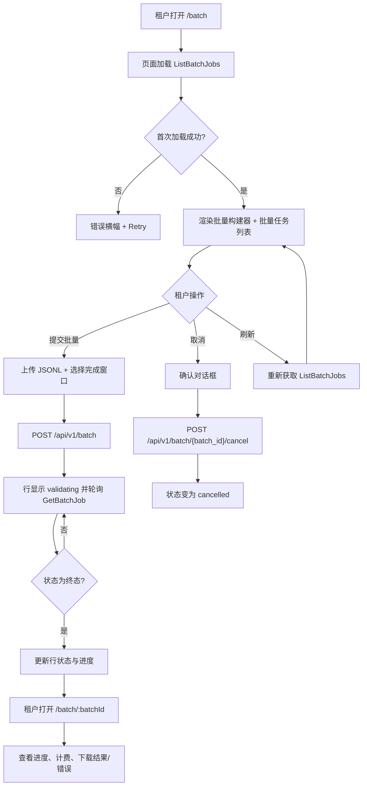
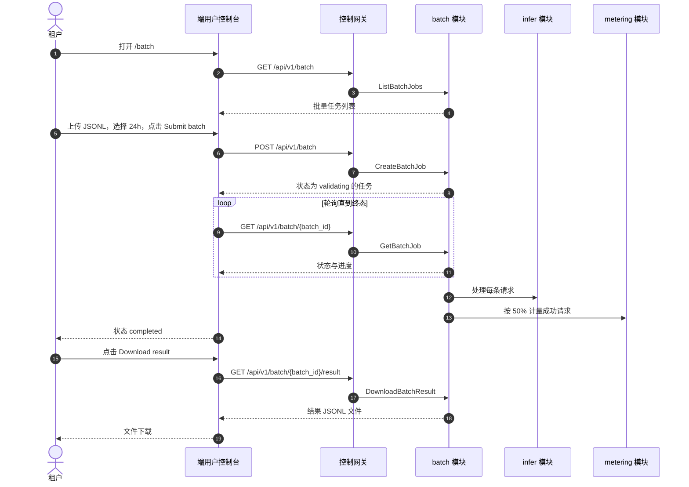

# 批量推理（批量任务）——需求分析与 UI/UX 设计

| 属性 | 内容 |
| --- | --- |
| 功能点 | 批量推理（批量任务）——提交一个 JSONL 批量推理请求文件，异步处理并享受折扣价，监控进度，下载结果/错误文件（backlog 第 42 行） |
| 文档范围 | 需求分析、竞品调研、端用户批量页面 `/batch`、管理员批量页面 `/admin/batch`、页面 → API 面映射表、编号验收标准 |
| 所属模块 | `batch`（新增——拥有批量任务生命周期、JSONL 输入/输出文件存储、异步批量 worker）、`infer`（只读：批量 worker 调用的推理端点）、`metering`（只读：批量任务的按请求 token/成本归因）、`pkg/server` 网关（用户面与管理面绑定）、`web` 端用户控制台（`UserShell` 中的 `BatchPage`）与管理控制台（`AdminShell` 中的 `AdminBatchPage`） |
| 相关文档 | [架构设计](./architecture.md) —— §2.5 `metering`、§2.6 `billing`、§3.1（管理面/用户面分离）· [请求日志与 API 游乐场](./request-logs-playground.md) —— 同源的推理面及其请求日志约定 · [账单报表与 CSV 导出](./billing-reports.md) —— 同源的异步任务与 Excel 友好 CSV 约定 · [数据导出与隐私](./data-export-privacy.md) —— 同源的异步任务生命周期与租户隔离约定 · [控制台面分离](./console-surface-separation.md) —— 本功能所在的两个面、`UserShell`/`AdminShell` 约定、掩码投影规则 |
| 状态 | 设计完成，已移交给架构师智能体 |

---

## 1. 背景与竞品调研

### 1.1 为什么现在做批量推理

go-taas 通过 OpenAI 兼容网关提供推理服务（功能 #2、#12）：智能体发送请求并实时获得补全。但有一大类工作负载并不需要实时响应——模型评测、数据标注、批量分类、离线摘要、向量回填等，都需要处理成千上万条可以等待数分钟甚至数小时的请求。通过实时端点逐条发送这些请求既慢、又浪费、还昂贵。每个主流推理平台都为此提供了**批量 API**：提交一个请求文件，异步处理，完成后下载结果，并享受折扣价。

本功能新增**批量推理**能力：租户上传一个 JSONL 推理请求文件，平台将其作为批量任务异步处理，租户监控进度并下载结果与错误文件。它是批量处理能力中最小、可独立交付的增量：把"我有一个大规模离线工作负载"变成"提交一个批量任务、观察进度、下载结果"。它是一个**新的 `batch` 模块**，编排现有的推理与计量流水线——实时推理路径不做任何改动。

### 1.2 竞品如何实现批量推理

| 产品 | 批量面 | 输入格式 | 生命周期 | 计费 | 常见坑 |
| --- | --- | --- | --- | --- | --- |
| **OpenAI Batch API** | API + 仪表盘 | JSONL 文件（通过 `/v1/files` 上传） | `validating` → `in_progress` → `finalizing` → `completed` / `failed` / `expired` / `cancelled` | 实时价 50% | 24 小时完成窗口；结果 30 天后过期 |
| **Anthropic Message Batches** | API + 控制台 | JSONL 文件 | `in_progress` → `ended`（succeeded/failed） | 实时价 50% | 结果 29 天后过期 |
| **Together AI Batch Inference** | API + 控制台 | JSONL 文件 | queued → running → completed/failed | 实时价 50% | 文件大小限制；逐行校验 |
| **阿里云百炼 Batch** | 控制台 + API | JSONL 文件（上传） | `validating` → `in_progress` → `finalizing` → `completed` / `failed` / `expired` / `cancelled` | 实时价 50% | ≤ 50,000 条请求 / ≤ 500 MB；单批量单模型；结果 30 天后过期 |
| **火山引擎方舟 Batch** | 控制台 + API | JSONL 文件 | queued → running → completed/failed | 折扣价 | 文件大小限制；逐行校验 |
| **百度千帆 Batch** | 控制台 + API | JSONL 文件 | queued → running → completed/failed | 折扣价 | 文件大小限制；逐行校验 |

### 1.3 提炼的模式与决策

值得采纳的模式：

1. **JSONL 输入文件**——所有被调研平台都接受 JSONL 文件，每行一个请求（`custom_id`、`method`、`url`、`body`）。go-taas 采用相同格式，与 OpenAI 兼容，租户可复用现有批量工具。
2. **异步任务生命周期**——所有平台都异步处理批量任务，并带有状态生命周期（`validating` → `in_progress` → `finalizing` → `completed` / `failed` / `expired` / `cancelled`）。go-taas 采用相同生命周期。
3. **折扣价**——所有平台都对批量推理收取折扣价（通常为实时价的 50%）。go-taas 对批量任务采用实时价 50% 的折扣。
4. **结果与错误文件**——所有平台都产出结果文件（成功响应）与错误文件（失败请求），两者都以 `custom_id` 为键。go-taas 采用相同的双文件输出。
5. **专用控制台页面**——阿里云百炼与火山引擎方舟都在控制台提供专用批量页面。go-taas 需要在两个控制台都提供批量页面。

需要避免的坑：阻塞式同步批量（请求会超时）——go-taas 异步处理批量；混合多个模型的批量（平台会拒绝）——go-taas 强制单批量单模型；结果静默过期（租户丢失输出）——go-taas 显示过期日期并在删除前警告；以及泄露其他租户的批量——批量任务硬性限定到调用方组织。

**go-taas 的决策**（记录理由，遵循自主决策规则）：

| # | 决策 | 理由 |
| --- | --- | --- |
| D1 | **批量推理同时存在于两个面。** 端用户面：路由 `/batch`，API 前缀 `/api/v1/batch/*`——租户创建并管理自己的批量任务。管理面：路由 `/admin/batch`，API 前缀 `/api/v1/admin/batch/*`——操作员查看所有租户的批量任务，并可取消或检查任意任务 | 批量既是租户自助能力（租户提交并下载自己的任务），也是操作员关注点（操作员必须看到跨租户的批量负载并介入）。与 webhook（功能 #23）和账单报表（功能 #25）的双面模式一致 |
| D2 | **批量任务由输入文件与完成窗口定义。** `CreateBatchJob` 接收上传的 JSONL 输入文件与 `completion_window`（默认 `24h`，范围 `1h`–`14d`）。任务以 `status = validating` 创建（D3）。输入文件存储在 batch 模块的对象存储中 | 完成窗口限定平台可用的时间；输入文件是批量的载荷。窗口遵循 OpenAI/阿里云约定 |
| D3 | **批量任务生命周期为 `validating` → `in_progress` → `finalizing` → `completed` / `failed` / `expired` / `cancelled`。** `validating` 校验 JSONL 格式、逐行 schema、文件大小与单模型一致性；`in_progress` 处理请求；`finalizing` 写入结果/错误文件；`completed` 使其可下载；`failed` 表示文件级错误（未处理任何请求）；`expired` 表示完成窗口已过；`cancelled` 表示租户/操作员已停止 | 生命周期镜像被调研平台，并为控制台提供清晰的进度模型。`failed` 与逐行错误（进入错误文件）不同 |
| D4 | **批量推理按实时价 50% 计费。** 每条成功处理的请求都通过现有 `metering` 流水线计量，并在价格查询中应用 `batch` 折扣因子。失败请求与文件级失败不计费 | 50% 折扣是通用批量约定（OpenAI、Anthropic、阿里云），并奖励租户使用非高峰、异步工作负载。它复用现有计量/价格流水线（功能 #4、#5） |
| D5 | **批量任务按租户隔离并掩码。** 用户面的 `CreateBatchJob` 不接受 `organization_id` 过滤（调用方组织隐含），绝不暴露其他租户的任务。管理面列出所有任务，但掩码逐请求内容（掩码投影规则，功能 #17） | 遵循功能 #17 的掩码投影规则：租户的批量绝不泄露其他租户的数据。管理面看到任务元数据与聚合统计，但看不到原始请求/响应体 |
| D6 | **结果与错误文件为 JSONL，以 `custom_id` 为键。** 结果文件每条成功请求一行，含 `custom_id` 与 `response`；错误文件每条失败请求一行，含 `custom_id` 与 `error`。两者在 `status = completed` 时可下载 | 双文件、`custom_id` 为键的输出是通用约定，让租户可将结果与输入关联 |
| D7 | **batch 块新增错误码（12601–12699）**：**12601 `CodeBatchJobNotFound`**、**12602 `CodeBatchJobStateInvalid`**、**12603 `CodeBatchInputInvalid`**、**12604 `CodeBatchInputTooLarge`**、**12605 `CodeBatchModelMismatch`**、**12606 `CodeBatchNotCompleted`**。范围/格式校验在适用处复用现有错误码 | 批量推理是新模块（D1），其错误码位于 account 块（125xx）之后的全新块；不同错误码让每种失败模式都可操作 |
| D8 | **批量任务保留有限窗口后删除。** 已完成任务的结果/错误文件保留可配置窗口（默认 30 天）后删除；任务元数据行保留并带 `files_expired` 标志。控制台在过期日期前警告 | 结果静默过期是被调研的坑；带可见过期日期的有界保留既保持平台整洁，又不让租户意外 |
| D9 | **批量任务操作被审计。** 任务创建、取消与结果下载被审计（功能 #15），记为 `batch.created` / `batch.cancelled` / `batch.downloaded`。底层逐请求推理已由现有流水线计量并记录 | 本功能编排现有推理与计量；只有新的批量操作需要新的审计事件 |

### 1.4 范围边界

**范围内**：两个控制台的批量页面（`/batch` 与 `/admin/batch`），含批量任务创建（JSONL 上传 + 完成窗口）、带状态/进度的任务列表、带逐请求统计的任务详情、结果/错误文件下载、任务取消。

**范围外**（由其他功能点跟踪）：实时推理游乐场（功能 #12）、请求日志与追踪（功能 #12、#27）、账单报表与 CSV 导出（功能 #25）、数据导出与隐私（功能 #41）、模型微调（2026-10-03 被产品负责人移除）。

---

## 2. 用户角色

| 角色 | 描述 | 与批量推理的交互 |
| --- | --- | --- |
| **租户开发者 / 智能体** | 针对 go-taas 推理 API 构建集成的消费者 | 打开 `/batch`，上传 JSONL 批量，监控进度，下载结果/错误文件 |
| **租户数据科学家 / ML 工程师** | 运行离线评测、标注或向量回填的租户 | 提交大规模批量，监控进度，下载结果用于离线分析 |
| **平台管理员** | 运行 go-taas 集群的操作员 | 打开 `/admin/batch`，查看所有租户的批量任务，监控批量负载，取消卡住或滥用任务 |

> 术语：消费侧调用方称为**智能体**（英文 "Agent"），与仓库约定一致。操作侧调用方称为**平台管理员**（英文 "Platform administrator"）。

---

## 3. 用户故事

| # | 作为… | 我想要… | 以便… |
| --- | --- | --- | --- |
| US1 | 租户开发者 | 上传一个 JSONL 批量推理请求文件并作为批量任务提交 | 我可以异步处理大规模离线工作负载 |
| US2 | 租户开发者 | 监控我的批量任务进度（validating / in_progress / finalizing / completed） | 我知道结果何时就绪 |
| US3 | 租户数据科学家 | 批量完成时下载结果与错误文件 | 我可以按 `custom_id` 将结果与输入关联 |
| US4 | 租户开发者 | 取消耗时过长或误提交的批量任务 | 我不为不再需要的任务付费或等待 |
| US5 | 租户开发者 | 看到批量折扣应用到我的批量任务 | 我理解我的批量计费 |
| US6 | 平台管理员 | 查看所有租户的批量任务及其状态/进度 | 我可以监控批量负载并在需要时介入 |
| US7 | 平台管理员 | 取消卡住或滥用的批量任务 | 我可以保护平台免受失控工作负载影响 |
| US8 | 智能体 / SDK | 用 API 密钥调用实时推理端点 | 我无需触碰批量页面即可获得补全 |

---

## 4. 功能需求

### FR1 — 创建批量任务

- **FR1.1** `CreateBatchJob`（`POST /api/v1/batch`）根据上传的 JSONL 输入文件与 `completion_window`（默认 `24h`，范围 `1h`–`14d`）创建批量任务。返回 `status = validating` 的任务（D2、D3）。
- **FR1.2** 输入文件必须是合法 JSONL 文件：每行是一个 JSON 对象，含 `custom_id`（唯一，≤ 256 字符）、`method`（`POST`）、`url`（`/v1/chat/completions` 或 `/v1/embeddings`）、`body`（请求体）。非法文件返回 **12603 `CodeBatchInputInvalid`**（D7）。
- **FR1.3** 输入文件必须 ≤ 500 MB 且 ≤ 50,000 行。更大文件返回 **12604 `CodeBatchInputTooLarge`**（D7）。
- **FR1.4** 文件中所有请求必须使用相同模型（`body.model`）。不一致返回 **12605 `CodeBatchModelMismatch`**（D7）。
- **FR1.5** 批量任务按租户隔离（D5）：只聚合调用方自己组织的任务。不接受 `organization_id` 过滤。

### FR2 — 批量任务生命周期与监控

- **FR2.1** `GetBatchJob`（`GET /api/v1/batch/{batch_id}`）返回任务的 `status`（`validating` / `in_progress` / `finalizing` / `completed` / `failed` / `expired` / `cancelled`）、`model`、`completion_window`、`total_requests`、`processed_requests`、`succeeded_requests`、`failed_requests`、`input_tokens`、`output_tokens`、`cost`、`currency`、`created_at`、`completed_at`、`files_expire_at`。未知 `batch_id` 返回 **12601 `CodeBatchJobNotFound`**（D7）。
- **FR2.2** `ListBatchJobs`（`GET /api/v1/batch`）返回调用方的批量任务，最新在前，带点式分页。每行含 `batch_id`、`model`、`status`、`total_requests`、`processed_requests`、`succeeded_requests`、`failed_requests`、`cost`、`created_at`、`completed_at`。
- **FR2.3** `CancelBatchJob`（`POST /api/v1/batch/{batch_id}/cancel`）取消处于 `validating` 或 `in_progress` 的任务。处于终态（`completed` / `failed` / `expired` / `cancelled`）的任务返回 **12602 `CodeBatchJobStateInvalid`**（D7）。

### FR3 — 结果与错误文件

- **FR3.1** `DownloadBatchResult`（`GET /api/v1/batch/{batch_id}/result`）在 `status = completed` 时返回结果文件。在 `completed` 前下载返回 **12606 `CodeBatchNotCompleted`**（D7）。响应为 `application/x-ndjson`，`Content-Disposition` 文件名如 `batch-<batch_id>-result.jsonl`（D6）。
- **FR3.2** `DownloadBatchError`（`GET /api/v1/batch/{batch_id}/error`）在 `status = completed` 且有失败请求时返回错误文件。在 `completed` 前下载返回 **12606 `CodeBatchNotCompleted`**（D7）。响应为 `application/x-ndjson`，`Content-Disposition` 文件名如 `batch-<batch_id>-error.jsonl`（D6）。
- **FR3.3** 结果文件每条成功请求一行，含 `custom_id` 与 `response`；错误文件每条失败请求一行，含 `custom_id` 与 `error`（D6）。

### FR4 — 计费

- **FR4.1** 每条成功处理的请求都通过现有 `metering` 流水线计量，并在价格查询中应用 `batch` 折扣因子 0.5（D4）。任务的 `cost` 是其成功请求成本之和。
- **FR4.2** 失败请求与文件级失败不计费（D4）。

### FR5 — 保留

- **FR5.1** 已完成任务的结果/错误文件保留可配置窗口（默认 30 天）后删除；任务元数据行保留并带 `files_expired` 标志（D8）。
- **FR5.2** 控制台显示 `files_expire_at` 日期并在过期日期前警告（D8）。

### FR6 — 面与 API 绑定

- **FR6.1** 批量页面位于**端用户面**：路由 `/batch`，API 前缀 `/api/v1/batch/*`。加入 `UserShell` 导航（功能 #17），名为 "Batch"。
- **FR6.2** 批量页面位于**管理面**：路由 `/admin/batch`，API 前缀 `/api/v1/admin/batch/*`。加入 `AdminShell` 导航（功能 #17），名为 "Batch"。
- **FR6.3** 端用户页面只调用 `/api/v1/batch/*` 路由，不含任何 `/api/v1/admin/*` 字符串；管理页面只调用 `/api/v1/admin/batch/*` 路由，不含任何 `/api/v1/batch/*` 字符串（功能 #17）。
- **FR6.4** 管理面掩码逐请求内容（D5）：显示任务元数据与聚合统计，但不显示原始请求/响应体。

---

## 5. 页面与流程设计

### 5.1 面分配

| 功能 | 面 | Web 路由 | API 前缀 |
| --- | --- | --- | --- |
| 创建批量任务 | 端用户 | `/batch` | `/api/v1/batch` |
| 批量任务列表 | 端用户 | `/batch` | `/api/v1/batch` |
| 批量任务详情 | 端用户 | `/batch/:batchId` | `/api/v1/batch/{batch_id}` |
| 取消批量任务 | 端用户 | `/batch/:batchId` | `/api/v1/batch/{batch_id}/cancel` |
| 下载结果 | 端用户 | `/batch/:batchId` | `/api/v1/batch/{batch_id}/result` |
| 下载错误 | 端用户 | `/batch/:batchId` | `/api/v1/batch/{batch_id}/error` |
| 批量任务列表（所有租户） | 管理 | `/admin/batch` | `/api/v1/admin/batch` |
| 批量任务详情（任意租户） | 管理 | `/admin/batch/:batchId` | `/api/v1/admin/batch/{batch_id}` |
| 取消批量任务（任意租户） | 管理 | `/admin/batch/:batchId` | `/api/v1/admin/batch/{batch_id}/cancel` |

以上每个页面与 API 调用都位于其分配的面；端用户页面绝不调用 `/api/v1/admin/*` 路由，管理页面绝不调用 `/api/v1/batch/*` 路由。端用户面使用用户会话域；管理面使用管理会话域。

### 5.2 页面映射

| 页面 / 组件 | 用途 |
| --- | --- |
| **批量页面**（`/batch`） | 创建批量任务（JSONL 上传 + 完成窗口），监控状态，下载结果/错误文件 |
| **批量详情页面**（`/batch/:batchId`） | 查看单个批量任务的进度、逐请求统计，下载其结果/错误文件 |
| **管理批量页面**（`/admin/batch`） | 查看所有租户的批量任务，监控批量负载，取消卡住或滥用任务 |
| **管理批量详情页面**（`/admin/batch/:batchId`） | 查看单个批量任务的元数据与聚合统计（掩码），并取消它 |

### 5.3 页面：`/batch` — 批量（端用户）

**用途**：为租户提供单一界面，提交 JSONL 批量推理请求文件、监控进度、下载结果/错误文件。

**面**：端用户——路由 `/batch`，API `/api/v1/batch/*`。

**布局**：在 `UserShell`（功能 #17）内渲染。页面头部（"Batch"，副标题 "Process a large workload of inference requests asynchronously at a discounted rate"）带 **New batch** 主操作。下方：

1. **批量构建器**——可折叠面板（任务列表为空时默认展开），字段：**Input file**（接受 `.jsonl` 的文件拖放区）、**Completion window**（下拉：1 h / 6 h / 24 h / 3 d / 7 d / 14 d；默认 24 h）。**Submit batch** 主操作与 **Cancel** 次操作。
2. **批量任务列表**——表格，列：**Batch ID**、**Model**、**Status**、**Progress**、**Requests**、**Cost**、**Created**、**Actions**。行操作：**View**（打开详情页）、**Cancel**（`status` 为 `validating` 或 `in_progress` 时启用）。表格上方有 **Refresh** 操作。

**交互状态**：

| 状态 | 行为 |
| --- | --- |
| 默认 | 批量构建器 + 批量任务列表从首次成功加载渲染 |
| 加载中 | 骨架表格；New batch 与 Refresh 禁用 |
| 空 | "No batch jobs yet." 并提示提交一个；构建器保持可见 |
| 错误 | 错误横幅带消息与 Retry 按钮；页面保留最后良好数据并显示 "Showing stale data" 横幅 |
| 禁用 | 请求进行中时 Submit batch 禁用；`status` 为终态时 Cancel 禁用；任务创建中构建器字段禁用 |
| 权限不足 | 无所需角色的会话收到 10036，页面显示标准权限不足状态（功能 #17），带返回用户首页的链接 |

**批量构建器字段**：Input file（拖放区，`.jsonl`，≤ 500 MB，≤ 50,000 行）、Completion window（下拉：1 h / 6 h / 24 h / 3 d / 7 d / 14 d；默认 24 h）。校验：Input file 必填、Completion window 必填。错误文案："Select a JSONL input file"、"Select a completion window"、"The input file must be JSONL and ≤ 500 MB"、"The input file must have ≤ 50,000 requests"。

**批量任务列表表格列**：Batch ID、Model、Status、Progress、Requests、Cost、Created、Actions。可按 Model、Status、Requests、Cost、Created 排序。可按 Status 与 Model 过滤。分页（点式分页）。

**提交批量流程**：提交构建器会上传文件并以 `status = validating` 创建任务，然后轮询 `GetBatchJob` 直到 `status` 为终态，更新行的进度。`failed` 校验显示错误消息并带 **Retry** 操作。

### 5.4 页面：`/batch/:batchId` — 批量详情（端用户）

**用途**：查看单个批量任务的进度、逐请求统计，下载其结果/错误文件。

**面**：端用户——路由 `/batch/:batchId`，API `/api/v1/batch/{batch_id}/*`。

**布局**：在 `UserShell` 内渲染。页面头部带批量 ID 与 **Back to batch** 次操作。下方：

1. **任务摘要**——卡片，含任务的 `status`、`model`、`completion_window`、`created_at`、`completed_at`、`files_expire_at`（文件即将过期时警告）。
2. **进度**——进度条显示 `processed_requests / total_requests`，含 `succeeded_requests` 与 `failed_requests` 计数。
3. **计费**——卡片，含 `input_tokens`、`output_tokens`、`cost`、`currency`，并注明批量推理按实时价 50% 计费。
4. **操作**——**Download result**（`status = completed` 时启用）、**Download error**（`status = completed` 且 `failed_requests > 0` 时启用）、**Cancel**（`status` 为 `validating` 或 `in_progress` 时启用）。

**交互状态**：

| 状态 | 行为 |
| --- | --- |
| 默认 | 任务摘要、进度、计费、操作从首次成功加载渲染 |
| 加载中 | 骨架卡片；操作禁用 |
| 错误 | 错误横幅带消息与 Retry 按钮；页面保留最后良好数据并显示 "Showing stale data" 横幅 |
| 禁用 | `status != completed` 时 Download result/error 禁用；`status` 为终态时 Cancel 禁用 |
| 权限不足 | 无所需角色的会话收到 10036，页面显示标准权限不足状态（功能 #17），带返回用户首页的链接 |

**取消流程**：点击 Cancel 打开确认对话框（"Cancel this batch job? Requests already processed will still be billed."），带 **Cancel job**（危险）与 **Keep job**（次）操作。确认后调用 `CancelBatchJob` 并将状态更新为 `cancelled`。

### 5.5 页面：`/admin/batch` — 批量（管理）

**用途**：为操作员提供单一界面，查看所有租户的批量任务、监控批量负载、取消卡住或滥用任务。

**面**：管理——路由 `/admin/batch`，API `/api/v1/admin/batch/*`。

**布局**：在 `AdminShell`（功能 #17）内渲染。页面头部（"Batch"，副标题 "Monitor and manage batch inference jobs across all tenants"）。下方：

1. **批量任务列表**——表格，列：**Batch ID**、**Organization**、**Model**、**Status**、**Progress**、**Requests**、**Cost**、**Created**、**Actions**。行操作：**View**（打开详情页）、**Cancel**（`status` 为 `validating` 或 `in_progress` 时启用）。表格上方有 **Refresh** 操作。

**交互状态**：

| 状态 | 行为 |
| --- | --- |
| 默认 | 批量任务列表从首次成功加载渲染 |
| 加载中 | 骨架表格；Refresh 禁用 |
| 空 | "No batch jobs yet." |
| 错误 | 错误横幅带消息与 Retry 按钮；页面保留最后良好数据并显示 "Showing stale data" 横幅 |
| 禁用 | `status` 为终态时 Cancel 禁用 |
| 权限不足 | 无所需角色的会话收到 10036，页面显示标准权限不足状态（功能 #17），带返回管理首页的链接 |

**批量任务列表表格列**：Batch ID、Organization、Model、Status、Progress、Requests、Cost、Created、Actions。可按 Organization、Model、Status、Requests、Cost、Created 排序。可按 Status、Model、Organization 过滤。分页（点式分页）。

### 5.6 页面：`/admin/batch/:batchId` — 批量详情（管理）

**用途**：查看单个批量任务的元数据与聚合统计（掩码），并取消它。

**面**：管理——路由 `/admin/batch/:batchId`，API `/api/v1/admin/batch/{batch_id}/*`。

**布局**：在 `AdminShell` 内渲染。页面头部带批量 ID 与 **Back to batch** 次操作。下方：

1. **任务摘要**——卡片，含任务的 `status`、`organization`、`model`、`completion_window`、`created_at`、`completed_at`、`files_expire_at`。
2. **进度**——进度条显示 `processed_requests / total_requests`，含 `succeeded_requests` 与 `failed_requests` 计数。
3. **计费**——卡片，含 `input_tokens`、`output_tokens`、`cost`、`currency`。
4. **操作**——**Cancel**（`status` 为 `validating` 或 `in_progress` 时启用）。

**交互状态**：与端用户详情页相同，但管理页不提供结果/错误下载（D5——管理面掩码逐请求内容）。

### 5.7 流程

---

## 6. API 面影响

batch RPC 属于 **`batch` 模块**（D1），通过控制网关以 HTTP 同时绑定在**用户前缀** `/api/v1/batch/*` 与**管理前缀** `/api/v1/admin/batch/*`（D1）。`infer` 与 `metering` 模块提供推理执行与逐请求计量（D4）。

| RPC | 路由 | 前缀 | 状态 | 用途 |
| --- | --- | --- | --- | --- |
| `CreateBatchJob`（`taas.batch.v1`） | `POST /api/v1/batch` | 用户 | **新增** | 创建批量任务（JSONL 输入 + 完成窗口） |
| `ListBatchJobs`（`taas.batch.v1`） | `GET /api/v1/batch` | 用户 | **新增** | 列出调用方的批量任务 |
| `GetBatchJob`（`taas.batch.v1`） | `GET /api/v1/batch/{batch_id}` | 用户 | **新增** | 获取批量任务的状态与统计 |
| `CancelBatchJob`（`taas.batch.v1`） | `POST /api/v1/batch/{batch_id}/cancel` | 用户 | **新增** | 取消批量任务 |
| `DownloadBatchResult`（`taas.batch.v1`） | `GET /api/v1/batch/{batch_id}/result` | 用户 | **新增** | 完成时下载结果文件 |
| `DownloadBatchError`（`taas.batch.v1`） | `GET /api/v1/batch/{batch_id}/error` | 用户 | **新增** | 完成时下载错误文件 |
| `AdminListBatchJobs`（`taas.batch.v1`） | `GET /api/v1/admin/batch` | 管理 | **新增** | 列出所有租户的批量任务 |
| `AdminGetBatchJob`（`taas.batch.v1`） | `GET /api/v1/admin/batch/{batch_id}` | 管理 | **新增** | 获取任意批量任务的元数据与聚合统计（掩码） |
| `AdminCancelBatchJob`（`taas.batch.v1`） | `POST /api/v1/admin/batch/{batch_id}/cancel` | 管理 | **新增** | 取消任意批量任务 |

**给架构师智能体的契约说明**：

1. `CreateBatchJob` 接收上传的 JSONL 输入文件与 `completion_window`（默认 `24h`，范围 `1h`–`14d`）。返回 `status = validating` 的任务（D2、D3）。
2. `ListBatchJobs` 返回调用方的批量任务，最新在前，带点式分页；`GetBatchJob` 返回完整记录，含进度与计费统计（FR2.1、FR2.2）。
3. `CancelBatchJob` 取消处于 `validating` 或 `in_progress` 的任务；终态返回 12602（FR2.3）。
4. `DownloadBatchResult` / `DownloadBatchError` 在 `status = completed` 时返回文件；在 `completed` 前下载返回 12606（FR3.1、FR3.2）。
5. 用户面的批量任务按租户隔离（D5）：只聚合调用方自己组织的任务。管理面列出所有任务但掩码逐请求内容（D5）。
6. 批量推理按实时价 50% 计费（D4）：每条成功请求以 `batch` 折扣因子 0.5 计量。
7. 线上约定不变：成功返回 HTTP 200，业务错误为 `{"code": <int>, "message": "..."}`，int64 字段序列化为 JSON 字符串。

错误码（现有块，`pkg/errors/codes.go`）：

| 条件 | 错误码 | 常量 | 备注 |
| --- | --- | --- | --- |
| 未知 `batch_id` | 12601 | `CodeBatchJobNotFound` | **新增**（D7） |
| 终态取消 | 12602 | `CodeBatchJobStateInvalid` | **新增**（D7） |
| 非法 JSONL 输入文件 | 12603 | `CodeBatchInputInvalid` | **新增**（D7） |
| 输入文件过大 | 12604 | `CodeBatchInputTooLarge` | **新增**（D7） |
| 单批量多模型 | 12605 | `CodeBatchModelMismatch` | **新增**（D7） |
| `completed` 前下载 | 12606 | `CodeBatchNotCompleted` | **新增**（D7） |

---

## 7. 验收标准

| # | 标准 | 级别 |
| --- | --- | --- |
| AC1 | `CreateBatchJob` 返回 `status = validating` 的任务；非法 JSONL 文件返回 12603，过大文件返回 12604，多模型文件返回 12605 | FVT |
| AC2 | `ListBatchJobs` 返回调用方的批量任务最新在前；`GetBatchJob` 返回完整记录；未知 `batch_id` 返回 12601 | FVT |
| AC3 | `CancelBatchJob` 取消处于 `validating` 或 `in_progress` 的任务；终态返回 12602 | FVT |
| AC4 | `DownloadBatchResult` / `DownloadBatchError` 在 `status = completed` 时返回文件；在 `completed` 前下载返回 12606 | FVT |
| AC5 | 批量推理按实时价 50% 计费：每条成功请求以 `batch` 折扣因子 0.5 计量；失败请求不计费 | FVT |
| AC6 | 用户面的批量任务按租户隔离：只聚合调用方自己组织的任务，绝不暴露其他租户的任务 | FVT |
| AC7 | `/batch` 页面从首次成功加载渲染批量构建器与批量任务列表，带 New batch 操作 | E2E |
| AC8 | 批量构建器校验输入文件与完成窗口，创建以 `status = validating` 出现的任务，然后轮询到终态并启用结果/错误下载 | E2E |
| AC9 | `/batch/:batchId` 详情页显示任务的进度、计费与操作；Cancel 打开确认对话框并将状态更新为 `cancelled` | E2E |
| AC10 | `/admin/batch` 页面列出所有租户的批量任务并带 Organization 列；管理详情页显示掩码元数据并可取消任务 | E2E |
| AC11 | 批量页面仅在端用户面可达：路由 `/batch`，每个 API 调用使用 `/api/v1/batch/*` 前缀且不含 `/api/v1/admin/*` 字符串；管理页面仅使用 `/api/v1/admin/batch/*` 且不含 `/api/v1/batch/*` 字符串 | E2E（面分离） |
| AC12 | 无所需角色的会话在 `/batch` 与 `/admin/batch` 页面收到 10036，页面显示标准权限不足状态 | E2E |

---

## 8. 范围外（由其他功能点跟踪）

| 项目 | 位置 |
| --- | --- |
| 实时推理游乐场 | 功能 #12 请求日志与游乐场 |
| 请求日志与追踪 | 功能 #12、#27 |
| 账单报表与 CSV 导出 | 功能 #25 账单报表 |
| 数据导出与隐私 | 功能 #41 数据导出与隐私 |
| 模型微调 | 2026-10-03 被产品负责人移除 |