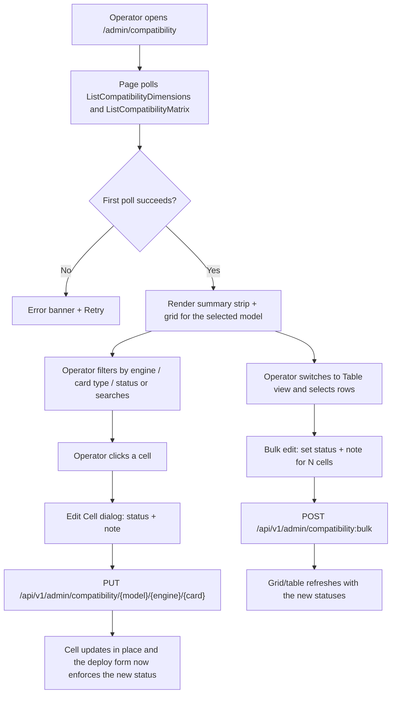
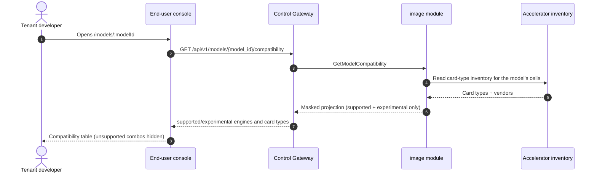

# Model × Engine × Card-Type Compatibility Matrix — Requirement Analysis and UI/UX Design

| Attribute | Content |
| --- | --- |
| Feature point | Model × engine × card-type compatibility matrix — which model/engine/card-type combinations are supported / experimental / unsupported, seeded from the accelerator inventory (backlog row 19) |
| Document scope | Requirement analysis, competitive research, the admin-surface matrix page design for `/admin/compatibility`, the end-user-surface compatibility display on `/models/:modelId`, the page → API surface table, and numbered acceptance criteria |
| Owning modules | `image` (owns the adaptation matrix per architecture §2.3), consuming the card-type inventory from the accelerator-inventory projection (feature #18) and the engine set from the image catalog (feature #3); `web` admin console (`CompatibilityPage`) and end-user console (`ModelDetailPage`); `pkg/server` gateway (admin-prefix and user-prefix bindings) |
| Related documents | [Architecture Design](./architecture.md) — §2.3 image module owns the image × card-type × engine × model-format adaptation matrix · [Accelerator Inventory & Health](./accelerator-inventory.md) — the card-type inventory this matrix is seeded from · [Image Management](./image-management.md) — the engine set and the deferred card-type-level matrix cells · [Model Catalog & One-Click Deployment](./model-catalog-deployment.md) — the model dimension and the deploy form that must consult the matrix · [Console Surface Separation](./console-surface-separation.md) — the two surfaces this feature spans |
| Status | Design complete, handed to the Architect agent |

---

## 1. Background

go-taas serves inference on **heterogeneous accelerators** — NVIDIA GPU, Iluvatar CoreX, and MetaX — across three engine families (vLLM, SGLang, TensorRT-LLM) and a growing model catalog (Qwen, DeepSeek, LLaMA, …). The architecture (§2.3) assigns the `image` module the job of maintaining the **adaptation matrix between images and card types, engines, and model formats**, and the deploy form (feature #2) already filters the image dropdown by accelerator. But today that matrix does not exist as data: the deploy form accepts any card type, the image catalog carries only a coarse `accelerator` field (nvidia / iluvatar / metax), and nothing records whether a given model actually runs on a given engine on a given card type.

Feature #18 (accelerator inventory) just shipped the **card-type inventory** — the set of card types present in the fleet, with per-node counts and health. Feature #3 shipped the **engine set** — the registered inference images with their accelerator and engine fields. Both are the raw material for the matrix this feature builds: the operator needs a single place to record and see *which model/engine/card-type combinations are known to work*, which are experimental, and which are unsupported — and the deploy form needs to consult that record so an unsupported combination is impossible to submit.

This feature adds the **compatibility matrix**: a curated, three-dimensional grid (model × engine × card type) whose cells carry a status (`supported` / `experimental` / `unsupported`) and an optional note. It is seeded from the accelerator inventory (card types) and the image catalog (engines), crossed with the model catalog. The operator curates the cells; the deploy form and the end-user console consume the result.

### 1.1 How Comparable Products Expose Model × Engine × Hardware Compatibility

| Product | Compatibility surface | What it shows | Curation model | Notable pitfalls |
| --- | --- | --- | --- | --- |
| **vLLM** | Per-model "supported hardware" tables in docs; `--dtype`, quantization and GPU requirements per model | Which GPUs / VRAM / quantization a model needs | Maintained by the project per model | Docs are prose, not a queryable matrix; no per-card-type status; no "experimental" tier |
| **NVIDIA NGC** | Per-container "supported platforms" and GPU requirements on the catalog page | Which GPU architectures / driver versions a container supports | Curated by NVIDIA per container | Catalog is per-container, not a cross-product matrix; no model dimension |
| **Hugging Face** | Model cards with "inference providers" and hardware notes; `safetensors`/quantization tags | Which providers/hardware a model is known to run on | Community-curated model cards | Free-text, inconsistent; no enforced status; no operator-owned record |
| **Together AI / SiliconFlow** | Model cards list supported GPU types and quantization for deployment | Which GPU types a model can deploy on | Platform-curated per model | The matrix is hidden behind deployment templates; no explicit "unsupported" signal — a bad combo fails at deploy time |
| **Aliyun Bailian / Volcengine Ark** | Model card shows supported compute instance types (GPU specs) | Which instance types a model deploys on | Platform-curated per model | Instance-type catalog is static; no engine dimension (engine is fixed per model) |
| **RunPod / Vast.ai** | Template/host pages list GPU compatibility | Which GPUs a template runs on | Community templates | No model dimension; no status tier; compatibility is asserted, not curated |

### 1.2 Distilled Patterns and Decisions

Patterns worth adopting: (1) **a scannable grid as the primary view** — vLLM and NGC prove that a matrix the operator can scan in one screen beats prose; (2) **an explicit status tier** — vLLM's "supported vs not" and the industry's "experimental" convention show that a three-state status (supported / experimental / unsupported) is the right granularity, with a distinct visual per state; (3) **curation is operator-owned** — Hugging Face's free-text cards drift; go-taas needs a structured, operator-owned record the deploy form can enforce; (4) **the matrix is consumed, not just displayed** — Together/SiliconFlow hide the matrix behind templates, but the deploy form must *enforce* it so a bad combo is impossible to submit.

Pitfalls to avoid: prose-only compatibility (vLLM docs, Hugging Face cards) — the matrix must be queryable and enforceable; a static catalog with no status tier (RunPod, cloud hosts) — the operator needs to know what is *experimental* before it is *supported*; a matrix hidden behind deployment templates (Together, SiliconFlow) — the operator needs a dedicated curation surface; and a matrix that silently drops curation when a card type leaves the fleet — the operator's decisions must not be lost.

**Decisions for go-taas** (recorded rationale, per the autonomous-decision rule):

| # | Decision | Rationale |
| --- | --- | --- |
| D1 | The matrix is a **curated three-dimensional grid** `(model_id, engine, card_type)` → `status` ∈ {`supported`, `experimental`, `unsupported`} plus an optional `note`. It lives in the **`image` module** (architecture §2.3 owns the adaptation matrix) | The architecture assigns the adaptation matrix to `image`; the three dimensions are exactly the model catalog, the engine set, and the card-type inventory |
| D2 | **Status semantics**: `supported` = validated and known to work (green, deployable); `experimental` = vendor-compatible but not fully validated (amber, deployable with a warning); `unsupported` = known-bad or vendor-mismatch (red/grey, not deployable) | The three-state tier matches vLLM/NGC convention and gives the operator a middle ground between "proven" and "broken" |
| D3 | **Dimensions are derived live**: models from the model catalog, engines from the image catalog, card types from the accelerator inventory. The matrix is the cross product materialized as rows. **Seeding**: on first boot, create a row for every combination; default status = `unsupported` for vendor-mismatched combos (engine.accelerator ≠ card_type.vendor) and `experimental` for vendor-matched combos. A combination that appears later (a new card type, engine, or model) gets a default row lazily on first access | The matrix must always cover the current fleet; a safe default (nothing is assumed *supported* until curated) prevents accidental deployment of unvalidated combos, while vendor-match → `experimental` reflects that the engine is at least built for that vendor |
| D4 | **The deploy form (feature #2) consults the matrix**: an `unsupported` combination is blocked at deploy time with a clear message; an `experimental` combination deploys with a warning banner. This is a cross-feature integration point the Architect wires up; the matrix page is the primary deliverable | The matrix is only useful if it is enforced; blocking `unsupported` and warning on `experimental` turns curation into a deploy-time guarantee |
| D5 | **Editing is admin-surface only.** A cell's status and note are set via a single-cell dialog or a bulk-edit flow (multi-select rows → set status + note). There is no delete in v1 — a cell's status is always one of the three states | The matrix is a curation surface; bulk edit is essential because the cross product is large and the operator must not click hundreds of cells |
| D6 | The matrix page is **admin-surface only**: route `/admin/compatibility`, API prefix `/api/v1/admin/compatibility/*`. It is added to the `AdminShell` navigation (feature #17) as "Compatibility" | Curation is an operator capability; tenants never edit the matrix |
| D7 | **End-user visibility is a read-only masked projection.** A new end-user model detail page `/models/:modelId` shows the model's `supported` and `experimental` engines and card types; `unsupported` combos are hidden. The masked model list `GET /api/v1/models` (feature #17, D15) gains a per-model compatibility summary. API: `GET /api/v1/models/{model_id}/compatibility` | Tenants need to know what a model runs on (for cost/performance expectations) but must not see operator curation internals or unsupported combos; the masked projection follows feature #17's D15 (no operator fields leak) |
| D8 | New error codes in the **image block** (10209–10299): **10209 `CodeCompatibilityCellNotFound`** (a `(model, engine, card_type)` cell absent from the matrix), **10210 `CodeCompatibilityStatusInvalid`** (a status outside the closed set), **10211 `CodeCompatibilityDimensionInvalid`** (an unknown model, engine, or card type) | The matrix belongs to `image` (D1), so its codes live in the image block after 10208 (feature #18); distinct codes keep "cell missing" vs "bad status" vs "bad dimension" actionable |
| D9 | The matrix is **polled, not pushed**: the page polls `ListCompatibilityMatrix` on an interval (default 30 s) with a last-updated timestamp; there is no websocket | Matches the existing console's `usePolling` pattern (feature #17) and keeps the API stateless |
| D10 | A card type **no longer present in the fleet** keeps its curated status but is flagged "not in fleet" in the grid/table, so the operator's curation is never silently dropped | The accelerator inventory is the live source of card types; a card type that leaves the fleet should not erase the operator's decisions, but must be visibly stale |

## 2. Goals and Non-goals

**Goals**: an admin page `/admin/compatibility` that shows the model × engine × card-type matrix as a scannable grid (rows = engines, columns = card types, per selected model) and a flat filterable table, seeded from the accelerator inventory and image catalog (D3); single-cell and bulk status editing with notes (D5); the deploy-form integration point (D4); a read-only masked end-user display on `/models/:modelId` and a compatibility summary on the masked model list (D7); the page → API surface table with exact prefixes (D6, D7); per-page interactive states including empty, error, and permission-denied; numbered acceptance criteria testable in Nightwatch against the compose stack.

**Non-goals**: any tenant-side editing of the matrix (D6); model-format-level cells beyond the three dimensions (a future refinement); automatic validation of a combination (the operator curates; the platform does not run a model to prove it works); a delete operation on cells (D5); exposing `unsupported` combos or operator curation internals to tenants (D7); a Grafana-style matrix heatmap over time (out of scope — this is a point-in-time curation surface).

## 3. Personas and Journeys

| Role | Surface | Journey |
| --- | --- | --- |
| **Platform operator** | admin | Opens `/admin/compatibility` → sees the grid for a model → spots an `experimental` cell for a card type the fleet has plenty of → promotes it to `supported` with a note → the deploy form now allows that combo without a warning |
| **Platform operator (onboarding)** | admin | Registers a new engine image (feature #3) → the matrix gains a new engine column with default `experimental`/`unsupported` cells → curates the new column before advertising the engine |
| **Platform operator (capacity)** | admin | A card type leaves the fleet → the matrix flags those cells "not in fleet" but keeps their status → later re-adds the card type and the curation is intact |
| **Tenant developer / Agent** | end-user | Opens `/models/:modelId` → sees which engines and card types the model runs on → picks a model knowing its hardware/engine profile, without seeing operator curation internals |
| **Deploying user** | admin | Opens the deploy form (feature #2) → picks a model, engine, card type → an `unsupported` combo is blocked with a message; an `experimental` combo shows a warning |

> Terminology: the consumer-side caller is an **Agent** in English and 「智能体」 in Chinese, consistent with the repository convention.

## 4. Feature Requirements

### FR1 — Matrix dimensions and seeding

- **FR1.1** The matrix dimensions are derived live: **models** from the model catalog, **engines** from the image catalog (the distinct `engine` values of registered images), **card types** from the accelerator inventory (feature #18). A dimension with zero members is shown as an empty axis with a hint.
- **FR1.2** On first boot, the matrix is seeded with a row for every `(model, engine, card_type)` combination. Default status: `unsupported` when `engine.accelerator ≠ card_type.vendor`, `experimental` when they match (D3).
- **FR1.3** A combination that appears later (a new model, engine, or card type) gets a default row lazily on first access, using the same default rule (D3).
- **FR1.4** A card type no longer present in the accelerator inventory keeps its curated status but is flagged `not_in_fleet` in the response and UI (D10).

### FR2 — Matrix queries

- **FR2.1** `ListCompatibilityMatrix` (`GET /api/v1/admin/compatibility`) returns matrix cells, filterable by `model_id`, `engine`, `card_type`, and `status`, searchable by model name, and paginated (`offset`/`limit`, default 20, max 100). Each cell carries `model_id`, `model_name`, `engine`, `card_type`, `card_vendor`, `status`, `note`, `not_in_fleet`, and `updated_at`.
- **FR2.2** `ListCompatibilityDimensions` (`GET /api/v1/admin/compatibility/dimensions`) returns the three axis lists (models, engines, card types with their vendors) plus a per-status count summary, so the grid and filters render without extra calls.
- **FR2.3** `GetCompatibilityCell` (`GET /api/v1/admin/compatibility/{model_id}/{engine}/{card_type}`) returns one cell; a missing cell returns **10209**.

### FR3 — Matrix editing

- **FR3.1** `SetCompatibilityStatus` (`PUT /api/v1/admin/compatibility/{model_id}/{engine}/{card_type}`) sets a cell's `status` (one of the closed set) and optional `note` (≤ 512 chars). An invalid status returns **10210**; an unknown model, engine, or card type returns **10211**.
- **FR3.2** `BulkSetCompatibilityStatus` (`POST /api/v1/admin/compatibility:bulk`) sets the same `status` and optional `note` for a list of cells in one call; it is atomic (all-or-nothing) and returns the count updated.
- **FR3.3** There is no delete in v1 (D5); a cell's status is always one of the three states.

### FR4 — Deploy-form integration

- **FR4.1** The deploy form (feature #2) consults the matrix for the chosen `(model, engine, card_type)`: an `unsupported` combination is blocked at submit with a message naming the cell and linking to the matrix; an `experimental` combination submits but shows a warning banner on the service detail page.
- **FR4.2** The deploy form's image dropdown (feature #2, D4) is additionally filtered so that images whose `(engine, card_type)` cell is `unsupported` are hidden, not merely disabled.

### FR5 — End-user compatibility display

- **FR5.1** A new end-user model detail page `/models/:modelId` shows the model's `supported` and `experimental` engines and card types in a read-only table; `unsupported` combos are hidden (masked, D7).
- **FR5.2** `GET /api/v1/models/{model_id}/compatibility` returns the masked projection: for the model, the list of `(engine, card_type, status)` where status ∈ {`supported`, `experimental`}, plus a `supported_count` / `experimental_count` summary. A model with no supported/experimental combos shows an empty state.
- **FR5.3** The masked model list `GET /api/v1/models` (feature #17, D15) gains a per-model compatibility summary (e.g. "vLLM · A800, H800") so the playground selector and model list hint at what each model runs on.

### FR6 — Surface and API binding

- **FR6.1** The matrix page lives on the **admin surface**: route `/admin/compatibility`, API prefix `/api/v1/admin/compatibility/*`. It is added to the `AdminShell` navigation (feature #17) as "Compatibility".
- **FR6.2** The end-user model detail page lives on the **end-user surface**: route `/models/:modelId`, API prefix `/api/v1/*` (`GET /api/v1/models/{model_id}/compatibility`). It is added to the `UserShell` navigation as a reachable detail page (linked from the masked model list / playground selector).
- **FR6.3** The admin page calls only `/api/v1/admin/compatibility/*` routes; the end-user page calls only `/api/v1/*` routes. Neither contains the other surface's prefix string (feature #17, D8).
- **FR6.4** The matrix is polled on an interval (default 30 s) with a last-updated timestamp (D9); a failed poll shows a stale-data banner rather than clearing the grid.

## 5. UI Design

### 5.1 Page: `/admin/compatibility` — Compatibility Matrix

**Purpose**: give the platform operator a single curation surface for which model/engine/card-type combinations are supported, experimental, or unsupported — seeded from the fleet — so the deploy form can enforce it and the operator can see coverage at a glance.

**Surface**: admin — route `/admin/compatibility`, API `/api/v1/admin/compatibility/*`.

**Layout**: rendered inside `AdminShell` (feature #17). A page header ("Compatibility Matrix", subtitle "Model × engine × card-type support across the accelerator fleet") with a **Refresh** action (secondary), a **Bulk edit** action (secondary, enabled when rows are selected), and a **Last updated** timestamp. Below the header:

1. **Summary strip** — three count cards: Supported / Experimental / Unsupported (total cells in each state), plus a "not in fleet" count when any card type has left the fleet.
2. **Filters bar** — Model (select), Engine (select), Card type (select), Status (select: all / supported / experimental / unsupported), and a text search (model name).
3. **View toggle** — **Grid** (default) and **Table**.
   - **Grid view**: a model selector at the top (or the model filter). Rows = engines, columns = card types (grouped by vendor). Each cell is a status badge (green / amber / red-grey) with a "not in fleet" marker when applicable. Click a cell → edit dialog. A legend explains the three states.
   - **Table view**: a flat list of all `(model, engine, card_type)` rows with status badge, note, "not in fleet" flag, and last updated. Filterable, searchable, paginated. Each row has a checkbox for bulk selection; a "Bulk edit" action sets status + note for the selection.

**Interactive states**:

| State | Behaviour |
| --- | --- |
| Default | Summary strip + grid/table render from the first successful poll; last-updated shows the poll time |
| Loading | Skeleton cells in the grid and skeleton rows in the table; Refresh is disabled |
| Empty | "No compatibility cells — register a model, an engine image, and an accelerator inventory to seed the matrix" with links to the Models, Images, and Accelerators pages; the summary strip shows zero counts |
| Error | An error banner with the message and a Retry button; the grid keeps its last good data with a "Showing stale data" banner (FR6.4) |
| Disabled | Refresh is disabled while a poll is in flight; Bulk edit is disabled while no rows are selected; filters are always enabled |
| Permission-denied | A session without the required role receives 10036 and the page shows the standard permission-denied state (feature #17) with a link back to the admin home |

**Grid cell states**: `supported` (green badge, solid), `experimental` (amber badge, striped), `unsupported` (red/grey badge, muted), `not in fleet` (a small "not in fleet" tag beside the status badge). A cell with a note shows a small note icon; hovering shows the note as a tooltip.

**Table columns**: checkbox, Model (name), Engine, Card type (with vendor badge), Status (badge), Note (truncated, tooltip), Not in fleet (flag), Last updated (relative time). Sortable by Model, Engine, Card type, Status, and Last updated.

### 5.2 Dialog: Edit Cell

**Purpose**: set one cell's status and note.

**Layout**: a modal with the cell identity shown read-only (Model, Engine, Card type + vendor), a **Status** radio group (Supported / Experimental / Unsupported, each with a one-line description), an optional **Note** textarea (≤ 512 chars), and **Cancel** / **Save** actions.

**Validation**: Status is required (one of the three); Note is optional and ≤ 512 chars (a counter shows remaining). On save → `SetCompatibilityStatus`; success closes the dialog and updates the cell in place; an error (10209 / 10210 / 10211) shows inline in the dialog.

### 5.3 Dialog: Bulk Edit

**Purpose**: set the same status and note for many cells at once.

**Layout**: a modal showing the selected cell count ("Editing N cells"), a **Status** radio group, an optional **Note** textarea, and **Cancel** / **Apply** actions. A warning line: "This overwrites the current status of all N selected cells."

**Validation**: Status is required; Note ≤ 512 chars. On apply → `BulkSetCompatibilityStatus`; success closes the dialog and refreshes the grid/table; a partial failure (atomic, all-or-nothing) shows the error and leaves the selection intact.

### 5.4 Page: `/models/:modelId` — Model Detail (end-user, compatibility)

**Purpose**: let a tenant see which engines and card types a model runs on, so they can pick a model with the right hardware/engine profile — without seeing operator curation internals or unsupported combos.

**Surface**: end-user — route `/models/:modelId`, API `/api/v1/models/{model_id}/compatibility`.

**Layout**: rendered inside `UserShell` (feature #17). A header with a back link to the model list / playground, the model name, and its latest version. Below, a **Compatibility** section:

1. **Summary** — "Supported on N engine/card-type combinations" and "Experimental on M" (from the masked projection).
2. **Compatibility table** — read-only rows of `(engine, card type, status)` where status ∈ {`supported`, `experimental`}; `unsupported` combos are hidden. Columns: Engine, Card type (with vendor badge), Status (badge). A note: "Compatibility is curated by the platform operator."

**Interactive states**:

| State | Behaviour |
| --- | --- |
| Default | Summary + compatibility table render from `GET /api/v1/models/{model_id}/compatibility` |
| Loading | Skeleton rows |
| Empty | "No supported engine/card-type combinations for this model yet" — the model may not be deployable on the current fleet |
| Error | An error banner with the message and a Retry button |
| Permission-denied | A session without access to the model receives 10105 (model not authorized) and the page shows the standard permission-denied state (feature #17) |
| Not-found | An unknown `model_id` returns 10101 and the page shows the standard not-found state with a link back to the model list |

### 5.5 Flow

## 6. API Surface Implications

All matrix RPCs belong to the **`image` module** (D1), served as HTTP via the Control Gateway. Admin routes are on the **admin prefix** `/api/v1/admin/compatibility/*` (D6); the end-user read is on the **user prefix** `/api/v1/*` (D7).

| RPC | Route | Prefix | Status | Purpose |
| --- | --- | --- | --- | --- |
| `ListCompatibilityMatrix` | `GET /api/v1/admin/compatibility` | admin | **new** | Matrix cells with model/engine/card/status filters, search, pagination |
| `ListCompatibilityDimensions` | `GET /api/v1/admin/compatibility/dimensions` | admin | **new** | The three axis lists (models, engines, card types + vendors) and per-status counts |
| `GetCompatibilityCell` | `GET /api/v1/admin/compatibility/{model_id}/{engine}/{card_type}` | admin | **new** | One cell; missing → 10209 |
| `SetCompatibilityStatus` | `PUT /api/v1/admin/compatibility/{model_id}/{engine}/{card_type}` | admin | **new** | Set a cell's status + note |
| `BulkSetCompatibilityStatus` | `POST /api/v1/admin/compatibility:bulk` | admin | **new** | Atomic bulk status + note for a list of cells |
| `GetModelCompatibility` | `GET /api/v1/models/{model_id}/compatibility` | user | **new** | Masked projection: supported/experimental engines and card types for a model |

**Contract notes for the Architect agent**:

1. `ListCompatibilityMatrix` supports `model_id`, `engine`, `card_type`, and `status` filters, `search` (model name), and `offset`/`limit` pagination; `CompatibilityCell` carries `model_id`, `model_name`, `engine`, `card_type`, `card_vendor`, `status`, `note`, `not_in_fleet`, `updated_at`.
2. `ListCompatibilityDimensions` returns `models[]`, `engines[]`, `card_types[]` (each with `vendor`), and a `status_counts` summary (supported / experimental / unsupported / not_in_fleet).
3. `SetCompatibilityStatus` validates `status` ∈ {supported, experimental, unsupported} (else 10210) and `note` ≤ 512 chars; an unknown model, engine, or card type returns 10211; a missing cell is created lazily with the default rule (D3) before the status is applied.
4. `BulkSetCompatibilityStatus` is atomic: either all cells update or none do; it returns the count updated.
5. `GetModelCompatibility` returns only cells with status ∈ {`supported`, `experimental`} (masked, D7), plus `supported_count` and `experimental_count`; an unknown model returns 10101; a model the tenant is not authorized for returns 10105.
6. Seeding (D3) is first-boot: on startup, if the matrix is empty, rows are created for the cross product of current models × engines × card types with the default status rule; new dimensions create rows lazily on first access.
7. The deploy-form integration (FR4) is a cross-module note: `infer` consults the matrix (via the `image` module's narrow interface) to block `unsupported` and warn on `experimental` combos at deploy time.

Error codes (image block 10209–10299, `pkg/errors/codes.go`):

| Condition | Code | Constant | Notes |
| --- | --- | --- | --- |
| A `(model, engine, card_type)` cell absent from the matrix | 10209 | `CodeCompatibilityCellNotFound` | **New** (D8) |
| A status outside the closed set {supported, experimental, unsupported} | 10210 | `CodeCompatibilityStatusInvalid` | **New** (D8) |
| An unknown model, engine, or card type in a matrix call | 10211 | `CodeCompatibilityDimensionInvalid` | **New** (D8) |
| Database / MQ infrastructure failure | 500 | `CodeInternal` | Via error normalization |

## 7. Acceptance Criteria

| # | Criterion | Level |
| --- | --- | --- |
| AC1 | On first boot with a non-empty model catalog, image catalog, and accelerator inventory, the matrix is seeded with a row for every `(model, engine, card_type)` combination; vendor-matched combos default to `experimental`, vendor-mismatched to `unsupported` | FVT |
| AC2 | `ListCompatibilityMatrix` returns cells with the model/engine/card/status filters, search, and pagination; each cell carries status, note, `not_in_fleet`, and `updated_at` | FVT |
| AC3 | `ListCompatibilityDimensions` returns the three axis lists and the per-status counts | FVT |
| AC4 | `SetCompatibilityStatus` sets a cell's status and note; an invalid status returns 10210; an unknown dimension returns 10211; a missing cell is created lazily with the default rule | FVT |
| AC5 | `BulkSetCompatibilityStatus` updates a list of cells atomically and returns the count; a failure leaves all cells unchanged | FVT |
| AC6 | A card type removed from the accelerator inventory keeps its curated status but is flagged `not_in_fleet` | FVT |
| AC7 | `GetModelCompatibility` returns only `supported` and `experimental` cells (masked); an unauthorized model returns 10105; an unknown model returns 10101 | FVT |
| AC8 | The `/admin/compatibility` page renders the summary strip, filters, and the grid for the selected model from the first successful poll, with a last-updated timestamp | E2E |
| AC9 | The grid's cell click opens the Edit Cell dialog; saving updates the cell in place; the Table view's bulk selection and Bulk edit update N cells | E2E |
| AC10 | The empty state ("No compatibility cells…") renders when the matrix is empty; the "not in fleet" tag renders on cells whose card type left the fleet | E2E |
| AC11 | A failed poll keeps the last good data with a "Showing stale data" banner and a Retry action | E2E |
| AC12 | The `/models/:modelId` page shows the model's supported/experimental engines and card types and hides unsupported combos; an unauthorized model shows the 10105 permission-denied state | E2E |
| AC13 | The matrix page is reachable only on the admin surface: it is in the `AdminShell` navigation, its route is `/admin/compatibility`, and every API call it makes uses the `/api/v1/admin/compatibility/*` prefix with no `/api/v1/*` string | E2E (surface separation) |
| AC14 | The end-user model detail page is reachable only on the end-user surface: its route is `/models/:modelId`, and its API calls use only `/api/v1/*` with no `/api/v1/admin/*` string | E2E (surface separation) |
| AC15 | A session without the required role receives 10036 on the matrix page and the page shows the standard permission-denied state | E2E |

## 8. Out of Scope (tracked elsewhere)

| Item | Where |
| --- | --- |
| Model-format-level matrix cells (beyond model × engine × card type) | Future refinement of the adaptation matrix |
| Automatic validation of a combination (running a model to prove it works) | Operator curation only; not automated in v1 |
| Cell deletion | Deliberately absent (D5) |
| Tenant-facing editing of the matrix | Deliberately absent (D6) |
| A matrix heatmap / utilization-over-time view | Future observability feature |
| Exposing unsupported combos or curation internals to tenants | Deliberately absent (D7) |