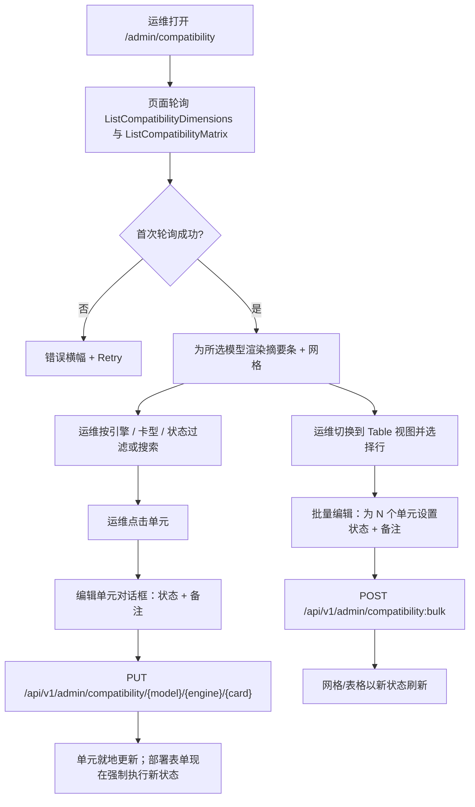
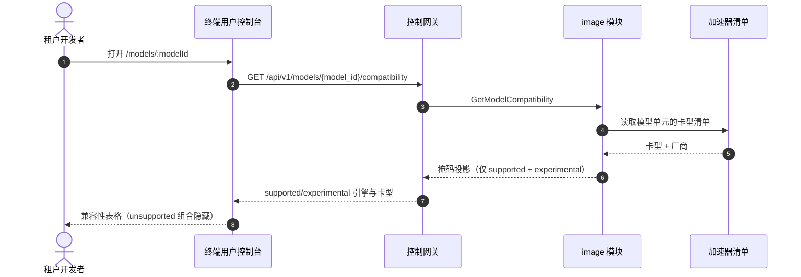

# 模型 × 引擎 × 卡型兼容矩阵 — 需求分析与 UI/UX 设计

| 属性 | 内容 |
| --- | --- |
| 特性点 | 模型 × 引擎 × 卡型兼容矩阵 —— 哪些模型/引擎/卡型组合受支持 / 实验性 / 不受支持，由加速器清单播种（backlog 第 19 行） |
| 文档范围 | 需求分析、竞品调研、`/admin/compatibility` 管理面矩阵页面设计、`/models/:modelId` 终端用户面兼容性展示、页面 → API 面对照表，以及编号可测的验收标准 |
| 归属模块 | `image`（按架构第 2.3 节拥有适配矩阵），消费加速器清单投影（特性 #18）的卡型清单与镜像目录（特性 #3）的引擎集合；`web` 管理控制台（`CompatibilityPage`）与终端用户控制台（`ModelDetailPage`）；`pkg/server` 网关（admin 前缀与 user 前缀绑定） |
| 相关文档 | [架构设计](./architecture.zh-cn.md) — 第 2.3 节镜像模块拥有镜像 × 卡型 × 引擎 × 模型格式适配矩阵 · [加速器清单与健康](./accelerator-inventory.zh-cn.md) — 本矩阵播种所用的卡型清单 · [镜像管理](./image-management.zh-cn.md) — 引擎集合与延后的卡型级矩阵单元 · [模型目录与一键部署](./model-catalog-deployment.zh-cn.md) — 模型维度与必须查询矩阵的部署表单 · [控制台面分离](./console-surface-separation.zh-cn.md) — 本特性横跨的两个面 |
| 状态 | 设计完成，已交付架构师智能体 |

---

## 1. 背景

go-taas 在**异构加速器**上提供推理服务 —— NVIDIA GPU、Iluvatar CoreX 与 MetaX —— 横跨三个引擎家族（vLLM、SGLang、TensorRT-LLM）与不断增长的模型目录（Qwen、DeepSeek、LLaMA 等）。架构（第 2.3 节）把维护**镜像与卡型、引擎、模型格式之间的适配矩阵**的职责分配给 `image` 模块，部署表单（特性 #2）已经按加速器过滤镜像下拉框。但今天这个矩阵并不以数据形式存在：部署表单接受任意卡型，镜像目录只携带一个粗粒度的 `accelerator` 字段（nvidia / iluvatar / metax），没有任何东西记录某个模型是否真的能在某个引擎上、某个卡型上运行。

特性 #18（加速器清单）刚刚交付了**卡型清单** —— 集群中存在的卡型集合，带按节点数量与健康。特性 #3 交付了**引擎集合** —— 已注册的推理镜像及其 accelerator 与 engine 字段。两者正是本特性要构建的矩阵的原材料：运维人员需要一个统一的地方来记录并查看*哪些模型/引擎/卡型组合已知可用*、哪些是实验性的、哪些不受支持 —— 而部署表单需要查询这份记录，使不受支持的组合无法被提交。

本特性新增**兼容矩阵**：一个经过整理的、三维网格（模型 × 引擎 × 卡型），其单元携带状态（`supported` / `experimental` / `unsupported`）与可选备注。它由加速器清单（卡型）与镜像目录（引擎）播种，再与模型目录交叉。运维人员整理各单元；部署表单与终端用户控制台消费结果。

### 1.1 竞品如何暴露模型 × 引擎 × 硬件兼容性

| 产品 | 兼容性面 | 展示内容 | 整理模式 | 主要陷阱 |
| --- | --- | --- | --- | --- |
| **vLLM** | 文档中按模型的「受支持硬件」表格；`--dtype`、量化与每模型 GPU 需求 | 每个模型需要哪些 GPU / 显存 / 量化 | 项目按模型维护 | 文档是散文而非可查询矩阵；无按卡型状态；无「实验性」层级 |
| **NVIDIA NGC** | 目录页上按容器的「受支持平台」与 GPU 需求 | 每个容器支持哪些 GPU 架构 / 驱动版本 | NVIDIA 按容器整理 | 目录是按容器的，不是交叉矩阵；无模型维度 |
| **Hugging Face** | 带「推理提供方」与硬件备注的模型卡；`safetensors`/量化标签 | 每个模型已知可在哪些提供方/硬件上运行 | 社区整理的模型卡 | 自由文本、不一致；无强制状态；无运维自有的记录 |
| **Together AI / SiliconFlow** | 模型卡列出部署支持的 GPU 类型与量化 | 每个模型可在哪些 GPU 类型上部署 | 平台按模型整理 | 矩阵藏在部署模板后面；无显式「不受支持」信号 —— 坏组合在部署时才失败 |
| **阿里云百炼 / 火山方舟** | 模型卡展示受支持的计算实例类型（GPU 规格） | 每个模型部署在哪些实例类型上 | 平台按模型整理 | 实例类型目录是静态的；无引擎维度（引擎按模型固定） |
| **RunPod / Vast.ai** | 模板/主机页列出 GPU 兼容性 | 每个模板在哪些 GPU 上运行 | 社区模板 | 无模型维度；无状态层级；兼容性是断言的而非整理的 |

### 1.2 归纳出的模式与决策

值得采纳的模式：(1) **以可扫描的网格为主视图** —— vLLM 与 NGC 证明，一屏可扫描的矩阵胜过散文；(2) **显式的状态层级** —— vLLM 的「受支持 vs 不受支持」与业界「实验性」惯例表明，三态状态（supported / experimental / unsupported）是合适的粒度，每态有独立视觉；(3) **整理由运维自有** —— Hugging Face 的自由文本卡片会漂移；go-taas 需要一个结构化的、运维自有的、部署表单可强制执行的记录；(4) **矩阵被消费而非仅展示** —— Together/SiliconFlow 把矩阵藏在模板后面，但部署表单必须*强制执行*它，使坏组合无法提交。

要避免的陷阱：纯散文兼容性（vLLM 文档、Hugging Face 卡片）—— 矩阵必须可查询、可强制执行；无状态层级的静态目录（RunPod、云主机）—— 运维需要知道什么在成为 *supported* 之前是 *experimental*；藏在部署模板后面的矩阵（Together、SiliconFlow）—— 运维需要一个专门的整理面；以及当卡型离开集群时静默丢弃整理的矩阵 —— 运维的决策不能被丢失。

**go-taas 的决策**（按自主决策规则记录理由）：

| # | 决策 | 理由 |
| --- | --- | --- |
| D1 | 矩阵是一个**经过整理的三维网格** `(model_id, engine, card_type)` → `status` ∈ {`supported`, `experimental`, `unsupported`} 外加可选 `note`。它位于 **`image` 模块**（架构第 2.3 节拥有适配矩阵） | 架构把适配矩阵分配给 `image`；三个维度正是模型目录、引擎集合与卡型清单 |
| D2 | **状态语义**：`supported` = 已验证且已知可用（绿色，可部署）；`experimental` = 厂商兼容但未完全验证（琥珀色，可部署但带警告）；`unsupported` = 已知不可用或厂商不匹配（红/灰，不可部署） | 三态层级符合 vLLM/NGC 惯例，给运维一个介于「已验证」与「已损坏」之间的中间地带 |
| D3 | **维度实时推导**：模型来自模型目录，引擎来自镜像目录，卡型来自加速器清单。矩阵是交叉积并物化为行。**播种**：首次启动时为每个组合创建一行；默认状态 = 厂商不匹配的组合（engine.accelerator ≠ card_type.vendor）为 `unsupported`，厂商匹配的组合为 `experimental`。之后出现的组合（新卡型、引擎或模型）在首次访问时惰性创建默认行 | 矩阵必须始终覆盖当前集群；安全默认（在整理前不假定任何东西 *supported*）防止意外部署未验证组合，而厂商匹配 → `experimental` 反映引擎至少为该厂商构建 |
| D4 | **部署表单（特性 #2）查询矩阵**：`unsupported` 组合在部署时被阻止并给出清晰消息；`experimental` 组合部署但带警告横幅。这是架构师接线的跨特性集成点；矩阵页面是主要交付物 | 矩阵只有被强制执行才有用；阻止 `unsupported` 并警告 `experimental` 把整理变成部署时的保证 |
| D5 | **编辑仅限管理面。** 单元的状态与备注通过单单元对话框或批量编辑流程（多选行 → 设置状态 + 备注）设置。v1 无删除 —— 单元状态始终是三种之一 | 矩阵是整理面；批量编辑必不可少，因为交叉积很大，运维不能逐个点击数百个单元 |
| D6 | 矩阵页面**仅限管理面**：路由 `/admin/compatibility`，API 前缀 `/api/v1/admin/compatibility/*`。它被加入 `AdminShell` 导航（特性 #17），名为「Compatibility」 | 整理是运维能力；租户永不编辑矩阵 |
| D7 | **终端用户可见性是只读掩码投影。** 新增终端用户模型详情页 `/models/:modelId`，展示模型的 `supported` 与 `experimental` 引擎和卡型；`unsupported` 组合被隐藏。掩码模型列表 `GET /api/v1/models`（特性 #17，D15）获得按模型的兼容性摘要。API：`GET /api/v1/models/{model_id}/compatibility` | 租户需要知道模型运行在什么上（用于成本/性能预期），但不得看到运维整理内部或不受支持组合；掩码投影遵循特性 #17 的 D15（不泄漏运维字段） |
| D8 | 在**镜像块**（10209–10299）新增错误码：**10209 `CodeCompatibilityCellNotFound`**（矩阵中缺失的 `(model, engine, card_type)` 单元）、**10210 `CodeCompatibilityStatusInvalid`**（超出封闭集合的状态）、**10211 `CodeCompatibilityDimensionInvalid`**（未知模型、引擎或卡型） | 矩阵属于 `image`（D1），因此其错误码位于 10208（特性 #18）之后的镜像块；独立错误码让「单元缺失」vs「状态错误」vs「维度错误」各自可操作 |
| D9 | 矩阵**轮询而非推送**：页面按间隔轮询 `ListCompatibilityMatrix`（默认 30 秒）并显示最后更新时间戳；无 websocket | 与现有控制台的 `usePolling` 模式一致（特性 #17），并保持 API 无状态 |
| D10 | **不再存在于集群中的卡型**保留其整理状态，但在网格/表格中标记「not in fleet」，使运维的整理永不静默丢失 | 加速器清单是卡型的实时来源；离开集群的卡型不应抹掉运维的决策，但必须可见地过期 |

## 2. 目标与非目标

**目标**：一个管理页 `/admin/compatibility`，以可扫描网格（行 = 引擎，列 = 卡型，按所选模型）与扁平可过滤表格展示模型 × 引擎 × 卡型矩阵，由加速器清单与镜像目录播种（D3）；单单元与批量状态编辑带备注（D5）；部署表单集成点（D4）；`/models/:modelId` 上的只读掩码终端用户展示与掩码模型列表上的兼容性摘要（D7）；带精确前缀的页面 → API 面对照表（D6、D7）；包括空态、错误态与权限拒绝态的逐页面交互状态；可在 compose 栈上由 Nightwatch 测试的编号验收标准。

**非目标**：任何租户侧编辑矩阵（D6）；超出三个维度的模型格式级单元（未来细化）；自动验证组合（运维整理；平台不运行模型来证明其可用）；单元删除操作（D5）；向租户暴露 `unsupported` 组合或运维整理内部（D7）；随时间变化的 Grafana 式矩阵热力图（超出范围 —— 这是时点整理面）。

## 3. 角色与旅程

| 角色 | 面 | 旅程 |
| --- | --- | --- |
| **平台运维** | admin | 打开 `/admin/compatibility` → 看到某模型的网格 → 发现集群有大量空闲卡型的 `experimental` 单元 → 带备注提升为 `supported` → 部署表单现在允许该组合且无警告 |
| **平台运维（上线）** | admin | 注册新引擎镜像（特性 #3）→ 矩阵新增引擎列，默认 `experimental`/`unsupported` 单元 → 在宣传引擎前整理新列 |
| **平台运维（容量）** | admin | 某卡型离开集群 → 矩阵标记这些单元「not in fleet」但保留其状态 → 之后重新加入卡型，整理完好 |
| **租户开发者 / 智能体** | end-user | 打开 `/models/:modelId` → 看到模型运行在哪些引擎与卡型上 → 在了解硬件/引擎画像的情况下选择模型，而不看到运维整理内部 |
| **部署用户** | admin | 打开部署表单（特性 #2）→ 选择模型、引擎、卡型 → `unsupported` 组合被阻止并给出消息；`experimental` 组合显示警告 |

> 术语：消费侧调用方在英文中称为 **Agent**，中文为「智能体」，与仓库约定一致。

## 4. 功能需求

### FR1 — 矩阵维度与播种

- **FR1.1** 矩阵维度实时推导：**模型**来自模型目录，**引擎**来自镜像目录（已注册镜像的不同 `engine` 值），**卡型**来自加速器清单（特性 #18）。零成员的维度显示为空轴并带提示。
- **FR1.2** 首次启动时，矩阵为每个 `(model, engine, card_type)` 组合播种一行。默认状态：`engine.accelerator ≠ card_type.vendor` 时为 `unsupported`，匹配时为 `experimental`（D3）。
- **FR1.3** 之后出现的组合（新模型、引擎或卡型）在首次访问时惰性创建默认行，使用相同默认规则（D3）。
- **FR1.4** 不再存在于加速器清单中的卡型保留其整理状态，但在响应与 UI 中标记 `not_in_fleet`（D10）。

### FR2 — 矩阵查询

- **FR2.1** `ListCompatibilityMatrix`（`GET /api/v1/admin/compatibility`）返回矩阵单元，可按 `model_id`、`engine`、`card_type`、`status` 过滤，按模型名搜索，并分页（`offset`/`limit`，默认 20，上限 100）。每个单元携带 `model_id`、`model_name`、`engine`、`card_type`、`card_vendor`、`status`、`note`、`not_in_fleet`、`updated_at`。
- **FR2.2** `ListCompatibilityDimensions`（`GET /api/v1/admin/compatibility/dimensions`）返回三个轴列表（模型、引擎、带厂商的卡型）以及按状态计数摘要，使网格与过滤器无需额外调用即可渲染。
- **FR2.3** `GetCompatibilityCell`（`GET /api/v1/admin/compatibility/{model_id}/{engine}/{card_type}`）返回单个单元；缺失单元返回 **10209**。

### FR3 — 矩阵编辑

- **FR3.1** `SetCompatibilityStatus`（`PUT /api/v1/admin/compatibility/{model_id}/{engine}/{card_type}`）设置单元的状态（封闭集合之一）与可选 `note`（≤ 512 字符）。无效状态返回 **10210**；未知模型、引擎或卡型返回 **10211**。
- **FR3.2** `BulkSetCompatibilityStatus`（`POST /api/v1/admin/compatibility:bulk`）在一次调用中为单元列表设置相同 `status` 与可选 `note`；它是原子的（全有或全无）并返回更新数量。
- **FR3.3** v1 无删除（D5）；单元状态始终是三种之一。

### FR4 — 部署表单集成

- **FR4.1** 部署表单（特性 #2）为所选 `(model, engine, card_type)` 查询矩阵：`unsupported` 组合在提交时被阻止，消息指明该单元并链接到矩阵；`experimental` 组合提交但服务详情页显示警告横幅。
- **FR4.2** 部署表单的镜像下拉框（特性 #2，D4）额外过滤，使 `(engine, card_type)` 单元为 `unsupported` 的镜像被隐藏，而非仅禁用。

### FR5 — 终端用户兼容性展示

- **FR5.1** 新增终端用户模型详情页 `/models/:modelId`，以只读表格展示模型的 `supported` 与 `experimental` 引擎和卡型；`unsupported` 组合被隐藏（掩码，D7）。
- **FR5.2** `GET /api/v1/models/{model_id}/compatibility` 返回掩码投影：对模型而言，`(engine, card_type, status)` 列表，其中 status ∈ {`supported`, `experimental`}，外加 `supported_count` / `experimental_count` 摘要。无受支持/实验性组合的模型显示空态。
- **FR5.3** 掩码模型列表 `GET /api/v1/models`（特性 #17，D15）获得按模型的兼容性摘要（例如「vLLM · A800, H800」），使 playground 选择器与模型列表提示每个模型运行在什么上。

### FR6 — 面与 API 绑定

- **FR6.1** 矩阵页面位于**管理面**：路由 `/admin/compatibility`，API 前缀 `/api/v1/admin/compatibility/*`。它被加入 `AdminShell` 导航（特性 #17），名为「Compatibility」。
- **FR6.2** 终端用户模型详情页位于**终端用户面**：路由 `/models/:modelId`，API 前缀 `/api/v1/*`（`GET /api/v1/models/{model_id}/compatibility`）。它作为可达详情页加入 `UserShell` 导航（从掩码模型列表 / playground 选择器链接）。
- **FR6.3** 管理页只调用 `/api/v1/admin/compatibility/*` 路由；终端用户页只调用 `/api/v1/*` 路由。两者都不包含另一面的前缀字符串（特性 #17，D8）。
- **FR6.4** 矩阵按间隔轮询（默认 30 秒）并带最后更新时间戳（D9）；失败的轮询显示过期数据横幅而非清空网格。

## 5. UI 设计

### 5.1 页面：`/admin/compatibility` — 兼容矩阵

**目的**：给平台运维一个统一的整理面，记录哪些模型/引擎/卡型组合受支持、实验性或不受支持 —— 由集群播种 —— 使部署表单可强制执行它，运维可一眼看到覆盖情况。

**面**：admin —— 路由 `/admin/compatibility`，API `/api/v1/admin/compatibility/*`。

**布局**：在 `AdminShell`（特性 #17）内渲染。页面头部（「Compatibility Matrix」，副标题「Model × engine × card-type support across the accelerator fleet」）带 **Refresh** 动作（次要）、**Bulk edit** 动作（次要，选中行时启用）与 **Last updated** 时间戳。头部下方：

1. **摘要条** —— 三个计数卡片：Supported / Experimental / Unsupported（各状态单元总数），外加当任何卡型离开集群时的「not in fleet」计数。
2. **过滤器栏** —— Model（下拉）、Engine（下拉）、Card type（下拉）、Status（下拉：all / supported / experimental / unsupported），以及文本搜索（模型名）。
3. **视图切换** —— **Grid**（默认）与 **Table**。
   - **Grid 视图**：顶部有模型选择器（或模型过滤器）。行 = 引擎，列 = 卡型（按厂商分组）。每个单元是状态徽章（绿 / 琥珀 / 红-灰），适用时带「not in fleet」标记。点击单元 → 编辑对话框。图例解释三种状态。
   - **Table 视图**：所有 `(model, engine, card_type)` 行的扁平列表，带状态徽章、备注、「not in fleet」标记与最后更新。可过滤、可搜索、可分页。每行有复选框用于批量选择；「Bulk edit」动作为所选设置状态 + 备注。

**交互状态**：

| 状态 | 行为 |
| --- | --- |
| 默认 | 摘要条 + 网格/表格从首次成功轮询渲染；last-updated 显示轮询时间 |
| 加载中 | 网格中的骨架单元与表格中的骨架行；Refresh 禁用 |
| 空态 | 「No compatibility cells — register a model, an engine image, and an accelerator inventory to seed the matrix」，带 Models、Images、Accelerators 页面链接；摘要条显示零计数 |
| 错误 | 带消息与 Retry 按钮的错误横幅；网格保留最后好数据并带「Showing stale data」横幅（FR6.4） |
| 禁用 | 轮询进行中 Refresh 禁用；未选中行时 Bulk edit 禁用；过滤器始终启用 |
| 权限拒绝 | 无所需角色的会话收到 10036，页面显示标准权限拒绝态（特性 #17），带返回 admin 首页的链接 |

**网格单元状态**：`supported`（绿色徽章，实心）、`experimental`（琥珀色徽章，条纹）、`unsupported`（红/灰徽章，弱化）、`not in fleet`（状态徽章旁的小「not in fleet」标签）。带备注的单元显示小备注图标；悬停显示备注为工具提示。

**表格列**：复选框、Model（名称）、Engine、Card type（带厂商徽章）、Status（徽章）、Note（截断，工具提示）、Not in fleet（标记）、Last updated（相对时间）。可按 Model、Engine、Card type、Status、Last updated 排序。

### 5.2 对话框：编辑单元

**目的**：设置一个单元的状态与备注。

**布局**：模态框，单元身份只读显示（Model、Engine、Card type + 厂商），**Status** 单选组（Supported / Experimental / Unsupported，各带一行描述），可选 **Note** 文本域（≤ 512 字符），以及 **Cancel** / **Save** 动作。

**校验**：Status 必填（三种之一）；Note 可选且 ≤ 512 字符（显示剩余计数）。保存 → `SetCompatibilityStatus`；成功关闭对话框并就地更新单元；错误（10209 / 10210 / 10211）在对话框内联显示。

### 5.3 对话框：批量编辑

**目的**：一次为多个单元设置相同状态与备注。

**布局**：模态框显示所选单元数（「Editing N cells」）、**Status** 单选组、可选 **Note** 文本域，以及 **Cancel** / **Apply** 动作。警告行：「This overwrites the current status of all N selected cells.」

**校验**：Status 必填；Note ≤ 512 字符。应用 → `BulkSetCompatibilityStatus`；成功关闭对话框并刷新网格/表格；部分失败（原子，全有或全无）显示错误并保留选择。

### 5.4 页面：`/models/:modelId` — 模型详情（终端用户，兼容性）

**目的**：让租户看到模型运行在哪些引擎与卡型上，以便在了解硬件/引擎画像的情况下选择模型 —— 而不看到运维整理内部或不受支持组合。

**面**：end-user —— 路由 `/models/:modelId`，API `/api/v1/models/{model_id}/compatibility`。

**布局**：在 `UserShell`（特性 #17）内渲染。头部带返回模型列表 / playground 的返回链接、模型名与其最新版本。下方是 **Compatibility** 区块：

1. **摘要** —— 「Supported on N engine/card-type combinations」与「Experimental on M」（来自掩码投影）。
2. **兼容性表格** —— `(engine, card type, status)` 的只读行，其中 status ∈ {`supported`, `experimental`}；`unsupported` 组合被隐藏。列：Engine、Card type（带厂商徽章）、Status（徽章）。备注：「Compatibility is curated by the platform operator.」

**交互状态**：

| 状态 | 行为 |
| --- | --- |
| 默认 | 摘要 + 兼容性表格从 `GET /api/v1/models/{model_id}/compatibility` 渲染 |
| 加载中 | 骨架行 |
| 空态 | 「No supported engine/card-type combinations for this model yet」—— 该模型可能无法在当前集群上部署 |
| 错误 | 带消息与 Retry 按钮的错误横幅 |
| 权限拒绝 | 无模型访问权限的会话收到 10105（模型未授权），页面显示标准权限拒绝态（特性 #17） |
| 未找到 | 未知 `model_id` 返回 10101，页面显示标准未找到态，带返回模型列表的链接 |

### 5.5 流程

## 6. API 面对照

所有矩阵 RPC 属于 **`image` 模块**（D1），经控制网关以 HTTP 提供。管理路由位于**管理前缀** `/api/v1/admin/compatibility/*`（D6）；终端用户读取位于**用户前缀** `/api/v1/*`（D7）。

| RPC | 路由 | 前缀 | 状态 | 目的 |
| --- | --- | --- | --- | --- |
| `ListCompatibilityMatrix` | `GET /api/v1/admin/compatibility` | admin | **新增** | 带模型/引擎/卡型/状态过滤、搜索、分页的矩阵单元 |
| `ListCompatibilityDimensions` | `GET /api/v1/admin/compatibility/dimensions` | admin | **新增** | 三个轴列表（模型、引擎、卡型 + 厂商）与按状态计数 |
| `GetCompatibilityCell` | `GET /api/v1/admin/compatibility/{model_id}/{engine}/{card_type}` | admin | **新增** | 单个单元；缺失 → 10209 |
| `SetCompatibilityStatus` | `PUT /api/v1/admin/compatibility/{model_id}/{engine}/{card_type}` | admin | **新增** | 设置单元状态 + 备注 |
| `BulkSetCompatibilityStatus` | `POST /api/v1/admin/compatibility:bulk` | admin | **新增** | 为单元列表原子批量设置状态 + 备注 |
| `GetModelCompatibility` | `GET /api/v1/models/{model_id}/compatibility` | user | **新增** | 掩码投影：模型的 supported/experimental 引擎与卡型 |

**给架构师的契约说明**：

1. `ListCompatibilityMatrix` 支持 `model_id`、`engine`、`card_type`、`status` 过滤，`search`（模型名），以及 `offset`/`limit` 分页；`CompatibilityCell` 携带 `model_id`、`model_name`、`engine`、`card_type`、`card_vendor`、`status`、`note`、`not_in_fleet`、`updated_at`。
2. `ListCompatibilityDimensions` 返回 `models[]`、`engines[]`、`card_types[]`（各带 `vendor`）以及 `status_counts` 摘要（supported / experimental / unsupported / not_in_fleet）。
3. `SetCompatibilityStatus` 校验 `status` ∈ {supported, experimental, unsupported}（否则 10210）且 `note` ≤ 512 字符；未知模型、引擎或卡型返回 10211；缺失单元在应用状态前按默认规则（D3）惰性创建。
4. `BulkSetCompatibilityStatus` 是原子的：要么所有单元更新，要么都不更新；返回更新数量。
5. `GetModelCompatibility` 只返回 status ∈ {`supported`, `experimental`} 的单元（掩码，D7），外加 `supported_count` 与 `experimental_count`；未知模型返回 10101；租户未授权的模型返回 10105。
6. 播种（D3）是首次启动：启动时若矩阵为空，为当前模型 × 引擎 × 卡型的交叉积创建行，使用默认状态规则；新维度在首次访问时惰性创建行。
7. 部署表单集成（FR4）是跨模块说明：`infer` 在部署时通过 `image` 模块的窄接口查询矩阵，阻止 `unsupported` 并警告 `experimental` 组合。

错误码（镜像块 10209–10299，`pkg/errors/codes.go`）：

| 条件 | 代码 | 常量 | 说明 |
| --- | --- | --- | --- |
| 矩阵中缺失的 `(model, engine, card_type)` 单元 | 10209 | `CodeCompatibilityCellNotFound` | **新增**（D8） |
| 超出封闭集合 {supported, experimental, unsupported} 的状态 | 10210 | `CodeCompatibilityStatusInvalid` | **新增**（D8） |
| 矩阵调用中的未知模型、引擎或卡型 | 10211 | `CodeCompatibilityDimensionInvalid` | **新增**（D8） |
| 数据库 / MQ 基础设施故障 | 500 | `CodeInternal` | 经错误归一化 |

## 7. 验收标准

| # | 标准 | 级别 |
| --- | --- | --- |
| AC1 | 在模型目录、镜像目录与加速器清单非空时首次启动，矩阵为每个 `(model, engine, card_type)` 组合播种一行；厂商匹配组合默认 `experimental`，厂商不匹配默认 `unsupported` | FVT |
| AC2 | `ListCompatibilityMatrix` 返回带模型/引擎/卡型/状态过滤、搜索与分页的单元；每个单元携带状态、备注、`not_in_fleet`、`updated_at` | FVT |
| AC3 | `ListCompatibilityDimensions` 返回三个轴列表与按状态计数 | FVT |
| AC4 | `SetCompatibilityStatus` 设置单元状态与备注；无效状态返回 10210；未知维度返回 10211；缺失单元按默认规则惰性创建 | FVT |
| AC5 | `BulkSetCompatibilityStatus` 原子更新单元列表并返回数量；失败时所有单元保持不变 | FVT |
| AC6 | 从加速器清单移除的卡型保留其整理状态但标记 `not_in_fleet` | FVT |
| AC7 | `GetModelCompatibility` 只返回 `supported` 与 `experimental` 单元（掩码）；未授权模型返回 10105；未知模型返回 10101 | FVT |
| AC8 | `/admin/compatibility` 页面从首次成功轮询渲染摘要条、过滤器与所选模型的网格，带最后更新时间戳 | E2E |
| AC9 | 网格单元点击打开编辑单元对话框；保存就地更新单元；Table 视图的批量选择与 Bulk edit 更新 N 个单元 | E2E |
| AC10 | 矩阵为空时渲染空态（「No compatibility cells…」）；卡型离开集群的单元渲染「not in fleet」标签 | E2E |
| AC11 | 失败的轮询保留最后好数据并带「Showing stale data」横幅与 Retry 动作 | E2E |
| AC12 | `/models/:modelId` 页面展示模型的 supported/experimental 引擎与卡型并隐藏 unsupported 组合；未授权模型显示 10105 权限拒绝态 | E2E |
| AC13 | 矩阵页面仅限管理面可达：在 `AdminShell` 导航中，路由为 `/admin/compatibility`，其所有 API 调用使用 `/api/v1/admin/compatibility/*` 前缀且无 `/api/v1/*` 字符串 | E2E（面分离） |
| AC14 | 终端用户模型详情页仅限终端用户面可达：路由为 `/models/:modelId`，其 API 调用只使用 `/api/v1/*` 且无 `/api/v1/admin/*` 字符串 | E2E（面分离） |
| AC15 | 无所需角色的会话在矩阵页面收到 10036，页面显示标准权限拒绝态 | E2E |

## 8. 超出范围（另行跟踪）

| 项 | 去向 |
| --- | --- |
| 超出模型 × 引擎 × 卡型的模型格式级矩阵单元 | 适配矩阵的未来细化 |
| 自动验证组合（运行模型证明其可用） | 仅运维整理；v1 不自动化 |
| 单元删除 | 刻意缺失（D5） |
| 租户侧编辑矩阵 | 刻意缺失（D6） |
| 矩阵热力图 / 随时间利用率视图 | 未来可观测性特性 |
| 向租户暴露 unsupported 组合或整理内部 | 刻意缺失（D7） |