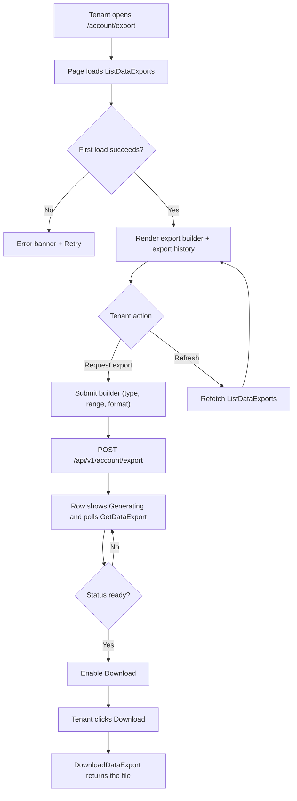
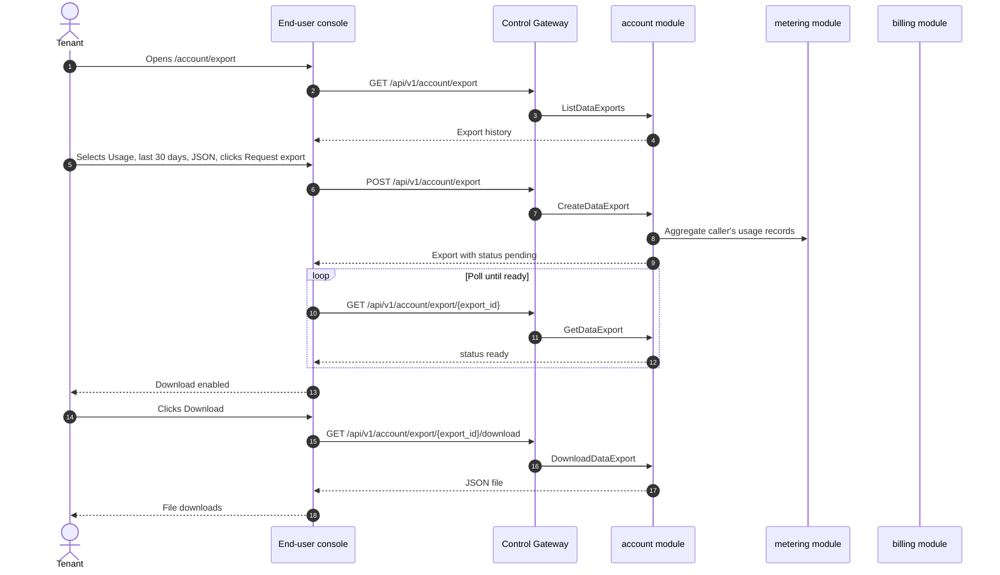

# Data Export & Privacy — Requirement Analysis and UI/UX Design

| Attribute | Content |
| --- | --- |
| Feature point | Data export & privacy — GDPR-style data export (usage, billing, request logs) and account data download as JSON/CSV (backlog row 41) |
| Document scope | Requirement analysis, competitive research, the end-user-surface data export page for `/account/export`, the page → API surface table, and numbered acceptance criteria |
| Owning modules | `account` (new — owns the data-export job lifecycle and the account-data bundle), `metering` (read-only: usage and request-log export), `billing` (read-only: billing export), `auth` (read-only: account profile export), `pkg/server` gateway (user-prefix bindings), `web` end-user console (`DataExportPage` in `UserShell`) |
| Related documents | [Architecture Design](./architecture.md) — §2.5 `metering`, §2.6 `billing`, §3.1 (admin/user surface separation) · [Billing Reports & CSV Export](./billing-reports.md) — the sibling CSV-export feature and its async-job, Excel-friendly-CSV, and tenant-scoping conventions · [Audit Logging & Activity Export](./audit-logging.md) — the sibling export feature and its audit-event conventions · [Console Surface Separation](./console-surface-separation.md) — the end-user surface this page lives on, the `UserShell` conventions, the masked-projection rule |
| Status | Design complete, handed to the Architect agent |

---

## 1. Background and Competitive Research

### 1.1 Why Data Export & Privacy Comes Now

go-taas records a tenant's usage (`usage_records`), billing (`bills`, `invoices`), and request logs (`request_logs`) as the platform meters and bills inference (features #4, #5, #8, #12, #14). The billing-reports feature (row 25) lets a tenant download a *billing report* as CSV, but it is a curated, dimensioned report — not a full data-portability export. What the console still cannot do is give a tenant a **complete, machine-readable copy of their own data** — their usage, billing, and request logs, plus their account profile — in a structured format they can take elsewhere. Under GDPR Art. 20 (right to data portability), a data subject has the right to receive their personal data in a structured, commonly used, machine-readable format. go-taas must offer this to its tenants.

This feature adds a **data export & privacy** page: GDPR-style data export (usage, billing, request logs) and account data download as JSON/CSV. It is the smallest independently valuable increment of Phase 4's productionization roadmap item: it turns "I want my data" into "request an export of my usage, billing, request logs, and account profile, and download it as JSON or CSV". It is a **read-only** aggregation and export layer — nothing in the inference, metering, or billing pipelines changes.

### 1.2 How Comparable Products Implement Data Export & Privacy

| Product | Data export surface | Data types | Format | Notable pitfalls |
| --- | --- | --- | --- | --- |
| **Google Takeout** | A dedicated export page | Account data across services | ZIP of JSON/CSV per service | Export is a large bundle; generation is async and can take time |
| **GDPR Art. 20** | Right to data portability | Personal data provided to the controller | Structured, commonly used, machine-readable | The right covers personal data, not necessarily every operational record |
| **OpenAI Platform** | Account settings data export | Usage, account data | CSV/JSON | Export is limited to usage; no full request-log export |
| **Stripe** | Dashboard data export | Transactions, invoices, reports | CSV | Export is report-oriented, not a full data-portability bundle |
| **Anthropic Console** | Account data export | Usage, account data | CSV/JSON | Export is limited; no full request-log export |

### 1.3 Distilled Patterns and Decisions

Patterns worth adopting:

1. **A dedicated export page** — Google Takeout and OpenAI both have a dedicated export surface; go-taas needs a data-export page under the account settings.
2. **Async job generation** — Google Takeout generates the export asynchronously (a bundle can take time); go-taas reuses the async-job pattern from billing-reports (D2).
3. **A structured, machine-readable format** — GDPR Art. 20 requires a structured, commonly used, machine-readable format; go-taas exports JSON (for the full bundle) and CSV (for the tabular usage/billing/request-log data).
4. **Tenant-scoped export** — the export must contain only the caller's own data (feature #17's masked-projection rule); no other tenant's data ever appears.

Pitfalls to avoid: a blocking synchronous export for large ranges (the request times out) — go-taas generates exports asynchronously; a full bundle that is too large to download at once — go-taas offers per-type exports (usage / billing / request logs / account) so a tenant can download what they need; and exposing other tenants' data — the export is hard-scoped to the caller's organization.

**Decisions for go-taas** (recorded rationale, per the autonomous-decision rule):

| # | Decision | Rationale |
| --- | --- | --- |
| D1 | **Data export lives on the end-user surface only**: route `/account/export`, API prefix `/api/v1/account/export/*`. There is **no admin surface** — data export is a tenant's right over their own data (GDPR Art. 20); the operator does not export a tenant's data from the admin console | Data export is a tenant self-service right over their own data; the operator's cross-tenant reporting is already covered by billing-reports (row 25) on the admin surface. Consistent with the end-user-only quickstart (feature #21) |
| D2 | **Exports are generated asynchronously as jobs.** `CreateDataExport` returns an export with `status = pending`; the export becomes `ready` (with a downloadable file) or `failed`. The console polls `GetDataExport` until `ready`, then enables the download | Large ranges take time to aggregate; a synchronous export would block or time out. Job-based generation is the universal pattern (Google Takeout, billing-reports D2) and keeps the client responsive |
| D3 | **An export is defined by a type and a time range.** The type is one of `usage` / `billing` / `request_logs` / `account`. The `usage`, `billing`, and `request_logs` types take a `since`/`until` range (defaults `until = now`, `since = until − 30d`); the `account` type takes no range (it is a point-in-time profile snapshot). The format is `json` or `csv` (CSV only for the tabular types; `account` is always JSON) | A per-type export lets a tenant download what they need (pitfall: a full bundle is too large); the range and format follow the billing-reports conventions |
| D4 | **The export is tenant-scoped and masked.** `CreateDataExport` on the user prefix aggregates only the caller's own organization's usage, billing, request logs, and account profile. It accepts no `organization_id` filter (the caller's org is implicit) and never exposes other tenants' data | Follows feature #17's masked-projection rule: a tenant's export must never leak another tenant's data. The end-user surface is the only place a tenant can export their own data |
| D5 | **The JSON bundle is structured and machine-readable; the CSV is Excel-friendly.** The JSON export is a structured object per type (e.g. `{"usage": [...], "billing": [...], "request_logs": [...], "account": {...}}`). The CSV export is UTF-8 with a BOM, quoted fields, and a header row (the billing-reports D5 convention) | GDPR Art. 20 requires a structured, commonly used, machine-readable format; JSON satisfies it. The CSV follows the billing-reports Excel-friendly convention so a tenant can open it in a spreadsheet |
| D6 | **New error codes in an account block (12501–12599)**: **12501 `CodeDataExportNotFound`**, **12502 `CodeDataExportTypeInvalid`**, **12503 `CodeDataExportFormatInvalid`**, **12504 `CodeDataExportNotReady`**. Range validation reuses **10404** | Data export is a new module (D2), so its codes live in a fresh block after the cluster block (124xx); distinct codes keep each failure mode actionable while the range contract stays uniform with metering |
| D7 | **Data export is read-only and audited for access and generation.** Export generation is audited (feature #15) as `data_export.created` / `data_export.downloaded`; the underlying usage/billing/request-log writes are already audited by the metering/billing writes. No pipeline changes | The feature aggregates existing data and writes only export artifacts; the audit trail (feature #15) already covers the underlying writes, so only the new export actions need new audit events |

### 1.4 Scope Boundary

**In scope**: a data export page (`/account/export`) with per-type export (usage / billing / request logs / account), a time-range and format selector, an async job lifecycle with download, and an export history.

**Out of scope** (tracked by other feature points): the billing reports & CSV export (row 25 — the curated, dimensioned report builder), audit logging & activity export (row 15), account deletion or erasure (GDPR Art. 17 right to erasure is a separate future feature), and an admin-surface data export (deliberately absent, D1).

---

## 2. User Roles

| Role | Description | Interaction with data export |
| --- | --- | --- |
| **Tenant developer / Agent** | The consumer who builds an integration against the go-taas inference API | Opens `/account/export`, requests an export of their usage, billing, request logs, or account profile, and downloads it as JSON or CSV |
| **Tenant finance / capacity planner** | The tenant who reconciles usage and billing | Exports their billing and usage as CSV for finance and reconciliation |
| **Platform administrator** | The operator who runs the go-taas cluster | Never uses the data export page; manages the platform through the admin console's operational pages |

> Terminology: the consumer-side caller is called an **Agent** (English) / 「智能体」(Chinese), consistent with the repo convention. This feature is end-user-only, so the operator-side terminology does not apply to a tenant surface.

---

## 3. User Stories

| # | As a… | I want to… | So that… |
| --- | --- | --- | --- |
| US1 | Tenant developer | export my usage as JSON or CSV | I can take my usage data to another platform (data portability) |
| US2 | Tenant finance | export my billing as CSV | I can reconcile my invoices and hand the data to finance |
| US3 | Tenant developer | export my request logs as JSON | I can audit my own requests |
| US4 | Tenant developer | download my account profile as JSON | I have a copy of my account data |
| US5 | Tenant developer | see my export history and re-download a past export | I can retrieve an export without regenerating it |
| US6 | Agent / SDK | call the inference endpoint with an API key | I get completions without touching the export page |

---

## 4. Functional Requirements

### FR1 — Create a data export

- **FR1.1** `CreateDataExport` (`POST /api/v1/account/export`) creates an export from a definition: `type` (`usage` / `billing` / `request_logs` / `account`), `since`/`until` (unix seconds; defaults `until = now`, `since = until − 30d`; not applicable to `account`), and `format` (`json` / `csv`; `account` is always `json`). It returns an export with `status = pending` (D2, D3).
- **FR1.2** An invalid `type` returns **12502 `CodeDataExportTypeInvalid`**; an invalid `format` returns **12503 `CodeDataExportFormatInvalid`**; `since > until` or a range > 92 days returns **10404** (D6).
- **FR1.3** The export is tenant-scoped (D4): it aggregates only the caller's own organization's usage, billing, request logs, and account profile. It accepts no `organization_id` filter.

### FR2 — Export lifecycle & download

- **FR2.1** `GetDataExport` (`GET /api/v1/account/export/{export_id}`) returns the export's `status` (`pending` / `ready` / `failed`), `type`, `since`/`until`, `format`, `row_count`, and `created_at`. An unknown `export_id` returns **12501 `CodeDataExportNotFound`**.
- **FR2.2** `ListDataExports` (`GET /api/v1/account/export`) returns the export history, newest first, with dotted pagination. Each row carries `export_id`, `type`, `since`/`until`, `format`, `status`, `row_count`, and `created_at`.
- **FR2.3** `DownloadDataExport` (`GET /api/v1/account/export/{export_id}/download`) returns the file when `status = ready`. A download before `ready` returns **12504 `CodeDataExportNotReady`**. The response is `application/json` or `text/csv` with a `Content-Disposition` filename like `data-export-<export_id>.json` / `.csv` (D5).

### FR3 — Export content

- **FR3.1** The `usage` export contains the caller's usage records: `bucket`, `api_key_id`, `api_key_name`, `model_id`, `model_name`, `request_count`, `input_tokens`, `output_tokens`, `total_tokens`, `cost`, `currency`.
- **FR3.2** The `billing` export contains the caller's bills and invoices: `bill_id`, `invoice_id`, `amount`, `currency`, `status`, `created_at`.
- **FR3.3** The `request_logs` export contains the caller's request logs: `request_id`, `api_key_id`, `model_id`, `latency_ms`, `status`, `error`, `input_tokens`, `output_tokens`, `created_at`.
- **FR3.4** The `account` export contains the caller's account profile: `user_id`, `email`, `organization_id`, `organization_name`, `created_at`. It is always JSON (D3).

### FR4 — Surface and API binding

- **FR4.1** The data export page lives on the **end-user surface**: route `/account/export`, API prefix `/api/v1/account/export/*`. It is added to the `UserShell` navigation (feature #17) as "Data export".
- **FR4.2** There is **no admin surface** for data export (D1): the operator does not export a tenant's data from the admin console. The end-user page calls only `/api/v1/account/export/*` routes and contains no `/api/v1/admin/*` string (feature #17, D1).
- **FR4.3** The end-user page never exposes other tenants' data (D4).

---

## 5. Page and Flow Design

### 5.1 Surface Assignment

| Feature | Surface | Web route | API prefix |
| --- | --- | --- | --- |
| Create data export | end-user | `/account/export` | `/api/v1/account/export` |
| Export history | end-user | `/account/export` | `/api/v1/account/export` |
| Export detail | end-user | `/account/export` | `/api/v1/account/export/{export_id}` |
| Download export | end-user | `/account/export` | `/api/v1/account/export/{export_id}/download` |

Every page and API call above is on the **end-user surface**; there is no admin surface (D1). End-user pages never call a `/api/v1/admin/*` route, and the user session realm is used throughout.

### 5.2 Page Map

| Page / component | Purpose |
| --- | --- |
| **Data Export page** (`/account/export`) | Request a data export (type, time range, format), monitor its status, and download the file |

### 5.3 Page: `/account/export` — Data Export (end-user)

**Purpose**: give the tenant a single surface to request a GDPR-style export of their own data — usage, billing, request logs, or account profile — as JSON or CSV, and download it.

**Surface**: end-user — route `/account/export`, API `/api/v1/account/export/*`.

**Layout**: rendered inside `UserShell` (feature #17). A page header ("Data export", subtitle "Download a copy of your usage, billing, request logs, and account data") with a **New export** primary action. Below:

1. **Export builder** — a collapsible panel (open by default when the history is empty) with fields: **Type** (radio: Usage / Billing / Request logs / Account), **Time range** (presets 24 h / 7 d / 30 d / 90 d / custom with a date-time picker; hidden for the Account type), **Format** (radio: JSON / CSV; CSV disabled for the Account type). A **Request export** primary action and a **Cancel** secondary action.
2. **Export history** — a table with columns: **Type**, **Range**, **Format**, **Status**, **Rows**, **Created**, **Actions**. Row actions: **Download** (enabled when `status = ready`), **View** (opens a detail drawer). A **Refresh** action above the table.

**Interactive states**:

| State | Behaviour |
| --- | --- |
| Default | Export builder + export history render from the first successful load |
| Loading | Skeleton table; New export and Refresh are disabled |
| Empty | "No exports yet." with a hint to request one; the builder stays visible |
| Error | An error banner with the message and a Retry button; the page keeps its last good data with a "Showing stale data" banner |
| Disabled | Request export is disabled while a request is in flight; Download is disabled while `status != ready`; the builder fields are disabled while an export is generating |
| Permission-denied | A session without the required role receives 10036 and the page shows the standard permission-denied state (feature #17) with a link back to the user home |

**Export builder fields**: Type (radio: Usage / Billing / Request logs / Account), Time range (presets + custom; hidden for Account), Format (radio: JSON / CSV; CSV disabled for Account). Validation: Type required, Format required, Time range required for the tabular types. Error copy: "Select a type", "Select a format", "Select a time range".

**Export history table columns**: Type, Range, Format, Status, Rows, Created, Actions. Sortable by Type, Status, Rows, and Created. Filterable by Type and Status. Paginated (dotted pagination).

**Request export flow**: submitting the builder shows a progress state on the row ("Generating…") and polls `GetDataExport` until `status = ready`, then enables **Download**. A failed generation shows "Generation failed" with a **Retry** action.

### 5.4 Flows

---

## 6. API Surface Implications

The data-export RPCs belong to the **`account` module** (D2), served as HTTP via the Control Gateway on the **user prefix** `/api/v1/account/export/*` (D1). The metering and billing modules provide the read-only usage/billing/request-log data (D4). There is **no admin-prefix binding** (D1).

| RPC | Route | Prefix | Status | Purpose |
| --- | --- | --- | --- | --- |
| `CreateDataExport` (`taas.account.v1`) | `POST /api/v1/account/export` | user | **new** | Create a data-export job (type, range, format) |
| `ListDataExports` (`taas.account.v1`) | `GET /api/v1/account/export` | user | **new** | List the caller's export history |
| `GetDataExport` (`taas.account.v1`) | `GET /api/v1/account/export/{export_id}` | user | **new** | Get an export's status and definition |
| `DownloadDataExport` (`taas.account.v1`) | `GET /api/v1/account/export/{export_id}/download` | user | **new** | Download the export file when ready |

**Contract notes for the Architect agent**:

1. `CreateDataExport` takes `type` (`usage` / `billing` / `request_logs` / `account`), `since`/`until` (int64 unix seconds; defaults `until = now`, `since = until − 30d`; not applicable to `account`), and `format` (`json` / `csv`; `account` is always `json`). It returns an export with `status = pending` (D2, D3).
2. `ListDataExports` returns the caller's export history, newest first, with dotted pagination; `GetDataExport` returns the full record including `row_count` (FR2.1, FR2.2).
3. `DownloadDataExport` returns the file when `status = ready`; a download before `ready` returns 12504 (FR2.3).
4. The export is tenant-scoped (D4): it aggregates only the caller's own organization's data and never exposes other tenants' data.
5. The JSON bundle is structured and machine-readable; the CSV is UTF-8 with a BOM, quoted fields, and a header row (D5).
6. Wire conventions unchanged: HTTP 200 on success, business errors as `{"code": <int>, "message": "..."}`, int64 fields serialized as JSON strings.

Error codes (existing blocks, `pkg/errors/codes.go`):

| Condition | Code | Constant | Notes |
| --- | --- | --- | --- |
| Unknown `export_id` | 12501 | `CodeDataExportNotFound` | **New** (D6) |
| Invalid `type` | 12502 | `CodeDataExportTypeInvalid` | **New** (D6) |
| Invalid `format` | 12503 | `CodeDataExportFormatInvalid` | **New** (D6) |
| Download before `ready` | 12504 | `CodeDataExportNotReady` | **New** (D6) |
| Invalid range (`since > until` or > 92 days) | 10404 | `CodeMeteringRangeInvalid` | Reused — the metering range contract (D6) |

---

## 7. Acceptance Criteria

| # | Criterion | Level |
| --- | --- | --- |
| AC1 | `CreateDataExport` returns an export with `status = pending`; an invalid `type` returns 12502, an invalid `format` returns 12503, and an invalid range returns 10404 | FVT |
| AC2 | `ListDataExports` returns the caller's export history newest first; `GetDataExport` returns the full record; an unknown `export_id` returns 12501 | FVT |
| AC3 | `DownloadDataExport` returns the file when `status = ready`; a download before `ready` returns 12504 | FVT |
| AC4 | The export is tenant-scoped: it aggregates only the caller's own organization's data and never exposes other tenants' data | FVT |
| AC5 | The `/account/export` page renders the export builder and the export history from the first successful load, with the New export action | E2E |
| AC6 | The export builder validates the type, format, and time range and creates an export that appears with `status = pending`, then polls to `ready` and enables Download | E2E |
| AC7 | The data export page is reachable only on the end-user surface: route `/account/export`, every API call uses the `/api/v1/account/export/*` prefix with no `/api/v1/admin/*` string | E2E (surface separation) |
| AC8 | A session without the required role receives 10036 on the `/account/export` page and the page shows the standard permission-denied state | E2E |

---

## 8. Out of Scope (tracked elsewhere)

| Item | Where |
| --- | --- |
| The billing reports & CSV export (curated, dimensioned report builder) | Feature #25 billing reports |
| Audit logging & activity export | Feature #15 audit logging |
| Account deletion or erasure (GDPR Art. 17) | Future feature — the right to erasure is separate from data portability |
| An admin-surface data export | Deliberately absent (D1) — data export is a tenant's right over their own data |