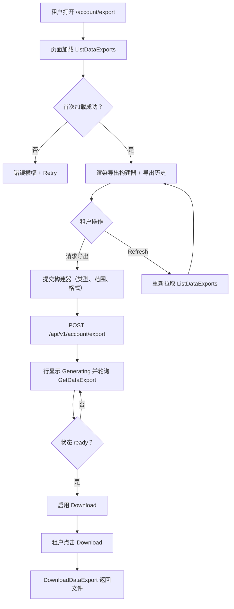
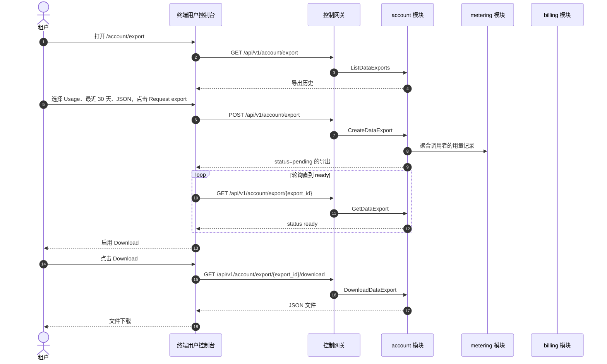

# 数据导出与隐私 — 需求分析与 UI/UX 设计

| 属性 | 内容 |
| --- | --- |
| 特性点 | 数据导出与隐私 — GDPR 式数据导出（用量、计费、请求日志）与账户数据以 JSON/CSV 下载（backlog 第 41 行） |
| 文档范围 | 需求分析、竞品调研、`/account/export` 终端用户面数据导出页、页面 → API 面映射表，以及编号验收标准 |
| 归属模块 | `account`（新增 — 拥有数据导出任务生命周期与账户数据包）、`metering`（只读：用量与请求日志导出）、`billing`（只读：计费导出）、`auth`（只读：账户资料导出）、`pkg/server` 网关（用户前缀绑定）、`web` 终端用户控制台（`UserShell` 中的 `DataExportPage`） |
| 相关文档 | [架构设计](./architecture.md) — 第 2.5 节 `metering`、第 2.6 节 `billing`、第 3.1 节（管理/用户面分离）· [计费报告与 CSV 导出](./billing-reports.md) — 姊妹 CSV 导出特性及其异步任务、Excel 友好 CSV 与租户作用域约定 · [审计日志与活动导出](./audit-logging.md) — 姊妹导出特性及其审计事件约定 · [控制台面分离](./console-surface-separation.md) — 本页面所在的终端用户面、`UserShell` 约定、掩码投影规则 |
| 状态 | 设计完成，已移交架构师代理 |

---

## 1. 背景与竞品调研

### 1.1 为什么现在做数据导出与隐私

go-taas 在计量与计费推理时记录租户的用量（`usage_records`）、计费（`bills`、`invoices`）与请求日志（`request_logs`）（特性 #4、#5、#8、#12、#14）。计费报告特性（第 25 行）让租户以 CSV 下载*计费报告*，但它是精选、带维度的报告 — 而非完整的数据可移植性导出。控制台仍无法做的是给租户一份**完整、机器可读的自身数据副本** — 其用量、计费与请求日志，加上账户资料 — 以可带走的结构化格式。依据 GDPR 第 20 条（数据可移植权），数据主体有权以结构化、常用、机器可读格式接收其个人数据。go-taas 必须向其租户提供此能力。

本特性新增**数据导出与隐私**页：GDPR 式数据导出（用量、计费、请求日志）与账户数据以 JSON/CSV 下载。这是 Phase 4 生产化路线图项中最小可独立交付的增量：它把「我想要我的数据」变成「请求导出我的用量、计费、请求日志与账户资料，并以 JSON 或 CSV 下载」。它是**只读**聚合与导出层 — 推理、计量或计费管线均无改动。

### 1.2 竞品如何实现数据导出与隐私

| 产品 | 数据导出面 | 数据类型 | 格式 | 主要陷阱 |
| --- | --- | --- | --- | --- |
| **Google Takeout** | 专用导出页 | 跨服务的账户数据 | 每服务 ZIP 的 JSON/CSV | 导出是大包；生成异步且可能耗时 |
| **GDPR 第 20 条** | 数据可移植权 | 提供给控制者的个人数据 | 结构化、常用、机器可读 | 该权利覆盖个人数据，未必覆盖每条运营记录 |
| **OpenAI Platform** | 账户设置数据导出 | 用量、账户数据 | CSV/JSON | 导出限于用量；无完整请求日志导出 |
| **Stripe** | 仪表盘数据导出 | 交易、发票、报告 | CSV | 导出面向报告，非完整数据可移植性包 |
| **Anthropic Console** | 账户数据导出 | 用量、账户数据 | CSV/JSON | 导出有限；无完整请求日志导出 |

### 1.3 提炼出的模式与决策

值得采纳的模式：

1. **专用导出页** — Google Takeout 与 OpenAI 都有专用导出面；go-taas 需要在账户设置下提供数据导出页。
2. **异步任务生成** — Google Takeout 异步生成导出（包可能耗时）；go-taas 复用 billing-reports 的异步任务模式（D2）。
3. **结构化、机器可读格式** — GDPR 第 20 条要求结构化、常用、机器可读格式；go-taas 导出 JSON（完整包）与 CSV（表格化用量/计费/请求日志数据）。
4. **租户作用域导出** — 导出必须只含调用者自身数据（特性 #17 的掩码投影规则）；绝不出现其他租户数据。

需要避免的陷阱：大范围的阻塞式同步导出（请求超时）— go-taas 异步生成导出；一次下载过大的完整包 — go-taas 提供按类型导出（用量 / 计费 / 请求日志 / 账户），让租户下载所需内容；以及暴露其他租户数据 — 导出硬作用域到调用者组织。

**go-taas 的决策**（依据自主决策规则记录理由）：

| # | 决策 | 依据 |
| --- | --- | --- |
| D1 | **数据导出仅存在于终端用户面**：路由 `/account/export`，API 前缀 `/api/v1/account/export/*`。**无管理面** — 数据导出是租户对自身数据的权利（GDPR 第 20 条）；运营者不从管理控制台导出租户数据 | 数据导出是租户对自身数据的自助权利；运营者的跨租户报告已由管理面的计费报告（第 25 行）覆盖。与仅终端用户面的快速开始（特性 #21）一致 |
| D2 | **导出作为任务异步生成。** `CreateDataExport` 返回 `status = pending` 的导出；导出变为 `ready`（带可下载文件）或 `failed`。控制台轮询 `GetDataExport` 直到 `ready`，然后启用下载 | 大范围聚合耗时；同步导出会阻塞或超时。基于任务的生成是通用模式（Google Takeout、billing-reports D2）且保持客户端响应 |
| D3 | **导出由类型与时间范围定义。** 类型为 `usage` / `billing` / `request_logs` / `account` 之一。`usage`、`billing` 与 `request_logs` 类型接受 `since`/`until` 范围（默认 `until = now`、`since = until − 30d`）；`account` 类型不接受范围（它是瞬时资料快照）。格式为 `json` 或 `csv`（CSV 仅用于表格化类型；`account` 始终为 JSON） | 按类型导出让租户下载所需内容（陷阱：完整包过大）；范围与格式遵循 billing-reports 约定 |
| D4 | **导出是租户作用域且掩码的。** 用户前缀的 `CreateDataExport` 只聚合调用者自身组织的用量、计费、请求日志与账户资料。它不接受 `organization_id` 过滤（调用者组织隐含）且绝不暴露其他租户数据 | 遵循特性 #17 的掩码投影规则：租户导出绝不泄漏其他租户数据。终端用户面是租户导出自身数据的唯一场所 |
| D5 | **JSON 包结构化且机器可读；CSV 对 Excel 友好。** JSON 导出是每类型的结构化对象（如 `{"usage": [...], "billing": [...], "request_logs": [...], "account": {...}}`）。CSV 导出为带 BOM 的 UTF-8、带引号字段与表头行（billing-reports D5 约定） | GDPR 第 20 条要求结构化、常用、机器可读格式；JSON 满足它。CSV 遵循 billing-reports 的 Excel 友好约定，使租户可在电子表格中打开 |
| D6 | **新增账户错误块（12501–12599）**：**12501 `CodeDataExportNotFound`**、**12502 `CodeDataExportTypeInvalid`**、**12503 `CodeDataExportFormatInvalid`**、**12504 `CodeDataExportNotReady`**。范围校验复用 **10404** | 数据导出是新模块（D2），因此其代码位于集群块（124xx）之后的新块；独立代码让每个失败模式可操作，而范围契约与 metering 保持统一 |
| D7 | **数据导出只读且对访问与生成审计。** 导出生成被审计（特性 #15）为 `data_export.created` / `data_export.downloaded`；底层用量/计费/请求日志写入已由计量/计费写入审计。无管线改动 | 该特性聚合既有数据且只写导出工件；审计轨迹（特性 #15）已覆盖底层写入，因此只需为新增导出操作新增审计事件 |

### 1.4 范围边界

**范围内**：数据导出页（`/account/export`），按类型导出（用量 / 计费 / 请求日志 / 账户）、时间范围与格式选择器、带下载的异步任务生命周期、以及导出历史。

**范围外**（由其他特性点跟踪）：计费报告与 CSV 导出（第 25 行 — 精选、带维度的报告构建器）、审计日志与活动导出（第 15 行）、账户删除或擦除（GDPR 第 17 条擦除权是独立未来特性）、以及管理面数据导出（刻意缺失，D1）。

---

## 2. 用户角色

| 角色 | 描述 | 与数据导出的交互 |
| --- | --- | --- |
| **租户开发者 / 智能体** | 针对 go-taas 推理 API 构建集成的消费者 | 打开 `/account/export`，请求导出其用量、计费、请求日志或账户资料，并以 JSON 或 CSV 下载 |
| **租户财务 / 容量规划者** | 对账用量与计费的租户 | 以 CSV 导出其计费与用量，供财务与对账使用 |
| **平台管理员** | 运行 go-taas 集群的运营者 | 从不使用数据导出页；通过管理控制台的运营页面管理平台 |

> 术语：消费侧调用方称为 **Agent**（英文）/「智能体」（中文），与仓库约定一致。本特性仅终端用户面，因此运营侧术语不适用于租户面。

---

## 3. 用户故事

| # | 作为… | 我想要… | 以便… |
| --- | --- | --- | --- |
| US1 | 租户开发者 | 以 JSON 或 CSV 导出我的用量 | 把用量数据带到另一平台（数据可移植性） |
| US2 | 租户财务 | 以 CSV 导出我的计费 | 对账发票并把数据交给财务 |
| US3 | 租户开发者 | 以 JSON 导出我的请求日志 | 审计我自己的请求 |
| US4 | 租户开发者 | 以 JSON 下载我的账户资料 | 拥有账户数据的副本 |
| US5 | 租户开发者 | 查看我的导出历史并重新下载过去的导出 | 无需重新生成即可取回导出 |
| US6 | 智能体 / SDK | 用 API Key 调用推理端点 | 获得补全结果，无需接触导出页 |

---

## 4. 功能需求

### FR1 — 创建数据导出

- **FR1.1** `CreateDataExport`（`POST /api/v1/account/export`）从定义创建导出：`type`（`usage` / `billing` / `request_logs` / `account`）、`since`/`until`（unix 秒；默认 `until = now`、`since = until − 30d`；不适用于 `account`）与 `format`（`json` / `csv`；`account` 始终为 `json`）。它返回 `status = pending` 的导出（D2、D3）。
- **FR1.2** 无效 `type` 返回 **12502 `CodeDataExportTypeInvalid`**；无效 `format` 返回 **12503 `CodeDataExportFormatInvalid`**；`since > until` 或范围 > 92 天返回 **10404**（D6）。
- **FR1.3** 导出是租户作用域的（D4）：它只聚合调用者自身组织的用量、计费、请求日志与账户资料。它不接受 `organization_id` 过滤。

### FR2 — 导出生命周期与下载

- **FR2.1** `GetDataExport`（`GET /api/v1/account/export/{export_id}`）返回导出的 `status`（`pending` / `ready` / `failed`）、`type`、`since`/`until`、`format`、`row_count` 与 `created_at`。未知 `export_id` 返回 **12501 `CodeDataExportNotFound`**。
- **FR2.2** `ListDataExports`（`GET /api/v1/account/export`）返回导出历史，最新在前，带点分页。每行携带 `export_id`、`type`、`since`/`until`、`format`、`status`、`row_count` 与 `created_at`。
- **FR2.3** `DownloadDataExport`（`GET /api/v1/account/export/{export_id}/download`）在 `status = ready` 时返回文件。`ready` 前下载返回 **12504 `CodeDataExportNotReady`**。响应为 `application/json` 或 `text/csv`，带 `Content-Disposition` 文件名如 `data-export-<export_id>.json` / `.csv`（D5）。

### FR3 — 导出内容

- **FR3.1** `usage` 导出包含调用者的用量记录：`bucket`、`api_key_id`、`api_key_name`、`model_id`、`model_name`、`request_count`、`input_tokens`、`output_tokens`、`total_tokens`、`cost`、`currency`。
- **FR3.2** `billing` 导出包含调用者的账单与发票：`bill_id`、`invoice_id`、`amount`、`currency`、`status`、`created_at`。
- **FR3.3** `request_logs` 导出包含调用者的请求日志：`request_id`、`api_key_id`、`model_id`、`latency_ms`、`status`、`error`、`input_tokens`、`output_tokens`、`created_at`。
- **FR3.4** `account` 导出包含调用者的账户资料：`user_id`、`email`、`organization_id`、`organization_name`、`created_at`。它始终为 JSON（D3）。

### FR4 — 面与 API 绑定

- **FR4.1** 数据导出页位于**终端用户面**：路由 `/account/export`，API 前缀 `/api/v1/account/export/*`。它作为「Data export」加入 `UserShell` 导航（特性 #17）。
- **FR4.2** 数据导出**无管理面**（D1）：运营者不从管理控制台导出租户数据。终端用户页仅调用 `/api/v1/account/export/*` 路由，且不含任何 `/api/v1/admin/*` 字符串（特性 #17，D1）。
- **FR4.3** 终端用户页绝不暴露其他租户数据（D4）。

---

## 5. 页面与流程设计

### 5.1 面分配

| 特性 | 面 | Web 路由 | API 前缀 |
| --- | --- | --- | --- |
| 创建数据导出 | end-user | `/account/export` | `/api/v1/account/export` |
| 导出历史 | end-user | `/account/export` | `/api/v1/account/export` |
| 导出详情 | end-user | `/account/export` | `/api/v1/account/export/{export_id}` |
| 下载导出 | end-user | `/account/export` | `/api/v1/account/export/{export_id}/download` |

以上每个页面与 API 调用都位于**终端用户面**；无管理面（D1）。终端用户页从不调用 `/api/v1/admin/*` 路由，全程使用用户会话域。

### 5.2 页面地图

| 页面 / 组件 | 用途 |
| --- | --- |
| **数据导出页**（`/account/export`） | 请求数据导出（类型、时间范围、格式）、监控其状态并下载文件 |

### 5.3 页面：`/account/export` — 数据导出（end-user）

**用途**：给租户一个单一面请求自身数据的 GDPR 式导出 — 用量、计费、请求日志或账户资料 — 以 JSON 或 CSV，并下载。

**面**：end-user — 路由 `/account/export`，API `/api/v1/account/export/*`。

**布局**：在 `UserShell`（特性 #17）内渲染。页头（「Data export」，副标题「Download a copy of your usage, billing, request logs, and account data」）带 **New export** 主要操作。其下：

1. **导出构建器** — 可折叠面板（历史为空时默认打开），字段：**类型**（单选：Usage / Billing / Request logs / Account）、**时间范围**（预设 24 小时 / 7 天 / 30 天 / 90 天 / 自定义，带日期时间选择器；Account 类型隐藏）、**格式**（单选：JSON / CSV；Account 类型禁用 CSV）。**Request export** 主要操作与 **Cancel** 次要操作。
2. **导出历史** — 表，列：**类型**、**范围**、**格式**、**状态**、**行数**、**创建时间**、**操作**。行操作：**Download**（`status = ready` 时启用）、**View**（打开详情抽屉）。表上方 **Refresh** 操作。

**交互状态**：

| 状态 | 行为 |
| --- | --- |
| 默认 | 导出构建器 + 导出历史从首次成功加载渲染 |
| 加载中 | 骨架表；New export 与 Refresh 禁用 |
| 空 | 「No exports yet.」并提示请求一个；构建器保持可见 |
| 错误 | 错误横幅含消息与 Retry 按钮；页面保留最后良好数据并显示「Showing stale data」横幅 |
| 禁用 | 请求进行中 Request export 禁用；`status != ready` 时 Download 禁用；导出生成中构建器字段禁用 |
| 权限拒绝 | 无所需角色的会话收到 10036，页面显示标准权限拒绝状态（特性 #17）并带返回用户首页的链接 |

**导出构建器字段**：类型（单选：Usage / Billing / Request logs / Account）、时间范围（预设 + 自定义；Account 隐藏）、格式（单选：JSON / CSV；Account 禁用 CSV）。校验：类型必填、格式必填、表格化类型时间范围必填。错误文案：「Select a type」、「Select a format」、「Select a time range」。

**导出历史表列**：类型、范围、格式、状态、行数、创建时间、操作。可按类型、状态、行数与创建时间排序。可按类型与状态过滤。分页（点分页）。

**请求导出流程**：提交构建器后行显示进度状态（「Generating…」）并轮询 `GetDataExport` 直到 `status = ready`，然后启用 **Download**。失败生成显示「Generation failed」带 **Retry** 操作。

### 5.4 流程

---

## 6. API 面影响

数据导出 RPC 属于 **`account` 模块**（D2），经控制网关以 HTTP 在**用户前缀** `/api/v1/account/export/*` 提供（D1）。metering 与 billing 模块提供只读用量/计费/请求日志数据（D4）。**无管理前缀绑定**（D1）。

| RPC | 路由 | 前缀 | 状态 | 用途 |
| --- | --- | --- | --- | --- |
| `CreateDataExport`（`taas.account.v1`） | `POST /api/v1/account/export` | user | **新增** | 创建数据导出任务（类型、范围、格式） |
| `ListDataExports`（`taas.account.v1`） | `GET /api/v1/account/export` | user | **新增** | 列出调用者的导出历史 |
| `GetDataExport`（`taas.account.v1`） | `GET /api/v1/account/export/{export_id}` | user | **新增** | 获取导出的状态与定义 |
| `DownloadDataExport`（`taas.account.v1`） | `GET /api/v1/account/export/{export_id}/download` | user | **新增** | 就绪时下载导出文件 |

**给架构师代理的契约说明**：

1. `CreateDataExport` 接受 `type`（`usage` / `billing` / `request_logs` / `account`）、`since`/`until`（int64 unix 秒；默认 `until = now`、`since = until − 30d`；不适用于 `account`）与 `format`（`json` / `csv`；`account` 始终为 `json`）。它返回 `status = pending` 的导出（D2、D3）。
2. `ListDataExports` 返回调用者的导出历史，最新在前，带点分页；`GetDataExport` 返回含 `row_count` 的完整记录（FR2.1、FR2.2）。
3. `DownloadDataExport` 在 `status = ready` 时返回文件；`ready` 前下载返回 12504（FR2.3）。
4. 导出是租户作用域的（D4）：它只聚合调用者自身组织的数据且绝不暴露其他租户数据。
5. JSON 包结构化且机器可读；CSV 为带 BOM 的 UTF-8、带引号字段与表头行（D5）。
6. 线上约定不变：成功返回 HTTP 200，业务错误为 `{"code": <int>, "message": "..."}`，int64 字段序列化为 JSON 字符串。

错误码（既有块，`pkg/errors/codes.go`）：

| 条件 | 代码 | 常量 | 说明 |
| --- | --- | --- | --- |
| 未知 `export_id` | 12501 | `CodeDataExportNotFound` | **新增**（D6） |
| 无效 `type` | 12502 | `CodeDataExportTypeInvalid` | **新增**（D6） |
| 无效 `format` | 12503 | `CodeDataExportFormatInvalid` | **新增**（D6） |
| `ready` 前下载 | 12504 | `CodeDataExportNotReady` | **新增**（D6） |
| 无效范围（`since > until` 或 > 92 天） | 10404 | `CodeMeteringRangeInvalid` | 复用 — 计量范围契约（D6） |

---

## 7. 验收标准

| # | 标准 | 级别 |
| --- | --- | --- |
| AC1 | `CreateDataExport` 返回 `status = pending` 的导出；无效 `type` 返回 12502，无效 `format` 返回 12503，无效范围返回 10404 | FVT |
| AC2 | `ListDataExports` 最新在前返回调用者的导出历史；`GetDataExport` 返回完整记录；未知 `export_id` 返回 12501 | FVT |
| AC3 | `DownloadDataExport` 在 `status = ready` 时返回文件；`ready` 前下载返回 12504 | FVT |
| AC4 | 导出是租户作用域的：它只聚合调用者自身组织的数据且绝不暴露其他租户数据 | FVT |
| AC5 | `/account/export` 页从首次成功加载渲染导出构建器与导出历史，带 New export 操作 | E2E |
| AC6 | 导出构建器校验类型、格式与时间范围，并创建以 `status = pending` 出现的导出，然后轮询到 `ready` 并启用 Download | E2E |
| AC7 | 数据导出页仅终端用户面可达：路由 `/account/export`，每个 API 调用使用 `/api/v1/account/export/*` 前缀且不含 `/api/v1/admin/*` 字符串 | E2E（面分离） |
| AC8 | 无所需角色的会话在 `/account/export` 页收到 10036，页面显示标准权限拒绝状态 | E2E |

---

## 8. 范围外（在其他处跟踪）

| 项 | 位置 |
| --- | --- |
| 计费报告与 CSV 导出（精选、带维度的报告构建器） | 特性 #25 计费报告 |
| 审计日志与活动导出 | 特性 #15 审计日志 |
| 账户删除或擦除（GDPR 第 17 条） | 未来特性 — 擦除权与数据可移植性分离 |
| 管理面数据导出 | 刻意缺失（D1）— 数据导出是租户对自身数据的权利 |