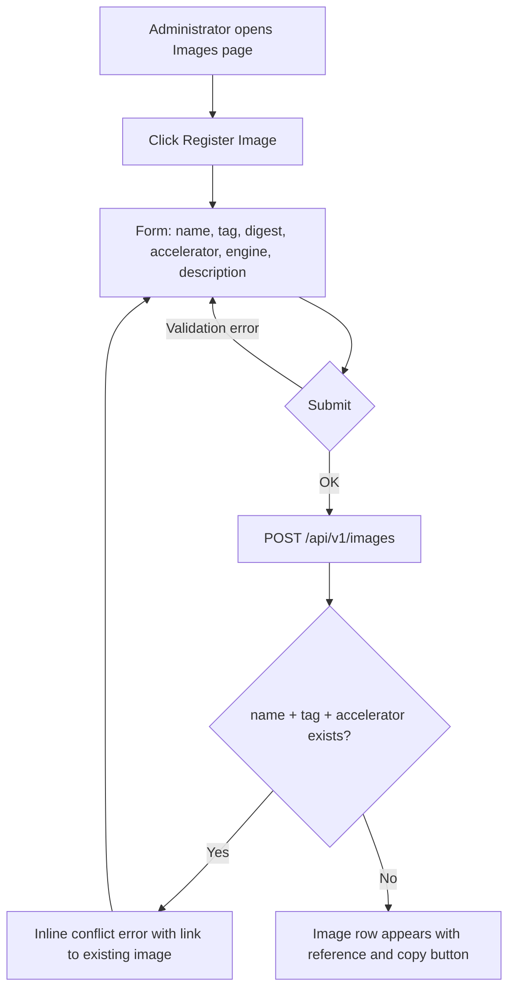
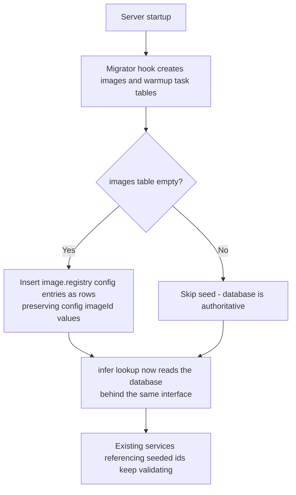
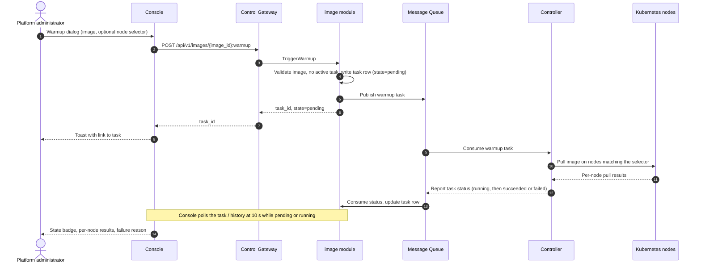
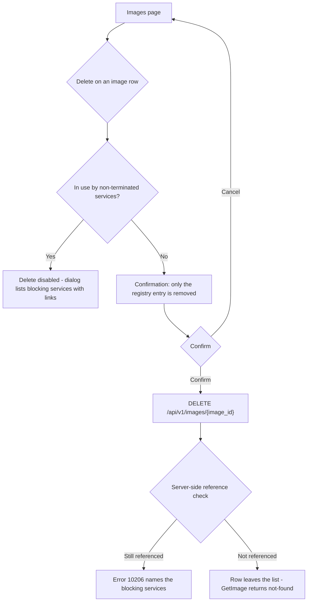

# Inference Image Management — Requirement Analysis and UI/UX Design

| Attribute | Content |
| --- | --- |
| Feature point | Inference image management (register / version / pre-pull mapping) |
| Document scope | Requirement analysis and UI/UX design for the inference engine image management capability of the `image` module: console pages, user flows, API surface, migration from the config-driven registry to the DB-backed registry, and acceptance criteria |
| Owning modules | `image` (registry CRUD and warmup tasks), with `infer` (deploy-form image consumption and validation) and `controller` (pre-pull execution) |
| Related documents | [Architecture Design](./architecture.md) — Section 2.3 `image`, Section 2.7 Controller, Section 4.2 the one-click deployment flow · [Model Catalog & One-Click Deployment](./model-catalog-deployment.md) — deploy-form image dropdown (D4) and the transitional config-driven registry |
| Status | Design complete, handed to the Architect agent |

---

## 1. Background and Competitive Research

### 1.1 Why Image Management Comes Now

Feature #2 shipped one-click deployment on top of a transitional, config-driven image registry: three seeded entries (vLLM on NVIDIA, vLLM on Iluvatar CoreX, SGLang on MetaX) in `configs/config.yaml`, a read-only `ListImages`, and a `RegisterImage` RPC that answers "not implemented (feature #3)". Every deployment pins an `image_id`, the deploy form filters the image dropdown by accelerator, and the `infer` module validates image existence and accelerator compatibility against the in-memory registry. That was enough to prove the deployment flow — but it means every engine upgrade is a config edit plus a process restart, `TriggerWarmup` is a stub, and nobody can see whether compute nodes actually hold the images. This feature point replaces the transitional registry with a real, DB-backed image catalog with full CRUD, and implements pre-pull (warmup) so that cold stops costing minutes.

### 1.2 How Comparable Products Manage Inference Images

| Product | Image catalog UX | Versioning | Pre-pull / cold-start handling | Notable pitfalls |
| --- | --- | --- | --- | --- |
| **SiliconFlow** | Deployment templates hide the image entirely — the platform curates engine builds per chip type, users never see a reference | Platform-managed and invisible to users | Platform-side and invisible | No bring-your-own-engine path; when a template is stale, users are stuck until the platform updates it |
| **Hugging Face Inference Endpoints** | Custom container support (enterprise): an image reference is entered per endpoint, from the Hub or a private registry | Whatever tag the user types, per endpoint | None visible | No central catalog — the same reference is retyped per endpoint, and typos surface only at deploy time |
| **RunPod** | Templates wrap a Docker image from any registry (Docker Hub, GHCR, ECR) plus config; custom templates are first-class; private-registry credentials supported | Template name + image tag | Container disk starts empty; cold starts are mitigated by network volumes rather than pre-pull | No accelerator-compatibility guard — a CUDA-only image can be picked for the wrong GPU and fails at runtime; unconstrained custom templates sprawl |
| **Azure AI Foundry / AzureML** | Curated pre-built inference containers plus custom images from Azure Container Registry, with credentials configured at the workspace level | Image tag; deployments pin the reference | Managed compute pulls at deploy time; no user-visible warmup | Image–compute pairing is validated late in the wizard; ACR authentication is a separate flow that bites at deploy time |
| **SageMaker** | Pre-built inference containers plus bring-your-own from ECR with VPC access, under a strict container contract (`serve`, `/ping`, `/invocations`) | ECR tags | Warm pools keep instances booted between requests — the closest managed analogue to pre-pull | Deep container contract; ECR-plus-VPC networking complexity; warm pools are billed |
| **Modal** | Images defined in code (base image + dependencies), built and versioned by the platform | Platform-assigned image IDs | Automatic worker caching — images are pre-staged on workers without user action | Code-defined images do not map to a console catalog; the model fits a developer platform, not an operations console |
| **BentoML / BentoCloud** | The bento (model + code + environment) is the managed unit; images are built from bentos and pushed to a registry | Bento version; the image is derived | None user-visible | The image is a build artifact, not a selectable catalog entry — an existing image cannot be registered |

### 1.3 Distilled Patterns and Decisions

Common industry patterns worth adopting:

1. **A curated, central image catalog** — RunPod templates, SageMaker pre-built containers, and SiliconFlow templates all let users pick from a list the platform curates, instead of typing references. Central registration eliminates retyped-reference typos (the Hugging Face pitfall) and gives one place to see what the fleet runs.
2. **The tag is the version** — every surveyed product versions images by tag; none invents a parallel version entity. Digests optionally pin integrity on top of the tag.
3. **Compatibility must be guarded at selection time** — Azure and SageMaker validate the container–compute pairing; RunPod's missing guard is its documented pitfall. go-taas already filters the deploy dropdown by accelerator (feature #2, D4); the catalog must carry the compatibility axis as data so the filter survives the move to the database.
4. **Pre-pull is an operations action with visible status** — SageMaker warm pools and Modal's automatic caching exist because multi-GB engine images make cold starts expensive. Where the action is exposed, the platform shows its status; go-taas's warmup tasks follow the same shape.
5. **Private registry credentials are platform-level configuration** — RunPod, Azure (ACR), and SageMaker (ECR) configure registry authentication once at the platform or workspace level, never per deployment.

Pitfalls to avoid:

- **Retyped references without a catalog** (Hugging Face) — typos and drift surface at deploy time, when they are most expensive.
- **No compatibility guard** (RunPod) — a wrong image on a wrong accelerator is discovered at runtime, not at selection.
- **Unpulled images** — the first deployment on a node pays the full multi-GB pull; users perceive the platform as slow when it is merely cold. Warmup must exist and its progress must be visible.
- **Deleting an image that live services still need** — scaling up an existing service re-pulls its image; deleting a catalog entry that non-terminated services reference must be guarded, not just the initial deploy.
- **Config-edit-plus-restart as the management path** (go-taas today) — workable for three seeded entries, unworkable for a real fleet.

**Decisions for go-taas** (recorded rationale, per the autonomous-decision rule):

| # | Decision | Rationale |
| --- | --- | --- |
| D1 | The `images` database table replaces the in-memory, config-seeded registry as the single source of truth; the `image.Lookup` interface consumed by `infer` keeps its signature, backed by the database | Persistence survives restarts, enables CRUD and warmup task history; the stable interface means the `infer` module does not change (the transitional registry was explicitly designed to be swapped in feature #3) |
| D2 | Migration is **first-boot seed from config**: on startup, if the `images` table is empty, the `image.registry` config entries are inserted as rows preserving their config `imageId` values (e.g. `img-vllm-nvidia-v063`); the seed is insert-only and never re-runs on a non-empty table | Zero-breakage upgrade — existing inference services and e2e flows reference the seeded ids and keep validating; insert-only means administrator edits and deletions always win over config; first-boot-only means a deleted seeded image does not resurrect on restart |
| D3 | Image identity is the unique triple `(name, tag, accelerator)`; versioning is tag-based and there is no separate version entity | Container tags are the industry's versioning unit; a parallel version table (as models have) would duplicate what the reference already carries |
| D4 | `image_id` is opaque: config-seeded rows keep their config id, new registrations get a server-generated UUID v4 | Upgrade compatibility plus consistency with how `model_id` and `service_id` are minted |
| D5 | The compatibility axis for this feature is the **accelerator** (`nvidia` / `iluvatar` / `metax`), carried as a field on every image and used to filter the deploy form's dropdown (unchanged from feature #2, now persistent); card-type-level and model-format-level matrix cells are deferred | Matches the existing proto (`RegisterImageRequest.accelerator`), the `infer` validation, and the deploy form; the finer matrix needs a card-type inventory that does not exist yet |
| D6 | `UpdateImage` edits **description only**; name, tag, accelerator, engine, and digest are immutable — a change means registering a new image | Identity and compatibility fields are contracts consumed by `infer` validation and pinned by existing services; mutating them would silently change what a running deployment means |
| D7 | `DeleteImage` is guarded: blocked while any non-terminated inference service references the image, with the error naming the blocking services; terminated services may keep dangling references for audit. The check is application-level — no hard foreign key | Mirrors the model delete guard (feature #2, AC3); a hard FK would either block legitimate deletion or require destroying audit history, because terminated services legitimately outlive their images |
| D8 | Warmup (pre-pull) is an **asynchronous task**: `TriggerWarmup` returns a `task_id` with `state=pending` immediately; the Controller executes per-node pulls and reports status back through the message queue; task states are the closed set `pending`, `running`, `succeeded`, `failed`; at most one active (pending or running) task per image — re-triggering while active is rejected | Mirrors the deployment async pattern (multi-GB pulls must not block HTTP); the single-active-task rule prevents accidental double submission |
| D9 | Images are **platform-global**, not organization-scoped: image APIs require no organization header, and every organization's deploy form sees the same catalog | Engine images are shared cluster infrastructure; per-tenant image authorization is feature #6 territory |
| D10 | A new error code **10206 `CodeImageInUse`** is allocated for the delete guard, instead of overloading `CodeImageNotFound` the way the model guard overloads 10101 | "Not found" (a typo in an id) and "in use" (actionable: shows blocking services) need distinct handling in the console and by API consumers; the model guard may be aligned to a dedicated code in a later platform-wide cleanup |
| D11 | A new error code **10207 `CodeImageReferenceInvalid`** is allocated for malformed name/tag at registration | Mirrors the model feature's dedicated syntax code (10104 `CodeModelPathInvalid`); overloading 10203 (digest) or 10204 (accelerator) for a different field would confuse API consumers |

### 1.4 Scope Boundary

**In scope**: image registration (name, tag, digest, accelerator, engine, description), listing with accelerator/engine filters and search, image detail with in-use services, description-only edit, reference-checked delete, warmup (pre-pull) trigger with node selector and task status visibility, deploy-form integration with the DB-backed catalog, and the first-boot migration from the config-driven registry.

**Out of scope** (tracked elsewhere): card-type-level and model-format-level compatibility matrix cells (future, needs card-type inventory), private registry credential management and `imagePullSecrets` (future platform-operations feature; nodes use their configured registry auth today), node-level cache inventory beyond warmup task results (future, needs a node inventory), automatic warmup on registration (future policy), image signature and provenance verification beyond digest syntax (future), per-tenant image authorization (#6), and per-image pricing (#5 does not price images).

---

## 2. User Roles

| Role | Description | Interaction with image management |
| --- | --- | --- |
| **Platform administrator** | The operator who runs the go-taas cluster and curates the engine fleet; today this is also the deploying user | Registers, edits, and deletes images; triggers warmup and monitors task status; sees the same filtered dropdown when deploying |
| **Organization administrator (future)** | A tenant-side administrator consuming the platform | Sees the image dropdown filtered by accelerator in the deploy form; cannot register, edit, or delete images (D9) |
| **Agent / SDK** | The programmatic consumer that calls `/v1/chat/completions` | Unaffected — never touches image APIs; benefits from warmup through faster cold starts |

> Terminology: the consumer-side caller is called an **Agent** (English) / 「智能体」(Chinese), consistent with the repo convention.

---

## 3. User Stories

| # | As a… | I want to… | So that… |
| --- | --- | --- | --- |
| US1 | Platform administrator | register an engine image with its name, tag, accelerator, engine, and a description | it appears in the deploy form's dropdown for that accelerator without a restart |
| US2 | Platform administrator | browse all images filtered by accelerator and engine, and search by name | I can spot coverage gaps (an accelerator with no image) at a glance |
| US3 | Platform administrator | edit an image's description to record build notes and caveats | operators deploying later see the context without leaving the console |
| US4 | Platform administrator | trigger a warmup (pre-pull) for an image, optionally restricted to selected nodes | deployments on those nodes stop paying the multi-GB pull on first start |
| US5 | Platform administrator | watch warmup tasks go through pending / running / succeeded and see per-node outcomes and failure reasons | I know when nodes are actually warm and what to fix when they are not |
| US6 | Platform administrator | delete an image that is no longer used, and be blocked with actionable information while live services still reference it | the catalog stays clean without breaking scale-up of running services |
| US7 | Platform administrator | get a clear conflict when registering a duplicate name + tag + accelerator | I do not create accidental duplicates of the same engine build |
| US8 | Platform administrator | register a new engine version as a new tag and warm it, while old services keep running their pinned image | engine upgrades are incremental and reversible |
| US9 | Deploying user | see only images compatible with the accelerator I selected in the deploy form | wrong image–accelerator combinations are impossible to submit |
| US10 | Operator upgrading from feature #2 | find the config-seeded images present with the same ids after the upgrade | existing services and automation keep working with zero migration steps |

---

## 4. Functional Requirements

### FR1 — Register Image

- **FR1.1** The console provides a "Register Image" action on the Images page, opening a form with: **Name** (required, the image reference without tag, e.g. `ghcr.io/go-taas/vllm`, 1–255 chars, lowercase), **Tag** (required, 1–128 chars, e.g. `v0.6.3`), **Digest** (optional, `sha256:` followed by 64 hex chars), **Accelerator** (select: nvidia / iluvatar / metax), **Engine** (required, e.g. `vllm`, `sglang`, `tensorrt-llm`), **Description** (optional, ≤ 1024 chars).
- **FR1.2** Registering a `(name, tag, accelerator)` triple that already exists returns a clear conflict error inline, with a link to the existing image.
- **FR1.3** The digest is validated syntactically at submit; an unsupported accelerator is rejected at submit. Neither reaches the API.
- **FR1.4** The success state shows the full reference `name:tag` with a copy button, and the new image appears in the list immediately.

### FR2 — List and browse images

- **FR2.1** The Images page lists registered images in a table: **Image** (`name:tag`), **Accelerator** (badge), **Engine**, **Description** (truncated), **In use** (count badge), **Last warmup** (state badge + relative time), **Created**, and actions **Warmup**, **Edit**, **Delete**.
- **FR2.2** The list is filterable by accelerator and engine (server-side, existing `ListImages` parameters), searchable by name (client-side over the loaded page in v1 — the catalog is small), and paginated (`offset`/`limit`, default 20, max 100).
- **FR2.3** The empty state reads "No images registered — deployment needs at least one image per accelerator" with a Register Image button. A coverage hint banner lists any supported accelerator that has zero registered images.

### FR3 — Image detail

- **FR3.1** The image detail page shows a metadata card — full reference with copy, digest (or "not pinned"), accelerator, engine, description, created and updated times.
- **FR3.2** An "In use" section lists the non-terminated inference services referencing the image (name, state badge, link to the service detail page). Terminated references are not listed.
- **FR3.3** A "Warmup" section shows the trigger action and the task history (FR6).

### FR4 — Edit Image

- **FR4.1** The Edit dialog shows all fields, but only **Description** is editable; name, tag, digest, accelerator, and engine are read-only with the hint "Register a new image to change these" (D6).
- **FR4.2** Saving persists immediately; the list and detail pages reflect the new description without a restart.

### FR5 — Delete Image

- **FR5.1** The Delete action opens a confirmation dialog naming the image and stating that only the registry entry is removed — images already cached on nodes are not deleted.
- **FR5.2** While any non-terminated inference service references the image, Delete is disabled and the dialog lists the blocking services with links (mirroring the model delete guard, feature #2 FR1.4).
- **FR5.3** After confirmation the image leaves the list; a subsequent `GetImage` returns not-found. Deleting an image referenced only by terminated services succeeds.

### FR6 — Warmup (pre-pull) and status visibility

- **FR6.1** The Warmup action (on the list row and the detail page) opens a dialog with the image pre-selected and an optional **node selector** (key/value pairs, advanced); submit creates a task and shows a toast linking to it.
- **FR6.2** Task states are the closed set `pending` (grey), `running` (blue), `succeeded` (green), `failed` (red).
- **FR6.3** The warmup history lists tasks with state, node summary (e.g. "3 nodes succeeded, 1 failed"), started and finished times, and the failure reason when failed; a task row expands to per-node results.
- **FR6.4** The Images list shows the last warmup state per image; while a task is pending or running, the Warmup action is disabled (one active task per image, D8).
- **FR6.5** The history refreshes on a 10-second poll while any task is pending or running, and on manual refresh otherwise.

### FR7 — Deploy-form integration

- **FR7.1** The deploy form's image dropdown is sourced from the DB-backed `ListImages`, filtered by the chosen accelerator — behavior unchanged from feature #2, now persistent and immediately consistent with registrations.
- **FR7.2** Registering an image for an accelerator makes it appear in that accelerator's dropdown without a server restart.
- **FR7.3** The "no image available for this accelerator" hint (feature #2, FR3.2) links to the Images page.

### FR8 — Migration from the config-driven registry

- **FR8.1** On startup, after the `images` table is created, if the table is empty the `image.registry` config entries are inserted as rows, preserving their config `imageId` values (D2).
- **FR8.2** The seed is insert-only and first-boot-only: existing rows are never overwritten, and a non-empty table is never re-seeded — deletions stick.
- **FR8.3** After the first boot the database is authoritative; the `image.registry` config section is documented as a deprecated bootstrap default for fresh installs.
- **FR8.4** The `infer` module's image lookup switches to the DB-backed registry behind the same interface; existing inference services referencing seeded ids (e.g. `img-vllm-nvidia-v063`) keep validating, and the accelerator-compatibility check (10204) behaves identically.

---

## 5. Page and Flow Design

### 5.1 Page Map

| Page / component | Purpose |
| --- | --- |
| **Images page** (`/images`) | The image catalog: filters, search, pagination, register action, per-row warmup / edit / delete |
| **Register Image dialog** | Name, tag, digest, accelerator, engine, description |
| **Image detail page** (`/images/{image_id}`) | Metadata, in-use services, warmup history and trigger |
| **Edit Image dialog** | Description-only edit (identity fields read-only) |
| **Delete Image dialog** | Reference-checked confirmation |
| **Warmup dialog** | Node selector, task creation |
| **Deploy dialog** (existing, feature #2) | Image dropdown now DB-backed, still filtered by accelerator |

### 5.2 Register Image Flow

### 5.3 First-Boot Migration Flow (config-driven to DB-backed)

### 5.4 Warmup Sequence (trigger, pre-pull, status report)

### 5.5 Delete Guard Flow

---

## 6. API Surface Implications

All APIs belong to **`taas.image.v1.ImageService`** (proto: `proto/taas/image/v1/image.proto`), served as HTTP via the Control Gateway (`grpc-gateway`). Three RPCs already exist and are implemented by this feature; five are added. Proto changes are additive only.

| RPC | HTTP | Status | Purpose | Notes |
| --- | --- | --- | --- | --- |
| `RegisterImage` | `POST /api/v1/images` | exists, now implemented | Register an image | Request gains `description` (field 6); returns `image_id` |
| `ListImages` | `GET /api/v1/images` | exists, now DB-backed | Catalog list with filters | `accelerator` / `engine` filters (existing); `ImageSummary` gains `description`, `in_use_count`, `last_warmup_state`, `last_warmup_at` |
| `GetImage` | `GET /api/v1/images/{image_id}` | **new** | Detail with in-use services | Response carries the image plus `in_use_services` (service_id, name, state) |
| `UpdateImage` | `PATCH /api/v1/images/{image_id}` | **new** | Description-only edit | Request carries `image_id` + `description` only (D6) |
| `DeleteImage` | `DELETE /api/v1/images/{image_id}` | **new** | Remove a catalog entry | Reference-checked against non-terminated inference services |
| `TriggerWarmup` | `POST /api/v1/images/{image_id}:warmup` | exists, now implemented | Enqueue a pre-pull task | Returns `task_id` with `state=pending` immediately; `node_selector` optional |
| `ListWarmupTasks` | `GET /api/v1/images/{image_id}/warmup-tasks` | **new** | Warmup history per image | Paginated, newest first |
| `GetWarmupTask` | `GET /api/v1/warmup-tasks/{task_id}` | **new** | Task detail with per-node results | Flat path — task ids are globally unique and the console may open a task without image context |

Constraints on the contract:

1. `RegisterImage` validates: `name` is a reference without tag (no `:`), `tag` non-empty, `accelerator` in {nvidia, iluvatar, metax}, `engine` non-empty, `digest` either empty or `sha256:` + 64 hex chars. A malformed name or tag returns 10207; a malformed digest returns 10203; an unsupported accelerator returns 10204. Duplicate `(name, tag, accelerator)` returns 10202.
2. `ImageSummary` must carry `accelerator` and `engine` so the deploy form can filter without extra calls (feature #2, D4), plus the new `description`, `in_use_count`, `last_warmup_state`, `last_warmup_at` fields that drive the list page.
3. `UpdateImage` accepts only `description`; identity and compatibility fields are not present in the request, making immutability structural (D6).
4. `DeleteImage` on an image referenced by a non-terminated inference service returns 10206 naming the blocking services; deleting an unreferenced image succeeds; a missing `image_id` returns 10201.
5. `TriggerWarmup` returns immediately (latency bound < 2 s, mirroring `CreateInferenceService`); an unknown image returns 10201; a trigger while an active task exists for the image returns 10205.
6. Warmup task states are exactly `pending`, `running`, `succeeded`, `failed` — a closed set the console's badges rely on; per-node results and failure reasons arrive through the status report, not the trigger response.
7. Image APIs are platform-scoped: no `X-Organization-Id` header is required or honored (D9). The deploy form (organization-scoped) consumes the same global catalog.
8. Wire-format conventions are unchanged: dotted pagination (`?page.offset=0&page.limit=20`, default 20, cap 100), HTTP 200 on success, business errors as `{"code": <int>, "message": "..."}`.

Cross-module note: `in_use_count` and the delete-guard check require counting non-terminated inference services by `image_id`. Following the established narrow-interface pattern (`model.FindVersion` consumed by `infer`), `infer` exposes a count/lookup consumed by `image` in-process. The detailed interface is the Architect's call.

Error codes (image range 10201–10299, `pkg/errors/codes.go`):

| Condition | Code | Constant | Notes |
| --- | --- | --- | --- |
| Unknown `image_id` (get / update / delete / warmup / deploy validation) | 10201 | `CodeImageNotFound` | Existing |
| Duplicate `(name, tag, accelerator)` on register | 10202 | `CodeImageExists` | Existing |
| Malformed digest (`sha256:` + 64 hex expected) | 10203 | `CodeImageDigestInvalid` | Existing |
| Unsupported accelerator at registration | 10204 | `CodeImageIncompatible` | Existing constant, new use at registration; `infer`'s deploy-time mismatch use is unchanged |
| Warmup trigger while an active task exists for the image | 10205 | `CodeImageWarmupFailed` | Existing; asynchronous pull failures surface as task `state=failed` + reason, not as RPC errors |
| Delete blocked by non-terminated service references | 10206 | `CodeImageInUse` | **New** (D10); detail names the blocking services |
| Malformed name or tag at registration | 10207 | `CodeImageReferenceInvalid` | **New** (D11); mirrors 10104 `CodeModelPathInvalid` |
| Database / MQ infrastructure failure | 500 | `CodeInternal` | Via error normalization |

---

## 7. Acceptance Criteria

| # | Criterion | Verification |
| --- | --- | --- |
| AC1 | `RegisterImage` with a new `(name, tag, accelerator)` succeeds and the image appears in `ListImages` with the correct reference, accelerator, engine, and description; registering the same triple again returns 10202 | FVT |
| AC2 | `RegisterImage` rejects a name containing a tag separator (10207), an unsupported accelerator (10204), and a malformed digest (10203), and nothing is written | Unit test + FVT |
| AC3 | First-boot seed: with an empty database, startup inserts the `image.registry` config entries as rows preserving their `imageId` values, and `ListImages` returns them; a `CreateInferenceService` request referencing a seeded id (e.g. `img-vllm-nvidia-v063`) still passes image validation | FVT |
| AC4 | Seed is first-boot-only: after deleting a seeded image through the API and restarting, the image remains absent (config does not resurrect it), and administrator-edited rows are never overwritten by the seed | FVT |
| AC5 | `GetImage` returns the image's metadata (reference, digest, accelerator, engine, description, timestamps) and the list of non-terminated services referencing it; a missing id returns 10201 | FVT |
| AC6 | `UpdateImage` changes the description and `GetImage` reflects it; the request carries no identity or compatibility fields (structural immutability, D6) | FVT + contract review |
| AC7 | `DeleteImage` on an unreferenced image succeeds and the image leaves `ListImages`; deleting an image referenced only by terminated services succeeds | FVT |
| AC8 | `DeleteImage` on an image referenced by a non-terminated inference service returns 10206 naming the blocking service; after that service is deleted, the same call succeeds | FVT |
| AC9 | `TriggerWarmup` returns a `task_id` immediately (latency bound < 2 s) with the task in `pending`; an unknown image returns 10201; a second trigger while the first task is pending or running returns 10205 | FVT |
| AC10 | A warmup task transitions `pending → running → succeeded`; `ListWarmupTasks` returns the history newest-first and `GetWarmupTask` returns per-node results | FVT (controller harness) |
| AC11 | A warmup that cannot converge (e.g. unreachable registry) reaches `failed` with a human-readable reason visible in the task detail | FVT (fault injection) |
| AC12 | The deploy form's image dropdown lists DB-registered images filtered by the selected accelerator, and a newly registered matching image appears in the dropdown without a server restart | E2E |
| AC13 | The Images page renders filters (accelerator, engine), name search, pagination, the empty state with register CTA, the coverage hint for accelerators with zero images, and the in-use badge; Delete is disabled with blocking services listed while `in_use_count` > 0 | E2E |
| AC14 | Image APIs succeed without an `X-Organization-Id` header (platform-scoped, D9), while deploy APIs continue to require it | FVT |
| AC15 | The warmup history polls at 10-second intervals while any task is pending or running and stops when all tasks are settled; task state badges cover exactly the four states with distinct colors | Manual / E2E |

---

## 8. Open Items Deferred

| Item | Deferred to |
| --- | --- |
| Card-type-level and model-format-level compatibility matrix cells (architecture Section 2.3's full matrix) | Future feature point (needs card-type inventory) |
| Private registry credential management (`imagePullSecrets`) | Future platform-operations feature |
| Node-level cache inventory (which node holds which image, beyond task results) | Future (needs node inventory) |
| Automatic warmup on registration (policy: pre-pull every new image) | Future policy enhancement; v1 is manual trigger |
| Image signature / provenance verification (e.g. cosign) beyond digest syntax | Future (architecture Section 2.3 mentions provenance) |
| Aligning the model delete-guard error code with a dedicated `InUse` code (mirroring 10206) | Platform-wide error-code cleanup |
| Per-tenant image authorization (which tenants may deploy which images) | Feature #6 multi-tenancy |
