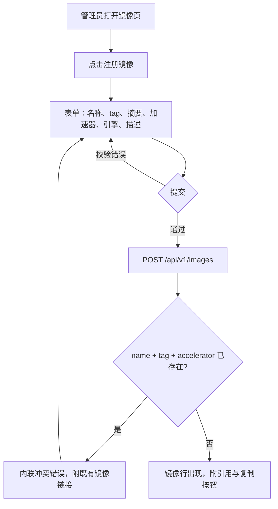
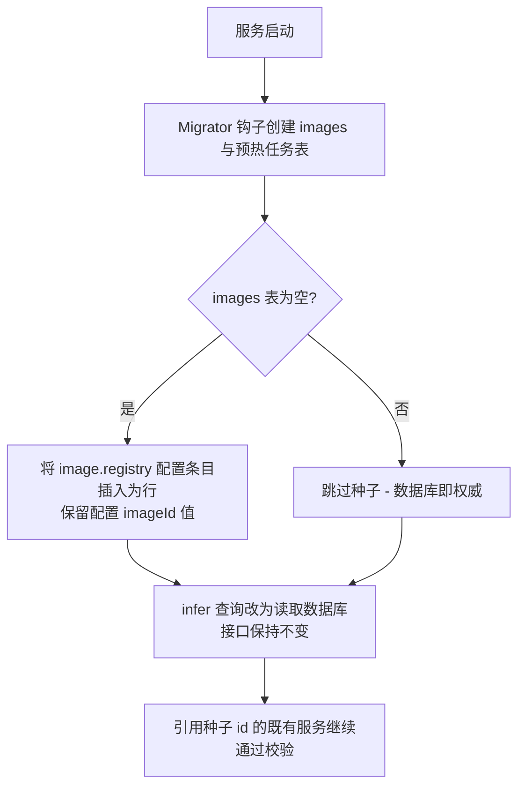
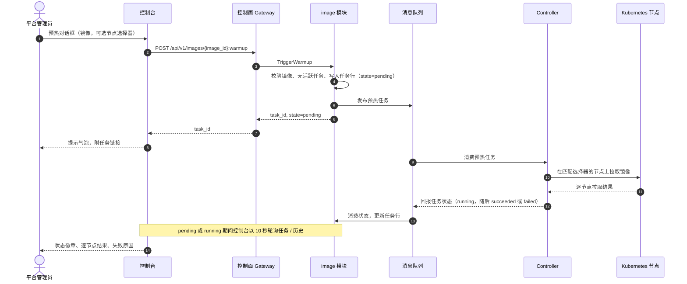
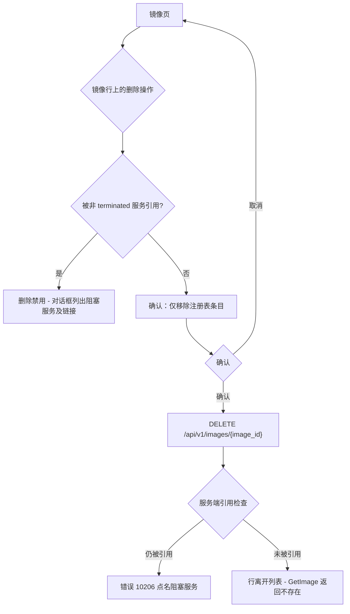

# 推理镜像管理 —— 需求分析与 UI/UX 设计

| 属性 | 内容 |
| --- | --- |
| 特性点 | 推理镜像管理（注册 / 版本 / 预拉取映射） |
| 文档范围 | `image` 模块推理引擎镜像管理能力的需求分析与 UI/UX 设计：控制台页面、用户流程、API 面、从配置驱动注册表到数据库注册表的迁移，以及验收标准 |
| 归属模块 | `image`（注册表 CRUD 与预热任务），以及 `infer`（部署表单的镜像消费与校验）和 `controller`（预拉取执行） |
| 相关文档 | [架构设计](./architecture.zh-cn.md) —— 第 2.3 节 `image`、第 2.7 节 Controller、第 4.2 节一键部署流程 · [模型目录与一键部署](./model-catalog-deployment.zh-cn.md) —— 部署表单镜像下拉（D4）与过渡期配置驱动注册表 |
| 状态 | 设计完成，已移交 Architect agent |

---

## 1. 背景与竞品调研

### 1.1 为什么现在做镜像管理

特性点 #2 的一键部署建立在过渡期的配置驱动镜像注册表之上：`configs/config.yaml` 中三个种子条目（NVIDIA 上的 vLLM、天数智芯 CoreX 上的 vLLM、MetaX 上的 SGLang）、只读的 `ListImages`，以及一个回答「未实现（特性点 #3）」的 `RegisterImage` RPC。每次部署都钉住一个 `image_id`，部署表单按加速器过滤镜像下拉，`infer` 模块依据内存注册表校验镜像存在性与加速器兼容性。这足以验证部署流程 —— 但也意味着每次引擎升级都要改配置并重启进程，`TriggerWarmup` 是个桩，而且没人能看到计算节点上是否真的持有镜像。本特性点用真正的、数据库承载的镜像目录（完整 CRUD）替换过渡注册表，并实现预拉取（预热），让冷启动不再以分钟计。

### 1.2 竞品如何管理推理镜像

| 产品 | 镜像目录交互 | 版本管理 | 预拉取 / 冷启动处理 | 值得注意的坑 |
| --- | --- | --- | --- | --- |
| **SiliconFlow** | 部署模板完全隐藏镜像 —— 平台按芯片类型策展引擎构建，用户看不到镜像引用 | 平台管理，用户不可见 | 平台侧处理，用户不可见 | 没有自带引擎路径；模板过旧时用户只能等平台更新 |
| **Hugging Face Inference Endpoints** | 自定义容器支持（企业版）：每个端点填写一个镜像引用，可来自 Hub 或私有仓库 | 用户输入什么 tag 就是什么，逐端点各自为政 | 无可见机制 | 没有中央目录 —— 同一引用要在每个端点重复输入，拼写错误到部署时才暴露 |
| **RunPod** | 模板包装来自任意仓库（Docker Hub、GHCR、ECR）的 Docker 镜像加配置；自定义模板是一等公民；支持私有仓库凭证 | 模板名 + 镜像 tag | 容器盘初始为空；冷启动靠网络卷缓解而非预拉取 | 没有加速器兼容性防护 —— CUDA-only 镜像可以选给错误的 GPU，到运行时才失败；不受约束的自定义模板泛滥 |
| **Azure AI Foundry / AzureML** | 策展的预构建推理容器，加上来自 Azure Container Registry 的自定义镜像，凭证在工作区级配置 | 镜像 tag；部署钉住引用 | 托管算力在部署时拉取；无用户可见的预热 | 镜像与算力的配对在向导后期才校验；ACR 认证是独立流程，到部署时才咬人 |
| **SageMaker** | 预构建推理容器，加上来自 ECR（可走 VPC）的自带镜像，遵循严格的容器契约（`serve`、`/ping`、`/invocations`） | ECR tag | Warm pools 在请求间保持实例开机 —— 与预拉取最接近的托管类比 | 容器契约很深；ECR 加 VPC 的网络复杂度；warm pools 要计费 |
| **Modal** | 镜像在代码中定义（基础镜像 + 依赖），由平台构建并版本化 | 平台分配的镜像 ID | 自动的工作节点缓存 —— 镜像被预置到节点，用户无感知 | 代码定义的镜像无法映射为控制台目录；该模型适合开发者平台而非运维控制台 |
| **BentoML / BentoCloud** | 被管理的单元是 bento（模型 + 代码 + 环境）；镜像由 bento 构建并推送到仓库 | Bento 版本；镜像是派生物 | 无用户可见机制 | 镜像是构建产物而非可选的目录条目 —— 已有镜像无法被注册进来 |

### 1.3 提炼的模式与决策

值得采纳的业界共性模式：

1. **策展的中央镜像目录** —— RunPod 模板、SageMaker 预构建容器、SiliconFlow 模板都让用户从平台策展的列表中选择，而不是手工输入引用。中央注册消除了重复输入引用的拼写错误（Hugging Face 的坑），并提供一个查看整个机群运行内容的地方。
2. **tag 即版本** —— 所有调研产品都以 tag 为镜像版本；没有发明平行版本实体。摘要（digest）在 tag 之上可选地钉住完整性。
3. **兼容性必须在选择时被防护** —— Azure 与 SageMaker 校验容器与算力的配对；RunPod 缺失防护是其被记录的坑。go-taas 已按加速器过滤部署下拉（特性点 #2，D4）；目录必须把兼容性轴作为数据承载，让过滤在迁移到数据库后依然成立。
4. **预拉取是带状态可见性的运维操作** —— SageMaker warm pools 与 Modal 的自动缓存之所以存在，是因为数 GB 的引擎镜像让冷启动代价高昂。凡暴露该操作的平台都展示其状态；go-taas 的预热任务遵循同样的形态。
5. **私有仓库凭证是平台级配置** —— RunPod、Azure（ACR）、SageMaker（ECR）都在平台或工作区级一次性配置仓库认证，绝不按部署配置。

要避免的坑：

- **没有目录的重复输入引用**（Hugging Face）—— 拼写错误与漂移在最昂贵的部署时刻才暴露。
- **没有兼容性防护**（RunPod）—— 错误镜像配错误加速器要到运行时才被发现。
- **未预拉取的镜像** —— 节点上的首次部署要付出完整数 GB 拉取的代价；用户会以为平台慢，其实只是冷。预热必须存在且进度可见。
- **删除仍被在线服务需要的镜像** —— 扩容已有服务会重新拉取其镜像；删除仍被非 terminated 服务引用的目录条目必须被防护，而不只是防护首次部署。
- **改配置加重启作为管理路径**（go-taas 现状）—— 三个种子条目尚可，真实机群不可行。

**go-taas 的决策**（依据自主决策规则记录理由）：

| # | 决策 | 理由 |
| --- | --- | --- |
| D1 | `images` 数据库表取代内存的、配置种子的注册表，成为唯一事实来源；`infer` 消费的 `image.Lookup` 接口保持签名不变，改为数据库支撑 | 持久化在重启后存活，使 CRUD 与预热任务历史成为可能；稳定接口意味着 `infer` 模块无需改动（过渡注册表本就设计为在特性点 #3 被替换） |
| D2 | 迁移采用**首次启动从配置种子**：启动时若 `images` 表为空，将 `image.registry` 配置条目按原样插入为行，保留配置中的 `imageId` 值（如 `img-vllm-nvidia-v063`）；种子只插入、绝不重跑于非空表 | 零破坏升级 —— 既有推理服务与 e2e 流程引用种子 id 并继续通过校验；只插入意味着管理员的编辑与删除永远优先于配置；仅首次启动意味着被删除的种子镜像不会在重启后复活 |
| D3 | 镜像唯一性是三元组 `(name, tag, accelerator)`；版本基于 tag，没有独立的版本实体 | 容器 tag 是业界的版本单位；平行版本表（如模型那样）会重复引用本身已携带的信息 |
| D4 | `image_id` 不透明：配置种子的行保留配置 id，新注册由服务端生成 UUID v4 | 升级兼容性，且与 `model_id`、`service_id` 的生成方式一致 |
| D5 | 本特性的兼容性轴是**加速器**（`nvidia` / `iluvatar` / `metax`），作为每个镜像的字段承载，用于过滤部署表单下拉（与特性点 #2 一致，改为持久化）；卡型级与模型格式级的矩阵单元推迟 | 契合现有 proto（`RegisterImageRequest.accelerator`）、`infer` 校验与部署表单；更细的矩阵需要尚不存在的卡型清单 |
| D6 | `UpdateImage` 仅编辑**描述**；name、tag、accelerator、engine、digest 不可变 —— 变更意味着注册新镜像 | 身份与兼容性字段是被 `infer` 校验消费、被既有服务钉住的契约；修改它们会静默改变一个运行中部署的含义 |
| D7 | `DeleteImage` 带防护：仍有非 terminated 推理服务引用该镜像时阻止删除，错误点名阻塞服务；terminated 服务可以保留悬空引用以供审计。校验在应用层 —— 不用硬外键 | 镜像模型删除防护（特性点 #2，AC3）；硬外键要么阻止合法删除、要么要求销毁审计历史，因为 terminated 服务合理地比其镜像活得更久 |
| D8 | 预热（预拉取）是**异步任务**：`TriggerWarmup` 立即返回 `task_id` 与 `state=pending`；Controller 执行逐节点拉取并经消息队列回报状态；任务状态是闭集 `pending`、`running`、`succeeded`、`failed`；每个镜像至多一个活跃（pending 或 running）任务 —— 活跃期间重复触发被拒绝 | 镜像部署的异步模式（数 GB 拉取不得阻塞 HTTP）；单活跃任务规则防止误触发的重复提交 |
| D9 | 镜像是**平台全局**的，不按组织圈定：镜像 API 不要求组织头，每个组织的部署表单看到同一目录 | 引擎镜像是共享的集群基础设施；按租户的镜像授权属于特性点 #6 |
| D10 | 为删除防护分配新错误码 **10206 `CodeImageInUse`**，而非像模型防护那样复用 `CodeModelNotFound` | 「不存在」（id 拼写错误）与「使用中」（可操作：展示阻塞服务）在控制台与 API 消费方处需要不同处理；模型防护可在后续平台级清理中对齐到专用码 |
| D11 | 为注册时格式错误的名称/tag 分配新错误码 **10207 `CodeImageReferenceInvalid`** | 镜像模型特性的专用语法码（10104 `CodeModelPathInvalid`）；为不同字段复用 10203（摘要）或 10204（加速器）会令 API 消费方困惑 |

### 1.4 范围边界

**范围内**：镜像注册（name、tag、digest、accelerator、engine、description）、带加速器/引擎过滤与搜索的列表、含使用中服务的镜像详情、仅描述的编辑、带引用检查的删除、带节点选择器与任务状态可见性的预热（预拉取）触发、部署表单与数据库目录的集成，以及从配置驱动注册表的首次启动迁移。

**范围外**（由其他特性点跟踪）：卡型级与模型格式级的兼容性矩阵单元（未来，需要卡型清单）、私有仓库凭证管理与 `imagePullSecrets`（未来平台运维特性；节点今天使用其已配置的仓库认证）、超出预热任务结果的节点级缓存清单（未来，需要节点清单）、注册时自动预热（未来策略）、超出摘要语法校验的镜像签名与来源验证（未来）、按租户的镜像授权（#6），以及按镜像计价（#5 不为镜像计价）。

---

## 2. 用户角色

| 角色 | 描述 | 与镜像管理的交互 |
| --- | --- | --- |
| **平台管理员** | 运维 go-taas 集群、策展引擎机群的运营者；今天也是部署用户 | 注册、编辑、删除镜像；触发预热并监控任务状态；部署时看到同样的过滤下拉 |
| **组织管理员（未来）** | 消费平台的租户侧管理员 | 在部署表单看到按加速器过滤的镜像下拉；不能注册、编辑或删除镜像（D9） |
| **智能体 / SDK** | 调用 `/v1/chat/completions` 的程序化消费方 | 不受影响 —— 不接触镜像 API；通过更快的冷启动从预热中受益 |

> 术语约定：消费侧调用方称为 **Agent**（英文）/「智能体」（中文），与仓库约定一致。

---

## 3. 用户故事

| # | 作为…… | 我想要…… | 以便…… |
| --- | --- | --- | --- |
| US1 | 平台管理员 | 注册镜像（名称、tag、加速器、引擎、描述） | 它无需重启就出现在该加速器的部署下拉中 |
| US2 | 平台管理员 | 按加速器与引擎过滤浏览全部镜像，并按名称搜索 | 一眼看出覆盖缺口（某加速器没有镜像） |
| US3 | 平台管理员 | 编辑镜像描述以记录构建备注与注意事项 | 后续部署的运营者不离开控制台就能看到上下文 |
| US4 | 平台管理员 | 触发镜像预热（预拉取），可选限定节点 | 这些节点上的部署不再在首次启动时付出数 GB 拉取的代价 |
| US5 | 平台管理员 | 看着预热任务走过 pending / running / succeeded，看到逐节点结果与失败原因 | 知道节点何时真正热了、没热时该修什么 |
| US6 | 平台管理员 | 删除不再使用的镜像，且在在线服务仍引用时被阻止并得到可操作的信息 | 目录保持干净，同时不破坏运行中服务的扩容 |
| US7 | 平台管理员 | 注册重复的 name + tag + accelerator 时得到明确冲突 | 不会意外创建同一引擎构建的重复条目 |
| US8 | 平台管理员 | 把新引擎版本注册为新 tag 并预热，同时旧服务继续运行其钉住的镜像 | 引擎升级是渐进且可回退的 |
| US9 | 部署用户 | 在部署表单只看到与所选加速器兼容的镜像 | 错误的镜像-加速器组合无法被提交 |
| US10 | 从特性点 #2 升级的运营者 | 升级后发现配置种子的镜像以相同 id 存在 | 既有服务与自动化零迁移步骤继续工作 |

---

## 4. 功能需求

### FR1 —— 注册镜像

- **FR1.1** 控制台在镜像页提供「注册镜像」入口，表单字段：**名称**（必填，不含 tag 的镜像引用，如 `ghcr.io/go-taas/vllm`，1–255 字符，小写）、**Tag**（必填，1–128 字符，如 `v0.6.3`）、**摘要**（可选，`sha256:` 加 64 位十六进制字符）、**加速器**（下拉：nvidia / iluvatar / metax）、**引擎**（必填，如 `vllm`、`sglang`、`tensorrt-llm`）、**描述**（可选，≤ 1024 字符）。
- **FR1.2** 注册已存在的 `(name, tag, accelerator)` 三元组返回明确的内联冲突错误，并附指向既有镜像的链接。
- **FR1.3** 摘要在提交时做语法校验；不支持的加速器在提交时被拒。二者都不会到达 API。
- **FR1.4** 成功状态展示完整引用 `name:tag` 与复制按钮，新镜像立即出现在列表中。

### FR2 —— 列表与浏览

- **FR2.1** 镜像页以表格列出已注册镜像：**镜像**（`name:tag`）、**加速器**（徽章）、**引擎**、**描述**（截断）、**使用中**（计数徽章）、**最近预热**（状态徽章 + 相对时间）、**创建时间**，以及操作 **预热**、**编辑**、**删除**。
- **FR2.2** 列表支持按加速器与引擎过滤（服务端，沿用 `ListImages` 参数）、按名称搜索（v1 在已加载页上客户端过滤 —— 目录规模小）、分页（`offset`/`limit`，默认 20，最大 100）。
- **FR2.3** 空状态文案为「尚未注册镜像 —— 部署需要每个加速器至少一个镜像」，附注册镜像按钮。覆盖提示横幅列出所有已支持加速器中注册镜像数为零的加速器。

### FR3 —— 镜像详情

- **FR3.1** 镜像详情页展示元数据卡片 —— 完整引用（带复制）、摘要（或「未钉住」）、加速器、引擎、描述、创建与更新时间。
- **FR3.2** 「使用中」小节列出引用该镜像的非 terminated 推理服务（名称、状态徽章、指向服务详情页的链接）。terminated 引用不列出。
- **FR3.3** 「预热」小节展示触发入口与任务历史（FR6）。

### FR4 —— 编辑镜像

- **FR4.1** 编辑对话框展示全部字段，但仅**描述**可编辑；name、tag、digest、accelerator、engine 只读，附提示「变更这些请注册新镜像」（D6）。
- **FR4.2** 保存立即持久化；列表与详情页反映新描述，无需重启。

### FR5 —— 删除镜像

- **FR5.1** 删除操作打开确认对话框，点名镜像并说明仅移除注册表条目 —— 节点上已缓存的镜像不会被删除。
- **FR5.2** 仍有非 terminated 推理服务引用该镜像时，删除被禁用，对话框列出阻塞服务及链接（镜像模型删除防护，特性点 #2 FR1.4）。
- **FR5.3** 确认后镜像离开列表；随后的 `GetImage` 返回不存在。删除仅被 terminated 服务引用的镜像成功。

### FR6 —— 预热（预拉取）与状态可见性

- **FR6.1** 预热操作（列表行与详情页）打开对话框，预选镜像，可选**节点选择器**（键/值对，高级项）；提交创建任务并弹出附任务链接的提示。
- **FR6.2** 任务状态是闭集 `pending`（灰）、`running`（蓝）、`succeeded`（绿）、`failed`（红）。
- **FR6.3** 预热历史列出任务及其状态、节点摘要（如「3 个节点成功，1 个失败」）、开始与结束时间、失败时的原因；任务行可展开为逐节点结果。
- **FR6.4** 镜像列表展示每个镜像的最近预热状态；有任务处于 pending 或 running 时，预热操作禁用（每镜像单活跃任务，D8）。
- **FR6.5** 有任务处于 pending 或 running 时，历史以 10 秒间隔轮询，否则手动刷新。

### FR7 —— 部署表单集成

- **FR7.1** 部署表单的镜像下拉来源于数据库支撑的 `ListImages`，按所选加速器过滤 —— 行为与特性点 #2 一致，改为持久化并与注册即时一致。
- **FR7.2** 为某加速器注册镜像后，无需服务端重启即出现在该加速器的下拉中。
- **FR7.3** 「该加速器暂无可用镜像」提示（特性点 #2，FR3.2）链接到镜像页。

### FR8 —— 从配置驱动注册表迁移

- **FR8.1** 启动时，在 `images` 表创建之后，若表为空则将 `image.registry` 配置条目插入为行，保留其配置 `imageId` 值（D2）。
- **FR8.2** 种子只插入且仅首次启动：既有行绝不被覆盖，非空表绝不被重新种子 —— 删除会保持。
- **FR8.3** 首次启动后数据库即权威；`image.registry` 配置节被文档化为已弃用的全新安装引导默认值。
- **FR8.4** `infer` 模块的镜像查询在同一接口之后切换到数据库注册表；引用种子 id（如 `img-vllm-nvidia-v063`）的既有推理服务继续通过校验，加速器兼容性检查（10204）行为不变。

---

## 5. 页面与流程设计

### 5.1 页面地图

| 页面 / 组件 | 用途 |
| --- | --- |
| **镜像页**（`/images`） | 镜像目录：过滤、搜索、分页、注册入口、逐行预热 / 编辑 / 删除 |
| **注册镜像对话框** | 名称、tag、摘要、加速器、引擎、描述 |
| **镜像详情页**（`/images/{image_id}`） | 元数据、使用中服务、预热历史与触发 |
| **编辑镜像对话框** | 仅描述可编辑（身份字段只读） |
| **删除镜像对话框** | 带引用检查的确认 |
| **预热对话框** | 节点选择器、任务创建 |
| **部署对话框**（既有，特性点 #2） | 镜像下拉改为数据库支撑，仍按加速器过滤 |

### 5.2 注册镜像流程

### 5.3 首次启动迁移流程（配置驱动到数据库）

### 5.4 预热时序（触发、预拉取、状态回报）

### 5.5 删除防护流程

---

## 6. API 面影响

所有 API 属于 **`taas.image.v1.ImageService`**（proto：`proto/taas/image/v1/image.proto`），经控制面 Gateway（`grpc-gateway`）以 HTTP 服务。三个 RPC 已存在并由本特性实现；新增五个。proto 变更仅为增量。

| RPC | HTTP | 状态 | 用途 | 备注 |
| --- | --- | --- | --- | --- |
| `RegisterImage` | `POST /api/v1/images` | 已存在，本特性实现 | 注册镜像 | 请求新增 `description`（字段 6）；返回 `image_id` |
| `ListImages` | `GET /api/v1/images` | 已存在，改为数据库支撑 | 带过滤的目录列表 | `accelerator` / `engine` 过滤（既有）；`ImageSummary` 新增 `description`、`in_use_count`、`last_warmup_state`、`last_warmup_at` |
| `GetImage` | `GET /api/v1/images/{image_id}` | **新增** | 含使用中服务的详情 | 响应携带镜像及 `in_use_services`（service_id、name、state） |
| `UpdateImage` | `PATCH /api/v1/images/{image_id}` | **新增** | 仅描述编辑 | 请求仅携带 `image_id` + `description`（D6） |
| `DeleteImage` | `DELETE /api/v1/images/{image_id}` | **新增** | 移除目录条目 | 对非 terminated 推理服务做引用检查 |
| `TriggerWarmup` | `POST /api/v1/images/{image_id}:warmup` | 已存在，本特性实现 | 入队预拉取任务 | 立即返回 `task_id` 与 `state=pending`；`node_selector` 可选 |
| `ListWarmupTasks` | `GET /api/v1/images/{image_id}/warmup-tasks` | **新增** | 按镜像的预热历史 | 分页，最新在前 |
| `GetWarmupTask` | `GET /api/v1/warmup-tasks/{task_id}` | **新增** | 含逐节点结果的任务详情 | 平铺路径 —— 任务 id 全局唯一，控制台可脱离镜像上下文打开任务 |

契约约束：

1. `RegisterImage` 校验：`name` 是不含 tag 的引用（不含 `:`）、`tag` 非空、`accelerator` 属于 {nvidia, iluvatar, metax}、`engine` 非空、`digest` 为空或 `sha256:` + 64 位十六进制字符。名称或 tag 格式错误返回 10207；摘要格式错误返回 10203；不支持的加速器返回 10204。重复 `(name, tag, accelerator)` 返回 10202。
2. `ImageSummary` 必须携带 `accelerator` 与 `engine`，让部署表单无需额外调用即可过滤（特性点 #2，D4），外加驱动列表页的新字段 `description`、`in_use_count`、`last_warmup_state`、`last_warmup_at`。
3. `UpdateImage` 仅接受 `description`；身份与兼容性字段不出现在请求中，使不可变性成为结构性的（D6）。
4. `DeleteImage` 对被非 terminated 推理服务引用的镜像返回 10206 并点名阻塞服务；删除未被引用的镜像成功；`image_id` 不存在返回 10201。
5. `TriggerWarmup` 立即返回（延迟上界 < 2 秒，对齐 `CreateInferenceService`）；未知镜像返回 10201；该镜像存在活跃任务时再次触发返回 10205。
6. 预热任务状态恰为 `pending`、`running`、`succeeded`、`failed` —— 控制台徽章依赖的闭集；逐节点结果与失败原因经状态回报到达，不在触发响应中。
7. 镜像 API 是平台级的：不要求也不处理 `X-Organization-Id` 头（D9）。部署表单（组织级）消费同一全局目录。
8. 线格式约定不变：点式分页（`?page.offset=0&page.limit=20`，默认 20，上限 100）、成功 HTTP 200、业务错误为 `{"code": <int>, "message": "..."}`。

跨模块说明：`in_use_count` 与删除防护检查需要按 `image_id` 统计非 terminated 推理服务。沿用既有的窄接口模式（`model.FindVersion` 被 `infer` 消费），`infer` 暴露一个计数/查询接口供 `image` 进程内消费。具体接口由 Architect 决定。

错误码（image 段 10201–10299，`pkg/errors/codes.go`）：

| 条件 | 码 | 常量 | 备注 |
| --- | --- | --- | --- |
| 未知 `image_id`（get / update / delete / warmup / 部署校验） | 10201 | `CodeImageNotFound` | 既有 |
| 注册时 `(name, tag, accelerator)` 重复 | 10202 | `CodeImageExists` | 既有 |
| 摘要格式错误（应为 `sha256:` + 64 位十六进制） | 10203 | `CodeImageDigestInvalid` | 既有 |
| 注册时不支持的加速器 | 10204 | `CodeImageIncompatible` | 既有常量，注册时的新用途；`infer` 部署时不匹配的用途不变 |
| 该镜像存在活跃任务时触发预热 | 10205 | `CodeImageWarmupFailed` | 既有；异步拉取失败表现为任务 `state=failed` + 原因，而非 RPC 错误 |
| 删除被非 terminated 服务引用阻止 | 10206 | `CodeImageInUse` | **新增**（D10）；详情点名阻塞服务 |
| 注册时名称或 tag 格式错误 | 10207 | `CodeImageReferenceInvalid` | **新增**（D11）；镜像 10104 `CodeModelPathInvalid` 的做法 |
| 数据库 / MQ 基础设施故障 | 500 | `CodeInternal` | 经错误归一化 |

---

## 7. 验收标准

| # | 标准 | 验证方式 |
| --- | --- | --- |
| AC1 | 以新 `(name, tag, accelerator)` 调用 `RegisterImage` 成功，镜像以正确的引用、加速器、引擎、描述出现在 `ListImages` 中；再次注册同一三元组返回 10202 | FVT |
| AC2 | `RegisterImage` 拒绝含 tag 分隔符的名称（10207）、不支持的加速器（10204）、格式错误的摘要（10203），且不写入任何内容 | 单元测试 + FVT |
| AC3 | 首次启动种子：数据库为空时，启动将 `image.registry` 配置条目按保留 `imageId` 值插入为行，`ListImages` 返回它们；引用种子 id（如 `img-vllm-nvidia-v063`）的 `CreateInferenceService` 请求仍通过镜像校验 | FVT |
| AC4 | 种子仅首次启动：通过 API 删除种子镜像并重启后，该镜像仍然缺失（配置不复活它），且管理员编辑过的行绝不被种子覆盖 | FVT |
| AC5 | `GetImage` 返回镜像元数据（引用、摘要、加速器、引擎、描述、时间戳）及引用它的非 terminated 服务列表；id 不存在返回 10201 | FVT |
| AC6 | `UpdateImage` 修改描述且 `GetImage` 反映之；请求不携带身份或兼容性字段（结构性不可变，D6） | FVT + 契约评审 |
| AC7 | `DeleteImage` 删除未被引用的镜像成功且镜像离开 `ListImages`；删除仅被 terminated 服务引用的镜像成功 | FVT |
| AC8 | `DeleteImage` 删除被非 terminated 推理服务引用的镜像返回 10206 并点名阻塞服务；该服务删除后同一调用成功 | FVT |
| AC9 | `TriggerWarmup` 立即返回 `task_id`（延迟上界 < 2 秒）且任务处于 `pending`；未知镜像返回 10201；首个任务 pending 或 running 期间再次触发返回 10205 | FVT |
| AC10 | 预热任务经历 `pending → running → succeeded`；`ListWarmupTasks` 按最新在前返回历史，`GetWarmupTask` 返回逐节点结果 | FVT（controller 测试装置） |
| AC11 | 无法收敛的预热（如仓库不可达）到达 `failed`，任务详情中可见人类可读的原因 | FVT（故障注入） |
| AC12 | 部署表单的镜像下拉列出按所选加速器过滤的数据库注册镜像，且新注册的匹配镜像无需服务端重启即出现在下拉中 | E2E |
| AC13 | 镜像页渲染过滤（加速器、引擎）、名称搜索、分页、带注册入口的空状态、零镜像加速器的覆盖提示、使用中徽章；`in_use_count` > 0 时删除禁用并列出阻塞服务 | E2E |
| AC14 | 镜像 API 在无 `X-Organization-Id` 头时成功（平台级，D9），而部署 API 继续要求该头 | FVT |
| AC15 | 有任务处于 pending 或 running 时预热历史以 10 秒间隔轮询，全部任务落定后停止；任务状态徽章恰覆盖四种状态且颜色各异 | 人工 / E2E |

---

## 8. 遗留事项

| 事项 | 推迟到 |
| --- | --- |
| 卡型级与模型格式级的兼容性矩阵单元（架构第 2.3 节的完整矩阵） | 未来特性点（需要卡型清单） |
| 私有仓库凭证管理（`imagePullSecrets`） | 未来平台运维特性 |
| 节点级缓存清单（哪个节点持有哪个镜像，超出任务结果） | 未来（需要节点清单） |
| 注册时自动预热（策略：预拉取每个新镜像） | 未来策略增强；v1 为手动触发 |
| 超出摘要语法的镜像签名 / 来源验证（如 cosign） | 未来（架构第 2.3 节提及来源） |
| 将模型删除防护的错误码对齐到专用 `InUse` 码（镜像 10206 的做法） | 平台级错误码清理 |
| 按租户的镜像授权（哪些租户可部署哪些镜像） | 特性点 #6 多租户 |
