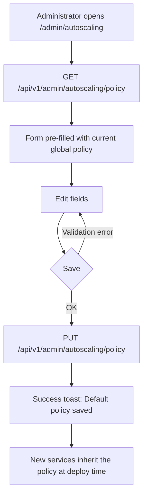
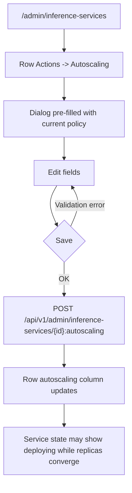
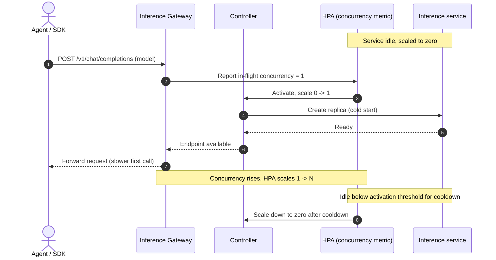
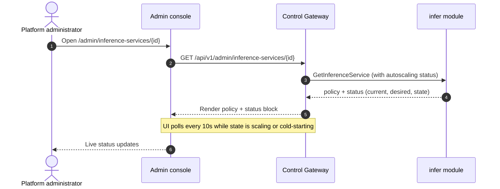

# Inference Autoscaling & Scale-to-Zero — Requirement Analysis and UI/UX Design

| Attribute | Content |
| --- | --- |
| Feature point | Inference autoscaling & scale-to-zero (backlog row 16) |
| Document scope | Requirement analysis and UI/UX design for automatic horizontal scaling of inference services and the ability to scale them to zero when idle: admin console policy controls, per-service autoscaling configuration, the end-user console's read-only autoscaling visibility, API surface, and acceptance criteria |
| Owning modules | `infer` (autoscaling policy on inference services), `Controller` (HPA/KEDA reconciliation and scale-to-zero scheduling), `model` (per-model defaults), `auth`/`tenancy` (surface and org scoping) |
| Related documents | [Architecture Design](./architecture.md) — §2.4 `infer`, §2.7 Controller, §4.2 one-click deployment flow · [Model Catalog & One-Click Deployment](./model-catalog-deployment.md) — the inference-service lifecycle this feature extends · [Console Surface Separation](./console-surface-separation.md) — the two-surface rule this design follows · [Usage Dashboards & Per-Request Cost Attribution](./usage-dashboard.md) — the user-surface model list pattern |
| Status | Design complete, handed to the Architect agent |

---

## 1. Background and Competitive Research

### 1.1 Why Autoscaling and Scale-to-Zero Come Now

go-taas sells inference tokens, and tokens are produced by running inference services. Today (feature #2) an administrator deploys a service with a **fixed** replica count and scales it by hand. That has two costs: an idle service keeps expensive GPUs warm and billed, and a busy service under-provisioned by hand drops requests. Autoscaling lets the platform match replicas to demand automatically; scale-to-zero lets an idle service release its GPUs entirely and spin back up on the first request. This feature point defines what the operator configures and what the tenant sees.

The architecture already fixes the mechanics: the `infer` module maintains desired state and publishes changes to the message queue, and the Controller reconciles Kubernetes resources (§2.4, §2.7). Autoscaling slots in as a **policy on the inference service** that the Controller turns into a Kubernetes `HorizontalPodAutoscaler` (HPA) — and, for scale-to-zero, into the activation/deactivation path that KEDA-style scaling provides. This design does not invent a new scaling engine; it defines the user-facing contract over the existing control loop.

### 1.2 How Comparable Products Implement Autoscaling and Scale-to-Zero

| Product / system | Autoscaling UX | Scale-to-zero | Notable pitfalls |
| --- | --- | --- | --- |
| **Kubernetes HPA** | `minReplicas` / `maxReplicas` + a target metric (CPU/memory utilization, or custom/object metric); `behavior` for stabilization windows and scale-up/down policies | Supported for object/external metrics only (`minReplicas: 0`); a `ScaledToZero` condition distinguishes "scaled to zero" from "manually deactivated" | Resource metrics (CPU/mem) cannot drive scale-to-zero because they are only measurable on running pods; flapping needs stabilization windows |
| **KEDA** | A `ScaledObject` with a trigger metric, `minReplicaCount` / `maxReplicaCount`, and separate **activation** vs **scaling** thresholds; can pause autoscaling via annotations | Scales 0↔1 on the activation threshold, then 1↔N via the HPA it generates | Two thresholds (activation vs scaling) are powerful but easy to misconfigure; pausing is annotation-based and invisible in most UIs |
| **KServe** | Per-inference-service `minReplicas` / `maxReplicas` and a target concurrency or RPS; scale-to-zero enabled per service with a `scaleToZeroEnabled` flag and a `scaleToZeroPodRetentionPeriod` | Idle services scale to zero and cold-start on the first request | Cold-start latency is the main complaint; operators need a retention period so a just-scaled-down service is not immediately re-created |
| **Together AI** | Dedicated endpoints expose a replica count; serverless tier scales automatically | Serverless tier scales to zero transparently | The two tiers confuse users about which one they are calling (already noted in feature #2) |
| **SiliconFlow** | Reserved instances for exclusive compute; serverless auto-scaling on the shared tier | Serverless scales to zero | Reserved vs serverless is a pricing decision, not a scaling decision; the UI must not conflate them |
| **Azure AI Foundry** | Managed compute deployments expose instance count; serverless is pay-per-token | Serverless scales to zero | Two deployment models double the decision surface (already noted in feature #2) |
| **Volcengine Ark** | Endpoint list shows QPS metrics; serverless option for flagship models | Serverless scales to zero | Endpoint naming and model coupling confuses users (already noted in feature #2) |

### 1.3 Distilled Patterns and Decisions

Common industry patterns worth adopting:

1. **A min/max replica range plus a target metric** — every surveyed system reduces autoscaling to `minReplicas` / `maxReplicas` and a target (concurrency, RPS, or utilization). This is the smallest contract a user can reason about.
2. **Scale-to-zero is an explicit, per-service toggle** — KServe's `scaleToZeroEnabled` flag is the cleanest UX: the operator opts in, and the platform handles the 0↔1 activation and the cold-start. It is never implicit.
3. **A separate activation threshold from the scaling target** — KEDA's two-threshold model prevents flapping at the 0↔1 boundary: a service does not scale up on a single stray request and does not scale down the instant load dips.
4. **A retention/cooldown period before scale-down** — KServe's `scaleToZeroPodRetentionPeriod` and HPA's downscale stabilization window both prevent a just-scaled-down service from being immediately re-created. go-taas adopts a cooldown window.
5. **Visible autoscaling status** — HPA exposes conditions (`ScalingActive`, `ScaledToZero`, `AbleToScale`); the console must surface the current replica count, the desired count, and whether the autoscaler is active, so an operator can tell "scaling" from "stuck".
6. **Read-only visibility for the tenant** — the tenant consumes models, not services; it should see that a model is autoscaled and roughly how it is behaving, without any operator controls.

Pitfalls to avoid:

- **Exposing Kubernetes jargon** — the tenant and even the operator should not need to know about HPA objects, stabilization windows, or `ScaledObject` annotations. The console speaks in "min replicas", "max replicas", "target concurrency", and "scale to zero".
- **Scale-to-zero on resource metrics** — CPU/memory cannot drive scale-to-zero (only measurable on running pods). go-taas scales on **concurrency** (in-flight requests), which is measurable at the gateway and works at zero.
- **Flapping at the 0↔1 boundary** — without an activation threshold and a cooldown, an idle service thrashes between 0 and 1. Both are required.
- **Silent cold-start** — a scaled-to-zero service that receives a request must surface that it is cold-starting, or the tenant will think the model is down.
- **Conflating autoscaling with pricing tiers** — go-taas has one deployment model (feature #2); autoscaling is a scaling policy, not a new tier.

**Decisions for go-taas** (recorded rationale, per the autonomous-decision rule):

| # | Decision | Rationale |
| --- | --- | --- |
| D1 | Autoscaling is a **policy on the inference service**, configured at deploy time and editable in place; it does not create a new resource type | Matches the `infer` module's desired-state model (§2.4); the Controller turns the policy into an HPA, keeping the console contract stable |
| D2 | The policy has exactly: **enabled** (bool), **min replicas** (0–max), **max replicas** (min–100), **target concurrency** (1–1000, default 32), **scale-to-zero** (bool, requires min=0), **cooldown seconds** (0–3600, default 300) | Mirrors the industry min/max + target + activation/cooldown contract in the smallest field set; concurrency is the metric that works at zero |
| D3 | Scale-to-zero is a **separate toggle** that requires `min replicas = 0`; enabling it forces min to 0, disabling it forces min to ≥ 1 | KServe's explicit opt-in is the cleanest UX; the min=0 dependency is surfaced as a form rule, not a hidden constraint |
| D4 | The Controller implements the policy as a Kubernetes HPA on a **concurrency** metric (in-flight requests reported by the Inference Gateway), with a downscale stabilization window equal to the cooldown; scale-to-zero uses the HPA `minReplicas: 0` path with an activation threshold | Concurrency is measurable at the gateway even at zero replicas (the gateway sees the request before routing); this is the only metric that supports scale-to-zero |
| D5 | Autoscaling is **admin-surface only** for configuration; the end-user console gets a **read-only** autoscaling summary per model | Configuration is operator orchestration (replicas, targets, cooldowns); the tenant consumes models and only needs to know the model is autoscaled and its current behavior |
| D6 | The admin console manages autoscaling in two places: a **global default policy** (applied to new services) and a **per-service policy** (overrides the default); per-model defaults are derived from the global default | A global default keeps new deployments sane without per-model config; per-service override gives operators control where it matters; per-model defaults are a follow-up (see §8) |
| D7 | The end-user console shows autoscaling on the **model** level (a model is autoscaled, currently N replicas, scale-to-zero on/off), never on the service level | The tenant consumes models over the OpenAI-compatible endpoint (feature #17 AD14); services are operator-internal artifacts |
| D8 | A scaled-to-zero service that receives a request shows a **cold-starting** state to the operator and a **warming up** hint to the tenant, instead of silently dropping or delaying | Cold-start is the one UX cost of scale-to-zero; surfacing it prevents "is the model down?" confusion |
| D9 | Autoscaling changes are **asynchronous** like deployment: the update returns immediately, the service state reflects convergence, and the console polls | Matches the MQ + Controller reconciliation model (§4.2); blocking on HPA convergence would time out the HTTP call |
| D10 | The autoscaling policy is **validated synchronously** at the API boundary (min ≤ max, min=0 requires scale-to-zero, target in range, cooldown in range) before any message is published | Invalid policies must never reach the Controller (same rule as feature #2's deploy validation) |

### 1.4 Scope Boundary

**In scope**: the autoscaling policy on inference services (enable, min/max replicas, target concurrency, scale-to-zero, cooldown), the global default policy, admin console configuration UI (global default + per-service), the end-user console's read-only autoscaling visibility per model, autoscaling status and cold-start visibility, and the API surface on both prefixes.

**Out of scope** (tracked by other feature points): per-model autoscaling defaults distinct from the global default (follow-up, §8), vertical autoscaling (GPU sizing), node-level autoscaling, canary/blue-green autoscaling, and fine-grained scaling behaviors (per-direction policies, custom metric formulas).

---

## 2. User Roles

| Role | Description | Interaction with autoscaling |
| --- | --- | --- |
| **Platform administrator** | The operator who runs the go-taas cluster and curates inference services | Sets the global default autoscaling policy, configures per-service policies, reads autoscaling status, and reacts to cold-starts and scaling failures |
| **Organization administrator** | A tenant-side administrator consuming the platform | Reads the autoscaling summary for the models their organization uses (read-only); no configuration |
| **Tenant developer / Agent** | The consumer that calls `/v1/chat/completions` | Never touches autoscaling; may see a "warming up" hint when a scaled-to-zero model cold-starts |
| **Agent / SDK** | The programmatic consumer | Calls the inference endpoint; generates the concurrency that drives autoscaling; never touches a control-plane page |

> Terminology: the consumer-side caller is called an **Agent** (English) / 「智能体」(Chinese), consistent with the repo convention.

---

## 3. User Stories

| # | As a… | I want to… | So that… |
| --- | --- | --- | --- |
| US1 | Platform administrator | set a global default autoscaling policy (min/max replicas, target concurrency, scale-to-zero, cooldown) | every new inference service starts with sane scaling without per-service config |
| US2 | Platform administrator | enable autoscaling on a specific inference service with its own min/max and target | I can tune a busy or idle service without touching the global default |
| US3 | Platform administrator | turn scale-to-zero on for an idle service | it releases its GPUs when idle and spins back up on demand |
| US4 | Platform administrator | see the current replica count, desired count, and autoscaling status of a service | I can tell whether it is scaling, scaled to zero, or stuck |
| US5 | Platform administrator | see when a scaled-to-zero service is cold-starting | I know the first request is slow because of cold-start, not a fault |
| US6 | Organization administrator | see that a model my org uses is autoscaled and its current replica count | I can plan capacity and understand latency without operator access |
| US7 | Tenant developer | see a "warming up" hint when a scaled-to-zero model cold-starts | I do not mistake a cold-start for an outage |
| US8 | Agent / SDK | call a model that autoscales | I get capacity that follows my demand without manual scaling |

---

## 4. Functional Requirements

### FR1 — Global default autoscaling policy (admin)

- **FR1.1** The admin console provides a "Default autoscaling policy" editor on the Inference Services page (or a dedicated Autoscaling page), with fields: **Enabled** (bool, default on), **Min replicas** (0–max, default 1), **Max replicas** (min–100, default 10), **Target concurrency** (1–1000, default 32), **Scale to zero** (bool, default off), **Cooldown seconds** (0–3600, default 300).
- **FR1.2** The global default is applied to every **new** inference service at creation; existing services are unaffected unless they opt in to the default.
- **FR1.3** Validation: `min ≤ max`; `min = 0` requires `scale_to_zero = true`; `scale_to_zero = true` forces `min = 0`; target and cooldown in range. Invalid values are rejected inline before submission.
- **FR1.4** Saving the global default is immediate (synchronous) and does not require a service to exist.

### FR2 — Per-service autoscaling policy (admin)

- **FR2.1** The deploy form (feature #2) gains an "Autoscaling" section: **Enabled** toggle, **Min replicas**, **Max replicas**, **Target concurrency**, **Scale to zero** toggle, **Cooldown seconds**. The fields are pre-filled from the global default.
- **FR2.2** Each non-terminated service row offers "Autoscaling", opening a dialog to edit the policy in place (same fields as FR2.1, pre-filled from the current policy).
- **FR2.3** Editing the policy calls the update API and returns immediately; the service state reflects convergence and the console polls.
- **FR2.4** Validation is identical to FR1.3 and is enforced synchronously at the API boundary (D10).
- **FR2.5** Disabling autoscaling on a service returns it to a fixed replica count equal to the current desired count (or the last manual count); the operator is warned of this in the dialog.

### FR3 — Autoscaling status visibility (admin)

- **FR3.1** The inference-services list shows an **Autoscaling** column: a badge (`On` / `Off`) and, when on, the current replica count as `current/min–max` (e.g. `3/1–10`).
- **FR3.2** The service detail page shows the full autoscaling policy and a **status** block: current replicas, desired replicas, target concurrency, current concurrency, autoscaling state (`scaling-up` / `scaling-down` / `steady` / `scaled-to-zero` / `cold-starting` / `disabled` / `error`), and the last scaling event time.
- **FR3.3** A `cold-starting` state is shown when a scaled-to-zero service has received a request and is spinning up; a `scaled-to-zero` state when it is idle at zero.
- **FR3.4** An `error` state surfaces the autoscaler failure reason (e.g. metric unavailable, HPA rejected) with an actionable message.

### FR4 — End-user read-only autoscaling visibility (user)

- **FR4.1** The end-user console's model list (from `ListAvailableModels`) shows an **Autoscaling** indicator per model: a badge (`Autoscaled` / `Fixed`) and, when autoscaled, the current replica count.
- **FR4.2** The end-user model detail page shows a read-only autoscaling summary: autoscaling on/off, min/max replicas, scale-to-zero on/off, current replica count, and current state (`steady` / `scaling` / `scaled-to-zero` / `warming up`).
- **FR4.3** A `warming up` state is shown when a scaled-to-zero model is cold-starting; the page shows a hint: "This model is warming up from zero — the first request may be slower than usual."
- **FR4.4** The end-user console exposes **no** autoscaling configuration controls; all fields are read-only.

### FR5 — Cold-start and scale-to-zero behavior

- **FR5.1** A scaled-to-zero service that receives a request transitions to `cold-starting` (admin) / `warming up` (user) and spins up to at least 1 replica.
- **FR5.2** The cooldown window prevents a just-scaled-down service from being immediately re-created; the service stays at its current count for at least `cooldown` seconds after a scale-down.
- **FR5.3** Scale-to-zero only scales down when concurrency is below the activation threshold for the cooldown duration; a single stray request does not keep it at 1.

---

## 5. Surface Assignment

Every page and component below is assigned to exactly one surface, with its full route and API prefix. Admin pages call only `/api/v1/admin/*`; user pages call only `/api/v1/*`.

| Feature / component | Surface | Web route | API prefix |
| --- | --- | --- | --- |
| Global default autoscaling policy editor | admin | `/admin/autoscaling` | `/api/v1/admin/autoscaling/policy` |
| Per-service autoscaling dialog (from service list/detail) | admin | `/admin/inference-services` (dialog) | `/api/v1/admin/inference-services/{service_id}:autoscaling` |
| Autoscaling section in the deploy form | admin | `/admin/inference-services` (deploy dialog) | `/api/v1/admin/inference-services` (create, extended) |
| Autoscaling status column on the service list | admin | `/admin/inference-services` | `/api/v1/admin/inference-services` (list, extended) |
| Autoscaling status block on the service detail | admin | `/admin/inference-services/{service_id}` | `/api/v1/admin/inference-services/{service_id}` (get, extended) |
| End-user model list autoscaling indicator | user | `/models` | `/api/v1/models` (list, extended) |
| End-user model detail autoscaling summary | user | `/models/{model_id}` | `/api/v1/models/{model_id}` (get, extended) |

> The end-user console has **no** autoscaling configuration page; the user surface is read-only (D5, D7). The admin console has no autoscaling page on the user prefix.

---

## 6. Page and Flow Design

### 6.1 Page Map

| Page / component | Surface | Purpose |
| --- | --- | --- |
| **Autoscaling page** (`/admin/autoscaling`) | admin | Global default policy editor (FR1) |
| **Inference Services page** (`/admin/inference-services`) | admin | Service list with autoscaling column, per-service autoscaling dialog, deploy form autoscaling section (FR2, FR3.1) |
| **Service detail page** (`/admin/inference-services/{service_id}`) | admin | Full policy + status block (FR3.2–FR3.4) |
| **Models page** (`/models`) | user | Model list with autoscaling indicator (FR4.1) |
| **Model detail page** (`/models/{model_id}`) | user | Read-only autoscaling summary (FR4.2–FR4.4) |

### 6.2 Admin — Autoscaling Page (`/admin/autoscaling`)

**Purpose**: edit the global default autoscaling policy applied to new inference services.

**Layout**: a single centered card under the admin shell. Header "Default autoscaling policy" with a subtitle "Applied to new inference services. Existing services keep their own policy unless you edit them." Below: the form fields (FR1.1) in a vertical stack, then a footer with **Save** (primary) and **Reset to defaults** (secondary).

**Interactive states**:

- **Default**: fields show the current global policy; Enabled toggle on, Min 1, Max 10, Target 32, Scale-to-zero off, Cooldown 300.
- **Loading**: skeleton rows while `GET /api/v1/admin/autoscaling/policy` resolves.
- **Empty**: not applicable (the global policy always exists; a fresh install shows defaults).
- **Error**: an error banner with a Retry button if the load fails.
- **Disabled**: the Min/Max/Target/Cooldown fields are disabled when **Enabled** is off; Scale-to-zero is disabled unless **Min replicas = 0**.
- **Permission-denied**: a non-admin session on this route redirects to `/admin/login` with a `next` parameter (realm gate).

**Form fields and validation**:

| Field | Type | Required | Validation | Error copy |
| --- | --- | --- | --- | --- |
| Enabled | toggle | — | — | — |
| Min replicas | number | yes | 0–max; if 0, scale-to-zero must be on | "Min replicas must be 0 to enable scale-to-zero." |
| Max replicas | number | yes | min–100 | "Max replicas must be ≥ min replicas and ≤ 100." |
| Target concurrency | number | yes | 1–1000 | "Target concurrency must be between 1 and 1000." |
| Scale to zero | toggle | — | requires min = 0 | "Set min replicas to 0 to enable scale-to-zero." |
| Cooldown seconds | number | yes | 0–3600 | "Cooldown must be between 0 and 3600 seconds." |

**Save flow**: Save → `PUT /api/v1/admin/autoscaling/policy` → success toast "Default policy saved." → the form reflects the saved values. On validation error, inline field errors; on API error, a banner.

### 6.3 Admin — Inference Services Page (`/admin/inference-services`)

**Purpose**: list services with autoscaling status, edit per-service policy, and configure autoscaling at deploy time.

**Layout**: the existing service list (feature #2) gains an **Autoscaling** column between State and Actions. Each row shows a badge (`On` / `Off`) and, when on, `current/min–max`. The row's Actions menu gains **Autoscaling**. The deploy dialog gains an **Autoscaling** section (FR2.1).

**Autoscaling column states**:

- **On**: green badge `On`, text `3/1–10` (current/min–max).
- **Off**: grey badge `Off`.
- **Cold-starting**: amber badge `Cold-starting` with the current count.
- **Error**: red badge `Error` with a tooltip showing the reason.

**Per-service Autoscaling dialog** (from a row's Actions → Autoscaling):

- **Default**: fields pre-filled from the current policy (FR2.1).
- **Loading**: skeleton while the current policy loads.
- **Disabled**: fields disabled when Enabled is off; Scale-to-zero disabled unless Min = 0.
- **Disable warning**: when the operator turns **Enabled** off, an inline warning: "Autoscaling will be disabled and the service will run at a fixed replica count equal to its current count."
- **Save**: Save → `POST /api/v1/admin/inference-services/{service_id}:autoscaling` → success toast → the row's autoscaling column updates; the service state may briefly show `deploying` while replicas converge.

**Deploy dialog Autoscaling section** (FR2.1): fields pre-filled from the global default; identical validation to FR1.3; submitted as part of `CreateInferenceService`.

### 6.4 Admin — Service Detail Page (`/admin/inference-services/{service_id}`)

**Purpose**: show the full autoscaling policy and live status.

**Layout**: the existing detail page (feature #2) gains an **Autoscaling** card below the spec. It shows the policy (enabled, min/max, target, scale-to-zero, cooldown) and a **Status** block: current replicas, desired replicas, current concurrency, target concurrency, state badge, and last scaling event time. An **Edit** button opens the per-service autoscaling dialog (6.3).

**Status block states**:

- **Steady**: green badge `Steady`, current = desired.
- **Scaling up**: blue badge `Scaling up`, current < desired.
- **Scaling down**: blue badge `Scaling down`, current > desired.
- **Scaled to zero**: grey badge `Scaled to zero`, current = 0, desired = 0.
- **Cold-starting**: amber badge `Cold-starting`, current = 0, desired ≥ 1, with a hint "A request arrived — spinning up from zero."
- **Disabled**: grey badge `Disabled`, no autoscaling.
- **Error**: red badge `Error` with the failure reason and an actionable message.

### 6.5 User — Models Page (`/models`)

**Purpose**: show the tenant which models are autoscaled and their current behavior.

**Layout**: the existing model list (feature #17) gains an **Autoscaling** column. Each row shows a badge (`Autoscaled` / `Fixed`) and, when autoscaled, the current replica count.

**Column states**:

- **Autoscaled**: green badge `Autoscaled`, text `3 replicas`.
- **Fixed**: grey badge `Fixed`.
- **Scaled to zero**: grey badge `Scaled to zero`.
- **Warming up**: amber badge `Warming up`.

### 6.6 User — Model Detail Page (`/models/{model_id}`)

**Purpose**: show a read-only autoscaling summary for a model.

**Layout**: the existing model detail page (feature #17) gains an **Autoscaling** card: autoscaling on/off, min/max replicas, scale-to-zero on/off, current replica count, and a state badge. No edit controls.

**State badge**: `Steady` / `Scaling` / `Scaled to zero` / `Warming up`. When `Warming up`, a hint: "This model is warming up from zero — the first request may be slower than usual."

### 6.7 Admin — Global Default Policy Flow

### 6.8 Admin — Per-Service Autoscaling Flow

### 6.9 Scale-to-Zero and Cold-Start Sequence

### 6.10 Autoscaling Status Sequence (admin polling)

---

## 7. API Surface Implications

The design spans the `infer` module (autoscaling policy on services) and the `model` module (user-surface autoscaling projection). All served as HTTP via the Control Gateway (`grpc-gateway`).

### 7.1 Admin surface (`/api/v1/admin/*`)

| RPC | HTTP | Purpose | Notes |
| --- | --- | --- | --- |
| `GetAutoscalingPolicy` (`taas.infer.v1`) | `GET /api/v1/admin/autoscaling/policy` | **new** | Global default policy |
| `UpdateAutoscalingPolicy` (`taas.infer.v1`) | `PUT /api/v1/admin/autoscaling/policy` | **new** | Save global default; synchronous |
| `CreateInferenceService` (`taas.infer.v1`) | `POST /api/v1/admin/inference-services` | **extended** | Request gains an `autoscaling` policy field (D2) |
| `UpdateInferenceServiceAutoscaling` (`taas.infer.v1`) | `POST /api/v1/admin/inference-services/{service_id}:autoscaling` | **new** | Edit per-service policy; async via MQ |
| `ListInferenceServices` (`taas.infer.v1`) | `GET /api/v1/admin/inference-services` | **extended** | Summary gains autoscaling fields (enabled, current/min/max, state) |
| `GetInferenceService` (`taas.infer.v1`) | `GET /api/v1/admin/inference-services/{service_id}` | **extended** | Detail gains full policy + status block |

### 7.2 User surface (`/api/v1/*`)

| RPC | HTTP | Purpose | Notes |
| --- | --- | --- | --- |
| `ListAvailableModels` (`taas.model.v1`) | `GET /api/v1/models` | **extended** | Summary gains autoscaling projection (autoscaled, current replicas, state) |
| `GetAvailableModel` (`taas.model.v1`) | `GET /api/v1/models/{model_id}` | **new** | Read-only autoscaling summary for one model |

Constraints on the contract:

1. `UpdateAutoscalingPolicy` and `UpdateInferenceServiceAutoscaling` must validate the policy synchronously (D10): `min ≤ max`, `min = 0 ⟺ scale_to_zero`, target 1–1000, cooldown 0–3600. Invalid policies are rejected before any message is published.
2. `InferenceServiceSummary` gains `autoscaling_enabled`, `current_replicas`, `min_replicas`, `max_replicas`, and `autoscaling_state` (a closed enum: `disabled`, `steady`, `scaling-up`, `scaling-down`, `scaled-to-zero`, `cold-starting`, `error`). The console relies on this closed set for badge rendering.
3. The user-surface projection (`ListAvailableModels` / `GetAvailableModel`) carries **no** operator fields (no cooldown, no target concurrency, no service identifiers) — only what a tenant needs (D7, D15 of feature #17).
4. `UpdateInferenceServiceAutoscaling` is async: it returns immediately and the service state reflects convergence; the console polls while the state is `scaling-up`, `scaling-down`, or `cold-starting`.
5. Disabling autoscaling (FR2.5) returns the service to a fixed replica count equal to the current desired count; the API must return the resulting fixed count so the console can confirm it.

---

## 8. Acceptance Criteria

| # | Criterion | Verification |
| --- | --- | --- |
| AC1 | `UpdateAutoscalingPolicy` with a valid policy succeeds and `GetAutoscalingPolicy` returns it; a new `CreateInferenceService` without an explicit policy inherits the global default | FVT |
| AC2 | `UpdateAutoscalingPolicy` with `min > max`, `min = 0` without `scale_to_zero`, `scale_to_zero` with `min > 0`, target outside 1–1000, or cooldown outside 0–3600 returns a validation error and publishes nothing | Unit test + FVT |
| AC3 | `CreateInferenceService` with an explicit autoscaling policy stores it; `GetInferenceService` returns the full policy and a status block | FVT |
| AC4 | `UpdateInferenceServiceAutoscaling` changes the policy and returns immediately; the service summary reflects the new min/max and the state transitions through `scaling-up`/`scaling-down` to `steady` | FVT + E2E |
| AC5 | Disabling autoscaling on a service returns it to a fixed replica count equal to the current desired count, and the summary shows `autoscaling_state = disabled` | FVT |
| AC6 | A scaled-to-zero service that receives a request transitions to `cold-starting` (admin) / `warming up` (user), scales to ≥ 1 replica, and serves the request | FVT (fault/load injection) + E2E |
| AC7 | An idle scaled-to-zero service stays at zero for at least the cooldown duration after a scale-down before it can be re-created | FVT (timing) |
| AC8 | The admin service list shows the autoscaling column with `On`/`Off` badges and `current/min–max`; the detail page shows the full policy and status block | E2E |
| AC9 | The end-user model list shows `Autoscaled`/`Fixed` badges and current replica count; the model detail page shows a read-only autoscaling summary with no edit controls | E2E |
| AC10 | The end-user console contains no `/api/v1/admin/` string and the admin console contains no user-prefix autoscaling call (surface separation) | E2E (source/network assertion) |
| AC11 | A `cold-starting`/`warming up` state surfaces a hint to the user ("first request may be slower than usual") and an actionable message to the operator | E2E |
| AC12 | The admin service detail page polls at 10-second intervals while the state is `scaling-up`, `scaling-down`, or `cold-starting`, and stops when settled | Manual / E2E |

---

## 9. Open Items Deferred

| Item | Deferred to |
| --- | --- |
| Per-model autoscaling defaults distinct from the global default | Follow-up feature point |
| Vertical autoscaling (GPU sizing) and node-level autoscaling | Future feature point |
| Fine-grained scaling behaviors (per-direction policies, custom metric formulas, multiple metrics) | Future feature point |
| Canary / blue-green autoscaling | Future feature point |
| Tenant-facing autoscaling configuration (self-service scaling) | Future feature point (currently read-only for tenants) |
