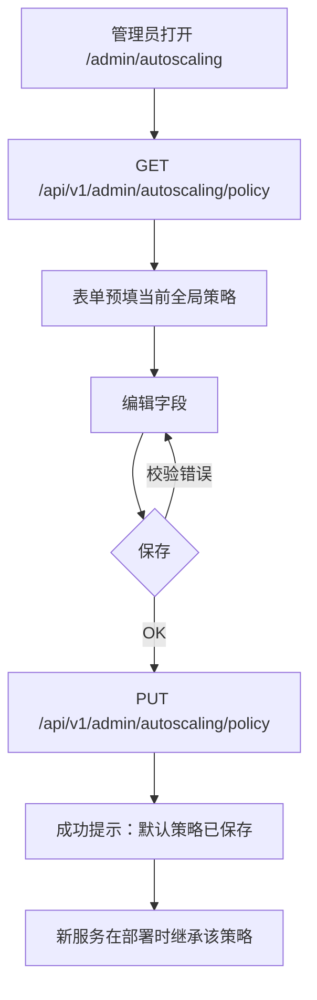
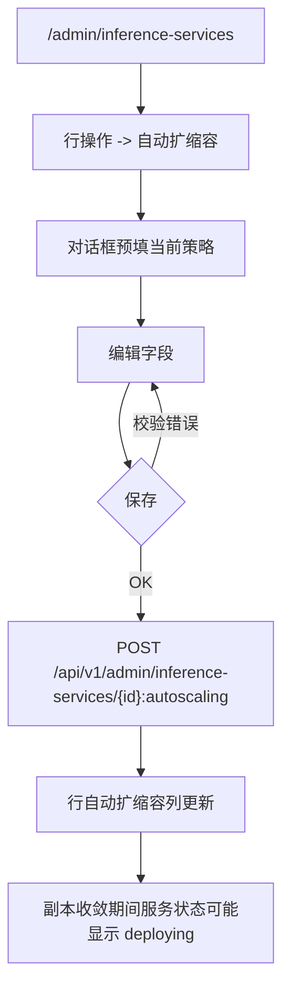
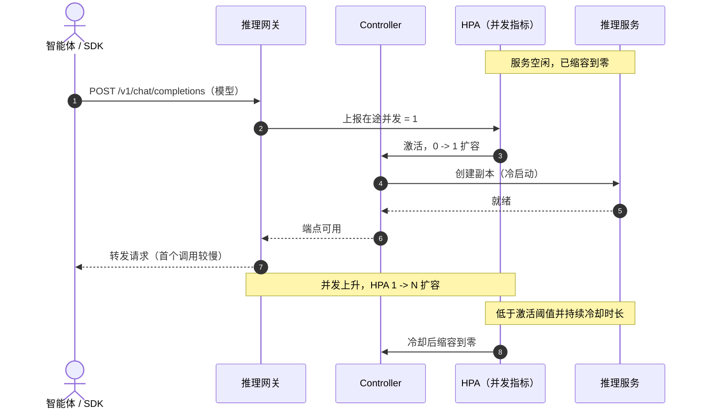
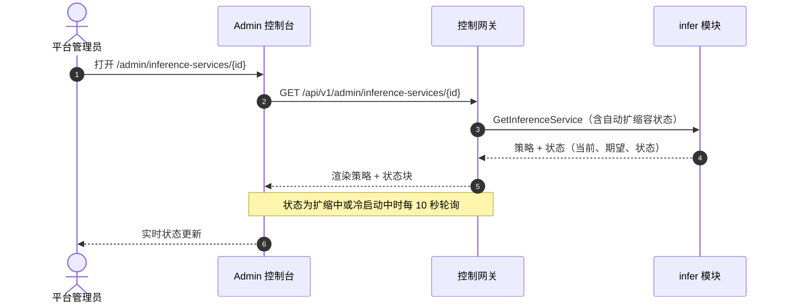

# 推理自动扩缩容与缩容到零 — 需求分析与 UI/UX 设计

| 属性 | 内容 |
| --- | --- |
| 特性点 | 推理自动扩缩容与缩容到零（backlog 第 16 行） |
| 文档范围 | 推理服务自动水平扩缩容与空闲时缩容到零能力的需求分析与 UI/UX 设计：admin 控制台的策略控制、按服务的自动扩缩容配置、终端用户控制台只读的自动扩缩容可见性、API 面与验收标准 |
| 归属模块 | `infer`（推理服务上的自动扩缩容策略）、`Controller`（HPA/KEDA 调和与缩容到零调度）、`model`（按模型默认值）、`auth`/`tenancy`（面与组织作用域） |
| 相关文档 | [架构设计](./architecture.zh-cn.md) — 第 2.4 节 `infer`、第 2.7 节 Controller、第 4.2 节一键部署流程 · [模型目录与一键部署](./model-catalog-deployment.zh-cn.md) — 本特性点所扩展的推理服务生命周期 · [控制台面分离](./console-surface-separation.zh-cn.md) — 本设计遵循的双面规则 · [用量看板与按请求成本归因](./usage-dashboard.zh-cn.md) — 用户面模型列表模式 |
| 状态 | 设计完成，已移交 Architect agent |

---

## 1. 背景与竞品调研

### 1.1 为什么现在做自动扩缩容与缩容到零

go-taas 售卖推理 token，而 token 由运行中的推理服务产出。今天（特性 #2）管理员以**固定**副本数部署服务，并手动扩缩容。这带来两个成本：空闲服务让昂贵的 GPU 空转并持续计费；手动配置不足的繁忙服务会丢弃请求。自动扩缩容让平台按需匹配副本数；缩容到零让空闲服务完全释放 GPU，并在首个请求到来时重新拉起。本特性点定义的是操作员配置什么、租户看到什么。

架构已固定了机制：`infer` 模块维护期望状态并把变更发布到消息队列，Controller 调和 Kubernetes 资源（§2.4、§2.7）。自动扩缩容作为**推理服务上的策略**接入，由 Controller 落成 Kubernetes 的 `HorizontalPodAutoscaler`（HPA）——对于缩容到零，则走 KEDA 风格的激活/停用路径。本设计不发明新的扩缩容引擎；它定义的是既有控制环之上的用户可见契约。

### 1.2 竞品如何实现自动扩缩容与缩容到零

| 产品/系统 | 自动扩缩容交互 | 缩容到零 | 值得注意的坑 |
| --- | --- | --- | --- |
| **Kubernetes HPA** | `minReplicas` / `maxReplicas` + 目标指标（CPU/内存利用率，或自定义/对象指标）；`behavior` 用于稳定窗口与扩缩容策略 | 仅支持对象/外部指标（`minReplicas: 0`）；`ScaledToZero` 条件区分「缩容到零」与「手动停用」 | 资源指标（CPU/内存）无法驱动缩容到零，因为它们只能在运行中的 Pod 上测量；抖动需要稳定窗口 |
| **KEDA** | `ScaledObject` 含触发指标、`minReplicaCount` / `maxReplicaCount`，以及独立的**激活**与**扩缩容**阈值；可通过注解暂停自动扩缩容 | 在激活阈值上做 0↔1 扩缩，再经由其生成的 HPA 做 1↔N | 双阈值（激活 vs 扩缩容）强大但易配错；暂停基于注解，在多数 UI 中不可见 |
| **KServe** | 每个推理服务有 `minReplicas` / `maxReplicas` 与目标并发或 RPS；按服务启用缩容到零（`scaleToZeroEnabled` 标志）与 `scaleToZeroPodRetentionPeriod` | 空闲服务缩容到零，首个请求冷启动 | 冷启动延迟是主要抱怨；操作员需要保留期，避免刚缩容的服务被立即重建 |
| **Together AI** | 专用端点暴露副本数；Serverless 档自动扩缩容 | Serverless 档透明缩容到零 | 两档让用户混淆自己调用的是哪一档（特性 #2 已指出） |
| **SiliconFlow** | 预留实例提供独占算力；共享档 Serverless 自动扩缩容 | Serverless 缩容到零 | 预留 vs Serverless 是定价决策而非扩缩容决策；UI 不得混淆二者 |
| **Azure AI Foundry** | 托管算力部署暴露实例数；Serverless 按 token 计费 | Serverless 缩容到零 | 两套部署模型让决策面翻倍（特性 #2 已指出） |
| **火山引擎方舟** | 接入点列表展示 QPS 指标；旗舰模型提供 Serverless 选项 | Serverless 缩容到零 | 接入点命名与模型耦合易混淆（特性 #2 已指出） |

### 1.3 提炼的模式与决策

值得采纳的业界共性模式：

1. **最小/最大副本区间 + 目标指标** —— 所有调研系统都把自动扩缩容收敛为 `minReplicas` / `maxReplicas` 与一个目标（并发、RPS 或利用率）。这是用户能理解的最小契约。
2. **缩容到零是显式、按服务的开关** —— KServe 的 `scaleToZeroEnabled` 标志是最干净的交互：操作员选择启用，平台处理 0↔1 激活与冷启动。它绝不隐式发生。
3. **激活阈值与扩缩容目标分离** —— KEDA 的双阈值模型防止 0↔1 边界抖动：服务不会因单个偶发请求就扩容，也不会在负载一降就立刻缩容。
4. **缩容前的保留/冷却期** —— KServe 的 `scaleToZeroPodRetentionPeriod` 与 HPA 的缩容稳定窗口都防止刚缩容的服务被立即重建。go-taas 采用冷却窗口。
5. **可见的自动扩缩容状态** —— HPA 暴露条件（`ScalingActive`、`ScaledToZero`、`AbleToScale`）；控制台必须呈现当前副本数、期望副本数以及自动扩缩容器是否活跃，让操作员能区分「正在扩缩」与「卡住」。
6. **租户只读可见性** —— 租户消费的是模型而非服务；它应看到模型已自动扩缩容及其大致行为，但没有任何操作员控制项。

需要避免的坑：

- **暴露 Kubernetes 术语** —— 租户乃至操作员都不应需要了解 HPA 对象、稳定窗口或 `ScaledObject` 注解。控制台只讲「最小副本」「最大副本」「目标并发」「缩容到零」。
- **在资源指标上做缩容到零** —— CPU/内存无法驱动缩容到零（只能在运行中的 Pod 上测量）。go-taas 基于**并发**（在途请求）扩缩，这在网关处可测量，且在零副本时也成立。
- **0↔1 边界抖动** —— 没有激活阈值与冷却期，空闲服务会在 0 与 1 之间反复横跳。两者都必需。
- **静默冷启动** —— 收到请求的缩容到零服务必须呈现正在冷启动，否则租户会以为模型宕机。
- **把自动扩缩容与定价档位混为一谈** —— go-taas 只有一种部署模型（特性 #2）；自动扩缩容是扩缩容策略，不是新档位。

**go-taas 的决策**（依据自主决策规则记录理由）：

| # | 决策 | 理由 |
| --- | --- | --- |
| D1 | 自动扩缩容是**推理服务上的策略**，部署时配置、原位可编辑；不创建新资源类型 | 契合 `infer` 模块的期望状态模型（§2.4）；Controller 把策略落成 HPA，保持控制台契约稳定 |
| D2 | 策略字段恰好为：**启用**（bool）、**最小副本**（0–max）、**最大副本**（min–100）、**目标并发**（1–1000，默认 32）、**缩容到零**（bool，要求 min=0）、**冷却秒数**（0–3600，默认 300） | 以最小字段集映射业界「min/max + 目标 + 激活/冷却」契约；并发是在零副本时也成立的指标 |
| D3 | 缩容到零是**独立开关**，要求 `最小副本 = 0`；启用时强制 min=0，停用时强制 min ≥ 1 | KServe 的显式选择是最干净的交互；min=0 依赖以表单规则呈现，而非隐藏约束 |
| D4 | Controller 把策略落成基于**并发**指标（推理网关上报的在途请求）的 Kubernetes HPA，缩容稳定窗口等于冷却期；缩容到零走 HPA `minReplicas: 0` 路径并带激活阈值 | 并发在零副本时也能在网关处测量（网关在路由前先看到请求）；这是唯一支持缩容到零的指标 |
| D5 | 自动扩缩容**配置仅限 admin 面**；终端用户控制台按模型提供**只读**的自动扩缩容摘要 | 配置是操作员编排（副本、目标、冷却）；租户消费模型，只需知道模型已自动扩缩容及其当前行为 |
| D6 | admin 控制台在两处管理自动扩缩容：**全局默认策略**（应用于新服务）与**按服务策略**（覆盖默认）；按模型默认值由全局默认派生 | 全局默认让新部署无需逐服务配置即可合理；按服务覆盖让操作员在关键处掌控；按模型默认值是后续项（见 §8） |
| D7 | 终端用户控制台在**模型**层面展示自动扩缩容（模型已自动扩缩容、当前 N 副本、缩容到零开/关），绝不在服务层面 | 租户经 OpenAI 兼容端点消费模型（特性 #17 AD14）；服务是操作员内部编排产物 |
| D8 | 收到请求的缩容到零服务向操作员呈现**冷启动中**状态、向租户呈现**预热中**提示，而非静默丢弃或延迟 | 冷启动是缩容到零唯一的交互成本；呈现它可避免「模型是不是挂了」的困惑 |
| D9 | 自动扩缩容变更是**异步**的，与部署一致：更新立即返回，服务状态反映收敛，控制台轮询 | 契合 MQ + Controller 调和模型（§4.2）；阻塞等待 HPA 收敛会拖垮 HTTP 调用 |
| D10 | 自动扩缩容策略在 **API 边界同步校验**（min ≤ max、min=0 需缩容到零、目标在范围内、冷却在范围内），任何消息发布前完成 | 无效策略绝不能到达 Controller（与特性 #2 部署校验同规则） |

### 1.4 范围边界

**范围内**：推理服务上的自动扩缩容策略（启用、min/max 副本、目标并发、缩容到零、冷却）、全局默认策略、admin 控制台配置 UI（全局默认 + 按服务）、终端用户控制台按模型的只读自动扩缩容可见性、自动扩缩容状态与冷启动可见性，以及两个前缀上的 API 面。

**范围外**（由其他特性点跟踪）：区别于全局默认的按模型自动扩缩容默认值（后续项，§8）、垂直扩缩容（GPU 规格）、节点级扩缩容、金丝雀/蓝绿自动扩缩容，以及细粒度扩缩容行为（按方向策略、自定义指标公式）。

---

## 2. 用户角色

| 角色 | 描述 | 与自动扩缩容的交互 |
| --- | --- | --- |
| **平台管理员** | 运行 go-taas 集群并编排推理服务的操作员 | 设置全局默认自动扩缩容策略、配置按服务策略、读取自动扩缩容状态，并对冷启动与扩缩容失败作出反应 |
| **组织管理员** | 消费平台的租户侧管理员 | 读取其组织所用模型的自动扩缩容摘要（只读）；无配置 |
| **租户开发者 / 智能体** | 调用 `/v1/chat/completions` 的消费者 | 绝不触碰自动扩缩容；缩容到零模型冷启动时可能看到「预热中」提示 |
| **智能体 / SDK** | 程序化消费者 | 调用推理端点；产生驱动自动扩缩容的并发；绝不触碰控制面页面 |

> 术语：消费侧调用方称为 **Agent**（英文）/「智能体」（中文），与仓库约定一致。

---

## 3. 用户故事

| # | 作为… | 我想要… | 以便… |
| --- | --- | --- | --- |
| US1 | 平台管理员 | 设置全局默认自动扩缩容策略（min/max 副本、目标并发、缩容到零、冷却） | 每个新推理服务无需逐服务配置即可有合理的扩缩容 |
| US2 | 平台管理员 | 在特定推理服务上启用自动扩缩容，带自己的 min/max 与目标 | 我可以调优繁忙或空闲服务，而不触碰全局默认 |
| US3 | 平台管理员 | 为空闲服务开启缩容到零 | 它在空闲时释放 GPU，并按需重新拉起 |
| US4 | 平台管理员 | 查看服务的当前副本数、期望副本数与自动扩缩容状态 | 我能判断它是在扩缩、已缩容到零，还是卡住了 |
| US5 | 平台管理员 | 看到缩容到零服务何时冷启动 | 我知道首个请求慢是因为冷启动，而非故障 |
| US6 | 组织管理员 | 看到我组织所用模型已自动扩缩容及其当前副本数 | 无需操作员权限即可规划容量并理解延迟 |
| US7 | 租户开发者 | 在缩容到零模型冷启动时看到「预热中」提示 | 我不会把冷启动误认为宕机 |
| US8 | 智能体 / SDK | 调用会自动扩缩容的模型 | 我获得随需求变化的容量，无需手动扩缩容 |

---

## 4. 功能需求

### FR1 — 全局默认自动扩缩容策略（admin）

- **FR1.1** admin 控制台在推理服务页（或独立自动扩缩容页）提供「默认自动扩缩容策略」编辑器，字段：**启用**（bool，默认开）、**最小副本**（0–max，默认 1）、**最大副本**（min–100，默认 10）、**目标并发**（1–1000，默认 32）、**缩容到零**（bool，默认关）、**冷却秒数**（0–3600，默认 300）。
- **FR1.2** 全局默认应用于每个**新建**推理服务；既有服务不受影响，除非它们选择采用默认。
- **FR1.3** 校验：`min ≤ max`；`min = 0` 需 `scale_to_zero = true`；`scale_to_zero = true` 强制 `min = 0`；目标与冷却在范围内。无效值在提交前内联拒绝。
- **FR1.4** 保存全局默认是即时的（同步），无需存在任何服务。

### FR2 — 按服务自动扩缩容策略（admin）

- **FR2.1** 部署表单（特性 #2）新增「自动扩缩容」区块：**启用**开关、**最小副本**、**最大副本**、**目标并发**、**缩容到零**开关、**冷却秒数**。字段从全局默认预填。
- **FR2.2** 每个非终止服务行提供「自动扩缩容」，打开对话框原位编辑策略（字段同 FR2.1，从当前策略预填）。
- **FR2.3** 编辑策略调用更新 API 并立即返回；服务状态反映收敛，控制台轮询。
- **FR2.4** 校验与 FR1.3 相同，并在 API 边界同步强制（D10）。
- **FR2.5** 在服务上停用自动扩缩容会将其恢复到等于当前期望副本数（或上次手动数）的固定副本数；对话框向操作员提示此行为。

### FR3 — 自动扩缩容状态可见性（admin）

- **FR3.1** 推理服务列表新增**自动扩缩容**列：徽标（`开` / `关`），开启时显示 `当前/min–max`（如 `3/1–10`）。
- **FR3.2** 服务详情页展示完整自动扩缩容策略与**状态**块：当前副本、期望副本、目标并发、当前并发、自动扩缩容状态（`扩容中` / `缩容中` / `稳定` / `已缩容到零` / `冷启动中` / `已停用` / `错误`），以及最近一次扩缩容事件时间。
- **FR3.3** 当缩容到零服务收到请求并正在拉起时显示 `冷启动中` 状态；空闲在零时显示 `已缩容到零`。
- **FR3.4** `错误` 状态呈现自动扩缩容器失败原因（如指标不可用、HPA 被拒）并附可操作信息。

### FR4 — 终端用户只读自动扩缩容可见性（user）

- **FR4.1** 终端用户控制台的模型列表（来自 `ListAvailableModels`）按模型显示**自动扩缩容**指示：徽标（`已自动扩缩容` / `固定`），自动扩缩容时显示当前副本数。
- **FR4.2** 终端用户模型详情页展示只读自动扩缩容摘要：自动扩缩容开/关、min/max 副本、缩容到零开/关、当前副本数、当前状态（`稳定` / `扩缩中` / `已缩容到零` / `预热中`）。
- **FR4.3** 缩容到零模型冷启动时显示 `预热中` 状态；页面提示：「此模型正从零预热——首个请求可能比平时慢。」
- **FR4.4** 终端用户控制台**不**暴露任何自动扩缩容配置控件；所有字段只读。

### FR5 — 冷启动与缩容到零行为

- **FR5.1** 收到请求的缩容到零服务转为 `冷启动中`（admin）/ `预热中`（user），并拉起至少 1 个副本。
- **FR5.2** 冷却窗口防止刚缩容的服务被立即重建；服务在缩容后至少保持当前副本数 `cooldown` 秒。
- **FR5.3** 缩容到零仅在并发低于激活阈值并持续冷却时长后缩容；单个偶发请求不会让它保持在 1。

---

## 5. 面分配

以下每个页面/组件都精确分配到某一个面，并给出完整路由与 API 前缀。admin 页面只调用 `/api/v1/admin/*`；用户页面只调用 `/api/v1/*`。

| 特性 / 组件 | 面 | Web 路由 | API 前缀 |
| --- | --- | --- | --- |
| 全局默认自动扩缩容策略编辑器 | admin | `/admin/autoscaling` | `/api/v1/admin/autoscaling/policy` |
| 按服务自动扩缩容对话框（从服务列表/详情） | admin | `/admin/inference-services`（对话框） | `/api/v1/admin/inference-services/{service_id}:autoscaling` |
| 部署表单中的自动扩缩容区块 | admin | `/admin/inference-services`（部署对话框） | `/api/v1/admin/inference-services`（创建，扩展） |
| 服务列表上的自动扩缩容状态列 | admin | `/admin/inference-services` | `/api/v1/admin/inference-services`（列表，扩展） |
| 服务详情上的自动扩缩容状态块 | admin | `/admin/inference-services/{service_id}` | `/api/v1/admin/inference-services/{service_id}`（获取，扩展） |
| 终端用户模型列表自动扩缩容指示 | user | `/models` | `/api/v1/models`（列表，扩展） |
| 终端用户模型详情自动扩缩容摘要 | user | `/models/{model_id}` | `/api/v1/models/{model_id}`（获取，扩展） |

> 终端用户控制台**没有**自动扩缩容配置页；用户面只读（D5、D7）。admin 控制台在用户前缀上没有自动扩缩容页面。

---

## 6. 页面与流程设计

### 6.1 页面地图

| 页面 / 组件 | 面 | 用途 |
| --- | --- | --- |
| **自动扩缩容页**（`/admin/autoscaling`） | admin | 全局默认策略编辑器（FR1） |
| **推理服务页**（`/admin/inference-services`） | admin | 服务列表含自动扩缩容列、按服务自动扩缩容对话框、部署表单自动扩缩容区块（FR2、FR3.1） |
| **服务详情页**（`/admin/inference-services/{service_id}`） | admin | 完整策略 + 状态块（FR3.2–FR3.4） |
| **模型页**（`/models`） | user | 模型列表含自动扩缩容指示（FR4.1） |
| **模型详情页**（`/models/{model_id}`） | user | 只读自动扩缩容摘要（FR4.2–FR4.4） |

### 6.2 Admin — 自动扩缩容页（`/admin/autoscaling`）

**用途**：编辑应用于新推理服务的全局默认自动扩缩容策略。

**布局**：admin 外壳下的单个居中卡片。标题「默认自动扩缩容策略」，副标题「应用于新建推理服务。既有服务保留自身策略，除非你编辑它们。」下方为表单字段（FR1.1）的垂直堆叠，底部为**保存**（主）与**重置为默认**（次）。

**交互状态**：

- **默认**：字段显示当前全局策略；启用开关开、最小 1、最大 10、目标 32、缩容到零关、冷却 300。
- **加载中**：`GET /api/v1/admin/autoscaling/policy` 解析期间显示骨架行。
- **空**：不适用（全局策略始终存在；全新安装显示默认值）。
- **错误**：加载失败时显示错误横幅与重试按钮。
- **禁用**：**启用**关闭时，最小/最大/目标/冷却字段禁用；**最小副本 = 0** 之前缩容到零禁用。
- **权限拒绝**：非 admin 会话访问此路由时重定向到 `/admin/login` 并带 `next` 参数（realm 门）。

**表单字段与校验**：

| 字段 | 类型 | 必填 | 校验 | 错误文案 |
| --- | --- | --- | --- | --- |
| 启用 | 开关 | — | — | — |
| 最小副本 | 数字 | 是 | 0–max；若为 0，缩容到零必须开启 | 「启用缩容到零时，最小副本必须为 0。」 |
| 最大副本 | 数字 | 是 | min–100 | 「最大副本必须 ≥ 最小副本且 ≤ 100。」 |
| 目标并发 | 数字 | 是 | 1–1000 | 「目标并发必须在 1 到 1000 之间。」 |
| 缩容到零 | 开关 | — | 要求 min = 0 | 「将最小副本设为 0 以启用缩容到零。」 |
| 冷却秒数 | 数字 | 是 | 0–3600 | 「冷却必须在 0 到 3600 秒之间。」 |

**保存流程**：保存 → `PUT /api/v1/admin/autoscaling/policy` → 成功提示「默认策略已保存。」→ 表单反映已保存值。校验错误时内联字段错误；API 错误时横幅。

### 6.3 Admin — 推理服务页（`/admin/inference-services`）

**用途**：列出服务并展示自动扩缩容状态、编辑按服务策略、部署时配置自动扩缩容。

**布局**：既有服务列表（特性 #2）在状态与操作之间新增**自动扩缩容**列。每行显示徽标（`开` / `关`），开启时显示 `当前/min–max`。行操作菜单新增**自动扩缩容**。部署对话框新增**自动扩缩容**区块（FR2.1）。

**自动扩缩容列状态**：

- **开**：绿色徽标 `开`，文本 `3/1–10`（当前/min–max）。
- **关**：灰色徽标 `关`。
- **冷启动中**：琥珀色徽标 `冷启动中` 并显示当前副本数。
- **错误**：红色徽标 `错误`，tooltip 显示原因。

**按服务自动扩缩容对话框**（从行操作 → 自动扩缩容）：

- **默认**：字段从当前策略预填（FR2.1）。
- **加载中**：当前策略加载期间显示骨架。
- **禁用**：启用关闭时字段禁用；最小 = 0 之前缩容到零禁用。
- **停用警告**：操作员关闭**启用**时，内联警告：「自动扩缩容将被停用，服务将以等于其当前副本数的固定副本数运行。」
- **保存**：保存 → `POST /api/v1/admin/inference-services/{service_id}:autoscaling` → 成功提示 → 行自动扩缩容列更新；副本收敛期间服务状态可能短暂显示 `deploying`。

**部署对话框自动扩缩容区块**（FR2.1）：字段从全局默认预填；校验与 FR1.3 相同；作为 `CreateInferenceService` 的一部分提交。

### 6.4 Admin — 服务详情页（`/admin/inference-services/{service_id}`）

**用途**：展示完整自动扩缩容策略与实时状态。

**布局**：既有详情页（特性 #2）在规格下方新增**自动扩缩容**卡片。展示策略（启用、min/max、目标、缩容到零、冷却）与**状态**块：当前副本、期望副本、当前并发、目标并发、状态徽标、最近扩缩容事件时间。**编辑**按钮打开按服务自动扩缩容对话框（6.3）。

**状态块状态**：

- **稳定**：绿色徽标 `稳定`，当前 = 期望。
- **扩容中**：蓝色徽标 `扩容中`，当前 < 期望。
- **缩容中**：蓝色徽标 `缩容中`，当前 > 期望。
- **已缩容到零**：灰色徽标 `已缩容到零`，当前 = 0，期望 = 0。
- **冷启动中**：琥珀色徽标 `冷启动中`，当前 = 0，期望 ≥ 1，提示「有请求到达——正在从零拉起。」
- **已停用**：灰色徽标 `已停用`，无自动扩缩容。
- **错误**：红色徽标 `错误` 并附失败原因与可操作信息。

### 6.5 User — 模型页（`/models`）

**用途**：向租户展示哪些模型已自动扩缩容及其当前行为。

**布局**：既有模型列表（特性 #17）新增**自动扩缩容**列。每行显示徽标（`已自动扩缩容` / `固定`），自动扩缩容时显示当前副本数。

**列状态**：

- **已自动扩缩容**：绿色徽标 `已自动扩缩容`，文本 `3 个副本`。
- **固定**：灰色徽标 `固定`。
- **已缩容到零**：灰色徽标 `已缩容到零`。
- **预热中**：琥珀色徽标 `预热中`。

### 6.6 User — 模型详情页（`/models/{model_id}`）

**用途**：展示模型的只读自动扩缩容摘要。

**布局**：既有模型详情页（特性 #17）新增**自动扩缩容**卡片：自动扩缩容开/关、min/max 副本、缩容到零开/关、当前副本数、状态徽标。无编辑控件。

**状态徽标**：`稳定` / `扩缩中` / `已缩容到零` / `预热中`。`预热中` 时提示：「此模型正从零预热——首个请求可能比平时慢。」

### 6.7 Admin — 全局默认策略流程

### 6.8 Admin — 按服务自动扩缩容流程

### 6.9 缩容到零与冷启动时序

### 6.10 自动扩缩容状态时序（admin 轮询）

---

## 7. API 面影响

本设计横跨 `infer` 模块（服务上的自动扩缩容策略）与 `model` 模块（用户面自动扩缩容投影）。全部经控制网关（`grpc-gateway`）以 HTTP 提供。

### 7.1 Admin 面（`/api/v1/admin/*`）

| RPC | HTTP | 用途 | 备注 |
| --- | --- | --- | --- |
| `GetAutoscalingPolicy`（`taas.infer.v1`） | `GET /api/v1/admin/autoscaling/policy` | **新增** | 全局默认策略 |
| `UpdateAutoscalingPolicy`（`taas.infer.v1`） | `PUT /api/v1/admin/autoscaling/policy` | **新增** | 保存全局默认；同步 |
| `CreateInferenceService`（`taas.infer.v1`） | `POST /api/v1/admin/inference-services` | **扩展** | 请求新增 `autoscaling` 策略字段（D2） |
| `UpdateInferenceServiceAutoscaling`（`taas.infer.v1`） | `POST /api/v1/admin/inference-services/{service_id}:autoscaling` | **新增** | 编辑按服务策略；经 MQ 异步 |
| `ListInferenceServices`（`taas.infer.v1`） | `GET /api/v1/admin/inference-services` | **扩展** | 摘要新增自动扩缩容字段（启用、当前/min/max、状态） |
| `GetInferenceService`（`taas.infer.v1`） | `GET /api/v1/admin/inference-services/{service_id}` | **扩展** | 详情新增完整策略 + 状态块 |

### 7.2 用户面（`/api/v1/*`）

| RPC | HTTP | 用途 | 备注 |
| --- | --- | --- | --- |
| `ListAvailableModels`（`taas.model.v1`） | `GET /api/v1/models` | **扩展** | 摘要新增自动扩缩容投影（已自动扩缩容、当前副本、状态） |
| `GetAvailableModel`（`taas.model.v1`） | `GET /api/v1/models/{model_id}` | **新增** | 单个模型的只读自动扩缩容摘要 |

契约约束：

1. `UpdateAutoscalingPolicy` 与 `UpdateInferenceServiceAutoscaling` 必须同步校验策略（D10）：`min ≤ max`、`min = 0 ⟺ scale_to_zero`、目标 1–1000、冷却 0–3600。无效策略在任何消息发布前被拒绝。
2. `InferenceServiceSummary` 新增 `autoscaling_enabled`、`current_replicas`、`min_replicas`、`max_replicas` 与 `autoscaling_state`（封闭枚举：`disabled`、`steady`、`scaling-up`、`scaling-down`、`scaled-to-zero`、`cold-starting`、`error`）。控制台依赖此封闭集合渲染徽标。
3. 用户面投影（`ListAvailableModels` / `GetAvailableModel`）**不**携带操作员字段（无冷却、无目标并发、无服务标识）——只携带租户所需（D7、特性 #17 的 D15）。
4. `UpdateInferenceServiceAutoscaling` 是异步的：立即返回，服务状态反映收敛；状态为 `scaling-up`、`scaling-down` 或 `cold-starting` 时控制台轮询。
5. 停用自动扩缩容（FR2.5）将服务恢复到等于当前期望副本数的固定副本数；API 必须返回由此得到的固定副本数，以便控制台确认。

---

## 8. 验收标准

| # | 标准 | 验证 |
| --- | --- | --- |
| AC1 | `UpdateAutoscalingPolicy` 用有效策略成功，`GetAutoscalingPolicy` 返回它；不带显式策略的新 `CreateInferenceService` 继承全局默认 | FVT |
| AC2 | `UpdateAutoscalingPolicy` 用 `min > max`、`min = 0` 而无 `scale_to_zero`、`scale_to_zero` 而 `min > 0`、目标超出 1–1000、或冷却超出 0–3600 时返回校验错误且不发布任何内容 | 单元测试 + FVT |
| AC3 | 带显式自动扩缩容策略的 `CreateInferenceService` 存储它；`GetInferenceService` 返回完整策略与状态块 | FVT |
| AC4 | `UpdateInferenceServiceAutoscaling` 改变策略并立即返回；服务摘要反映新 min/max，状态经 `scaling-up`/`scaling-down` 转为 `steady` | FVT + E2E |
| AC5 | 停用服务自动扩缩容将其恢复到等于当前期望副本数的固定副本数，摘要显示 `autoscaling_state = disabled` | FVT |
| AC6 | 收到请求的缩容到零服务转为 `cold-starting`（admin）/ `warming up`（user），扩到 ≥ 1 副本，并服务该请求 | FVT（故障/负载注入）+ E2E |
| AC7 | 空闲的缩容到零服务在缩容后至少保持零副本 `cooldown` 时长，之后才可被重建 | FVT（时序） |
| AC8 | admin 服务列表显示自动扩缩容列，含 `开`/`关` 徽标与 `当前/min–max`；详情页显示完整策略与状态块 | E2E |
| AC9 | 终端用户模型列表显示 `已自动扩缩容`/`固定` 徽标与当前副本数；模型详情页显示只读自动扩缩容摘要且无编辑控件 | E2E |
| AC10 | 终端用户控制台不含任何 `/api/v1/admin/` 字符串，admin 控制台不含用户前缀自动扩缩容调用（面分离） | E2E（源码/网络断言） |
| AC11 | `冷启动中`/`预热中` 状态向用户呈现提示（「首个请求可能比平时慢」）、向操作员呈现可操作信息 | E2E |
| AC12 | admin 服务详情页在状态为 `scaling-up`、`scaling-down` 或 `cold-starting` 时每 10 秒轮询，稳定后停止 | 手动 / E2E |

---

## 9. 延后事项

| 事项 | 延后至 |
| --- | --- |
| 区别于全局默认的按模型自动扩缩容默认值 | 后续特性点 |
| 垂直扩缩容（GPU 规格）与节点级扩缩容 | 未来特性点 |
| 细粒度扩缩容行为（按方向策略、自定义指标公式、多指标） | 未来特性点 |
| 金丝雀 / 蓝绿自动扩缩容 | 未来特性点 |
| 租户侧自动扩缩容配置（自助扩缩容） | 未来特性点（当前对租户只读） |
