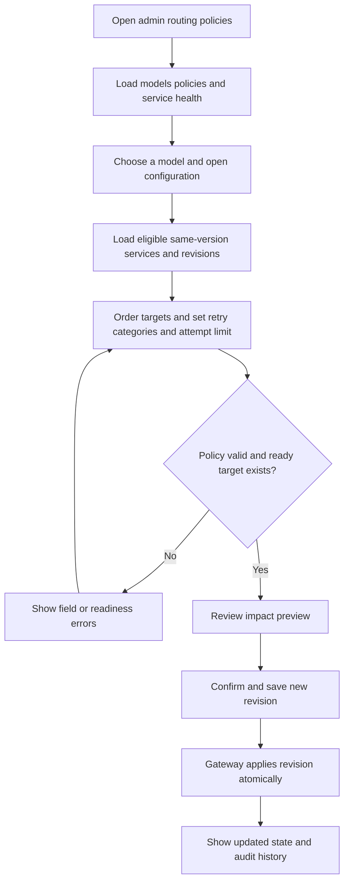
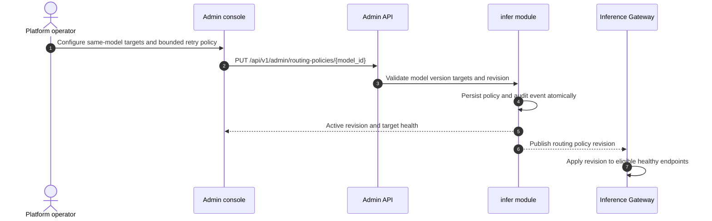

# Inference Routing Policies — Requirement Analysis and UI/UX Design

| Attribute | Content |
| --- | --- |
| Feature point | Admin-controlled same-model deployment priority and bounded failover (backlog row 45) |
| Document scope | Configure ordered healthy inference-service targets and retryable failures for one model; inspect target health and validate routing policy behavior |
| Owning modules | `infer` (policy and service eligibility), Inference Gateway routing (apply policy before response commitment), `audit` (policy changes), `web` admin console |
| Related documents | [Architecture Design](./architecture.md) — inference gateway routing and `infer` endpoint registration · [Model Catalog & One-Click Deployment](./model-catalog-deployment.md) — inference services and model identity · [Multi-Cluster Management](./multi-cluster-management.md) — cluster placement · [Request Tracing](./request-tracing.md) — request path visibility · [Console Surface Separation](./console-surface-separation.md) |
| Status | Design complete; handoff pending |

## 1. Background and Competitive Research

The Inference Gateway already selects healthy instances for a requested model, balances traffic, and retries on failure. Operators can deploy multiple inference services, but have no console control over which same-model service is preferred, which failures may be retried, or how many attempts are allowed. This feature adds explicit policy configuration and a compact health view without changing the requested model or exposing routing internals to tenants.

### 1.1 Comparable products

| Product | Documented pattern | go-taas decision |
| --- | --- | --- |
| LiteLLM Router | Supports deployment ordering, weighted distribution, cooldowns, bounded retries, and cross-model fallbacks. Its docs distinguish retries among deployments from switching model groups. | Adopt visible ordered same-model targets and bounded retryable-error settings. Defer weights, cooldown tuning, and cross-model fallback to avoid an oversized policy surface and unexpected price/model changes. |
| OpenRouter | Documents provider ordering, automatic load balancing, provider fallbacks, and an option to disable fallback. | Adopt explicit ordering and clear fallback enablement; keep the policy platform-managed, not caller-controlled, and retain one go-taas model identity. |
| Kubernetes / Argo Rollouts | Health and rollout states gate which endpoints receive traffic. | Reuse the platform's ready/healthy endpoint projection; do not expose Kubernetes pod or rollout objects in the console. |

Research: [LiteLLM Router and Load Balancing](https://docs.litellm.ai/docs/routing) and [OpenRouter Provider Routing](https://openrouter.ai/docs/features/provider-routing). Documented patterns demonstrate operator-visible preference/failover controls; they also show that broad fallback can cross model groups and that retries need explicit bounds. go-taas adopts only ordered same-model endpoints and bounded retries. It rejects cross-model fallback, weighted/cost-based routing, caller-supplied policy, and retries after response streaming begins.

### 1.2 Decisions and scope

| # | Decision | Rationale |
| --- | --- | --- |
| D1 | Policy is admin-only: `/admin/routing-policies` and `/api/v1/admin/routing-policies/*`. No end-user policy page or user API is defined. | Routing changes affect shared service availability and platform spend; tenant consumers should call a stable model name. |
| D2 | A policy targets one catalog model and may order only active inference services serving that exact model and version. Only ready endpoints receive traffic; if the preferred target is unhealthy, the gateway advances to the next eligible target. | Prevents silent model/version substitution and makes service eligibility inspectable. |
| D3 | V1 supports ordered targets, enable/disable, a maximum of three total attempts, and retry categories: connection/timeout before response, HTTP 429, and HTTP 5xx. It never retries client errors other than 429, client cancellation, or after the first streamed response byte. | Bounds latency and duplicate-work risk while keeping transient failure recovery useful. |
| D4 | If no eligible target is ready, fail closed with the existing model-unavailable response; do not route to another model or version. | Preserves API identity, model authorization, pricing, and tenant expectation. |
| D5 | A policy change is validated atomically, takes effect as one new revision, and is audited with actor, timestamp, and before/after fields. Invalid updates leave the prior revision active. | Operators need predictable activation and a reviewable change history. |
| D6 | The UI shows current target readiness and last health update, but does not promise an availability SLA or expose raw pod details. | Health signals are operational snapshots, not guarantees; preserve the masked admin-facing projection. |

**In scope:** one admin policy list/configuration page, per-model target order, retryable error categories, enable/disable, target readiness, validation, and audit history. **Out of scope:** user-defined policy, cross-model/version fallback, weighted/cost/latency routing, canary traffic, arbitrary header/body overrides, manual cooldown controls, per-tenant policy, and raw Kubernetes objects.

## 2. Roles and User Stories

### End-user surface

No end-user page or API is provided. Tenant developers and Agents continue to request the public model identifier through the existing inference API. They do not select a deployment, learn service IDs, or control retry behavior. User sessions cannot access the admin policy route or API.

### Admin surface

| Role | User story |
| --- | --- |
| Platform operator | As an operator, I want to order healthy deployments of the same model and version so that the preferred service receives traffic and a peer can take over during a transient failure. |
| Platform operator | As an operator, I want to limit retries to safe transient failures and a small attempt count so that availability improves without unbounded latency or duplicate execution. |
| Platform operator | As an operator, I want to see each target's readiness and the active policy revision before saving so that I can avoid enabling a policy with no usable endpoint. |
| Platform auditor | As an auditor, I want each change to show its actor, time, and before/after policy so that routing changes are attributable. |

## 3. Functional Requirements

### FR1 — Policy discovery and target selection

- **FR1.1** The admin page lists catalog models and their policy state: disabled/default, enabled, or invalid/unavailable; include model name/version, eligible target count, ready target count, attempt limit, and updated time.
- **FR1.2** Selecting a model opens its configuration drawer and loads only active inference services matching that exact model ID and version. Each target shows service name, accelerator/card type, cluster (when present), desired/ready replicas, endpoint readiness, and last health update. Never display endpoint secrets or pod names.
- **FR1.3** Operators can reorder 1–10 eligible services using drag-and-drop and keyboard controls. Duplicate targets are rejected. Ineligible, terminated, or mismatched-version services cannot be added. A policy may be saved disabled with no targets; enabling requires at least one ready eligible target.
- **FR1.4** Models without eligible services remain visible with an explanatory empty state and cannot be enabled. A newly deployed eligible service appears after refresh without changing an existing policy.

### FR2 — Retry policy and activation

- **FR2.1** Fields: policy enabled toggle; ordered target list; maximum total attempts (1–3, default 1); retry categories (connection/timeout before response, HTTP 429, HTTP 5xx). Categories are checkboxes; attempts are a select/stepper.
- **FR2.2** Attempts include the first target attempt. The effective number is capped by the smaller of configured attempts and eligible ordered targets. Retry proceeds to the next target once per request; a target is not retried twice in one request.
- **FR2.3** Retries are prohibited for HTTP 4xx other than 429, client cancellation, and any failure after response streaming begins. If the stream starts, the gateway terminates the stream rather than switching targets.
- **FR2.4** Save validates the complete policy atomically. Enabling with no ready targets, selecting an ineligible target, or setting retries with no retryable category is rejected inline; existing active policy remains unchanged.
- **FR2.5** Before enable/save, show an impact summary: requested model/version remains unchanged, target order, maximum attempts, and that each retry can add latency and provider work. Saving requires explicit confirmation when enabling or changing an enabled policy.
- **FR2.6** Policy changes create an immutable revision and audit event. The drawer shows the latest 20 revisions with actor, timestamp, change summary, and before/after values; no rollback action is included in this increment.

### FR3 — Gateway behavior and observability

- **FR3.1** For a request, the gateway resolves only eligible healthy endpoints for the requested model/version and applies the active ordered policy. With policy disabled or absent, current default healthy-instance balancing remains unchanged.
- **FR3.2** The gateway does not change the external model value, model authorization, request body, billing price, or user-visible model identity when trying another target for that same model/version.
- **FR3.3** Existing request tracing records the selected service and ordered attempt outcomes for admin diagnostics. User request logs continue to expose the requested model only and do not expose internal service IDs.
- **FR3.4** Policy read/write and health APIs require the admin session realm and admin authorization. Tenant isolation rules do not make an admin policy organization-editable; this is platform-wide configuration.

## 4. Surface Assignment

| Feature | Surface | Web route | Exact API route(s) |
| --- | --- | --- | --- |
| Browse model routing policies | admin | `/admin/routing-policies` | `GET /api/v1/admin/routing-policies` |
| Load policy and eligible service targets | admin | `/admin/routing-policies` | `GET /api/v1/admin/routing-policies/{model_id}`, `GET /api/v1/admin/models`, `GET /api/v1/admin/inference-services?model_id={model_id}` |
| Save/activate a policy revision | admin | `/admin/routing-policies` | `PUT /api/v1/admin/routing-policies/{model_id}` |
| Inspect target health and policy history | admin | `/admin/routing-policies` | `GET /api/v1/admin/routing-policies/{model_id}/health`, `GET /api/v1/admin/routing-policies/{model_id}/revisions` |
| Consume a model through the inference gateway | end-user | Existing inference clients; no new console page | Existing inference gateway `/v1/chat/completions`, `/v1/completions`, `/v1/embeddings`; no new `/api/v1/*` management API |

Every designed console page belongs only to the admin surface. The page uses the admin session realm, calls only `/api/v1/admin/*`, and never calls `/api/v1/*`. There is no `/admin/login` sharing with the user realm, no user policy page, and no `/api/v1/admin` call is made by an end-user page.

## 5. UI Design Per Page

### 5.1 `/admin/routing-policies` — Model Routing Policies

**Purpose.** Let platform operators configure safe, explainable same-model deployment preference and bounded failover.

**Layout.** Render in `AdminShell` under an Operations navigation group. Header: **Routing policies**, concise description, and **Refresh** icon action. A filter row has model-name search, policy-state filter (All / Default / Enabled / Unavailable), and accelerator filter. Main paginated table (20 rows) columns: **Model**, **Version**, **Policy**, **Ready targets**, **Attempts**, **Updated**, **Actions**. Sort by model, ready targets, and updated time; filter by state/accelerator; search by model name. Row action **Configure** opens a right-side drawer; no second route or shared user view.

**Page states.** Default shows current policy rows. Loading uses row skeletons and disables filters/refresh. Empty catalog says “No models are available.” with a link to `/admin/models`. Empty filter says “No models match these filters.” Error shows “Could not load routing policies.” with **Retry** and retains stale rows labeled with their last refresh time. Disabled state applies to refresh/filter controls while a request is pending. Permission denied shows “You do not have access to routing policies.” and a link to `/admin`; do not render policy data. If policies fail to load but models load, show models with an **Unknown** policy state and disable edit until retry.

**Configuration drawer.** Header shows model name, immutable version, current revision, and close action. Sections:

1. **Policy**: enabled toggle; explanatory text “This policy only routes requests among deployments of this exact model and version.”
2. **Ordered targets**: reorderable list with service name, accelerator/card type, cluster, ready/desired replicas, and health timestamp; **Add target** menu contains eligible services only. Provide move-up/down buttons for keyboard operation. A target that becomes unhealthy remains listed with a warning but is skipped by the gateway. Remove requires no confirmation while editing unsaved state.
3. **Retry behavior**: attempts select 1, 2, or 3 total; checkboxes for connection/timeout before response, HTTP 429, and HTTP 5xx. Inline note says 4xx (except 429), client cancellation, and failures after stream start are never retried.
4. **Impact preview**: exact model/version, ordered target names, maximum possible attempts, and latency/work warning. Preview updates as fields change.
5. **Revision history**: newest 20 revisions; columns **Revision**, **Changed**, **Actor**, **Summary**. Selecting a row opens read-only before/after diff.

**Validation and copy.** Model/targets load failure: “Could not load eligible deployments. Retry before saving.” No matching services: “No active deployment serves this exact model version.” No ready services: “At least one deployment must be ready before enabling this policy.” Invalid target: “This deployment does not serve the selected model version.” Attempts without categories: “Select at least one retryable failure or set attempts to 1.” Concurrent update conflict: “This policy changed since you opened it. Reload the latest revision before saving.” Generic save error: “Routing policy was not changed.” Preserve unsaved values and keep the previous revision active.

**Actions and confirmation.** **Save** stays disabled until valid and dirty; pending save disables close and all fields. On enabling or changing an enabled policy, show a confirmation dialog: “Apply routing policy for {model} {version}? Requests may use the listed deployments in order. Retries can increase latency and provider work.” Buttons **Apply policy** and **Cancel**. Disabling asks “Disable this policy? The gateway will return to its default healthy-instance balancing.” Success closes the dialog, shows “Routing policy updated.” and refreshes revision/state. Cancel discards unsaved changes only after a discard confirmation.

**Failure/permission states in drawer.** Drawer loading shows skeleton target rows. Policy not found means default policy, not an error. Unknown model shows “Model not found” with **Back to policies**. Read-only users can inspect configuration/history but controls and Save are disabled with “You can view routing policies but cannot change them.” Admin authorization denial uses the page permission state, never partial data.

### 5.2 Interaction Flow

## 6. API Surface Implications

All policy and health routes are admin-only. The Architect should bind these operations only beneath `/api/v1/admin/routing-policies/*`; no `/api/v1/routing-policies/*` or `/api/v1/admin` routes on a user page are introduced.

| Operation | Exact route | Purpose |
| --- | --- | --- |
| `ListRoutingPolicies` | `GET /api/v1/admin/routing-policies` | Paginated model policy summaries and filters |
| `GetRoutingPolicy` | `GET /api/v1/admin/routing-policies/{model_id}` | Policy/default state, eligible target IDs, revision and retry settings |
| `UpdateRoutingPolicy` | `PUT /api/v1/admin/routing-policies/{model_id}` | Validate and atomically activate a new revision |
| `ListRoutingTargetHealth` | `GET /api/v1/admin/routing-policies/{model_id}/health` | Ready/desired replica and endpoint readiness projection by eligible service |
| `ListRoutingPolicyRevisions` | `GET /api/v1/admin/routing-policies/{model_id}/revisions` | Immutable, paginated change history with actor and before/after values |
| Model selector | `GET /api/v1/admin/models` | Existing admin model catalog |
| Service selector | `GET /api/v1/admin/inference-services?model_id={model_id}` | Existing admin service inventory, filtered to exact model/version eligibility |
| Inference execution | `/v1/chat/completions`, `/v1/completions`, `/v1/embeddings` | Existing inference gateway; policy is applied internally and does not alter the caller contract |

Update payload includes `enabled`, ordered `service_ids`, `max_attempts` (1–3), `retry_on` enum values, and `expected_revision` for optimistic concurrency. The response includes the new revision, normalized effective attempt count, eligible/ready target summary, and update timestamp. A target ID outside the selected model/version or a policy with no ready target when enabled is rejected without changing the active revision. Policy changes emit an audit event. The gateway publishes only the active revision and fails closed to the requested model when no eligible endpoint remains.

## 7. Acceptance Criteria

| # | Criterion | Level |
| --- | --- | --- |
| AC1 | `/admin/routing-policies` is reachable only in the admin session realm and lists model, version, policy state, ready-target count, attempt limit, and update time. | Nightwatch E2E |
| AC2 | Opening a model shows only active inference services for that exact model ID and version with readiness, replica counts, accelerator/card, and health timestamp; no pod names or endpoint secrets appear. | Nightwatch E2E |
| AC3 | Targets can be reordered by pointer and keyboard controls; duplicate, terminated, mismatched-version, or otherwise ineligible targets cannot be saved. | Nightwatch E2E |
| AC4 | Enabling with zero ready targets is blocked with the specified inline message; an enabled policy can be disabled and the default balancing state is shown. | Nightwatch E2E |
| AC5 | Attempts are constrained to 1–3 total; retry categories are limited to pre-response connection/timeout, 429, and 5xx; attempts above one with no retry category cannot be saved. | Nightwatch E2E |
| AC6 | The impact confirmation names the model/version, target order, attempt limit, and retry latency/work warning; cancel leaves the active revision unchanged. | Nightwatch E2E |
| AC7 | Successful save creates a revision and audit entry with actor/time/diff; stale expected revision is rejected and the UI retains unsaved input with a reload action. | Nightwatch E2E + FVT |
| AC8 | Runtime policy tries only healthy targets for the exact requested model/version, respects the configured attempt cap, and never retries client cancellation, non-429 4xx, or after streaming starts. | FVT + Nightwatch E2E |
| AC9 | If every eligible target is unavailable, the request returns the existing model-unavailable response; it never switches model/version or changes the public model identity. | FVT + Nightwatch E2E |
| AC10 | Admin policy pages call only `/api/v1/admin/*`; the user surface has no policy page or management API, and user sessions cannot read or update policies. | Nightwatch E2E |
| AC11 | Default behavior remains unchanged for models with no enabled routing policy, and the page provides loading, empty, stale-error, disabled, and permission-denied states. | Nightwatch E2E |
