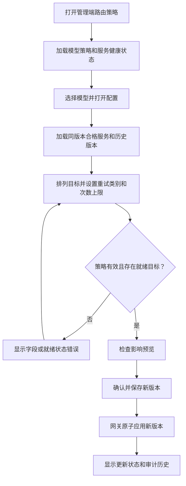
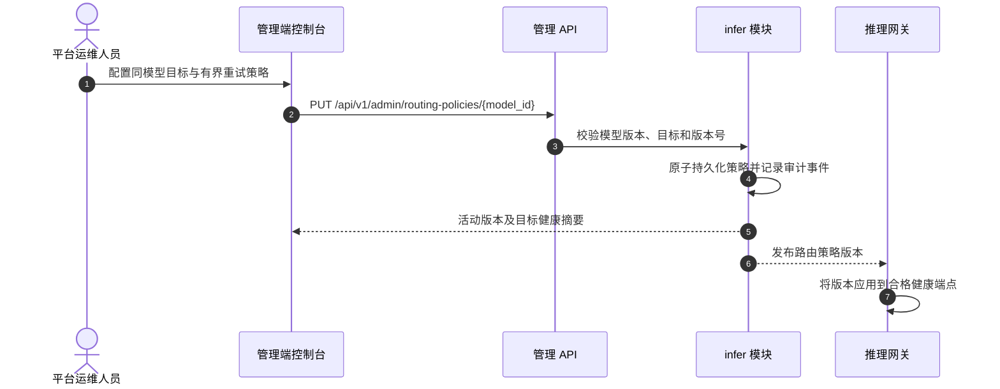

# 推理路由策略 — 需求分析与 UI/UX 设计

| 属性 | 内容 |
| --- | --- |
| 功能点 | 管理端控制的同模型部署优先级与有界故障转移（backlog 第 45 行） |
| 文档范围 | 为单个模型配置有序的健康推理服务目标和可重试故障，并检查目标健康状态及路由策略行为 |
| 所属模块 | `infer`（策略与服务资格）、推理网关路由（响应提交前应用策略）、`audit`（策略变更）、`web` 管理端控制台 |
| 相关文档 | [架构设计](./architecture.zh-cn.md) — 推理网关路由和 `infer` 端点注册 · [模型目录与一键部署](./model-catalog-deployment.zh-cn.md) — 推理服务和模型标识 · [多集群管理](./multi-cluster-management.zh-cn.md) — 集群放置 · [请求追踪](./request-tracing.zh-cn.md) — 请求路径可见性 · [控制台面分离](./console-surface-separation.zh-cn.md) |
| 状态 | 设计完成，待移交 |

## 1. 背景与竞品调研

推理网关已经会为请求的模型选择健康实例、进行负载均衡并在失败时重试。运维人员可以部署多个推理服务，但目前无法通过控制台指定同模型服务的优先级、可重试的失败类型或尝试次数上限。本功能增加明确的策略配置和精简的健康视图，不改变请求模型，也不向租户暴露路由内部信息。

### 1.1 竞品模式

| 产品 | 文档说明的模式 | go-taas 决策 |
| --- | --- | --- |
| LiteLLM Router | 支持部署排序、加权分流、冷却、有界重试和跨模型回退；文档区分同组部署重试与切换模型组。 | 采用可见的同模型目标排序和有界的可重试错误设置。暂不做权重、冷却调参和跨模型回退，避免策略界面过大及意外改变价格/模型。 |
| OpenRouter | 记录了供应商排序、自动负载均衡、供应商回退及禁用回退的选项。 | 采用明确排序和清晰的回退开关；策略由平台管理，不由调用方控制，并保持 go-taas 模型标识不变。 |
| Kubernetes / Argo Rollouts | 健康与发布状态决定哪些端点接收流量。 | 复用平台已有的就绪/健康端点投影，不在控制台暴露 Kubernetes Pod 或发布对象。 |

调研来源：[LiteLLM Router 与负载均衡](https://docs.litellm.ai/docs/routing) 和 [OpenRouter 供应商路由](https://openrouter.ai/docs/features/provider-routing)。这些文档展示了运维可见的优先级/故障转移控制，也说明广义回退可能跨模型组，而且重试必须有明确上限。go-taas 仅采用同模型端点有序路由和有界重试；不采用跨模型回退、加权/成本路由、调用方指定策略或响应流开始后的重试。

### 1.2 决策与范围

| # | 决策 | 理由 |
| --- | --- | --- |
| D1 | 策略仅属于管理端：`/admin/routing-policies` 和 `/api/v1/admin/routing-policies/*`。不定义终端用户策略页面或用户 API。 | 路由变更影响共享服务可用性和平台支出；租户调用稳定的模型名称即可。 |
| D2 | 策略针对一个目录模型，只能排序服务该模型和版本的活动推理服务。只有就绪端点接收流量；首选目标不健康时，网关继续尝试下一个合格目标。 | 避免悄然替换模型/版本，并使服务资格可检查。 |
| D3 | V1 支持目标排序、启用/禁用、最多三次总尝试，以及可重试类别：响应前连接/超时、HTTP 429 和 HTTP 5xx。除 429 外不重试客户端错误；客户端取消或首个流式响应字节发出后也不重试。 | 在改善临时故障恢复的同时限制延迟和重复执行风险。 |
| D4 | 如果没有合格的就绪目标，则返回现有的模型不可用响应；不得路由到其他模型或版本。 | 保持 API 标识、模型授权、价格和租户预期不变。 |
| D5 | 策略变更经过整体校验后，以一个新版本生效，并记录包含操作者、时间及变更前后字段的审计事件。无效更新不得改变当前活动版本。 | 运维人员需要确定的生效行为和可追溯的变更记录。 |
| D6 | 界面展示目标当前就绪状态和最近健康更新时间，但不承诺可用性 SLA，也不暴露原始 Pod 详情。 | 健康信号是运维快照而非保证；保持面向运维的脱敏投影。 |

**范围内：** 一个管理端策略列表/配置页面、每模型目标顺序、可重试错误类别、启用/禁用、目标就绪状态、校验和审计历史。**范围外：** 用户自定义策略、跨模型/版本回退、加权/成本/延迟路由、金丝雀流量、任意请求头/请求体覆盖、手动冷却调参、按租户策略及原始 Kubernetes 对象。

## 2. 用户角色与故事

### 终端用户面

不提供终端用户页面或 API。租户开发者和智能体继续通过现有推理 API 请求公开模型标识。他们不选择部署、不接触服务 ID，也不控制重试行为。用户会话不能访问管理端策略路由或 API。

### 管理端面

| 角色 | 用户故事 |
| --- | --- |
| 平台运维人员 | 作为运维人员，我希望为同一模型和版本下的健康部署排序，以便首选服务优先承接流量，并在临时故障期间由同组服务接管。 |
| 平台运维人员 | 作为运维人员，我希望仅对安全的临时故障重试并限制尝试次数，以提高可用性，同时避免无界延迟或重复执行。 |
| 平台运维人员 | 作为运维人员，我希望在保存前查看每个目标的就绪状态和活动策略版本，以避免启用没有可用端点的策略。 |
| 平台审计人员 | 作为审计人员，我希望每次变更都记录操作者、时间及变更前后策略，以便追踪路由变更。 |

## 3. 功能需求

### FR1 — 策略发现与目标选择

- **FR1.1** 管理端页面列出目录模型及策略状态：禁用/默认、已启用或无效/不可用；包含模型名/版本、合格目标数、就绪目标数、尝试上限和更新时间。
- **FR1.2** 选择模型后打开配置抽屉，只加载该模型 ID 和版本匹配的活动推理服务。每个目标显示服务名、加速器/卡型、集群（如有）、期望/就绪副本数、端点就绪情况及最近健康更新时间。不得显示端点密钥或 Pod 名称。
- **FR1.3** 运维人员可通过拖放和键盘操作对 1–10 个合格服务排序。拒绝重复目标；不能添加不合格、已终止或版本不匹配的服务。策略可以在无目标时保存为禁用状态；启用前必须至少有一个合格就绪目标。
- **FR1.4** 没有合格服务的模型仍显示，并说明原因，且不能启用策略。刷新后，新部署的合格服务可以出现，但不得改变现有策略。

### FR2 — 重试策略与启用

- **FR2.1** 字段：策略启用开关、有序目标列表、最多总尝试次数（1–3，默认 1）、可重试类别（响应前连接/超时、HTTP 429、HTTP 5xx）。错误类别使用复选框，尝试数使用选择器/步进控件。
- **FR2.2** 尝试次数包含首次目标调用。实际次数取配置值与合格有序目标数中的较小值。每个请求只尝试下一个目标；同一请求不会重复尝试同一目标。
- **FR2.3** 不重试客户端取消、除 429 外的 HTTP 4xx，以及响应流开始后的任何失败。流一旦开始，网关结束该流而不切换目标。
- **FR2.4** 保存时整体校验策略。无就绪目标时启用、选择不合格目标、或设置大于 1 的尝试次数但未选择可重试类别，都会显示行内错误；现有活动策略保持不变。
- **FR2.5** 启用/保存前显示影响摘要：请求的模型/版本保持不变、目标顺序、尝试次数上限，以及每次重试可能增加延迟和供应商工作量的提示。启用或修改已启用策略时需要明确确认。
- **FR2.6** 策略变更创建不可变版本和审计事件。抽屉展示最近 20 个版本，含操作者、时间、变更摘要和变更前后值；本次增量不提供回滚操作。

### FR3 — 网关行为与可观测性

- **FR3.1** 网关收到请求后，仅解析请求模型/版本对应的合格健康端点，并应用活动有序策略。策略缺失或禁用时，现有默认健康实例均衡行为保持不变。
- **FR3.2** 网关尝试同一模型/版本的其他目标时，不更改外部模型值、模型授权、请求体、计费价格或用户可见模型标识。
- **FR3.3** 现有请求追踪为管理端诊断记录实际服务和有序尝试结果。用户请求日志仍只显示请求模型，不暴露内部服务 ID。
- **FR3.4** 策略读写和健康 API 要求管理端会话域及管理员授权。配置属于平台级，不因租户隔离变成组织可编辑配置。

## 4. 面分配

| 功能 | 面 | Web 路由 | 精确 API 路由 |
| --- | --- | --- | --- |
| 浏览模型路由策略 | 管理端 | `/admin/routing-policies` | `GET /api/v1/admin/routing-policies` |
| 加载策略与合格服务目标 | 管理端 | `/admin/routing-policies` | `GET /api/v1/admin/routing-policies/{model_id}`、`GET /api/v1/admin/models`、`GET /api/v1/admin/inference-services?model_id={model_id}` |
| 保存/启用策略版本 | 管理端 | `/admin/routing-policies` | `PUT /api/v1/admin/routing-policies/{model_id}` |
| 检查目标健康和策略历史 | 管理端 | `/admin/routing-policies` | `GET /api/v1/admin/routing-policies/{model_id}/health`、`GET /api/v1/admin/routing-policies/{model_id}/revisions` |
| 通过推理网关调用模型 | 终端用户 | 现有推理客户端；无新增控制台页面 | 现有推理网关 `/v1/chat/completions`、`/v1/completions`、`/v1/embeddings`；无新增 `/api/v1/*` 管理 API |

每个设计的控制台页面只属于管理端。页面使用管理端会话域，只调用 `/api/v1/admin/*`，不调用 `/api/v1/*`。不复用 `/admin/login` 的用户会话域；没有用户策略页面，也没有用户页面调用 `/api/v1/admin`。

## 5. 每页 UI 设计

### 5.1 `/admin/routing-policies` — 模型路由策略

**用途。** 让平台运维人员配置安全、可解释的同模型部署优先级和有界故障转移。

**布局。** 在 `AdminShell` 的运维导航组中渲染。页头为**路由策略**、简短说明和**刷新**图标操作。筛选区包含模型名搜索、策略状态筛选（全部/默认/已启用/不可用）和加速器筛选。主表每页 20 行，列为：**模型**、**版本**、**策略**、**就绪目标**、**尝试次数**、**更新时间**、**操作**。支持按模型、就绪目标数和更新时间排序；按状态/加速器筛选；按模型名搜索。行操作**配置**打开右侧抽屉；不设第二个路由或与用户共享的视图。

**页面状态。** 默认显示当前策略。加载时显示行骨架并禁用筛选/刷新。目录为空显示「暂无可用模型。」并提供 `/admin/models` 链接。筛选结果为空显示「没有符合条件的模型。」错误显示「无法加载路由策略。」和**重试**，保留旧行并标注最近刷新时间。请求期间禁用刷新/筛选。权限不足显示「你无权访问路由策略。」及 `/admin` 链接，不渲染策略数据。若策略加载失败但模型已加载，则模型显示**未知**策略状态，重试成功前禁用编辑。

**配置抽屉。** 标题显示模型名、不可变版本、当前版本号和关闭操作。分区如下：

1. **策略**：启用开关；说明「此策略只会在此模型和版本的部署之间路由请求。」
2. **有序目标**：可排序列表，显示服务名、加速器/卡型、集群、就绪/期望副本数和健康时间；**添加目标**菜单只包含合格服务。提供上移/下移按钮支持键盘操作。目标变为不健康时保留在列表并显示警告，但网关会跳过。编辑中的移除不需确认。
3. **重试行为**：尝试次数选择 1、2 或 3 次总尝试；复选框选择响应前连接/超时、HTTP 429 和 HTTP 5xx。行内说明：除 429 外的 4xx、客户端取消及流开始后的失败均不会重试。
4. **影响预览**：精确模型/版本、有序目标名称、最大尝试次数，以及延迟/工作量提示。编辑字段时同步更新。
5. **版本历史**：最近 20 个版本；列为**版本**、**变更时间**、**操作者**、**摘要**。选择行后只读查看前后差异。

**校验与文案。** 模型/目标加载失败：「无法加载合格部署。重试成功前不能保存。」没有匹配服务：「没有活动部署服务于此模型版本。」没有就绪服务：「启用此策略前，至少需要一个就绪部署。」目标无效：「此部署不服务于所选模型版本。」设置尝试次数但未选错误类别：「请选择至少一种可重试故障，或将尝试次数设为 1。」并发版本冲突：「此策略已在打开后发生变更。请重新加载最新版本后再保存。」通用保存错误：「路由策略未变更。」保留未保存值，且原活动版本继续生效。

**操作和确认。****保存**仅在表单有效且有改动时启用；保存期间禁用关闭和全部字段。启用或修改已启用策略时弹出确认：「为 {model} {version} 应用路由策略？请求可能按顺序使用所列部署。重试可能增加延迟和供应商工作量。」按钮为**应用策略**和**取消**。禁用时确认：「禁用此策略？网关将恢复默认健康实例均衡。」成功后关闭确认框，提示「路由策略已更新。」并刷新版本/状态。取消未保存改动时先确认丢弃。

**抽屉失败/权限状态。** 加载时显示目标行骨架。策略不存在表示默认策略，不是错误。未知模型显示「未找到模型」和**返回策略列表**。只读用户可查看配置/历史，但所有控件及保存操作禁用，并显示「你可以查看路由策略，但不能更改。」管理权限不足时展示页面级拒绝状态，不显示部分数据。

### 5.2 交互流程

## 6. API 面影响

所有策略和健康路由均仅属于管理端。架构师应只在 `/api/v1/admin/routing-policies/*` 下绑定这些操作；不新增 `/api/v1/routing-policies/*`，也不让用户页面调用 `/api/v1/admin`。

| 操作 | 精确路由 | 用途 |
| --- | --- | --- |
| `ListRoutingPolicies` | `GET /api/v1/admin/routing-policies` | 分页列出模型策略摘要与筛选结果 |
| `GetRoutingPolicy` | `GET /api/v1/admin/routing-policies/{model_id}` | 读取策略/默认状态、合格目标 ID、版本和重试设置 |
| `UpdateRoutingPolicy` | `PUT /api/v1/admin/routing-policies/{model_id}` | 校验并原子启用新版本 |
| `ListRoutingTargetHealth` | `GET /api/v1/admin/routing-policies/{model_id}/health` | 按合格服务返回就绪/期望副本数和端点就绪投影 |
| `ListRoutingPolicyRevisions` | `GET /api/v1/admin/routing-policies/{model_id}/revisions` | 分页读取含操作者及变更前后值的不可变历史 |
| 模型选择器 | `GET /api/v1/admin/models` | 现有管理端模型目录 |
| 服务选择器 | `GET /api/v1/admin/inference-services?model_id={model_id}` | 现有管理端服务清单，按精确模型/版本筛选资格 |
| 推理执行 | `/v1/chat/completions`、`/v1/completions`、`/v1/embeddings` | 现有推理网关；内部应用策略，不改变调用方契约 |

更新载荷包含 `enabled`、有序 `service_ids`、`max_attempts`（1–3）、`retry_on` 枚举和用于乐观并发的 `expected_revision`。响应包含新版本、规范化后的有效尝试次数、合格/就绪目标摘要和更新时间。若目标 ID 不属于所选模型/版本，或启用时没有就绪目标，则拒绝请求且不改变活动版本。策略变更产生审计事件。网关只发布活动版本；没有合格端点时，对请求模型故障关闭。

## 7. 验收标准

| # | 标准 | 级别 |
| --- | --- | --- |
| AC1 | `/admin/routing-policies` 仅能通过管理端会话访问，并列出模型、版本、策略状态、就绪目标数、尝试上限和更新时间。 | Nightwatch E2E |
| AC2 | 打开模型后只显示该模型 ID 和版本的活动推理服务，展示就绪状态、副本数、加速器/卡型和健康时间；不出现 Pod 名称或端点密钥。 | Nightwatch E2E |
| AC3 | 可用鼠标和键盘控件排序目标；不能保存重复、已终止、版本不匹配或其他不合格目标。 | Nightwatch E2E |
| AC4 | 就绪目标数为零时不能启用，并显示指定行内文案；可禁用已启用策略并看到默认均衡状态。 | Nightwatch E2E |
| AC5 | 尝试次数限制为总计 1–3 次；重试类别仅限响应前连接/超时、429 和 5xx；尝试次数大于 1 但未选择重试类别时无法保存。 | Nightwatch E2E |
| AC6 | 影响确认包含模型/版本、目标顺序、尝试次数上限及延迟/工作量提示；取消后活动版本不变。 | Nightwatch E2E |
| AC7 | 保存成功后创建版本和包含操作者/时间/差异的审计记录；过期的预期版本会被拒绝，界面保留未保存内容并提供重新加载操作。 | Nightwatch E2E + FVT |
| AC8 | 运行时策略只尝试请求精确模型/版本下的健康目标，遵守尝试上限，并且不重试客户端取消、非 429 的 4xx 或流开始后的故障。 | FVT + Nightwatch E2E |
| AC9 | 所有合格目标都不可用时，请求返回现有模型不可用响应；不得切换模型/版本或改变公开模型标识。 | FVT + Nightwatch E2E |
| AC10 | 管理策略页面只调用 `/api/v1/admin/*`；用户面没有策略页面或管理 API，用户会话不能读取或更新策略。 | Nightwatch E2E |
| AC11 | 未配置或未启用策略的模型保持原有默认行为；页面具备加载、空数据、旧数据错误、禁用和权限不足状态。 | Nightwatch E2E |
