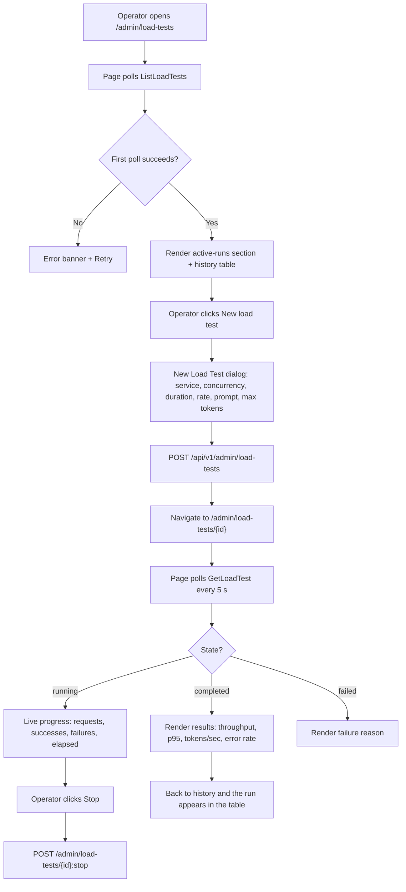
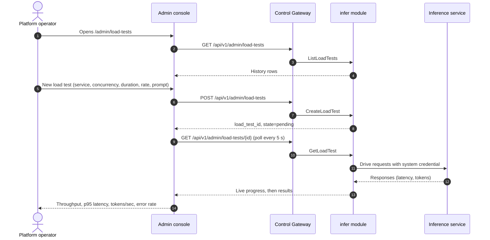

# Inference Load Testing — Requirement Analysis and UI/UX Design

| Attribute | Content |
| --- | --- |
| Feature point | Inference load testing — run a load test against an inference service and view throughput / latency / tokens-per-second results, with a history of past runs (backlog row 20) |
| Document scope | Requirement analysis, competitive research, the admin-surface load-testing page design for `/admin/load-tests` (configure, run, live progress, results, history), the end-user-surface read-only performance display on `/models/:modelId`, the page → API surface table, and numbered acceptance criteria |
| Owning modules | `infer` (owns inference services and the load-test runner that drives them), `web` admin console (`LoadTestsPage`, `LoadTestDetailPage`) and end-user console (`ModelDetailPage` performance section), `pkg/server` gateway (admin-prefix and user-prefix bindings) |
| Related documents | [Architecture Design](./architecture.md) — §2.4 `infer`, §4.2 one-click deployment flow · [Model Catalog & One-Click Deployment](./model-catalog-deployment.md) — the inference service this feature targets · [Request Logs & API Playground](./request-logs-playground.md) — the single-request test surface this feature scales up · [Inference Autoscaling](./inference-autoscaling.md) — the capacity context load tests inform · [Console Surface Separation](./console-surface-separation.md) — the two surfaces this feature spans |
| Status | Design complete, handed to the Architect agent |

---

## 1. Background

go-taas deploys inference services (feature #2) and autoscales them (feature #16). The operator's recurring question is *how well does this service actually serve under load?* — how many requests per second can it sustain, what latency does a user see at the tail, how many output tokens per second does it produce, and at what error rate. Today nothing answers that question. The playground (feature #12) sends a **single** test request through the real metered path and shows its latency and token usage, but a single request cannot reveal sustained throughput, tail latency under concurrency, or tokens-per-second under load. The operator has no way to measure a service's performance envelope before advertising it, before capacity planning, or before tuning autoscaling targets (feature #16).

This feature adds **inference load testing**: the operator configures a load test against a running inference service — concurrency, duration, and request rate — the platform drives real inference traffic at that service, and the console shows throughput, latency percentiles, tokens-per-second, and error rate, plus a history of past runs for comparison. It is the smallest independently valuable increment of Phase 4's productionization roadmap item: it turns "the service is running" into "the service performs at X req/s with Y ms p95 latency".

### 1.1 How Comparable Products Expose Inference Load Testing

| Product | Load-testing surface | What it measures | Run model | Notable pitfalls |
| --- | --- | --- | --- | --- |
| **vLLM `benchmark_serving.py`** | CLI benchmark against a running server | Throughput (req/s, tokens/s), latency percentiles (TTFT, TPOT, E2E), concurrency, request rate | One-shot CLI run; results printed to stdout | Raw CLI output, not a product surface; no history; no live progress; requires the operator to run a script |
| **Hey / Vegeta / wrk** | CLI HTTP load testers | Throughput (req/s), latency percentiles, concurrency, duration, request rate | One-shot CLI run; results to stdout | Generic HTTP, not LLM-aware (no tokens/sec); no history; no console |
| **Grafana k6** | Scriptable load testing with a web dashboard (Grafana Cloud) | Throughput, latency percentiles, error rate, thresholds; concurrency (VUs), duration, rate | Scripted runs; results stream to a dashboard | Scripting is a developer skill; LLM token metrics need custom extensions; heavy tooling |
| **Together AI / SiliconFlow** | Endpoint QPS / latency metrics in the console | QPS and latency per endpoint | Passive monitoring, not active load generation | Passive metrics, not a configurable load test; no tokens/sec; no history of runs |
| **RunPod / Vast.ai** | Instance benchmark scores | Throughput / price on a fixed benchmark | Fixed benchmark, not user-configurable | Not configurable; not against the user's own service |

### 1.2 Distilled Patterns and Decisions

Patterns worth adopting: (1) **a guided configuration form** — vLLM's benchmark parameters (concurrency, duration, request rate) are exactly the fields an operator reasons about, and every surveyed tool reduces load testing to these; (2) **async run with live progress** — k6 and cloud dashboards stream results while the test runs, so the operator sees it working rather than waiting for a blocking call; (3) **a curated results dashboard** — vLLM's percentiles and tokens/sec are the right metrics, but they must be a product surface (cards + table), not stdout; (4) **history for comparison** — the operator needs to compare runs (before/after a config change, across card types) to make load testing useful; (5) **a stop action** — a long-running or misconfigured test must be cancellable.

Pitfalls to avoid: raw CLI output as the product surface (vLLM, Hey) — the console must curate results; a blocking HTTP call for a long test — the run must be async and polled; no live progress — the operator cannot tell if the test is working; no history — runs cannot be compared; a load test that bypasses the real inference path — results must reflect actual serving performance; and a load test that drains a tenant's balance — load testing is an operator activity and must not consume a tenant's funds.

**Decisions for go-taas**:

| # | Decision | Rationale |
| --- | --- | --- |
| D1 | **Load-test configuration and running are admin-surface only**: route `/admin/load-tests`, API prefix `/api/v1/admin/load-tests/*`. The page is added to the `AdminShell` navigation (feature #17) as "Load Tests" | Load testing drives real inference traffic and reads operator-orchestration state (services, replicas); it is an operator capability, not a tenant self-service |
| D2 | **The end-user console gets a read-only masked performance display** on the model detail page `/models/:modelId`, showing recent load-test results for the model (throughput, p95 latency, tokens/sec, error rate) with no service ids and no operator internals. API: `GET /api/v1/models/{model_id}/load-tests` | Tenants need a performance expectation for a model (cost/performance trade-off) but must not see operator orchestration internals; this follows feature #17's D15 masked-projection rule and the compatibility-matrix D7 pattern |
| D3 | **A load test is asynchronous**: `CreateLoadTest` returns immediately with `state = pending`; the state machine is `pending → running → completed / failed / stopped`. The page polls `GetLoadTest` while a test is running | A load test runs for seconds to an hour; blocking the HTTP call would time out. This matches the deployment async pattern (feature #2, D3) and the console's `usePolling` convention |
| D4 | **A load test targets a running inference service** (`state = running` with a non-empty endpoint). A service that is not running returns **10311 `CodeLoadTestTargetInvalid`** | Load testing measures a live service; a pending/deploying/failed/terminated service has no endpoint to drive. The endpoint comes from the API, never constructed by the client |
| D5 | **Config fields**: **Service** (required, running), **Concurrency** (integer 1–1000, default 1), **Duration** (integer seconds 5–3600, default 60), **Request rate** (integer req/s 0–10000, 0 = as fast as possible, default 0), **Prompt template** (required, ≤ 4096 chars), **Max tokens** (integer 1–8192, default 256) | Mirrors the vLLM/Hey/k6 parameter set in the smallest field list; request rate 0 = unlimited matches the "as fast as possible" convention of every surveyed tool |
| D6 | **Results are a curated set**: total requests, success count, failure count, error rate, throughput (req/s), output tokens/sec, input/output tokens, and latency percentiles p50 / p90 / p95 / p99. The console renders these as summary cards + a latency table; it never shows raw per-request output | vLLM's percentiles and tokens/sec are the canonical LLM-serving metrics; a curated projection keeps the console dependency-light and the surface scannable |
| D7 | **Load tests use a dedicated operator-scoped load-test credential** (a system key) that authenticates to the service's endpoint but does not consume a tenant's balance or trip a tenant's rate/spend limits. The traffic still produces request logs (feature #12) so load-test traffic is observable | Load testing is an operator activity; using a tenant key would drain the tenant's balance and could be blocked by the tenant's limits. A system credential keeps load tests free to the tenant while remaining visible in request logs |
| D8 | **New error codes in the infer block (10308–10399)**: **10308 `CodeLoadTestNotFound`**, **10309 `CodeLoadTestConfigInvalid`**, **10310 `CodeLoadTestStateInvalid`**, **10311 `CodeLoadTestTargetInvalid`** | Load testing belongs to `infer` (D1's module), so its codes live in the infer block after 10307 (feature #16); distinct codes keep "not found" vs "bad config" vs "bad state" vs "bad target" actionable |
| D9 | **Load-test history is retained (90 days) and listed with pagination**; a completed run is immutable (config + results are fixed once `completed`). A running test can be stopped; a completed test can be deleted | History is the comparison surface (D1's pattern); immutability keeps results trustworthy; 90-day retention matches the request-log retention (feature #12) |
| D10 | **The load-test runner lives in the `infer` module** as a goroutine-based load generator that drives the service's endpoint with the system credential (D7) and aggregates results; it is not a separate deployment | The runner targets inference services and generates inference traffic, which is `infer`'s responsibility; a goroutine-based generator avoids a new service and keeps the run in-process with the gRPC server |

## 2. Goals and Non-goals

**Goals**: an admin page `/admin/load-tests` that configures and runs a load test against a running inference service (concurrency, duration, request rate, prompt, max tokens), shows live progress while running, and displays curated results (throughput, latency percentiles, tokens/sec, error rate) with a history of past runs (D1, D3, D5, D6, D9); a stop action for running tests and delete for completed ones (D9); a read-only masked performance display on the end-user model detail page `/models/:modelId` (D2); the page → API surface table with exact prefixes (D1, D2); per-page interactive states including empty, error, and permission-denied; numbered acceptance criteria testable in Nightwatch against the compose stack.

**Non-goals**: load-test scheduling or recurring tests (a future refinement); comparing runs side-by-side in a chart (v1 shows history as a table; a comparison chart is future work); TTFT/TPOT split (v1 reports end-to-end latency percentiles and tokens/sec, not the prefill/decode split); a load-test script editor (v1 uses a prompt template, not a script); tenant-initiated load tests (D1); exposing service ids or operator internals to tenants (D2); a Grafana-style metrics dashboard over time (out of scope — this is a point-in-time measurement surface).

## 3. Personas and Journeys

| Role | Surface | Journey |
| --- | --- | --- |
| **Platform operator** | admin | Opens `/admin/load-tests` → configures a load test against a running service (concurrency 8, duration 60 s, rate 0) → watches live progress → sees throughput, p95 latency, tokens/sec, error rate → decides whether the service meets the SLO |
| **Platform operator (capacity)** | admin | Before advertising a model, runs a load test on each card type → compares history rows → picks the card type that meets the latency/throughput target |
| **Platform operator (autoscaling)** | admin | Runs a load test to find the concurrency at which p95 latency degrades → uses that to set the autoscaling target concurrency (feature #16) |
| **Support engineer** | admin | A tenant reports slow responses → runs a load test on the service → sees high p95 latency or a high error rate → investigates the service or the node |
| **Tenant developer / Agent** | end-user | Opens `/models/:modelId` → sees the model's recent load-test performance (throughput, p95 latency, tokens/sec) → picks a model knowing its performance profile, without seeing operator internals |

> Terminology: the consumer-side caller is an **Agent** in English and 「智能体」 in Chinese, consistent with the repository convention.

## 4. Feature Requirements

### FR1 — Load test configuration and run

- **FR1.1** `CreateLoadTest` (`POST /api/v1/admin/load-tests`) takes `service_id`, `concurrency` (1–1000), `duration_seconds` (5–3600), `request_rate` (0–10000, 0 = unlimited), `prompt_template` (≤ 4096 chars), and `max_tokens` (1–8192). It validates the config synchronously and returns `load_test_id` with `state = pending` immediately (D3).
- **FR1.2** The target service must be `running` with a non-empty endpoint; otherwise the call returns **10311 `CodeLoadTestTargetInvalid`** (D4). An invalid config (out-of-range concurrency, duration, rate, or max tokens; empty prompt) returns **10309 `CodeLoadTestConfigInvalid`**.
- **FR1.3** The load test transitions `pending → running → completed / failed / stopped` (D3). A `failed` run carries a human-readable reason (e.g. the service became unavailable mid-run).

### FR2 — Load test queries

- **FR2.1** `ListLoadTests` (`GET /api/v1/admin/load-tests`) returns the history, filterable by `service_id`, `status`, and `model_id`, searchable by service name, and paginated (`offset`/`limit`, default 20, max 100). Each row carries `load_test_id`, `service_id`, `service_name`, `model_id`, `model_name`, `concurrency`, `duration_seconds`, `request_rate`, `status`, `started_at`, `completed_at`, and a result summary (throughput, p95 latency, tokens/sec, error rate) when completed.
- **FR2.2** `GetLoadTest` (`GET /api/v1/admin/load-tests/{load_test_id}`) returns the full config, the current state, live progress while running (requests sent, successes, failures, elapsed), and the full result set when completed (D6). A missing id returns **10308 `CodeLoadTestNotFound`**.
- **FR2.3** A completed run is immutable (D9): its config and results are fixed once `state = completed`.

### FR3 — Stop and delete

- **FR3.1** `StopLoadTest` (`POST /api/v1/admin/load-tests/{load_test_id}:stop`) stops a `running` (or `pending`) test; the state becomes `stopped` and any partial results are retained. Stopping a `completed`/`failed`/`stopped` test returns **10310 `CodeLoadTestStateInvalid`**.
- **FR3.2** `DeleteLoadTest` (`DELETE /api/v1/admin/load-tests/{load_test_id}`) deletes a `completed`, `failed`, or `stopped` run; deleting a `running`/`pending` run returns **10310** (stop it first).

### FR4 — End-user performance display

- **FR4.1** `GetModelLoadTests` (`GET /api/v1/models/{model_id}/load-tests`) returns a **masked projection** (D2): for the model, the most recent completed load-test results (throughput, p95 latency, tokens/sec, error rate, concurrency, duration, completed_at) with **no service ids and no operator internals**. A model with no completed load tests returns an empty list.
- **FR4.2** The end-user model detail page `/models/:modelId` shows a read-only **Performance** section from this projection; it contains no edit controls and no `/api/v1/admin/*` calls (feature #17, D8).

### FR5 — Surface and API binding

- **FR5.1** The load-testing page lives on the **admin surface**: route `/admin/load-tests`, API prefix `/api/v1/admin/load-tests/*`. It is added to the `AdminShell` navigation (feature #17) as "Load Tests".
- **FR5.2** The end-user performance display lives on the **end-user surface**: route `/models/:modelId`, API prefix `/api/v1/*` (`GET /api/v1/models/{model_id}/load-tests`).
- **FR5.3** The admin page calls only `/api/v1/admin/load-tests/*` routes; the end-user page calls only `/api/v1/*` routes. Neither contains the other surface's prefix string (feature #17, D8).
- **FR5.4** The load-testing page polls `GetLoadTest` on an interval (default 5 s) while any test is `pending` or `running`, and on manual refresh otherwise; a failed poll shows a stale-data banner rather than clearing the results (the `usePolling` convention).

## 5. UI Design

### 5.1 Page: `/admin/load-tests` — Load Tests

**Purpose**: give the platform operator a single surface to configure and run a load test against a running inference service, watch it live, and review the history of past runs.

**Surface**: admin — route `/admin/load-tests`, API `/api/v1/admin/load-tests/*`.

**Layout**: rendered inside `AdminShell` (feature #17). A page header ("Load Tests", subtitle "Measure throughput, latency, and tokens-per-second of a running inference service") with a **New load test** action (primary) and a **Refresh** action (secondary). Below the header:

1. **Active runs** — a section listing any `pending`/`running` load tests with live progress (requests sent, successes, failures, elapsed, and a progress bar), each with a **Stop** action. Hidden when no test is active.
2. **History table** — past runs (completed / failed / stopped) with columns: **Service** (name, link), **Model** (name), **Concurrency**, **Duration**, **Request rate**, **Status** (badge), **Throughput** (req/s), **p95 latency** (ms), **Tokens/sec**, **Error rate**, **Started** (relative time), and row actions (**View**, **Delete**).

**Interactive states**:

| State | Behaviour |
| --- | --- |
| Default | Active-runs section (if any) + history table render from the first successful poll; last-updated shows the poll time |
| Loading | Skeleton rows in the history table and skeleton active-run cards; Refresh is disabled |
| Empty | "No load tests yet — run your first load test to measure a service's performance" with a **New load test** action; the active-runs section is hidden |
| Error | An error banner with the message and a Retry button; the table keeps its last good data with a "Showing stale data" banner (FR5.4) |
| Disabled | Refresh is disabled while a poll is in flight; **View** is disabled for a `running` test until it completes (or opens the detail page which shows live progress); **Delete** is disabled for `running`/`pending` rows |
| Permission-denied | A session without the required role receives 10036 and the page shows the standard permission-denied state (feature #17) with a link back to the admin home |

**History table columns**: Service (link), Model, Concurrency, Duration, Request rate, Status (badge: completed green / failed red / stopped grey), Throughput (req/s), p95 latency (ms), Tokens/sec, Error rate, Started (relative time). Sortable by Started, Throughput, p95 latency, and Tokens/sec. Filterable by Status (all / completed / failed / stopped) and searchable by service name; paginated.

### 5.2 Dialog: New Load Test

**Purpose**: configure and start a load test against a running inference service.

**Layout**: a modal with the config fields (D5): **Service** (dropdown of running inference services, required), **Concurrency** (number, default 1), **Duration (seconds)** (number, default 60), **Request rate (req/s)** (number, default 0, with a hint "0 = as fast as possible"), **Prompt template** (textarea, required), **Max tokens** (number, default 256), and **Cancel** / **Start load test** actions.

**Validation**:

| Field | Required | Rules | Error copy |
| --- | --- | --- | --- |
| Service | yes | must be a running service | "Select a running inference service." |
| Concurrency | yes | integer 1–1000 | "Concurrency must be between 1 and 1000." |
| Duration (seconds) | yes | integer 5–3600 | "Duration must be between 5 and 3600 seconds." |
| Request rate (req/s) | yes | integer 0–10000 | "Request rate must be between 0 and 10000 (0 = unlimited)." |
| Prompt template | yes | non-empty, ≤ 4096 chars | "Enter a prompt template." / "Prompt template must be ≤ 4096 characters." |
| Max tokens | yes | integer 1–8192 | "Max tokens must be between 1 and 8192." |

On submit → `CreateLoadTest`; success closes the dialog and navigates to the load-test detail page (`/admin/load-tests/{load_test_id}`), which shows live progress. An error (10309 config invalid / 10311 target invalid) shows inline in the dialog.

### 5.3 Page: `/admin/load-tests/:loadTestId` — Load Test Detail

**Purpose**: show one load test — its config, live progress while running, and the full curated results when completed — so the operator can watch a run and read its outcome.

**Surface**: admin — route `/admin/load-tests/:loadTestId`, API `/api/v1/admin/load-tests/{load_test_id}`.

**Layout**: a detail page under `AdminShell` with a back link to the list. A header with the load-test id, the target service (link), and the status badge. Below:

1. **Config** — a read-only card: service, model, concurrency, duration, request rate, prompt template (truncated with a tooltip), max tokens.
2. **Live progress** (while `pending`/`running`) — a progress bar (elapsed / duration), requests sent, successes, failures, and a **Stop** action. Polled every 5 s (FR5.4).
3. **Results** (when `completed`) — summary cards: **Throughput** (req/s), **p95 latency** (ms), **Tokens/sec**, **Error rate**; a **Latency percentiles** table (p50 / p90 / p95 / p99 in ms); and a **Tokens** row (input / output). A `failed` run shows the failure reason instead of results.

**Interactive states**:

| State | Behaviour |
| --- | --- |
| Default | Config + live progress (if running) or results (if completed) render from the first successful poll |
| Loading | Skeleton cards and table |
| Error | An error banner with the message and a Retry button; the page keeps its last good data with a "Showing stale data" banner |
| Disabled | **Stop** is disabled while a stop is in flight; **Stop** is hidden once the test is `completed`/`failed`/`stopped` |
| Permission-denied | A session without the required role receives 10036 and the page shows the standard permission-denied state (feature #17) |
| Not-found | An unknown `load_test_id` returns 10308 and the page shows the standard not-found state with a link back to the list |

### 5.4 Page: `/models/:modelId` — Model Detail (end-user, performance)

**Purpose**: let a tenant see a model's recent load-test performance so they can pick a model with the right performance profile — without seeing operator orchestration internals.

**Surface**: end-user — route `/models/:modelId`, API `/api/v1/models/{model_id}/load-tests`.

**Layout**: rendered inside `UserShell` (feature #17). The existing model detail page (feature #17 / compatibility-matrix D7) gains a **Performance** section:

1. **Summary** — "Latest load test: X req/s throughput, Y ms p95 latency, Z tokens/sec" from the most recent completed run.
2. **Performance table** — read-only rows of recent completed load tests: **Throughput** (req/s), **p95 latency** (ms), **Tokens/sec**, **Error rate**, **Concurrency**, **Duration**, **Completed** (relative time). No service ids, no operator internals (D2). A note: "Performance is measured by the platform operator."

**Interactive states**:

| State | Behaviour |
| --- | --- |
| Default | Summary + performance table render from `GET /api/v1/models/{model_id}/load-tests` |
| Loading | Skeleton rows |
| Empty | "No load-test results for this model yet" — the model has not been load-tested |
| Error | An error banner with the message and a Retry button |
| Permission-denied | A session without access to the model receives 10105 (model not authorized) and the page shows the standard permission-denied state (feature #17) |
| Not-found | An unknown `model_id` returns 10101 and the page shows the standard not-found state with a link back to the model list |

### 5.5 Flow

## 6. API Surface Implications

All load-test RPCs belong to the **`infer` module** (D10), served as HTTP via the Control Gateway. Admin routes are on the **admin prefix** `/api/v1/admin/load-tests/*` (D1); the end-user read is on the **user prefix** `/api/v1/*` (D2).

| RPC | Route | Prefix | Status | Purpose |
| --- | --- | --- | --- | --- |
| `CreateLoadTest` | `POST /api/v1/admin/load-tests` | admin | **new** | Configure + start a load test; returns `load_test_id`, `state=pending` |
| `ListLoadTests` | `GET /api/v1/admin/load-tests` | admin | **new** | History with service/status/model filters, search, pagination |
| `GetLoadTest` | `GET /api/v1/admin/load-tests/{load_test_id}` | admin | **new** | Config + live progress + full results; missing → 10308 |
| `StopLoadTest` | `POST /api/v1/admin/load-tests/{load_test_id}:stop` | admin | **new** | Stop a running/pending test; wrong state → 10310 |
| `DeleteLoadTest` | `DELETE /api/v1/admin/load-tests/{load_test_id}` | admin | **new** | Delete a completed/failed/stopped run; running → 10310 |
| `GetModelLoadTests` | `GET /api/v1/models/{model_id}/load-tests` | user | **new** | Masked projection: recent completed results for a model |

**Contract notes for the Architect agent**:

1. `CreateLoadTest` validates `service_id` (must be a running service with an endpoint, else 10311), `concurrency` (1–1000), `duration_seconds` (5–3600), `request_rate` (0–10000), `prompt_template` (non-empty, ≤ 4096 chars), and `max_tokens` (1–8192); an invalid config returns 10309. It returns `load_test_id` and `state = pending` synchronously (D3).
2. `LoadTestSummary` carries `load_test_id`, `service_id`, `service_name`, `model_id`, `model_name`, `concurrency`, `duration_seconds`, `request_rate`, `status` (a closed enum: `pending`, `running`, `completed`, `failed`, `stopped`), `started_at`, `completed_at`, and a result summary (throughput, p95 latency, tokens/sec, error rate) when completed.
3. `GetLoadTest` returns the config, the current state, live progress while running (`requests_sent`, `success_count`, `failure_count`, `elapsed_seconds`), and the full result set when completed: `total_requests`, `success_count`, `failure_count`, `error_rate`, `throughput_rps`, `output_tokens_per_sec`, `input_tokens`, `output_tokens`, `latency_p50_ms`, `latency_p90_ms`, `latency_p95_ms`, `latency_p99_ms`. A `failed` run carries a `failure_reason`.
4. `StopLoadTest` transitions a `pending`/`running` test to `stopped` and retains partial results; `DeleteLoadTest` deletes a `completed`/`failed`/`stopped` run. Both return 10310 on an invalid state.
5. `GetModelLoadTests` returns only completed runs, masked (D2): `throughput_rps`, `latency_p95_ms`, `output_tokens_per_sec`, `error_rate`, `concurrency`, `duration_seconds`, `completed_at` — no service ids, no operator internals. An unknown model returns 10101; an unauthorized model returns 10105.
6. The load-test runner (D10) drives the service's endpoint with a dedicated operator-scoped system credential (D7) that does not consume a tenant's balance or trip a tenant's rate/spend limits, but still produces request logs (feature #12) for observability.
7. Wire conventions unchanged: dotted pagination where lists apply, HTTP 200 on success, business errors as `{"code": <int>, "message": "..."}`, float metrics (throughput, tokens/sec, error rate) as JSON numbers.

Error codes (infer block 10308–10399, `pkg/errors/codes.go`):

| Condition | Code | Constant | Notes |
| --- | --- | --- | --- |
| An unknown `load_test_id` | 10308 | `CodeLoadTestNotFound` | **New** (D8) |
| An invalid load-test config (out-of-range concurrency/duration/rate/max tokens, empty prompt) | 10309 | `CodeLoadTestConfigInvalid` | **New** (D8) |
| An invalid state transition (stop/delete on the wrong state) | 10310 | `CodeLoadTestStateInvalid` | **New** (D8) |
| A target service that is not running / has no endpoint | 10311 | `CodeLoadTestTargetInvalid` | **New** (D8) |
| Database / MQ infrastructure failure | 500 | `CodeInternal` | Via error normalization |

## 7. Acceptance Criteria

| # | Criterion | Level |
| --- | --- | --- |
| AC1 | `CreateLoadTest` with a running service and a valid config returns immediately with `load_test_id` and `state = pending`; the test transitions `pending → running → completed` and `GetLoadTest` then returns the full result set (throughput, latency percentiles, tokens/sec, error rate) | FVT |
| AC2 | `CreateLoadTest` with a non-running service returns 10311; with an out-of-range concurrency/duration/rate/max tokens or an empty prompt returns 10309 | FVT |
| AC3 | `ListLoadTests` returns the history with the service/status/model filters, search, and pagination; each row carries the result summary when completed | FVT |
| AC4 | `StopLoadTest` stops a running test, sets `state = stopped`, and retains partial results; stopping a completed/failed/stopped test returns 10310 | FVT |
| AC5 | `DeleteLoadTest` deletes a completed/failed/stopped run; deleting a running/pending run returns 10310 | FVT |
| AC6 | `GetModelLoadTests` returns only completed runs, masked (no service ids, no operator internals); an unauthorized model returns 10105; an unknown model returns 10101 | FVT |
| AC7 | The `/admin/load-tests` page renders the active-runs section and the history table from the first successful poll, with a last-updated timestamp | E2E |
| AC8 | The New Load Test dialog validates each field with the specified rules and error copy; a valid submit navigates to the detail page | E2E |
| AC9 | The load-test detail page shows live progress while running (requests, successes, failures, elapsed) and the curated results (throughput, p95 latency, tokens/sec, error rate) when completed | E2E |
| AC10 | The empty state ("No load tests yet…") renders when the history is empty; a failed poll keeps the last good data with a "Showing stale data" banner and a Retry action | E2E |
| AC11 | The `/models/:modelId` page shows the model's recent load-test performance (throughput, p95 latency, tokens/sec, error rate) with no service ids; an unauthorized model shows the 10105 permission-denied state | E2E |
| AC12 | The load-testing page is reachable only on the admin surface: it is in the `AdminShell` navigation, its route is `/admin/load-tests`, and every API call it makes uses the `/api/v1/admin/load-tests/*` prefix with no `/api/v1/*` string | E2E (surface separation) |
| AC13 | The end-user model detail page is reachable only on the end-user surface: its route is `/models/:modelId`, and its API calls use only `/api/v1/*` with no `/api/v1/admin/*` string | E2E (surface separation) |
| AC14 | A session without the required role receives 10036 on the load-testing page and the page shows the standard permission-denied state | E2E |

## 8. Out of Scope (tracked elsewhere)

| Item | Where |
| --- | --- |
| Load-test scheduling / recurring tests | Future refinement |
| Side-by-side run comparison chart | Future observability feature |
| TTFT/TPOT prefill/decode split | Future refinement — v1 reports end-to-end latency percentiles and tokens/sec |
| Load-test script editor | Future enhancement — v1 uses a prompt template |
| Tenant-initiated load tests | Deliberately absent (D1) |
| Exposing service ids or operator internals to tenants | Deliberately absent (D2) |
| A Grafana-style metrics dashboard over time | Future observability feature |