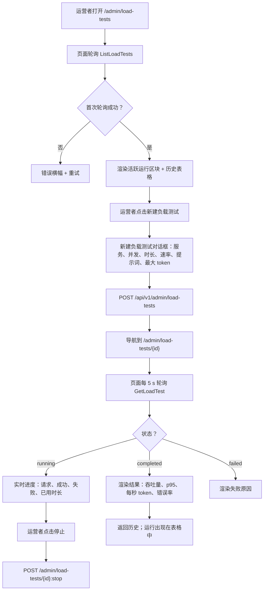
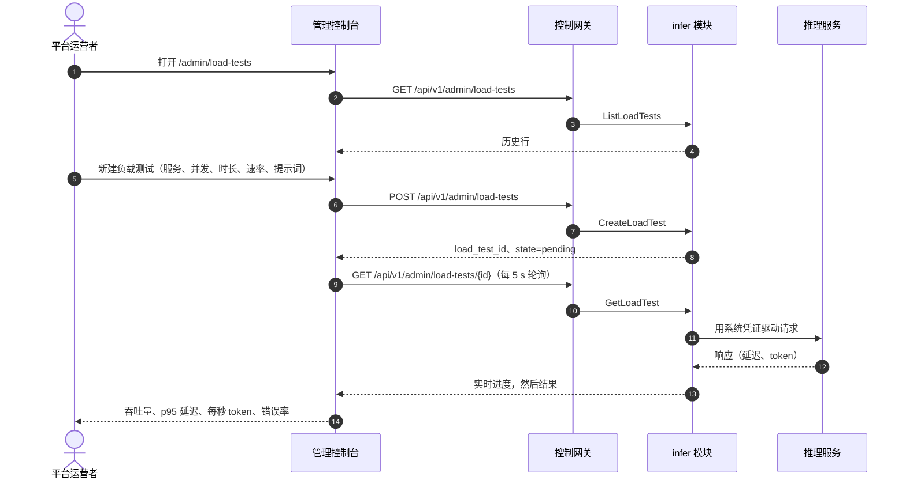

# 推理负载测试 — 需求分析与 UI/UX 设计

| 属性 | 内容 |
| --- | --- |
| 特性点 | 推理负载测试 — 针对推理服务运行负载测试，查看吞吐量 / 延迟 / 每秒 token 结果，并保留历史运行记录（backlog 第 20 行） |
| 文档范围 | 需求分析与 UI/UX 设计：`/admin/load-tests` 管理面负载测试页面（配置、运行、实时进度、结果、历史），`/models/:modelId` 终端用户面只读性能展示，页面 → API 面映射表，以及编号验收标准 |
| 归属模块 | `infer`（拥有推理服务与驱动它们的负载测试运行器），`web` 管理控制台（`LoadTestsPage`、`LoadTestDetailPage`）与终端用户控制台（`ModelDetailPage` 性能区块），`pkg/server` 网关（管理前缀与用户前缀绑定） |
| 相关文档 | [架构设计](./architecture.zh-cn.md) — 第 2.4 节 `infer`、第 4.2 节一键部署流程 · [模型目录与一键部署](./model-catalog-deployment.zh-cn.md) — 本特性所针对的推理服务 · [请求日志与 API Playground](./request-logs-playground.zh-cn.md) — 本特性放大为多请求的单请求测试面 · [推理自动扩缩](./inference-autoscaling.zh-cn.md) — 负载测试所支撑的容量语境 · [控制台面分离](./console-surface-separation.zh-cn.md) — 本特性横跨的两个面 |
| 状态 | 设计完成，已移交架构师代理 |

---

## 1. 背景与竞品调研

go-taas 部署推理服务（特性 #2）并自动扩缩（特性 #16）。运营者反复提出的问题是 *这个服务在负载下实际表现如何？* — 它能支撑每秒多少请求、用户在尾部的延迟是多少、每秒产出多少输出 token、错误率是多少。今天没有任何东西能回答这个问题。Playground（特性 #12）通过真实计量路径发送**单个**测试请求并显示其延迟与 token 用量，但单个请求无法揭示持续吞吐量、并发下的尾部延迟或负载下的每秒 token。运营者在宣传服务、做容量规划或调优自动扩缩目标（特性 #16）之前，没有任何办法测量服务的性能包络。

本特性新增**推理负载测试**：运营者针对一个运行中的推理服务配置负载测试 — 并发、时长与请求速率 — 平台向该服务驱动真实推理流量，控制台展示吞吐量、延迟百分位、每秒 token 与错误率，外加用于对比的历史运行记录。这是 Phase 4 生产化路线图项中最小可独立交付的增量：它把「服务在运行」变成「服务以 X req/s 吞吐、Y ms p95 延迟运行」。

### 1.1 竞品的推理负载测试呈现

| 产品 | 负载测试面 | 测量内容 | 运行模型 | 主要陷阱 |
| --- | --- | --- | --- | --- |
| **vLLM `benchmark_serving.py`** | 针对运行中服务器的 CLI 基准 | 吞吐量（req/s、tokens/s）、延迟百分位（TTFT、TPOT、E2E）、并发、请求速率 | 一次性 CLI 运行；结果打印到 stdout | 原始 CLI 输出，非产品面；无历史；无实时进度；需要运营者运行脚本 |
| **Hey / Vegeta / wrk** | CLI HTTP 负载测试器 | 吞吐量（req/s）、延迟百分位、并发、时长、请求速率 | 一次性 CLI 运行；结果到 stdout | 通用 HTTP，非 LLM 感知（无每秒 token）；无历史；无控制台 |
| **Grafana k6** | 带 Web 仪表盘（Grafana Cloud）的可脚本化负载测试 | 吞吐量、延迟百分位、错误率、阈值；并发（VU）、时长、速率 | 脚本化运行；结果流式到仪表盘 | 脚本化是开发者技能；LLM token 指标需自定义扩展；工具沉重 |
| **Together AI / SiliconFlow** | 控制台中的端点 QPS / 延迟指标 | 每个端点的 QPS 与延迟 | 被动监控，非主动负载生成 | 被动指标，非可配置负载测试；无每秒 token；无运行历史 |
| **RunPod / Vast.ai** | 实例基准分数 | 固定基准上的吞吐量 / 价格 | 固定基准，非用户可配置 | 不可配置；不针对用户自己的服务 |

### 1.2 提炼出的模式与决策

值得采纳的模式：(1) **引导式配置表单** — vLLM 的基准参数（并发、时长、请求速率）正是运营者思考的字段，每个调研过的工具都把负载测试简化为这些；(2) **带实时进度的异步运行** — k6 与云仪表盘在测试运行时流式展示结果，让运营者看到它在工作而非等待阻塞调用；(3) **精选结果仪表盘** — vLLM 的百分位与每秒 token 是正确的指标，但必须是产品面（卡片 + 表格），而非 stdout；(4) **用于对比的历史** — 运营者需要对比运行（配置变更前后、跨卡型）才能让负载测试有用；(5) **停止操作** — 长时间运行或配置错误的测试必须可取消。

需要避免的陷阱：以原始 CLI 输出作为产品面（vLLM、Hey）— 控制台必须精选结果；长测试的阻塞 HTTP 调用 — 运行必须异步并轮询；无实时进度 — 运营者无法判断测试是否在工作；无历史 — 运行无法对比；绕过真实推理路径的负载测试 — 结果必须反映实际服务性能；以及耗尽租户余额的负载测试 — 负载测试是运营者活动，绝不能消耗租户资金。

**go-taas 的决策**：

| # | 决策 | 依据 |
| --- | --- | --- |
| D1 | **负载测试配置与运行仅限管理面**：路由 `/admin/load-tests`，API 前缀 `/api/v1/admin/load-tests/*`。页面加入 `AdminShell` 导航（特性 #17），名为「负载测试」 | 负载测试驱动真实推理流量并读取运营者编排状态（服务、副本）；它是运营者能力，而非租户自助服务 |
| D2 | **终端用户控制台获得只读掩码性能展示**，位于模型详情页 `/models/:modelId`，展示该模型最近的负载测试结果（吞吐量、p95 延迟、每秒 token、错误率），不含服务 id 与运营者内部信息。API：`GET /api/v1/models/{model_id}/load-tests` | 租户需要模型的性能预期（成本/性能权衡），但绝不能看到运营者编排内部信息；这遵循特性 #17 的 D15 掩码投影规则与兼容性矩阵的 D7 模式 |
| D3 | **负载测试是异步的**：`CreateLoadTest` 立即返回 `state = pending`；状态机为 `pending → running → completed / failed / stopped`。测试运行时页面轮询 `GetLoadTest` | 负载测试运行数秒到一小时；阻塞 HTTP 调用会超时。这匹配部署异步模式（特性 #2，D3）与控制台的 `usePolling` 惯例 |
| D4 | **负载测试针对运行中的推理服务**（`state = running` 且端点非空）。非运行服务返回 **10311 `CodeLoadTestTargetInvalid`** | 负载测试测量的是在线服务；pending/deploying/failed/terminated 服务没有可驱动的端点。端点来自 API，绝不由客户端构造 |
| D5 | **配置字段**：**服务**（必填，运行中）、**并发**（整数 1–1000，默认 1）、**时长**（整数秒 5–3600，默认 60）、**请求速率**（整数 req/s 0–10000，0 = 尽可能快，默认 0）、**提示词模板**（必填，≤ 4096 字符）、**最大 token**（整数 1–8192，默认 256） | 以最小字段集镜像 vLLM/Hey/k6 参数集；请求速率 0 = 不限速匹配每个调研工具的「尽可能快」惯例 |
| D6 | **结果是精选集合**：总请求数、成功数、失败数、错误率、吞吐量（req/s）、输出每秒 token、输入/输出 token，以及延迟百分位 p50 / p90 / p95 / p99。控制台以汇总卡片 + 延迟表格渲染，绝不展示原始逐请求输出 | vLLM 的百分位与每秒 token 是 LLM 服务的权威指标；精选投影保持控制台轻依赖且面可扫读 |
| D7 | **负载测试使用专用运营者范围的负载测试凭证**（系统 key），向服务端点认证但不消耗租户余额、不触发租户速率/消费上限。流量仍产生请求日志（特性 #12），使负载测试流量可观测 | 负载测试是运营者活动；使用租户 key 会耗尽租户余额并可能被租户上限阻断。系统凭证让负载测试对租户免费，同时在请求日志中可见 |
| D8 | **infer 段新增错误码（10308–10399）**：**10308 `CodeLoadTestNotFound`**、**10309 `CodeLoadTestConfigInvalid`**、**10310 `CodeLoadTestStateInvalid`**、**10311 `CodeLoadTestTargetInvalid`** | 负载测试属于 `infer`（D1 的模块），其错误码位于 10307（特性 #16）之后的 infer 段；不同错误码让「未找到」vs「配置错误」vs「状态错误」vs「目标错误」可操作 |
| D9 | **负载测试历史保留 90 天并以分页列出**；完成的运行不可变（一旦 `completed`，配置与结果固定）。运行中的测试可停止；已完成的测试可删除 | 历史是对比面（D1 的模式）；不可变性让结果可信；90 天保留匹配请求日志保留期（特性 #12） |
| D10 | **负载测试运行器位于 `infer` 模块**，作为基于 goroutine 的负载生成器，用系统凭证（D7）驱动服务端点并聚合结果；它不是独立部署 | 运行器针对推理服务并生成推理流量，这是 `infer` 的职责；基于 goroutine 的生成器避免新服务，并让运行与 gRPC 服务器同进程 |

## 2. 目标与非目标

**目标**：`/admin/load-tests` 管理页面，针对运行中的推理服务配置并运行负载测试（并发、时长、请求速率、提示词、最大 token），运行时显示实时进度，并展示精选结果（吞吐量、延迟百分位、每秒 token、错误率）与历史运行记录（D1、D3、D5、D6、D9）；运行中测试的停止操作与已完成测试的删除（D9）；终端用户模型详情页 `/models/:modelId` 上的只读掩码性能展示（D2）；带精确前缀的页面 → API 面映射表（D1、D2）；含空态、错误与权限拒绝的逐页交互状态；可在 compose 栈上由 Nightwatch 测试的编号验收标准。

**非目标**：负载测试调度或周期测试（未来细化）；并排对比运行的图表（v1 以表格展示历史；对比图表是未来工作）；TTFT/TPOT 拆分（v1 报告端到端延迟百分位与每秒 token，而非 prefill/decode 拆分）；负载测试脚本编辑器（v1 使用提示词模板，而非脚本）；租户发起的负载测试（D1）；向租户暴露服务 id 或运营者内部信息（D2）；随时间变化的 Grafana 风格指标仪表盘（超出范围 — 这是点时刻测量面）。

## 3. 用户角色与旅程

| 角色 | 面 | 旅程 |
| --- | --- | --- |
| **平台运营者** | admin | 打开 `/admin/load-tests` → 针对运行中的服务配置负载测试（并发 8、时长 60 s、速率 0）→ 观看实时进度 → 看到吞吐量、p95 延迟、每秒 token、错误率 → 判断服务是否满足 SLO |
| **平台运营者（容量）** | admin | 宣传模型前，对每种卡型运行负载测试 → 对比历史行 → 选择满足延迟/吞吐目标的卡型 |
| **平台运营者（自动扩缩）** | admin | 运行负载测试找出 p95 延迟劣化的并发点 → 用它设置自动扩缩目标并发（特性 #16） |
| **支持工程师** | admin | 租户报告响应慢 → 对服务运行负载测试 → 看到高 p95 延迟或高错误率 → 调查服务或节点 |
| **租户开发者 / 智能体** | end-user | 打开 `/models/:modelId` → 看到模型最近的负载测试性能（吞吐量、p95 延迟、每秒 token）→ 依据性能画像选模型，不看到运营者内部信息 |

> 术语：消费方调用者称为**智能体**（Agent），与仓库惯例一致。

## 4. 功能需求

### FR1 — 负载测试配置与运行

- **FR1.1** `CreateLoadTest`（`POST /api/v1/admin/load-tests`）接受 `service_id`、`concurrency`（1–1000）、`duration_seconds`（5–3600）、`request_rate`（0–10000，0 = 不限速）、`prompt_template`（≤ 4096 字符）与 `max_tokens`（1–8192）。它同步校验配置并立即返回 `load_test_id` 与 `state = pending`（D3）。
- **FR1.2** 目标服务必须为 `running` 且端点非空；否则返回 **10311 `CodeLoadTestTargetInvalid`**（D4）。无效配置（并发、时长、速率或最大 token 越界；空提示词）返回 **10309 `CodeLoadTestConfigInvalid`**。
- **FR1.3** 负载测试经历 `pending → running → completed / failed / stopped`（D3）。`failed` 运行携带人类可读原因（例如服务中途不可用）。

### FR2 — 负载测试查询

- **FR2.1** `ListLoadTests`（`GET /api/v1/admin/load-tests`）返回历史，可按 `service_id`、`status`、`model_id` 过滤，按服务名搜索，并分页（`offset`/`limit`，默认 20，最大 100）。每行携带 `load_test_id`、`service_id`、`service_name`、`model_id`、`model_name`、`concurrency`、`duration_seconds`、`request_rate`、`status`、`started_at`、`completed_at`，以及完成时的结果摘要（吞吐量、p95 延迟、每秒 token、错误率）。
- **FR2.2** `GetLoadTest`（`GET /api/v1/admin/load-tests/{load_test_id}`）返回完整配置、当前状态、运行中的实时进度（已发送请求、成功、失败、已用时长）与完成时的完整结果集（D6）。未知 id 返回 **10308 `CodeLoadTestNotFound`**。
- **FR2.3** 完成的运行不可变（D9）：一旦 `state = completed`，其配置与结果固定。

### FR3 — 停止与删除

- **FR3.1** `StopLoadTest`（`POST /api/v1/admin/load-tests/{load_test_id}:stop`）停止 `running`（或 `pending`）测试；状态变为 `stopped` 并保留部分结果。停止 `completed`/`failed`/`stopped` 测试返回 **10310 `CodeLoadTestStateInvalid`**。
- **FR3.2** `DeleteLoadTest`（`DELETE /api/v1/admin/load-tests/{load_test_id}`）删除 `completed`、`failed` 或 `stopped` 运行；删除 `running`/`pending` 运行返回 **10310**（需先停止）。

### FR4 — 终端用户性能展示

- **FR4.1** `GetModelLoadTests`（`GET /api/v1/models/{model_id}/load-tests`）返回**掩码投影**（D2）：针对该模型，最近完成的负载测试结果（吞吐量、p95 延迟、每秒 token、错误率、并发、时长、completed_at），**不含服务 id 与运营者内部信息**。无已完成负载测试的模型返回空列表。
- **FR4.2** 终端用户模型详情页 `/models/:modelId` 从此投影展示只读**性能**区块；它不含编辑控件，也不调用任何 `/api/v1/admin/*`（特性 #17，D8）。

### FR5 — 面与 API 绑定

- **FR5.1** 负载测试页面位于**管理面**：路由 `/admin/load-tests`，API 前缀 `/api/v1/admin/load-tests/*`。加入 `AdminShell` 导航（特性 #17），名为「负载测试」。
- **FR5.2** 终端用户性能展示位于**终端用户面**：路由 `/models/:modelId`，API 前缀 `/api/v1/*`（`GET /api/v1/models/{model_id}/load-tests`）。
- **FR5.3** 管理页面只调用 `/api/v1/admin/load-tests/*` 路由；终端用户页面只调用 `/api/v1/*` 路由。两者都不包含对方面的前缀字符串（特性 #17，D8）。
- **FR5.4** 负载测试页面在任一测试为 `pending`/`running` 时按间隔（默认 5 s）轮询 `GetLoadTest`，否则手动刷新；轮询失败显示过期数据横幅而非清空结果（`usePolling` 惯例）。

## 5. UI 设计

### 5.1 页面：`/admin/load-tests` — 负载测试

**用途**：给平台运营者一个单一界面，针对运行中的推理服务配置并运行负载测试、实时观看、并回顾历史运行。

**面**：admin — 路由 `/admin/load-tests`，API `/api/v1/admin/load-tests/*`。

**布局**：渲染于 `AdminShell`（特性 #17）内。页头（「负载测试」，副标题「测量运行中推理服务的吞吐量、延迟与每秒 token」）带**新建负载测试**操作（主）与**刷新**操作（次）。页头下方：

1. **活跃运行** — 列出任何 `pending`/`running` 负载测试的区块，带实时进度（已发送请求、成功、失败、已用时长与进度条），每个带**停止**操作。无活跃测试时隐藏。
2. **历史表格** — 过往运行（completed / failed / stopped），列：**服务**（名称，链接）、**模型**（名称）、**并发**、**时长**、**请求速率**、**状态**（徽标）、**吞吐量**（req/s）、**p95 延迟**（ms）、**每秒 token**、**错误率**、**开始时间**（相对时间），以及行操作（**查看**、**删除**）。

**交互状态**：

| 状态 | 行为 |
| --- | --- |
| 默认 | 首次成功轮询后渲染活跃运行区块（如有）+ 历史表格；最近更新显示轮询时间 |
| 加载中 | 历史表格骨架行与活跃运行卡片骨架；刷新禁用 |
| 空态 | 「暂无负载测试 — 运行你的第一个负载测试以测量服务性能」带**新建负载测试**操作；活跃运行区块隐藏 |
| 错误 | 错误横幅带消息与重试按钮；表格保留最后良好数据并显示「正在显示过期数据」横幅（FR5.4） |
| 禁用 | 轮询进行中刷新禁用；`running` 测试的**查看**在完成前禁用（或打开显示实时进度的详情页）；`running`/`pending` 行的**删除**禁用 |
| 权限拒绝 | 无所需角色的会话收到 10036，页面显示标准权限拒绝状态（特性 #17）并链接回管理首页 |

**历史表格列**：服务（链接）、模型、并发、时长、请求速率、状态（徽标：completed 绿 / failed 红 / stopped 灰）、吞吐量（req/s）、p95 延迟（ms）、每秒 token、错误率、开始时间（相对时间）。可按开始时间、吞吐量、p95 延迟、每秒 token 排序。可按状态（全部 / completed / failed / stopped）过滤并按服务名搜索；分页。

### 5.2 对话框：新建负载测试

**用途**：针对运行中的推理服务配置并启动负载测试。

**布局**：模态框含配置字段（D5）：**服务**（运行中推理服务下拉，必填）、**并发**（数字，默认 1）、**时长（秒）**（数字，默认 60）、**请求速率（req/s）**（数字，默认 0，提示「0 = 尽可能快」）、**提示词模板**（文本域，必填）、**最大 token**（数字，默认 256），以及**取消** / **开始负载测试**操作。

**校验**：

| 字段 | 必填 | 规则 | 错误文案 |
| --- | --- | --- | --- |
| 服务 | 是 | 必须是运行中的服务 | 「请选择运行中的推理服务。」 |
| 并发 | 是 | 整数 1–1000 | 「并发必须在 1 到 1000 之间。」 |
| 时长（秒） | 是 | 整数 5–3600 | 「时长必须在 5 到 3600 秒之间。」 |
| 请求速率（req/s） | 是 | 整数 0–10000 | 「请求速率必须在 0 到 10000 之间（0 = 不限速）。」 |
| 提示词模板 | 是 | 非空，≤ 4096 字符 | 「请输入提示词模板。」 / 「提示词模板必须 ≤ 4096 字符。」 |
| 最大 token | 是 | 整数 1–8192 | 「最大 token 必须在 1 到 8192 之间。」 |

提交 → `CreateLoadTest`；成功关闭对话框并导航到负载测试详情页（`/admin/load-tests/{load_test_id}`），该页显示实时进度。错误（10309 配置无效 / 10311 目标无效）在对话框内联显示。

### 5.3 页面：`/admin/load-tests/:loadTestId` — 负载测试详情

**用途**：展示单个负载测试 — 其配置、运行中的实时进度与完成时的完整精选结果 — 让运营者观看运行并读取结果。

**面**：admin — 路由 `/admin/load-tests/:loadTestId`，API `/api/v1/admin/load-tests/{load_test_id}`。

**布局**：`AdminShell` 下的详情页，带返回列表的返回链接。页头含负载测试 id、目标服务（链接）与状态徽标。下方：

1. **配置** — 只读卡片：服务、模型、并发、时长、请求速率、提示词模板（截断带提示框）、最大 token。
2. **实时进度**（`pending`/`running` 时）— 进度条（已用 / 时长）、已发送请求、成功、失败，以及**停止**操作。每 5 s 轮询（FR5.4）。
3. **结果**（`completed` 时）— 汇总卡片：**吞吐量**（req/s）、**p95 延迟**（ms）、**每秒 token**、**错误率**；**延迟百分位**表格（p50 / p90 / p95 / p99，ms）；以及 **token** 行（输入 / 输出）。`failed` 运行显示失败原因而非结果。

**交互状态**：

| 状态 | 行为 |
| --- | --- |
| 默认 | 首次成功轮询后渲染配置 + 实时进度（若运行中）或结果（若已完成） |
| 加载中 | 骨架卡片与表格 |
| 错误 | 错误横幅带消息与重试按钮；页面保留最后良好数据并显示「正在显示过期数据」横幅 |
| 禁用 | 停止进行中**停止**禁用；测试 `completed`/`failed`/`stopped` 后**停止**隐藏 |
| 权限拒绝 | 无所需角色的会话收到 10036，页面显示标准权限拒绝状态（特性 #17） |
| 未找到 | 未知 `load_test_id` 返回 10308，页面显示标准未找到状态并链接回列表 |

### 5.4 页面：`/models/:modelId` — 模型详情（终端用户，性能）

**用途**：让租户看到模型最近的负载测试性能，从而依据性能画像选模型 — 不看到运营者编排内部信息。

**面**：end-user — 路由 `/models/:modelId`，API `/api/v1/models/{model_id}/load-tests`。

**布局**：渲染于 `UserShell`（特性 #17）内。既有模型详情页（特性 #17 / 兼容性矩阵 D7）新增**性能**区块：

1. **摘要** — 「最近负载测试：X req/s 吞吐、Y ms p95 延迟、Z tokens/s」来自最近完成的运行。
2. **性能表格** — 最近完成负载测试的只读行：**吞吐量**（req/s）、**p95 延迟**（ms）、**每秒 token**、**错误率**、**并发**、**时长**、**完成时间**（相对时间）。无服务 id、无运营者内部信息（D2）。附注：「性能由平台运营者测量。」

**交互状态**：

| 状态 | 行为 |
| --- | --- |
| 默认 | 摘要 + 性能表格从 `GET /api/v1/models/{model_id}/load-tests` 渲染 |
| 加载中 | 骨架行 |
| 空态 | 「该模型暂无负载测试结果」— 模型尚未被负载测试 |
| 错误 | 错误横幅带消息与重试按钮 |
| 权限拒绝 | 无模型访问权限的会话收到 10105（模型未授权），页面显示标准权限拒绝状态（特性 #17） |
| 未找到 | 未知 `model_id` 返回 10101，页面显示标准未找到状态并链接回模型列表 |

### 5.5 流程

## 6. API 面

所有负载测试 RPC 属于 **`infer` 模块**（D10），经控制网关以 HTTP 提供。管理路由位于**管理前缀** `/api/v1/admin/load-tests/*`（D1）；终端用户读取位于**用户前缀** `/api/v1/*`（D2）。

| RPC | 路由 | 前缀 | 状态 | 用途 |
| --- | --- | --- | --- | --- |
| `CreateLoadTest` | `POST /api/v1/admin/load-tests` | admin | **新增** | 配置 + 启动负载测试；返回 `load_test_id`、`state=pending` |
| `ListLoadTests` | `GET /api/v1/admin/load-tests` | admin | **新增** | 带服务/状态/模型过滤、搜索、分页的历史 |
| `GetLoadTest` | `GET /api/v1/admin/load-tests/{load_test_id}` | admin | **新增** | 配置 + 实时进度 + 完整结果；缺失 → 10308 |
| `StopLoadTest` | `POST /api/v1/admin/load-tests/{load_test_id}:stop` | admin | **新增** | 停止运行中/pending 测试；错误状态 → 10310 |
| `DeleteLoadTest` | `DELETE /api/v1/admin/load-tests/{load_test_id}` | admin | **新增** | 删除 completed/failed/stopped 运行；running → 10310 |
| `GetModelLoadTests` | `GET /api/v1/models/{model_id}/load-tests` | user | **新增** | 掩码投影：模型最近的已完成结果 |

**契约约束（供架构师代理）**：

1. `CreateLoadTest` 校验 `service_id`（必须是带端点的运行中服务，否则 10311）、`concurrency`（1–1000）、`duration_seconds`（5–3600）、`request_rate`（0–10000）、`prompt_template`（非空，≤ 4096 字符）与 `max_tokens`（1–8192）；无效配置返回 10309。它同步返回 `load_test_id` 与 `state = pending`（D3）。
2. `LoadTestSummary` 携带 `load_test_id`、`service_id`、`service_name`、`model_id`、`model_name`、`concurrency`、`duration_seconds`、`request_rate`、`status`（封闭枚举：`pending`、`running`、`completed`、`failed`、`stopped`）、`started_at`、`completed_at`，以及完成时的结果摘要（吞吐量、p95 延迟、每秒 token、错误率）。
3. `GetLoadTest` 返回配置、当前状态、运行中的实时进度（`requests_sent`、`success_count`、`failure_count`、`elapsed_seconds`），以及完成时的完整结果集：`total_requests`、`success_count`、`failure_count`、`error_rate`、`throughput_rps`、`output_tokens_per_sec`、`input_tokens`、`output_tokens`、`latency_p50_ms`、`latency_p90_ms`、`latency_p95_ms`、`latency_p99_ms`。`failed` 运行携带 `failure_reason`。
4. `StopLoadTest` 将 `pending`/`running` 测试转为 `stopped` 并保留部分结果；`DeleteLoadTest` 删除 `completed`/`failed`/`stopped` 运行。两者在错误状态返回 10310。
5. `GetModelLoadTests` 只返回完成的运行，掩码（D2）：`throughput_rps`、`latency_p95_ms`、`output_tokens_per_sec`、`error_rate`、`concurrency`、`duration_seconds`、`completed_at` — 无服务 id、无运营者内部信息。未知模型返回 10101；未授权模型返回 10105。
6. 负载测试运行器（D10）用专用运营者范围的系统凭证（D7）驱动服务端点，不消耗租户余额、不触发租户速率/消费上限，但仍产生请求日志（特性 #12）以供观测。
7. 线格式惯例不变：适用列表处点分分页、成功 HTTP 200、业务错误为 `{"code": <int>, "message": "..."}`、浮点指标（吞吐量、每秒 token、错误率）为 JSON 数字。

错误码（infer 段 10308–10399，`pkg/errors/codes.go`）：

| 条件 | 码 | 常量 | 备注 |
| --- | --- | --- | --- |
| 未知 `load_test_id` | 10308 | `CodeLoadTestNotFound` | **新增**（D8） |
| 无效负载测试配置（并发/时长/速率/最大 token 越界、空提示词） | 10309 | `CodeLoadTestConfigInvalid` | **新增**（D8） |
| 无效状态转换（在错误状态上停止/删除） | 10310 | `CodeLoadTestStateInvalid` | **新增**（D8） |
| 目标服务未运行 / 无端点 | 10311 | `CodeLoadTestTargetInvalid` | **新增**（D8） |
| 数据库 / MQ 基础设施故障 | 500 | `CodeInternal` | 经错误归一化 |

## 7. 验收标准

| # | 标准 | 级别 |
| --- | --- | --- |
| AC1 | `CreateLoadTest` 针对运行中服务与有效配置立即返回 `load_test_id` 与 `state = pending`；测试经历 `pending → running → completed`，`GetLoadTest` 随后返回完整结果集（吞吐量、延迟百分位、每秒 token、错误率） | FVT |
| AC2 | `CreateLoadTest` 针对非运行服务返回 10311；针对越界并发/时长/速率/最大 token 或空提示词返回 10309 | FVT |
| AC3 | `ListLoadTests` 返回带服务/状态/模型过滤、搜索与分页的历史；每行在完成时携带结果摘要 | FVT |
| AC4 | `StopLoadTest` 停止运行中测试、置 `state = stopped` 并保留部分结果；停止 completed/failed/stopped 测试返回 10310 | FVT |
| AC5 | `DeleteLoadTest` 删除 completed/failed/stopped 运行；删除 running/pending 运行返回 10310 | FVT |
| AC6 | `GetModelLoadTests` 只返回完成的运行，掩码（无服务 id、无运营者内部信息）；未授权模型返回 10105；未知模型返回 10101 | FVT |
| AC7 | `/admin/load-tests` 页面从首次成功轮询渲染活跃运行区块与历史表格，带最近更新时间戳 | E2E |
| AC8 | 新建负载测试对话框按指定规则与错误文案校验每个字段；有效提交导航到详情页 | E2E |
| AC9 | 负载测试详情页运行中显示实时进度（请求、成功、失败、已用时长），完成时显示精选结果（吞吐量、p95 延迟、每秒 token、错误率） | E2E |
| AC10 | 历史为空时渲染空态（「暂无负载测试…」）；轮询失败保留最后良好数据并显示「正在显示过期数据」横幅与重试操作 | E2E |
| AC11 | `/models/:modelId` 页面显示模型最近的负载测试性能（吞吐量、p95 延迟、每秒 token、错误率）且无服务 id；未授权模型显示 10105 权限拒绝状态 | E2E |
| AC12 | 负载测试页面仅在管理面可达：位于 `AdminShell` 导航、路由为 `/admin/load-tests`、其每次 API 调用都使用 `/api/v1/admin/load-tests/*` 前缀且不含 `/api/v1/*` 字符串 | E2E（面分离） |
| AC13 | 终端用户模型详情页仅在终端用户面可达：路由为 `/models/:modelId`、其 API 调用只使用 `/api/v1/*` 且不含 `/api/v1/admin/*` 字符串 | E2E（面分离） |
| AC14 | 无所需角色的会话在负载测试页面收到 10036，页面显示标准权限拒绝状态 | E2E |

## 8. 超出范围（另作跟踪）

| 项 | 位置 |
| --- | --- |
| 负载测试调度 / 周期测试 | 未来细化 |
| 并排运行对比图表 | 未来可观测性特性 |
| TTFT/TPOT prefill/decode 拆分 | 未来细化 — v1 报告端到端延迟百分位与每秒 token |
| 负载测试脚本编辑器 | 未来增强 — v1 使用提示词模板 |
| 租户发起的负载测试 | 刻意缺失（D1） |
| 向租户暴露服务 id 或运营者内部信息 | 刻意缺失（D2） |
| 随时间变化的 Grafana 风格指标仪表盘 | 未来可观测性特性 |