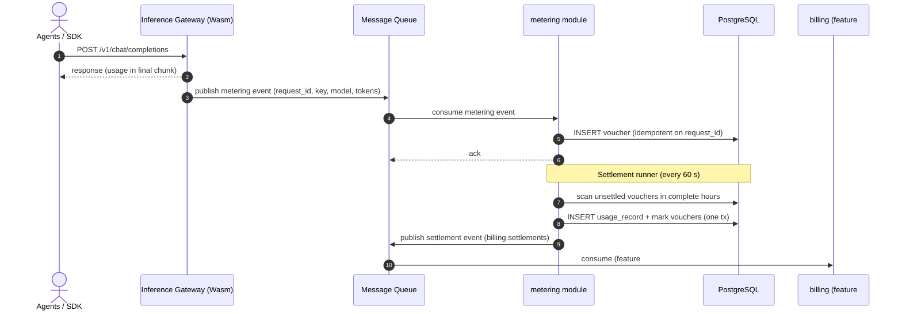

# Token Metering Vouchers & Async Settlement — Requirement Analysis and UI/UX Design

| Attribute | Content |
| --- | --- |
| Feature point | Token metering vouchers & async settlement per API Key |
| Document scope | Requirement analysis and UI/UX design for the `metering` module: voucher ingestion from the data plane, async settlement per API Key, usage query APIs, the console Usage page, and acceptance criteria |
| Owning modules | `metering` (voucher ingestion, settlement, usage queries), with `auth` (API Key identity) and `billing` (settlement hand-off, feature #5) |
| Related documents | [Architecture Design](./architecture.md) — Section 2.5 `metering`, Section 2.6 `billing`, Section 4.3 the metering/settlement sequence · [API Key Management](./api-key-management.md) — the key identity that vouchers attach to · [Model Catalog & One-Click Deployment](./model-catalog-deployment.md) — the model identity carried on vouchers |
| Status | Design complete, handed to the Architect agent |

---

## 1. Background and Competitive Research

### 1.1 Why Metering Comes Now

Features #1–#3 shipped the platform's serving spine: API Keys authenticate callers, models deploy one-click, and engine images are curated and pre-pulled. But the platform's namesake promise — **Token as a Service** — is still a stub: `MeteringService.IngestMeteringEvent` answers "not implemented", no voucher is ever written, and the console has no way to answer "who consumed what". The architecture already fixes the shape: the data-plane gateway's Wasm plugin emits token-usage events to the message queue; the `metering` module consumes them, mints tamper-evident vouchers, and hands settlement to `billing` asynchronously. This feature point implements that pipeline end to end — minus pricing, which is feature #5 — so that by the time prices exist, the usage data underneath them is already complete, queryable, and auditable.

### 1.2 How Comparable Products Meter Token Usage

| Product | Metering capture | Voucher / audit trail | Settlement cadence | Usage visibility | Notable pitfalls |
| --- | --- | --- | --- | --- | --- |
| **OpenAI Platform** | Usage tracked per API key at request completion; streaming responses metered from the final chunk's `usage` field | No user-visible voucher concept; usage records queryable ~5 minutes after the call | Real-time deduction against a prepaid credit balance or monthly invoicing | Per-key, per-model usage dashboards with day granularity; usage export via API | Usage lag (minutes) confuses rate-limit debugging; no per-request audit trail exposed |
| **SiliconFlow** | Per-request token accounting on the platform side, attached to the account's API keys | Bills and usage records visible in console; no per-request drill-down exposed | Real-time balance deduction (prepaid) | Console usage page: per-model token consumption, balance history | No voucher-level audit; a disputed charge cannot be traced to requests |
| **Anthropic Console** | Per-request usage captured including cache reads/writes as separate line items | Per-request usage rows in the console's usage viewer (admin workspaces) | Monthly invoicing or prepaid credits | Usage page with per-day, per-model breakdown; per-request viewer for admins | The per-request viewer is admin-only; members see only aggregates |
| **AWS Bedrock** | Model invocation logs (CloudWatch) with token counts per request; optional detailed invocation logging to S3 | Full per-invocation records in S3 (opt-in) — the closest analogue to vouchers | Hourly/monthly billing against the AWS account | CloudWatch metrics per model; Cost Explorer for spend | Detailed logging is off by default — usage without it is aggregate-only |
| **DeepSeek Platform** | Per-request usage on completions; usage breakdown by model in console | Usage records per key; no per-request export | Prepaid balance deduction | Console usage page per model per day | No API to fetch usage programmatically in the free tier |
| **Together AI** | Per-request usage with per-model pricing applied at request time | Usage history per key in console | Prepaid credits deduction | Usage dashboard per model, per key | Latency between call and usage appearance is undocumented |

### 1.3 Distilled Patterns and Decisions

Common industry patterns worth adopting:

1. **Capture at the gateway, not in the business process** — every surveyed platform meters at the edge (or in a sidecar path) so metering never adds latency to the inference call. go-taas's architecture already commits to this: the Wasm plugin emits the event, the inference path never waits.
2. **The per-request record is the audit unit** — Bedrock's S3 invocation logs and Anthropic's per-request viewer exist because aggregates cannot answer disputes. A voucher per request (idempotent by `request_id`) is the atom from which every aggregate is derived.
3. **Token parts are captured separately** — prompt / completion / cached / reasoning tokens are distinct line items everywhere that exposes them (Anthropic's cache reads, the proto's `TokenUsage`). Collapsing them early makes later pricing (feature #5, separate input/output rates) impossible.
4. **Settlement is asynchronous and idempotent** — no surveyed platform settles synchronously with the request; prepaid platforms deduct in near-real-time batches, invoiced platforms aggregate per period. At-least-once delivery with dedup by voucher id is the standard shape.
5. **Usage is visible per key and per model** — every console exposes usage broken down by API key and by model over a time range; that is the minimum viable dashboard.

Pitfalls to avoid:

- **Usage lag confusion** (OpenAI) — usage appearing minutes later makes users think calls were lost. The console must show the ingestion timestamp and the settlement state explicitly.
- **No per-request audit** (SiliconFlow) — a disputed charge must be traceable to the underlying vouchers.
- **Opt-in audit logging** (Bedrock) — if vouchers are optional, they will be absent when needed most. Vouchers are always written.
- **Metering on the request path** — any synchronous dependency (a DB write per inference call in the hot path) couples inference availability to accounting availability. Ingestion is via the message queue, decoupled.
- **Aggregates without atoms** — storing only pre-aggregated usage loses the ability to re-price, re-group, or audit. Vouchers are the source of truth; aggregates are derived and rebuildable.

**Decisions for go-taas** (recorded rationale, per the autonomous-decision rule):

| # | Decision | Rationale |
| --- | --- | --- |
| D1 | The voucher is a **row per inference request**, keyed by a server-generated `voucher_id` (UUID v4), with a unique index on `request_id`; ingestion is idempotent — a duplicate `request_id` is acknowledged, not re-written | The per-request record is the audit atom (Bedrock/Anthropic pattern); idempotency makes at-least-once MQ delivery safe without dedup infrastructure |
| D2 | Voucher ingestion is **asynchronous via the existing message queue**: the data-plane gateway's Wasm plugin publishes a metering event to `metering.events`; the `metering` module consumes it and writes the voucher. `IngestMeteringEvent` (the gRPC RPC) is kept as the direct/test path and shares the same handler | The architecture commits to MQ-decoupled metering; the RPC path gives tests and future non-Envoy gateways a synchronous entry with identical semantics |
| D3 | The voucher carries the full token breakdown — `prompt_tokens`, `completion_tokens`, `cached_tokens`, `reasoning_tokens` — plus `api_key_id`, `organization_id`, `model_id`, `service_id` (when known), `request_id`, and `completed_at`; nothing is pre-aggregated at capture time | Separate parts are required by feature #5's input/output pricing; the raw atom supports any future regrouping |
| D4 | **Settlement is a periodic batch**: a runner inside the `metering` module aggregates unsettled vouchers into **usage records** — one per `(api_key_id, period)` where the period is a fixed hour bucket (UTC) — summing each token part and the request count; a voucher is marked settled by linking the usage record id. Settlement is idempotent: re-running over an already-settled voucher is a no-op | Hour buckets balance freshness (usage visible within the hour) against write volume (one row per key-hour, not per request); idempotency makes the runner crash-safe and re-runnable |
| D5 | The usage record is the **query surface**: usage summaries are served from `usage_records` (fast, indexed), while the voucher list remains available for audit drill-down; both are exposed as admin APIs under `/api/v1/admin/metering/*` | Aggregates-from-records keep query latency flat as voucher volume grows; vouchers stay queryable for dispute resolution |
| D6 | **No pricing in this feature**: settlement produces token totals only; the settlement event to `billing.settlements` (consumed by feature #5) carries the usage record id and token sums, not amounts | Pricing is feature #5's contract; coupling them would block this feature on the price matrix and force re-settlement when prices change |
| D7 | Vouchers are **retained 90 days** by default (configurable), then deleted by a periodic cleanup; usage records are retained indefinitely (they are small and are the billing evidence) | Raw per-request data is high-volume and loses audit value faster than billing evidence; the retention window is configuration, not code |
| D8 | Metering APIs are **admin-surface** (`/api/v1/admin/metering/...`) and organization-scoped via the existing `X-Organization-Id` header, consistent with API Keys; the data-plane event path carries the organization id on the event itself | Matches the established admin/user split; the transitional org header is the current identity mechanism (feature #6/#7 will replace it) |
| D9 | A new error code **10403 `CodeMeteringVoucherNotFound`** is allocated for unknown voucher ids; **10404 `CodeMeteringRangeInvalid`** for malformed time ranges (since > until, or range > 92 days); the existing 10401 `CodeMeteringEventInvalid` covers malformed events (missing request_id, negative tokens) and 10402 `CodeMeteringVoucherError` covers voucher write failures | The 104xx block is reserved for metering; distinct codes for not-found vs invalid-range vs invalid-event keep API consumers' handling precise, mirroring the image module's D10/D11 pattern |
| D10 | The console gains a **Usage page** (`/admin/usage`): time-range selector, per-API-key usage table (tokens in/out, cached, requests), drill-down to per-model breakdown and to the voucher list; a settlement-state column distinguishes settled vs pending hours | Per-key/per-model usage over a range is the minimum viable dashboard every competitor ships; the drill-down answers disputes without a database console |
| D11 | The voucher list API supports filtering by `api_key_id`, `model_id`, and time range, paginated, newest first; the usage summary API supports grouping by `api_key` (default) or `model` within one organization | The two groupings cover the console's table and drill-down; cross-org grouping is a platform-operator need deferred with multi-tenancy (#6) |

### 1.4 Scope Boundary

**In scope**: metering-event ingestion (MQ consumer + gRPC direct path, shared handler, idempotent by `request_id`), voucher persistence with full token breakdown, hourly settlement runner producing per-(key, hour) usage records with idempotent marking, settlement event publication to `billing.settlements`, usage summary / voucher list / usage record query APIs (admin surface, org-scoped), voucher retention cleanup, and the console Usage page with drill-downs.

**Out of scope** (tracked elsewhere): pricing and amounts on usage records (#5 — the price matrix and bill generation), balance/quota enforcement at admission (#8 — holds and insufficient-funds rejection), end-user (non-admin) usage visibility (#6/#7 — needs real tenancy), real-time streaming usage dashboards (future — the hourly batch is the v1 cadence), per-request cost attribution in the console (needs #5), and the Wasm plugin itself (the data-plane gateway is a separate deployment; this feature consumes its events and provides the direct RPC for testing — synthetic events drive verification).

---

## 2. User Roles

| Role | Description | Interaction with metering |
| --- | --- | --- |
| **Platform administrator** | The operator who runs the go-taas cluster; today this is also the console user | Views usage per API key and model, drills into vouchers to audit a charge, monitors settlement health |
| **Organization administrator (future)** | A tenant-side administrator consuming the platform | Will see their organization's usage (same page, scoped by tenancy, #6) |
| **Agent / SDK** | The programmatic consumer whose calls generate usage | Never touches metering APIs directly; their requests produce vouchers via the gateway |
| **Billing pipeline (feature #5)** | The downstream consumer of settlement events | Consumes `billing.settlements` events carrying usage record ids and token sums |
| **Auditor** | Whoever resolves a usage dispute | Uses the voucher list filtered by key/model/time to trace an aggregate to individual requests |

> Terminology: the consumer-side caller is called an **Agent** (English) / 「智能体」(Chinese), consistent with the repo convention.

---

## 3. User Stories

| # | As a… | I want to… | So that… |
| --- | --- | --- | --- |
| US1 | Platform administrator | see token usage per API key over a time range, broken into input/output/cached tokens and request count | I can answer "who consumed what" without querying a database |
| US2 | Platform administrator | drill from a usage summary into per-model consumption for one API key | I can spot which model drives a key's spend |
| US3 | Platform administrator | drill from a usage summary into the underlying vouchers (per-request records) | I can audit or dispute an aggregate by tracing it to individual requests |
| US4 | Platform administrator | see whether a given hour's usage is settled or still pending | I know the data is complete before acting on it |
| US5 | Platform administrator | filter vouchers by API key, model, and time range, paginated | I can find the exact requests behind a spike |
| US6 | Platform administrator | have ingestion never slow down or block inference | metering cannot become a reliability liability |
| US7 | Agent / SDK | have every request I make counted exactly once | my usage (and future bill) is fair even when the message queue redelivers |
| US8 | Billing pipeline | receive a settlement event per settled usage record with token sums | I can price and bill without re-scanning vouchers |
| US9 | Auditor | trust that vouchers are immutable once written | aggregates can be re-derived and verified at any time |
| US10 | Platform administrator | have old raw vouchers cleaned up automatically after the retention window | storage does not grow without bound, while usage records remain as billing evidence |

---

## 4. Functional Requirements

### FR1 — Metering event ingestion

- **FR1.1** The `metering` module runs an MQ consumer on the `metering.events` subject. Each event carries: `request_id`, `organization_id`, `api_key_id`, `model_id`, optional `service_id`, the four token counts, and `completed_at` (unix seconds).
- **FR1.2** An event missing `request_id`, `api_key_id`, or `model_id`, or carrying a negative token count, is **rejected permanently** (logged and skipped, no retry) — malformed input can never succeed, mirroring the warmup status consumer's policy.
- **FR1.3** Ingestion is **idempotent by `request_id`**: if a voucher with the same `request_id` exists, the event is acknowledged with the existing `voucher_id` and no second row is written.
- **FR1.4** The gRPC RPC `IngestMeteringEvent` shares the handler with the MQ consumer, so the direct path (tests, future non-Envoy gateways) has identical semantics and idempotency.
- **FR1.5** A transient database failure returns an error for **broker-level retry** (at-least-once delivery); the handler never acknowledges a write it did not perform.

### FR2 — Voucher persistence and shape

- **FR2.1** Each ingested event writes one `vouchers` row: `voucher_id` (UUID v4, primary key), `request_id` (unique index), `organization_id`, `api_key_id`, `model_id`, `service_id` (nullable), `prompt_tokens`, `completion_tokens`, `cached_tokens`, `reasoning_tokens`, `completed_at`, `created_at`, and `settled_usage_record_id` (nullable, set by settlement).
- **FR2.2** Vouchers are **immutable**: no API updates or deletes a voucher row (retention cleanup is the only deleter, and it is not an API).
- **FR2.3** Indexes: unique on `request_id`; composite on `(organization_id, completed_at)` for the audit list; composite on `(api_key_id, completed_at)` for settlement scans; `settled_usage_record_id` null-indexed for the settlement runner's pending scan.

### FR3 — Async settlement

- **FR3.1** A settlement runner (a `server.Runner` inside the `metering` module) wakes on a configurable interval (default 60 s) and settles **complete hour buckets only**: an hour is eligible once `now >= hour_start + 1h + grace` (grace default 5 minutes, configurable) so late-arriving vouchers are not orphaned.
- **FR3.2** For each `(api_key_id, hour)` with unsettled vouchers, the runner inserts one `usage_records` row — `usage_record_id` (UUID v4), `organization_id`, `api_key_id`, `period_start` (hour start, unix seconds), `period_end` (hour start + 3600), summed `prompt_tokens`, `completion_tokens`, `cached_tokens`, `reasoning_tokens`, `request_count`, `settled_at` — and marks the contributing vouchers with `settled_usage_record_id`, in one transaction.
- **FR3.3** Settlement is **idempotent and crash-safe**: a unique index on `(api_key_id, period_start)` makes duplicate inserts impossible; a crashed run re-scans pending vouchers and converges; a voucher is never double-counted because marking and insertion are atomic.
- **FR3.4** After committing a usage record, the runner publishes a settlement event to `billing.settlements` carrying the usage record id, api key id, organization id, period, and token sums. A publish failure is retried on the next runner pass (the usage record's `settlement_event_published` flag, default false, gates re-publishing) — settlement itself never rolls back for a publish failure.
- **FR3.5** The runner's worker count, interval, and grace period are configurable (`metering.settlement` config section); the runner is disabled when MQ or DB components are unavailable, mirroring the warmup status consumer.

### FR4 — Usage and voucher queries

- **FR4.1** `GetUsageSummary` (`GET /api/v1/admin/metering/usage-summary`) returns, for one organization and a time range (`since`/`until`, unix seconds, range ≤ 92 days), the per-key (default) or per-model (group-by parameter) usage rows: the grouping key, summed token parts, request count, and the settled/pending split (hours fully settled vs not).
- **FR4.2** `ListVouchers` (`GET /api/v1/admin/metering/vouchers`) returns vouchers filtered by `api_key_id`, `model_id`, and time range, paginated (default 20, cap 100), newest first, each with the full token breakdown and `settled` boolean.
- **FR4.3** `GetVoucher` (`GET /api/v1/admin/metering/vouchers/{voucher_id}`) returns one voucher; unknown ids return 10403.
- **FR4.4** `ListUsageRecords` (`GET /api/v1/admin/metering/usage-records`) returns settled usage records filtered by `api_key_id` and time range, paginated, newest period first — the billing-evidence view.
- **FR4.5** All four APIs require the `X-Organization-Id` header and scope every query to it (D8); a missing header behaves as the existing admin APIs do (empty/zero results, consistent with the transitional identity model).
- **FR4.6** A time range with `since > until`, or spanning more than 92 days, returns 10404; defaults are `until = now`, `since = until - 24h`.

### FR5 — Retention

- **FR5.1** A retention runner (same `server.Runner`, second ticker) deletes vouchers whose `created_at` is older than the configured retention (default 90 days), in batches (default 1000 rows per pass), logging the count.
- **FR5.2** Usage records are never deleted by retention; they are the durable billing evidence (D7).
- **FR5.3** Retention only removes **settled** vouchers (a voucher with a null `settled_usage_record_id` older than the window is kept and logged — it belongs to an unsettled hour that settlement will eventually process).

### FR6 — Console Usage page

- **FR6.1** A "Usage" nav item (`/admin/usage`) opens the usage page: a time-range selector (presets: last 24 h, 7 d, 30 d, custom since/until), and the per-API-key usage table — key name (resolved from the key id), input tokens, output tokens, cached tokens, requests, settled/pending badge.
- **FR6.2** A row action "By model" opens a drill-down dialog: per-model consumption for that key within the range (same columns minus the key).
- **FR6.3** A row action "Vouchers" opens the voucher drill-down: the voucher list pre-filtered to that key and range (time, request id, model, token breakdown, settled badge), paginated.
- **FR6.4** The page shows a data-freshness note ("usage appears within the hour; the current hour is pending") and refreshes on a 60-second poll while visible.
- **FR6.5** The empty state reads "No usage in this range" with a hint that usage appears after the first inference calls.

---

## 5. Page and Flow Design

### 5.1 Page Map

| Page / component | Purpose |
| --- | --- |
| **Usage page** (`/admin/usage`) | Time-range selector, per-key usage table, drill-down actions |
| **Usage by-model dialog** | Per-model breakdown for one key and range |
| **Voucher drill-down dialog** | Voucher list pre-filtered by key and range |
| **API Keys page** (existing) | Unchanged; usage is a separate page (keys remain the identity surface) |

### 5.2 Ingestion and Settlement Sequence



### 5.3 Usage Page Flow

```mermaid
flowchart TD
    A["Administrator opens Usage page"] --> B["Select range (24h / 7d / 30d / custom)"]
    B --> C["GET /api/v1/admin/metering/usage-summary"]
    C --> D["Per-key table: in / out / cached tokens, requests, settled badge"]
    D --> E{"Drill down?}
    E -->|By model| F["Dialog: per-model rows for that key"]
    E -->|Vouchers| G["Dialog: voucher list filtered by key + range"]
    E -->|No| H["Adjust range or navigate away"]
    G --> I["GET /api/v1/admin/metering/vouchers?api_key_id=...&since=...&until=..."]
```

---

## 6. API Surface Implications

All APIs belong to **`taas.metering.v1.MeteringService`** (proto: `proto/taas/metering/v1/metering.proto`), served as HTTP via the Control Gateway. Two RPCs exist (one now implemented, one extended); three are added. Proto changes are additive only.

| RPC | HTTP | Status | Purpose | Notes |
| --- | --- | --- | --- | --- |
| `IngestMeteringEvent` | internal gRPC (no HTTP binding) | exists, now implemented | Direct ingestion path for tests and non-Envoy gateways | Idempotent by `request_id`; shares the MQ consumer's handler |
| `ListVouchers` | `GET /api/v1/admin/metering/vouchers` | exists, now implemented | Audit list with filters | Gains `api_key_id`, `model_id` filters and the full token breakdown + `settled` on `VoucherSummary` |
| `GetVoucher` | `GET /api/v1/admin/metering/vouchers/{voucher_id}` | **new** | One voucher for audit | Unknown id returns 10403 |
| `GetUsageSummary` | `GET /api/v1/admin/metering/usage-summary` | **new** | Per-key or per-model aggregates | `group_by` = `api_key` (default) or `model`; `since`/`until` |
| `ListUsageRecords` | `GET /api/v1/admin/metering/usage-records` | **new** | Settled records (billing evidence) | Filtered by `api_key_id`, time range |

Constraints on the contract:

1. `IngestMeteringEvent` validates: `request_id`, `api_key_id`, `model_id` non-empty; token counts ≥ 0; `completed_at` > 0. Violations return 10401 and nothing is written.
2. `VoucherSummary` carries all four token parts, `service_id` (empty when unknown), `completed_at`, and `settled` (boolean) — the audit view must be complete without a second call.
3. `GetUsageSummary` rows carry the grouping key (`api_key_id` or `model_id`), summed token parts, `request_count`, and `settled_hours`/`pending_hours` so the console can badge completeness.
4. Time-range parameters are unix seconds; `since > until` or a range > 92 days returns 10404; defaults are `until = now`, `since = until - 24h`.
5. Wire-format conventions are unchanged: dotted pagination, HTTP 200 on success, business errors as `{"code": <int>, "message": "..."}`.
6. The settlement event payload on `billing.settlements` is a JSON document: `{usage_record_id, api_key_id, organization_id, period_start, period_end, prompt_tokens, completion_tokens, cached_tokens, reasoning_tokens, request_count, settled_at}` — feature #5's contract, versioned by adding fields only.

Error codes (metering range 10401–10499, `pkg/errors/codes.go`):

| Condition | Code | Constant | Notes |
| --- | --- | --- | --- |
| Malformed metering event (missing ids, negative tokens, bad timestamp) | 10401 | `CodeMeteringEventInvalid` | Existing; MQ path logs-and-skips permanently, RPC path returns the error |
| Voucher write failure (infrastructure) | 10402 | `CodeMeteringVoucherError` | Existing; MQ path returns for broker retry |
| Unknown `voucher_id` on `GetVoucher` | 10403 | `CodeMeteringVoucherNotFound` | **New** (D9) |
| Malformed time range (`since > until`, range > 92 days) | 10404 | `CodeMeteringRangeInvalid` | **New** (D9) |
| Database / MQ infrastructure failure | 500 | `CodeInternal` | Via error normalization |

---

## 7. Acceptance Criteria

| # | Criterion | Verification |
| --- | --- | --- |
| AC1 | `IngestMeteringEvent` with a valid event writes a voucher with the full token breakdown and returns its `voucher_id`; ingesting the same `request_id` again returns the existing `voucher_id` and writes no second row | Unit test + FVT |
| AC2 | An event missing `request_id` / `api_key_id` / `model_id`, or with a negative token count, is rejected with 10401 (RPC) / logged-and-skipped permanently (MQ) and nothing is written | Unit test |
| AC3 | The MQ consumer on `metering.events` ingests a published event into a voucher identical to the RPC path's (shared handler) | Unit test |
| AC4 | The settlement runner, given vouchers in a complete past hour, produces one usage record per `(api_key_id, hour)` with correctly summed token parts and `request_count`, and marks every contributing voucher with the record id | Unit test |
| AC5 | Settlement is idempotent: re-running the runner after a successful pass writes no duplicate usage record (unique `(api_key_id, period_start)`) and leaves vouchers marked | Unit test |
| AC6 | The current (incomplete) hour is not settled; an hour becomes eligible only after `hour_start + 1h + grace` | Unit test |
| AC7 | After settling, a settlement event is published to `billing.settlements` carrying the usage record id and token sums; a publish failure does not roll back settlement and is retried on the next pass | Unit test |
| AC8 | `GetUsageSummary` returns per-key rows for the org and range with correct sums and the settled/pending split; `group_by=model` returns per-model rows | FVT |
| AC9 | `ListVouchers` filters by `api_key_id`, `model_id`, and time range, paginated newest-first, each row carrying the token breakdown and `settled` flag; `GetVoucher` returns one voucher, unknown ids return 10403 | FVT |
| AC10 | A time range with `since > until` or spanning > 92 days returns 10404 on every metering query API | FVT |
| AC11 | The retention runner deletes settled vouchers older than the configured window in batches, keeps unsettled ones, and never touches usage records | Unit test |
| AC12 | The Usage page renders the time-range presets, the per-key usage table (in/out/cached tokens, requests, settled badge), and the empty state | E2E |
| AC13 | The "By model" drill-down shows per-model rows for the selected key and range; the "Vouchers" drill-down shows the pre-filtered voucher list with pagination | E2E |
| AC14 | Metering query APIs scope to the `X-Organization-Id` header: one org's queries never return another org's vouchers, summaries, or records | FVT |
| AC15 | Ingestion of a burst of events (e.g. 1000) completes without loss, and the next settlement pass aggregates all of them exactly once | Unit test |

---

## 8. Open Items Deferred

| Item | Deferred to |
| --- | --- |
| Pricing and amounts on usage records; bill generation | Feature #5 (price matrix & tiered pricing) |
| Balance/quota enforcement at request admission (holds, insufficient funds) | Feature #8 (balance & quota modes) |
| End-user (tenant) usage visibility and per-tenant scoping | Features #6/#7 (multi-tenancy, SSO) |
| Real-time streaming usage (sub-hour freshness) | Future — v1 cadence is the hourly batch + 60 s runner |
| Per-request cost attribution in the console | After #5 (needs prices) |
| The Envoy Wasm plugin that emits real gateway events | Data-plane gateway deployment (separate track; this feature consumes its contract and verifies with synthetic events) |
| Voucher export (CSV/JSON) for external audit | Future console enhancement |
