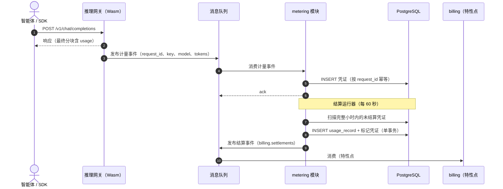
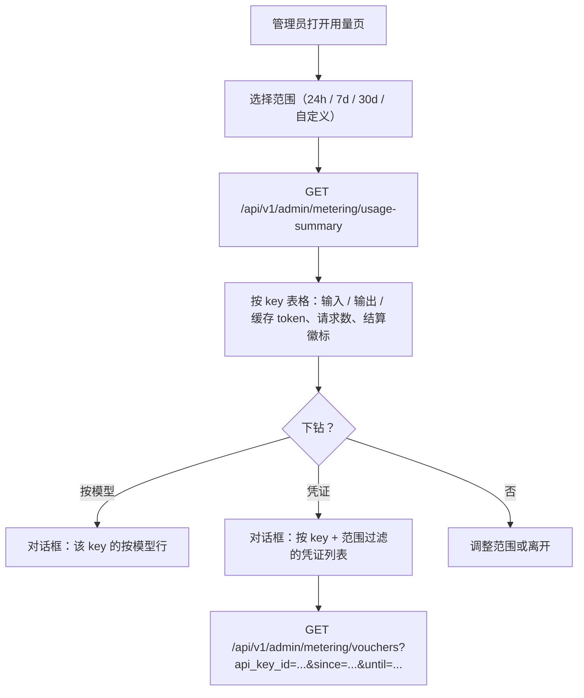

# Token 计量凭证与异步结算 —— 需求分析与 UI/UX 设计

| 属性 | 内容 |
| --- | --- |
| 特性点 | 按 API Key 的 Token 计量凭证与异步结算 |
| 文档范围 | `metering` 模块的需求分析与 UI/UX 设计：来自数据面的凭证摄取、按 API Key 的异步结算、用量查询 API、控制台用量页面，以及验收标准 |
| 归属模块 | `metering`（凭证摄取、结算、用量查询），以及 `auth`（API Key 身份）和 `billing`（结算交接，特性点 #5） |
| 相关文档 | [架构设计](./architecture.zh-cn.md) —— 第 2.5 节 `metering`、第 2.6 节 `billing`、第 4.3 节计量/结算时序 · [API Key 管理](./api-key-management.zh-cn.md) —— 凭证所依附的密钥身份 · [模型目录与一键部署](./model-catalog-deployment.zh-cn.md) —— 凭证携带的模型身份 |
| 状态 | 设计完成，已移交 Architect agent |

---

## 1. 背景与竞品调研

### 1.1 为什么现在做计量

特性点 #1–#3 交付了平台的推理主干：API Key 完成调用方认证，模型一键部署，引擎镜像被策展并预拉取。但平台的立身之本 —— **Token as a Service** —— 仍是一个桩：`MeteringService.IngestMeteringEvent` 回答「未实现」，从未写入任何凭证，控制台也无法回答「谁消耗了什么」。架构已经固定了形态：数据面网关的 Wasm 插件向消息队列发布 token 用量事件；`metering` 模块消费事件、铸造防篡改凭证，并把结算异步交给 `billing`。本特性点端到端实现这条流水线 —— 不含定价（特性点 #5）—— 这样当价格出现时，其下的用量数据已经完整、可查询、可审计。

### 1.2 竞品如何计量 Token 用量

| 产品 | 计量捕获 | 凭证 / 审计轨迹 | 结算节奏 | 用量可见性 | 值得注意的坑 |
| --- | --- | --- | --- | --- | --- |
| **OpenAI Platform** | 按 API key 在请求完成时跟踪用量；流式响应以最终分块的 `usage` 字段计量 | 无用户可见的凭证概念；用量记录约 5 分钟后可查 | 对预付费余额实时扣减，或按月开票 | 按 key、按模型的用量仪表盘，按天粒度；可经 API 导出用量 | 用量延迟（分钟级）让限流排查困惑；不暴露按请求的审计轨迹 |
| **SiliconFlow** | 平台侧按请求记账 token，挂到账户的 API key 上 | 控制台可见账单与用量记录；不暴露按请求下钻 | 实时余额扣减（预付费） | 控制台用量页：按模型 token 消耗、余额历史 | 无凭证级审计；有争议的账单无法追溯到请求 |
| **Anthropic Console** | 按请求捕获用量，缓存读/写作为独立行项 | 控制台用量查看器中的按请求用量行（管理员工作区） | 按月开票或预付费积分 | 用量页按天、按模型分解；管理员有按请求查看器 | 按请求查看器仅管理员可用；成员只能看聚合 |
| **AWS Bedrock** | 模型调用日志（CloudWatch）含每请求 token 数；可选详细调用日志落 S3 | S3 中的完整按调用记录（可选开启）—— 与凭证最接近的类比 | 按小时/按月对 AWS 账户计费 | CloudWatch 按模型指标；Cost Explorer 看支出 | 详细日志默认关闭 —— 不开启就只有聚合用量 |
| **DeepSeek Platform** | 补全按请求计量；控制台按模型分解用量 | 按 key 的用量记录；无按请求导出 | 预付费余额扣减 | 控制台按模型按天用量页 | 免费层无程序化获取用量的 API |
| **Together AI** | 按请求计量，请求时即按模型定价 | 控制台按 key 的用量历史 | 预付费积分扣减 | 按模型、按 key 的用量仪表盘 | 调用到用量出现的延迟未文档化 |

### 1.3 提炼的模式与决策

值得采纳的业界共性模式：

1. **在网关捕获，而非在业务流程中捕获** —— 所有调研平台都在边缘（或旁路）计量，计量绝不给推理调用增加延迟。go-taas 的架构已承诺这一点：Wasm 插件发布事件，推理路径从不等待。
2. **按请求的记录是审计单元** —— Bedrock 的 S3 调用日志与 Anthropic 的按请求查看器之所以存在，是因为聚合无法回答争议。每请求一张凭证（按 `request_id` 幂等）是一切聚合的原子。
3. **token 各部分分开捕获** —— prompt / completion / cached / reasoning token 在所有暴露它们的平台（Anthropic 的缓存读、proto 的 `TokenUsage`）中都是独立行项。过早合并会让后续定价（特性点 #5，输入/输出分别计价）不可能。
4. **结算异步且幂等** —— 没有调研平台与请求同步结算；预付费平台按近实时批次扣减，开票平台按周期聚合。至少一次投递 + 按凭证 id 去重是标准形态。
5. **用量按 key 和按模型可见** —— 每个控制台都暴露按 API key、按模型、按时间范围的用量分解；这是最小可行的仪表盘。

需要避免的坑：

- **用量延迟困惑**（OpenAI）—— 用量几分钟后才出现让用户以为调用丢了。控制台必须显式展示摄取时间戳与结算状态。
- **无按请求审计**（SiliconFlow）—— 有争议的账单必须能追溯到底层凭证。
- **可选的审计日志**（Bedrock）—— 如果凭证是可选的，最需要它的时候它就不在。凭证永远写入。
- **在请求路径上计量** —— 任何同步依赖（热路径中每次推理写一次数据库）都会把推理可用性与记账可用性耦合。摄取走消息队列，解耦。
- **没有原子的聚合** —— 只存预聚合用量会失去重新定价、重新分组、审计的能力。凭证是事实源；聚合是派生的、可重建的。

**go-taas 的决策**（记录理由，遵循自主决策规则）：

| # | 决策 | 理由 |
| --- | --- | --- |
| D1 | 凭证是**每推理请求一行**，以服务端生成的 `voucher_id`（UUID v4）为主键，`request_id` 上建唯一索引；摄取幂等 —— 重复的 `request_id` 被确认，不重写 | 按请求的记录是审计原子（Bedrock/Anthropic 模式）；幂等让至少一次的 MQ 投递无需去重基础设施即安全 |
| D2 | 凭证摄取**经既有消息队列异步进行**：数据面网关的 Wasm 插件向 `metering.events` 发布计量事件；`metering` 模块消费并写入凭证。`IngestMeteringEvent`（gRPC RPC）保留为直连/测试路径，与消费者共享同一处理器 | 架构已承诺 MQ 解耦计量；RPC 路径给测试与未来的非 Envoy 网关一个语义完全相同的同步入口 |
| D3 | 凭证携带完整 token 分解 —— `prompt_tokens`、`completion_tokens`、`cached_tokens`、`reasoning_tokens` —— 加上 `api_key_id`、`organization_id`、`model_id`、`service_id`（已知时）、`request_id`、`completed_at`；捕获时不做任何预聚合 | 分开的各部分是特性点 #5 输入/输出计价的前提；原始原子支持未来任何重新分组 |
| D4 | **结算是周期性批次**：`metering` 模块内的运行器把未结算凭证聚合为**用量记录** —— 每 `(api_key_id, period)` 一行，period 为固定的小时桶（UTC）—— 对各 token 部分与请求数求和；凭证通过关联用量记录 id 被标记为已结算。结算幂等：对已结算凭证重跑是空操作 | 小时桶在新鲜度（用量一小时内可见）与写入量（每 key 每小时一行，而非每请求一行）之间取得平衡；幂等让运行器崩溃安全、可重跑 |
| D5 | 用量记录是**查询面**：用量汇总从 `usage_records` 提供（快速、有索引），凭证列表保留用于审计下钻；两者都作为管理面 API 暴露在 `/api/v1/admin/metering/*` | 从记录取聚合让查询延迟不随凭证量增长而劣化；凭证保持可查询以解决争议 |
| D6 | **本特性不含定价**：结算只产出 token 总量；发往 `billing.settlements` 的结算事件（由特性点 #5 消费）携带用量记录 id 与 token 汇总，不携带金额 | 定价是特性点 #5 的契约；耦合会让本特性被价格矩阵阻塞，并在价格变化时被迫重新结算 |
| D7 | 凭证默认**保留 90 天**（可配置），之后由周期清理删除；用量记录无限期保留（体量小，且是计费证据） | 原始按请求数据量大，审计价值衰减快于计费证据；保留窗口是配置而非代码 |
| D8 | 计量 API 是**管理面**（`/api/v1/admin/metering/...`），经既有 `X-Organization-Id` 头按组织限定，与 API Key 一致；数据面事件路径在事件本身携带组织 id | 与既定的管理/用户分离一致；过渡期的组织头是当前身份机制（特性点 #6/#7 将替换它） |
| D9 | 新增错误码 **10403 `CodeMeteringVoucherNotFound`**（未知凭证 id）与 **10404 `CodeMeteringRangeInvalid`**（畸形时间范围：since > until，或跨度 > 92 天）；既有 10401 `CodeMeteringEventInvalid` 覆盖畸形事件（缺 request_id、负 token），10402 `CodeMeteringVoucherError` 覆盖凭证写失败 | 104xx 块为计量保留；not-found、invalid-range、invalid-event 各自独立编码，让 API 消费方的处理精确，镜像 image 模块 D10/D11 的模式 |
| D10 | 控制台新增**用量页**（`/admin/usage`）：时间范围选择器、按 API key 的用量表（输入/输出 token、缓存、请求数）、下钻到按模型分解与凭证列表；结算状态列区分已结算与待结算小时 | 按 key/按模型、按范围的用量是每个竞品都交付的最小可行仪表盘；下钻让争议无需数据库控制台即可解决 |
| D11 | 凭证列表 API 支持按 `api_key_id`、`model_id`、时间范围过滤，分页，最新在前；用量汇总 API 支持在单个组织内按 `api_key`（默认）或 `model` 分组 | 两种分组覆盖控制台的表格与下钻；跨组织分组是平台运营者需求，随多租态（#6）延后 |

### 1.4 范围边界

**范围内**：计量事件摄取（MQ 消费者 + gRPC 直连路径，共享处理器，按 `request_id` 幂等）、带完整 token 分解的凭证持久化、产出每 (key, 小时) 用量记录并幂等标记的小时结算运行器、向 `billing.settlements` 发布结算事件、用量汇总 / 凭证列表 / 用量记录查询 API（管理面、按组织限定）、凭证保留清理，以及带下钻的控制台用量页。

**范围外**（另行跟踪）：用量记录上的定价与金额（#5 —— 价格矩阵与账单生成）、请求准入时的余额/配额执行（#8 —— 预留与余额不足拒绝）、终端用户（非管理员）用量可见性（#6/#7 —— 需要真实租户）、实时流式用量仪表盘（未来 —— 小时批次是 v1 节奏）、控制台中的按请求成本归因（需要 #5）、以及 Wasm 插件本身（数据面网关是独立部署；本特性消费其事件并提供直连 RPC 用于测试 —— 合成事件驱动验证）。

---

## 2. 用户角色

| 角色 | 描述 | 与计量的交互 |
| --- | --- | --- |
| **平台管理员** | 运行 go-taas 集群的运维者；今天也是控制台用户 | 查看按 API key 与模型的用量、下钻凭证审计账单、监控结算健康度 |
| **组织管理员（未来）** | 消费平台的租户侧管理员 | 将看到其组织的用量（同一页面，由租户限定，#6） |
| **智能体 / SDK** | 其调用产生用量的程序化消费方 | 从不直接触碰计量 API；其请求经网关产生凭证 |
| **计费流水线（特性点 #5）** | 结算事件的下游消费者 | 消费携带用量记录 id 与 token 汇总的 `billing.settlements` 事件 |
| **审计者** | 解决用量争议的人 | 使用按 key/模型/时间过滤的凭证列表把聚合追溯到单个请求 |

> 术语：消费侧调用方称为**智能体**（英文 Agent），与仓库约定一致。

---

## 3. 用户故事

| # | 作为… | 我想要… | 以便… |
| --- | --- | --- | --- |
| US1 | 平台管理员 | 看到按 API key 的、按时间范围的 token 用量，分解为输入/输出/缓存 token 与请求数 | 无需查询数据库即可回答「谁消耗了什么」 |
| US2 | 平台管理员 | 从用量汇总下钻到某个 API key 的按模型消耗 | 找出哪个模型驱动了某个 key 的消耗 |
| US3 | 平台管理员 | 从用量汇总下钻到底层凭证（按请求的记录） | 通过把聚合追溯到单个请求来审计或质疑它 |
| US4 | 平台管理员 | 看到某个小时的用量是已结算还是待结算 | 在基于数据行动前知道数据是否完整 |
| US5 | 平台管理员 | 按 API key、模型、时间范围过滤凭证，分页 | 找到尖峰背后的确切请求 |
| US6 | 平台管理员 | 摄取永不拖慢或阻塞推理 | 计量不会成为可靠性负债 |
| US7 | 智能体 / SDK | 我发出的每个请求都恰好被计数一次 | 即使消息队列重投，我的用量（与未来账单）也是公平的 |
| US8 | 计费流水线 | 每个已结算的用量记录收到一个携带 token 汇总的结算事件 | 无需重扫凭证即可定价与开票 |
| US9 | 审计者 | 凭证一旦写入即不可变 | 聚合可随时重新推导与验证 |
| US10 | 平台管理员 | 保留窗口过后旧的原始凭证被自动清理 | 存储不会无限增长，而用量记录作为计费证据保留 |

---

## 4. 功能需求

### FR1 —— 计量事件摄取

- **FR1.1** `metering` 模块在 `metering.events` 主题上运行 MQ 消费者。每个事件携带：`request_id`、`organization_id`、`api_key_id`、`model_id`、可选 `service_id`、四个 token 计数、`completed_at`（unix 秒）。
- **FR1.2** 缺少 `request_id`、`api_key_id` 或 `model_id`，或 token 计数为负的事件被**永久拒绝**（记日志并跳过，不重试）—— 畸形输入永远不可能成功，镜像预热状态消费者的策略。
- **FR1.3** 摄取**按 `request_id` 幂等**：若同 `request_id` 的凭证已存在，事件以既有 `voucher_id` 被确认，不写第二行。
- **FR1.4** gRPC RPC `IngestMeteringEvent` 与 MQ 消费者共享处理器，因此直连路径（测试、未来非 Envoy 网关）具有完全相同的语义与幂等性。
- **FR1.5** 瞬态数据库失败返回错误以供**代理层重试**（至少一次投递）；处理器绝不确认一个它未完成的写入。

### FR2 —— 凭证持久化与形态

- **FR2.1** 每个摄取的事件写一行 `vouchers`：`voucher_id`（UUID v4，主键）、`request_id`（唯一索引）、`organization_id`、`api_key_id`、`model_id`、`service_id`（可空）、`prompt_tokens`、`completion_tokens`、`cached_tokens`、`reasoning_tokens`、`completed_at`、`created_at`、`settled_usage_record_id`（可空，由结算设置）。
- **FR2.2** 凭证**不可变**：任何 API 都不更新或删除凭证行（保留清理是唯一的删除者，且它不是 API）。
- **FR2.3** 索引：`request_id` 唯一；`(organization_id, completed_at)` 复合索引用于审计列表；`(api_key_id, completed_at)` 复合索引用于结算扫描；`settled_usage_record_id` 的空值索引用于结算运行器的待处理扫描。

### FR3 —— 异步结算

- **FR3.1** 结算运行器（`metering` 模块内的一个 `server.Runner`）按可配置间隔（默认 60 秒）唤醒，只结算**完整的小时桶**：当 `now >= 小时起点 + 1h + 宽限期` 后该小时才符合条件（宽限期默认 5 分钟，可配置），以免迟到的凭证被遗弃。
- **FR3.2** 对每个有未结算凭证的 `(api_key_id, hour)`，运行器在一个事务中插入一行 `usage_records` —— `usage_record_id`（UUID v4）、`organization_id`、`api_key_id`、`period_start`（小时起点，unix 秒）、`period_end`（小时起点 + 3600）、求和后的 `prompt_tokens`、`completion_tokens`、`cached_tokens`、`reasoning_tokens`、`request_count`、`settled_at` —— 并用 `settled_usage_record_id` 标记参与结算的凭证。
- **FR3.3** 结算**幂等且崩溃安全**：`(api_key_id, period_start)` 上的唯一索引使重复插入不可能；崩溃的运行重扫待处理凭证并收敛；凭证绝不会被重复计数，因为标记与插入是原子的。
- **FR3.4** 提交用量记录后，运行器向 `billing.settlements` 发布结算事件，携带用量记录 id、api key id、组织 id、周期与 token 汇总。发布失败在下一个运行器周期重试（用量记录的 `settlement_event_published` 标志，默认 false，控制重发）—— 结算本身绝不因发布失败而回滚。
- **FR3.5** 运行器的工作协程数、间隔与宽限期可配置（`metering.settlement` 配置节）；当 MQ 或 DB 组件不可用时运行器禁用，镜像预热状态消费者。

### FR4 —— 用量与凭证查询

- **FR4.1** `GetUsageSummary`（`GET /api/v1/admin/metering/usage-summary`）对单个组织与时间范围（`since`/`until`，unix 秒，跨度 ≤ 92 天）返回按 key（默认）或按模型（group-by 参数）的用量行：分组键、求和的各 token 部分、请求数、已结算/待结算的拆分（完全结算 vs 未结算的小时）。
- **FR4.2** `ListVouchers`（`GET /api/v1/admin/metering/vouchers`）返回按 `api_key_id`、`model_id`、时间范围过滤的凭证，分页（默认 20，上限 100），最新在前，每行含完整 token 分解与 `settled` 布尔值。
- **FR4.3** `GetVoucher`（`GET /api/v1/admin/metering/vouchers/{voucher_id}`）返回单个凭证；未知 id 返回 10403。
- **FR4.4** `ListUsageRecords`（`GET /api/v1/admin/metering/usage-records`）返回按 `api_key_id` 与时间范围过滤的已结算用量记录，分页，最新周期在前 —— 计费证据视图。
- **FR4.5** 四个 API 都要求 `X-Organization-Id` 头并把每个查询限定到该组织（D8）；缺失头时的行为与既有管理 API 一致（空/零结果，与过渡期身份模型一致）。
- **FR4.6** `since > until` 或跨度超过 92 天的时间范围返回 10404；默认 `until = now`、`since = until - 24h`。

### FR5 —— 保留

- **FR5.1** 保留运行器（同一 `server.Runner`，第二个定时器）删除 `created_at` 早于配置保留期（默认 90 天）的凭证，分批进行（默认每批 1000 行），记录删除数量。
- **FR5.2** 用量记录永不被保留策略删除；它们是持久的计费证据（D7）。
- **FR5.3** 保留只删除**已结算**的凭证（`settled_usage_record_id` 为空且早于窗口的凭证被保留并记日志 —— 它属于结算终将处理的未结算小时）。

### FR6 —— 控制台用量页

- **FR6.1** 「Usage」导航项（`/admin/usage`）打开用量页：时间范围选择器（预设：最近 24 小时、7 天、30 天、自定义 since/until），以及按 API key 的用量表 —— key 名称（由 key id 解析）、输入 token、输出 token、缓存 token、请求数、已结算/待结算徽标。
- **FR6.2** 行操作「By model」打开下钻对话框：该 key 在范围内的按模型消耗（同样列，去掉 key 列）。
- **FR6.3** 行操作「Vouchers」打开凭证下钻：预过滤到该 key 与范围的凭证列表（时间、request id、模型、token 分解、已结算徽标），分页。
- **FR6.4** 页面显示数据新鲜度说明（「用量在一小时内出现；当前小时为待结算」），可见时每 60 秒轮询刷新。
- **FR6.5** 空状态显示「No usage in this range」，并提示首次推理调用后用量才会出现。

---

## 5. 页面与流程设计

### 5.1 页面地图

| 页面 / 组件 | 用途 |
| --- | --- |
| **用量页**（`/admin/usage`） | 时间范围选择器、按 key 的用量表、下钻操作 |
| **按模型用量对话框** | 单个 key 与范围内的按模型分解 |
| **凭证下钻对话框** | 按 key 与范围预过滤的凭证列表 |
| **API Keys 页**（既有） | 不变；用量是独立页面（key 仍是身份面） |

### 5.2 摄取与结算时序

### 5.3 用量页流程

---

## 6. API 面影响

所有 API 属于 **`taas.metering.v1.MeteringService`**（proto：`proto/taas/metering/v1/metering.proto`），经控制网关以 HTTP 提供。两个 RPC 已存在（一个现在实现、一个扩展）；新增三个。proto 变更仅为增量。

| RPC | HTTP | 状态 | 用途 | 备注 |
| --- | --- | --- | --- | --- |
| `IngestMeteringEvent` | 内部 gRPC（无 HTTP 绑定） | 已存在，现在实现 | 测试与非 Envoy 网关的直连摄取路径 | 按 `request_id` 幂等；与 MQ 消费者共享处理器 |
| `ListVouchers` | `GET /api/v1/admin/metering/vouchers` | 已存在，现在实现 | 带过滤的审计列表 | 增加 `api_key_id`、`model_id` 过滤，`VoucherSummary` 上补全 token 分解 + `settled` |
| `GetVoucher` | `GET /api/v1/admin/metering/vouchers/{voucher_id}` | **新增** | 单个凭证审计 | 未知 id 返回 10403 |
| `GetUsageSummary` | `GET /api/v1/admin/metering/usage-summary` | **新增** | 按 key 或按模型的聚合 | `group_by` = `api_key`（默认）或 `model`；`since`/`until` |
| `ListUsageRecords` | `GET /api/v1/admin/metering/usage-records` | **新增** | 已结算记录（计费证据） | 按 `api_key_id`、时间范围过滤 |

契约约束：

1. `IngestMeteringEvent` 校验：`request_id`、`api_key_id`、`model_id` 非空；token 计数 ≥ 0；`completed_at` > 0。违反返回 10401 且不写入任何内容。
2. `VoucherSummary` 携带全部四个 token 部分、`service_id`（未知时为空）、`completed_at`、`settled`（布尔）—— 审计视图必须无需二次调用即完整。
3. `GetUsageSummary` 的行携带分组键（`api_key_id` 或 `model_id`）、求和的各 token 部分、`request_count`、`settled_hours`/`pending_hours`，让控制台能标记完整性。
4. 时间范围参数为 unix 秒；`since > until` 或跨度 > 92 天返回 10404；默认 `until = now`、`since = until - 24h`。
5. 线上格式约定不变：点分分页、成功 HTTP 200、业务错误为 `{"code": <int>, "message": "..."}`。
6. `billing.settlements` 上的结算事件载荷是 JSON 文档：`{usage_record_id, api_key_id, organization_id, period_start, period_end, prompt_tokens, completion_tokens, cached_tokens, reasoning_tokens, request_count, settled_at}` —— 特性点 #5 的契约，只增字段地版本化。

错误码（计量区间 10401–10499，`pkg/errors/codes.go`）：

| 条件 | 码 | 常量 | 备注 |
| --- | --- | --- | --- |
| 畸形计量事件（缺 id、负 token、坏时间戳） | 10401 | `CodeMeteringEventInvalid` | 既有；MQ 路径记日志并永久跳过，RPC 路径返回错误 |
| 凭证写失败（基础设施） | 10402 | `CodeMeteringVoucherError` | 既有；MQ 路径返回以供代理重试 |
| `GetVoucher` 的未知 `voucher_id` | 10403 | `CodeMeteringVoucherNotFound` | **新增**（D9） |
| 畸形时间范围（`since > until`、跨度 > 92 天） | 10404 | `CodeMeteringRangeInvalid` | **新增**（D9） |
| 数据库 / MQ 基础设施失败 | 500 | `CodeInternal` | 经错误归一化 |

---

## 7. 验收标准

| # | 标准 | 验证方式 |
| --- | --- | --- |
| AC1 | `IngestMeteringEvent` 以合法事件写入带完整 token 分解的凭证并返回其 `voucher_id`；再次摄取相同 `request_id` 返回既有 `voucher_id` 且不写第二行 | 单元测试 + FVT |
| AC2 | 缺少 `request_id` / `api_key_id` / `model_id` 或 token 计数为负的事件被以 10401 拒绝（RPC）/ 记日志并永久跳过（MQ），且不写入任何内容 | 单元测试 |
| AC3 | `metering.events` 上的 MQ 消费者把已发布事件摄取为与 RPC 路径完全相同的凭证（共享处理器） | 单元测试 |
| AC4 | 结算运行器对完整过去小时内的凭证，按 `(api_key_id, hour)` 产出一条用量记录，token 各部分与 `request_count` 求和正确，且每个参与凭证被标记记录 id | 单元测试 |
| AC5 | 结算幂等：成功一轮后重跑运行器不写重复用量记录（`(api_key_id, period_start)` 唯一），凭证保持已标记 | 单元测试 |
| AC6 | 当前（不完整）小时不被结算；小时仅在 `小时起点 + 1h + 宽限期` 之后才符合条件 | 单元测试 |
| AC7 | 结算后向 `billing.settlements` 发布携带用量记录 id 与 token 汇总的结算事件；发布失败不回滚结算并在下一轮重试 | 单元测试 |
| AC8 | `GetUsageSummary` 对组织与范围返回求和正确、含已结算/待结算拆分的按 key 行；`group_by=model` 返回按模型行 | FVT |
| AC9 | `ListVouchers` 按 `api_key_id`、`model_id`、时间范围过滤，分页最新在前，每行含 token 分解与 `settled` 标志；`GetVoucher` 返回单个凭证，未知 id 返回 10403 | FVT |
| AC10 | `since > until` 或跨度 > 92 天的时间范围在每个计量查询 API 上返回 10404 | FVT |
| AC11 | 保留运行器分批删除早于配置窗口的已结算凭证，保留未结算的，且绝不触碰用量记录 | 单元测试 |
| AC12 | 用量页渲染时间范围预设、按 key 的用量表（输入/输出/缓存 token、请求数、结算徽标）与空状态 | E2E |
| AC13 | 「By model」下钻显示所选 key 与范围的按模型行；「Vouchers」下钻显示预过滤、分页的凭证列表 | E2E |
| AC14 | 计量查询 API 限定到 `X-Organization-Id` 头：一个组织的查询绝不返回另一个组织的凭证、汇总或记录 | FVT |
| AC15 | 摄取一批事件（如 1000 条）无丢失完成，且下一轮结算把它们全部恰好聚合一次 | 单元测试 |

---

## 8. 遗留开放项

| 事项 | 延后至 |
| --- | --- |
| 用量记录上的定价与金额；账单生成 | 特性点 #5（价格矩阵与阶梯定价） |
| 请求准入时的余额/配额执行（预留、余额不足） | 特性点 #8（余额与配额模式） |
| 终端用户（租户）用量可见性与按租户限定 | 特性点 #6/#7（多租户、SSO） |
| 实时流式用量（亚小时新鲜度） | 未来 —— v1 节奏为小时批次 + 60 秒运行器 |
| 控制台中的按请求成本归因 | #5 之后（需要价格） |
| 发布真实网关事件的 Envoy Wasm 插件 | 数据面网关部署（独立轨道；本特性消费其契约并以合成事件验证） |
| 面向外部审计的凭证导出（CSV/JSON） | 未来控制台增强 |
