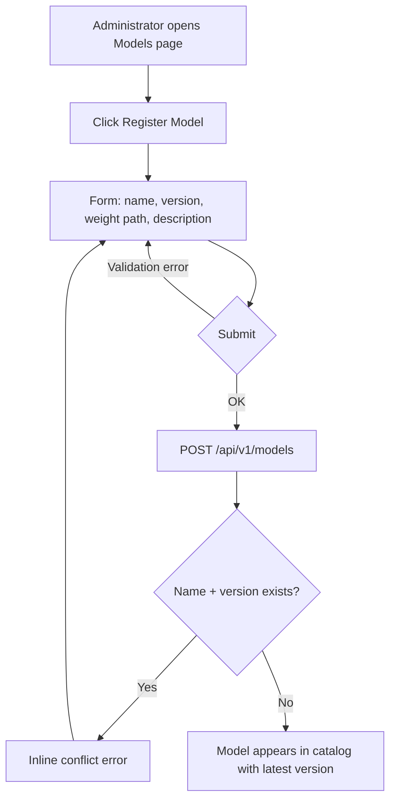
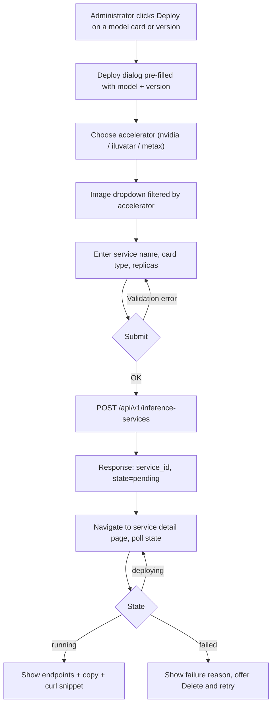
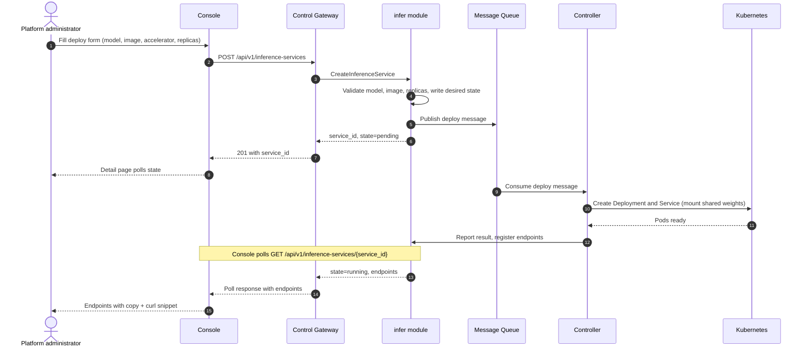
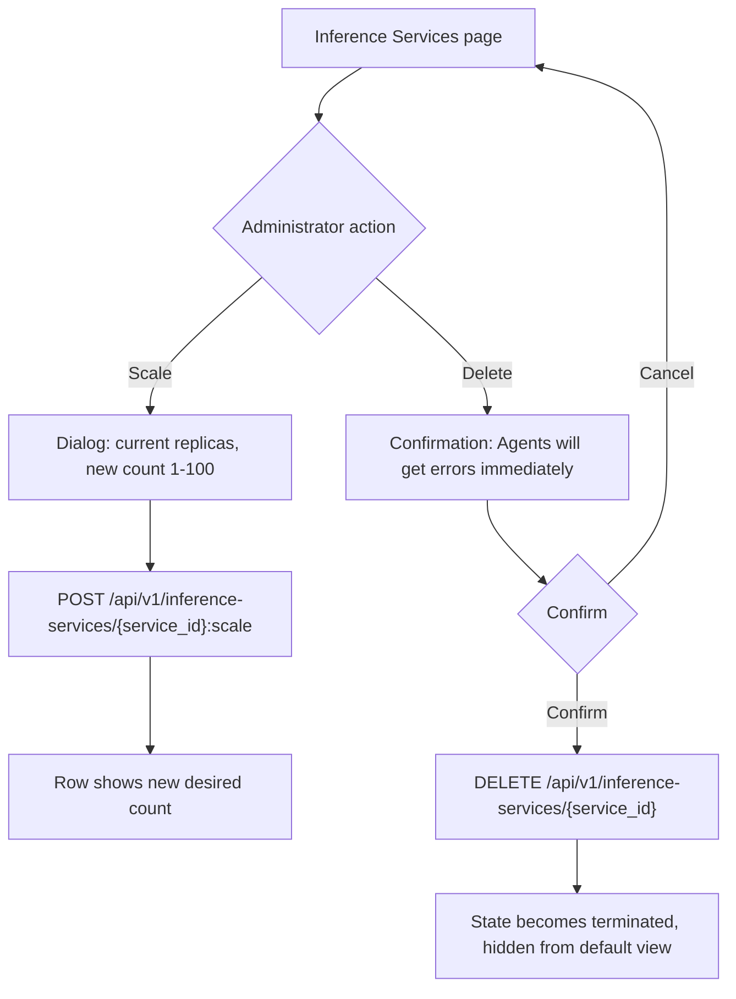

# Model Catalog & One-Click Deployment — Requirement Analysis and UI/UX Design

| Attribute | Content |
| --- | --- |
| Feature point | Model catalog & one-click deployment (console + API) |
| Document scope | Requirement analysis and UI/UX design for the model catalog and one-click inference-service deployment capability: console pages, user flows, API surface, and acceptance criteria |
| Owning modules | `model` (catalog and weight assets), `infer` (inference-service lifecycle), with `image` (engine image selection) |
| Related documents | [Architecture Design](./architecture.md) — Section 2.2 `model`, Section 2.4 `infer`, Section 2.3 `image`, and Section 4.2 the one-click model deployment flow |
| Status | Design complete, handed to the Architect agent |

---

## 1. Background and Competitive Research

### 1.1 Why the Catalog and One-Click Deployment Come Now

go-taas is a Token-as-a-Service platform: the value it sells is inference tokens, and tokens can only be produced by running inference services. The catalog is where the supply side starts — an administrator registers open-source LLMs (Qwen, DeepSeek, LLaMA, …) with their weight paths in object storage — and one-click deployment is how a registered model becomes a serving endpoint that Agents can call through the Inference Gateway. The architecture already fixes the mechanics (Section 4.2): the console calls the control plane, the change is published to the message queue, and the Controller turns it into Kubernetes Deployments and Services. This feature point defines what the user sees and does.

### 1.2 How Comparable Products Implement Catalogs and Deployment

| Product | Catalog UX | Deployment form | Deployment feedback | Notable pitfalls |
| --- | --- | --- | --- | --- |
| **OpenAI Platform** | No self-hosted catalog — models are platform-hosted and selected by model name in the API call | Not applicable (no customer-visible deployment) | Not applicable | The "no deployment" model only works because OpenAI owns the entire fleet; a private TaaS platform must expose deployment |
| **Anthropic Console** | Same as above — hosted models only | Not applicable | Not applicable | Same as above |
| **Together AI** | Model catalog of open models with model cards (context length, pricing per M tokens) | Dedicated endpoints: pick a model, GPU type, and replica count; standard deployments are serverless | Endpoint page shows running state and API base URL | Serverless and dedicated tiers confuse users about which one they are calling |
| **SiliconFlow** | Model square (模型广场) with 100+ pre-integrated models, tags for fast filtering, pricing and rate limits on each card | One-click custom model deployment from 30+ preset templates; visual configuration advertised as "within 3 minutes"; reserved instances for exclusive compute | Deployment progress visible in console | The template list can overwhelm; heterogeneous chip support (domestic GPUs) must be surfaced clearly |
| **Azure AI Foundry** | 1,900+ models organized in provider collections; model cards with quick facts, capabilities (token limits, tool calling), benchmarks, and existing deployments; filters by collection, capability, deployment option, and inference task | Two paths: standard (serverless, pay-per-token) and managed compute (deploy model weights to dedicated VMs, billed by core hours) | Model card has an "Existing deployments" tab; deployment wizard walks through compute, and the endpoint appears on completion | Two deployment models double the decision surface; region and quota constraints surface late in the wizard |
| **Aliyun Bailian (Model Studio)** | Model square with cards for open models; each card links to deployment and fine-tuning | Deploy open models as dedicated inference services: choose model, compute instance type (GPU spec), and replicas | Service list shows deployment status and the invocation endpoint | Deployment and fine-tuning are separate flows that share the model card, which confuses first-time users |
| **Volcengine Ark** | Model garden (模型广场) with model cards; inference endpoints (推理接入点) created per model | Create an endpoint: pick model version, GPU card type, and replicas; serverless option for flagship models | Endpoint list shows status and QPS metrics | Endpoint naming and model version coupling is confusing when the same model is deployed twice |

### 1.3 Distilled Patterns and Decisions

Common industry patterns worth adopting:

1. **Model cards in a flat, filterable list** — every surveyed product shows models as cards or table rows with name, version, and a short description; Azure adds capability facts and benchmark tabs. The card is the anchor for "deploy this".
2. **Deployment is a short guided form, not YAML** — Together, SiliconFlow, Aliyun Bailian, and Volcengine Ark all reduce deployment to: model + version, compute (card type), image/engine, replicas. Nobody asks the user to write Kubernetes manifests.
3. **The deployment result is an endpoint with a copyable base URL** — the user's end goal is an OpenAI-compatible endpoint to point Agents at; the console must surface it immediately on the service detail page.
4. **Async state with visible progress** — deployment takes minutes (image pull, weight mount, pod scheduling); every product shows a state (pending / deploying / running / failed) instead of blocking the HTTP call.
5. **Scale is a first-class operation** — changing replica count is common and safe; Together and Volcengine Ark expose it directly on the service row.

Pitfalls to avoid:

- **Two deployment mental models** (Azure's serverless vs managed compute) — go-taas has exactly one deployment model (dedicated inference services on the platform cluster), so the UI must not invent tier jargon.
- **Late quota/compute errors** — invalid accelerator/card-type combinations must be rejected at form time, not after the message hits the Controller.
- **Silent state changes** — a deployment that flips to `failed` must be visible (status column + detail), with the failure reason surfaced, or users will keep waiting forever.
- **Version ambiguity** — deploying "Qwen" without pinning a version makes later upgrades invisible; the form must always pin model + version.

**Decisions for go-taas** (recorded rationale, per the autonomous-decision rule):

| # | Decision | Rationale |
| --- | --- | --- |
| D1 | The catalog is the list of models registered through `RegisterModel` (name, version, weight path, description); the console shows one card per model with its latest version and a version list on the detail page | Matches the `model` module's metadata role (architecture Section 2.2); no marketplace or external registry sync in this feature point |
| D2 | One-click deployment is a single guided form with exactly: **Service name**, **Model + version** (picked from the catalog), **Accelerator** (nvidia / iluvatar / metax), **Card type** (`accelerator_type`), **Image** (filtered to the chosen accelerator), **Replicas** (1–100) | Mirrors `CreateInferenceService` fields one-to-one; no YAML, no Kubernetes concepts exposed |
| D3 | Deployment is asynchronous: the create call returns immediately with `state=pending`; the state machine is `pending → deploying → running / failed`, and `terminated` after deletion; the console polls the service list/detail | Matches architecture Section 4.2 (MQ + Controller reconciliation); blocking on pod readiness would time out the HTTP call |
| D4 | The image dropdown is filtered by the selected accelerator; images incompatible with the chosen card type are hidden, not merely disabled | The `image` module owns the adaptation matrix (architecture Section 2.3); wrong combinations must be impossible to submit |
| D5 | Scaling (replica count change) is an in-place operation on the service row; any other change (model, version, image, card type) requires delete + recreate | Matches `ScaleInferenceService` (replicas only); avoids half-updatable state |
| D6 | The service detail page shows the OpenAI-compatible endpoint(s) with a copy button and a "try it" curl snippet | The endpoint is the user's actual deliverable; Agents call it through the Inference Gateway with an API Key |
| D7 | Deletion requires a confirmation dialog naming the service and warning that Agents calling its endpoints will immediately receive errors; deleted services keep `state=terminated` in the list until filtered out | Prevents accidental destruction of serving endpoints while keeping the list actionable |
| D8 | Model registration (catalog entry creation) is an administrator action with a form symmetric to the API: name, version, weight path, description; duplicate name+version is rejected | Keeps console and API parity; the weight path must already exist in object storage (validated syntactically, existence is the Controller's job at deploy time) |

### 1.4 Scope Boundary

**In scope**: model registration and catalog browsing (list, detail with versions), one-click deployment of a registered model as an inference service (create, list, detail with endpoints, scale, delete), deployment state visibility, and image selection constrained by accelerator.

**Out of scope** (tracked by other feature points): image registration, versioning, and the full image×card adaptation matrix UI (#3), image pre-pull/warmup orchestration (#3), per-model pricing display (#5), tenant-level model authorization (#6), autoscaling policies, canary upgrades, and fine-tuning flows.

---

## 2. User Roles

| Role | Description | Interaction with the catalog and deployment |
| --- | --- | --- |
| **Platform administrator** | The operator who runs the go-taas cluster and curates which models the platform serves | Registers models into the catalog, deploys inference services, scales and deletes them, and reads deployment state |
| **Organization administrator (future)** | A tenant-side administrator consuming the platform | Out of scope for this feature point; the API surface is organization-scoped from day one (services belong to an organization), so tenant consumption can be enabled without breaking changes |
| **Agent / SDK** | The programmatic consumer that calls `/v1/chat/completions` | Never touches the catalog or deployment APIs; consumes the endpoints that deployment produces, through the Inference Gateway with an API Key |

> Terminology: the consumer-side caller is called an **Agent** (English) / 「智能体」(Chinese), consistent with the repo convention.

---

## 3. User Stories

| # | As a… | I want to… | So that… |
| --- | --- | --- | --- |
| US1 | Platform administrator | register a model with its name, version, weight path, and description | the model appears in the catalog and becomes deployable |
| US2 | Platform administrator | browse the catalog with search and see each model's latest version and description | I can find the right model quickly without leaving the console |
| US3 | Platform administrator | open a model and see all its registered versions | I can pick the exact version to deploy and know what changed |
| US4 | Platform administrator | deploy a model with one guided form (model, image, accelerator, card type, replicas) | I get a serving endpoint without writing any Kubernetes YAML |
| US5 | Platform administrator | watch the deployment go through pending / deploying / running and see the reason if it fails | I know when the service is actually usable and what to fix if it is not |
| US6 | Platform administrator | copy the endpoint URL and a ready-made curl snippet from the service detail page | I can hand the endpoint to Agents immediately |
| US7 | Platform administrator | scale replicas up or down from the service list | I can react to load without redeploying |
| US8 | Platform administrator | delete a service with a clear warning about breaking Agents | I can retire services safely |
| US9 | Agent / SDK | call a deployed model through its endpoint with my API Key | I get OpenAI-compatible completions without knowing anything about the deployment |

---

## 4. Functional Requirements

### FR1 — Register Model (catalog entry)

- **FR1.1** The console provides a "Register Model" action on the Models page, opening a form with: **Name** (required, 1–128 chars), **Version** (required, 1–64 chars), **Weight path** (required, object-storage path, e.g. `models/qwen2.5-32b/`), **Description** (optional, ≤ 1024 chars).
- **FR1.2** Registering a name+version that already exists returns a clear conflict error; registering a new version of an existing name adds that version to the model's version list and updates `latest_version` if it is the newest.
- **FR1.3** The weight path is validated syntactically (non-empty, no `..` segments); actual existence in MinIO/JuiceFS is checked at deployment time by the Controller, and a missing weight path surfaces as a `failed` deployment with that reason.
- **FR1.4** Deleting a model requires confirmation and is blocked with an actionable error while any non-terminated inference service still references it.

### FR2 — Catalog browsing

- **FR2.1** The Models page lists registered models as cards/table rows: **Name**, **Latest version**, **Description** (truncated), **Created**, and a "Deploy" action.
- **FR2.2** The list is paginated (`offset`/`limit`, default 20, max 100) and searchable by name (client-side filter over the current page plus server-side query when the API supports it).
- **FR2.3** The model detail page shows the model's metadata (weight path, description) and the full version list, each version with a "Deploy this version" action.

### FR3 — One-click deployment (create inference service)

- **FR3.1** The "Deploy" action (from a model card or a version row) opens a deployment form pre-filled with the chosen model and version: **Service name** (required, DNS-safe, 1–63 chars), **Model + version** (pre-filled, changeable), **Accelerator** (nvidia / iluvatar / metax), **Card type** (free-text `accelerator_type`, e.g. `A800`, `H800`, `BI-V150`), **Image** (dropdown from `ListImages`, filtered by the chosen accelerator), **Replicas** (integer, 1–100, default 1).
- **FR3.2** Changing the accelerator re-filters the image dropdown; incompatible images are hidden. If no image matches the accelerator, the form shows "No image available for this accelerator — register one in Image Management" and disables submit.
- **FR3.3** Submit calls `CreateInferenceService`; the response returns `service_id` with `state=pending` immediately; the console navigates to the service detail page, which polls until the state leaves `pending`.
- **FR3.4** Validation errors (bad name, replicas out of range, unknown model/image) are shown inline in the form and never reach the message queue.

### FR4 — Deployment state visibility

- **FR4.1** The inference-services list shows each service's **State** as a colored badge: `pending` (grey), `deploying` (blue), `running` (green), `failed` (red), `terminated` (grey strikethrough).
- **FR4.2** The service detail page shows the state, the full spec (model, version, image, accelerator, card type, replicas), and — when `running` — the endpoint list with copy buttons and a curl snippet.
- **FR4.3** A `failed` service shows the failure reason returned by the Controller path; the detail page offers "Delete and retry" (delete + pre-filled create form).
- **FR4.4** The list refreshes on a 10-second poll while any service is `pending` or `deploying`, and on manual refresh otherwise.

### FR5 — Scale

- **FR5.1** Each non-terminated service row offers "Scale", opening a small dialog with the current replica count and a new count (1–100).
- **FR5.2** Scaling calls `ScaleInferenceService` and returns immediately; the state stays `running` (or returns to `deploying` while replicas converge); the row shows the new desired count.

### FR6 — Delete

- **FR6.1** Each non-terminated service row offers "Delete", opening a confirmation dialog naming the service and warning: "Agents calling this service's endpoints will immediately receive errors."
- **FR6.2** Deletion is idempotent; the service moves to `terminated` and disappears from the default list view (a "show terminated" toggle reveals it).
- **FR6.3** Deleting a model referenced only by terminated services succeeds.

### FR7 — Endpoint consumption contract

- **FR7.1** Endpoints returned by `GetInferenceService` are OpenAI-compatible base URLs on the Inference Gateway; the console's curl snippet uses `/v1/chat/completions` with a `Bearer` API Key placeholder.
- **FR7.2** The console never fabricates endpoint URLs; it displays exactly what the API returns.

---

## 5. Page and Flow Design

### 5.1 Page Map

| Page / component | Purpose |
| --- | --- |
| **Models page** (`/models`) | Catalog: registered models with search, pagination, register action, per-card deploy action |
| **Register Model dialog** | Name, version, weight path, description |
| **Model detail page** (`/models/{model_id}`) | Metadata + version list, per-version deploy action |
| **Inference Services page** (`/inference-services`) | Service list with state badges, scale and delete actions |
| **Deploy dialog** | The one-click deployment form (FR3) |
| **Service detail page** (`/inference-services/{service_id}`) | State, spec, endpoints with copy + curl snippet, failure reason |

### 5.2 Register Model Flow

### 5.3 One-Click Deployment Flow

### 5.4 Deployment Sequence (control plane and Controller)

### 5.5 Scale and Delete Flow

---

## 6. API Surface Implications

The design spans three proto services, all served as HTTP via the Control Gateway (`grpc-gateway`). The current protos already define the needed surface; this design confirms and constrains it:

| RPC | HTTP | Purpose | Notes |
| --- | --- | --- | --- |
| `RegisterModel` (`taas.model.v1`) | `POST /api/v1/models` | Register a model version | `name` + `version` unique; `weight_path` required |
| `ListModels` (`taas.model.v1`) | `GET /api/v1/models` | Paginated catalog list | Returns `ModelSummary` (model_id, name, latest_version, weight_path) |
| `GetModel` (`taas.model.v1`) | `GET /api/v1/models/{model_id}` | Model detail with version list | Drives the detail page |
| `DeleteModel` (`taas.model.v1`) | `DELETE /api/v1/models/{model_id}` | Remove a catalog entry | Blocked while referenced by live services |
| `CreateInferenceService` (`taas.infer.v1`) | `POST /api/v1/inference-services` | One-click deploy | Returns `service_id`, `state=pending`; async via MQ |
| `ListInferenceServices` (`taas.infer.v1`) | `GET /api/v1/inference-services` | Service list with states | Drives the list page and polling |
| `GetInferenceService` (`taas.infer.v1`) | `GET /api/v1/inference-services/{service_id}` | Detail with endpoints | Endpoints only meaningful when `state=running` |
| `ScaleInferenceService` (`taas.infer.v1`) | `POST /api/v1/inference-services/{service_id}:scale` | Change replicas only | In-place, no recreate |
| `DeleteInferenceService` (`taas.infer.v1`) | `DELETE /api/v1/inference-services/{service_id}` | Retire a service | Idempotent, ends in `terminated` |
| `ListImages` (`taas.image.v1`) | `GET /api/v1/images` | Image dropdown source | Filtered client-side by `accelerator` until the server-side filter ships |

Constraints on the contract:

1. `CreateInferenceService` must validate `model_id`/`model_version` existence and `replicas` range (1–100) synchronously, before publishing to the message queue — invalid requests must never reach the Controller.
2. `InferenceServiceSummary.state` is a string enum with exactly the values `pending`, `deploying`, `running`, `failed`, `terminated`; the console relies on this closed set for badge rendering.
3. `GetInferenceServiceResponse.endpoints` must be empty unless `state=running`; the console displays endpoints only from the API, never constructing URLs itself.
4. `ScaleInferenceService` accepts only `replicas`; all other spec changes go through delete + create (D5).
5. `ListImages` responses must carry `accelerator` (and `engine`) so the console can filter the deploy form's image dropdown without extra calls (D4).

---

## 7. Acceptance Criteria

| # | Criterion | Verification |
| --- | --- | --- |
| AC1 | `RegisterModel` with a new name+version succeeds and the model appears in `ListModels` with the correct `latest_version`; registering the same name+version again returns a conflict error | FVT |
| AC2 | `GetModel` returns the model's metadata and its full version list; versions are ordered with the latest first | FVT |
| AC3 | `DeleteModel` on a model referenced by a non-terminated inference service returns an error naming the blocking service; after that service is deleted, the same call succeeds | FVT |
| AC4 | `CreateInferenceService` with a valid model, image, accelerator, and replicas returns immediately (no blocking on pods) with a `service_id` and `state=pending` | FVT (latency bound: < 2 s) |
| AC5 | `CreateInferenceService` with an unknown `model_id`, an out-of-range `replicas` (0 or 101), or an image whose `accelerator` differs from the request's accelerator returns a validation error and publishes nothing to the message queue | Unit test + FVT |
| AC6 | A deployment transitions `pending → deploying → running` and `GetInferenceService` then returns a non-empty `endpoints` list; the console shows the endpoints with a copy button and a curl snippet | FVT + E2E |
| AC7 | A deployment that cannot converge (e.g. missing weight path) reaches `failed` with a human-readable reason shown on the detail page | FVT (fault injection) |
| AC8 | `ScaleInferenceService` changes the desired replica count and returns success; the service stays `running` (or briefly `deploying`) and never resets other spec fields | FVT |
| AC9 | `DeleteInferenceService` is idempotent (second delete succeeds), moves the service to `terminated`, and the default list view hides terminated services | FVT |
| AC10 | The deploy form's image dropdown only offers images matching the selected accelerator; with zero matching images, submit is disabled and a hint points to Image Management | E2E |
| AC11 | The console's state badges cover exactly the five states `pending`, `deploying`, `running`, `failed`, `terminated` with distinct colors | Manual / E2E |
| AC12 | The service list polls at 10-second intervals while any service is `pending` or `deploying` and stops polling when all are settled | Manual / E2E |

---

## 8. Open Items Deferred

| Item | Deferred to |
| --- | --- |
| Image registration UI, versioning, and the full image × card-type adaptation matrix | Feature #3 image management |
| Image pre-pull / warmup orchestration and cold-start optimization | Feature #3 (the `TriggerWarmup` RPC exists; UI deferred) |
| Per-model and per-card pricing display in the catalog and deploy form | Feature #5 price matrix |
| Tenant-level model authorization (which tenants may deploy which models) | Feature #6 multi-tenancy |
| Autoscaling policies, canary upgrades, and blue-green deployment | Future feature point |
| Fine-tuning flows and custom model onboarding beyond weight-path registration | Future feature point |
