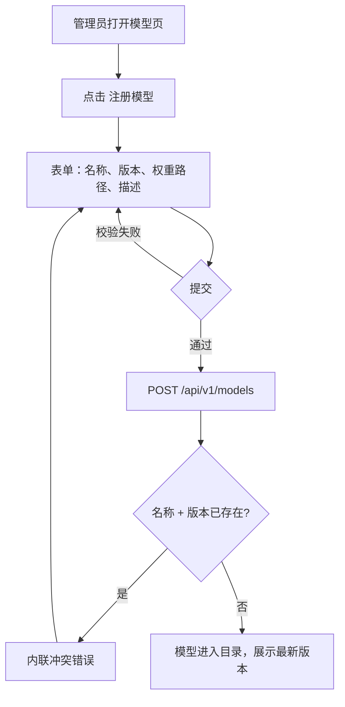
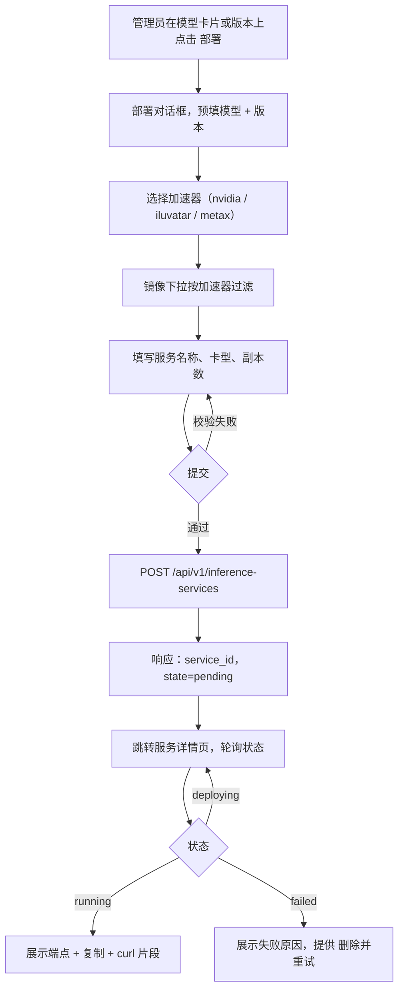
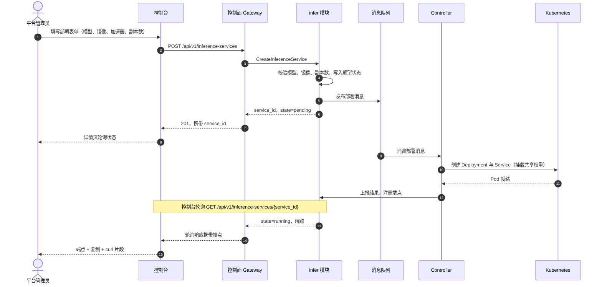
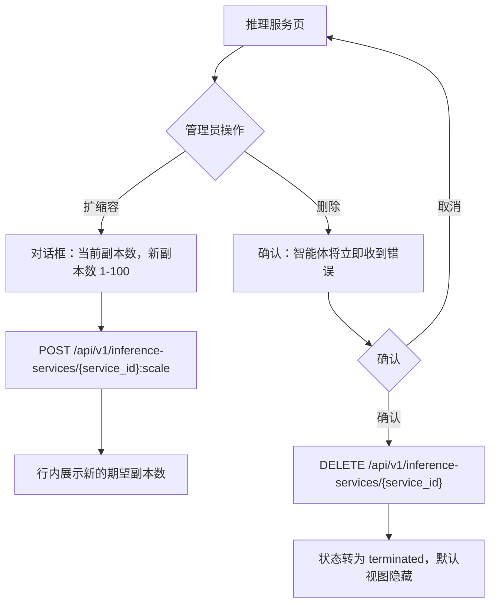

# 模型目录与一键部署 — 需求分析与 UI/UX 设计

| 属性 | 内容 |
| --- | --- |
| 特性点 | 模型目录与一键部署（控制台 + API） |
| 文档范围 | 模型目录与推理服务一键部署能力的需求分析与 UI/UX 设计：控制台页面、用户流程、API 面与验收标准 |
| 归属模块 | `model`（目录与权重资产）、`infer`（推理服务生命周期），以及 `image`（引擎镜像选择） |
| 相关文档 | [架构设计](./architecture.zh-cn.md) — 第 2.2 节 `model`、第 2.4 节 `infer`、第 2.3 节 `image`，以及第 4.2 节一键模型部署流程 |
| 状态 | 设计完成，已移交 Architect agent |

---

## 1. 背景与竞品调研

### 1.1 为什么现在做目录与一键部署

go-taas 是 Token-as-a-Service 平台：售卖的是推理 token，而 token 只能由运行中的推理服务产出。目录是供给侧的起点 —— 管理员将开源大模型（Qwen、DeepSeek、LLaMA 等）连同其对象存储中的权重路径注册进来；一键部署则把已注册的模型变成智能体可通过推理网关调用的服务端点。架构已固定了机制（第 4.2 节）：控制台调用控制面，变更发布到消息队列，由 Controller 落成 Kubernetes 的 Deployment 与 Service。本特性点定义的是用户看到什么、做什么。

### 1.2 竞品如何实现目录与部署

| 产品 | 目录交互 | 部署形态 | 部署反馈 | 值得注意的坑 |
| --- | --- | --- | --- | --- |
| **OpenAI Platform** | 无自托管目录 —— 模型由平台托管，调用时按模型名选择 | 不适用（客户侧无部署概念） | 不适用 | 「无部署」模型成立的前提是 OpenAI 拥有整个算力池；私有 TaaS 平台必须暴露部署 |
| **Anthropic Console** | 同上 —— 仅托管模型 | 不适用 | 不适用 | 同上 |
| **Together AI** | 开放模型目录，模型卡片含上下文长度、每百万 token 价格 | 专用端点（Dedicated Endpoints）：选模型、GPU 型号、副本数；标准部署为 Serverless | 端点页展示运行状态与 API base URL | Serverless 与专用两档容易让用户混淆自己调用的是哪一档 |
| **SiliconFlow** | 模型广场，100+ 预集成模型，标签快速筛选，卡片含价格与限流 | 30+ 预置模板一键部署自定义模型；可视化配置宣称「3 分钟内」完成；预留实例提供独占算力 | 控制台可见部署进度 | 模板列表容易让人眼花缭乱；异构芯片（国产 GPU）支持必须清晰呈现 |
| **Azure AI Foundry** | 1900+ 模型按提供方集合组织；模型卡片含速览、能力（token 上下限、工具调用）、基准测试与既有部署；支持按集合、能力、部署选项、推理任务过滤 | 两条路径：标准（Serverless，按 token 计费）与托管算力（把模型权重部署到专属虚拟机，按核时计费） | 模型卡片有「既有部署」标签页；部署向导引导选择算力，完成后端点出现 | 两套部署模型让决策面翻倍；区域与配额约束在向导后期才暴露 |
| **阿里云百炼** | 模型广场以卡片展示开放模型；每张卡片链接到部署与微调 | 将开放模型部署为专属推理服务：选模型、算力实例规格（GPU 型号）、副本数 | 服务列表展示部署状态与调用端点 | 部署与微调共享模型卡片入口但流程分离，首次使用的用户容易困惑 |
| **火山引擎方舟** | 模型广场含模型卡片；按模型创建推理接入点 | 创建接入点：选模型版本、GPU 卡型、副本数；旗舰模型提供 Serverless 选项 | 接入点列表展示状态与 QPS 指标 | 同一模型部署两次时，接入点命名与模型版本耦合容易混淆 |

### 1.3 提炼的模式与决策

值得采纳的业界共性模式：

1. **扁平、可过滤的模型卡片列表** —— 所有调研产品都以卡片或表格行展示模型（名称、版本、简述）；Azure 还加了能力速览与基准页签。卡片是「部署它」的锚点。
2. **部署是简短的引导式表单，而非 YAML** —— Together、SiliconFlow、阿里云百炼、火山引擎方舟都把部署收敛为：模型 + 版本、算力（卡型）、镜像/引擎、副本数。没有产品要求用户编写 Kubernetes 清单。
3. **部署产物是一个可复制的 base URL 端点** —— 用户的最终目标是拿到一个 OpenAI 兼容端点去配置智能体；控制台必须在服务详情页第一时间呈现它。
4. **异步状态 + 可见进度** —— 部署耗时以分钟计（拉镜像、挂载权重、调度 Pod）；所有产品都展示状态（pending / deploying / running / failed）而非阻塞 HTTP 调用。
5. **扩缩容是一等操作** —— 调整副本数高频且安全；Together 与火山引擎方舟都直接在服务行上暴露它。

需要避免的坑：

- **两套部署心智模型**（Azure 的 Serverless vs 托管算力）—— go-taas 只有一种部署模型（平台集群上的专属推理服务），UI 不得发明分档术语。
- **配额/算力错误来得太晚** —— 无效的加速器/卡型组合必须在表单提交前被拦截，而不是等消息到达 Controller 之后。
- **状态静默变化** —— 部署翻转为 `failed` 必须可见（状态列 + 详情），并展示失败原因，否则用户会一直等下去。
- **版本含糊** —— 不钉住版本就部署「Qwen」会让后续升级不可见；表单必须始终钉住模型 + 版本。

**go-taas 的决策**（依据自主决策规则记录理由）：

| # | 决策 | 理由 |
| --- | --- | --- |
| D1 | 目录即通过 `RegisterModel`（名称、版本、权重路径、描述）注册的模型列表；控制台每个模型一张卡片，展示最新版本，详情页展示版本列表 | 契合 `model` 模块的元数据定位（架构第 2.2 节）；本特性点不含市场广场或外部仓库同步 |
| D2 | 一键部署是单一引导式表单，字段恰好为：**服务名称**、**模型 + 版本**（从目录选择）、**加速器**（nvidia / iluvatar / metax）、**卡型**（`accelerator_type`）、**镜像**（按所选加速器过滤）、**副本数**（1–100） | 与 `CreateInferenceService` 字段一一对应；不暴露 YAML，不暴露 Kubernetes 概念 |
| D3 | 部署是异步的：创建调用立即返回 `state=pending`；状态机为 `pending → deploying → running / failed`，删除后为 `terminated`；控制台轮询服务列表/详情 | 契合架构第 4.2 节（MQ + Controller 调和）；阻塞等待 Pod 就绪会拖垮 HTTP 调用 |
| D4 | 镜像下拉按所选加速器过滤；与所选卡型不兼容的镜像直接隐藏而非置灰 | 镜像×卡型适配矩阵归 `image` 模块（架构第 2.3 节）；错误组合必须无法提交 |
| D5 | 扩缩容（改副本数）是服务行上的原位操作；其他任何变更（模型、版本、镜像、卡型）需删除后重建 | 契合 `ScaleInferenceService`（仅副本数）；避免半可变更状态 |
| D6 | 服务详情页展示 OpenAI 兼容端点，附复制按钮与「试一试」curl 片段 | 端点才是用户真正的交付物；智能体经推理网关持 API Key 调用它 |
| D7 | 删除需确认对话框，点名服务并警告其端点上的智能体会立即收到错误；已删除服务保留 `state=terminated`，可从列表过滤 | 防止误删在线服务端点，同时保持列表可用 |
| D8 | 模型注册（目录条目创建）是管理员操作，表单与 API 对称：名称、版本、权重路径、描述；名称+版本重复被拒绝 | 控制台与 API 保持一致；权重路径须已存在于对象存储（表单做语法校验，存在性由 Controller 在部署时核验） |

### 1.4 范围边界

**范围内**：模型注册与目录浏览（列表、含版本的详情）、将已注册模型一键部署为推理服务（创建、列表、含端点的详情、扩缩容、删除）、部署状态可见性、按加速器约束的镜像选择。

**范围外**（由其他特性点跟踪）：镜像注册、版本管理与完整镜像×卡型适配矩阵 UI（#3）、镜像预拉取/预热编排（#3）、按模型计价展示（#5）、租户级模型授权（#6）、自动扩缩容策略、灰度升级与微调流程。

---

## 2. 用户角色

| 角色 | 描述 | 与目录和部署的交互 |
| --- | --- | --- |
| **平台管理员** | 运维 go-taas 集群、决定平台服务哪些模型的运营者 | 向目录注册模型、部署推理服务、扩缩容与删除、读取部署状态 |
| **组织管理员（未来）** | 消费平台的租户侧管理员 | 本特性点范围外；API 面从第一天起按组织隔离（服务归属组织），租户消费可无破坏性地开启 |
| **智能体 / SDK** | 调用 `/v1/chat/completions` 的程序化消费方 | 不接触目录与部署 API；消费部署产出的端点，经推理网关持 API Key 调用 |

> 术语约定：消费侧调用方称为 **Agent**（英文）/「智能体」（中文），与仓库约定一致。

---

## 3. 用户故事

| # | 作为… | 我想要… | 以便… |
| --- | --- | --- | --- |
| US1 | 平台管理员 | 注册模型（名称、版本、权重路径、描述） | 模型进入目录，可被部署 |
| US2 | 平台管理员 | 带搜索地浏览目录，看到每个模型的最新版本与描述 | 不离开控制台就能快速找到目标模型 |
| US3 | 平台管理员 | 打开模型查看其全部已注册版本 | 精确选择要部署的版本，了解版本变化 |
| US4 | 平台管理员 | 用一张引导式表单部署模型（模型、镜像、加速器、卡型、副本数） | 不写任何 Kubernetes YAML 就拿到服务端点 |
| US5 | 平台管理员 | 看着部署走过 pending / deploying / running，失败时看到原因 | 知道服务何时真正可用，出问题时知道修什么 |
| US6 | 平台管理员 | 从服务详情页复制端点 URL 与现成的 curl 片段 | 立即把端点交给智能体 |
| US7 | 平台管理员 | 在服务列表上直接扩缩容副本数 | 无需重新部署即可应对负载变化 |
| US8 | 平台管理员 | 删除服务时得到关于影响智能体的明确警告 | 安全地退役服务 |
| US9 | 智能体 / SDK | 用我的 API Key 通过端点调用已部署的模型 | 获得 OpenAI 兼容的补全结果，无需了解部署细节 |

---

## 4. 功能需求

### FR1 — 注册模型（目录条目）

- **FR1.1** 控制台在模型页提供「注册模型」入口，表单字段：**名称**（必填，1–128 字符）、**版本**（必填，1–64 字符）、**权重路径**（必填，对象存储路径，如 `models/qwen2.5-32b/`）、**描述**（可选，≤ 1024 字符）。
- **FR1.2** 注册已存在的名称+版本返回明确的冲突错误；为已有名称注册新版本会向版本列表追加该版本，若为最新则更新 `latest_version`。
- **FR1.3** 权重路径做语法校验（非空、不含 `..` 段）；其在 MinIO/JuiceFS 中的实际存在性由 Controller 在部署时核验，缺失权重路径将以该原因表现为 `failed` 部署。
- **FR1.4** 删除模型需确认；仍有非 terminated 推理服务引用时，删除被阻止并返回可操作的错误信息。

### FR2 — 目录浏览

- **FR2.1** 模型页以卡片/表格行列出已注册模型：**名称**、**最新版本**、**描述**（截断）、**创建时间**，以及「部署」操作。
- **FR2.2** 列表分页（`offset`/`limit`，默认 20，最大 100），支持按名称搜索（当前页客户端过滤，API 支持后切服务端查询）。
- **FR2.3** 模型详情页展示模型元数据（权重路径、描述）与完整版本列表，每个版本带「部署此版本」操作。

### FR3 — 一键部署（创建推理服务）

- **FR3.1** 「部署」操作（来自模型卡片或版本行）打开预填所选模型与版本的部署表单：**服务名称**（必填，DNS 安全，1–63 字符）、**模型 + 版本**（预填，可改）、**加速器**（nvidia / iluvatar / metax）、**卡型**（自由文本 `accelerator_type`，如 `A800`、`H800`、`BI-V150`）、**镜像**（来自 `ListImages` 的下拉，按所选加速器过滤）、**副本数**（整数，1–100，默认 1）。
- **FR3.2** 切换加速器会重新过滤镜像下拉；不兼容的镜像被隐藏。若无匹配镜像，表单提示「该加速器暂无可用镜像 —— 请在镜像管理中注册」并禁用提交。
- **FR3.3** 提交调用 `CreateInferenceService`；响应立即返回 `service_id` 与 `state=pending`；控制台跳转到服务详情页并轮询直至状态离开 `pending`。
- **FR3.4** 校验错误（名称非法、副本数越界、模型/镜像不存在）在表单内联展示，绝不进入消息队列。

### FR4 — 部署状态可见性

- **FR4.1** 推理服务列表以彩色徽标展示每个服务的**状态**：`pending`（灰）、`deploying`（蓝）、`running`（绿）、`failed`（红）、`terminated`（灰、删除线）。
- **FR4.2** 服务详情页展示状态、完整规格（模型、版本、镜像、加速器、卡型、副本数），以及 `running` 时的端点列表（复制按钮 + curl 片段）。
- **FR4.3** `failed` 服务展示 Controller 链路返回的失败原因；详情页提供「删除并重试」（删除 + 预填创建表单）。
- **FR4.4** 存在 `pending` 或 `deploying` 服务时列表以 10 秒间隔轮询刷新，其余情况仅手动刷新。

### FR5 — 扩缩容

- **FR5.1** 每个非 terminated 服务行提供「扩缩容」，打开小对话框，展示当前副本数并输入新副本数（1–100）。
- **FR5.2** 扩缩容调用 `ScaleInferenceService` 并立即返回；状态保持 `running`（副本收敛期间可短暂回到 `deploying`）；行内展示新的期望副本数。

### FR6 — 删除

- **FR6.1** 每个非 terminated 服务行提供「删除」，打开确认对话框，点名服务并警告：「调用该服务端点的智能体将立即收到错误。」
- **FR6.2** 删除幂等；服务转为 `terminated` 并从默认列表视图隐藏（「显示已终止」开关可将其显出）。
- **FR6.3** 仅被 terminated 服务引用的模型可被成功删除。

### FR7 — 端点消费契约

- **FR7.1** `GetInferenceService` 返回的端点是推理网关上的 OpenAI 兼容 base URL；控制台的 curl 片段使用 `/v1/chat/completions` 与 `Bearer` API Key 占位符。
- **FR7.2** 控制台绝不自行拼接端点 URL；只展示 API 返回的内容。

---

## 5. 页面与流程设计

### 5.1 页面地图

| 页面 / 组件 | 用途 |
| --- | --- |
| **模型页**（`/models`） | 目录：已注册模型，含搜索、分页、注册入口与卡片级部署操作 |
| **注册模型对话框** | 名称、版本、权重路径、描述 |
| **模型详情页**（`/models/{model_id}`） | 元数据 + 版本列表，版本级部署操作 |
| **推理服务页**（`/inference-services`） | 服务列表，含状态徽标、扩缩容与删除操作 |
| **部署对话框** | 一键部署表单（FR3） |
| **服务详情页**（`/inference-services/{service_id}`） | 状态、规格、端点（复制 + curl 片段）、失败原因 |

### 5.2 注册模型流程

### 5.3 一键部署流程

### 5.4 部署时序（控制面与 Controller）

### 5.5 扩缩容与删除流程

---

## 6. API 面影响

本设计横跨三个 proto 服务，均由控制面 Gateway（`grpc-gateway`）以 HTTP 对外服务。现有 proto 已定义所需接口；本设计予以确认并施加约束：

| RPC | HTTP | 用途 | 说明 |
| --- | --- | --- | --- |
| `RegisterModel`（`taas.model.v1`） | `POST /api/v1/models` | 注册模型版本 | `name` + `version` 唯一；`weight_path` 必填 |
| `ListModels`（`taas.model.v1`） | `GET /api/v1/models` | 分页目录列表 | 返回 `ModelSummary`（model_id、name、latest_version、weight_path） |
| `GetModel`（`taas.model.v1`） | `GET /api/v1/models/{model_id}` | 含版本列表的模型详情 | 驱动详情页 |
| `DeleteModel`（`taas.model.v1`） | `DELETE /api/v1/models/{model_id}` | 移除目录条目 | 被在线服务引用时阻止 |
| `CreateInferenceService`（`taas.infer.v1`） | `POST /api/v1/inference-services` | 一键部署 | 返回 `service_id`、`state=pending`；经 MQ 异步 |
| `ListInferenceServices`（`taas.infer.v1`） | `GET /api/v1/inference-services` | 含状态的服务列表 | 驱动列表页与轮询 |
| `GetInferenceService`（`taas.infer.v1`） | `GET /api/v1/inference-services/{service_id}` | 含端点的详情 | 端点仅在 `state=running` 时有意义 |
| `ScaleInferenceService`（`taas.infer.v1`） | `POST /api/v1/inference-services/{service_id}:scale` | 仅改副本数 | 原位变更，无需重建 |
| `DeleteInferenceService`（`taas.infer.v1`） | `DELETE /api/v1/inference-services/{service_id}` | 退役服务 | 幂等，终态 `terminated` |
| `ListImages`（`taas.image.v1`） | `GET /api/v1/images` | 镜像下拉数据源 | 在服务端过滤上线前由客户端按 `accelerator` 过滤 |

对契约的约束：

1. `CreateInferenceService` 必须同步校验 `model_id`/`model_version` 存在性与 `replicas` 范围（1–100），再发布到消息队列 —— 非法请求绝不能到达 Controller。
2. `InferenceServiceSummary.state` 是字符串枚举，取值恰为 `pending`、`deploying`、`running`、`failed`、`terminated`；控制台依赖该封闭集合渲染徽标。
3. `GetInferenceServiceResponse.endpoints` 在 `state=running` 之外必须为空；控制台只展示 API 返回的端点，绝不自行构造 URL。
4. `ScaleInferenceService` 仅接受 `replicas`；其他规格变更一律走删除 + 重建（D5）。
5. `ListImages` 响应必须携带 `accelerator`（与 `engine`），使控制台无需额外调用即可过滤部署表单的镜像下拉（D4）。

---

## 7. 验收标准

| # | 标准 | 验证方式 |
| --- | --- | --- |
| AC1 | 以新名称+版本调用 `RegisterModel` 成功，模型出现在 `ListModels` 且 `latest_version` 正确；重复注册同一名称+版本返回冲突错误 | FVT |
| AC2 | `GetModel` 返回模型元数据与完整版本列表；版本按最新在前排序 | FVT |
| AC3 | 对被非 terminated 推理服务引用的模型调用 `DeleteModel` 返回错误并点名阻塞服务；该服务删除后同一调用成功 | FVT |
| AC4 | 以合法模型、镜像、加速器、副本数调用 `CreateInferenceService` 立即返回（不阻塞等待 Pod），携带 `service_id` 与 `state=pending` | FVT（时延上界：< 2 秒） |
| AC5 | 以未知 `model_id`、越界 `replicas`（0 或 101）、或 `accelerator` 与请求不符的镜像调用 `CreateInferenceService` 返回校验错误，且不向消息队列发布任何消息 | 单元测试 + FVT |
| AC6 | 部署经历 `pending → deploying → running`，随后 `GetInferenceService` 返回非空 `endpoints`；控制台展示端点、复制按钮与 curl 片段 | FVT + E2E |
| AC7 | 无法收敛的部署（如权重路径缺失）到达 `failed`，详情页展示人类可读的失败原因 | FVT（故障注入） |
| AC8 | `ScaleInferenceService` 修改期望副本数并返回成功；服务保持 `running`（或短暂 `deploying`），且不重置其他规格字段 | FVT |
| AC9 | `DeleteInferenceService` 幂等（第二次删除成功），服务转为 `terminated`，默认列表视图隐藏已终止服务 | FVT |
| AC10 | 部署表单的镜像下拉仅提供与所选加速器匹配的镜像；无匹配镜像时提交禁用并提示前往镜像管理 | E2E |
| AC11 | 控制台状态徽标准确覆盖 `pending`、`deploying`、`running`、`failed`、`terminated` 五种状态，颜色互异 | 手动 / E2E |
| AC12 | 存在 `pending` 或 `deploying` 服务时服务列表以 10 秒间隔轮询，全部稳定后停止轮询 | 手动 / E2E |

---

## 8. 遗留事项

| 事项 | 去向 |
| --- | --- |
| 镜像注册 UI、版本管理与完整镜像 × 卡型适配矩阵 | 特性 #3 镜像管理 |
| 镜像预拉取 / 预热编排与冷启动优化 | 特性 #3（`TriggerWarmup` RPC 已存在，UI 暂缓） |
| 目录与部署表单中的按模型、按卡型计价展示 | 特性 #5 价格矩阵 |
| 租户级模型授权（哪些租户可部署哪些模型） | 特性 #6 多租户 |
| 自动扩缩容策略、灰度升级与蓝绿部署 | 未来特性点 |
| 微调流程与权重路径注册之外的自定义模型接入 | 未来特性点 |
