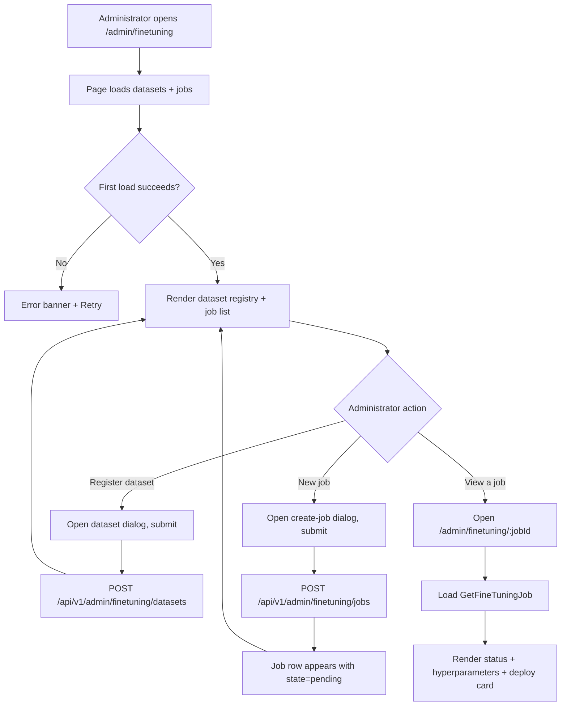
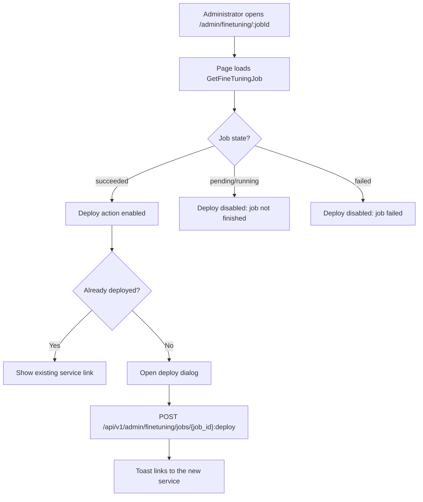
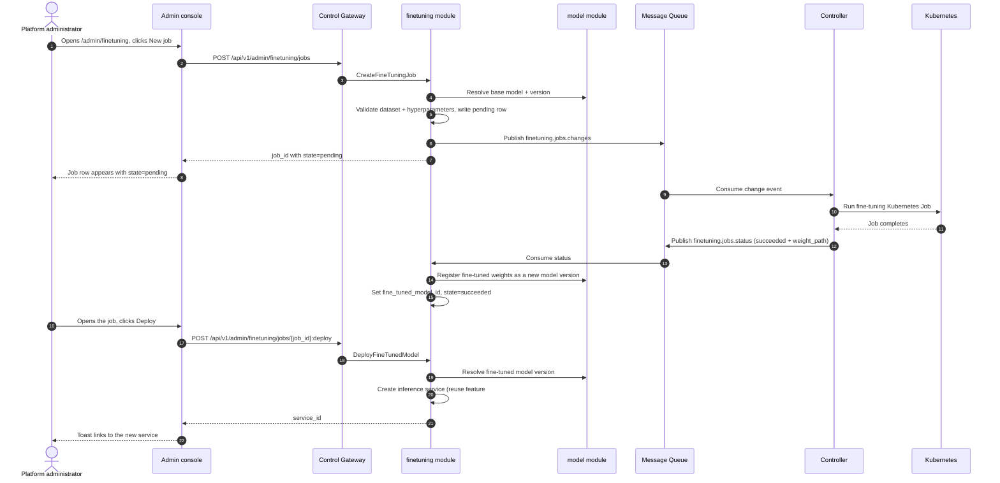

# Model Fine-Tuning Management — Requirement Analysis and UI/UX Design

| Attribute | Content |
| --- | --- |
| Feature point | Model fine-tuning management — create, monitor, and deploy fine-tuning jobs (dataset, base model, hyperparameters, job status, deploy fine-tuned model) (backlog row 39) |
| Document scope | Requirement analysis, competitive research, the admin-surface fine-tuning pages for `/admin/finetuning` (job list) and `/admin/finetuning/:jobId` (job detail), the page → API surface table, and numbered acceptance criteria |
| Owning modules | `finetuning` (new — owns the dataset registry and the fine-tuning job lifecycle), `model` (read-only: base-model resolution and fine-tuned-model registration), `infer` (read-only: deploy the fine-tuned model as an inference service), `controller` (read-only: run the fine-tuning job as a Kubernetes Job and report status), `pkg/server` gateway (admin-prefix bindings), `web` admin console (`FineTuningPage`, `FineTuningJobDetailPage`) |
| Related documents | [Architecture Design](./architecture.md) — §2.2 `model`, §2.4 `infer`, §2.7 Controller, §4.2 one-click deployment flow · [Model Catalog & One-Click Deployment](./model-catalog-deployment.md) — the `model_versions` table, the `weight_path` object-storage convention, and the Controller's async reconcile pattern · [Model Versioning & Rollback](./model-versioning.md) — the version-history and activation conventions this feature's deploy step reuses · [Image Management](./image-management.md) — the artifact/object-storage conventions and the async-task status pattern · [Console Surface Separation](./console-surface-separation.md) — the two surfaces, the `AdminShell` conventions, the masked-projection rule |
| Status | Design complete, handed to the Architect agent |

---

## 1. Background and Competitive Research

### 1.1 Why Fine-Tuning Management Comes Now

go-taas registers model versions (`model_versions` rows with a `weight_path` into object storage) and deploys them as inference services (model-catalog-deployment §4.2). What the console still cannot do is *create a custom model*: a tenant or operator who wants a model adapted to their data — a fine-tuned variant of a base model — has no way to submit a dataset, run a training job, and deploy the result. The operator must leave the platform, run a training job against the base model's weights, upload the result to object storage, register it as a new model version, and deploy it — an operator-orchestration escape hatch the console should own.

This feature adds **model fine-tuning management**: create, monitor, and deploy fine-tuning jobs — a dataset, a base model, hyperparameters, job status, and a deploy step that registers the fine-tuned weights as a new model version and deploys it as an inference service. It is the smallest independently valuable increment of Phase 4's model-lifecycle roadmap item: it turns "I want a model adapted to my data" into "submit a dataset and hyperparameters, watch the job run, and deploy the fine-tuned model from the console".

### 1.2 How Comparable Products Implement Fine-Tuning

| Product | Fine-tuning surface | Dataset | Hyperparameters | Job status | Deploy fine-tuned model | Notable pitfalls |
| --- | --- | --- | --- | --- | --- | --- |
| **OpenAI Fine-tuning** | Jobs list + create form + job detail | Upload a JSONL file; a file id is referenced | A small curated set (epochs, batch size, LR) | Queued / running / succeeded / failed with metrics | The fine-tuned model appears as a new model id you can call | Dataset must be pre-formatted JSONL; no in-console dataset editor |
| **Together AI** | Fine-tuning jobs + create form | Upload a dataset file | Curated hyperparameters | Job status with progress | Deploy the fine-tuned model to an endpoint | Dataset format is strict; job status is coarse |
| **Hugging Face** | Training via scripts/notebooks | A dataset from the Hub or a file | Full trainer config | Training logs and metrics | Push the model to the Hub, then deploy | Full ML framework; not a console surface |
| **Vertex AI** | Training jobs + custom training | Dataset from a managed store | Full hyperparameter config | Job status with logs | Register the model and deploy to an endpoint | Heavyweight; custom training is a full ML pipeline |
| **Azure ML** | Training jobs + datasets | Dataset from a managed store | Full config | Job status with logs | Register and deploy | Heavyweight; dataset and job are separate concepts |
| **SiliconFlow / Bailian** | Fine-tuning jobs + create form | Upload a dataset file | Curated hyperparameters | Job status | Deploy the fine-tuned model | Chinese-first; dataset format is product-specific |

### 1.3 Distilled Patterns and Decisions

Patterns worth adopting:

1. **A jobs list with a create form and a job detail page** — every surveyed product (OpenAI, Together, Vertex, Azure) leads with a jobs list, a create form (dataset + base model + hyperparameters), and a job detail page with status and metrics.
2. **A curated hyperparameter set** — OpenAI and Together expose a small, curated set (epochs, batch size, learning rate) rather than a full trainer config; this keeps the form approachable and testable.
3. **A dataset as a first-class input** — OpenAI and Together reference an uploaded dataset file; go-taas needs a dataset registry (a new concept) so a dataset can be reused across jobs.
4. **Async job status with a closed state set** — OpenAI's queued/running/succeeded/failed and the image warmup task's pending/running/succeeded/failed (image-management D8) are the canonical async-task pattern; go-taas reuses it.
5. **Deploy the fine-tuned model as a new model** — OpenAI and Together surface the fine-tuned model as a new model you can call; go-taas registers the fine-tuned weights as a new model version and deploys it as an inference service.

Pitfalls to avoid: a full ML framework (Hugging Face, Vertex, Azure) — go-taas needs a curated, console-driven fine-tuning flow, not a notebook; a strict dataset format with no guidance (OpenAI, Together) — go-taas validates the dataset format and shows a clear error; coarse job status (Together) — go-taas shows a human-readable failure reason and progress; and a deploy step that bypasses the model lifecycle — go-taas registers the fine-tuned weights as a real model version and deploys through the existing inference-service path.

**Decisions for go-taas** (recorded rationale, per the autonomous-decision rule):

| # | Decision | Rationale |
| --- | --- | --- |
| D1 | **Fine-tuning management lives on the admin surface only**: `/admin/finetuning` + `/admin/finetuning/:jobId` + `/api/v1/admin/finetuning/*`. There is **no end-user surface** — fine-tuning is operator-orchestration (feature #17's masked-projection rule); tenants consume the deployed fine-tuned model through the gateway, not the training flow | Fine-tuning is operator-orchestration (creating custom models); tenants consume models, not training jobs. Consistent with the admin-only model versioning (feature #32) and accelerator inventory (feature #18) |
| D2 | **A new `finetuning` module** (`services/finetuning`) owns the dataset registry and the fine-tuning job lifecycle, with its own error block **123xx**. It reuses the model module for base-model resolution and fine-tuned-model registration, and the infer module for deployment | Fine-tuning is a distinct concern (custom-model creation) with its own datasets and jobs; a dedicated module keeps it separate from the model catalog and gives it one home, matching the per-feature-module pattern |
| D3 | **A new `datasets` table** stores registered datasets: `dataset_id`, `name`, `format` (`jsonl` / `csv`), `object_path` (object-storage path, same syntax rules as `weight_path`), `created_at`. A dataset is registered once and reused across jobs | A dataset is a first-class, reusable input (OpenAI, Together); a registry avoids re-uploading the same data per job and gives the create form a dataset selector |
| D4 | **A new `finetuning_jobs` table** stores the job lifecycle: `job_id`, `name`, `base_model_id`, `base_model_version`, `dataset_id`, `hyperparameters` (jsonb: `epochs`, `batch_size`, `learning_rate`), `state` (`pending` / `running` / `succeeded` / `failed`), `failure_reason`, `fine_tuned_model_id` (set on success), `created_at`, `updated_at` | The job lifecycle is the async-task pattern (image-management D8); the table persists the job and its result so the detail page can show status and the deploy step can reference the fine-tuned model |
| D5 | **A new `CreateFineTuningJob` RPC** validates the dataset and base model, writes a `pending` job row, and publishes a change event to a new `finetuning.jobs.changes` MQ subject for the Controller to run as a Kubernetes Job. It returns `job_id` with `state=pending` immediately | Mirrors the one-click deployment async pattern (model-catalog-deployment §5.1): the create call returns fast, and the Controller drives `pending → running → succeeded / failed` |
| D6 | **The Controller runs the fine-tuning job as a Kubernetes Job** and reports status back through a new `finetuning.jobs.status` MQ subject. On success it writes the fine-tuned weights to object storage and reports the resulting `weight_path`; the `finetuning` module registers it as a new model version (via the model module) and sets `fine_tuned_model_id` | The Controller is the only component with a Kubernetes client (service-logs AD2, accelerator AD1); running the job as a Kubernetes Job and reporting status mirrors the deployment reconcile pattern. Registering the result as a real model version keeps the fine-tuned model in the model lifecycle |
| D7 | **A new `ListFineTuningJobs` RPC** returns the job list with per-job metadata (name, base model, dataset, state, fine-tuned model, created/updated). A new `GetFineTuningJob` RPC returns the full job detail including hyperparameters and failure reason | The list page needs a scannable job table; the detail page needs the full job record. Two RPCs mirror the model list/detail split |
| D8 | **A new `DeployFineTunedModel` RPC** deploys a succeeded job's fine-tuned model as an inference service: it resolves the fine-tuned model version, then calls the existing inference-service create path (feature #2) with the fine-tuned model and a chosen image/accelerator/replica count. It returns the new `service_id` | "Deploy fine-tuned model" means the fine-tuned weights serve through the normal inference path; reusing the existing create path keeps the deploy step consistent with one-click deployment |
| D9 | **The deploy step is available only on a `succeeded` job**; a job in any other state shows the deploy action disabled with a hint. Deploying is idempotent per job (a job already deployed shows the existing service link) | You cannot deploy a model that has not finished training; the idempotency guard prevents duplicate services from repeated clicks |
| D10 | **New error codes in a finetuning block (12301–12399)**: **12301 `CodeFineTuningJobNotFound`**, **12302 `CodeFineTuningJobStateInvalid`**, **12303 `CodeFineTuningDatasetNotFound`**, **12304 `CodeFineTuningDatasetInvalid`**, **12305 `CodeFineTuningHyperparametersInvalid`**. Unknown base model reuses **10101**; unknown base-model version reuses **10103**; unknown image reuses **10201** | Fine-tuning is a new module (D2), so its codes live in a fresh block after the docs block (122xx); distinct codes keep each failure mode actionable while the model/image contracts stay uniform |
| D11 | **The pages are read-only except for the create and deploy actions** — the create form and the deploy action write; everything else (list, detail, status) is read-only and audited only for access | The feature's writes are the create and deploy actions; the audit trail (feature #15) covers them. No new audit events are needed beyond the existing write paths |

### 1.4 Scope Boundary

**In scope**: a fine-tuning jobs list page (`/admin/finetuning`), a create-job form (dataset, base model, hyperparameters), a job detail page (`/admin/finetuning/:jobId`) with status and failure reason, a dataset registry (register/list), and a deploy step that registers the fine-tuned model and deploys it as an inference service.

**Out of scope** (tracked by other feature points): the model catalog and one-click deployment form (#2), model versioning & rollback (#32), image management (#3), the training algorithm itself (the Controller runs a curated fine-tuning image; the algorithm is out of scope), dataset editing or preview (a dataset is registered once and referenced), and a user-realm fine-tuning surface (deliberately absent, D1).

---

## 2. User Roles

| Role | Description | Interaction with fine-tuning management |
| --- | --- | --- |
| **Platform administrator** | The operator who curates which models the platform serves and how | Registers datasets, creates fine-tuning jobs, monitors job status, and deploys the fine-tuned model as an inference service |
| **Agent / SDK** | The programmatic consumer that calls `/v1/chat/completions` | Never touches fine-tuning; consumes the deployed fine-tuned model through the gateway with an API Key |

> Terminology: the consumer-side caller is called an **Agent** (English) / 「智能体」(Chinese), consistent with the repo convention. This feature is admin-only, so the consumer-side terminology does not apply to a tenant surface.

---

## 3. User Stories

| # | As a… | I want to… | So that… |
| --- | --- | --- | --- |
| US1 | Platform administrator | register a dataset (name, format, object path) | I can reuse it across fine-tuning jobs |
| US2 | Platform administrator | create a fine-tuning job with a dataset, base model, and hyperparameters | I can train a custom model without leaving the console |
| US3 | Platform administrator | see the list of fine-tuning jobs with their status | I can track all training activity at a glance |
| US4 | Platform administrator | open a job and see its status, hyperparameters, and failure reason | I can understand why a job failed or what it produced |
| US5 | Platform administrator | deploy a succeeded job's fine-tuned model as an inference service | the fine-tuned model serves through the normal inference path |
| US6 | Agent / SDK | call a deployed fine-tuned model through its endpoint with my API Key | I get completions from the custom model without knowing about the training flow |

---

## 4. Functional Requirements

### FR1 — Dataset registry

- **FR1.1** `RegisterFineTuningDataset` (`POST /api/v1/admin/finetuning/datasets`) registers a dataset with **Name** (required, 1–128 chars), **Format** (required, `jsonl` / `csv`), and **Object path** (required, object-storage path, same syntax rules as `weight_path`: non-empty, ≤ 512 chars, no `..` segments, no leading `/`, no backslashes). It returns `dataset_id`.
- **FR1.2** `ListFineTuningDatasets` (`GET /api/v1/admin/finetuning/datasets`) returns the registered datasets, newest first, each with `dataset_id`, `name`, `format`, `object_path`, and `created_at`.
- **FR1.3** An invalid object path returns **12304 `CodeFineTuningDatasetInvalid`**; a duplicate name returns **12303 `CodeFineTuningDatasetNotFound`** only when a referenced dataset is missing (see FR2.3).

### FR2 — Create a fine-tuning job

- **FR2.1** `CreateFineTuningJob` (`POST /api/v1/admin/finetuning/jobs`) creates a job with **Name** (required, 1–128 chars), **Base model** (required, a model id), **Base model version** (required, a registered version of the base model), **Dataset** (required, a registered dataset id), and **Hyperparameters** (required: `epochs` 1–100, `batch_size` 1–1024, `learning_rate` 1e-6–1.0). It returns `job_id` with `state=pending` immediately (D5).
- **FR2.2** An unknown base model returns **10101 `CodeModelNotFound`**; an unknown base-model version returns **10103 `CodeModelVersionNotFound`**; an unknown dataset returns **12303 `CodeFineTuningDatasetNotFound`**; invalid hyperparameters return **12305 `CodeFineTuningHyperparametersInvalid`**.
- **FR2.3** The create form's dataset selector is populated from `ListFineTuningDatasets`; the base-model selector from the masked model list (feature #2), and the base-model-version selector from the model's versions (feature #32).

### FR3 — Job lifecycle and status

- **FR3.1** `ListFineTuningJobs` (`GET /api/v1/admin/finetuning/jobs`) returns the jobs, newest first, each with `job_id`, `name`, `base_model_id`, `base_model_version`, `dataset_id`, `state` (`pending` / `running` / `succeeded` / `failed`), `fine_tuned_model_id` (empty until success), `created_at`, and `updated_at`.
- **FR3.2** `GetFineTuningJob` (`GET /api/v1/admin/finetuning/jobs/{job_id}`) returns the full job record including `hyperparameters` and `failure_reason` (empty unless `failed`).
- **FR3.3** An unknown `job_id` returns **12301 `CodeFineTuningJobNotFound`**.
- **FR3.4** The Controller drives `pending → running → succeeded / failed` through the `finetuning.jobs.status` subject; a `failed` job carries a human-readable `failure_reason` (D6).

### FR4 — Deploy the fine-tuned model

- **FR4.1** `DeployFineTunedModel` (`POST /api/v1/admin/finetuning/jobs/{job_id}:deploy`) deploys a `succeeded` job's fine-tuned model as an inference service. It takes **Image** (required, an image id), **Accelerator** (required, `nvidia` / `iluvatar` / `metax`), and **Replicas** (required, 1–100). It returns the new `service_id`.
- **FR4.2** Deploying a job in any state other than `succeeded` returns **12302 `CodeFineTuningJobStateInvalid`**; an unknown image returns **10201 `CodeImageNotFound`**; an incompatible image returns **10204 `CodeImageIncompatible`**.
- **FR4.3** Deploying is idempotent per job: a job already deployed returns the existing `service_id` (D9).

### FR5 — Surface and API binding

- **FR5.1** The fine-tuning pages live on the **admin surface**: routes `/admin/finetuning` and `/admin/finetuning/:jobId`, API prefix `/api/v1/admin/finetuning/*`. They are added to the `AdminShell` navigation (feature #17) as "Fine-tuning".
- **FR5.2** There is **no end-user surface** for fine-tuning (D1): tenants do not see datasets or training jobs. The admin pages call only `/api/v1/admin/finetuning/*` routes and contain no `/api/v1/*` string (feature #17, D1).

---

## 5. Page and Flow Design

### 5.1 Surface Assignment

| Feature | Surface | Web route | API prefix |
| --- | --- | --- | --- |
| Dataset registry | admin | `/admin/finetuning` | `/api/v1/admin/finetuning/datasets` |
| Fine-tuning job list | admin | `/admin/finetuning` | `/api/v1/admin/finetuning/jobs` |
| Fine-tuning job detail | admin | `/admin/finetuning/:jobId` | `/api/v1/admin/finetuning/jobs/{job_id}` |
| Deploy fine-tuned model | admin | `/admin/finetuning/:jobId` | `/api/v1/admin/finetuning/jobs/{job_id}:deploy` |

Every page and API call above is on the **admin surface**; there is no end-user surface (D1). Admin pages never call a `/api/v1/*` route, and the admin session realm is used throughout.

### 5.2 Page Map

| Page / component | Purpose |
| --- | --- |
| **Fine-tuning page** (`/admin/finetuning`) | Dataset registry (register/list) + fine-tuning job list (create, monitor status) |
| **Fine-tuning job detail page** (`/admin/finetuning/:jobId`) | Full job record (status, hyperparameters, failure reason) + deploy the fine-tuned model |

### 5.3 Page: `/admin/finetuning` — Fine-tuning (admin)

**Purpose**: give the platform administrator a single surface to register datasets, create fine-tuning jobs, and monitor their status.

**Surface**: admin — route `/admin/finetuning`, API `/api/v1/admin/finetuning/*`.

**Layout**: rendered inside `AdminShell` (feature #17). A page header ("Fine-tuning", subtitle "Create and monitor custom model training") with a **New job** action (primary) and a **Register dataset** action (secondary). Below:

1. **Dataset registry** — a card listing registered datasets with columns: **Name**, **Format** (badge), **Object path**, **Created**. A **Register dataset** action opens a dialog.
2. **Job list** — a table of fine-tuning jobs with columns: **Name** (link to the detail page), **Base model**, **Dataset**, **State** (badge), **Fine-tuned model** (link when deployed), **Created**, **Updated**. Row action **View** opens the detail page.

**Interactive states**:

| State | Behaviour |
| --- | --- |
| Default | Dataset registry + job list render from the first successful load |
| Loading | Skeleton cards and table; New job and Register dataset are disabled |
| Empty | "No fine-tuning jobs yet." with a hint to create one; the dataset registry shows "No datasets registered" with a Register dataset button |
| Error | An error banner with the message and a Retry button; the page keeps its last good data with a "Showing stale data" banner |
| Disabled | New job is disabled while a load is in flight; Register dataset is disabled while a load is in flight |
| Permission-denied | A session without the required role receives 10036 and the page shows the standard permission-denied state (feature #17) with a link back to the admin home |

**Dataset registry columns**: Name, Format (badge), Object path, Created. Sortable by Name and Created. Not filterable (the registry is small); paginated if the count exceeds the page size.

**Job list columns**: Name (link), Base model, Dataset, State (badge), Fine-tuned model (link when deployed), Created, Updated. Sortable by Name, State, and Created. Filterable by State (All / Pending / Running / Succeeded / Failed); paginated.

### 5.4 Page: `/admin/finetuning/:jobId` — Fine-tuning Job Detail (admin)

**Purpose**: give the platform administrator the full record of a fine-tuning job — status, hyperparameters, failure reason — and a deploy action for a succeeded job.

**Surface**: admin — route `/admin/finetuning/:jobId`, API `/api/v1/admin/finetuning/jobs/{job_id}`.

**Layout**: rendered inside `AdminShell` (feature #17). A page header ("Fine-tuning Job", subtitle with the job name and `job_id`) with a **Back to Fine-tuning** link (secondary) and a **Refresh** action (secondary). Below:

1. **Status card** — the job's state badge, base model, base model version, dataset, created/updated times, and (when `failed`) the failure reason.
2. **Hyperparameters card** — epochs, batch size, learning rate.
3. **Deploy card** — for a `succeeded` job, a **Deploy** action (primary) opening a dialog with **Image** (dropdown), **Accelerator** (dropdown), and **Replicas** (number). For a job already deployed, it shows the existing service link instead. For any other state, the Deploy action is disabled with a hint.

**Interactive states**:

| State | Behaviour |
| --- | --- |
| Default | Status card + hyperparameters card + deploy card render from the first successful load |
| Loading | Skeleton cards; Refresh is disabled |
| Empty | "No fine-tuning job data." with a hint that the job appears after creation; the header stays visible |
| Error | An error banner with the message and a Retry button; the page keeps its last good data with a "Showing stale data" banner |
| Disabled | Refresh is disabled while a load is in flight; Deploy is disabled unless the job is `succeeded` and not yet deployed |
| Permission-denied | A session without the required role receives 10036 and the page shows the standard permission-denied state (feature #17) with a link back to the admin home |

**Deploy dialog fields**: Image (dropdown from `ListImages`, filtered by accelerator), Accelerator (dropdown: nvidia / iluvatar / metax), Replicas (number, 1–100). Validation: Image required, Accelerator required, Replicas required and in 1–100. Error copy: "Select an image", "Select an accelerator", "Replicas must be between 1 and 100". Confirming calls `DeployFineTunedModel` and shows a toast linking to the new service.

### 5.5 Flows

---

## 6. API Surface Implications

The fine-tuning RPCs belong to the **`finetuning` module** (D2), served as HTTP via the Control Gateway on the **admin prefix** `/api/v1/admin/finetuning/*` (D1). The Controller runs the job as a Kubernetes Job and reports status through the MQ (D6). The model module resolves base models and registers fine-tuned models; the infer module deploys the fine-tuned model (D8). There is **no user-prefix binding** (D1).

| RPC | Route | Prefix | Status | Purpose |
| --- | --- | --- | --- | --- |
| `RegisterFineTuningDataset` (`taas.finetuning.v1`) | `POST /api/v1/admin/finetuning/datasets` | admin | **new** | Register a dataset (name, format, object path) |
| `ListFineTuningDatasets` (`taas.finetuning.v1`) | `GET /api/v1/admin/finetuning/datasets` | admin | **new** | List registered datasets |
| `CreateFineTuningJob` (`taas.finetuning.v1`) | `POST /api/v1/admin/finetuning/jobs` | admin | **new** | Create a fine-tuning job (dataset, base model, hyperparameters) |
| `ListFineTuningJobs` (`taas.finetuning.v1`) | `GET /api/v1/admin/finetuning/jobs` | admin | **new** | List fine-tuning jobs |
| `GetFineTuningJob` (`taas.finetuning.v1`) | `GET /api/v1/admin/finetuning/jobs/{job_id}` | admin | **new** | Get a fine-tuning job's full record |
| `DeployFineTunedModel` (`taas.finetuning.v1`) | `POST /api/v1/admin/finetuning/jobs/{job_id}:deploy` | admin | **new** | Deploy a succeeded job's fine-tuned model as an inference service |

**Contract notes for the Architect agent**:

1. `RegisterFineTuningDataset` takes `name`, `format` (`jsonl` / `csv`), and `object_path`; it returns `dataset_id`. `ListFineTuningDatasets` returns the datasets, newest first (FR1.1, FR1.2).
2. `CreateFineTuningJob` takes `name`, `base_model_id`, `base_model_version`, `dataset_id`, and `hyperparameters` (`epochs`, `batch_size`, `learning_rate`); it returns `job_id` with `state=pending` immediately (D5). It publishes a change event to `finetuning.jobs.changes` (D5).
3. `ListFineTuningJobs` returns the jobs, newest first, with per-job metadata; `GetFineTuningJob` returns the full record including `hyperparameters` and `failure_reason` (FR3.1, FR3.2).
4. `DeployFineTunedModel` takes `image_id`, `accelerator`, and `replicas`; it returns `service_id`. It is available only on a `succeeded` job and is idempotent per job (D9).
5. The Controller runs the job as a Kubernetes Job and reports status through `finetuning.jobs.status`; on success it reports the resulting `weight_path`, and the `finetuning` module registers it as a new model version (D6).
6. Wire conventions unchanged: HTTP 200 on success, business errors as `{"code": <int>, "message": "..."}`, int64 fields serialized as JSON strings.

Error codes (existing blocks, `pkg/errors/codes.go`):

| Condition | Code | Constant | Notes |
| --- | --- | --- | --- |
| Unknown `job_id` | 12301 | `CodeFineTuningJobNotFound` | **New** (D10) |
| Deploy on a non-`succeeded` job | 12302 | `CodeFineTuningJobStateInvalid` | **New** (D10) |
| Unknown dataset | 12303 | `CodeFineTuningDatasetNotFound` | **New** (D10) |
| Invalid dataset object path | 12304 | `CodeFineTuningDatasetInvalid` | **New** (D10) |
| Invalid hyperparameters | 12305 | `CodeFineTuningHyperparametersInvalid` | **New** (D10) |
| Unknown base model | 10101 | `CodeModelNotFound` | Reused — the model contract (FR2.2) |
| Unknown base-model version | 10103 | `CodeModelVersionNotFound` | Reused — the model contract (FR2.2) |
| Unknown image | 10201 | `CodeImageNotFound` | Reused — the image contract (FR4.2) |
| Incompatible image | 10204 | `CodeImageIncompatible` | Reused — the image contract (FR4.2) |

---

## 7. Acceptance Criteria

| # | Criterion | Level |
| --- | --- | --- |
| AC1 | `RegisterFineTuningDataset` registers a dataset and `ListFineTuningDatasets` returns it; an invalid object path returns 12304 | FVT |
| AC2 | `CreateFineTuningJob` returns `job_id` with `state=pending`; an unknown base model returns 10101, an unknown dataset returns 12303, and invalid hyperparameters return 12305 | FVT |
| AC3 | `ListFineTuningJobs` returns the jobs newest first; `GetFineTuningJob` returns the full record including hyperparameters and failure reason; an unknown `job_id` returns 12301 | FVT |
| AC4 | `DeployFineTunedModel` on a `succeeded` job returns a `service_id`; on a non-`succeeded` job it returns 12302; it is idempotent per job | FVT |
| AC5 | The `/admin/finetuning` page renders the dataset registry and the job list from the first successful load, with the New job and Register dataset actions | E2E |
| AC6 | The create-job dialog validates the dataset, base model, and hyperparameters and creates a job that appears with `state=pending` | E2E |
| AC7 | The `/admin/finetuning/:jobId` page renders the status, hyperparameters, and deploy card; the Deploy action is enabled only for a `succeeded` job and disabled otherwise | E2E |
| AC8 | The fine-tuning pages are reachable only on the admin surface: routes `/admin/finetuning` and `/admin/finetuning/:jobId`, every API call uses the `/api/v1/admin/finetuning/*` prefix with no `/api/v1/*` string | E2E (surface separation) |
| AC9 | A session without the required role receives 10036 on the fine-tuning pages and the pages show the standard permission-denied state | E2E |

---

## 8. Out of Scope (tracked elsewhere)

| Item | Where |
| --- | --- |
| The model catalog and one-click deployment form | Feature #2 model catalog & deployment |
| Model versioning & rollback | Feature #32 model versioning |
| Image management | Feature #3 image management |
| The training algorithm itself | The Controller runs a curated fine-tuning image; the algorithm is out of scope |
| Dataset editing or preview | A dataset is registered once and referenced |
| A user-realm fine-tuning surface | Deliberately absent (D1) — tenants consume the deployed model, not the training flow |