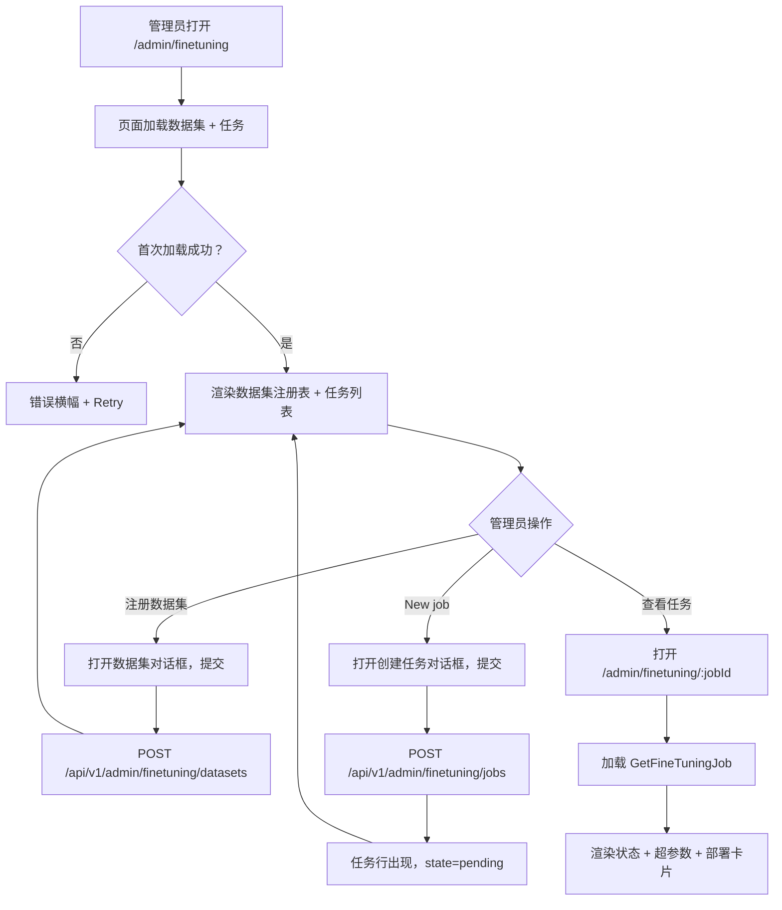
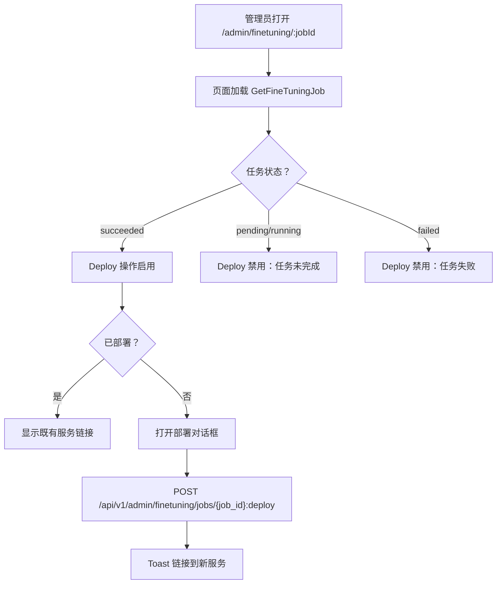
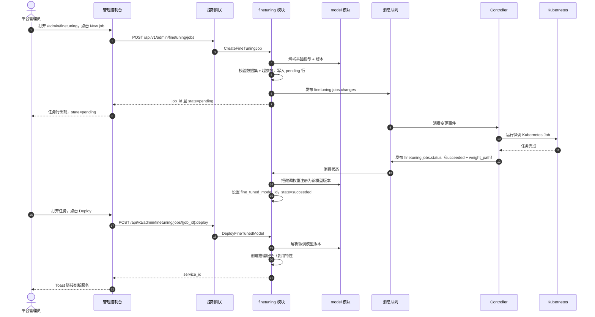

# 模型微调管理 — 需求分析与 UI/UX 设计

| 属性 | 内容 |
| --- | --- |
| 特性点 | 模型微调管理 — 创建、监控与部署微调任务（数据集、基础模型、超参数、任务状态、部署微调模型）（backlog 第 39 行） |
| 文档范围 | 需求分析、竞品调研、`/admin/finetuning`（任务列表）与 `/admin/finetuning/:jobId`（任务详情）管理面微调页、页面 → API 面映射表，以及编号验收标准 |
| 归属模块 | `finetuning`（新增 — 拥有数据集注册表与微调任务生命周期）、`model`（只读：基础模型解析与微调模型注册）、`infer`（只读：将微调模型部署为推理服务）、`controller`（只读：将微调任务作为 Kubernetes Job 运行并上报状态）、`pkg/server` 网关（管理前缀绑定）、`web` 管理控制台（`FineTuningPage`、`FineTuningJobDetailPage`） |
| 相关文档 | [架构设计](./architecture.md) — 第 2.2 节 `model`、第 2.4 节 `infer`、第 2.7 节 Controller、第 4.2 节一键部署流程 · [模型目录与一键部署](./model-catalog-deployment.md) — `model_versions` 表、`weight_path` 对象存储约定与 Controller 的异步 reconcile 模式 · [模型版本管理与回滚](./model-versioning.md) — 本特性部署步骤复用的版本历史与激活约定 · [镜像管理](./image-management.md) — 工件/对象存储约定与异步任务状态模式 · [控制台面分离](./console-surface-separation.md) — 两个面、`AdminShell` 约定、掩码投影规则 |
| 状态 | 设计完成，已移交架构师代理 |

---

## 1. 背景与竞品调研

### 1.1 为什么现在做微调管理

go-taas 注册模型版本（`model_versions` 行，带指向对象存储的 `weight_path`）并将其部署为推理服务（model-catalog-deployment §4.2）。控制台仍无法做的是*创建自定义模型*：想要针对自身数据适配模型的租户或运营者 — 基础模型的微调变体 — 无法提交数据集、运行训练任务并部署结果。运营者必须离开平台，针对基础模型权重运行训练任务，把结果上传到对象存储，注册为新模型版本并部署 — 这是控制台应当拥有的运营者编排逃生通道。

本特性新增**模型微调管理**：创建、监控与部署微调任务 — 数据集、基础模型、超参数、任务状态，以及把微调权重注册为新模型版本并部署为推理服务的部署步骤。这是 Phase 4 模型生命周期路线图项中最小可独立交付的增量：它把「我想要针对自身数据适配的模型」变成「提交数据集与超参数，观察任务运行，并从控制台部署微调模型」。

### 1.2 竞品如何实现微调

| 产品 | 微调面 | 数据集 | 超参数 | 任务状态 | 部署微调模型 | 主要陷阱 |
| --- | --- | --- | --- | --- | --- | --- |
| **OpenAI Fine-tuning** | 任务列表 + 创建表单 + 任务详情 | 上传 JSONL 文件；引用文件 id | 小而精选的集合（epochs、batch size、LR） | queued / running / succeeded / failed 带指标 | 微调模型作为可调用的新模型 id 出现 | 数据集必须预格式化为 JSONL；无控制台内数据集编辑器 |
| **Together AI** | 微调任务 + 创建表单 | 上传数据集文件 | 精选超参数 | 带进度的任务状态 | 将微调模型部署到端点 | 数据集格式严格；任务状态粗略 |
| **Hugging Face** | 通过脚本/notebook 训练 | Hub 或文件的数据集 | 完整 trainer 配置 | 训练日志与指标 | 推送模型到 Hub，再部署 | 完整 ML 框架；非控制台面 |
| **Vertex AI** | 训练任务 + 自定义训练 | 托管存储的数据集 | 完整超参数配置 | 带日志的任务状态 | 注册模型并部署到端点 | 重型；自定义训练是完整 ML 管线 |
| **Azure ML** | 训练任务 + 数据集 | 托管存储的数据集 | 完整配置 | 带日志的任务状态 | 注册并部署 | 重型；数据集与任务是分离概念 |
| **SiliconFlow / Bailian** | 微调任务 + 创建表单 | 上传数据集文件 | 精选超参数 | 任务状态 | 部署微调模型 | 中文优先；数据集格式产品特定 |

### 1.3 提炼出的模式与决策

值得采纳的模式：

1. **任务列表 + 创建表单 + 任务详情页** — 每个调研产品（OpenAI、Together、Vertex、Azure）都以任务列表、创建表单（数据集 + 基础模型 + 超参数）与带状态和指标的任务详情页开场。
2. **精选超参数集合** — OpenAI 与 Together 暴露小而精选的集合（epochs、batch size、learning rate）而非完整 trainer 配置；这保持表单易用且可测试。
3. **数据集作为一等输入** — OpenAI 与 Together 引用上传的数据集文件；go-taas 需要数据集注册表（新概念），使数据集可跨任务复用。
4. **带封闭状态集的异步任务状态** — OpenAI 的 queued/running/succeeded/failed 与镜像预热任务的 pending/running/succeeded/failed（image-management D8）是规范异步任务模式；go-taas 复用它。
5. **把微调模型部署为新模型** — OpenAI 与 Together 把微调模型作为可调用的新模型呈现；go-taas 把微调权重注册为新模型版本并部署为推理服务。

需要避免的陷阱：完整 ML 框架（Hugging Face、Vertex、Azure）— go-taas 需要精选、控制台驱动的微调流程，而非 notebook；无指导的严格数据集格式（OpenAI、Together）— go-taas 校验数据集格式并显示清晰错误；粗略任务状态（Together）— go-taas 显示人类可读的失败原因与进度；以及绕过模型生命周期的部署步骤 — go-taas 把微调权重注册为真实模型版本并经既有推理服务路径部署。

**go-taas 的决策**（依据自主决策规则记录理由）：

| # | 决策 | 依据 |
| --- | --- | --- |
| D1 | **微调管理仅存在于管理面**：`/admin/finetuning` + `/admin/finetuning/:jobId` + `/api/v1/admin/finetuning/*`。**无终端用户面** — 微调是运营者编排（特性 #17 的掩码投影规则）；租户经网关消费已部署的微调模型，而非训练流程 | 微调是运营者编排（创建自定义模型）；租户消费模型，而非训练任务。与仅管理面的模型版本管理（特性 #32）与加速器清单（特性 #18）一致 |
| D2 | **新增 `finetuning` 模块**（`services/finetuning`）拥有数据集注册表与微调任务生命周期，带自有错误块 **123xx**。它复用 model 模块做基础模型解析与微调模型注册，复用 infer 模块做部署 | 微调是独立关注点（自定义模型创建），有自己的数据集与任务；专用模块把它与模型目录分离并给它一个归属，契合按特性分模块的模式 |
| D3 | **新增 `datasets` 表**存储已注册数据集：`dataset_id`、`name`、`format`（`jsonl` / `csv`）、`object_path`（对象存储路径，语法规则同 `weight_path`）、`created_at`。数据集注册一次，跨任务复用 | 数据集是一等、可复用输入（OpenAI、Together）；注册表避免每任务重复上传同一数据，并给创建表单一个数据集选择器 |
| D4 | **新增 `finetuning_jobs` 表**存储任务生命周期：`job_id`、`name`、`base_model_id`、`base_model_version`、`dataset_id`、`hyperparameters`（jsonb：`epochs`、`batch_size`、`learning_rate`）、`state`（`pending` / `running` / `succeeded` / `failed`）、`failure_reason`、`fine_tuned_model_id`（成功时设置）、`created_at`、`updated_at` | 任务生命周期是异步任务模式（image-management D8）；表持久化任务及其结果，使详情页能显示状态且部署步骤能引用微调模型 |
| D5 | **新增 `CreateFineTuningJob` RPC** 校验数据集与基础模型，写入 `pending` 任务行，并向新 `finetuning.jobs.changes` MQ subject 发布变更事件供 Controller 作为 Kubernetes Job 运行。它立即返回 `job_id` 且 `state=pending` | 镜像一键部署异步模式（model-catalog-deployment §5.1）：创建调用快速返回，Controller 驱动 `pending → running → succeeded / failed` |
| D6 | **Controller 将微调任务作为 Kubernetes Job 运行**，并通过新 `finetuning.jobs.status` MQ subject 上报状态。成功时把微调权重写入对象存储并上报结果 `weight_path`；`finetuning` 模块将其注册为新模型版本（经 model 模块）并设置 `fine_tuned_model_id` | Controller 是唯一持有 Kubernetes 客户端的组件（service-logs AD2、accelerator AD1）；把任务作为 Kubernetes Job 运行并上报状态镜像部署 reconcile 模式。把结果注册为真实模型版本使微调模型留在模型生命周期内 |
| D7 | **新增 `ListFineTuningJobs` RPC** 返回任务列表，带每任务元数据（名称、基础模型、数据集、状态、微调模型、创建/更新）。**新增 `GetFineTuningJob` RPC** 返回含超参数与失败原因的完整任务记录 | 列表页需要可扫读的任务表；详情页需要完整任务记录。两个 RPC 镜像模型列表/详情拆分 |
| D8 | **新增 `DeployFineTunedModel` RPC** 把成功任务的微调模型部署为推理服务：解析微调模型版本，然后以微调模型与所选镜像/加速器/副本数调用既有推理服务创建路径（特性 #2）。它返回新 `service_id` | 「部署微调模型」意味着微调权重经正常推理路径服务；复用既有创建路径使部署步骤与一键部署一致 |
| D9 | **部署步骤仅对 `succeeded` 任务可用**；任何其他状态的任务显示禁用部署操作并带提示。部署按任务幂等（已部署的任务显示既有服务链接） | 无法部署尚未完成训练的任务；幂等守卫防止重复点击产生重复服务 |
| D10 | **新增微调错误块（12301–12399）**：**12301 `CodeFineTuningJobNotFound`**、**12302 `CodeFineTuningJobStateInvalid`**、**12303 `CodeFineTuningDatasetNotFound`**、**12304 `CodeFineTuningDatasetInvalid`**、**12305 `CodeFineTuningHyperparametersInvalid`**。未知基础模型复用 **10101**；未知基础模型版本复用 **10103**；未知镜像复用 **10201** | 微调是新模块（D2），因此其代码位于 docs 块（122xx）之后的新块；独立代码让每个失败模式可操作，而模型/镜像契约保持统一 |
| D11 | **页面除创建与部署操作外只读** — 创建表单与部署操作写入；其余（列表、详情、状态）只读且仅对访问审计 | 该特性的写入是创建与部署操作；审计轨迹（特性 #15）覆盖它们。除既有写入路径外无需新增审计事件 |

### 1.4 范围边界

**范围内**：微调任务列表页（`/admin/finetuning`）、创建任务表单（数据集、基础模型、超参数）、任务详情页（`/admin/finetuning/:jobId`）含状态与失败原因、数据集注册表（注册/列表）、以及把微调模型注册并部署为推理服务的部署步骤。

**范围外**（由其他特性点跟踪）：模型目录与一键部署表单（#2）、模型版本管理与回滚（#32）、镜像管理（#3）、训练算法本身（Controller 运行精选微调镜像；算法范围外）、数据集编辑或预览（数据集注册一次并被引用）、以及用户面微调面（刻意缺失，D1）。

---

## 2. 用户角色

| 角色 | 描述 | 与微调管理的交互 |
| --- | --- | --- |
| **平台管理员** | 策划平台服务哪些模型及如何服务的运营者 | 注册数据集、创建微调任务、监控任务状态、并把微调模型部署为推理服务 |
| **智能体 / SDK** | 调用 `/v1/chat/completions` 的程序化消费者 | 从不接触微调；经网关用 API Key 消费已部署的微调模型 |

> 术语：消费侧调用方称为 **Agent**（英文）/「智能体」（中文），与仓库约定一致。本特性仅管理面，因此消费侧术语不适用于租户面。

---

## 3. 用户故事

| # | 作为… | 我想要… | 以便… |
| --- | --- | --- | --- |
| US1 | 平台管理员 | 注册数据集（名称、格式、对象路径） | 跨微调任务复用它 |
| US2 | 平台管理员 | 用数据集、基础模型与超参数创建微调任务 | 无需离开控制台即可训练自定义模型 |
| US3 | 平台管理员 | 查看带状态的微调任务列表 | 一眼跟踪所有训练活动 |
| US4 | 平台管理员 | 打开任务并查看其状态、超参数与失败原因 | 理解任务为何失败或产出了什么 |
| US5 | 平台管理员 | 把成功任务的微调模型部署为推理服务 | 微调模型经正常推理路径服务 |
| US6 | 智能体 / SDK | 经网关用 API Key 调用已部署的微调模型端点 | 无需了解训练流程即可从自定义模型获得补全 |

---

## 4. 功能需求

### FR1 — 数据集注册表

- **FR1.1** `RegisterFineTuningDataset`（`POST /api/v1/admin/finetuning/datasets`）注册数据集，含**名称**（必填，1–128 字符）、**格式**（必填，`jsonl` / `csv`）与**对象路径**（必填，对象存储路径，语法规则同 `weight_path`：非空、≤ 512 字符、无 `..` 段、无前导 `/`、无反斜杠）。它返回 `dataset_id`。
- **FR1.2** `ListFineTuningDatasets`（`GET /api/v1/admin/finetuning/datasets`）返回已注册数据集，最新在前，每个含 `dataset_id`、`name`、`format`、`object_path` 与 `created_at`。
- **FR1.3** 无效对象路径返回 **12304 `CodeFineTuningDatasetInvalid`**；重复名称返回 **12303 `CodeFineTuningDatasetNotFound`** 仅当被引用数据集缺失时（见 FR2.3）。

### FR2 — 创建微调任务

- **FR2.1** `CreateFineTuningJob`（`POST /api/v1/admin/finetuning/jobs`）创建任务，含**名称**（必填，1–128 字符）、**基础模型**（必填，模型 id）、**基础模型版本**（必填，基础模型的已注册版本）、**数据集**（必填，已注册数据集 id）与**超参数**（必填：`epochs` 1–100、`batch_size` 1–1024、`learning_rate` 1e-6–1.0）。它立即返回 `job_id` 且 `state=pending`（D5）。
- **FR2.2** 未知基础模型返回 **10101 `CodeModelNotFound`**；未知基础模型版本返回 **10103 `CodeModelVersionNotFound`**；未知数据集返回 **12303 `CodeFineTuningDatasetNotFound`**；无效超参数返回 **12305 `CodeFineTuningHyperparametersInvalid`**。
- **FR2.3** 创建表单的数据集选择器来自 `ListFineTuningDatasets`；基础模型选择器来自掩码模型列表（特性 #2），基础模型版本选择器来自模型的版本（特性 #32）。

### FR3 — 任务生命周期与状态

- **FR3.1** `ListFineTuningJobs`（`GET /api/v1/admin/finetuning/jobs`）返回任务，最新在前，每个含 `job_id`、`name`、`base_model_id`、`base_model_version`、`dataset_id`、`state`（`pending` / `running` / `succeeded` / `failed`）、`fine_tuned_model_id`（成功前为空）、`created_at` 与 `updated_at`。
- **FR3.2** `GetFineTuningJob`（`GET /api/v1/admin/finetuning/jobs/{job_id}`）返回含 `hyperparameters` 与 `failure_reason`（除非 `failed` 否则为空）的完整任务记录。
- **FR3.3** 未知 `job_id` 返回 **12301 `CodeFineTuningJobNotFound`**。
- **FR3.4** Controller 经 `finetuning.jobs.status` subject 驱动 `pending → running → succeeded / failed`；`failed` 任务携带人类可读的 `failure_reason`（D6）。

### FR4 — 部署微调模型

- **FR4.1** `DeployFineTunedModel`（`POST /api/v1/admin/finetuning/jobs/{job_id}:deploy`）把 `succeeded` 任务的微调模型部署为推理服务。它接受**镜像**（必填，镜像 id）、**加速器**（必填，`nvidia` / `iluvatar` / `metax`）与**副本数**（必填，1–100）。它返回新 `service_id`。
- **FR4.2** 部署任何非 `succeeded` 状态的任务返回 **12302 `CodeFineTuningJobStateInvalid`**；未知镜像返回 **10201 `CodeImageNotFound`**；不兼容镜像返回 **10204 `CodeImageIncompatible`**。
- **FR4.3** 部署按任务幂等：已部署的任务返回既有 `service_id`（D9）。

### FR5 — 面与 API 绑定

- **FR5.1** 微调页面位于**管理面**：路由 `/admin/finetuning` 与 `/admin/finetuning/:jobId`，API 前缀 `/api/v1/admin/finetuning/*`。它们作为「Fine-tuning」加入 `AdminShell` 导航（特性 #17）。
- **FR5.2** 微调**无终端用户面**（D1）：租户看不到数据集或训练任务。管理页仅调用 `/api/v1/admin/finetuning/*` 路由，且不含任何 `/api/v1/*` 字符串（特性 #17，D1）。

---

## 5. 页面与流程设计

### 5.1 面分配

| 特性 | 面 | Web 路由 | API 前缀 |
| --- | --- | --- | --- |
| 数据集注册表 | admin | `/admin/finetuning` | `/api/v1/admin/finetuning/datasets` |
| 微调任务列表 | admin | `/admin/finetuning` | `/api/v1/admin/finetuning/jobs` |
| 微调任务详情 | admin | `/admin/finetuning/:jobId` | `/api/v1/admin/finetuning/jobs/{job_id}` |
| 部署微调模型 | admin | `/admin/finetuning/:jobId` | `/api/v1/admin/finetuning/jobs/{job_id}:deploy` |

以上每个页面与 API 调用都位于**管理面**；无终端用户面（D1）。管理页从不调用 `/api/v1/*` 路由，全程使用管理会话域。

### 5.2 页面地图

| 页面 / 组件 | 用途 |
| --- | --- |
| **微调页**（`/admin/finetuning`） | 数据集注册表（注册/列表）+ 微调任务列表（创建、监控状态） |
| **微调任务详情页**（`/admin/finetuning/:jobId`） | 完整任务记录（状态、超参数、失败原因）+ 部署微调模型 |

### 5.3 页面：`/admin/finetuning` — 微调（admin）

**用途**：给平台管理员一个单一面注册数据集、创建微调任务并监控其状态。

**面**：admin — 路由 `/admin/finetuning`，API `/api/v1/admin/finetuning/*`。

**布局**：在 `AdminShell`（特性 #17）内渲染。页头（「Fine-tuning」，副标题「Create and monitor custom model training」）带 **New job** 操作（主要）与 **Register dataset** 操作（次要）。其下：

1. **数据集注册表** — 列出已注册数据集的卡片，列：**名称**、**格式**（徽标）、**对象路径**、**创建时间**。**Register dataset** 操作打开对话框。
2. **任务列表** — 微调任务表，列：**名称**（链接到详情页）、**基础模型**、**数据集**、**状态**（徽标）、**微调模型**（已部署时链接）、**创建时间**、**更新时间**。行操作 **View** 打开详情页。

**交互状态**：

| 状态 | 行为 |
| --- | --- |
| 默认 | 数据集注册表 + 任务列表从首次成功加载渲染 |
| 加载中 | 骨架卡片与表；New job 与 Register dataset 禁用 |
| 空 | 「No fine-tuning jobs yet.」并提示创建一个；数据集注册表显示「No datasets registered」带 Register dataset 按钮 |
| 错误 | 错误横幅含消息与 Retry 按钮；页面保留最后良好数据并显示「Showing stale data」横幅 |
| 禁用 | 加载进行中 New job 禁用；加载进行中 Register dataset 禁用 |
| 权限拒绝 | 无所需角色的会话收到 10036，页面显示标准权限拒绝状态（特性 #17）并带返回管理首页的链接 |

**数据集注册表列**：名称、格式（徽标）、对象路径、创建时间。可按名称与创建时间排序。不可过滤（注册表小）；数量超过页大小时分页。

**任务列表列**：名称（链接）、基础模型、数据集、状态（徽标）、微调模型（已部署时链接）、创建时间、更新时间。可按名称、状态与创建时间排序。可按状态过滤（All / Pending / Running / Succeeded / Failed）；分页。

### 5.4 页面：`/admin/finetuning/:jobId` — 微调任务详情（admin）

**用途**：给平台管理员微调任务的完整记录 — 状态、超参数、失败原因 — 以及成功任务的部署操作。

**面**：admin — 路由 `/admin/finetuning/:jobId`，API `/api/v1/admin/finetuning/jobs/{job_id}`。

**布局**：在 `AdminShell`（特性 #17）内渲染。页头（「Fine-tuning Job」，副标题含任务名与 `job_id`）带 **Back to Fine-tuning** 链接（次要）与 **Refresh** 操作（次要）。其下：

1. **状态卡片** — 任务状态徽标、基础模型、基础模型版本、数据集、创建/更新时间，以及（`failed` 时）失败原因。
2. **超参数卡片** — epochs、batch size、learning rate。
3. **部署卡片** — 对 `succeeded` 任务，**Deploy** 操作（主要）打开对话框，含**镜像**（下拉）、**加速器**（下拉）与**副本数**（数字）。对已部署任务，显示既有服务链接。对任何其他状态，Deploy 操作禁用并带提示。

**交互状态**：

| 状态 | 行为 |
| --- | --- |
| 默认 | 状态卡片 + 超参数卡片 + 部署卡片从首次成功加载渲染 |
| 加载中 | 骨架卡片；Refresh 禁用 |
| 空 | 「No fine-tuning job data.」并提示任务在创建后出现；页头保持可见 |
| 错误 | 错误横幅含消息与 Retry 按钮；页面保留最后良好数据并显示「Showing stale data」横幅 |
| 禁用 | 加载进行中 Refresh 禁用；除非任务 `succeeded` 且未部署，否则 Deploy 禁用 |
| 权限拒绝 | 无所需角色的会话收到 10036，页面显示标准权限拒绝状态（特性 #17）并带返回管理首页的链接 |

**部署对话框字段**：镜像（来自 `ListImages` 的下拉，按加速器过滤）、加速器（下拉：nvidia / iluvatar / metax）、副本数（数字，1–100）。校验：镜像必填、加速器必填、副本数必填且在 1–100。错误文案：「Select an image」、「Select an accelerator」、「Replicas must be between 1 and 100」。确认调用 `DeployFineTunedModel` 并显示链接到新服务的 toast。

### 5.5 流程

---

## 6. API 面影响

微调 RPC 属于 **`finetuning` 模块**（D2），经控制网关以 HTTP 在**管理前缀** `/api/v1/admin/finetuning/*` 提供（D1）。Controller 把任务作为 Kubernetes Job 运行并经 MQ 上报状态（D6）。model 模块解析基础模型并注册微调模型；infer 模块部署微调模型（D8）。**无用户前缀绑定**（D1）。

| RPC | 路由 | 前缀 | 状态 | 用途 |
| --- | --- | --- | --- | --- |
| `RegisterFineTuningDataset`（`taas.finetuning.v1`） | `POST /api/v1/admin/finetuning/datasets` | admin | **新增** | 注册数据集（名称、格式、对象路径） |
| `ListFineTuningDatasets`（`taas.finetuning.v1`） | `GET /api/v1/admin/finetuning/datasets` | admin | **新增** | 列出已注册数据集 |
| `CreateFineTuningJob`（`taas.finetuning.v1`） | `POST /api/v1/admin/finetuning/jobs` | admin | **新增** | 创建微调任务（数据集、基础模型、超参数） |
| `ListFineTuningJobs`（`taas.finetuning.v1`） | `GET /api/v1/admin/finetuning/jobs` | admin | **新增** | 列出微调任务 |
| `GetFineTuningJob`（`taas.finetuning.v1`） | `GET /api/v1/admin/finetuning/jobs/{job_id}` | admin | **新增** | 获取微调任务的完整记录 |
| `DeployFineTunedModel`（`taas.finetuning.v1`） | `POST /api/v1/admin/finetuning/jobs/{job_id}:deploy` | admin | **新增** | 把成功任务的微调模型部署为推理服务 |

**给架构师代理的契约说明**：

1. `RegisterFineTuningDataset` 接受 `name`、`format`（`jsonl` / `csv`）与 `object_path`；返回 `dataset_id`。`ListFineTuningDatasets` 返回数据集，最新在前（FR1.1、FR1.2）。
2. `CreateFineTuningJob` 接受 `name`、`base_model_id`、`base_model_version`、`dataset_id` 与 `hyperparameters`（`epochs`、`batch_size`、`learning_rate`）；立即返回 `job_id` 且 `state=pending`（D5）。它向 `finetuning.jobs.changes` 发布变更事件（D5）。
3. `ListFineTuningJobs` 返回任务，最新在前，带每任务元数据；`GetFineTuningJob` 返回含 `hyperparameters` 与 `failure_reason` 的完整记录（FR3.1、FR3.2）。
4. `DeployFineTunedModel` 接受 `image_id`、`accelerator` 与 `replicas`；返回 `service_id`。它仅对 `succeeded` 任务可用且按任务幂等（D9）。
5. Controller 把任务作为 Kubernetes Job 运行并经 `finetuning.jobs.status` 上报状态；成功时上报结果 `weight_path`，`finetuning` 模块将其注册为新模型版本（D6）。
6. 线上约定不变：成功返回 HTTP 200，业务错误为 `{"code": <int>, "message": "..."}`，int64 字段序列化为 JSON 字符串。

错误码（既有块，`pkg/errors/codes.go`）：

| 条件 | 代码 | 常量 | 说明 |
| --- | --- | --- | --- |
| 未知 `job_id` | 12301 | `CodeFineTuningJobNotFound` | **新增**（D10） |
| 部署非 `succeeded` 任务 | 12302 | `CodeFineTuningJobStateInvalid` | **新增**（D10） |
| 未知数据集 | 12303 | `CodeFineTuningDatasetNotFound` | **新增**（D10） |
| 无效数据集对象路径 | 12304 | `CodeFineTuningDatasetInvalid` | **新增**（D10） |
| 无效超参数 | 12305 | `CodeFineTuningHyperparametersInvalid` | **新增**（D10） |
| 未知基础模型 | 10101 | `CodeModelNotFound` | 复用 — 模型契约（FR2.2） |
| 未知基础模型版本 | 10103 | `CodeModelVersionNotFound` | 复用 — 模型契约（FR2.2） |
| 未知镜像 | 10201 | `CodeImageNotFound` | 复用 — 镜像契约（FR4.2） |
| 不兼容镜像 | 10204 | `CodeImageIncompatible` | 复用 — 镜像契约（FR4.2） |

---

## 7. 验收标准

| # | 标准 | 级别 |
| --- | --- | --- |
| AC1 | `RegisterFineTuningDataset` 注册数据集且 `ListFineTuningDatasets` 返回它；无效对象路径返回 12304 | FVT |
| AC2 | `CreateFineTuningJob` 返回 `job_id` 且 `state=pending`；未知基础模型返回 10101，未知数据集返回 12303，无效超参数返回 12305 | FVT |
| AC3 | `ListFineTuningJobs` 最新在前返回任务；`GetFineTuningJob` 返回含超参数与失败原因的完整记录；未知 `job_id` 返回 12301 | FVT |
| AC4 | `DeployFineTunedModel` 对 `succeeded` 任务返回 `service_id`；对非 `succeeded` 任务返回 12302；按任务幂等 | FVT |
| AC5 | `/admin/finetuning` 页从首次成功加载渲染数据集注册表与任务列表，带 New job 与 Register dataset 操作 | E2E |
| AC6 | 创建任务对话框校验数据集、基础模型与超参数，并创建以 `state=pending` 出现的任务 | E2E |
| AC7 | `/admin/finetuning/:jobId` 页渲染状态、超参数与部署卡片；Deploy 操作仅对 `succeeded` 任务启用，否则禁用 | E2E |
| AC8 | 微调页面仅管理面可达：路由 `/admin/finetuning` 与 `/admin/finetuning/:jobId`，每个 API 调用使用 `/api/v1/admin/finetuning/*` 前缀且不含 `/api/v1/*` 字符串 | E2E（面分离） |
| AC9 | 无所需角色的会话在微调页面收到 10036，页面显示标准权限拒绝状态 | E2E |

---

## 8. 范围外（在其他处跟踪）

| 项 | 位置 |
| --- | --- |
| 模型目录与一键部署表单 | 特性 #2 模型目录与部署 |
| 模型版本管理与回滚 | 特性 #32 模型版本管理 |
| 镜像管理 | 特性 #3 镜像管理 |
| 训练算法本身 | Controller 运行精选微调镜像；算法范围外 |
| 数据集编辑或预览 | 数据集注册一次并被引用 |
| 用户面微调面 | 刻意缺失（D1）— 租户消费已部署模型，而非训练流程 |