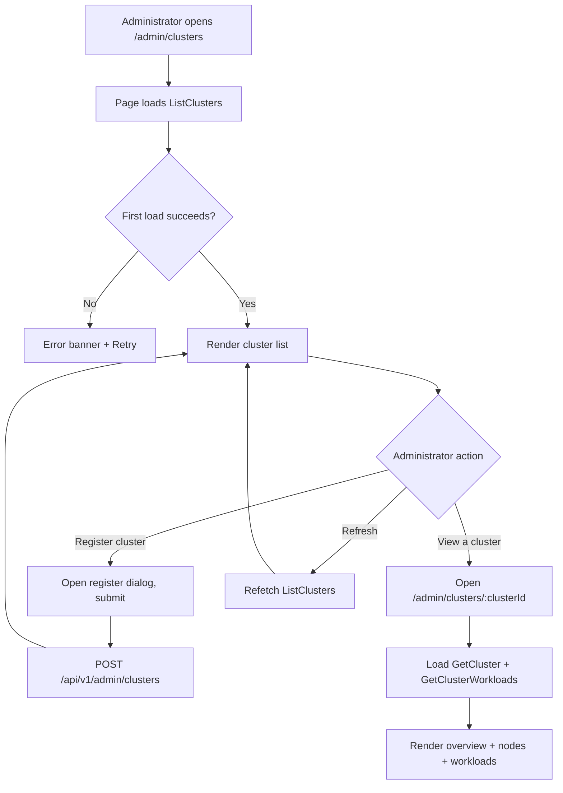
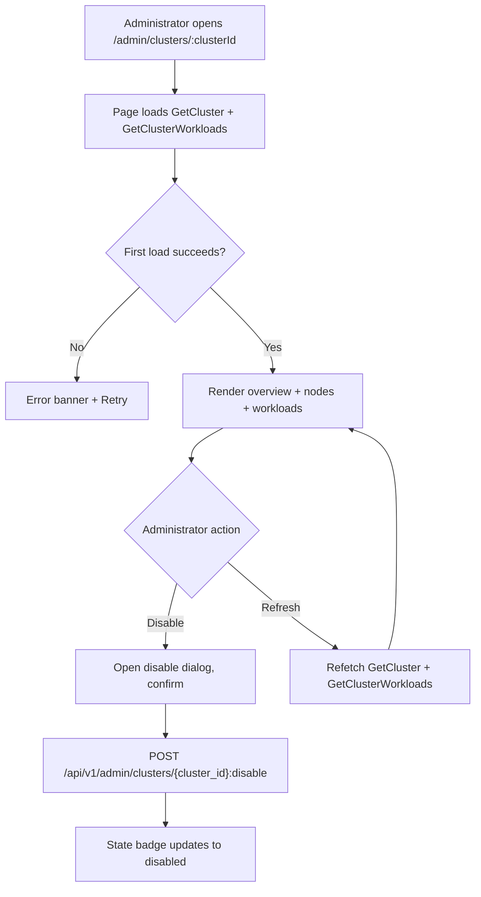
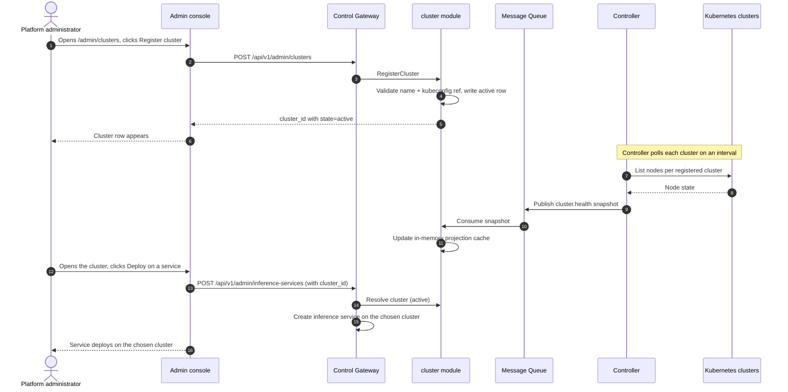

# Multi-Cluster Management — Requirement Analysis and UI/UX Design

| Attribute | Content |
| --- | --- |
| Feature point | Multi-cluster management — register and manage inference clusters, view cluster health and workload placement, and route deployments across clusters (backlog row 40) |
| Document scope | Requirement analysis, competitive research, the admin-surface cluster pages for `/admin/clusters` (cluster list) and `/admin/clusters/:clusterId` (cluster detail), the page → API surface table, and numbered acceptance criteria |
| Owning modules | `cluster` (new — owns the cluster registry and the cluster-health projection), `infer` (read-only: workload placement and cross-cluster routing), `controller` (read-only: per-cluster health collection and snapshot publish), `pkg/server` gateway (admin-prefix bindings), `web` admin console (`ClustersPage`, `ClusterDetailPage`) |
| Related documents | [Architecture Design](./architecture.md) — §2.4 `infer`, §2.7 Controller, §4.2 one-click deployment flow · [Accelerator Inventory & Health](./accelerator-inventory.md) — the Controller → MQ → service projection pattern and the in-memory cache this feature reuses · [System Health & Service Status](./system-health-status.md) — the component-health conventions this feature extends to clusters · [Model Catalog & One-Click Deployment](./model-catalog-deployment.md) — the inference-service lifecycle and the deploy form this feature's routing extends · [Console Surface Separation](./console-surface-separation.md) — the two surfaces, the `AdminShell` conventions, the masked-projection rule |
| Status | Design complete, handed to the Architect agent |

---

## 1. Background and Competitive Research

### 1.1 Why Multi-Cluster Management Comes Now

go-taas runs inference services as Kubernetes Deployments on a single cluster (model-catalog-deployment §4.2): the Controller creates the Deployment and Service, and the accelerator inventory (feature #18) reports per-node GPU health. What the console still cannot do is *run inference across more than one cluster*: an operator with a second cluster (a different region, a different accelerator fleet, or a burst capacity pool) has no way to register it, see its health, see which services run on it, or choose where a new deployment lands. The operator must manage each cluster's Kubernetes API separately and route deployments by hand — an operator-orchestration escape hatch the console should own.

This feature adds **multi-cluster management**: register and manage inference clusters, view cluster health and workload placement, and route deployments across clusters. It is the smallest independently valuable increment of Phase 4's productionization roadmap item: it turns "I have a second cluster" into "register it, see its health and what runs on it, and choose where each deployment lands".

### 1.2 How Comparable Products Implement Multi-Cluster Management

| Product | Cluster registry | Cluster health | Workload placement | Cross-cluster routing | Notable pitfalls |
| --- | --- | --- | --- | --- | --- |
| **Rancher** | Register clusters (imported or provisioned) | Per-cluster health and node status | Deploy workloads to a selected cluster | Per-cluster endpoints; no automatic routing | Heavyweight; cluster management is a full platform |
| **Kubernetes Federation** | Register member clusters | Per-cluster health | Replicate workloads across clusters | DNS-based routing | Complex; federation is a separate control plane |
| **Datadog** | Multi-account/region infrastructure | Per-cluster host/container health | Placement visibility | No routing | Heavy agent; third-party SaaS |
| **Argo CD / GitOps** | Register clusters as destinations | Per-cluster sync/health status | Deploy to a selected cluster | Per-cluster endpoints | GitOps-centric; not a console surface |
| **OpenShift** | Cluster registry | Per-cluster health | Deploy to a selected cluster | Per-cluster routes | Heavyweight; enterprise platform |

### 1.3 Distilled Patterns and Decisions

Patterns worth adopting:

1. **A cluster registry** — Rancher, Federation, and OpenShift all let the operator register clusters; go-taas needs a cluster registry (a new concept) so a cluster can be registered once and referenced by deployments.
2. **Per-cluster health** — Rancher and Datadog show per-cluster health; go-taas reuses the Controller → MQ → service projection pattern (accelerator-inventory AD1) to report cluster health.
3. **Workload placement visibility** — Rancher and Datadog show which workloads run on which cluster; go-taas shows the inference services placed on each cluster.
4. **Routing deployments across clusters** — Rancher and OpenShift let the operator choose a cluster at deploy time; go-taas adds a cluster selector to the deploy form.

Pitfalls to avoid: a heavyweight full platform (Rancher, OpenShift) — go-taas needs a curated cluster registry and health view, not a full cluster-management platform; a separate federation control plane (Kubernetes Federation) — go-taas keeps the Controller as the single reconciler and adds a cluster dimension; and automatic cross-cluster routing with no operator control — go-taas lets the operator choose the cluster at deploy time, with a default.

**Decisions for go-taas** (recorded rationale, per the autonomous-decision rule):

| # | Decision | Rationale |
| --- | --- | --- |
| D1 | **Multi-cluster management lives on the admin surface only**: `/admin/clusters` + `/admin/clusters/:clusterId` + `/api/v1/admin/clusters/*`. There is **no end-user surface** — cluster health and placement are operator-orchestration (feature #17's masked-projection rule); tenants consume models through the gateway, not cluster internals | Cluster management is operator-orchestration; tenants consume models, not clusters. Consistent with the admin-only accelerator inventory (feature #18) and system status (feature #30) |
| D2 | **A new `cluster` module** (`services/cluster`) owns the cluster registry and the cluster-health projection, with its own error block **124xx**. It reuses the infer module for workload placement and cross-cluster routing | Multi-cluster is a distinct concern (cluster registry + health + placement) with its own registry and projection; a dedicated module keeps it separate from the model/infer lifecycle and gives it one home, matching the per-feature-module pattern |
| D3 | **A new `clusters` table** stores registered clusters: `cluster_id`, `name`, `region`, `kubeconfig_ref` (a reference to the cluster's kubeconfig, not the secret itself), `state` (`active` / `disabled`), `created_at`. A cluster is registered once and referenced by deployments | A cluster is a first-class, reusable resource (Rancher, OpenShift); a registry avoids re-entering cluster credentials per deployment and gives the deploy form a cluster selector |
| D4 | **Cluster health is a projection of per-cluster Kubernetes state, collected by the Controller and served through the `cluster` module** — the Controller polls each registered cluster's nodes and publishes a full snapshot to a new `cluster.health` MQ subject; the `cluster` module maintains an in-memory projection cache (the accelerator-inventory AD1/AD11 pattern) | The Controller is the only component with Kubernetes clients (service-logs AD2, accelerator AD1); the projection pattern keeps the health view dependency-light and self-healing (a removed cluster disappears from the next snapshot) |
| D5 | **A new `RegisterCluster` RPC** validates the cluster name and kubeconfig reference, writes an `active` cluster row, and returns `cluster_id`. A new `ListClusters` RPC returns the cluster list with per-cluster health and workload counts. A new `GetCluster` RPC returns the full cluster detail including nodes and placed services | The cluster registry needs create/list/detail; three RPCs mirror the model list/detail split and the accelerator inventory's list/detail split |
| D6 | **A new `DisableCluster` RPC** sets a cluster `disabled`; a disabled cluster is excluded from the deploy form's cluster selector and from new placements, but existing services keep running until the operator moves them | Disabling a cluster (maintenance, decommission) must not tear down running services; the operator moves them explicitly |
| D7 | **Workload placement is a cluster field on the inference service**: the deploy form (feature #2) gains a **Cluster** selector (from `ListClusters`, `active` only), and `CreateInferenceService` records the chosen `cluster_id`. A new `GetClusterWorkloads` RPC returns the services placed on a cluster | "Route deployments across clusters" means the operator chooses a cluster at deploy time; recording it on the service gives the placement view and the routing control |
| D8 | **The deploy form defaults the cluster selector to a platform default** (the first `active` cluster, or a configured default), so existing single-cluster deployments keep working with no change | A default preserves existing behavior (the single-cluster case); the operator overrides it when they have multiple clusters |
| D9 | **New error codes in a cluster block (12401–12499)**: **12401 `CodeClusterNotFound`**, **12402 `CodeClusterExists`**, **12403 `CodeClusterStateInvalid`**, **12404 `CodeClusterKubeconfigInvalid`**. Unknown inference service reuses **10301** | Multi-cluster is a new module (D2), so its codes live in a fresh block after the finetuning block (123xx); distinct codes keep each failure mode actionable while the infer contract stays uniform |
| D10 | **The pages are read-only except for the register and disable actions** — the register form and the disable action write; everything else (list, detail, health, placement) is read-only and audited only for access | The feature's writes are the register and disable actions; the audit trail (feature #15) covers them. No new audit events are needed beyond the existing write paths |

### 1.4 Scope Boundary

**In scope**: a cluster list page (`/admin/clusters`), a register-cluster form, a cluster detail page (`/admin/clusters/:clusterId`) with health and placed services, a cluster selector in the deploy form (feature #2), and a disable action.

**Out of scope** (tracked by other feature points): the model catalog and one-click deployment form (#2), the accelerator inventory (#18), system health & status (#30), automatic cross-cluster load balancing or failover (the operator chooses the cluster at deploy time; automatic routing is future work), cluster provisioning or lifecycle management (go-taas registers existing clusters, it does not create them), and a user-realm cluster surface (deliberately absent, D1).

---

## 2. User Roles

| Role | Description | Interaction with multi-cluster management |
| --- | --- | --- |
| **Platform administrator** | The operator who runs the go-taas clusters and curates inference services | Registers clusters, views cluster health and placement, disables clusters, and chooses a cluster when deploying |
| **Agent / SDK** | The programmatic consumer that calls `/v1/chat/completions` | Never touches cluster management; consumes the deployed model through the gateway with an API Key |

> Terminology: the consumer-side caller is called an **Agent** (English) / 「智能体」(Chinese), consistent with the repo convention. This feature is admin-only, so the consumer-side terminology does not apply to a tenant surface.

---

## 3. User Stories

| # | As a… | I want to… | So that… |
| --- | --- | --- | --- |
| US1 | Platform administrator | register an inference cluster (name, region, kubeconfig reference) | I can manage more than one cluster from the console |
| US2 | Platform administrator | see the list of clusters with their health and workload counts | I can track all clusters at a glance |
| US3 | Platform administrator | open a cluster and see its health and the services placed on it | I understand what runs where and whether the cluster is healthy |
| US4 | Platform administrator | choose a cluster when deploying a service | I can route a deployment to the right cluster |
| US5 | Platform administrator | disable a cluster for maintenance | new deployments stop landing there while existing services keep running |
| US6 | Agent / SDK | call a deployed model through its endpoint with my API Key | I get completions without knowing which cluster serves it |

---

## 4. Functional Requirements

### FR1 — Cluster registry

- **FR1.1** `RegisterCluster` (`POST /api/v1/admin/clusters`) registers a cluster with **Name** (required, 1–128 chars), **Region** (optional, 1–64 chars), and **Kubeconfig reference** (required, a reference to the cluster's kubeconfig, not the secret itself). It returns `cluster_id` with `state=active`.
- **FR1.2** `ListClusters` (`GET /api/v1/admin/clusters`) returns the registered clusters, newest first, each with `cluster_id`, `name`, `region`, `state` (`active` / `disabled`), `health` (`healthy` / `degraded` / `unknown`), `node_count`, `service_count`, and `last_checked_at`.
- **FR1.3** A duplicate name returns **12402 `CodeClusterExists`**; an invalid kubeconfig reference returns **12404 `CodeClusterKubeconfigInvalid`**.

### FR2 — Cluster health

- **FR2.1** The Controller polls each registered cluster's nodes on an interval (default 30 s) and publishes a full snapshot to the `cluster.health` MQ subject; the `cluster` module maintains an in-memory projection cache (D4).
- **FR2.2** `GetCluster` (`GET /api/v1/admin/clusters/{cluster_id}`) returns the full cluster detail: `cluster_id`, `name`, `region`, `state`, `health`, `node_count`, `service_count`, `last_checked_at`, and `nodes[]` (each with `node_id`, `name`, `status`).
- **FR2.3** An unknown `cluster_id` returns **12401 `CodeClusterNotFound`**.

### FR3 — Workload placement and routing

- **FR3.1** `GetClusterWorkloads` (`GET /api/v1/admin/clusters/{cluster_id}/workloads`) returns the inference services placed on the cluster, each with `service_id`, `name`, `model_id`, `state`, and `created_at`.
- **FR3.2** The deploy form (feature #2) gains a **Cluster** selector populated from `ListClusters` (`active` only), defaulting to the platform default (D8). `CreateInferenceService` records the chosen `cluster_id`.
- **FR3.3** A disabled cluster is excluded from the deploy form's cluster selector and from new placements (D6).

### FR4 — Disable a cluster

- **FR4.1** `DisableCluster` (`POST /api/v1/admin/clusters/{cluster_id}:disable`) sets a cluster `disabled`. It is idempotent (disabling an already-disabled cluster is a no-op success).
- **FR4.2** Disabling a cluster does not tear down existing services; the operator moves them explicitly (D6). An unknown `cluster_id` returns **12401**.

### FR5 — Surface and API binding

- **FR5.1** The cluster pages live on the **admin surface**: routes `/admin/clusters` and `/admin/clusters/:clusterId`, API prefix `/api/v1/admin/clusters/*`. They are added to the `AdminShell` navigation (feature #17) as "Clusters".
- **FR5.2** There is **no end-user surface** for cluster management (D1): tenants do not see clusters or placement. The admin pages call only `/api/v1/admin/clusters/*` routes and contain no `/api/v1/*` string (feature #17, D1).

---

## 5. Page and Flow Design

### 5.1 Surface Assignment

| Feature | Surface | Web route | API prefix |
| --- | --- | --- | --- |
| Cluster registry | admin | `/admin/clusters` | `/api/v1/admin/clusters` |
| Cluster list | admin | `/admin/clusters` | `/api/v1/admin/clusters` |
| Cluster detail | admin | `/admin/clusters/:clusterId` | `/api/v1/admin/clusters/{cluster_id}` |
| Cluster workloads | admin | `/admin/clusters/:clusterId` | `/api/v1/admin/clusters/{cluster_id}/workloads` |
| Disable cluster | admin | `/admin/clusters/:clusterId` | `/api/v1/admin/clusters/{cluster_id}:disable` |
| Deploy-form cluster selector | admin | `/admin/inference-services` (deploy dialog) | `/api/v1/admin/inference-services` (create, extended) |

Every page and API call above is on the **admin surface**; there is no end-user surface (D1). Admin pages never call a `/api/v1/*` route, and the admin session realm is used throughout.

### 5.2 Page Map

| Page / component | Purpose |
| --- | --- |
| **Clusters page** (`/admin/clusters`) | Cluster registry (register/list) + cluster health and workload counts |
| **Cluster detail page** (`/admin/clusters/:clusterId`) | Full cluster record (health, nodes, placed services) + disable action |
| **Deploy dialog** (existing, feature #2) | Gains a Cluster selector for routing deployments across clusters |

### 5.3 Page: `/admin/clusters` — Clusters (admin)

**Purpose**: give the platform administrator a single surface to register clusters, view their health and workload counts, and open a cluster's detail.

**Surface**: admin — route `/admin/clusters`, API `/api/v1/admin/clusters/*`.

**Layout**: rendered inside `AdminShell` (feature #17). A page header ("Clusters", subtitle "Inference clusters and workload placement") with a **Register cluster** action (primary) and a **Refresh** action (secondary). Below:

1. **Cluster list** — a table of registered clusters with columns: **Name** (link to the detail page), **Region**, **State** (badge), **Health** (badge), **Nodes**, **Services**, **Last checked**. Row action **View** opens the detail page.

**Interactive states**:

| State | Behaviour |
| --- | --- |
| Default | Cluster list renders from the first successful load |
| Loading | Skeleton table; Register cluster and Refresh are disabled |
| Empty | "No clusters registered." with a hint to register one; the Register cluster button stays visible |
| Error | An error banner with the message and a Retry button; the page keeps its last good data with a "Showing stale data" banner |
| Disabled | Register cluster and Refresh are disabled while a load is in flight |
| Permission-denied | A session without the required role receives 10036 and the page shows the standard permission-denied state (feature #17) with a link back to the admin home |

**Cluster list columns**: Name (link), Region, State (badge), Health (badge), Nodes, Services, Last checked. Sortable by Name, Region, State, Health, and Nodes. Filterable by State (All / Active / Disabled) and Health (All / Healthy / Degraded / Unknown); paginated.

### 5.4 Page: `/admin/clusters/:clusterId` — Cluster Detail (admin)

**Purpose**: give the platform administrator the full record of a cluster — health, nodes, and placed services — and a disable action.

**Surface**: admin — route `/admin/clusters/:clusterId`, API `/api/v1/admin/clusters/{cluster_id}`.

**Layout**: rendered inside `AdminShell` (feature #17). A page header ("Cluster", subtitle with the cluster name and `cluster_id`) with a **Back to Clusters** link (secondary), a **Refresh** action (secondary), and a **Disable** action (danger, secondary). Below:

1. **Overview card** — the cluster's name, region, state badge, health badge, node count, service count, and last-checked time.
2. **Nodes card** — a table of the cluster's nodes with columns: **Node** (name), **Status** (badge).
3. **Workloads card** — a table of the inference services placed on the cluster with columns: **Service** (link to the service detail page), **Model**, **State** (badge), **Created**. Row action **View** opens the service detail page.

**Interactive states**:

| State | Behaviour |
| --- | --- |
| Default | Overview card + nodes card + workloads card render from the first successful load |
| Loading | Skeleton cards; Refresh and Disable are disabled |
| Empty | "No cluster data." with a hint that the cluster appears after registration; the header stays visible |
| Error | An error banner with the message and a Retry button; the page keeps its last good data with a "Showing stale data" banner |
| Disabled | Refresh and Disable are disabled while a load is in flight; Disable is disabled when the cluster is already `disabled` |
| Permission-denied | A session without the required role receives 10036 and the page shows the standard permission-denied state (feature #17) with a link back to the admin home |

**Disable dialog**: a confirmation dialog: "Disable cluster `<name>`? New deployments will stop landing here; existing services keep running until you move them." Confirming calls `DisableCluster` and shows a toast; the cluster's state badge updates to `disabled`.

### 5.5 Flows

---

## 6. API Surface Implications

The cluster RPCs belong to the **`cluster` module** (D2), served as HTTP via the Control Gateway on the **admin prefix** `/api/v1/admin/clusters/*` (D1). The Controller polls each registered cluster and publishes health snapshots through the MQ (D4). The infer module records the chosen `cluster_id` on the inference service (D7). There is **no user-prefix binding** (D1).

| RPC | Route | Prefix | Status | Purpose |
| --- | --- | --- | --- | --- |
| `RegisterCluster` (`taas.cluster.v1`) | `POST /api/v1/admin/clusters` | admin | **new** | Register an inference cluster (name, region, kubeconfig reference) |
| `ListClusters` (`taas.cluster.v1`) | `GET /api/v1/admin/clusters` | admin | **new** | List registered clusters with health and workload counts |
| `GetCluster` (`taas.cluster.v1`) | `GET /api/v1/admin/clusters/{cluster_id}` | admin | **new** | Get a cluster's full detail (health, nodes) |
| `GetClusterWorkloads` (`taas.cluster.v1`) | `GET /api/v1/admin/clusters/{cluster_id}/workloads` | admin | **new** | List the inference services placed on a cluster |
| `DisableCluster` (`taas.cluster.v1`) | `POST /api/v1/admin/clusters/{cluster_id}:disable` | admin | **new** | Disable a cluster (exclude from new placements) |

**Contract notes for the Architect agent**:

1. `RegisterCluster` takes `name`, `region` (optional), and `kubeconfig_ref`; it returns `cluster_id` with `state=active` (FR1.1). `ListClusters` returns the clusters, newest first, with per-cluster health and workload counts (FR1.2).
2. `GetCluster` returns the full detail including `nodes[]`; `GetClusterWorkloads` returns the placed services (FR2.2, FR3.1).
3. `DisableCluster` sets a cluster `disabled`; it is idempotent and does not tear down existing services (D6, FR4.1).
4. The Controller polls each registered cluster's nodes on an interval and publishes a full snapshot to `cluster.health`; the `cluster` module maintains an in-memory projection cache (D4).
5. The deploy form (feature #2) gains a Cluster selector; `CreateInferenceService` records the chosen `cluster_id` (D7, D8).
6. Wire conventions unchanged: HTTP 200 on success, business errors as `{"code": <int>, "message": "..."}`, int64 fields serialized as JSON strings.

Error codes (existing blocks, `pkg/errors/codes.go`):

| Condition | Code | Constant | Notes |
| --- | --- | --- | --- |
| Unknown `cluster_id` | 12401 | `CodeClusterNotFound` | **New** (D9) |
| Duplicate cluster name | 12402 | `CodeClusterExists` | **New** (D9) |
| Invalid cluster state transition | 12403 | `CodeClusterStateInvalid` | **New** (D9) |
| Invalid kubeconfig reference | 12404 | `CodeClusterKubeconfigInvalid` | **New** (D9) |
| Unknown inference service | 10301 | `CodeInferServiceNotFound` | Reused — the infer contract (FR3.2) |

---

## 7. Acceptance Criteria

| # | Criterion | Level |
| --- | --- | --- |
| AC1 | `RegisterCluster` registers a cluster and `ListClusters` returns it with health and workload counts; a duplicate name returns 12402 and an invalid kubeconfig reference returns 12404 | FVT |
| AC2 | `GetCluster` returns the full detail including nodes; `GetClusterWorkloads` returns the placed services; an unknown `cluster_id` returns 12401 | FVT |
| AC3 | `DisableCluster` sets a cluster `disabled` and is idempotent; a disabled cluster is excluded from new placements | FVT |
| AC4 | The `/admin/clusters` page renders the cluster list from the first successful load, with the Register cluster action | E2E |
| AC5 | The register-cluster dialog validates the name and kubeconfig reference and creates a cluster that appears with `state=active` | E2E |
| AC6 | The `/admin/clusters/:clusterId` page renders the overview, nodes, and workloads cards; the Disable action is enabled only for an `active` cluster | E2E |
| AC7 | The deploy form (feature #2) gains a Cluster selector populated from `ListClusters` (`active` only), defaulting to the platform default | E2E |
| AC8 | The cluster pages are reachable only on the admin surface: routes `/admin/clusters` and `/admin/clusters/:clusterId`, every API call uses the `/api/v1/admin/clusters/*` prefix with no `/api/v1/*` string | E2E (surface separation) |
| AC9 | A session without the required role receives 10036 on the cluster pages and the pages show the standard permission-denied state | E2E |

---

## 8. Out of Scope (tracked elsewhere)

| Item | Where |
| --- | --- |
| The model catalog and one-click deployment form | Feature #2 model catalog & deployment |
| The accelerator inventory | Feature #18 accelerator inventory |
| System health & status | Feature #30 system health |
| Automatic cross-cluster load balancing or failover | Future work — the operator chooses the cluster at deploy time |
| Cluster provisioning or lifecycle management | go-taas registers existing clusters; it does not create them |
| A user-realm cluster surface | Deliberately absent (D1) — tenants consume models, not clusters |