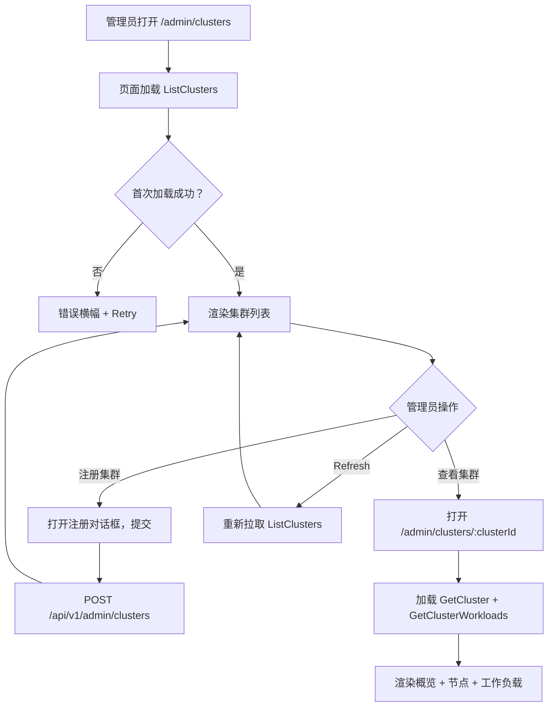
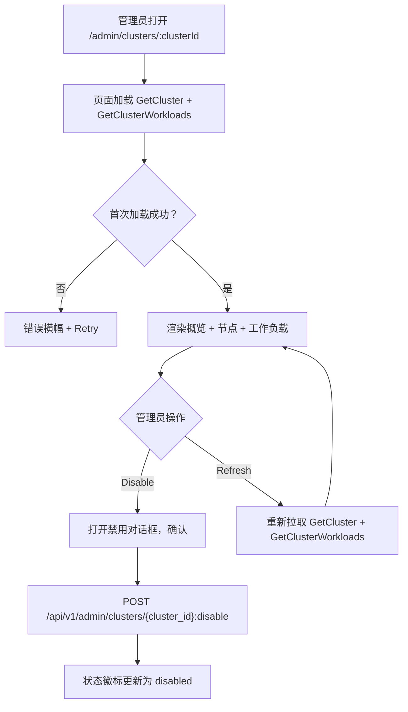
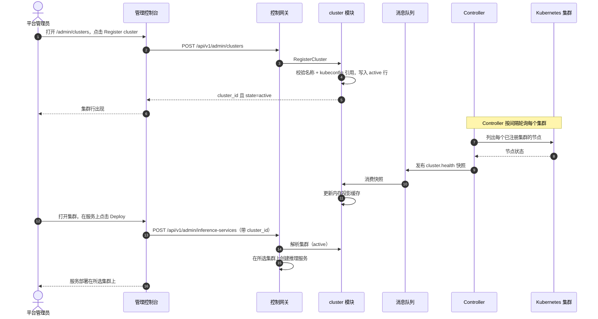

# 多集群管理 — 需求分析与 UI/UX 设计

| 属性 | 内容 |
| --- | --- |
| 特性点 | 多集群管理 — 注册与管理推理集群、查看集群健康与工作负载放置、并跨集群路由部署（backlog 第 40 行） |
| 文档范围 | 需求分析、竞品调研、`/admin/clusters`（集群列表）与 `/admin/clusters/:clusterId`（集群详情）管理面集群页、页面 → API 面映射表，以及编号验收标准 |
| 归属模块 | `cluster`（新增 — 拥有集群注册表与集群健康投影）、`infer`（只读：工作负载放置与跨集群路由）、`controller`（只读：每集群健康采集与快照发布）、`pkg/server` 网关（管理前缀绑定）、`web` 管理控制台（`ClustersPage`、`ClusterDetailPage`） |
| 相关文档 | [架构设计](./architecture.md) — 第 2.4 节 `infer`、第 2.7 节 Controller、第 4.2 节一键部署流程 · [加速器清单与健康](./accelerator-inventory.md) — 本特性复用的 Controller → MQ → 服务投影模式与内存缓存 · [系统健康与服务状态](./system-health-status.md) — 本特性扩展到集群的组件健康约定 · [模型目录与一键部署](./model-catalog-deployment.md) — 本特性路由扩展的推理服务生命周期与部署表单 · [控制台面分离](./console-surface-separation.md) — 两个面、`AdminShell` 约定、掩码投影规则 |
| 状态 | 设计完成，已移交架构师代理 |

---

## 1. 背景与竞品调研

### 1.1 为什么现在做多集群管理

go-taas 在单集群上把推理服务作为 Kubernetes Deployment 运行（model-catalog-deployment §4.2）：Controller 创建 Deployment 与 Service，加速器清单（特性 #18）上报每节点 GPU 健康。控制台仍无法做的是*跨多个集群运行推理*：拥有第二个集群（不同区域、不同加速器集群或突发容量池）的运营者无法注册它、查看其健康、查看哪些服务运行其上、或选择新部署落在哪里。运营者必须分别管理每个集群的 Kubernetes API 并手工路由部署 — 这是控制台应当拥有的运营者编排逃生通道。

本特性新增**多集群管理**：注册与管理推理集群、查看集群健康与工作负载放置、并跨集群路由部署。这是 Phase 4 生产化路线图项中最小可独立交付的增量：它把「我有第二个集群」变成「注册它，查看其健康与运行内容，并选择每个部署落在哪里」。

### 1.2 竞品如何实现多集群管理

| 产品 | 集群注册表 | 集群健康 | 工作负载放置 | 跨集群路由 | 主要陷阱 |
| --- | --- | --- | --- | --- | --- |
| **Rancher** | 注册集群（导入或供应） | 每集群健康与节点状态 | 部署工作负载到所选集群 | 每集群端点；无自动路由 | 重型；集群管理是完整平台 |
| **Kubernetes Federation** | 注册成员集群 | 每集群健康 | 跨集群复制工作负载 | 基于 DNS 的路由 | 复杂；联邦是独立控制面 |
| **Datadog** | 多账户/区域基础设施 | 每集群主机/容器健康 | 放置可见性 | 无路由 | 重型 agent；第三方 SaaS |
| **Argo CD / GitOps** | 注册集群为目标 | 每集群同步/健康状态 | 部署到所选集群 | 每集群端点 | GitOps 中心；非控制台面 |
| **OpenShift** | 集群注册表 | 每集群健康 | 部署到所选集群 | 每集群路由 | 重型；企业平台 |

### 1.3 提炼出的模式与决策

值得采纳的模式：

1. **集群注册表** — Rancher、Federation 与 OpenShift 都让运营者注册集群；go-taas 需要集群注册表（新概念），使集群可注册一次并被部署引用。
2. **每集群健康** — Rancher 与 Datadog 显示每集群健康；go-taas 复用 Controller → MQ → 服务投影模式（accelerator-inventory AD1）上报集群健康。
3. **工作负载放置可见性** — Rancher 与 Datadog 显示哪些工作负载运行在哪个集群；go-taas 显示放置在每个集群上的推理服务。
4. **跨集群路由部署** — Rancher 与 OpenShift 让运营者在部署时选择集群；go-taas 在部署表单中增加集群选择器。

需要避免的陷阱：重型完整平台（Rancher、OpenShift）— go-taas 需要精选集群注册表与健康视图，而非完整集群管理平台；独立联邦控制面（Kubernetes Federation）— go-taas 保持 Controller 为唯一 reconciler 并增加集群维度；以及无运营者控制的自动跨集群路由 — go-taas 让运营者在部署时选择集群，带默认值。

**go-taas 的决策**（依据自主决策规则记录理由）：

| # | 决策 | 依据 |
| --- | --- | --- |
| D1 | **多集群管理仅存在于管理面**：`/admin/clusters` + `/admin/clusters/:clusterId` + `/api/v1/admin/clusters/*`。**无终端用户面** — 集群健康与放置是运营者编排（特性 #17 的掩码投影规则）；租户经网关消费模型，而非集群内部信息 | 集群管理是运营者编排；租户消费模型，而非集群。与仅管理面的加速器清单（特性 #18）与系统状态（特性 #30）一致 |
| D2 | **新增 `cluster` 模块**（`services/cluster`）拥有集群注册表与集群健康投影，带自有错误块 **124xx**。它复用 infer 模块做工作负载放置与跨集群路由 | 多集群是独立关注点（集群注册表 + 健康 + 放置），有自己的注册表与投影；专用模块把它与模型/infer 生命周期分离并给它一个归属，契合按特性分模块的模式 |
| D3 | **新增 `clusters` 表**存储已注册集群：`cluster_id`、`name`、`region`、`kubeconfig_ref`（集群 kubeconfig 的引用，而非密钥本身）、`state`（`active` / `disabled`）、`created_at`。集群注册一次并被部署引用 | 集群是一等、可复用资源（Rancher、OpenShift）；注册表避免每次部署重输集群凭据，并给部署表单一个集群选择器 |
| D4 | **集群健康是每集群 Kubernetes 状态的投影，由 Controller 采集并经 `cluster` 模块提供** — Controller 按间隔轮询每个已注册集群的节点并向新 `cluster.health` MQ subject 发布完整快照；`cluster` 模块维护内存投影缓存（accelerator-inventory AD1/AD11 模式） | Controller 是唯一持有 Kubernetes 客户端的组件（service-logs AD2、accelerator AD1）；投影模式保持健康视图依赖精简且自愈（移除的集群从下一快照消失） |
| D5 | **新增 `RegisterCluster` RPC** 校验集群名与 kubeconfig 引用，写入 `active` 集群行并返回 `cluster_id`。**新增 `ListClusters` RPC** 返回带每集群健康与工作负载计数的集群列表。**新增 `GetCluster` RPC** 返回含节点与已放置服务的完整集群详情 | 集群注册表需要创建/列表/详情；三个 RPC 镜像模型列表/详情拆分与加速器清单的列表/详情拆分 |
| D6 | **新增 `DisableCluster` RPC** 将集群设为 `disabled`；禁用集群从部署表单的集群选择器与新放置中排除，但既有服务继续运行直到运营者显式迁移 | 禁用集群（维护、退役）不得拆除运行中的服务；运营者显式迁移它们 |
| D7 | **工作负载放置是推理服务上的集群字段**：部署表单（特性 #2）新增**集群**选择器（来自 `ListClusters`，仅 `active`），`CreateInferenceService` 记录所选 `cluster_id`。**新增 `GetClusterWorkloads` RPC** 返回放置在某集群上的服务 | 「跨集群路由部署」意味着运营者在部署时选择集群；把它记录在服务上给出放置视图与路由控制 |
| D8 | **部署表单默认集群选择器为平台默认**（第一个 `active` 集群，或配置的默认），使既有单集群部署无需改动继续工作 | 默认值保留既有行为（单集群场景）；运营者在有多个集群时覆盖它 |
| D9 | **新增集群错误块（12401–12499）**：**12401 `CodeClusterNotFound`**、**12402 `CodeClusterExists`**、**12403 `CodeClusterStateInvalid`**、**12404 `CodeClusterKubeconfigInvalid`**。未知推理服务复用 **10301** | 多集群是新模块（D2），因此其代码位于微调块（123xx）之后的新块；独立代码让每个失败模式可操作，而 infer 契约保持统一 |
| D10 | **页面除注册与禁用操作外只读** — 注册表单与禁用操作写入；其余（列表、详情、健康、放置）只读且仅对访问审计 | 该特性的写入是注册与禁用操作；审计轨迹（特性 #15）覆盖它们。除既有写入路径外无需新增审计事件 |

### 1.4 范围边界

**范围内**：集群列表页（`/admin/clusters`）、注册集群表单、集群详情页（`/admin/clusters/:clusterId`）含健康与已放置服务、部署表单（特性 #2）中的集群选择器、以及禁用操作。

**范围外**（由其他特性点跟踪）：模型目录与一键部署表单（#2）、加速器清单（#18）、系统健康与状态（#30）、自动跨集群负载均衡或故障转移（运营者在部署时选择集群；自动路由是未来工作）、集群供应或生命周期管理（go-taas 注册既有集群，不创建它们）、以及用户面集群面（刻意缺失，D1）。

---

## 2. 用户角色

| 角色 | 描述 | 与多集群管理的交互 |
| --- | --- | --- |
| **平台管理员** | 运行 go-taas 集群并策划推理服务的运营者 | 注册集群、查看集群健康与放置、禁用集群、并在部署时选择集群 |
| **智能体 / SDK** | 调用 `/v1/chat/completions` 的程序化消费者 | 从不接触集群管理；经网关用 API Key 消费已部署模型 |

> 术语：消费侧调用方称为 **Agent**（英文）/「智能体」（中文），与仓库约定一致。本特性仅管理面，因此消费侧术语不适用于租户面。

---

## 3. 用户故事

| # | 作为… | 我想要… | 以便… |
| --- | --- | --- | --- |
| US1 | 平台管理员 | 注册推理集群（名称、区域、kubeconfig 引用） | 从控制台管理多个集群 |
| US2 | 平台管理员 | 查看带健康与工作负载计数的集群列表 | 一眼跟踪所有集群 |
| US3 | 平台管理员 | 打开集群并查看其健康与放置其上的服务 | 理解什么运行在哪里以及集群是否健康 |
| US4 | 平台管理员 | 部署服务时选择集群 | 把部署路由到正确的集群 |
| US5 | 平台管理员 | 为维护禁用集群 | 新部署停止落在那里而既有服务继续运行 |
| US6 | 智能体 / SDK | 经网关用 API Key 调用已部署模型的端点 | 无需知道哪个集群服务它即可获得补全 |

---

## 4. 功能需求

### FR1 — 集群注册表

- **FR1.1** `RegisterCluster`（`POST /api/v1/admin/clusters`）注册集群，含**名称**（必填，1–128 字符）、**区域**（可选，1–64 字符）与**Kubeconfig 引用**（必填，集群 kubeconfig 的引用，而非密钥本身）。它返回 `cluster_id` 且 `state=active`。
- **FR1.2** `ListClusters`（`GET /api/v1/admin/clusters`）返回已注册集群，最新在前，每个含 `cluster_id`、`name`、`region`、`state`（`active` / `disabled`）、`health`（`healthy` / `degraded` / `unknown`）、`node_count`、`service_count` 与 `last_checked_at`。
- **FR1.3** 重复名称返回 **12402 `CodeClusterExists`**；无效 kubeconfig 引用返回 **12404 `CodeClusterKubeconfigInvalid`**。

### FR2 — 集群健康

- **FR2.1** Controller 按间隔（默认 30 秒）轮询每个已注册集群的节点，并向 `cluster.health` MQ subject 发布完整快照；`cluster` 模块维护内存投影缓存（D4）。
- **FR2.2** `GetCluster`（`GET /api/v1/admin/clusters/{cluster_id}`）返回完整集群详情：`cluster_id`、`name`、`region`、`state`、`health`、`node_count`、`service_count`、`last_checked_at` 与 `nodes[]`（每个含 `node_id`、`name`、`status`）。
- **FR2.3** 未知 `cluster_id` 返回 **12401 `CodeClusterNotFound`**。

### FR3 — 工作负载放置与路由

- **FR3.1** `GetClusterWorkloads`（`GET /api/v1/admin/clusters/{cluster_id}/workloads`）返回放置在某集群上的推理服务，每个含 `service_id`、`name`、`model_id`、`state` 与 `created_at`。
- **FR3.2** 部署表单（特性 #2）新增**集群**选择器，来自 `ListClusters`（仅 `active`），默认平台默认值（D8）。`CreateInferenceService` 记录所选 `cluster_id`。
- **FR3.3** 禁用集群从部署表单的集群选择器与新放置中排除（D6）。

### FR4 — 禁用集群

- **FR4.1** `DisableCluster`（`POST /api/v1/admin/clusters/{cluster_id}:disable`）将集群设为 `disabled`。它幂等（禁用已禁用集群是无操作成功）。
- **FR4.2** 禁用集群不拆除既有服务；运营者显式迁移它们（D6）。未知 `cluster_id` 返回 **12401**。

### FR5 — 面与 API 绑定

- **FR5.1** 集群页面位于**管理面**：路由 `/admin/clusters` 与 `/admin/clusters/:clusterId`，API 前缀 `/api/v1/admin/clusters/*`。它们作为「Clusters」加入 `AdminShell` 导航（特性 #17）。
- **FR5.2** 集群管理**无终端用户面**（D1）：租户看不到集群或放置。管理页仅调用 `/api/v1/admin/clusters/*` 路由，且不含任何 `/api/v1/*` 字符串（特性 #17，D1）。

---

## 5. 页面与流程设计

### 5.1 面分配

| 特性 | 面 | Web 路由 | API 前缀 |
| --- | --- | --- | --- |
| 集群注册表 | admin | `/admin/clusters` | `/api/v1/admin/clusters` |
| 集群列表 | admin | `/admin/clusters` | `/api/v1/admin/clusters` |
| 集群详情 | admin | `/admin/clusters/:clusterId` | `/api/v1/admin/clusters/{cluster_id}` |
| 集群工作负载 | admin | `/admin/clusters/:clusterId` | `/api/v1/admin/clusters/{cluster_id}/workloads` |
| 禁用集群 | admin | `/admin/clusters/:clusterId` | `/api/v1/admin/clusters/{cluster_id}:disable` |
| 部署表单集群选择器 | admin | `/admin/inference-services`（部署对话框） | `/api/v1/admin/inference-services`（创建，扩展） |

以上每个页面与 API 调用都位于**管理面**；无终端用户面（D1）。管理页从不调用 `/api/v1/*` 路由，全程使用管理会话域。

### 5.2 页面地图

| 页面 / 组件 | 用途 |
| --- | --- |
| **集群页**（`/admin/clusters`） | 集群注册表（注册/列表）+ 集群健康与工作负载计数 |
| **集群详情页**（`/admin/clusters/:clusterId`） | 完整集群记录（健康、节点、已放置服务）+ 禁用操作 |
| **部署对话框**（既有，特性 #2） | 新增集群选择器用于跨集群路由部署 |

### 5.3 页面：`/admin/clusters` — 集群（admin）

**用途**：给平台管理员一个单一面注册集群、查看其健康与工作负载计数、并打开集群详情。

**面**：admin — 路由 `/admin/clusters`，API `/api/v1/admin/clusters/*`。

**布局**：在 `AdminShell`（特性 #17）内渲染。页头（「Clusters」，副标题「Inference clusters and workload placement」）带 **Register cluster** 操作（主要）与 **Refresh** 操作（次要）。其下：

1. **集群列表** — 已注册集群表，列：**名称**（链接到详情页）、**区域**、**状态**（徽标）、**健康**（徽标）、**节点数**、**服务数**、**最后检查**。行操作 **View** 打开详情页。

**交互状态**：

| 状态 | 行为 |
| --- | --- |
| 默认 | 集群列表从首次成功加载渲染 |
| 加载中 | 骨架表；Register cluster 与 Refresh 禁用 |
| 空 | 「No clusters registered.」并提示注册一个；Register cluster 按钮保持可见 |
| 错误 | 错误横幅含消息与 Retry 按钮；页面保留最后良好数据并显示「Showing stale data」横幅 |
| 禁用 | 加载进行中 Register cluster 与 Refresh 禁用 |
| 权限拒绝 | 无所需角色的会话收到 10036，页面显示标准权限拒绝状态（特性 #17）并带返回管理首页的链接 |

**集群列表列**：名称（链接）、区域、状态（徽标）、健康（徽标）、节点数、服务数、最后检查。可按名称、区域、状态、健康与节点数排序。可按状态（All / Active / Disabled）与健康（All / Healthy / Degraded / Unknown）过滤；分页。

### 5.4 页面：`/admin/clusters/:clusterId` — 集群详情（admin）

**用途**：给平台管理员集群的完整记录 — 健康、节点与已放置服务 — 以及禁用操作。

**面**：admin — 路由 `/admin/clusters/:clusterId`，API `/api/v1/admin/clusters/{cluster_id}`。

**布局**：在 `AdminShell`（特性 #17）内渲染。页头（「Cluster」，副标题含集群名与 `cluster_id`）带 **Back to Clusters** 链接（次要）、**Refresh** 操作（次要）与 **Disable** 操作（危险，次要）。其下：

1. **概览卡片** — 集群的名称、区域、状态徽标、健康徽标、节点数、服务数与最后检查时间。
2. **节点卡片** — 集群节点表，列：**节点**（名称）、**状态**（徽标）。
3. **工作负载卡片** — 放置在某集群上的推理服务表，列：**服务**（链接到服务详情页）、**模型**、**状态**（徽标）、**创建时间**。行操作 **View** 打开服务详情页。

**交互状态**：

| 状态 | 行为 |
| --- | --- |
| 默认 | 概览卡片 + 节点卡片 + 工作负载卡片从首次成功加载渲染 |
| 加载中 | 骨架卡片；Refresh 与 Disable 禁用 |
| 空 | 「No cluster data.」并提示集群在注册后出现；页头保持可见 |
| 错误 | 错误横幅含消息与 Retry 按钮；页面保留最后良好数据并显示「Showing stale data」横幅 |
| 禁用 | 加载进行中 Refresh 与 Disable 禁用；集群已 `disabled` 时 Disable 禁用 |
| 权限拒绝 | 无所需角色的会话收到 10036，页面显示标准权限拒绝状态（特性 #17）并带返回管理首页的链接 |

**禁用对话框**：确认对话框：「Disable cluster `<name>`? New deployments will stop landing here; existing services keep running until you move them.」确认调用 `DisableCluster` 并显示 toast；集群状态徽标更新为 `disabled`。

### 5.5 流程

---

## 6. API 面影响

集群 RPC 属于 **`cluster` 模块**（D2），经控制网关以 HTTP 在**管理前缀** `/api/v1/admin/clusters/*` 提供（D1）。Controller 轮询每个已注册集群并经 MQ 发布健康快照（D4）。infer 模块在推理服务上记录所选 `cluster_id`（D7）。**无用户前缀绑定**（D1）。

| RPC | 路由 | 前缀 | 状态 | 用途 |
| --- | --- | --- | --- | --- |
| `RegisterCluster`（`taas.cluster.v1`） | `POST /api/v1/admin/clusters` | admin | **新增** | 注册推理集群（名称、区域、kubeconfig 引用） |
| `ListClusters`（`taas.cluster.v1`） | `GET /api/v1/admin/clusters` | admin | **新增** | 列出带健康与工作负载计数的已注册集群 |
| `GetCluster`（`taas.cluster.v1`） | `GET /api/v1/admin/clusters/{cluster_id}` | admin | **新增** | 获取集群的完整详情（健康、节点） |
| `GetClusterWorkloads`（`taas.cluster.v1`） | `GET /api/v1/admin/clusters/{cluster_id}/workloads` | admin | **新增** | 列出放置在某集群上的推理服务 |
| `DisableCluster`（`taas.cluster.v1`） | `POST /api/v1/admin/clusters/{cluster_id}:disable` | admin | **新增** | 禁用集群（从新放置中排除） |

**给架构师代理的契约说明**：

1. `RegisterCluster` 接受 `name`、`region`（可选）与 `kubeconfig_ref`；返回 `cluster_id` 且 `state=active`（FR1.1）。`ListClusters` 返回集群，最新在前，带每集群健康与工作负载计数（FR1.2）。
2. `GetCluster` 返回含 `nodes[]` 的完整详情；`GetClusterWorkloads` 返回已放置服务（FR2.2、FR3.1）。
3. `DisableCluster` 将集群设为 `disabled`；它幂等且不拆除既有服务（D6、FR4.1）。
4. Controller 按间隔轮询每个已注册集群的节点并向 `cluster.health` 发布完整快照；`cluster` 模块维护内存投影缓存（D4）。
5. 部署表单（特性 #2）新增集群选择器；`CreateInferenceService` 记录所选 `cluster_id`（D7、D8）。
6. 线上约定不变：成功返回 HTTP 200，业务错误为 `{"code": <int>, "message": "..."}`，int64 字段序列化为 JSON 字符串。

错误码（既有块，`pkg/errors/codes.go`）：

| 条件 | 代码 | 常量 | 说明 |
| --- | --- | --- | --- |
| 未知 `cluster_id` | 12401 | `CodeClusterNotFound` | **新增**（D9） |
| 重复集群名 | 12402 | `CodeClusterExists` | **新增**（D9） |
| 无效集群状态转换 | 12403 | `CodeClusterStateInvalid` | **新增**（D9） |
| 无效 kubeconfig 引用 | 12404 | `CodeClusterKubeconfigInvalid` | **新增**（D9） |
| 未知推理服务 | 10301 | `CodeInferServiceNotFound` | 复用 — infer 契约（FR3.2） |

---

## 7. 验收标准

| # | 标准 | 级别 |
| --- | --- | --- |
| AC1 | `RegisterCluster` 注册集群且 `ListClusters` 返回它，带健康与工作负载计数；重复名称返回 12402，无效 kubeconfig 引用返回 12404 | FVT |
| AC2 | `GetCluster` 返回含节点的完整详情；`GetClusterWorkloads` 返回已放置服务；未知 `cluster_id` 返回 12401 | FVT |
| AC3 | `DisableCluster` 将集群设为 `disabled` 且幂等；禁用集群从新放置中排除 | FVT |
| AC4 | `/admin/clusters` 页从首次成功加载渲染集群列表，带 Register cluster 操作 | E2E |
| AC5 | 注册集群对话框校验名称与 kubeconfig 引用，并创建以 `state=active` 出现的集群 | E2E |
| AC6 | `/admin/clusters/:clusterId` 页渲染概览、节点与工作负载卡片；Disable 操作仅对 `active` 集群启用 | E2E |
| AC7 | 部署表单（特性 #2）新增来自 `ListClusters`（仅 `active`）的集群选择器，默认平台默认值 | E2E |
| AC8 | 集群页面仅管理面可达：路由 `/admin/clusters` 与 `/admin/clusters/:clusterId`，每个 API 调用使用 `/api/v1/admin/clusters/*` 前缀且不含 `/api/v1/*` 字符串 | E2E（面分离） |
| AC9 | 无所需角色的会话在集群页面收到 10036，页面显示标准权限拒绝状态 | E2E |

---

## 8. 范围外（在其他处跟踪）

| 项 | 位置 |
| --- | --- |
| 模型目录与一键部署表单 | 特性 #2 模型目录与部署 |
| 加速器清单 | 特性 #18 加速器清单 |
| 系统健康与状态 | 特性 #30 系统健康 |
| 自动跨集群负载均衡或故障转移 | 未来工作 — 运营者在部署时选择集群 |
| 集群供应或生命周期管理 | go-taas 注册既有集群；不创建它们 |
| 用户面集群面 | 刻意缺失（D1）— 租户消费模型，而非集群 |