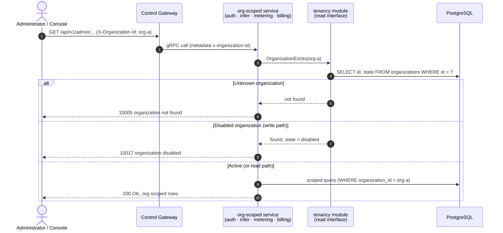
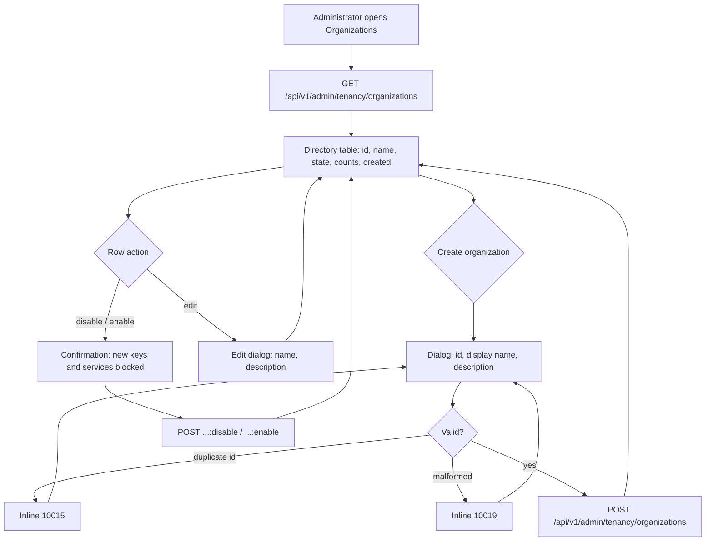

# Organization/Project Multi-Tenancy Isolation — Requirement Analysis and UI/UX Design

| Attribute | Content |
| --- | --- |
| Feature point | Organization/project multi-tenancy isolation |
| Document scope | Requirement analysis and UI/UX design for the tenancy core: the organization and project entities (CRUD, display names, states), the transitional `X-Organization-Id` header evolving into a validated organization context, org-scoped resource isolation across API keys, inference services, usage, charges and bills, the console Organizations and Projects pages, and acceptance criteria |
| Owning modules | `auth` (organizations, projects, and the tenancy context every module consumes), with `infer`, `metering`, and `billing` (org validation on their existing scoped queries) |
| Related documents | [Architecture Design](./architecture.md) — Section 2.1 `auth` (multi-tenancy responsibility), Section 3.1 admin/user surface separation · [API Key Management](./api-key-management.md) — the transitional org-scoped keys this feature grounds in real rows (its D7) · [Token Metering Vouchers & Async Settlement](./metering.md) — org-scoped usage (its D8) · [Model × Card-Type Price Matrix & Tiered Pricing](./pricing.md) — org-scoped charges and bills (its FR5.3) |
| Status | Design complete, handed to the Architect agent |

---

## 1. Background and Competitive Research

### 1.1 Why Multi-Tenancy Comes Now

Features #1–#5 shipped the platform's whole accounting and serving spine on top of a **transitional identity model**: every org-scoped table (`api_keys`, `vouchers`, `usage_records`, `usage_lines`, `charge_records`, `inference_services`) carries a plain `organization_id` string column, and every admin API trusts the caller-supplied `X-Organization-Id` header verbatim. No `organizations` or `projects` table exists; the console keeps a free-text org id in localStorage (`org-default`); any string is accepted as an organization. That was the right bootstrap — but it means:

- **Nothing validates tenancy**: a typo'd header silently creates a new "organization" with zero resources; two teams picking the same string share data without knowing it.
- **No tenant directory**: an operator cannot answer "which organizations exist, who owns them, what do they consume" without querying raw tables.
- **No project level**: the README promises organization/project isolation, but there is no place for a team inside an organization to keep its services and keys apart.
- **Bills have no addressee**: feature #5's bills aggregate by organization id, but there is no organization to send them to.

This feature point grounds tenancy in real rows: organizations and projects become first-class entities with lifecycle, display names, and states; the transitional header becomes a **validated** organization context (the org must exist); and the console gains an Organizations page (with per-org drill-down) and a Projects page. Per-tenant authentication (sessions, roles, member accounts) stays out of scope — the header remains the carrier until SSO lands in feature #7, but it now resolves against the database.

### 1.2 How Comparable Products Model Tenancy

| Product | Tenancy model | Hierarchy | Projects | Tenant directory UX | Notable pitfalls |
| --- | --- | --- | --- | --- | --- |
| **OpenAI Platform** | Organization → Project; API keys and billing belong to an org, usage is per-project | Two levels | First-class: keys, rate limits and usage split per project | Org switcher in the user menu; project picker inside each product page | A key created in the "wrong" project is a support ticket to move; no project rename |
| **Anthropic Console** | Organization → Project; workspaces with per-project API keys and spend | Two levels | First-class with per-project spend limits | Console-wide org + project selectors in the top bar | Two selectors confuse new users; usage pages mix org and project scopes |
| **Hugging Face** | Organizations as shared accounts; members with roles (admin/write/read); no project level | One level | None (repos live directly under the org) | Org avatar switcher; members managed on an org settings page | No project level means one team's hundreds of repos bury another team's |
| **Kubernetes (namespaces)** | Flat namespaces with labels; RBAC binds to namespace; ResourceQuota per namespace | Flat (labels simulate hierarchy) | None | `kubectl get ns` — a directory, not a UX | No hierarchy: cross-team grouping is convention, not structure |
| **AWS Organizations** | Organization → OU tree → accounts; SCPs inherit down the tree | Deep tree | Accounts as the leaf isolation unit | Account switcher; OU tree in the console | Deep trees are powerful but heavy; most orgs use two levels in practice |
| **阿里云百炼 (Alibaba Cloud Bailian)** | Primary account → workspace (业务空间); each workspace isolates apps, models and billing | Two levels | Workspaces with per-workspace model authorization and bills | Workspace switcher in the top bar; workspace list with roles | Workspace switching reloads the whole console; no cross-workspace search |

### 1.3 Distilled Patterns and Decisions

Common industry patterns worth adopting:

1. **Two levels are the sweet spot** — OpenAI, Anthropic, and Bailian all settled on organization → project. Deeper trees (AWS OUs) exist for enterprise edge cases; a flat model (Hugging Face, Kubernetes) cannot separate teams inside one tenant. Two levels cover the platform's promise with the least UI.
2. **The organization owns billing; the project owns work** — keys, services, and usage belong to a project (or directly to the org); charges and bills always aggregate at the org level. Every surveyed platform bills the org.
3. **A tenant directory is an operator's page one** — a table of tenants with state, resource counts, and creation time is the minimum viable directory (the Kubernetes lesson: a list, not a tree).
4. **Soft states, not deletes** — tenants get disabled/paused states rather than deletion, because their keys, vouchers, and charge records are durable evidence (feature #4/#5's immutability reasoning). Deleting a tenant would orphan billing history.
5. **The context carrier is explicit and validated** — whether a header (transitional) or a session (SSO), the resolved tenant must be checked against real rows before any scoped query runs. An unvalidated tenant id is a data-integrity bug, not just a security gap.

Pitfalls to avoid:

- **Free-text tenancy** (the status quo) — any string becomes an organization; typos fork tenants silently. This feature's core fix.
- **Project-scoped billing** — no surveyed platform bills at the project level; splitting bills per project multiplies invoice objects for no reader. Bills stay org-level; projects get usage views.
- **Hard deletes of tenants** — cascading deletes over vouchers and charge records destroy audit evidence. Disabling is reversible; deleting is not.
- **Two context selectors everywhere** (Anthropic) — the transitional console has no login, so a single org context (the existing switcher, now validated) plus a project filter inside pages keeps the mental load at one dimension per screen.
- **Rename-as-identity** — display names are mutable; ids are not. Every table already keys on an opaque org id string, which stays the join key.

**Decisions for go-taas** (recorded rationale, per the autonomous-decision rule):

| # | Decision | Rationale |
| --- | --- | --- |
| D1 | **Two-level tenancy: organization → project.** Organizations are the billing and membership boundary; projects are the work-isolation boundary inside an org. Both are first-class rows with UUID ids, mutable display names, descriptions, and states | The README's promise; the industry sweet spot (pattern 1); two levels cover team separation without tree-management UX |
| D2 | **Organization states: `active` and `disabled`.** Creating starts `active`; disabling is reversible and blocks new resource creation (keys, services) while keeping reads and history intact. There is **no delete** in v1 — a disabled org keeps its billing evidence | Pattern 4; feature #4/#5 made vouchers and charge records immutable evidence, and a deleted org would orphan them; disable is the operator's reversible lever |
| D3 | **Project states mirror organizations** (`active`/`disabled`), with the same no-delete rule and the same create-block/read-keep semantics | Symmetry keeps one mental model; projects carry keys and services whose history matters the same way |
| D4 | **The transitional `X-Organization-Id` header becomes a validated context**: every org-scoped admin API (API keys, inference services, usage, charges, bills) resolves the header against the `organizations` table and returns **10005 `CodeOrganizationNotFound`** for an unknown id (replacing today's silent acceptance). Missing header stays 10001. The header remains the carrier until sessions land in feature #7 | Pattern 5; the validation is the smallest change that closes the free-text hole, and it is exactly the seam SSO will replace — the resolver function stays, only its input changes |
| D5 | **A default organization is seeded on first boot** (`org-default`, display name "Default Organization", active) from config (`auth.tenancy.defaultOrgId`), so existing deployments and e2e flows that send `X-Organization-Id: org-default` keep working with zero migration | Backward compatibility: every existing FVT/e2e suite and the console's default org id must keep passing; seeding is the first-boot pattern feature #3 established for images |
| D6 | **Projects are optional, not mandatory**: resources keep their existing org-level columns; v1 adds **no project column to any existing table**. Projects are a directory + validation layer now; attaching resources to projects (a `project_id` column on keys/services) is deferred until members and roles exist to govern it | Scope discipline: without per-tenant auth there is no way to enforce project membership, so a project column would be an unvalidated string — repeating the exact free-text bug this feature fixes, one level down |
| D7 | **New `tenancy` service module** (`services/tenancy`) owning the `organizations` and `projects` tables, their CRUD RPCs, and the org-existence validation consumed by every other module through a narrow read interface (the `infer.NewDeleteModelGuard` pattern) — not the `auth` module, which stays focused on keys and verification until SSO reorganizes it | The architecture doc assigns tenancy to `auth`, but `auth` today is the API-key module; a separate module keeps single responsibilities and lets feature #7 fold tenancy into `auth`'s account model deliberately, not accidentally |
| D8 | **API surface**: a new `taas.tenancy.v1.TenancyService` — `CreateOrganization`, `ListOrganizations`, `GetOrganization`, `UpdateOrganization` (name/description), `DisableOrganization`, `EnableOrganization`, `CreateProject`, `ListProjects`, `GetProject`, `UpdateProject`, `DisableProject`, `EnableProject` — all under `/api/v1/admin/tenancy/*`, platform-global (no org header required; the admin console manages all tenants) | Operators manage the whole directory from one surface; org-scoped self-service (a tenant admin renaming their own org) needs sessions and roles — feature #7 |
| D9 | **New error codes** in the auth block: **10015 `CodeOrganizationExists`** (duplicate org id/name), **10016 `CodeProjectExists`**, **10017 `CodeOrganizationDisabled`**, **10018 `CodeProjectDisabled`**, **10019 `CodeTenancyInvalid`** (malformed ids/names, bad state transitions). Existing 10005/10006 cover not-found | The 100xx block is auth's and tenancy's; each failure mode needs its own code so the console can render the right inline message (the metering D9 pattern) |
| D10 | **Console gains an Organizations page** (`/admin/organizations`): the tenant directory table (id, display name, state badge, key/service counts, created), a create-org dialog, rename/description editing, disable/enable with confirmation. A **Projects page** (`/admin/projects`): the project directory filtered by organization (dropdown), with the same create/edit/disable flows. The existing org switcher stays but is now backed by the real org list (a dropdown of existing orgs, not free text) | Pattern 3; the directory is the operator's page one; the switcher upgrade closes the last free-text tenancy surface in the console |
| D11 | **Resource counts on the directory rows**: `ListOrganizations`/`GetOrganization` return `api_key_count` and `inference_service_count` (and projects return `api_key_count`/`inference_service_count` scoped to the org), computed with indexed COUNT queries at read time | The directory's core question is "what does this tenant consume"; counts are cheap on the existing org-priority indexes and avoid any cross-module write coupling |
| D12 | **Deferred**: member management and roles (owner/admin/member), per-tenant authentication and sessions, project-scoped resource columns, per-project usage views, org/project quotas, tenant-facing self-service, and hierarchical OUs | Members without login are rows nobody can authenticate as; the SSO feature (#7) delivers the account model that makes roles enforceable; quotas entangle with #8's balance work |

### 1.4 Scope Boundary

**In scope**: the `organizations` and `projects` tables with states; the `tenancy` module with CRUD RPCs and state transitions; the first-boot default-org seed; the org-existence validation consumed by `auth` (API keys), `infer` (services), `metering` (usage), and `billing` (charges/bills) on their org-scoped queries; new error codes 10015–10019; the console Organizations and Projects pages; the org switcher backed by real orgs.

**Out of scope** (tracked elsewhere): member management, roles, and per-tenant authentication (#7 — sessions replace the header), project-scoped resource columns and per-project usage views (after #7), org/project quotas and spend limits (#8 entanglement), tenant self-service portals (#7), hierarchical OUs (future), tenant deletion with evidence archival (future, needs a retention design), and the CLI tenancy commands (follow the API, shipped when the CLI surface is next touched).

---

## 2. User Roles

| Role | Description | Interaction with tenancy |
| --- | --- | --- |
| **Platform administrator** | The operator who runs the go-taas cluster; today also the console user | Creates and names organizations and projects, disables misbehaving tenants, watches the directory's resource counts |
| **Organization administrator (future)** | A tenant-side administrator consuming the platform | Will manage their own org's projects and members once sessions and roles exist (#7); today they do not exist as a distinct principal |
| **Agent / SDK** | The programmatic consumer whose calls generate usage | Unaffected directly: their API key's org must exist and be active for new keys to be created; inference traffic keeps flowing under existing keys |
| **Auditor** | Whoever resolves a billing or usage dispute | Traces charges to an organization row with a display name and creation time, not a bare string |
| **Console (this feature)** | The admin web UI | Renders the tenant directory, the project directory, and the validated org switcher |

> Terminology: the consuming caller is called an **Agent** (English) / 「智能体」(Chinese), consistent with the repo convention.

---

## 3. User Stories

| # | As a… | I want to… | So that… |
| --- | --- | --- | --- |
| US1 | Platform administrator | create an organization with an id and display name | a new tenant gets a real, addressable identity before any keys exist |
| US2 | Platform administrator | see the directory of all organizations with their state and resource counts | I can answer "which tenants exist and what do they consume" from one page |
| US3 | Platform administrator | rename an organization or fix its description | display mistakes are correctable without touching any resource |
| US4 | Platform administrator | disable a misbehaving organization and re-enable it later | I can stop a tenant's new spending without destroying its history |
| US5 | Platform administrator | create projects inside an organization | teams within one tenant keep their work separated |
| US6 | Platform administrator | get an explicit error when my org header names a nonexistent organization | a typo cannot silently fork me into an empty tenant |
| US7 | Platform administrator | pick my working organization from the real org list in the console | I stop typing free-text org ids that may not exist |
| US8 | Agent / SDK operator | have my API key creation rejected when my organization is disabled | a disabled tenant cannot accrue new keys or services |
| US9 | Auditor | see which organization a bill belongs to, by name | charge evidence points at a real tenant, not a string |
| US10 | Platform administrator | keep using `org-default` after upgrading | the upgrade does not break my existing scripts and console |

---

## 4. Functional Requirements

### FR1 — Organization management

- **FR1.1** `CreateOrganization` (`POST /api/v1/admin/tenancy/organizations`) creates an organization: caller-supplied `organization_id` (3-64 chars, `[a-z0-9][a-z0-9-]{2,63}`, lowercase — matching the existing column width and bill-id format) and `display_name` (1-128 chars), optional `description` (≤ 1024 chars). State starts `active`. Duplicate id → 10015; malformed id/name → 10019.
- **FR1.2** `ListOrganizations` (`GET /api/v1/admin/tenancy/organizations`) returns all organizations paginated (default 20, cap 100), ordered by creation time descending, each row carrying id, display name, description, state, `api_key_count`, `inference_service_count`, `project_count`, `created_at`, `updated_at`. Filter: `state` (optional).
- **FR1.3** `GetOrganization` (`GET /api/v1/admin/tenancy/organizations/{organization_id}`) returns one organization with the same fields. Unknown id → 10005.
- **FR1.4** `UpdateOrganization` (`PATCH /api/v1/admin/tenancy/organizations/{organization_id}`) edits `display_name` and/or `description` only — the id and state are immutable here. Unknown id → 10005; empty resulting name → 10019.
- **FR1.5** `DisableOrganization` (`POST /api/v1/admin/tenancy/organizations/{organization_id}:disable`) flips `active` → `disabled` (idempotent — disabling a disabled org succeeds). `EnableOrganization` (`…:enable`) flips back. Both bump `updated_at`. Unknown id → 10005.
- **FR1.6** There is **no delete** for organizations in v1 (D2). Disabled organizations keep all rows and remain readable in every org-scoped query.

### FR2 — Project management

- **FR2.1** `CreateProject` (`POST /api/v1/admin/tenancy/projects`) creates a project inside an organization: caller-supplied `project_id` (same syntax as org ids), `organization_id` (must exist and be `active` → else 10005/10017), `display_name`, optional `description`. State starts `active`. Duplicate `(organization_id, project_id)` → 10016; malformed → 10019.
- **FR2.2** `ListProjects` (`GET /api/v1/admin/tenancy/projects`) returns projects paginated, newest first, filtered by `organization_id` (optional) and `state` (optional), each row carrying id, org id, display name, description, state, `created_at`, `updated_at`.
- **FR2.3** `GetProject` (`GET /api/v1/admin/tenancy/projects/{project_id}`) returns one project. Unknown id → 10006.
- **FR2.4** `UpdateProject` (`PATCH /api/v1/admin/tenancy/projects/{project_id}`) edits `display_name`/`description` only.
- **FR2.5** `DisableProject`/`EnableProject` (`POST …/projects/{project_id}:disable` / `:enable`) mirror FR1.5. Disabling an organization does **not** cascade to its projects' states (the org gate is checked at resource-creation time), but a disabled org's projects cannot be enabled (10017).
- **FR2.6** There is **no delete** for projects in v1 (D3), and **no project column is added to any existing resource table** (D6).

### FR3 — Validated organization context

- **FR3.1** Every org-scoped admin API — `auth` (List/Create API keys), `infer` (Create/List/Get/Scale/Delete services), `metering` (vouchers, usage summary, usage records), `billing` (charges, bills) — resolves `X-Organization-Id` against the `organizations` table: a missing header stays 10001; an **unknown id now returns 10005** (D4). The check is a single indexed read per request.
- **FR3.2** **Write-path gating**: `CreateAPIKey` and `CreateInferenceService` additionally reject a **disabled** organization with 10017 (US8). Read paths (list/get/usage/bills) keep working for disabled orgs — history stays visible.
- **FR3.3** The validation lives in one shared helper (`tenancy.ResolveActiveOrganization` / `tenancy.OrganizationExists`) consumed through a narrow read interface, so feature #7 can swap the header for a session without touching five call sites again (D4/D7).
- **FR3.4** The default organization (`org-default`) is seeded on first boot when the `organizations` table is empty (D5); the seed is insert-only and never re-runs on a non-empty table (the feature-#3 image-seed pattern).

### FR4 — Console Organizations and Projects pages

- **FR4.1** An "Organizations" nav item (`/admin/organizations`) opens the directory: one row per organization — id, display name, state badge (active/disabled), key count, service count, project count, created time; a "Create organization" button opens a dialog (id, display name, description); row actions: edit (name/description dialog), disable/enable with a confirmation dialog warning that new keys and services will be blocked; inline errors for 10015/10019.
- **FR4.2** A "Projects" nav item (`/admin/projects`) opens the project directory: an organization filter dropdown (from the org list), one row per project — id, org, display name, state badge, created time; a "Create project" dialog (org dropdown, id, name, description); row actions: edit, disable/enable with confirmation; inline errors for 10016/10017/10019.
- **FR4.3** The sidebar org switcher becomes a dropdown of real organizations (fetched from `ListOrganizations`), replacing the free-text input; the selected org persists in localStorage as today. When the stored org no longer exists, the switcher falls back to the first organization and shows a notice.
- **FR4.4** Both pages show empty states ("No organizations yet — create the first one", "No projects in this organization") and refresh on a 60-second poll while visible.

---

## 5. Page and Flow Design

### 5.1 Page Map

| Page / component | Purpose |
| --- | --- |
| **Organizations page** (`/admin/organizations`) | The tenant directory: rows, create dialog, edit dialog, disable/enable confirmations |
| **Create organization dialog** | id + display name + description |
| **Edit organization dialog** | display name + description (id read-only) |
| **Projects page** (`/admin/projects`) | The project directory with org filter, create/edit dialogs, disable/enable |
| **Org switcher** (sidebar, upgraded) | Validated dropdown of existing organizations |
| **All existing pages** | Unchanged layouts; org-scoped pages now surface 10005 when the switched-to org does not exist |

### 5.2 Organization Context Resolution

### 5.3 Organizations Page Flow

---

## 6. API Surface Implications

All APIs belong to the new **`taas.tenancy.v1.TenancyService`** (proto: `proto/taas/tenancy/v1/tenancy.proto`), served as HTTP via the Control Gateway under `/api/v1/admin/tenancy/*`. The service is platform-global: no `X-Organization-Id` header is required or consumed (D8). Existing services' RPCs are unchanged on the wire; their behavior tightens per FR3.

| RPC | HTTP | Status | Purpose | Notes |
| --- | --- | --- | --- | --- |
| `CreateOrganization` | `POST /api/v1/admin/tenancy/organizations` | **new** | Create a tenant | Caller-supplied id; 10015/10019 on bad input |
| `ListOrganizations` | `GET /api/v1/admin/tenancy/organizations` | **new** | The directory | Paginated; `state` filter; resource counts per row |
| `GetOrganization` | `GET /api/v1/admin/tenancy/organizations/{organization_id}` | **new** | One tenant | 10005 when unknown |
| `UpdateOrganization` | `PATCH /api/v1/admin/tenancy/organizations/{organization_id}` | **new** | Rename / describe | Id and state immutable |
| `DisableOrganization` | `POST /api/v1/admin/tenancy/organizations/{organization_id}:disable` | **new** | Block new resources | Idempotent |
| `EnableOrganization` | `POST /api/v1/admin/tenancy/organizations/{organization_id}:enable` | **new** | Re-activate | Idempotent |
| `CreateProject` | `POST /api/v1/admin/tenancy/projects` | **new** | Create a project | Org must exist and be active |
| `ListProjects` | `GET /api/v1/admin/tenancy/projects` | **new** | The project directory | `organization_id` + `state` filters |
| `GetProject` | `GET /api/v1/admin/tenancy/projects/{project_id}` | **new** | One project | 10006 when unknown |
| `UpdateProject` | `PATCH /api/v1/admin/tenancy/projects/{project_id}` | **new** | Rename / describe | — |
| `DisableProject` | `POST /api/v1/admin/tenancy/projects/{project_id}:disable` | **new** | Deactivate | Idempotent |
| `EnableProject` | `POST /api/v1/admin/tenancy/projects/{project_id}:enable` | **new** | Re-activate | Blocked while the org is disabled (10017) |

Contract constraints:

1. Ids are caller-supplied and immutable; display names are mutable; states transition only through the disable/enable endpoints (never through `Update*`).
2. Wire-format conventions unchanged: dotted pagination (`?page.offset=0&page.limit=20`), success HTTP 200, business errors as `{"code": <int>, "message": "..."}`, int64 fields as JSON strings.
3. Resource counts (`api_key_count`, `inference_service_count`, `project_count`) are int64 → JSON strings.
4. The org-scoped services' tightened behavior (FR3) is contract-visible: unknown org ids that previously returned empty lists now return 10005 — a breaking tightening, called out in the rollout notes.

Error codes (auth/tenancy block 10001–10099, `pkg/errors/codes.go`):

| Condition | Code | Constant | Notes |
| --- | --- | --- | --- |
| Unknown organization on any org-scoped API | 10005 | `CodeOrganizationNotFound` | Existing; now actually triggered |
| Unknown project | 10006 | `CodeProjectNotFound` | Existing |
| Duplicate organization id | 10015 | `CodeOrganizationExists` | **New** (D9) |
| Duplicate project id within an org | 10016 | `CodeProjectExists` | **New** |
| Disabled organization on a write path | 10017 | `CodeOrganizationDisabled` | **New** |
| Disabled project on a write path | 10018 | `CodeProjectDisabled` | **New** |
| Malformed ids/names, bad transitions | 10019 | `CodeTenancyInvalid` | **New** |
| Missing `X-Organization-Id` | 10001 | `CodeUnauthorized` | Unchanged |
| Database failure | 500 | `CodeInternal` | Via error normalization |

---

## 7. Acceptance Criteria

| # | Criterion | Verification |
| --- | --- | --- |
| AC1 | `CreateOrganization` stores the row (id, display name, description, state `active`); `GetOrganization` returns it; duplicate id → 10015; malformed id or empty name → 10019 | Unit + FVT + E2E |
| AC2 | `ListOrganizations` returns organizations newest first, paginated, with correct `api_key_count` / `inference_service_count` / `project_count` for seeded resources, and honors the `state` filter | Unit + FVT |
| AC3 | `UpdateOrganization` changes only display name/description (id and state untouched); unknown id → 10005 | Unit + FVT |
| AC4 | `DisableOrganization` flips state to `disabled` (idempotent); `EnableOrganization` flips back; both bump `updated_at` | Unit + FVT |
| AC5 | `CreateProject` stores the row under an active org; duplicate `(org, project)` → 10016; unknown org → 10005; disabled org → 10017 | Unit + FVT |
| AC6 | `ListProjects` filters by `organization_id` and `state`, newest first; `GetProject` returns one row; unknown → 10006 | Unit + FVT |
| AC7 | `DisableProject`/`EnableProject` transition idempotently; enabling a project under a disabled org → 10017 | Unit |
| AC8 | The default organization `org-default` is seeded when the table is empty and never re-seeded when non-empty | Unit |
| AC9 | Every org-scoped read API (API keys list, services list, usage summary, charges, bills) returns **10005** for an unknown org id (previously empty results) | FVT |
| AC10 | `CreateAPIKey` and `CreateInferenceService` reject a disabled org with 10017; reads under a disabled org keep returning rows | FVT |
| AC11 | Existing org-scoped flows keep working unchanged for an active org (regression: keys, services, usage, charges, bills all still pass) | FVT + E2E regression |
| AC12 | The Organizations page renders the directory, creates an organization via the dialog (row appears), edits a name, and disables/re-enables with the confirmation flow; inline 10015/10019 surface in the dialog | E2E |
| AC13 | The Projects page renders the directory with the org filter, creates a project via the dialog, and disables it; inline errors surface | E2E |
| AC14 | The sidebar org switcher lists real organizations and switching changes the org-scoped pages' data; a stale stored org falls back with a notice | E2E |
| AC15 | Both pages show their empty states on a fresh deployment (before the first create) | E2E |

---

## 8. Deferred Open Items

| Item | Deferred to |
| --- | --- |
| Members, roles (owner/admin/member), and invitations | Feature #7 (needs the account model) |
| Per-tenant sessions replacing the `X-Organization-Id` header | Feature #7 |
| Project-scoped resource columns (`project_id` on keys/services) and per-project usage views | After #7 (needs enforceable membership) |
| Org/project quotas and spend limits | Feature #8 entanglement |
| Tenant self-service portal (rename own org, manage own projects) | Feature #7 |
| Hierarchical OUs / nested orgs | Future |
| Tenant deletion with billing-evidence archival | Future (needs a retention design) |
| CLI commands for tenancy management | When the CLI surface is next touched |
| Cross-org search / global usage views | Future operations tooling |
