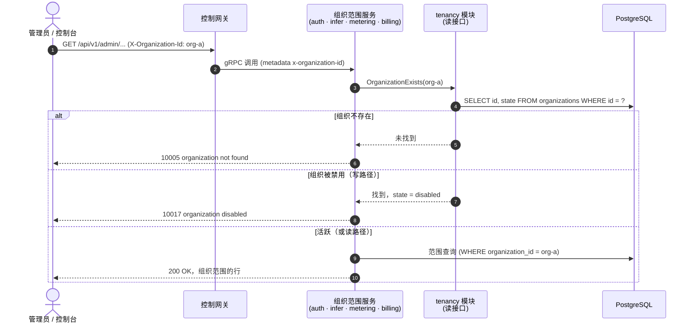
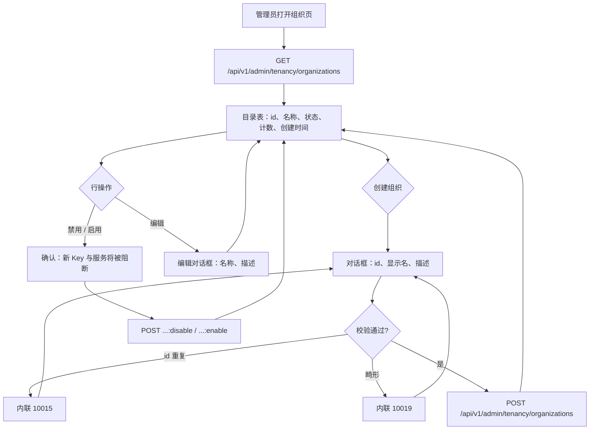

# 组织/项目多租户隔离 — 需求分析与 UI/UX 设计

| 属性 | 内容 |
| --- | --- |
| 特性点 | 组织/项目多租户隔离 |
| 文档范围 | `tenancy` 核心的需求分析与 UI/UX 设计：组织与项目实体（CRUD、显示名、状态）、过渡期 `X-Organization-Id` 头演进为经校验的组织上下文、API Key/推理服务/用量/计费记录/账单的组织范围资源隔离、控制台「组织」与「项目」页面，以及验收标准 |
| 归属模块 | `auth`（组织、项目，及各模块消费的租户上下文校验），配合 `infer`、`metering`、`billing`（既有范围查询上的组织校验） |
| 相关文档 | [架构设计](./architecture.zh-cn.md) — 第 2.1 节 `auth`（多租户职责）、第 3.1 节管理面/用户面分离 · [API Key 管理](./api-key-management.zh-cn.md) — 本特性为之落地真实行的过渡期组织范围 Key（其 D7） · [Token 计量凭证与异步结算](./metering.zh-cn.md) — 组织范围的用量（其 D8） · [模型 × 卡型价格矩阵与阶梯定价](./pricing.zh-cn.md) — 组织范围的计费记录与账单（其 FR5.3） |
| 状态 | 设计完成，已移交架构师代理 |

---

## 1. 背景与竞品调研

### 1.1 为什么现在做多租户

特性 #1–#5 在一个**过渡期身份模型**之上交付了平台完整的计量与账务主干：所有带组织范围的表（`api_keys`、`vouchers`、`usage_records`、`usage_lines`、`charge_records`、`inference_services`）都带一个普通的 `organization_id` 字符串列，而所有管理面 API 都原样信任调用方提供的 `X-Organization-Id` 头。`organizations` 与 `projects` 表并不存在；控制台把一个自由文本的 org id 存在 localStorage（`org-default`）；任何字符串都会被当作组织接受。作为引导期这是正确的选择 — 但它意味着：

- **没有任何租户校验**：一个打错的头会静默创建出一个零资源的「新组织」；两个团队选了同一个字符串就会在不知情下共享数据。
- **没有租户目录**：运营者不查原始表就无法回答「有哪些组织、谁拥有它们、各自消费了多少」。
- **没有项目层级**：README 承诺组织/项目隔离，但组织内的团队没有地方把各自的服务与 Key 分开。
- **账单没有收件人**：特性 #5 的账单按组织 id 聚合，但并不存在一个可以接收账单的组织。

本特性点把租户落到真实行上：组织与项目成为带生命周期、显示名与状态的一等实体；过渡期头变成**经校验的**组织上下文（组织必须存在）；控制台新增「组织」页（含按组织下钻）与「项目」页。按租户的认证（会话、角色、成员账号）不在范围内 — 头仍然是载体直到特性 #7 的 SSO 落地，但它现在会对照数据库解析。

### 1.2 竞品的多租户建模方式

| 产品 | 租户模型 | 层级 | 项目 | 租户目录 UX | 主要陷阱 |
| --- | --- | --- | --- | --- | --- |
| **OpenAI Platform** | 组织 → 项目；API Key 与账务属于组织，用量按项目统计 | 两级 | 一等公民：Key、限流与用量按项目拆分 | 用户菜单中的组织切换器；各产品页内的项目选择器 | Key 建错项目要靠工单迁移；项目不可改名 |
| **Anthropic Console** | 组织 → 项目；工作区带按项目的 API Key 与消费 | 两级 | 一等公民，带按项目消费上限 | 顶栏的全局组织 + 项目双选择器 | 双选择器让新用户困惑；用量页混用组织与项目范围 |
| **Hugging Face** | 组织即共享账号；成员带角色（admin/write/read）；无项目层级 | 一级 | 无（仓库直接挂在组织下） | 组织头像切换器；组织设置页管理成员 | 没有项目层级意味着一个团队的几百个仓库会淹没另一个团队的 |
| **Kubernetes（命名空间）** | 扁平命名空间加标签；RBAC 绑定到命名空间；ResourceQuota 按命名空间 | 扁平（用标签模拟层级） | 无 | `kubectl get ns` — 是目录而非 UX | 无层级：跨团队分组是约定而非结构 |
| **AWS Organizations** | 组织 → OU 树 → 账号；SCP 沿树下发 | 深树 | 账号作为叶子隔离单元 | 账号切换器；控制台中的 OU 树 | 深树强大但笨重；实践中多数组织只用两级 |
| **阿里云百炼** | 主账号 → 业务空间；每个空间隔离应用、模型与计费 | 两级 | 业务空间带按空间的模型授权与账单 | 顶栏空间切换器；带角色的空间列表 | 切换空间会整页刷新；无跨空间搜索 |

### 1.3 提炼出的模式与决策

值得采纳的行业通用模式：

1. **两级是最佳平衡点** — OpenAI、Anthropic 与百炼都收敛到组织 → 项目。更深的树（AWS OU）服务企业边缘场景；扁平模型（Hugging Face、Kubernetes）无法分隔同一租户内的团队。两级以最少的 UI 覆盖平台承诺。
2. **组织拥有账务；项目拥有工作** — Key、服务与用量属于项目（或直接属于组织）；计费记录与账单始终在组织层聚合。所有调研平台的账单对象都是组织。
3. **租户目录是运营者的第一页** — 带状态、资源计数与创建时间的租户表是最小可用目录（Kubernetes 的教训：是列表，不是树）。
4. **软状态而非删除** — 租户用 disabled/paused 状态而非删除，因为其 Key、凭证与计费记录是持久证据（特性 #4/#5 的不可变推理）。删除租户会割裂账务历史。
5. **上下文载体显式且经校验** — 无论头（过渡期）还是会话（SSO），解析出的租户必须先对照真实行校验，才能跑任何范围查询。未校验的租户 id 是数据完整性 bug，不只是安全缺口。

需要避免的陷阱：

- **自由文本租户**（现状）— 任何字符串都成为组织；拼写错误静默分叉租户。本特性的核心修复。
- **项目级账单** — 没有调研平台按项目出账；按项目拆账单只会成倍增加无人阅读的账单对象。账单留在组织级；项目获得用量视图。
- **硬删除租户** — 对凭证与计费记录的级联删除会摧毁审计证据。禁用可逆；删除不可逆。
- **处处双上下文选择器**（Anthropic）— 过渡期控制台没有登录，因此单一组织上下文（既有的切换器，现在经校验）加页面内的项目过滤，让每屏只承载一个维度。
- **改名即身份** — 显示名可变；id 不可变。所有表已经以不透明的 org id 字符串为键，它保持为连接键。

**go-taas 的决策**（按自主决策规则记录依据）：

| # | 决策 | 依据 |
| --- | --- | --- |
| D1 | **两级租户：组织 → 项目。** 组织是账务与成员边界；项目是组织内的工作隔离边界。两者都是带 UUID id、可变显示名、描述与状态的一等行 | README 的承诺；行业最佳平衡点（模式 1）；两级覆盖团队分隔而无需树管理 UX |
| D2 | **组织状态：`active` 与 `disabled`。** 创建即 `active`；禁用可逆，阻断新资源创建（Key、服务）而保留读取与历史。v1 **没有删除** — 被禁用的组织保留其账务证据 | 模式 4；特性 #4/#5 已把凭证与计费记录定为不可变证据，删除组织会割裂它们；禁用是运营者的可逆杠杆 |
| D3 | **项目状态镜像组织**（`active`/`disabled`），同样的不删除规则与同样的「阻断创建/保留读取」语义 | 对称性保持单一心智模型；项目承载的 Key 与服务的历史同样重要 |
| D4 | **过渡期 `X-Organization-Id` 头变成经校验的上下文**：所有组织范围管理 API（API Key、推理服务、用量、计费记录、账单）将头对照 `organizations` 表解析，未知 id 返回 **10005 `CodeOrganizationNotFound`**（取代今天的静默接受）。缺头仍为 10001。头保持为载体直到特性 #7 的会话落地 | 模式 5；校验是关闭自由文本缺口的最小变更，且正是 SSO 将要替换的接缝 — 解析函数保留，只有输入变化 |
| D5 | **首次启动播种默认组织**（`org-default`，显示名「Default Organization」，active），来自配置（`auth.tenancy.defaultOrgId`），使既有部署与发送 `X-Organization-Id: org-default` 的 e2e 流程零迁移继续工作 | 向后兼容：所有既有 FVT/e2e 套件与控制台默认 org id 必须继续通过；播种是特性 #3 为镜像确立的首次启动模式 |
| D6 | **项目是可选而非强制**：资源保留既有的组织级列；v1 **不给任何既有表加项目列**。项目目前是目录 + 校验层；把资源挂到项目（Key/服务上的 `project_id` 列）延后到成员与角色存在并能治理它之时 | 范围纪律：没有按租户的认证就无法校验项目成员资格，项目列会变成一个未校验的字符串 — 恰好复刻本特性要修复的自由文本 bug，只是下移了一层 |
| D7 | **新建 `tenancy` 服务模块**（`services/tenancy`）拥有 `organizations` 与 `projects` 表、其 CRUD RPC，以及各模块通过窄读接口消费的组织存在性校验（`infer.NewDeleteModelGuard` 模式）— 而非 `auth` 模块，后者在 SSO 重组之前保持聚焦于 Key 与校验 | 架构文档把多租户划给 `auth`，但今天的 `auth` 就是 API Key 模块；独立模块保持单一职责，让特性 #7 有意识地而非偶然地把租户并入 `auth` 的账号模型 |
| D8 | **API 面**：新的 `taas.tenancy.v1.TenancyService` — `CreateOrganization`、`ListOrganizations`、`GetOrganization`、`UpdateOrganization`（名称/描述）、`DisableOrganization`、`EnableOrganization`、`CreateProject`、`ListProjects`、`GetProject`、`UpdateProject`、`DisableProject`、`EnableProject` — 全部在 `/api/v1/admin/tenancy/*` 之下，平台全局（无需组织头；管理控制台管理所有租户） | 运营者从一个面管理整个目录；租户自助（租户管理员改名自己的组织）需要会话与角色 — 特性 #7 |
| D9 | **新错误码**（auth 段）：**10015 `CodeOrganizationExists`**（重复组织 id/名称）、**10016 `CodeProjectExists`**、**10017 `CodeOrganizationDisabled`**、**10018 `CodeProjectDisabled`**、**10019 `CodeTenancyInvalid`**（畸形 id/名称、非法状态迁移）。既有 10005/10006 覆盖未找到 | 100xx 段属于 auth 与租户；每种失败模式需要独立错误码，控制台才能渲染正确的内联消息（计量 D9 模式） |
| D10 | **控制台新增「组织」页**（`/admin/organizations`）：租户目录表（id、显示名、状态徽标、Key/服务计数、创建时间）、创建组织对话框、改名/描述编辑、带确认的禁用/启用。**「项目」页**（`/admin/projects`）：按组织过滤（下拉）的项目目录，同样的创建/编辑/禁用流程。既有的组织切换器保留，但改为由真实组织列表支撑（既有组织的下拉，而非自由文本） | 模式 3；目录是运营者的第一页；切换器升级关闭控制台中最后一个自由文本租户面 |
| D11 | **目录行上的资源计数**：`ListOrganizations`/`GetOrganization` 返回 `api_key_count` 与 `inference_service_count`（项目返回限定组织范围的同类计数），读取时用带索引的 COUNT 查询计算 | 目录的核心问题是「这个租户消费了什么」；计数在既有组织优先索引上代价低，且避免任何跨模块写耦合 |
| D12 | **延后**：成员管理与角色（owner/admin/member）、按租户认证与会话、项目范围资源列、按项目用量视图、组织/项目配额、面向租户的自助服务、层级 OU | 没有登录的成员是谁也无法认证的行；SSO 特性（#7）交付让角色可执行的账号模型；配额与 #8 的余额工作纠缠 |

### 1.4 范围边界

**范围内**：带状态的 `organizations` 与 `projects` 表；带 CRUD RPC 与状态迁移的 `tenancy` 模块；首次启动默认组织播种；由 `auth`（API Key）、`infer`（服务）、`metering`（用量）、`billing`（计费记录/账单）在其组织范围查询上消费的组织存在性校验；新错误码 10015–10019；控制台组织与项目页面；由真实组织支撑的组织切换器。

**范围外**（另行跟踪）：成员管理、角色与按租户认证（#7 — 会话替换头）、项目范围资源列与按项目用量视图（#7 之后）、组织/项目配额与消费上限（#8 纠缠）、租户自助门户（#7）、层级 OU（未来）、带证据归档的租户删除（未来，需要保留期设计）、CLI 租户命令（跟随 API，下次触碰 CLI 面时交付）。

---

## 2. 用户角色

| 角色 | 描述 | 与多租户的交互 |
| --- | --- | --- |
| **平台管理员** | 运营 go-taas 集群的人；今天也是控制台用户 | 创建并命名组织与项目、禁用行为不端的租户、查看目录的资源计数 |
| **组织管理员（未来）** | 消费平台的租户侧管理员 | 待会话与角色存在（#7）后管理自己组织的项目与成员；今天他们不是独立主体 |
| **智能体 / SDK** | 其调用产生用量的程序化消费方 | 不直接受影响：其 API Key 的组织必须存在且活跃才能创建新 Key；推理流量在既有 Key 下继续 |
| **审计者** | 解决账务或用量争议的人 | 把计费记录追溯到带显示名与创建时间的组织行，而非裸字符串 |
| **控制台（本特性）** | 管理 Web UI | 渲染租户目录、项目目录与经校验的组织切换器 |

> 术语：消费方调用者称为**智能体**（Agent），与仓库惯例一致。

---

## 3. 用户故事

| # | 作为… | 我想要… | 以便… |
| --- | --- | --- | --- |
| US1 | 平台管理员 | 创建一个带 id 与显示名的组织 | 新租户在任何 Key 存在之前就获得真实、可寻址的身份 |
| US2 | 平台管理员 | 看到所有组织的目录及其状态与资源计数 | 我能从一页回答「有哪些租户、各自消费了什么」 |
| US3 | 平台管理员 | 改组织名或修正其描述 | 显示错误可修正而无需触碰任何资源 |
| US4 | 平台管理员 | 禁用行为不端的组织并稍后重新启用 | 我能停下一个租户的新增消费而不摧毁其历史 |
| US5 | 平台管理员 | 在组织内创建项目 | 一个租户内的团队把各自的工作分开 |
| US6 | 平台管理员 | 当我的组织头指向不存在的组织时得到显式错误 | 拼写错误不会把我静默分叉进一个空租户 |
| US7 | 平台管理员 | 在控制台里从真实组织列表中选择工作组织 | 我不再输入可能不存在的自由文本 org id |
| US8 | 智能体 / SDK 运营者 | 我的组织被禁用时 API Key 创建被拒绝 | 被禁用的租户无法累积新 Key 或服务 |
| US9 | 审计者 | 看到账单按名称属于哪个组织 | 计费证据指向真实租户而非字符串 |
| US10 | 平台管理员 | 升级后继续使用 `org-default` | 升级不破坏我既有的脚本与控制台 |

---

## 4. 功能需求

### FR1 — 组织管理

- **FR1.1** `CreateOrganization`（`POST /api/v1/admin/tenancy/organizations`）创建组织：调用方提供 `organization_id`（3-64 字符，`[a-z0-9][a-z0-9-]{2,63}`，小写 — 匹配既有列宽与账单 id 格式）与 `display_name`（1-128 字符），可选 `description`（≤ 1024 字符）。状态初始 `active`。重复 id → 10015；畸形 id/名称 → 10019。
- **FR1.2** `ListOrganizations`（`GET /api/v1/admin/tenancy/organizations`）返回全部组织，分页（默认 20，上限 100），按创建时间倒序，每行携带 id、显示名、描述、状态、`api_key_count`、`inference_service_count`、`project_count`、`created_at`、`updated_at`。过滤：`state`（可选）。
- **FR1.3** `GetOrganization`（`GET /api/v1/admin/tenancy/organizations/{organization_id}`）返回单个组织及同字段。未知 id → 10005。
- **FR1.4** `UpdateOrganization`（`PATCH /api/v1/admin/tenancy/organizations/{organization_id}`）仅编辑 `display_name` 和/或 `description` — id 与状态在此不可变。未知 id → 10005；结果名称为空 → 10019。
- **FR1.5** `DisableOrganization`（`POST /api/v1/admin/tenancy/organizations/{organization_id}:disable`）将 `active` 翻转为 `disabled`（幂等 — 禁用已禁用的组织成功）。`EnableOrganization`（`…:enable`）翻转回来。两者都更新 `updated_at`。未知 id → 10005。
- **FR1.6** v1 对组织**没有删除**（D2）。被禁用的组织保留全部行，并在每个组织范围查询中保持可读。

### FR2 — 项目管理

- **FR2.1** `CreateProject`（`POST /api/v1/admin/tenancy/projects`）在组织内创建项目：调用方提供 `project_id`（与组织 id 同语法）、`organization_id`（必须存在且 `active` → 否则 10005/10017）、`display_name`、可选 `description`。状态初始 `active`。重复 `(organization_id, project_id)` → 10016；畸形 → 10019。
- **FR2.2** `ListProjects`（`GET /api/v1/admin/tenancy/projects`）返回项目分页、最新在前，按 `organization_id`（可选）与 `state`（可选）过滤，每行携带 id、组织 id、显示名、描述、状态、`created_at`、`updated_at`。
- **FR2.3** `GetProject`（`GET /api/v1/admin/tenancy/projects/{project_id}`）返回单个项目。未知 id → 10006。
- **FR2.4** `UpdateProject`（`PATCH /api/v1/admin/tenancy/projects/{project_id}`）仅编辑 `display_name`/`description`。
- **FR2.5** `DisableProject`/`EnableProject`（`POST …/projects/{project_id}:disable` / `:enable`）镜像 FR1.5。禁用组织**不**级联其项目的状态（组织闸门在资源创建时检查），但被禁用组织的项目不能被启用（10017）。
- **FR2.6** v1 对项目**没有删除**（D3），且**不给任何既有资源表加项目列**（D6）。

### FR3 — 经校验的组织上下文

- **FR3.1** 所有组织范围管理 API — `auth`（List/Create API Key）、`infer`（Create/List/Get/Scale/Delete 服务）、`metering`（凭证、用量摘要、用量记录）、`billing`（计费记录、账单）— 将 `X-Organization-Id` 对照 `organizations` 表解析：缺头仍为 10001；**未知 id 现在返回 10005**（D4）。该检查是每请求一次的带索引单读。
- **FR3.2** **写路径闸门**：`CreateAPIKey` 与 `CreateInferenceService` 额外以 10017 拒绝**被禁用**的组织（US8）。读路径（list/get/用量/账单）对被禁用组织继续工作 — 历史保持可见。
- **FR3.3** 校验位于一个共享助手（`tenancy.ResolveActiveOrganization` / `tenancy.OrganizationExists`）中，经窄读接口消费，使特性 #7 能把头替换为会话而无需再次触碰五个调用点（D4/D7）。
- **FR3.4** 默认组织（`org-default`）在 `organizations` 表为空时于首次启动播种（D5）；播种只插入、在非空表上永不重跑（特性 #3 的镜像播种模式）。

### FR4 — 控制台组织与项目页面

- **FR4.1** 「组织」导航项（`/admin/organizations`）打开目录：每个组织一行 — id、显示名、状态徽标（active/disabled）、Key 计数、服务计数、项目计数、创建时间；「创建组织」按钮打开对话框（id、显示名、描述）；行操作：编辑（名称/描述对话框）、带确认对话框的禁用/启用（警告新 Key 与服务将被阻断）；10015/10019 的内联错误。
- **FR4.2** 「项目」导航项（`/admin/projects`）打开项目目录：组织过滤下拉（来自组织列表），每个项目一行 — id、组织、显示名、状态徽标、创建时间；「创建项目」对话框（组织下拉、id、名称、描述）；行操作：编辑、带确认的禁用/启用；10016/10017/10019 的内联错误。
- **FR4.3** 侧边栏组织切换器变成真实组织的下拉（从 `ListOrganizations` 拉取），取代自由文本输入；所选组织仍如今天一样持久化在 localStorage。当存储的组织不再存在时，切换器回退到第一个组织并显示提示。
- **FR4.4** 两页均展示空态（「暂无组织 — 创建第一个」「该组织内暂无项目」）并在可见时按 60 秒轮询刷新。

---

## 5. 页面与流程设计

### 5.1 页面地图

| 页面 / 组件 | 用途 |
| --- | --- |
| **组织页**（`/admin/organizations`） | 租户目录：行、创建对话框、编辑对话框、禁用/启用确认 |
| **创建组织对话框** | id + 显示名 + 描述 |
| **编辑组织对话框** | 显示名 + 描述（id 只读） |
| **项目页**（`/admin/projects`） | 带组织过滤的项目目录、创建/编辑对话框、禁用/启用 |
| **组织切换器**（侧边栏，升级） | 既有组织的经校验下拉 |
| **所有既有页面** | 布局不变；组织范围页面在切换到的组织不存在时浮出 10005 |

### 5.2 组织上下文解析

### 5.3 组织页流程

---

## 6. API 面影响

所有 API 属于新的 **`taas.tenancy.v1.TenancyService`**（proto：`proto/taas/tenancy/v1/tenancy.proto`），经控制网关以 HTTP 提供在 `/api/v1/admin/tenancy/*` 之下。该服务是平台全局的：不要求也不消费 `X-Organization-Id` 头（D8）。既有服务的 RPC 线上格式不变；其行为按 FR3 收紧。

| RPC | HTTP | 状态 | 用途 | 备注 |
| --- | --- | --- | --- | --- |
| `CreateOrganization` | `POST /api/v1/admin/tenancy/organizations` | **新增** | 创建租户 | 调用方提供 id；坏输入 10015/10019 |
| `ListOrganizations` | `GET /api/v1/admin/tenancy/organizations` | **新增** | 目录 | 分页；`state` 过滤；每行资源计数 |
| `GetOrganization` | `GET /api/v1/admin/tenancy/organizations/{organization_id}` | **新增** | 单个租户 | 未知 10005 |
| `UpdateOrganization` | `PATCH /api/v1/admin/tenancy/organizations/{organization_id}` | **新增** | 改名 / 描述 | id 与状态不可变 |
| `DisableOrganization` | `POST /api/v1/admin/tenancy/organizations/{organization_id}:disable` | **新增** | 阻断新资源 | 幂等 |
| `EnableOrganization` | `POST /api/v1/admin/tenancy/organizations/{organization_id}:enable` | **新增** | 重新激活 | 幂等 |
| `CreateProject` | `POST /api/v1/admin/tenancy/projects` | **新增** | 创建项目 | 组织必须存在且活跃 |
| `ListProjects` | `GET /api/v1/admin/tenancy/projects` | **新增** | 项目目录 | `organization_id` + `state` 过滤 |
| `GetProject` | `GET /api/v1/admin/tenancy/projects/{project_id}` | **新增** | 单个项目 | 未知 10006 |
| `UpdateProject` | `PATCH /api/v1/admin/tenancy/projects/{project_id}` | **新增** | 改名 / 描述 | — |
| `DisableProject` | `POST /api/v1/admin/tenancy/projects/{project_id}:disable` | **新增** | 停用 | 幂等 |
| `EnableProject` | `POST /api/v1/admin/tenancy/projects/{project_id}:enable` | **新增** | 重新激活 | 组织被禁用时阻断（10017） |

契约约束：

1. id 由调用方提供且不可变；显示名可变；状态只能经 disable/enable 端点迁移（绝不经 `Update*`）。
2. 线格式惯例不变：点分分页（`?page.offset=0&page.limit=20`）、成功 HTTP 200、业务错误为 `{"code": <int>, "message": "..."}`、int64 字段为 JSON 字符串。
3. 资源计数（`api_key_count`、`inference_service_count`、`project_count`）为 int64 → JSON 字符串。
4. 组织范围服务收紧后的行为（FR3）在契约上可见：过去返回空列表的未知组织 id 现在返回 10005 — 一次破坏性收紧，在发布说明中明示。

错误码（auth/租户段 10001–10099，`pkg/errors/codes.go`）：

| 条件 | 码 | 常量 | 备注 |
| --- | --- | --- | --- |
| 组织范围 API 上的未知组织 | 10005 | `CodeOrganizationNotFound` | 既有；现在真正触发 |
| 未知项目 | 10006 | `CodeProjectNotFound` | 既有 |
| 重复组织 id | 10015 | `CodeOrganizationExists` | **新增**（D9） |
| 组织内重复项目 id | 10016 | `CodeProjectExists` | **新增** |
| 写路径上的被禁用组织 | 10017 | `CodeOrganizationDisabled` | **新增** |
| 写路径上的被禁用项目 | 10018 | `CodeProjectDisabled` | **新增** |
| 畸形 id/名称、非法迁移 | 10019 | `CodeTenancyInvalid` | **新增** |
| 缺 `X-Organization-Id` | 10001 | `CodeUnauthorized` | 不变 |
| 数据库故障 | 500 | `CodeInternal` | 经错误归一化 |

---

## 7. 验收标准

| # | 标准 | 验证方式 |
| --- | --- | --- |
| AC1 | `CreateOrganization` 存储行（id、显示名、描述、状态 `active`）；`GetOrganization` 返回它；重复 id → 10015；畸形 id 或空名称 → 10019 | 单元 + FVT + E2E |
| AC2 | `ListOrganizations` 返回组织最新在前、分页，带已播种资源的正确 `api_key_count` / `inference_service_count` / `project_count`，并遵循 `state` 过滤 | 单元 + FVT |
| AC3 | `UpdateOrganization` 仅改显示名/描述（id 与状态不动）；未知 id → 10005 | 单元 + FVT |
| AC4 | `DisableOrganization` 将状态翻转为 `disabled`（幂等）；`EnableOrganization` 翻转回来；两者都更新 `updated_at` | 单元 + FVT |
| AC5 | `CreateProject` 在活跃组织下存储行；重复 `(org, project)` → 10016；未知组织 → 10005；被禁用组织 → 10017 | 单元 + FVT |
| AC6 | `ListProjects` 按 `organization_id` 与 `state` 过滤、最新在前；`GetProject` 返回单行；未知 → 10006 | 单元 + FVT |
| AC7 | `DisableProject`/`EnableProject` 幂等迁移；在被禁用组织下启用项目 → 10017 | 单元 |
| AC8 | 表为空时播种默认组织 `org-default`，非空时永不重播 | 单元 |
| AC9 | 所有组织范围读 API（API Key 列表、服务列表、用量摘要、计费记录、账单）对未知组织 id 返回 **10005**（此前为空结果） | FVT |
| AC10 | `CreateAPIKey` 与 `CreateInferenceService` 以 10017 拒绝被禁用组织；被禁用组织下的读取继续返回行 | FVT |
| AC11 | 活跃组织的既有组织范围流程保持不变（回归：Key、服务、用量、计费记录、账单全部继续通过） | FVT + E2E 回归 |
| AC12 | 组织页渲染目录、经对话框创建组织（行出现）、编辑名称、并经确认流程禁用/重新启用；10015/10019 内联浮出于对话框 | E2E |
| AC13 | 项目页渲染带组织过滤的目录、经对话框创建项目、并禁用它；内联错误浮出 | E2E |
| AC14 | 侧边栏组织切换器列出真实组织，切换改变组织范围页面的数据；过期的存储组织回退并提示 | E2E |
| AC15 | 两页在全新部署（首次创建之前）展示空态 | E2E |

---

## 8. 延后的开放项

| 项 | 延后至 |
| --- | --- |
| 成员、角色（owner/admin/member）与邀请 | 特性 #7（需要账号模型） |
| 取代 `X-Organization-Id` 头的按租户会话 | 特性 #7 |
| 项目范围资源列（Key/服务上的 `project_id`）与按项目用量视图 | #7 之后（需要可执行的成员资格） |
| 组织/项目配额与消费上限 | 特性 #8 纠缠 |
| 租户自助门户（改名自己的组织、管理自己的项目） | 特性 #7 |
| 层级 OU / 嵌套组织 | 未来 |
| 带账务证据归档的租户删除 | 未来（需要保留期设计） |
| 租户管理的 CLI 命令 | 下次触碰 CLI 面时 |
| 跨组织搜索 / 全局用量视图 | 未来运维工具 |
