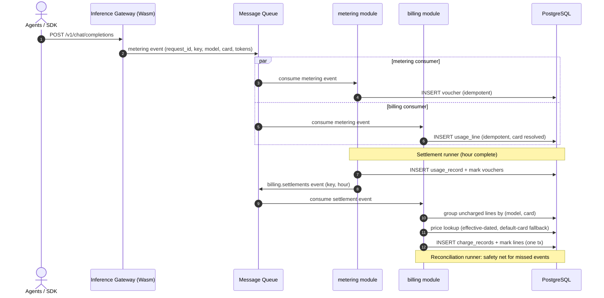
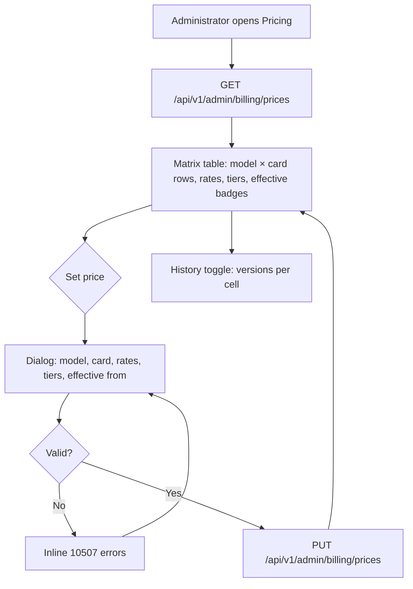

# Model × Card-Type Price Matrix & Tiered Pricing — Requirement Analysis and UI/UX Design

| Attribute | Content |
| --- | --- |
| Feature point | Model × card-type price matrix & tiered pricing |
| Document scope | Requirement analysis and UI/UX design for the `billing` module's pricing core: the price matrix (model × accelerator type) with effective dating, tiered volume pricing, the charging engine that turns settled usage into amounts, charge/bill queries, the console Pricing and Bills pages, and acceptance criteria |
| Owning modules | `billing` (price matrix, usage-line ingestion, charging engine, charges and bills), with `metering` (additive event-contract extension) and `infer` (service card-type lookup) |
| Related documents | [Architecture Design](./architecture.md) — Section 2.6 `billing`, Section 4.3 the metering/settlement sequence · [Token Metering Vouchers & Async Settlement](./metering.md) — the upstream usage pipeline and the `billing.settlements` contract (its D6) · [Model Catalog & One-Click Deployment](./model-catalog-deployment.md) — the model identity dimension of the matrix |
| Status | Design complete, handed to the Architect agent |

---

## 1. Background and Competitive Research

### 1.1 Why Pricing Comes Now

Features #1–#4 shipped the platform's accounting spine up to the pricing boundary: API Keys identify callers, models deploy one-click on curated images, and every inference request now leaves a tamper-evident metering voucher that settles hourly into usage records and emits `billing.settlements` events. But the platform still cannot answer "what does it cost": `BillingService.SetPrice`/`ListPrices` answer "not implemented", no price exists anywhere, and the settlement events are consumed by no one. This feature point closes the loop: it builds the model × card-type price matrix the README promises, applies it to settled usage to produce charge records and monthly bills, and exposes both to operators in the console. Balance/quota enforcement (holds, insufficient funds) stays out of scope and lands with feature #8.

### 1.2 How Comparable Products Price Token Usage

| Product | Price model | Card/hardware dimension | Tiered / volume pricing | Effective dating | Notable pitfalls |
| --- | --- | --- | --- | --- | --- |
| **OpenAI Platform** | Per-model input/output rates per 1M tokens; cache-hit input discounted | None (single fleet) | None public (enterprise negotiated) | Price changes announced with effective dates; the pricing page shows current only | Historical prices vanish from the page after a change, breaking old-bill reconciliation |
| **SiliconFlow** | Per-model in/out rates per 1M tokens, CNY; cached tokens at a distinct lower rate | None | Occasional promotional tiers | Changes silently replace the page | No price history; currency implicit |
| **AWS Bedrock** | Per model × region; on-demand per 1M tokens, or provisioned throughput | Region as the closest analogue to a hardware dimension | Provisioned capacity vs on-demand (a packaging, not volume tiers) | Per-model price pages versioned by AWS billing periods | The model × region matrix is hard to scan; no single matrix view |
| **DeepSeek Platform** | Simple published in/out/cache-hit rates per 1M tokens | None | None | Off-peak discounts as a time dimension | Only one currency, no scheduling |
| **Together AI** | Per-model in/out rates; dedicated endpoints priced separately | Dedicated vs serverless as the hardware analogue | Serverless flat; dedicated is packaged capacity | Standard | Two pricing systems (serverless/dedicated) confuse the unit cost comparison |
| **Anthropic Console** | Per-model input/output per 1M tokens; cache writes 1.25×, cache reads 0.1×; batch 50% | None | None (batch discount is a mode, not a tier) | Price changes announced with dates | The five-way rate structure (in/out/cache-write/cache-read/batch) is hard to reason about without a calculator |

### 1.3 Distilled Patterns and Decisions

Common industry patterns worth adopting:

1. **Per-million-token rates with separate input/output prices** — every surveyed platform quotes "per 1M tokens" with distinct input and output rates. It is the convention agents' cost estimators already assume.
2. **Cache-hit tokens are priced separately** — Anthropic (0.1×) and DeepSeek show cache reads as a distinct, cheaper rate. Feature #4's vouchers already count `cached_tokens` separately, so the rate can be applied without schema change.
3. **Prices are effective-dated** — OpenAI and Anthropic announce changes with effective dates; the old price keeps governing old usage. Without effective dating, a price edit silently rewrites history's meaning.
4. **The hardware dimension is real where heterogeneous accelerators exist** — Bedrock's per-region pricing and Together's serverless/dedicated split exist because the same model costs differently to serve on different infrastructure. go-taas's README promises exactly this: a model × card-type matrix.
5. **The price page is a scannable matrix** — competitors render one row per model with in/out rates. A matrix the operator can scan in one screen is the acceptance bar.

Pitfalls to avoid:

- **No price history** (SiliconFlow) — a disputed bill becomes unverifiable once the page changes. Price versions are rows, kept forever.
- **Unit ambiguity** — per-1K vs per-1M confusion is the classic estimator bug. The unit is fixed platform-wide: per 1M tokens, everywhere, labeled.
- **Unpriced usage silently dropped** — if a model has no price entry, usage on it must surface as an unpriced charge (amount 0, flagged), never disappear.
- **Pricing coupled to settlement** — a missing price must never block or roll back metering settlement (feature #4's pipeline stays independent); charging is downstream and tolerant.
- **Mid-period rate flips without effective dates** — a price change must apply from a defined instant, and charges already computed keep their amounts (no retroactive repricing in v1).

**Decisions for go-taas** (recorded rationale, per the autonomous-decision rule):

| # | Decision | Rationale |
| --- | --- | --- |
| D1 | The price matrix is keyed by **`(model_id, accelerator_type)`** with **effective-dated versions**: each `SetPrice` writes a new `price_entries` row (unique on `(model_id, accelerator_type, effective_from)`); the price applicable at time *t* is the entry with the greatest `effective_from ≤ t`; `effective_from` defaults to now, so repeated same-day edits update today's entry | The README's model × card-type promise; versioned rows give price history for audit (the OpenAI pitfall) and allow scheduled future prices without a scheduler |
| D2 | Rates are **per 1M tokens, input and output separate**, plus a flat **cache-hit rate** (default 0 — cache hits free until priced). The charge formula is fixed: `amount = prompt×in + completion×out + reasoning×out + cached×cache`, all ÷ 1M. Reasoning tokens are generated tokens and price at the output rate | The universal industry convention; feature #4's four token counters map onto it without schema change; the default-0 cache rate matches promotional norms and stays operator-configurable |
| D3 | **Tiered pricing** is a per-entry ordered list of tiers `{up_to_tokens, input_rate, output_rate}` where `up_to_tokens` is the organization's cumulative monthly token volume (all four kinds summed) per `(model_id, accelerator_type)`; the tier is selected by the month-to-date volume **before** the charge being computed (no mid-record splitting); the last tier has `up_to_tokens = 0` meaning unbounded; an empty tier list is a flat rate | The README's tiered-pricing promise with the simplest deterministic, testable semantics; mid-record splitting is a true-up concern deferred to a future billing refinement |
| D4 | **One platform currency**, from config (`billing.currency`, default `USD`); `SetPrice` accepts an empty currency (inherits config) or the exact config value — anything else is rejected; charge records and bills carry it | No FX conversion in v1; config is the single source of truth, avoiding a first-entry-wins matrix lock |
| D5 | The `billing` module **consumes `metering.events` directly** (per architecture §2.6) into its own per-request `usage_lines` (idempotent by `request_id`), because the `billing.settlements` events aggregate per `(api_key, hour)` and carry no model/card breakdown — which the price matrix requires. The RPC `IngestMeteringEvent` remains a metering-test path and does not reach billing; production (gateway → MQ) always does | Billing needs `(model, card)` granularity the settlement event lacks; duplicating the consumer is the standard topological fix and keeps feature #4's shipped schema and contract untouched |
| D6 | The **accelerator type of a request** resolves at ingestion by chain: the event's own `accelerator_type` field (new, additive — metering proto field 8 and the MQ payload) → the `service_id` lookup into the `infer` services table (read-only) → the sentinel **`default`**. Price lookup falls back the same way: `(model, card)` → `(model, "default")` → unpriced | The gateway knows the card it routed to; the service lookup covers emitters that omit it; `default` gives operators a per-model catch-all price so unpriced usage is a choice, not an accident |
| D7 | **Charging is triggered by the `billing.settlements` consumer** (the feature-04 D6 contract: an event means "this key-hour is settled and final") **plus a reconciliation runner** (same eligibility rule as metering: complete hours, `hour + 1h + grace`) as the crash/straggler safety net; both share one `PriceOnce(key, hour)` path; idempotency rests on the unique index `(api_key_id, model_id, accelerator_type, period_start)` of `charge_records` | The event gives timely charges; the runner guarantees convergence — together they mirror metering's own consumer+runner pattern, and neither can double-charge |
| D8 | A bucket with **no applicable price** produces a charge record with `amount = 0` and `priced = false` (surfaced in the console), never an error, and never blocks anything upstream | Missing prices are an operator gap to surface, not a pipeline fault; settlement independence is preserved both directions |
| D9 | **Bills are computed, not stored**: `ListBills` aggregates `charge_records` by `(organization, calendar month)` on read; `bill_id` is deterministic (`{org}-{YYYYMM}`); balance, quota, holds and payments are feature #8 | Charge records are the durable evidence; a monthly view over them is cheap and always consistent; account modes need their own design |
| D10 | New error codes: **10507 `CodePriceInvalid`** (negative rates, empty model/card, malformed tiers, currency mismatch) and **10508 `CodeBillingRangeInvalid`** (`since > until` or range > 366 days on billing queries); the reserved 10502–10506 stay for feature #8 | The 105xx block is billing's; validation vs range vs future funds errors stay distinct, mirroring the metering D9 pattern |
| D11 | Console gains a **Pricing page** (`/admin/pricing`): the matrix table (model, card, in/out/cache rates, tier summary, effective from, currency), a set-price dialog (model dropdown from the catalog, card input with suggestions, rates, tiers editor, effective date), and a history toggle; and a **Bills page** (`/admin/billing`): monthly bill summaries with a charge-record drill-down (per key/model/card rows, amounts, priced badge). Both are admin-surface, org-scoped like Usage | The scannable matrix is the industry acceptance bar (pattern 5); bills close the loop from prices to money; the page split keeps pricing (write-heavy) apart from bills (read-only) |
| D12 | **Packages/bundles are deferred** (they entangle with #8's balance), as are price deletion/matrix reset and usage-line retention (open items) | Tiered pricing covers volume discounts; the rest is scope discipline |

### 1.4 Scope Boundary

#### 1.4.1 Feeless exact-settlement leg (issue #7) — additive

Beside the prepaid-balance and quota (postpaid) account modes (feature
#8), the platform may settle a metered key-hour directly on a **feeless
exact-settlement rail (Nano / XNO)**. This leg does not replace charging:
the existing `billing.settlements` consumer continues to price the hour
through `PriceOnce` into `charge_records`; a separate, purely additive
Nano consumer reads the *same* settlement events, resolves the priced
amount for the key-hour, and settles it at **raw precision (30
decimals)** — so a sub-cent charge (e.g. $0.0005 for a cheap cached
completion) is represented and settled exactly, removing the card
fee-floor the platform would otherwise batch or write off.

Contract decisions (issue #7, confirmed by the maintainer):

| # | Decision | Rationale |
| --- | --- | --- |
| N1 | The Nano leg is an **additional settlement consumer** on `billing.settlements`, additive to the existing consumer; it never modifies metering, the price matrix, the balance layer or the `charge_records` shape | A new settlement consumer alongside the planned account modes, wired behind the existing async settlement contract — no change to the voucher/usage pipeline (pricing.md D7) |
| N2 | The amount is **constructed at the boundary** from the priced charge value, converted to an exact XNO raw integer (`10^30 raw = 1 XNO`) with no second rounding; the USD→XNO rate is a config constant at the boundary | Maintains a single internal representation end-to-end and expresses a $0.0005 call exactly (30 decimals) |
| N3 | The raw amount is handed to a feeless Nano node as a decimal string; a live node submit is a follow-on once the consumer shape is agreed | Keeps the draft reviewable: the exact-amount boundary and its tests ship first, the RPC wiring lands after |
| N4 | An unpriced key-hour (no matrix entry, D8) settles nothing | Mirrors `priced = false` / `amount = 0`: an operator gap to surface, never a pipeline fault |

The settlement semantics: idempotency and error handling are inherited
from the `billing.settlements` contract (malformed events skipped,
transient failures retried by the broker, a redelivered event is a
no-op) — the Nano consumer registers as a settlement consumer and does
not reimplement charging or idempotency.

**In scope**: price matrix CRUD with effective dating and tier validation (`SetPrice`/`ListPrices`), the metering-events consumer building per-request `usage_lines` with the accelerator-type resolution chain, the charging engine (settlements consumer + reconciliation runner, shared `PriceOnce`, tier evaluation, default-card fallback, unpriced flagging), charge and bill queries (`ListCharges`, `ListBills`), the additive `accelerator_type` field on the metering event contract, the console Pricing and Bills pages, and the `billing` config section.

**Out of scope** (tracked elsewhere): balance/quota account modes, funds holds, and insufficient-funds rejection (#8), payments, invoices and receipts (future, after #8), end-user (tenant) bill visibility (#6/#7), FX/multi-currency (future), packages/bundles (future, D12), mid-record tier splitting and period-end true-up (future refinement of D3), retroactive repricing of charged records (never in v1), and the Envoy Wasm plugin that emits real gateway events (separate data-plane track; verification uses synthetic events).

---

## 2. User Roles

| Role | Description | Interaction with pricing |
| --- | --- | --- |
| **Platform administrator** | The operator who runs the go-taas cluster; today this is also the console user | Sets and schedules prices in the matrix, monitors unpriced usage, reviews charges and monthly bills |
| **Organization administrator (future)** | A tenant-side administrator consuming the platform | Will see their organization's bills and charges (same pages, scoped by tenancy, #6) |
| **Billing pipeline (this feature)** | The internal consumer chain | Consumes `metering.events` into usage lines, consumes `billing.settlements` as the charge trigger, writes charge records |
| **Auditor** | Whoever resolves a pricing or bill dispute | Traces a bill → charge records → the price entry version (with its tier) that produced each amount |
| **Agent / SDK** | The programmatic consumer whose calls generate usage | Never touches pricing APIs; their usage is priced by the matrix |

> Terminology: the consumer-side caller is called an **Agent** (English) / 「智能体」(Chinese), consistent with the repo convention.

---

## 3. User Stories

| # | As a… | I want to… | So that… |
| --- | --- | --- | --- |
| US1 | Platform administrator | set input, output and cache-hit rates per model and card type in one matrix | pricing reflects that the same model costs differently on different hardware |
| US2 | Platform administrator | schedule a price change with an effective date | old usage keeps the old price and the change applies cleanly from the chosen instant |
| US3 | Platform administrator | configure volume tiers (e.g. beyond 1B tokens/month the rate drops) | heavy consumers get a fair deal and I can shape demand |
| US4 | Platform administrator | see which usage went unpriced (no matrix entry) | I can close pricing gaps instead of losing revenue silently |
| US5 | Platform administrator | review monthly bills per organization with a drill-down to per-key, per-model, per-card charges | I can answer "what did this org spend and on what" without a database console |
| US6 | Platform administrator | see the price history of a matrix cell | a disputed old bill can be reconciled against the price that was actually in effect |
| US7 | Auditor | trace any charge to the exact price entry version and tier that produced it | amounts are verifiable, not just asserted |
| US8 | Agent / SDK | have my cache-hit tokens billed cheaper than fresh input tokens | my costs reward efficient prompt caching |
| US9 | Billing pipeline | receive settlement events and price the hour without ever blocking metering | accounting faults never take down metering or inference |
| US10 | Platform administrator | have charging survive crashes and redeliveries without double-charging | bills are trustworthy by construction |

---

## 4. Functional Requirements

### FR1 — Price matrix management

- **FR1.1** `SetPrice` (`PUT /api/v1/admin/billing/prices`) upserts one price entry version: `model_id`, `accelerator_type`, `input_price_per_million`, `output_price_per_million`, optional `cached_price_per_million` (default 0), optional `effective_from` (unix seconds; 0/absent = now), optional `currency` (empty = config currency), optional `tiers`. An existing entry with the same `(model_id, accelerator_type, effective_from)` is updated in place; otherwise a new version is inserted.
- **FR1.2** Validation (violation → 10507, nothing written): `model_id` and `accelerator_type` non-empty; all rates ≥ 0; `currency` (when non-empty) equals the config currency; tiers — when present — strictly ascending by `up_to_tokens` (> 0), every tier's rates ≥ 0, and exactly the last tier with `up_to_tokens = 0` (unbounded).
- **FR1.3** Entries are immutable once written except via `SetPrice` on the same `(model, card, effective_from)` key; there is no delete in v1 (D12).

### FR2 — Price queries

- **FR2.1** `ListPrices` (`GET /api/v1/admin/billing/prices`) returns the matrix view: for each `(model_id, accelerator_type)`, the entry with the greatest `effective_from ≤ now` (the *current* price), plus any future entries (`effective_from > now`, shown as scheduled), paginated (default 20, cap 100), ordered by model then card.
- **FR2.2** Filters: `model_id`, `accelerator_type` (both optional, exact match). `include_history=true` returns every version (current, scheduled, and superseded) — the audit view.
- **FR2.3** Each returned `PriceEntry` carries `price_id`, the full rates, tier list, `currency`, `effective_from`, and `updated_at`.

### FR3 — Billable usage ingestion

- **FR3.1** The `billing` module runs an MQ consumer on `metering.events` (its own subscription; metering's consumer is unaffected). Each event writes one `usage_lines` row: `line_id` (UUID v4), `request_id` (unique index), `organization_id`, `api_key_id`, `model_id`, `service_id` (nullable), `accelerator_type` (resolved per D6), the four token counts, `completed_at`, `charged_charge_id` (nullable).
- **FR3.2** Ingestion is **idempotent by `request_id`**: a duplicate is acknowledged, not re-written (the voucher pipeline's proven pattern).
- **FR3.3** Malformed events (missing `request_id`/`api_key_id`/`model_id`, negative tokens) are rejected permanently — logged and skipped, mirroring the metering consumer's policy; transient DB failures return for broker retry.
- **FR3.4** The metering event contract gains an optional `accelerator_type` string (proto field 8 on `IngestMeteringEventRequest`, mirrored in the MQ payload) — additive only; the metering voucher schema is unchanged.

### FR4 — Charging engine

- **FR4.1** A consumer on `billing.settlements` treats each event as the charge trigger for its `(api_key_id, period)`; a reconciliation runner (configurable interval, default 60 s) re-scans for uncharged lines in **complete hours** (`now ≥ hour_start + 1h + grace`, grace default 5 m — the same eligibility rule as metering settlement). Both paths share one `PriceOnce(key, hour)` implementation.
- **FR4.2** `PriceOnce` groups the key's uncharged lines of the hour by `(model_id, accelerator_type)`, sums the four token counts and request count per group, and writes one `charge_records` row per group: `charge_id` (UUID v4), org/key/model/card ids, `period_start`/`period_end`, token sums, `request_count`, `amount`, `currency`, `price_id` (nullable), `tier_index` (−1 flat), `priced`, `month_to_date_tokens` (the org's cumulative monthly volume for this model × card **before** this charge), `charged_at` — and marks the contributing lines with `charged_charge_id`, in one transaction.
- **FR4.3** Price lookup at charge time: the entry for `(model, card)` with the greatest `effective_from ≤ period_start`; if none, the same for `(model, "default")`; if still none, `priced = false`, `amount = 0` (D8).
- **FR4.4** Amount per D2's formula; tier per D3 (volume = sum of the four token kinds, month-to-date from prior charge records of the same `(org, model, card)` in the same calendar month, UTC).
- **FR4.5** Charging is **idempotent and crash-safe**: the unique index `(api_key_id, model_id, accelerator_type, period_start)` makes duplicate charge records impossible; a crashed pass re-scans uncharged lines and converges; a redelivered settlement event is a no-op.
- **FR4.6** The consumers and runner are disabled when MQ or DB components are unavailable (the established runner pattern); charging failures are logged and retried on the next pass — they never propagate upstream.

### FR5 — Charges and bills queries

- **FR5.1** `ListCharges` (`GET /api/v1/admin/billing/charges`) returns charge records filtered by `api_key_id`, `model_id`, and time range (`since`/`until`), paginated (default 20, cap 100), newest period first, each row carrying the full token sums, amount, currency, `priced` flag, and tier index.
- **FR5.2** `ListBills` (`GET /api/v1/admin/billing/bills`) returns monthly bill summaries per organization: `bill_id` (`{org}-{YYYYMM}`), `organization_id`, summed `amount`, `currency`, `period_start`/`period_end` (calendar month, UTC), filtered by `organization_id` and time range, paginated newest month first — computed from charge records on read (D9).
- **FR5.3** Both queries require the `X-Organization-Id` header and scope to it (the transitional identity model, consistent with Usage); a time range with `since > until` or spanning > 366 days returns 10508.
- **FR5.4** `GetBalance` remains a stub returning 10503 — the account modes are feature #8's contract.

### FR6 — Console Pricing and Bills pages

- **FR6.1** A "Pricing" nav item (`/admin/pricing`) opens the matrix: one row per `(model, card)` — model name, card type, input/output/cache rates (per 1M, currency-labeled), tier summary (e.g. "2 tiers · from 1B"), effective-from badge (current vs scheduled), updated time; a "Set price" button opens the dialog.
- **FR6.2** The set-price dialog: model dropdown (from the model catalog), card-type input with suggestions from existing entries and known service card types, the three rates, tiers editor (rows of `up_to_tokens` + in/out rates, with an "unbounded" last row), effective-from datetime (default now), currency shown read-only from config; validation errors (10507) surface inline.
- **FR6.3** A history toggle on the matrix expands a cell's versions (effective from, rates, tiers, updated) — the audit view of FR2.2.
- **FR6.4** A "Bills" nav item (`/admin/billing`) shows the monthly bill table (month, amount, currency) for the current organization, with a drill-down dialog of the month's charge records (per key/model/card rows: tokens, requests, amount, priced badge; unpriced rows highlighted).
- **FR6.5** Both pages show empty states ("No prices yet — set the first matrix entry", "No bills in this range") and refresh on a 60-second poll while visible.

---

## 5. Page and Flow Design

### 5.1 Page Map

| Page / component | Purpose |
| --- | --- |
| **Pricing page** (`/admin/pricing`) | The price matrix, set-price dialog, history toggle |
| **Set-price dialog** | Create/update one matrix cell version |
| **Bills page** (`/admin/billing`) | Monthly bill summaries, charge drill-down |
| **Charge drill-down dialog** | One month's charge records per key/model/card |
| **Usage page** (existing) | Unchanged; cost columns arrive after #8 links balances |

### 5.2 Pricing and Charging Sequence

### 5.3 Pricing Page Flow

---

## 6. API Surface Implications

All APIs belong to **`taas.billing.v1.BillingService`** (proto: `proto/taas/billing/v1/billing.proto`), served as HTTP via the Control Gateway. Two RPCs exist as stubs and are implemented; one is added; one stays a stub for #8. Proto changes are additive only.

| RPC | HTTP | Status | Purpose | Notes |
| --- | --- | --- | --- | --- |
| `SetPrice` | `PUT /api/v1/admin/billing/prices` | stub → implemented | Upsert one matrix cell version | Gains `cached_price_per_million`, `effective_from`, `tiers`; validation per FR1.2 |
| `ListPrices` | `GET /api/v1/admin/billing/prices` | stub → implemented | Matrix view / history | Gains `accelerator_type` filter and `include_history`; `PriceEntry` gains `price_id`, cache rate, `effective_from`, `tiers` |
| `ListCharges` | `GET /api/v1/admin/billing/charges` | **new** | Charge-record drill-down | Filters: `api_key_id`, `model_id`, `since`/`until`; org-scoped |
| `ListBills` | `GET /api/v1/admin/billing/bills` | stub → implemented | Monthly bill summaries | Computed from charge records (D9); org filter + range |
| `GetBalance` | `GET /api/v1/admin/billing/balance` | stays stub | Account modes | Feature #8; returns 10503 |

Constraints on the contract:

1. `SetPrice` validates per FR1.2 and returns the stored entry's `price_id`; repeated calls with the same `(model, card, effective_from)` update in place (idempotent console saves).
2. `PriceTier` message: `up_to_tokens` (int64, cumulative monthly tokens; 0 = unbounded, last tier only), `input_price_per_million`, `output_price_per_million` — cache rate is flat on the entry, not per tier (D2).
3. `ChargeRecordSummary` carries: `charge_id`, `api_key_id`, `model_id`, `accelerator_type`, `period_start`/`period_end`, the four token sums, `request_count`, `amount`, `currency`, `priced`, `tier_index` — the dispute-resolution view without a second call.
4. Time-range parameters are unix seconds; `since > until` or a range > 366 days returns 10508; defaults are `until = now`, `since = start of the current month` (bills) / `until - 24h` (charges).
5. Wire-format conventions are unchanged: dotted pagination, HTTP 200 on success, business errors as `{"code": <int>, "message": "..."}`; int64 fields serialize as JSON strings.
6. The metering event payload on `metering.events` gains an optional `accelerator_type` string — additive, versioned by adding fields only (the established rule); the `billing.settlements` payload is **unchanged**.

Error codes (billing range 10501–10599, `pkg/errors/codes.go`):

| Condition | Code | Constant | Notes |
| --- | --- | --- | --- |
| Price entry not found (reserved for direct lookups) | 10501 | `CodePriceNotFound` | Existing; not raised by v1 APIs |
| Insufficient funds / account / bill / settlement / hold failures | 10502–10506 | existing | Reserved for feature #8 |
| Malformed price (negative rates, empty ids, bad tiers, currency mismatch) | 10507 | `CodePriceInvalid` | **New** (D10) |
| Malformed time range on billing queries | 10508 | `CodeBillingRangeInvalid` | **New** (D10) |
| Database / MQ infrastructure failure | 500 | `CodeInternal` | Via error normalization |

---

## 7. Acceptance Criteria

| # | Criterion | Verification |
| --- | --- | --- |
| AC1 | `SetPrice` stores a matrix cell version and `ListPrices` returns it as current with the full rates, tiers, currency, and effective-from; a repeated call with the same `(model, card, effective_from)` updates in place (one row, new `updated_at`) | Unit + E2E |
| AC2 | `SetPrice` with a negative rate, empty model/card, non-ascending tiers, a missing unbounded last tier, or a currency ≠ config returns 10507 and writes nothing | Unit + E2E |
| AC3 | Two versions of one cell with different `effective_from`: the lookup at a time between them returns the earlier; after the later's effective time, the later | Unit |
| AC4 | The `metering.events` consumer writes one usage line per event with the D6-resolved accelerator type; a duplicate `request_id` writes no second line | Unit |
| AC5 | Accelererator-type resolution: event field wins; absent → `service_id` lookup into infer services; unresolvable → `default` | Unit |
| AC6 | A settlement event for `(key, hour)` produces one charge record per `(model, card)` group of that key-hour, with correctly summed tokens, request count, and the D2 amount; contributing lines are marked | Unit + FVT |
| AC7 | The amount formula holds exactly: `prompt×in + completion×out + reasoning×out + cached×cache`, ÷ 1M, rounded to 2 decimal places | Unit |
| AC8 | Tiers select by the org's month-to-date volume for `(model, card)`: the first charge of a month uses tier 1; after crossing `up_to_tokens`, subsequent charges use the next tier; flat entries ignore volume | Unit |
| AC9 | A group with no `(model, card)` price but a `(model, "default")` price charges at the default; with neither, the charge record is `priced = false`, `amount = 0`, and settlement is unaffected | Unit |
| AC10 | Charging is idempotent: a redelivered settlement event and a reconciliation-runner pass over already-charged hours write no duplicate charge records (unique index) and leave amounts unchanged | Unit |
| AC11 | The reconciliation runner prices uncharged lines in complete hours without any settlement event (the crash-recovery path) | Unit |
| AC12 | `ListCharges` returns org-scoped, filtered, paginated charge records newest-first; `ListBills` returns per-month sums with deterministic `bill_id`s; `since > until` or range > 366 days returns 10508 | FVT |
| AC13 | Full pipeline FVT: synthetic metering events (with card types) → metering settlement → `billing.settlements` → charge records with expected amounts → bills reflecting them | FVT |
| AC14 | The Pricing page renders the matrix (rates per 1M with currency, tier summary, effective badges), the set-price dialog creates an entry that appears on reload, and 10507 validation errors surface inline | E2E |
| AC15 | The Bills page renders monthly summaries with the charge drill-down (tokens, requests, amounts, priced badge, unpriced highlight) and the empty state | E2E |
| AC16 | Billing queries scope to the `X-Organization-Id` header: one org's queries never return another org's charges or bills | FVT |

---

## 8. Open Items Deferred

| Item | Deferred to |
| --- | --- |
| Balance (prepaid) and quota (postpaid) account modes; funds holds; insufficient-funds rejection | Feature #8 |
| Payments, invoices, receipts, and dunning | Future (after #8) |
| Packages/bundles (prepaid token packs) | Future (entangles with #8 balances) |
| Price deletion / matrix reset (operator tooling) | Future console enhancement |
| Usage-line retention (mirroring voucher retention) | Future operations hardening |
| Mid-record tier splitting and period-end true-up | Future refinement of D3 |
| Retroactive repricing of charged records | Not in v1 (charges are immutable evidence) |
| Multi-currency and FX | Future |
| End-user (tenant) bill visibility and per-tenant scoping | Features #6/#7 |
