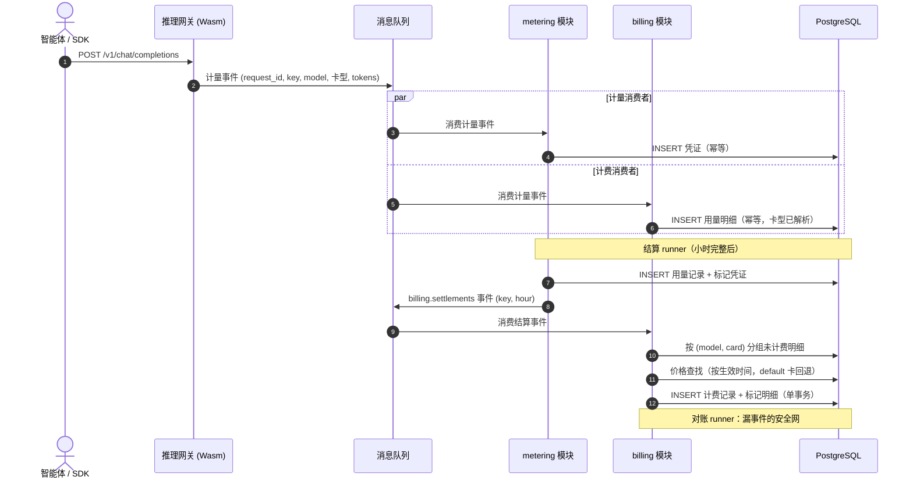
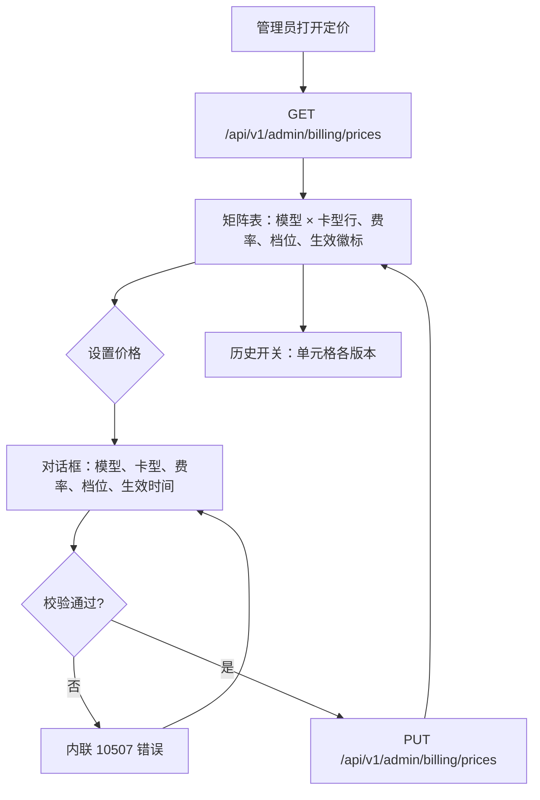

# 模型 × 卡型价格矩阵与阶梯定价 — 需求分析与 UI/UX 设计

| 属性 | 内容 |
| --- | --- |
| 特性点 | 模型 × 卡型价格矩阵与阶梯定价 |
| 文档范围 | `billing` 模块定价核心的需求分析与 UI/UX 设计：模型 × 加速卡型价格矩阵（含生效时间版本）、阶梯定价、将已结算用量转换为金额的计费引擎、账单/计费记录查询、控制台「定价」与「账单」页面，以及验收标准 |
| 归属模块 | `billing`（价格矩阵、用量明细摄取、计费引擎、计费记录与账单），配合 `metering`（事件契约的增量扩展）与 `infer`（服务卡型查询） |
| 相关文档 | [架构设计](./architecture.zh-cn.md) — 第 2.6 节 `billing`、第 4.3 节计量/结算时序 · [Token 计量凭证与异步结算](./metering.zh-cn.md) — 上游用量管道与 `billing.settlements` 契约（其 D6） · [模型目录与一键部署](./model-catalog-deployment.zh-cn.md) — 价格矩阵的模型维度 |
| 状态 | 设计完成，已移交架构师代理 |

---

## 1. 背景与竞品调研

### 1.1 为什么现在做定价

特性 #1–#4 已经把平台的账务主干铺到了定价边界：API Key 标识调用方，模型在精选镜像上一键部署，每次推理请求都会留下防篡改的计量凭证，按小时结算为用量记录并向 `billing.settlements` 发布事件。但平台仍然回答不了「这要花多少钱」：`BillingService.SetPrice`/`ListPrices` 返回"未实现"，任何地方都不存在价格，结算事件也无人消费。本特性点补上闭环：建立 README 承诺的模型 × 卡型价格矩阵，将其应用于已结算用量以产出计费记录和月度账单，并在控制台向运营者开放。余额/配额的准入管控（冻结、余额不足拒绝）不在本特性范围，由特性 #8 落地。

### 1.2 竞品的 Token 定价方式

| 产品 | 价格模型 | 卡型/硬件维度 | 阶梯/批量定价 | 生效时间 | 主要陷阱 |
| --- | --- | --- | --- | --- | --- |
| **OpenAI Platform** | 按模型区分输入/输出单价（每 1M tokens）；缓存命中输入打折 | 无（单一算力池） | 无公开（企业可谈） | 调价公告带生效日期；价格页只显示当前价 | 调价后历史价格从页面消失，旧账单无法对账 |
| **SiliconFlow** | 按模型区分输入/输出单价（每 1M tokens，人民币）；缓存命中 tokens 单独更低价格 | 无 | 偶发的促销阶梯 | 变更直接替换页面 | 无价格历史；币种隐含 |
| **AWS Bedrock** | 按模型 × 区域；按需每 1M tokens，或预留吞吐 | 区域是最接近硬件维度的概念 | 预留容量 vs 按需（是打包而非用量阶梯） | 按计费周期版本化的模型价格页 | 模型 × 区域矩阵难以通览；没有单一矩阵视图 |
| **DeepSeek 平台** | 简单公布的输入/输出/缓存命中单价（每 1M tokens） | 无 | 无 | 以时段维度做错峰折扣 | 仅一种币种，无排期机制 |
| **Together AI** | 按模型区分输入/输出单价；专属端点单独定价 | 专属 vs Serverless 是硬件类比 | Serverless 平价；专属是打包容量 | 常规 | Serverless/专属两套定价体系让单位成本难以比较 |
| **Anthropic Console** | 按模型区分输入/输出单价（每 1M tokens）；缓存写 1.25×、缓存读 0.1×；批量 50% | 无 | 无（批量折扣是模式而非阶梯） | 调价公告带日期 | 五种费率结构（输入/输出/缓存写/缓存读/批量）离开计算器很难心算 |

### 1.3 提炼出的模式与决策

值得采纳的行业通用模式：

1. **每 1M tokens 单价、输入/输出分开** — 所有调研平台都以「每 1M tokens」报价并区分输入与输出单价。这是智能体成本估算器已经默认的惯例。
2. **缓存命中 tokens 单独定价** — Anthropic（0.1×）与 DeepSeek 都把缓存读作为独立的更低费率。特性 #4 的凭证已经单独统计 `cached_tokens`，费率可直接套用，无需改表。
3. **价格带生效时间** — OpenAI 与 Anthropic 的调价都带生效日期；旧价格继续约束旧用量。没有生效时间，一次改价会悄悄改写历史的含义。
4. **异构加速卡场景下硬件维度是真实存在的** — Bedrock 的分区域定价与 Together 的 Serverless/专属之分，源于同一模型在不同基础设施上的服务成本不同。go-taas 的 README 承诺的正是这一点：模型 × 卡型矩阵。
5. **价格页是可通览的矩阵** — 竞品都渲染为每模型一行、含输入/输出单价。运营者一屏扫完是验收底线。

需要避免的陷阱：

- **无价格历史**（SiliconFlow）— 页面一改，争议账单就无法验证。价格版本是永久保留的行。
- **单位歧义** — 每 1K 与每 1M 的混淆是经典的估算器 bug。全平台固定单位：每 1M tokens，处处标注。
- **未定价用量被悄悄丢弃** — 若模型没有价格条目，其用量必须以「未定价计费记录」（金额 0、带标记）浮出水面，绝不能消失。
- **定价与结算耦合** — 缺价格绝不能阻塞或回滚计量结算（特性 #4 的管道保持独立）；计费在下游且必须容错。
- **无生效时间的中周期换价** — 价格变更必须从确定的时刻生效，已计算的计费记录金额保持不变（v1 不做追溯重定价）。

**go-taas 的决策**（按自主决策规则记录依据）：

| # | 决策 | 依据 |
| --- | --- | --- |
| D1 | 价格矩阵以 **`(model_id, accelerator_type)`** 为键，**按生效时间版本化**：每次 `SetPrice` 写入一条新的 `price_entries` 行（`(model_id, accelerator_type, effective_from)` 唯一）；时刻 *t* 适用的是 `effective_from ≤ t` 中最大者；`effective_from` 缺省为当前时间，同日重复编辑更新当日条目 | README 的模型 × 卡型承诺；版本化行提供可审计的价格历史（OpenAI 陷阱），并支持排期未来价格而无需调度器 |
| D2 | 费率为**每 1M tokens、输入与输出分开**，外加固定的**缓存命中费率**（默认 0 — 未定价前缓存命中免费）。计费公式固定：`金额 = prompt×输入 + completion×输出 + reasoning×输出 + cached×缓存`，全部 ÷ 1M。推理 tokens 属于生成 tokens，按输出费率计 | 全行业通用惯例；特性 #4 的四个 token 计数无需改表即可映射；缓存费率默认 0 符合促销惯例，且运营者可配置 |
| D3 | **阶梯定价**是每条目内的有序档位列表 `{up_to_tokens, input_rate, output_rate}`，`up_to_tokens` 为组织在 `(model_id, accelerator_type)` 上的**当月累计 token 量**（四类求和）；档位按计算本次计费**之前**的月初至今用量选择（不做记录内拆分）；最后一档 `up_to_tokens = 0` 表示无上限；空档位列表即平价 | README 的阶梯定价承诺，取最简单、确定性、可测试的语义；记录内拆分属于期末找平，留待未来计费细化 |
| D4 | **单一平台币种**，来自配置（`billing.currency`，默认 `USD`）；`SetPrice` 接受空币种（继承配置）或与配置完全一致的值 — 其他一律拒绝；计费记录与账单携带该币种 | v1 不做汇率换算；配置是唯一事实来源，避免「首条目锁定币种」的矩阵陷阱 |
| D5 | `billing` 模块**直接消费 `metering.events`**（架构 §2.6）写入自己的按请求 `usage_lines`（按 `request_id` 幂等），因为 `billing.settlements` 事件按 `(api_key, hour)` 聚合、不含模型/卡型明细 — 而价格矩阵需要它们。RPC `IngestMeteringEvent` 仍是计量测试路径、不进入 billing；生产路径（网关 → MQ）始终会 | 计费需要结算事件缺失的 `(model, card)` 粒度；复制消费者是标准的拓扑解法，且特性 #4 已交付的表结构与契约保持原样 |
| D6 | **请求的卡型**在摄取时按链路解析：事件自带的 `accelerator_type` 字段（新增、增量 — metering proto 字段 8 与 MQ 载荷）→ 按 `service_id` 查 `infer` 服务表（只读）→ 哨兵值 **`default`**。价格查找同样回退：`(model, card)` → `(model, "default")` → 未定价 | 网关知道自己路由到了哪张卡；服务查询覆盖省略该字段的发送方；`default` 给运营者一个按模型的兜底价格，让「未定价」成为选择而非事故 |
| D7 | **计费由 `billing.settlements` 消费者触发**（特性 #4 的 D6 契约：事件即「该 key-小时已结算且终局」）**外加对账 runner**（与计量相同的资格规则：完整小时、`小时 + 1h + 宽限期`）作为崩溃/掉队安全网；两者共享同一 `PriceOnce(key, hour)` 路径；幂等性依赖 `charge_records` 的唯一索引 `(api_key_id, model_id, accelerator_type, period_start)` | 事件带来及时计费；runner 保证最终收敛 — 两者合起来镜像计量自身的消费者+runner 模式，且谁都不会重复计费 |
| D8 | **无适用价格**的桶产出 `amount = 0`、`priced = false` 的计费记录（在控制台浮出），绝不报错，也绝不阻塞上游任何环节 | 缺价格是运营缺口，应当浮出而非管道故障；结算独立性双向保持 |
| D9 | **账单是计算出来的、不落库**：`ListBills` 读取时按 `(组织, 自然月)` 聚合 `charge_records`；`bill_id` 确定性（`{org}-{YYYYMM}`）；余额、配额、冻结与支付是特性 #8 | 计费记录是持久凭证；其上的月度视图成本低且永远一致；账户模式需要独立设计 |
| D10 | 新错误码：**10507 `CodePriceInvalid`**（负费率、空模型/卡型、畸形档位、币种不匹配）与 **10508 `CodeBillingRangeInvalid`**（计费查询 `since > until` 或跨度 > 366 天）；预留的 10502–10506 留给特性 #8 | 105xx 段属于 billing；校验/范围/未来资金类错误保持区分，镜像计量的 D9 模式 |
| D11 | 控制台新增**「定价」页**（`/admin/pricing`）：矩阵表（模型、卡型、输入/输出/缓存费率、档位摘要、生效时间、币种）、设置价格对话框（模型下拉来自目录、卡型输入带建议、费率、档位编辑器、生效日期）、历史开关；以及**「账单」页**（`/admin/billing`）：月度账单汇总与计费记录下钻（按 key/模型/卡型行、金额、计价标记）。两者均为管理面、与 Usage 相同的组织范围 | 可通览的矩阵是行业验收底线（模式 5）；账单补上从价格到钱的闭环；页面拆分让定价（写多）与账单（只读）分离 |
| D12 | **套餐/捆绑包延后**（与 #8 的余额纠缠），价格删除/矩阵重置与用量明细保留期同样延后（开放项） | 阶梯定价已覆盖用量折扣；其余是范围纪律 |

### 1.4 范围边界

#### 1.4.1 免费精确结算轨（issue #7）— 纯增量

在预付费余额与后付费配额账户模式（特性 #8）之外，平台可以将某一已计量的 key-小时在其 **免费的精确结算轨（Nano / XNO）** 上直接结算。此结算轨不会取代计费：现有的 `billing.settlements` 消费者仍通过 `PriceOnce` 将小时计价为 `charge_records`；一个独立的、纯增量的 Nano 消费者读取**同一批**结算事件，解析该 key-小时已计价的金额，并以其 **原始精度（30 位小数）** 结算——因此小于美分的费用（例如便宜的缓存补全约 $0.0005）能够被精确表示与结算，免去平台原本会合并或核销的卡片下限费用。

契约决策（issue #7，经维护者确认）：

| # | 决策 | 理由 |
| --- | --- | --- |
| N1 | Nano 轨是 `billing.settlements` 上的一个**额外结算消费者**，对现有消费者为纯增量；绝不修改计量、价格矩阵、余额层或 `charge_records` 形状 | 在计划的账户模式旁新增一个结算消费者，接入既有异步结算契约——不改动凭证/用量管线（pricing.md D7） |
| N2 | 金额在**边界处**从已计价金额构造，转换为精确的 XNO raw 整数（`10^30 raw = 1 XNO`），不再二次舍入；USD→XNO 汇率为边界配置常量 | 端到端保持单一内部表示；精确表示 $0.0005 的一次调用（30 位小数） |
| N3 | raw 金额以十进制字符串交给免费 Nano 节点；在消费者形态确认后，真实节点提交为后续工作 | 让草稿可评审：精确金额边界及其测试先行落地，RPC 接线随后 |
| N4 | 未定价的 key-小时（无矩阵条目，D8）不结算任何金额 | 镜像 `priced = false` / `amount = 0`：需要运营者补齐的缺口，而绝非管线故障 |

结算语义：幂等性与错误处理继承自 `billing.settlements` 契约（畸形事件跳过、瞬时失败由 broker 重试、重投递事件无副作用）——Nano 消费者注册为结算消费者，不重新实现计费或幂等性。

**范围内**：带生效时间与档位校验的价格矩阵 CRUD（`SetPrice`/`ListPrices`）、构建按请求 `usage_lines`（含卡型解析链）的 metering-events 消费者、计费引擎（结算事件消费者 + 对账 runner、共享 `PriceOnce`、档位评估、default 卡回退、未定价标记）、计费与账单查询（`ListCharges`、`ListBills`）、计量事件契约的增量 `accelerator_type` 字段、控制台定价与账单页面、`billing` 配置节。

**范围外**（另行跟踪）：余额/配额账户模式、资金冻结与余额不足拒绝（#8）、支付、发票与回执（未来，#8 之后）、终端用户（租户）账单可见性（#6/#7）、汇率/多币种（未来）、套餐/捆绑包（未来，D12）、记录内档位拆分与期末找平（D3 的未来细化）、已计费记录的追溯重定价（v1 永不做）、以及发送真实网关事件的 Envoy Wasm 插件（独立数据面轨道；验证使用合成事件）。

---

## 2. 用户角色

| 角色 | 描述 | 与定价的交互 |
| --- | --- | --- |
| **平台管理员** | 运营 go-taas 集群的人；今天也是控制台用户 | 在矩阵中设置与排期价格、监控未定价用量、审阅计费记录与月度账单 |
| **组织管理员（未来）** | 消费平台的租户侧管理员 | 将看到本组织的账单与计费记录（同页面，按租户范围，#6） |
| **计费管道（本特性）** | 内部消费链 | 将 `metering.events` 消费为用量明细，将 `billing.settlements` 作为计费触发器，写入计费记录 |
| **审计者** | 解决定价或账单争议的人 | 沿账单 → 计费记录 → 产出该金额的价格条目版本（含档位）逐层追溯 |
| **智能体 / SDK** | 其调用产生用量的程序化消费方 | 不接触定价 API；其用量由矩阵计价 |

> 术语：消费方调用者称为**智能体**（Agent），与仓库惯例一致。

---

## 3. 用户故事

| # | 作为… | 我想要… | 以便… |
| --- | --- | --- | --- |
| US1 | 平台管理员 | 在一个矩阵中按模型和卡型设置输入、输出与缓存命中费率 | 定价反映同一模型在不同硬件上的成本差异 |
| US2 | 平台管理员 | 带生效日期排期一次调价 | 旧用量沿用旧价，变更从选定时刻干净生效 |
| US3 | 平台管理员 | 配置用量档位（如月超 10 亿 tokens 费率下调） | 大用量消费方获得公平价格，我也能引导需求 |
| US4 | 平台管理员 | 看到哪些用量未被计价（矩阵无条目） | 我能补齐定价缺口，而不是默默损失收入 |
| US5 | 平台管理员 | 按组织审阅月度账单并下钻到按 key、模型、卡型的计费记录 | 不查数据库就能回答「这个组织花了多少钱、花在哪」 |
| US6 | 平台管理员 | 查看矩阵单元格的价格历史 | 有争议的旧账单可以对照当时实际生效的价格对账 |
| US7 | 审计者 | 把任意计费记录追溯到产出它的确切价格条目版本与档位 | 金额是可验证的，而非口头断言 |
| US8 | 智能体 / SDK | 我的缓存命中 tokens 比新输入 tokens 计费更便宜 | 我的成本奖励高效的提示词缓存 |
| US9 | 计费管道 | 收到结算事件并计价该小时，且绝不阻塞计量 | 账务故障绝不拖垮计量或推理 |
| US10 | 平台管理员 | 计费在崩溃与消息重投下都不重复不遗漏 | 账单在构造上就可信 |

---

## 4. 功能需求

### FR1 — 价格矩阵管理

- **FR1.1** `SetPrice`（`PUT /api/v1/admin/billing/prices`）按 upsert 写入一条价格条目版本：`model_id`、`accelerator_type`、`input_price_per_million`、`output_price_per_million`、可选 `cached_price_per_million`（默认 0）、可选 `effective_from`（unix 秒；0/缺省 = 当前时间）、可选 `currency`（空 = 配置币种）、可选 `tiers`。已存在相同 `(model_id, accelerator_type, effective_from)` 的条目则原位更新；否则插入新版本。
- **FR1.2** 校验（违规 → 10507，不写入任何内容）：`model_id` 与 `accelerator_type` 非空；所有费率 ≥ 0；`currency`（非空时）等于配置币种；档位 — 存在时 — 按 `up_to_tokens`（> 0）严格递增、每档费率 ≥ 0、且最后一档恰为 `up_to_tokens = 0`（无上限）。
- **FR1.3** 条目一经写入即不可变，唯一例外是对相同 `(model, card, effective_from)` 键的 `SetPrice` 原位更新；v1 无删除（D12）。

### FR2 — 价格查询

- **FR2.1** `ListPrices`（`GET /api/v1/admin/billing/prices`）返回矩阵视图：每个 `(model_id, accelerator_type)` 取 `effective_from ≤ now` 中最大者（*当前*价格），外加未来条目（`effective_from > now`，标记为已排期），分页（默认 20，上限 100），按模型、卡型排序。
- **FR2.2** 过滤：`model_id`、`accelerator_type`（均可选，精确匹配）。`include_history=true` 返回全部版本（当前、已排期、已替代）— FR2.2 的审计视图。
- **FR2.3** 每个返回的 `PriceEntry` 携带 `price_id`、完整费率、档位列表、`currency`、`effective_from`、`updated_at`。

### FR3 — 可计费用量摄取

- **FR3.1** `billing` 模块在 `metering.events` 上运行自己的 MQ 消费者（独立订阅；计量的消费者不受影响）。每个事件写入一条 `usage_lines` 行：`line_id`（UUID v4）、`request_id`（唯一索引）、`organization_id`、`api_key_id`、`model_id`、`service_id`（可空）、`accelerator_type`（按 D6 解析）、四个 token 计数、`completed_at`、`charged_charge_id`（可空）。
- **FR3.2** 摄取**按 `request_id` 幂等**：重复事件确认即弃、不重写（凭证管道验证过的模式）。
- **FR3.3** 畸形事件（缺 `request_id`/`api_key_id`/`model_id`、负 token 数）永久拒绝 — 记日志并跳过，镜像计量消费者策略；瞬时数据库故障返回以供 broker 重试。
- **FR3.4** 计量事件契约新增可选 `accelerator_type` 字符串（`IngestMeteringEventRequest` proto 字段 8，MQ 载荷同步）— 仅增量；计量凭证表结构不变。

### FR4 — 计费引擎

- **FR4.1** `billing.settlements` 上的消费者把每个事件当作其 `(api_key_id, period)` 的计费触发器；对账 runner（可配置间隔，默认 60 秒）重新扫描**完整小时**（`now ≥ 小时起点 + 1h + 宽限期`，宽限默认 5 分钟 — 与计量结算相同的资格规则）内未计费的明细。两条路径共享同一 `PriceOnce(key, hour)` 实现。
- **FR4.2** `PriceOnce` 将该 key 该小时的未计费明细按 `(model_id, accelerator_type)` 分组，逐组求和四类 token 与请求数，并每组写入一条 `charge_records` 行：`charge_id`（UUID v4）、org/key/model/card id、`period_start`/`period_end`、token 求和、`request_count`、`amount`、`currency`、`price_id`（可空）、`tier_index`（平价为 −1）、`priced`、`month_to_date_tokens`（本次计费**之前**该组织此 `(model, card)` 的当月累计量）、`charged_at` — 并在同一事务内标记参与明细的 `charged_charge_id`。
- **FR4.3** 计费时价格查找：取 `(model, card)` 下 `effective_from ≤ period_start` 的最大者；无则对 `(model, "default")` 同样查找；仍无则 `priced = false`、`amount = 0`（D8）。
- **FR4.4** 金额按 D2 公式；档位按 D3（用量 = 四类 token 求和，月初至今取同一 `(org, model, card)` 同一 UTC 自然月内此前计费记录的累计）。
- **FR4.5** 计费**幂等且崩溃安全**：`charge_records` 的唯一索引 `(api_key_id, model_id, accelerator_type, period_start)` 使重复计费记录不可能存在；崩溃的执行重新扫描未计费明细并收敛；重投的结算事件是空操作。
- **FR4.6** MQ 或 DB 组件不可用时消费者与 runner 停用（既有 runner 模式）；计费失败记日志并在下一轮重试 — 绝不向上游传播。

### FR5 — 计费与账单查询

- **FR5.1** `ListCharges`（`GET /api/v1/admin/billing/charges`）返回按 `api_key_id`、`model_id`、时间范围（`since`/`until`）过滤的计费记录，分页（默认 20，上限 100），最新周期在前，每行携带完整 token 求和、金额、币种、`priced` 标记与档位序号。
- **FR5.2** `ListBills`（`GET /api/v1/admin/billing/bills`）返回按组织的月度账单汇总：`bill_id`（`{org}-{YYYYMM}`）、`organization_id`、求和 `amount`、`currency`、`period_start`/`period_end`（UTC 自然月），按 `organization_id` 与时间范围过滤，分页、最新月份在前 — 读取时从计费记录计算（D9）。
- **FR5.3** 两个查询都要求 `X-Organization-Id` 头并限定其范围（过渡期身份模型，与 Usage 一致）；`since > until` 或跨度 > 366 天返回 10508。
- **FR5.4** `GetBalance` 保持返回 10503 的占位 — 账户模式是特性 #8 的契约。

### FR6 — 控制台定价与账单页面

- **FR6.1** 「定价」导航项（`/admin/pricing`）打开矩阵：每个 `(model, card)` 一行 — 模型名、卡型、输入/输出/缓存费率（每 1M，标注币种）、档位摘要（如「2 档 · 10 亿起」）、生效时间徽标（当前 vs 已排期）、更新时间；「设置价格」按钮打开对话框。
- **FR6.2** 设置价格对话框：模型下拉（来自模型目录）、卡型输入（带既有条目与已知服务卡型建议）、三个费率、档位编辑器（`up_to_tokens` + 输入/输出费率的行，末行为「无上限」）、生效时间（默认当前）、币种按配置只读展示；校验错误（10507）内联浮出。
- **FR6.3** 矩阵上的历史开关展开单元格的全部版本（生效时间、费率、档位、更新时间）— FR2.2 的审计视图。
- **FR6.4** 「账单」导航项（`/admin/billing`）展示当前组织的月度账单表（月份、金额、币种），并带该月计费记录的下钻对话框（按 key/模型/卡型行：tokens、请求数、金额、计价标记；未定价行高亮）。
- **FR6.5** 两页均展示空态（「暂无价格 — 设置第一个矩阵条目」「该范围内暂无账单」）并在可见时按 60 秒轮询刷新。

---

## 5. 页面与流程设计

### 5.1 页面地图

| 页面 / 组件 | 用途 |
| --- | --- |
| **定价页**（`/admin/pricing`） | 价格矩阵、设置价格对话框、历史开关 |
| **设置价格对话框** | 创建/更新一个矩阵单元格版本 |
| **账单页**（`/admin/billing`） | 月度账单汇总、计费下钻 |
| **计费下钻对话框** | 某月按 key/模型/卡型的计费记录 |
| **用量页**（既有） | 不变；成本列待 #8 打通余额后到来 |

### 5.2 定价与计费时序

### 5.3 定价页流程

---

## 6. API 面影响

所有 API 属于 **`taas.billing.v1.BillingService`**（proto：`proto/taas/billing/v1/billing.proto`），经控制网关以 HTTP 提供。两个既有 RPC 从占位变为实现；新增一个；一个为 #8 保留占位。proto 变更仅增量。

| RPC | HTTP | 状态 | 用途 | 备注 |
| --- | --- | --- | --- | --- |
| `SetPrice` | `PUT /api/v1/admin/billing/prices` | 占位 → 实现 | upsert 一个矩阵单元格版本 | 新增 `cached_price_per_million`、`effective_from`、`tiers`；校验见 FR1.2 |
| `ListPrices` | `GET /api/v1/admin/billing/prices` | 占位 → 实现 | 矩阵视图 / 历史 | 新增 `accelerator_type` 过滤与 `include_history`；`PriceEntry` 新增 `price_id`、缓存费率、`effective_from`、`tiers` |
| `ListCharges` | `GET /api/v1/admin/billing/charges` | **新增** | 计费记录下钻 | 过滤：`api_key_id`、`model_id`、`since`/`until`；组织范围 |
| `ListBills` | `GET /api/v1/admin/billing/bills` | 占位 → 实现 | 月度账单汇总 | 从计费记录计算（D9）；组织过滤 + 范围 |
| `GetBalance` | `GET /api/v1/admin/billing/balance` | 保持占位 | 账户模式 | 特性 #8；返回 10503 |

契约约束：

1. `SetPrice` 按 FR1.2 校验并返回所存条目的 `price_id`；相同 `(model, card, effective_from)` 的重复调用原位更新（控制台保存幂等）。
2. `PriceTier` 消息：`up_to_tokens`（int64，月累计 tokens；0 = 无上限，仅最后一档）、`input_price_per_million`、`output_price_per_million` — 缓存费率在条目上是平的、不分档（D2）。
3. `ChargeRecordSummary` 携带：`charge_id`、`api_key_id`、`model_id`、`accelerator_type`、`period_start`/`period_end`、四类 token 求和、`request_count`、`amount`、`currency`、`priced`、`tier_index` — 争议解决视图一次调用即完整。
4. 时间范围参数为 unix 秒；`since > until` 或跨度 > 366 天返回 10508；默认 `until = now`，`since` = 当月月初（账单）/ `until - 24h`（计费记录）。
5. 线格式惯例不变：点分分页、成功 HTTP 200、业务错误为 `{"code": <int>, "message": "..."}`；int64 字段序列化为 JSON 字符串。
6. `metering.events` 载荷新增可选 `accelerator_type` 字符串 — 仅增量、按「只加字段」规则版本化；`billing.settlements` 载荷**不变**。

错误码（billing 段 10501–10599，`pkg/errors/codes.go`）：

| 条件 | 码 | 常量 | 备注 |
| --- | --- | --- | --- |
| 价格条目不存在（为直接查询预留） | 10501 | `CodePriceNotFound` | 既有；v1 API 不触发 |
| 余额不足 / 账户 / 账单 / 结算 / 冻结失败 | 10502–10506 | 既有 | 为特性 #8 预留 |
| 畸形价格（负费率、空 id、坏档位、币种不匹配） | 10507 | `CodePriceInvalid` | **新增**（D10） |
| 计费查询时间范围畸形 | 10508 | `CodeBillingRangeInvalid` | **新增**（D10） |
| 数据库 / MQ 基础设施故障 | 500 | `CodeInternal` | 经错误归一化 |

---

## 7. 验收标准

| # | 标准 | 验证方式 |
| --- | --- | --- |
| AC1 | `SetPrice` 存储矩阵单元格版本，`ListPrices` 将其作为当前价返回（含完整费率、档位、币种、生效时间）；相同 `(model, card, effective_from)` 的重复调用原位更新（仍一行，`updated_at` 变化） | 单元 + E2E |
| AC2 | `SetPrice` 带负费率、空模型/卡型、非递增档位、缺无上限末档、或币种 ≠ 配置时返回 10507 且不写入 | 单元 + E2E |
| AC3 | 同一单元格两个不同 `effective_from` 的版本：介于两者之间的时刻取较早者；较晚者生效后取较晚者 | 单元 |
| AC4 | `metering.events` 消费者为每个事件写入一条带 D6 解析卡型的用量明细；重复 `request_id` 不写第二条 | 单元 |
| AC5 | 卡型解析：事件字段优先；缺失 → 按 `service_id` 查 infer 服务；无法解析 → `default` | 单元 |
| AC6 | `(key, hour)` 的结算事件为该 key-小时的每个 `(model, card)` 分组产出一条计费记录，token 求和、请求数与 D2 金额正确；参与明细被标记 | 单元 + FVT |
| AC7 | 金额公式精确成立：`prompt×输入 + completion×输出 + reasoning×输出 + cached×缓存`，÷ 1M，四舍五入到 2 位小数 | 单元 |
| AC8 | 档位按组织 `(model, card)` 的月初至今用量选择：当月首次计费用第 1 档；跨过 `up_to_tokens` 后后续计费用下一档；平价条目忽略用量 | 单元 |
| AC9 | 无 `(model, card)` 价格但有 `(model, "default")` 价格的分组按 default 计价；两者皆无时计费记录 `priced = false`、`amount = 0`，且结算不受影响 | 单元 |
| AC10 | 计费幂等：重投的结算事件与对账 runner 对已计费小时的扫描都不产生重复计费记录（唯一索引），金额保持不变 | 单元 |
| AC11 | 对账 runner 在没有任何结算事件的情况下为完整小时内的未计费明细计价（崩溃恢复路径） | 单元 |
| AC12 | `ListCharges` 返回组织范围内、过滤、分页、最新在前的计费记录；`ListBills` 返回带确定性 `bill_id` 的按月汇总；`since > until` 或跨度 > 366 天返回 10508 | FVT |
| AC13 | 全链路 FVT：合成计量事件（带卡型）→ 计量结算 → `billing.settlements` → 金额正确的计费记录 → 反映它们的账单 | FVT |
| AC14 | 定价页渲染矩阵（每 1M 费率含币种、档位摘要、生效徽标），设置价格对话框创建的条目刷新后出现，10507 校验错误内联浮出 | E2E |
| AC15 | 账单页渲染月度汇总与计费下钻（tokens、请求数、金额、计价标记、未定价高亮）及空态 | E2E |
| AC16 | 计费查询限定 `X-Organization-Id` 头范围：一个组织的查询绝不返回另一个组织的计费记录或账单 | FVT |

---

## 8. 延后的开放项

| 项 | 延后至 |
| --- | --- |
| 余额（预付）与配额（后付）账户模式；资金冻结；余额不足拒绝 | 特性 #8 |
| 支付、发票、回执与催缴 | 未来（#8 之后） |
| 套餐/捆绑包（预付 token 包） | 未来（与 #8 余额纠缠） |
| 价格删除 / 矩阵重置（运营工具） | 未来控制台增强 |
| 用量明细保留期（镜像凭证保留期） | 未来运维强化 |
| 记录内档位拆分与期末找平 | D3 的未来细化 |
| 已计费记录的追溯重定价 | v1 不做（计费记录是不可变凭证） |
| 多币种与汇率 | 未来 |
| 终端用户（租户）账单可见性与按租户范围 | 特性 #6/#7 |
