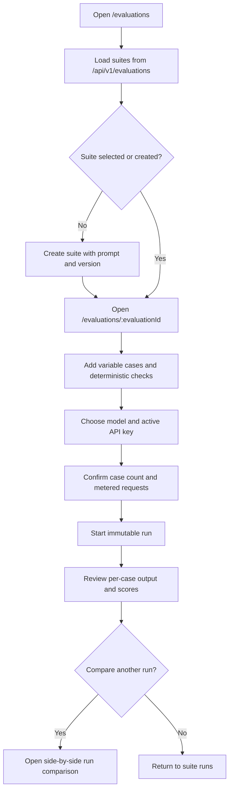
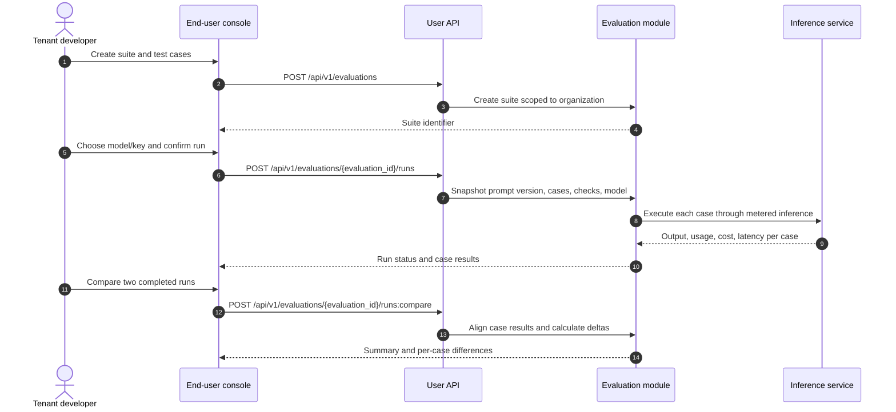

# Prompt Evaluation & Regression Testing — Requirement Analysis and UI/UX Design

| Attribute | Content |
| --- | --- |
| Feature point | Prompt evaluation & regression testing: curate variable-based test cases, run a saved prompt version against a selected model, score with deterministic checks, and compare repeatable runs (backlog row 44) |
| Document scope | End-user evaluation suites, test cases, execution results, run comparison, exact page/API mapping, and acceptance criteria |
| Owning modules | `prompt` (read-only source of saved prompts and immutable versions), `evaluation` (new: suites, cases, runs, deterministic checks and results), `infer` (metered model execution), `web` end-user console |
| Related documents | [Prompt Management](./prompt-management.md), [Request Logs & API Playground](./request-logs-playground.md), [Model Playground Comparison](./playground-comparison.md), [Console Surface Separation](./console-surface-separation.md) |
| Status | Design complete, pending Architect handoff |

---

## 1. Background and Competitive Research

### 1.1 Why Prompt Evaluation Comes Now

The prompt library (feature 43) stores reusable prompts and immutable versions, while the playground (feature 12) and comparison page (feature 35) support one-off interactive calls. They do not answer whether a prompt change improves results across a repeatable set of inputs. Teams otherwise rerun examples by hand, miss regressions, and cannot compare results tied to a specific prompt version.

This feature adds an offline evaluation workspace reachable from the end-user console. A tenant creates an evaluation suite from a saved prompt, adds variable-based cases and deterministic checks, runs a pinned prompt version against one selected model, then reviews and compares immutable runs. It is deliberately a small regression-testing loop, not a general agent benchmark system.

### 1.2 Competitive Research Summary

| Product | Documented pattern | go-taas decision |
| --- | --- | --- |
| **LangSmith** | Its official evaluation documentation describes offline evaluations built from datasets/examples, evaluators, experiments, and result analysis/comparison. It supports curated cases and code-based evaluators alongside human and LLM judging. | Adopt the dataset → repeatable run → scored result → comparison workflow. Keep the first increment to tenant-authored cases and deterministic checks so results are reproducible and costs are explicit. |
| **OpenAI Platform Evals** | Evaluation is a recognized platform workflow for running test data through a model/application and grading outputs. The official page was not retrievable during this research session, so no specific UI behavior is assumed here. | Adopt the evaluation concept, but do not claim parity with unavailable page details. Keep prompt/version/model selection visible before execution. |
| **Anthropic Console** | Public documentation links for evaluation and prompt tools were unavailable or region-redirected in this research session. | Do not infer undocumented controls. Retain the established prompt-version and test-case workflow without tying it to a provider-specific feature. |
| **Open-source evaluation tools (for example, LangSmith)** | Offline experiment results are analyzed per example and compared across runs; richer workflows can add pairwise or LLM-based judges. | Defer LLM-as-judge, human review, online evaluation, external dataset import, and arbitrary agent/tool execution. They increase cost, policy and reproducibility surface beyond this iteration. |

Patterns adopted: a named suite with editable examples; a run that snapshots its inputs and configuration; per-case outputs and scores; and a comparison view for regression detection. Pitfalls rejected: opaque aggregate scores without case-level evidence, silently moving a suite to the latest prompt version, and automatic LLM judging with unbounded cost or nondeterminism.

### 1.3 Decisions

| # | Decision | Rationale |
| --- | --- | --- |
| D1 | Evaluations are end-user-only at `/evaluations` and `/evaluations/:evaluationId`, using only `/api/v1/*`. There is no admin evaluation page or admin evaluation API. | Cases and outputs may contain tenant data and prompt IP. Platform operators manage platform health through existing aggregate observability, not tenant evaluation content. |
| D2 | A suite references one tenant-owned saved prompt and a chosen immutable prompt version. A run snapshots the full prompt version, case inputs, checks, selected model, and execution settings. | A test must remain reproducible when the prompt is edited or cases change. A run never silently follows the active version. |
| D3 | Cases provide values for every declared `${variable}` in the selected prompt version. A case may define expected output and one or more deterministic checks: exact match, contains, regular expression, or valid JSON. | These checks are inspectable, repeatable, and require no judge model or hidden inference spend. |
| D4 | Each run executes every case once against one selected model and the user's active API key. Each case records output, check results, latency, token counts, cost, and any execution error independently. | One failed case must not hide other results. Real metered inference provides honest usage and cost figures. |
| D5 | Run records are immutable. Users compare two runs of the same suite side by side, including pass rate, cost, latency, per-case output, and score changes. | Immutable runs make prompt regressions auditable; comparison supports both prompt-version and model changes. |
| D6 | Initial limits are 50 cases per suite run, 10,000 characters per case value, and 10 in-flight evaluation runs per organization. The UI previews case count and warns that every case makes a metered inference call. | Bounds protect tenant spend and service capacity while retaining useful small regression sets. |
| D7 | The feature does not import external datasets, run online evaluations, call LLM judges, grade safety policy, or execute tools/Agents. | These need additional data governance, cost controls, and execution isolation and are not required for a deterministic regression loop. |

### 1.4 Scope Boundary

In scope: suite list/create/edit/delete; prompt and version selection; variable-based cases; deterministic checks; metered batch execution; run history and per-case results; two-run comparison; and link back to the source prompt. Out of scope: admin access to tenant content, online/production evaluation, LLM-as-judge, human review, external dataset import/export, model comparison within a single run, and tool/Agent execution.

---

## 2. User Roles and Stories

### 2.1 End-User Surface

| Role | User story |
| --- | --- |
| Tenant developer / Agent builder | As an Agent builder, I want to keep representative variable inputs and checks beside a saved prompt so that I can detect regressions before adopting a prompt change. |
| Tenant prompt engineer | As a prompt engineer, I want to run a chosen prompt version against a model and inspect every output, score, latency, and cost so that I can make an evidence-based revision. |
| Tenant billing owner | As a billing owner, I want a pre-run case count and a recorded total cost so that evaluation spend is visible and bounded. |

### 2.2 Admin Surface

There is no admin variant of this capability. `/admin/evaluations` and `/api/v1/admin/evaluations/*` are not defined. Admin sessions remain isolated in the admin realm and are not accepted by end-user evaluation pages; user evaluation sessions use the user realm. The admin console is operations-oriented, while this task-oriented workflow belongs to tenant users and Agents.

---

## 3. Functional Requirements

### FR1 — Evaluation suite and prompt binding

- **FR1.1** A user can create a suite with a required name (1–128 characters), a tenant-owned `prompt_id`, and a selected `prompt_version` that exists for that prompt.
- **FR1.2** A suite name is unique within its organization. Duplicate names return a conflict and preserve the form values.
- **FR1.3** Editing suite metadata or cases does not mutate prior runs. Deleting a suite requires confirmation and deletes suite configuration; completed run snapshots remain available for the retention period of 90 days, but are no longer listed under the deleted suite.
- **FR1.4** Prompt and version selectors use only the tenant's prompt APIs. Selecting a different prompt version updates the required-variable list shown beside the case editor.

### FR2 — Cases and deterministic checks

- **FR2.1** A case has a required name (1–128 characters), a JSON object of variable values, an optional expected-output string (up to 10,000 characters), and one or more deterministic checks.
- **FR2.2** Every variable declared by the selected prompt version must have a non-empty value in each case; undeclared variables are rejected. Malformed JSON, missing variables, or values over the limit show field-level errors and do not save.
- **FR2.3** Supported checks are exact match, contains, regular expression, and valid JSON. A check stores its type and expected value where applicable. Invalid regular expressions and empty expected values are rejected before save.
- **FR2.4** A suite supports 1–50 cases to run. Cases can be added, edited, removed, duplicated, and reordered. Reordering affects display only, not the immutable order of existing runs.

### FR3 — Execute an evaluation run

- **FR3.1** The user selects a model from `GET /api/v1/models` and an active API key from `GET /api/v1/auth/api-keys?active_only=true`, then starts a run for a chosen prompt version.
- **FR3.2** Before submission, the UI shows the number of cases and a confirmation stating that each case is a metered inference request. The user confirms with **Run evaluation**.
- **FR3.3** A run snapshots the prompt version, model, ordered case inputs, checks, and API-key identifier (never the key secret). It executes each case once through the real metered inference path.
- **FR3.4** Each case result includes completion text, pass/fail per check, latency, input/output tokens, cost, and execution status. One case error does not cancel remaining cases. The run ends as completed, completed-with-errors, or failed.
- **FR3.5** Re-running creates a new run; it never overwrites a previous run. In-flight runs can be cancelled, and cancellation preserves results already returned while marking unstarted cases cancelled.
- **FR3.6** Run history is newest first and paginated. A run is retained for 90 days. The result view indicates that older data may expire.

### FR4 — Review and compare runs

- **FR4.1** The run detail shows summary pass rate, passed/failed/error/cancelled counts, total cost, median latency, model, prompt/version snapshot, and creation time.
- **FR4.2** The case-results table includes case name, check status, latency, tokens, cost, and execution status. It supports status filtering, case-name search, status sorting, and pagination. Selecting a row opens its input, output, expected value, individual checks, and error details.
- **FR4.3** The user can select two runs belonging to the same suite and compare them. The view shows summary deltas and per-case output/check/latency/cost differences. Missing or newly added cases are labeled rather than aligned incorrectly.
- **FR4.4** The comparison view identifies each run's prompt version and model. It does not label a run as better solely from latency/cost; check outcomes remain visible as the primary regression signal.

### FR5 — Surface, tenancy, and permissions

- **FR5.1** All evaluation pages use the end-user session realm and routes without an `/admin` segment. Every evaluation API call uses `/api/v1/evaluations/*`; prompt/model/key lookups use their exact user API routes.
- **FR5.2** Evaluation data is organization-scoped. A tenant cannot list, retrieve, modify, compare, or delete another tenant's suites or runs, including by guessing an identifier.
- **FR5.3** An admin-realm session cannot access evaluation pages or user APIs. A user-realm session cannot access `/admin/evaluations` or `/api/v1/admin/evaluations/*`; those admin evaluation routes do not exist.
- **FR5.4** Permission-denied responses use the standard surface-specific page state and never reveal whether another tenant's suite exists.

---

## 4. Surface Assignment

| Feature | Surface | Web route | API prefix(es) |
| --- | --- | --- | --- |
| Evaluation suite list/create | end-user | `/evaluations` | `/api/v1/evaluations` |
| Suite cases and configuration | end-user | `/evaluations/:evaluationId` | `/api/v1/evaluations/{evaluation_id}`, `/api/v1/evaluations/{evaluation_id}/cases` |
| Run history and result detail | end-user | `/evaluations/:evaluationId/runs/:runId` | `/api/v1/evaluations/{evaluation_id}/runs`, `/api/v1/evaluations/{evaluation_id}/runs/{run_id}` |
| Compare two runs | end-user | `/evaluations/:evaluationId/compare?left=:leftRunId&right=:rightRunId` | `/api/v1/evaluations/{evaluation_id}/runs:compare` |
| Saved prompt/version selector | end-user | `/evaluations`, `/evaluations/:evaluationId` | `/api/v1/prompts`, `/api/v1/prompts/{prompt_id}/versions` |
| Model selector | end-user | `/evaluations/:evaluationId` | `/api/v1/models` |
| Active API-key selector | end-user | `/evaluations/:evaluationId` | `/api/v1/auth/api-keys?active_only=true` |
| Admin evaluation experience | none | No admin route | No `/api/v1/admin/evaluations/*` API |

Each page has exactly one surface. `/evaluations` and its detail/compare routes use the user session realm only. `/admin/login` and the admin realm are separate; no page or API is shared across realms. User pages never call `/api/v1/admin/*`; no admin evaluation page calls `/api/v1/*`.

---

## 5. UI Design Per Page

### 5.1 Page: `/evaluations` — Evaluation Suites

**Purpose and layout.** Render inside `UserShell`, under the task-oriented developer navigation. The header contains **Evaluations**, a concise subtitle, and **New evaluation** as the primary action. A toolbar provides suite-name search, prompt filter, and status filter. The main table columns are **Name**, **Prompt**, **Version**, **Cases**, **Last run**, **Pass rate**, **Updated**, and **Actions**. Name, prompt, cases, last run, pass rate, and updated are sortable; prompt and run status are filterable; search matches suite name. Pagination uses 20 rows per page. Row actions are **Open**, **Run**, and **Delete**.

**States.** Default shows suites and filters. Loading shows table skeletons and disables search/filter/create. Empty shows “No evaluations yet.” and keeps **New evaluation** available. Error shows “Could not load evaluations.” with **Retry** and retains stale rows marked “Showing saved results.” Disabled actions remain disabled while their request is pending. Permission-denied shows “You do not have access to evaluations.” and a link to the user home; it does not show suite existence.

**New evaluation dialog.** Fields: Name (required, 1–128 characters), Prompt (required, tenant prompt selector), Prompt version (required, existing version selector), and optional Description (≤500 characters). Errors: “Enter an evaluation name.”, “Choose a prompt.”, “Choose a prompt version.”, “An evaluation with this name already exists.”. **Create evaluation** is disabled during submit. On success, navigate to `/evaluations/:evaluationId`.

**Delete confirmation.** “Delete this evaluation suite? Completed run snapshots will be retained for 90 days but will no longer appear in suite history.” Actions: **Delete suite** (danger) and **Cancel**. On success return to the suite list and show “Evaluation deleted.” On failure keep the dialog open and show the server error.

### 5.2 Page: `/evaluations/:evaluationId` — Cases and Run History

**Purpose and layout.** Render inside `UserShell`. The header shows suite name, linked prompt, pinned prompt version, and **Edit suite** / **Delete** secondary actions. A two-tab region has **Test cases** and **Runs**. Test cases show a table with **Order**, **Name**, **Variables**, **Checks**, and **Actions** (Edit, Duplicate, Delete); the toolbar has **Add case**. Runs show **Run**, **Created**, **Model**, **Prompt version**, **Cases**, **Pass rate**, **Cost**, and **Status**, newest first, with run detail navigation. Runs support status filtering and pagination.

**States.** Loading uses skeleton tabs and disables mutation/run controls. Empty cases show “Add at least one test case to run an evaluation.” Empty runs show “No runs yet.” and a **Run evaluation** action. Error shows a retry banner and preserves last-good data. Disabled controls identify pending save/delete/run operations. Permission-denied uses the standard user-surface state and does not reveal suite existence.

**Case editor dialog.** Fields: Name (required, 1–128 characters); Variables (JSON object editor, required, every declared prompt variable exactly once, values non-empty and ≤10,000 characters); Expected output (optional, ≤10,000 characters); Checks (one or more of Exact match, Contains, Regular expression, Valid JSON). Exact/contains/regex checks require a non-empty expected value; regex must compile. Errors: “Enter a case name.”, “Variables must be a valid JSON object.”, “Provide a value for `${name}`.”, “Remove undeclared variable `${name}`.”, “Variable values must be 10,000 characters or fewer.”, “Add at least one check.”, “Enter an expected value.”, “Enter a valid regular expression.”. Save is disabled until valid and while saving.

**Run confirmation.** A dialog shows prompt name/version, model selector, active API-key selector (masked key label only), case count, and estimated request count. Copy: “This run sends one metered inference request per case. The final cost depends on model output.” The user must choose a model and key and click **Run evaluation**. Cancel returns without a request. While running, show progress (`completed / total`), **Cancel run**, and disable another run for this suite. A run error shows completed results and an **Retry failed run as new run** action; it never silently retries or overwrites.

### 5.3 Page: `/evaluations/:evaluationId/runs/:runId` — Run Results

**Purpose and layout.** The header shows run timestamp, model, prompt-version snapshot, and actions **Compare** and **Run again**. Summary metrics are **Pass rate**, **Passed**, **Failed**, **Errors**, **Cancelled**, **Total cost**, and **Median latency**. The case table columns are **Case**, **Checks**, **Latency**, **Input tokens**, **Output tokens**, **Cost**, and **Status**. It supports name search, status filter, sorting by case/status/latency/cost, and 20-row pagination. Selecting a row opens a side panel with the exact variable inputs, completion, expected output, per-check result, and execution error if any.

**States.** Loading shows summary and table skeletons. Empty is only used for a run with zero submitted cases and says “This run contains no cases.” Error shows a retry action; stale output is labeled with its original run timestamp. Disabled state applies to compare/run-again while the run is incomplete. Permission-denied uses the standard user state. Partial completion is a distinct state: show “Run completed with errors” and preserve every case result.

**Compare flow.** **Compare** opens a selector for another completed run from this suite. It is disabled until two completed runs exist. Confirmation navigates to `/evaluations/:evaluationId/compare?left=:leftRunId&right=:rightRunId`.

### 5.4 Page: `/evaluations/:evaluationId/compare` — Run Comparison

**Purpose and layout.** Show the two selected runs in left/right columns, each labeled with timestamp, prompt version, and model. The top summary compares pass-rate, cost, and median-latency values with signed deltas. A case-aligned table has **Case**, **Left checks**, **Right checks**, **Left output**, **Right output**, and **Cost delta**. New or removed cases are marked **Only in left run** / **Only in right run**. Search and check-status filters apply to both sides; pagination is 20 cases. Selecting a case opens a synchronized detail view with both inputs, outputs, and check results.

**States.** Loading shows paired skeleton columns. Empty is not applicable because two run IDs are required; invalid/missing IDs show “Choose two runs from this evaluation.” Error includes **Retry** and a link to the suite. Disabled applies while comparison loads. Permission-denied uses the standard user state. The view never declares a winner automatically; it presents measured deltas and check results.

---

## 6. Page Flows

---

## 7. API Surface Implications

All new evaluation APIs are user-realm routes. The Architect should define equivalent RPCs in an `evaluation` service and bind them only under `/api/v1/evaluations/*`.

| Operation | Exact route | Status | Purpose |
| --- | --- | --- | --- |
| `CreateEvaluation` | `POST /api/v1/evaluations` | new | Create suite bound to tenant prompt/version |
| `ListEvaluations` | `GET /api/v1/evaluations` | new | Search/filter/paginate organization suites |
| `GetEvaluation` | `GET /api/v1/evaluations/{evaluation_id}` | new | Read suite configuration |
| `UpdateEvaluation` | `PATCH /api/v1/evaluations/{evaluation_id}` | new | Update suite name, prompt/version, description |
| `DeleteEvaluation` | `DELETE /api/v1/evaluations/{evaluation_id}` | new | Delete suite configuration |
| `CreateEvaluationCase` | `POST /api/v1/evaluations/{evaluation_id}/cases` | new | Add case and checks |
| `UpdateEvaluationCase` | `PATCH /api/v1/evaluations/{evaluation_id}/cases/{case_id}` | new | Update case/checks |
| `DeleteEvaluationCase` | `DELETE /api/v1/evaluations/{evaluation_id}/cases/{case_id}` | new | Remove case |
| `ReorderEvaluationCases` | `PUT /api/v1/evaluations/{evaluation_id}/cases:reorder` | new | Change display/run order for future runs |
| `CreateEvaluationRun` | `POST /api/v1/evaluations/{evaluation_id}/runs` | new | Snapshot and execute selected cases once |
| `ListEvaluationRuns` | `GET /api/v1/evaluations/{evaluation_id}/runs` | new | Paginated run history |
| `GetEvaluationRun` | `GET /api/v1/evaluations/{evaluation_id}/runs/{run_id}` | new | Read immutable summary and case results |
| `CancelEvaluationRun` | `POST /api/v1/evaluations/{evaluation_id}/runs/{run_id}:cancel` | new | Stop unstarted cases while preserving results |
| `CompareEvaluationRuns` | `POST /api/v1/evaluations/{evaluation_id}/runs:compare` | new | Return side-by-side per-case and summary deltas |
| Prompt/version selector | `GET /api/v1/prompts`, `GET /api/v1/prompts/{prompt_id}/versions` | existing | Tenant-owned prompts and versions only |
| Model selector | `GET /api/v1/models` | existing | Masked user-realm model catalog |
| API-key selector | `GET /api/v1/auth/api-keys?active_only=true` | existing | Active tenant keys; never return secret |

The API must scope every read/write by authenticated organization and must not accept a caller-supplied organization override. Run creation takes `model_id`, `api_key_id`, optional selected case IDs, and a prompt version; the key secret is never persisted in the run. Each inference call is metered and visible in existing usage/request logs. No route under `/api/v1/admin/*` is added for this feature.

---

## 8. Acceptance Criteria

| # | Criterion | Level |
| --- | --- | --- |
| AC1 | The user-realm `/evaluations` page lists suites and its create dialog validates name, tenant prompt, and existing prompt version; successful creation navigates to `/evaluations/:evaluationId`. | Nightwatch E2E |
| AC2 | A case cannot be saved with malformed JSON, missing/undeclared variables, empty checks, invalid regex, or values exceeding 10,000 characters; valid cases support exact, contains, regex, and valid-JSON checks. | Nightwatch E2E |
| AC3 | The run dialog loads models from `GET /api/v1/models` and active keys from `GET /api/v1/auth/api-keys?active_only=true`, shows the number of metered requests, and is blocked until both selections exist. | Nightwatch E2E |
| AC4 | Starting a run stores a prompt-version/case/check/model snapshot, shows progress, and produces per-case outputs, check results, latency, tokens, cost, and independent errors. | Nightwatch E2E + FVT |
| AC5 | A failed case does not erase successful case results; retrying creates a new run rather than replacing the failed or prior run. | Nightwatch E2E |
| AC6 | The run detail displays summary metrics and a searchable, filterable, sortable, paginated case table; opening a case shows exact input, output, checks, and errors. | Nightwatch E2E |
| AC7 | Two completed runs from the same suite can be compared with prompt version/model labels, summary deltas, and correctly aligned per-case differences including added/removed cases. | Nightwatch E2E |
| AC8 | Evaluation data is organization-scoped; attempts to access another organization's suite or run return the standard not-found/permission response without disclosing existence. | FVT + Nightwatch E2E |
| AC9 | The reachable pages are `/evaluations`, `/evaluations/:evaluationId`, `/evaluations/:evaluationId/runs/:runId`, and `/evaluations/:evaluationId/compare`; every evaluation call uses `/api/v1/evaluations/*`, selectors use only the listed `/api/v1/*` routes, and no evaluation page calls `/api/v1/admin/*`. | Nightwatch E2E |
| AC10 | Evaluation pages require the user session realm. An admin session is not reused or accepted; no `/admin/evaluations` page or `/api/v1/admin/evaluations/*` endpoint is present. | Nightwatch E2E |
| AC11 | Every case inference is metered and its usage appears in the existing user usage/request-log surfaces with the same organization and selected API key. | FVT + Nightwatch E2E |
