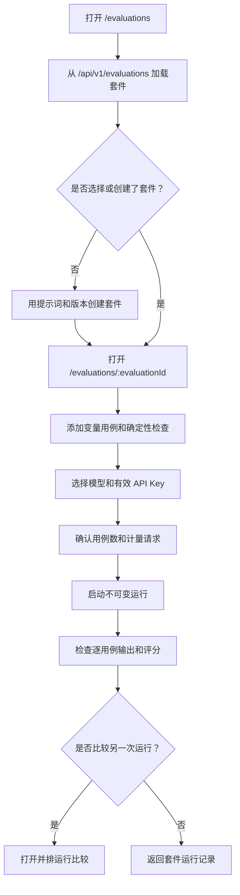
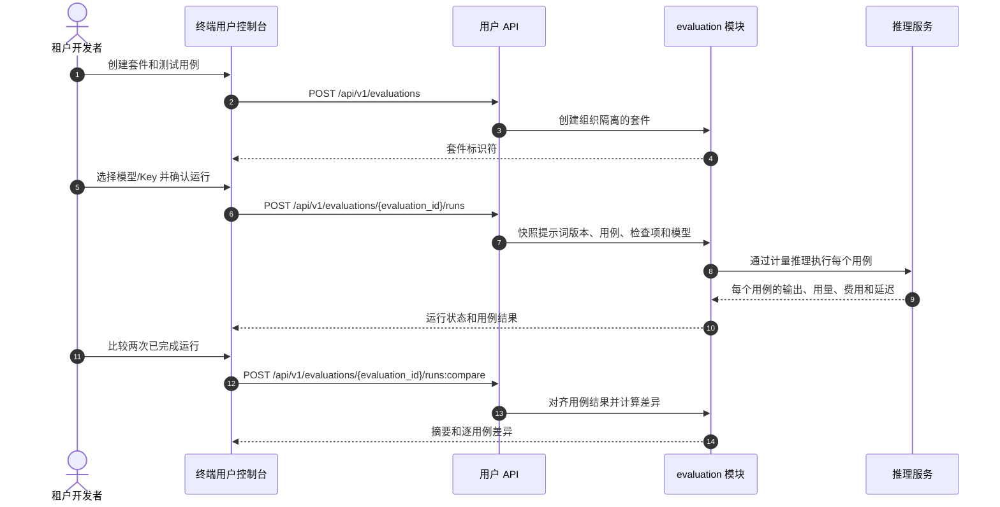

# 提示词评测与回归测试 — 需求分析与 UI/UX 设计

| 属性 | 内容 |
| --- | --- |
| 功能点 | 提示词评测与回归测试：整理变量化测试用例，对选定模型运行已保存的提示词版本，使用确定性检查评分，并比较可重复的运行结果（backlog 第 44 行） |
| 文档范围 | 终端用户评测套件、测试用例、运行执行结果、运行比较、精确的页面/API 映射和验收标准 |
| 所属模块 | `prompt`（只读来源：已保存的提示词及不可变版本）、`evaluation`（新增：套件、用例、运行、确定性检查和结果）、`infer`（计量后的模型执行）、`web` 终端用户控制台 |
| 相关文档 | [提示词管理](./prompt-management.zh-cn.md)、[请求日志与 API Playground](./request-logs-playground.zh-cn.md)、[Playground 模型比较](./playground-comparison.zh-cn.md)、[控制台面分离](./console-surface-separation.zh-cn.md) |
| 状态 | 设计完成，待移交给架构师 |

---

## 1. 背景与竞品调研

### 1.1 为什么现在做提示词评测

提示词库（功能 43）保存可复用提示词及不可变版本，Playground（功能 12）和模型比较页面（功能 35）支持一次性的交互式调用。但它们无法回答某次提示词修改是否能在一组可重复输入上改善结果。团队只能手工重跑示例，容易漏掉回归，也无法比较与特定提示词版本绑定的结果。

本功能在终端用户控制台中新增离线评测工作区。租户基于已保存的提示词创建评测套件，添加变量化用例和确定性检查，针对固定的提示词版本和选定模型运行，然后检查并比较不可变的运行结果。本功能刻意限定为小型回归测试闭环，而不是通用智能体基准测试系统。

### 1.2 竞品调研摘要

| 产品 | 文档所述模式 | go-taas 决策 |
| --- | --- | --- |
| **LangSmith** | 官方评测文档描述了基于数据集/样例、评估器、实验和结果分析/比较的离线评测。它支持人工整理的用例，也支持代码评估器、人工评审和 LLM 评判。 | 采用「数据集 → 可重复运行 → 评分结果 → 比较」工作流。首个增量限定为租户自建用例和确定性检查，使结果可复现且成本明确。 |
| **OpenAI Platform Evals** | 评测是平台化工作流：通过测试数据运行模型/应用，并对输出评分。本次调研无法获取官方页面，因此不假设任何具体 UI 行为。 | 采用评测概念，但不声称与无法访问页面的细节一致。在执行前明确显示提示词、版本和模型选择。 |
| **Anthropic Console** | 本次调研无法访问公开的评测和提示词工具文档，链接不可用或重定向到区域限制页面。 | 不推测未能查证的控件。沿用已有的提示词版本与测试用例工作流，不与特定供应商功能绑定。 |
| **开源评测工具（例如 LangSmith）** | 离线实验结果可按样例检查并跨运行比较；更丰富的工作流可加入成对比较或 LLM 评判。 | 暂不支持 LLM 评判、人工评审、在线评测、外部数据集导入和任意智能体/工具执行。这些功能会增加成本、策略和可复现性方面的范围，超出本次迭代。 |

采用的模式：有名称的套件和可编辑样例；记录输入与配置快照的运行；按用例展示输出和评分；用于回归检测的运行比较。避免的缺陷：没有用例证据的不透明聚合分数、套件悄然切换到最新提示词版本，以及成本或非确定性不受控的自动 LLM 评判。

### 1.3 决策

| # | 决策 | 理由 |
| --- | --- | --- |
| D1 | 评测仅供终端用户使用，路由为 `/evaluations` 和 `/evaluations/:evaluationId`，只使用 `/api/v1/*`。不设管理端评测页面或管理端评测 API。 | 用例和输出可能包含租户数据与提示词知识产权。平台操作员通过已有的聚合可观测性管理平台，不查看租户评测内容。 |
| D2 | 套件引用一个租户自有提示词及其选定的不可变版本。运行会快照完整提示词版本、用例输入、检查项、选定模型和执行设置。 | 提示词或用例变更后，测试仍必须可复现。运行不得悄然跟随活动版本。 |
| D3 | 每个用例为选定提示词版本中的每个 `${variable}` 提供值。用例可定义期望输出和一个或多个确定性检查：精确匹配、包含、正则表达式或有效 JSON。 | 这些检查可检查且可重复，不需要评判模型或产生隐式推理费用。 |
| D4 | 每次运行使用一个选定模型执行每个用例一次；使用用户的有效 API Key。每个用例分别记录输出、检查结果、延迟、Token 数、费用和执行错误。 | 单个用例失败不应隐藏其他结果。真实计量推理可提供可信的用量与费用数据。 |
| D5 | 运行记录不可变。用户可并排比较同一套件的两次运行，包括通过率、费用、延迟、每个用例的输出和评分变化。 | 不可变运行使提示词回归可审计；比较可覆盖提示词版本和模型变更。 |
| D6 | 首次交付的限制为：每次套件运行最多 50 个用例、每个用例变量值最多 10,000 字符、每个组织最多 10 个正在执行的评测运行。界面预览用例数，并提示每个用例都会产生一次计量推理调用。 | 这些上限能限制租户成本和服务容量，同时保留小规模回归集的实用性。 |
| D7 | 本功能不导入外部数据集、不运行在线评测、不调用 LLM 评判、不评估安全策略，也不执行工具/智能体。 | 这些能力需要额外的数据治理、成本控制与执行隔离，并非确定性回归闭环的必要部分。 |

### 1.4 范围边界

范围内：套件列表/创建/编辑/删除；提示词及版本选择；变量化用例；确定性检查；计量后的批量执行；运行历史与逐用例结果；两次运行比较；返回源提示词的链接。范围外：管理员查看租户内容、在线/生产评测、LLM 评判、人工评审、外部数据集导入/导出、单次运行中比较多个模型，以及工具/智能体执行。

---

## 2. 用户角色与故事

### 2.1 终端用户面

| 角色 | 用户故事 |
| --- | --- |
| 租户开发者 / 智能体构建者 | 作为智能体构建者，我希望在已保存的提示词旁保留有代表性的变量输入和检查项，以便在采用提示词修改前发现回归。 |
| 租户提示词工程师 | 作为提示词工程师，我希望针对模型运行选定的提示词版本，并检查每个输出、评分、延迟和费用，以便基于证据修订提示词。 |
| 租户账单负责人 | 作为账单负责人，我希望在运行前看到用例数，并记录总费用，以便评测支出可见且有上限。 |

### 2.2 管理端面

本能力没有管理端变体。未定义 `/admin/evaluations` 和 `/api/v1/admin/evaluations/*`。管理端会话继续使用独立的管理端会话域，不能用于终端用户评测页面；用户评测使用用户会话域。管理端控制台面向运维，评测工作流面向租户用户和智能体，属于任务型用户控制台。

---

## 3. 功能需求

### FR1 — 评测套件与提示词绑定

- **FR1.1** 用户可创建套件，填写必填名称（1–128 字符）、一个租户自有 `prompt_id`，以及该提示词现存的 `prompt_version`。
- **FR1.2** 套件名称在组织内唯一。重名返回冲突错误，并保留表单值。
- **FR1.3** 编辑套件元数据或用例不会修改之前的运行。删除套件前必须确认；删除套件配置后，已完成运行快照在 90 天保留期内仍保留，但不再显示在该套件历史中。
- **FR1.4** 提示词和版本选择器只调用租户提示词 API。选择不同版本时，案例编辑器旁显示该版本所需变量列表。

### FR2 — 用例与确定性检查

- **FR2.1** 用例包含必填名称（1–128 字符）、变量值 JSON 对象、可选期望输出文本（最多 10,000 字符），以及一个或多个确定性检查。
- **FR2.2** 每个选定提示词版本声明的变量都必须在每个用例中有非空值；不允许未声明变量。格式错误的 JSON、缺少变量或超限值显示字段级错误且不能保存。
- **FR2.3** 支持的检查为精确匹配、包含、正则表达式和有效 JSON。适用时需保存检查类型和期望值。无效正则表达式和空期望值必须在保存前拒绝。
- **FR2.4** 每个套件支持 1–50 个待运行用例。用例可添加、编辑、删除、复制和排序。排序仅影响显示，不改变已有运行中的不可变顺序。

### FR3 — 执行评测运行

- **FR3.1** 用户从 `GET /api/v1/models` 选择模型，并从 `GET /api/v1/auth/api-keys?active_only=true` 选择有效 API Key，然后为指定提示词版本启动运行。
- **FR3.2** 提交前，界面显示用例数，并确认每个用例都会产生计量推理请求。用户确认后点击**运行评测**。
- **FR3.3** 运行快照提示词版本、模型、有序用例输入、检查项和 API Key 标识符（绝不包含 Key 密钥）。每个用例通过真实计量推理路径执行一次。
- **FR3.4** 每个用例结果包括补全文本、逐项检查通过/失败、延迟、输入/输出 Token、费用和执行状态。单个用例错误不取消其余用例。运行状态为已完成、部分错误完成或失败。
- **FR3.5** 再次运行会创建新运行，绝不覆盖旧运行。运行中可取消；保留已返回的结果，并将尚未开始的用例标记为已取消。
- **FR3.6** 运行历史按时间倒序并分页。运行保留 90 天。结果页会说明旧数据可能到期。

### FR4 — 检查并比较运行

- **FR4.1** 运行详情显示通过率、通过/失败/错误/取消数量、总费用、中位延迟、模型、提示词/版本快照和创建时间。
- **FR4.2** 用例结果表包含用例名、检查状态、延迟、Token 数、费用和执行状态。支持按状态筛选、按用例名搜索、按状态排序和分页。选择行后打开输入、输出、期望值、各项检查及错误详情。
- **FR4.3** 用户可选择同一套件的两次运行进行比较。视图显示摘要差异和逐用例的输出/检查/延迟/费用差异。缺失或新增用例应标记，不得错误对齐。
- **FR4.4** 比较视图标明每次运行的提示词版本和模型。不能仅凭延迟或费用就标为更优；检查结果必须始终可见。

### FR5 — 面、租户隔离与权限

- **FR5.1** 所有评测页面使用终端用户会话域，路由不含 `/admin`。所有评测 API 调用使用 `/api/v1/evaluations/*`；提示词/模型/Key 查询使用准确的用户 API 路由。
- **FR5.2** 评测数据按组织隔离。租户不能列出、获取、修改、比较或删除其他租户的套件或运行，即使猜中了标识符也不行。
- **FR5.3** 管理端会话不能访问评测页面或用户 API。用户会话不能访问 `/admin/evaluations` 或 `/api/v1/admin/evaluations/*`；这类管理端评测路由不存在。
- **FR5.4** 权限不足时使用面对应的标准状态页，且不得透露其他租户的套件是否存在。

---

## 4. 面分配

| 功能 | 面 | Web 路由 | API 前缀 |
| --- | --- | --- | --- |
| 评测套件列表/创建 | 终端用户 | `/evaluations` | `/api/v1/evaluations` |
| 套件用例与配置 | 终端用户 | `/evaluations/:evaluationId` | `/api/v1/evaluations/{evaluation_id}`、`/api/v1/evaluations/{evaluation_id}/cases` |
| 运行历史与结果详情 | 终端用户 | `/evaluations/:evaluationId/runs/:runId` | `/api/v1/evaluations/{evaluation_id}/runs`、`/api/v1/evaluations/{evaluation_id}/runs/{run_id}` |
| 比较两次运行 | 终端用户 | `/evaluations/:evaluationId/compare?left=:leftRunId&right=:rightRunId` | `/api/v1/evaluations/{evaluation_id}/runs:compare` |
| 已保存提示词/版本选择器 | 终端用户 | `/evaluations`、`/evaluations/:evaluationId` | `/api/v1/prompts`、`/api/v1/prompts/{prompt_id}/versions` |
| 模型选择器 | 终端用户 | `/evaluations/:evaluationId` | `/api/v1/models` |
| 有效 API Key 选择器 | 终端用户 | `/evaluations/:evaluationId` | `/api/v1/auth/api-keys?active_only=true` |
| 管理端评测体验 | 无 | 无管理端路由 | 无 `/api/v1/admin/evaluations/*` API |

每个页面只属于一个面。`/evaluations` 及其详情/比较路由仅使用用户会话域。`/admin/login` 和管理端会话域相互独立，不共享页面或 API。用户页面绝不调用 `/api/v1/admin/*`；本功能也没有管理端页面调用 `/api/v1/*`。

---

## 5. 每页 UI 设计

### 5.1 页面：`/evaluations` — 评测套件

**用途与布局。** 在 `UserShell` 内渲染，放在面向开发者任务的导航中。页面头部显示**评测**、简短副标题及主操作**新建评测**。工具栏提供套件名称搜索、提示词筛选和状态筛选。主表格列为**名称**、**提示词**、**版本**、**用例数**、**最近运行**、**通过率**、**更新时间**和**操作**。名称、提示词、用例数、最近运行、通过率和更新时间可排序；提示词和运行状态可筛选；搜索匹配套件名称。每页 20 行。行操作为**打开**、**运行**和**删除**。

**状态。** 默认状态显示套件和筛选条件。加载中显示表格骨架，并禁用搜索/筛选/创建。空状态显示「还没有评测。」并保留**新建评测**。错误状态显示「无法加载评测。」和**重试**，保留旧数据并标记「显示的是已保存结果」。请求进行中时禁用对应操作。权限不足时显示「你无权访问评测。」以及返回用户首页的链接，不显示套件是否存在。

**新建评测对话框。** 字段：名称（必填，1–128 字符）、提示词（必填，租户提示词选择器）、提示词版本（必填，现存版本选择器）、描述（可选，最多 500 字符）。错误文案：「输入评测名称。」「选择提示词。」「选择提示词版本。」「已存在同名评测。」提交期间禁用**创建评测**。成功后导航至 `/evaluations/:evaluationId`。

**删除确认。** 文案：「删除此评测套件？已完成运行快照仍保留 90 天，但不会再显示在套件历史中。」操作：**删除套件**（危险）和**取消**。成功后返回套件列表并提示「评测已删除。」失败时保留对话框并显示服务端错误。

### 5.2 页面：`/evaluations/:evaluationId` — 用例与运行历史

**用途与布局。** 在 `UserShell` 内渲染。页面头部显示套件名、关联提示词、固定提示词版本，以及次级操作**编辑套件**/**删除**。两个标签为**测试用例**和**运行记录**。测试用例表格列为**顺序**、**名称**、**变量**、**检查项**和**操作**（编辑、复制、删除）；工具栏提供**添加用例**。运行表格列为**运行时间**、**模型**、**提示词版本**、**用例数**、**通过率**、**费用**和**状态**，按时间倒序，可进入运行详情。运行支持状态筛选和分页。

**状态。** 加载时显示标签与表格骨架，并禁用修改/运行操作。用例为空时显示「至少添加一个测试用例后才能运行评测。」运行为空时显示「还没有运行记录。」和**运行评测**。错误状态显示重试横幅并保留最后的可用数据。保存/删除/运行待处理时，禁用对应控件。权限不足时显示标准用户面状态，不透露套件是否存在。

**用例编辑对话框。** 字段：名称（必填，1–128 字符）；变量（JSON 对象编辑器，必填，提示词声明的变量各一个，值非空且不超过 10,000 字符）；期望输出（可选，最多 10,000 字符）；检查项（精确匹配、包含、正则表达式、有效 JSON 中至少一种）。精确/包含/正则检查需要非空期望值；正则表达式必须可编译。错误文案：「输入用例名称。」「变量必须是有效的 JSON 对象。」「请为 `${name}` 提供值。」「请移除未声明的变量 `${name}`。」「变量值不得超过 10,000 个字符。」「至少添加一项检查。」「输入期望值。」「输入有效的正则表达式。」表单无效或保存期间禁用**保存**。

**运行确认。** 对话框显示提示词名/版本、模型选择器、有效 API Key 选择器（仅显示脱敏 Key 标签）、用例数和预计请求数。提示文案：「本次运行会为每个用例发送一次计量推理请求。最终费用取决于模型输出。」用户必须选择模型和 Key，再点击**运行评测**。取消后不发起请求。运行中显示进度（`已完成 / 总数`）、**取消运行**，并禁用该套件的另一次运行。运行错误时显示已完成结果和**将失败用例作为新运行重试**；不得悄悄重试或覆盖结果。

### 5.3 页面：`/evaluations/:evaluationId/runs/:runId` — 运行结果

**用途与布局。** 页头显示运行时间、模型、提示词版本快照，以及操作**比较**和**再次运行**。摘要指标为**通过率**、**通过**、**失败**、**错误**、**已取消**、**总费用**和**中位延迟**。用例表格列为**用例**、**检查项**、**延迟**、**输入 Token**、**输出 Token**、**费用**和**状态**。支持名称搜索、状态筛选、按用例/状态/延迟/费用排序及每页 20 行。选择行后，侧栏显示精确的变量输入、补全文本、期望输出、逐项检查结果及执行错误。

**状态。** 加载中显示指标和表格骨架。仅当运行提交了零个用例时使用空状态，文案为「此运行不包含用例。」错误状态提供重试；旧输出标明原运行时间。运行未完成时禁用比较/再次运行。权限不足显示标准用户状态。部分完成是独立状态，显示「运行完成，但有错误」并保留每个用例结果。

**比较流程。** **比较**打开同套件中其他已完成运行的选择器。至少有两次已完成运行时启用。确认后导航到 `/evaluations/:evaluationId/compare?left=:leftRunId&right=:rightRunId`。

### 5.4 页面：`/evaluations/:evaluationId/compare` — 运行比较

**用途与布局。** 左右两栏分别显示选中的两次运行，并标明时间、提示词版本和模型。顶部摘要比较通过率、费用和中位延迟，并显示有正负方向的差值。按用例对齐的表格包含**用例**、**左侧检查**、**右侧检查**、**左侧输出**、**右侧输出**和**费用差值**。新增或删除的用例分别标注**仅存在于左侧运行**/**仅存在于右侧运行**。搜索和检查状态筛选同时作用于两侧；每页 20 个用例。选择用例后打开同步的详情视图，显示两侧输入、输出和检查结果。

**状态。** 加载中显示成对的骨架栏。比较必须提供两个运行 ID，因此没有普通空状态；ID 无效/缺失时显示「请选择此评测中的两次运行。」错误状态提供**重试**和返回套件链接。加载中禁用操作。权限不足显示标准用户状态。页面不自动判断胜者，只呈现测量差异和检查结果。

---

## 6. 页面流程

---

## 7. API 面影响

所有新增评测 API 都属于用户会话域。架构师应在 `evaluation` 服务中定义对应 RPC，并且只绑定到 `/api/v1/evaluations/*`。

| 操作 | 精确路由 | 状态 | 用途 |
| --- | --- | --- | --- |
| `CreateEvaluation` | `POST /api/v1/evaluations` | 新增 | 创建并绑定租户提示词/版本的套件 |
| `ListEvaluations` | `GET /api/v1/evaluations` | 新增 | 搜索/筛选/分页列出组织内套件 |
| `GetEvaluation` | `GET /api/v1/evaluations/{evaluation_id}` | 新增 | 读取套件配置 |
| `UpdateEvaluation` | `PATCH /api/v1/evaluations/{evaluation_id}` | 新增 | 更新套件名称、提示词/版本和描述 |
| `DeleteEvaluation` | `DELETE /api/v1/evaluations/{evaluation_id}` | 新增 | 删除套件配置 |
| `CreateEvaluationCase` | `POST /api/v1/evaluations/{evaluation_id}/cases` | 新增 | 添加用例与检查项 |
| `UpdateEvaluationCase` | `PATCH /api/v1/evaluations/{evaluation_id}/cases/{case_id}` | 新增 | 更新用例/检查项 |
| `DeleteEvaluationCase` | `DELETE /api/v1/evaluations/{evaluation_id}/cases/{case_id}` | 新增 | 删除用例 |
| `ReorderEvaluationCases` | `PUT /api/v1/evaluations/{evaluation_id}/cases:reorder` | 新增 | 调整未来运行和显示顺序 |
| `CreateEvaluationRun` | `POST /api/v1/evaluations/{evaluation_id}/runs` | 新增 | 快照并执行选定用例一次 |
| `ListEvaluationRuns` | `GET /api/v1/evaluations/{evaluation_id}/runs` | 新增 | 分页列出运行历史 |
| `GetEvaluationRun` | `GET /api/v1/evaluations/{evaluation_id}/runs/{run_id}` | 新增 | 读取不可变摘要和用例结果 |
| `CancelEvaluationRun` | `POST /api/v1/evaluations/{evaluation_id}/runs/{run_id}:cancel` | 新增 | 停止尚未开始的用例并保留已有结果 |
| `CompareEvaluationRuns` | `POST /api/v1/evaluations/{evaluation_id}/runs:compare` | 新增 | 返回并排逐用例和摘要差异 |
| 提示词/版本选择器 | `GET /api/v1/prompts`、`GET /api/v1/prompts/{prompt_id}/versions` | 已有 | 仅查询租户自有提示词和版本 |
| 模型选择器 | `GET /api/v1/models` | 已有 | 用户会话域的脱敏模型目录 |
| API Key 选择器 | `GET /api/v1/auth/api-keys?active_only=true` | 已有 | 有效租户 Key；不返回密钥 |

API 必须按认证组织隔离每次读取/写入，不得接受调用方提供的组织覆盖值。创建运行时传入 `model_id`、`api_key_id`、可选的用例 ID 和提示词版本；运行中不得持久化 Key 密钥。每次推理都经过计量，并可在已有的用量/请求日志中查看。本功能不新增任何 `/api/v1/admin/*` 路由。

---

## 8. 验收标准

| # | 标准 | 级别 |
| --- | --- | --- |
| AC1 | 用户会话域的 `/evaluations` 页面列出套件；创建对话框校验名称、租户提示词和现存提示词版本；创建成功后导航至 `/evaluations/:evaluationId`。 | Nightwatch E2E |
| AC2 | 用例不能以格式错误的 JSON、缺失/未声明变量、空检查项、无效正则或超过 10,000 字符的值保存；有效用例支持精确匹配、包含、正则表达式和有效 JSON 检查。 | Nightwatch E2E |
| AC3 | 运行对话框从 `GET /api/v1/models` 加载模型，从 `GET /api/v1/auth/api-keys?active_only=true` 加载有效 Key，显示计量请求数；没有选择二者时不能提交。 | Nightwatch E2E |
| AC4 | 启动运行会保存提示词版本/用例/检查项/模型快照，显示进度，并为每个用例生成输出、检查结果、延迟、Token、费用和独立错误。 | Nightwatch E2E + FVT |
| AC5 | 单个用例失败不会清除成功用例结果；重试会创建新运行，不替换失败运行或任何已有运行。 | Nightwatch E2E |
| AC6 | 运行详情显示摘要指标及可搜索、筛选、排序、分页的用例表；打开用例后显示精确输入、输出、检查项和错误。 | Nightwatch E2E |
| AC7 | 可比较同一套件的两次已完成运行，显示提示词版本/模型标签、摘要差异和逐用例差异；新增/删除用例正确对齐。 | Nightwatch E2E |
| AC8 | 评测数据按组织隔离；访问其他组织的套件或运行时返回标准未找到/权限错误，且不泄露其是否存在。 | FVT + Nightwatch E2E |
| AC9 | 可访问页面为 `/evaluations`、`/evaluations/:evaluationId`、`/evaluations/:evaluationId/runs/:runId` 和 `/evaluations/:evaluationId/compare`；所有评测调用使用 `/api/v1/evaluations/*`，选择器只调用指定的 `/api/v1/*` 路由，没有评测页面调用 `/api/v1/admin/*`。 | Nightwatch E2E |
| AC10 | 评测页面要求用户会话域。管理端会话不得复用或被接受；不存在 `/admin/evaluations` 页面和 `/api/v1/admin/evaluations/*` 端点。 | Nightwatch E2E |
| AC11 | 每个用例推理都会计量，并以相同组织和所选 API Key 出现在现有用户用量/请求日志页面中。 | FVT + Nightwatch E2E |
