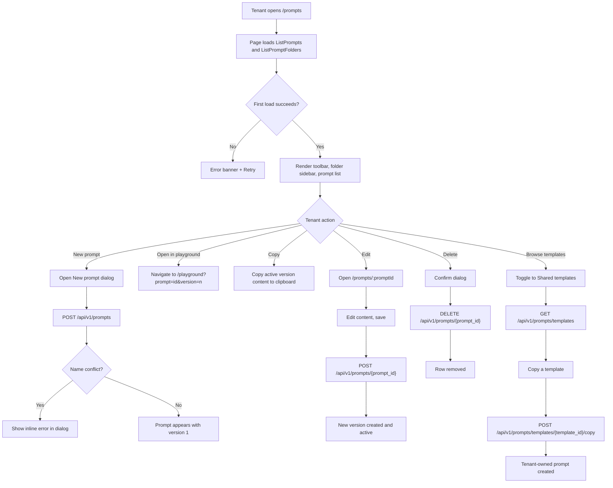
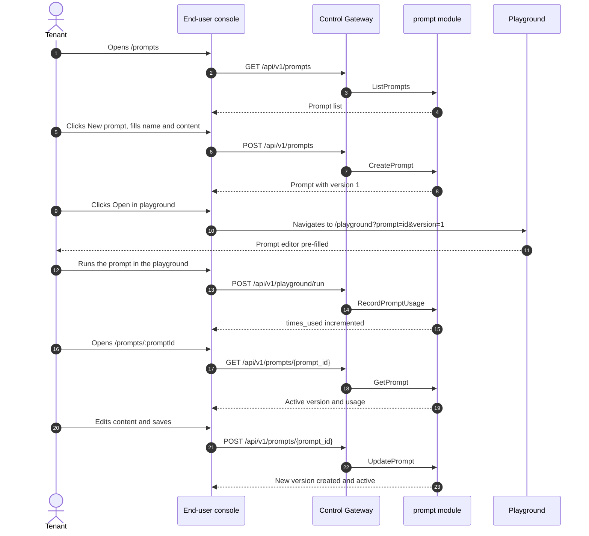

# Prompt Management & Prompt Library — Requirement Analysis and UI/UX Design

| Attribute | Content |
| --- | --- |
| Feature point | Prompt management & prompt library (prompt templates) — create, version, organize into folders, search, and reuse prompts; open a prompt in the playground; copy prompt text; per-prompt usage stats. The admin surface manages a cross-tenant prompt list (masked), prompt usage analytics, and a shared prompt template library tenants can browse and copy (backlog row 43) |
| Document scope | Requirement analysis, competitive research, the end-user prompt page for `/prompts`, the admin prompt page for `/admin/prompts`, the page → API surface table, and numbered acceptance criteria |
| Owning modules | `prompt` (new — owns the prompt lifecycle, versioning, folders, usage counters, and the shared template library), `infer` (read-only: the model catalog the prompt references), `audit` (read-only: prompt action audit events), `pkg/server` gateway (user- and admin-prefix bindings), `web` end-user console (`PromptsPage` in `UserShell`) and admin console (`AdminPromptsPage` in `AdminShell`) |
| Related documents | [Architecture Design](./architecture.md) — §2.5 `metering`, §3.1 (admin/user surface separation) · [Request Logs & API Playground](./request-logs-playground.md) — the sibling playground surface a prompt opens into · [Model Catalog & Deployment](./model-catalog-deployment.md) — the model catalog a prompt references · [Audit Logging](./audit-logging.md) — the audit events prompt actions emit · [Console Surface Separation](./console-surface-separation.md) — the two surfaces this feature lives on, the `UserShell`/`AdminShell` conventions, the masked-projection rule |
| Status | Design complete, handed to the Architect agent |

---

## 1. Background and Competitive Research

### 1.1 Why Prompt Management Comes Now

go-taas serves inference through an OpenAI-compatible gateway (feature #2, #12): an Agent sends a request and receives a completion. But a tenant who builds a real integration quickly accumulates a library of prompts — system instructions, few-shot examples, output-format constraints — that they reuse across requests, models, and applications. Without a place to store, version, and organize those prompts, the tenant pastes them into the playground or their code by hand, loses track of which version worked, and cannot share a well-tuned prompt with a teammate. Every major inference platform ships a **prompt library / prompt template** capability for exactly this: store a prompt once, version it, organize it, and reuse it.

This feature adds a **prompt management & prompt library** capability: a tenant creates prompts, versions them, organizes them into folders, searches them, opens one in the playground, copies its text, and sees how often it is used. The platform administrator manages a cross-tenant prompt list (masked), prompt usage analytics, and a shared prompt template library that tenants can browse and copy. It is the smallest independently valuable increment of the prompt-engineering capability: it turns "I keep retyping the same prompt" into "store it once, version it, reuse it anywhere". It is a **new `prompt` module** that stores prompt metadata and content — nothing in the real-time inference path changes.

### 1.2 How Comparable Products Implement Prompt Management

| Product | Prompt surface | Create | Version | Organize | Reuse | Notable pitfalls |
| --- | --- | --- | --- | --- | --- | --- |
| **OpenAI Platform** | Playground + examples | Save prompts in the playground | No explicit versioning | No folders | Reuse in the playground | Prompts are tied to playground sessions and can be lost |
| **Anthropic Console** | Prompt library | Save prompts | Versioned | Collections | Reuse in the console | Library is console-only; no API to fetch a prompt |
| **Aliyun Bailian** | Prompt templates | Create custom templates; preset templates | No explicit versioning | Type filter + search | Copy to an app, call the API | Preset vs custom split; variables use `${var}` syntax |
| **Volcengine Ark** | Prompt templates | Create templates | No explicit versioning | Search | Reuse in an app | Template marketplace; per-line validation |
| **Baidu Qianfan** | Prompt engineering | Create prompts | Versioned | Folders | Reuse in an app | Prompt engineering workspace |

### 1.3 Distilled Patterns and Decisions

Patterns worth adopting:

1. **A prompt is a reusable template with a name, content, model, and variables.** Every surveyed platform treats a prompt as a named, reusable unit. go-taas adopts the same model: a prompt has a name, content, an optional target model, an optional folder, and optional `${var}` variables.
2. **Versioning.** Anthropic and Baidu Qianfan version prompts; each edit creates a new version and the tenant can roll back. go-taas adopts versioning: every edit creates a new version, and the tenant can roll back to a previous version.
3. **Organize into folders.** Baidu Qianfan and Anthropic organize prompts into folders/collections. go-taas adopts folders.
4. **Reuse in the playground.** Aliyun Bailian fills a prompt into an app's prompt editor; OpenAI reuses prompts in the playground. go-taas adopts "Open in playground": a prompt opens into the existing playground (feature #12) pre-filled.
5. **Copy prompt text.** Aliyun Bailian offers "copy prompt". go-taas adopts a copy action.
6. **A shared template library.** Aliyun Bailian ships preset templates; Volcengine Ark has a template marketplace. go-taas adopts a shared prompt template library that the administrator curates and tenants browse and copy.
7. **Usage tracking.** Knowing how often a prompt is used and when it was last used helps a tenant prune and improve. go-taas tracks a lightweight per-prompt usage counter.

Pitfalls to avoid: prompts tied to playground sessions and lost (go-taas stores prompts persistently); no versioning so a tenant cannot roll back (go-taas versions every edit); prompt content leaking across tenants (go-taas masks content on the admin surface); variables not validated (go-taas validates `${var}` syntax); and a shared template that a tenant edits in place and corrupts for everyone (go-taas copies a template into a tenant-owned prompt rather than sharing a live reference).

**Decisions for go-taas** (recorded rationale, per the autonomous-decision rule):

| # | Decision | Rationale |
| --- | --- | --- |
| D1 | **Prompt management lives on both surfaces.** End-user: route `/prompts`, API prefix `/api/v1/prompts/*` — a tenant creates and manages their own prompts. Admin: route `/admin/prompts`, API prefix `/api/v1/admin/prompts/*` — an operator views all prompts across tenants (masked), sees prompt usage analytics, and curates a shared template library | Prompt management is a tenant self-service capability (the tenant stores and reuses their own prompts) AND an operator concern (the operator must see cross-tenant prompt usage and curate shared templates). Consistent with the both-surface pattern of webhooks (feature #23), billing reports (feature #25), and batch inference (feature #42) |
| D2 | **A prompt is defined by name, content, model, folder, and variables.** `CreatePrompt` takes `name`, `content`, optional `model_id`, optional `folder_id`, and optional `variables`. The active version's content is what a tenant reuses. Variables use `${var}` syntax | The name/content/model/folder model matches the surveyed platforms and gives the console a clear prompt record. Variables let a tenant parameterize a prompt for reuse |
| D3 | **Prompt versioning: every edit creates a new version.** `UpdatePrompt` creates a new version and makes it active; `RollbackPrompt` restores a previous version as active. The version history is immutable | Versioning lets a tenant iterate on a prompt and roll back a bad edit, matching Anthropic and Baidu Qianfan. An immutable history keeps the audit trail honest |
| D4 | **Prompts are tenant-scoped and masked.** `CreatePrompt` on the user prefix accepts no `organization_id` filter (the caller's org is implicit) and never exposes other tenants' prompts. The admin prefix lists all prompts but masks content (the masked-projection rule, feature #17) | Follows feature #17's masked-projection rule: a tenant's prompt must never leak another tenant's content. The admin surface sees prompt metadata and aggregate usage but not the raw prompt text |
| D5 | **"Open in playground" navigates to `/playground?prompt=<prompt_id>&version=<version>`.** The playground (feature #12) reads the query params and pre-fills its prompt editor with the active version's content | Reuse is the point of a prompt library; opening into the existing playground is the lowest-friction reuse path and reuses the feature #12 surface |
| D6 | **Prompt usage is a lightweight counter, not full metering.** Each time a prompt is opened in the playground and run, the `prompt` module increments `times_used` and sets `last_used_at`. `GetPromptUsage` returns these counters | Full token metering already happens in the `metering` pipeline (feature #4); the prompt module only needs a lightweight "how often is this prompt used" signal for pruning and improvement |
| D7 | **New error codes in a prompt block (12701–12708)**: **12701 `CodePromptNotFound`**, **12702 `CodePromptVersionNotFound`**, **12703 `CodePromptNameConflict`**, **12704 `CodePromptFolderNotFound`**, **12705 `CodePromptInvalidContent`**, **12706 `CodePromptInvalidVariable`**, **12707 `CodePromptTemplateNotFound`**, **12708 `CodePromptFolderNotEmpty`**. Range/format validation reuses existing codes where applicable | Prompt management is a new module (D1), so its codes live in a fresh block after the batch block (126xx); distinct codes keep each failure mode actionable |
| D8 | **The shared template library is copy-on-use.** An administrator creates/edits/deletes shared templates; a tenant browses them and copies one into a tenant-owned prompt (`CopyPromptTemplate`). A tenant never edits a shared template in place | Copy-on-use prevents one tenant from corrupting a shared template for everyone, and matches Aliyun Bailian's preset-template copy flow |
| D9 | **Prompt actions are audited.** Prompt creation, update, rollback, deletion, and template copy are audited (feature #15) as `prompt.created` / `prompt.updated` / `prompt.rolled_back` / `prompt.deleted` / `prompt.copied_from_template`. The underlying inference is already metered and logged by the existing pipeline | The feature stores prompt metadata and content; only the new prompt actions need new audit events |

### 1.4 Scope Boundary

**In scope**: a prompt page on both consoles (`/prompts` and `/admin/prompts`) with prompt creation/editing/deletion, versioning and rollback, folder organization, search/filter, open-in-playground, copy, per-prompt usage stats, and (admin) a cross-tenant prompt list, usage analytics, and a shared template library.

**Out of scope** (tracked by other feature points): the real-time inference playground (feature #12), the model catalog (feature #2), the request logs & tracing (features #12, #27), the audit log viewer (feature #15), and the batch inference (feature #42).

---

## 2. User Roles

| Role | Description | Interaction with prompt management |
| --- | --- | --- |
| **Tenant developer / Agent** | The consumer who builds an integration against the go-taas inference API | Opens `/prompts`, creates and versions prompts, organizes them into folders, and opens one in the playground |
| **Tenant prompt engineer** | The tenant who designs and tunes system instructions and few-shot examples | Iterates on prompt versions, rolls back bad edits, and copies shared templates from the library |
| **Platform administrator** | The operator who runs the go-taas cluster | Opens `/admin/prompts`, views all prompts across tenants (masked), sees prompt usage analytics, and curates the shared template library |

> Terminology: the consumer-side caller is called an **Agent** (English) / 「智能体」(Chinese), consistent with the repo convention. The operator-side caller is the **Platform administrator** (English) / 「平台管理员」(Chinese).

---

## 3. User Stories

| # | As a… | I want to… | So that… |
| --- | --- | --- | --- |
| US1 | Tenant developer | create a prompt with a name, content, model, and folder | I can store a reusable prompt once instead of retyping it |
| US2 | Tenant prompt engineer | edit a prompt and keep its version history | I can iterate on a prompt and roll back a bad edit |
| US3 | Tenant developer | organize my prompts into folders and search them | I can find the right prompt quickly |
| US4 | Tenant developer | open a prompt in the playground | I can test it against a model without copying text |
| US5 | Tenant developer | copy a prompt's text | I can paste it into my code or share it |
| US6 | Tenant developer | see how often each prompt is used | I can prune unused prompts and improve popular ones |
| US7 | Tenant developer | browse the shared template library and copy a template | I can start from a well-tuned prompt |
| US8 | Platform administrator | view all prompts across tenants and their usage | I can monitor prompt usage and spot abuse |
| US9 | Platform administrator | curate a shared prompt template library | I can give tenants a set of well-tuned starting prompts |

---

## 4. Functional Requirements

### FR1 — Create a prompt

- **FR1.1** `CreatePrompt` (`POST /api/v1/prompts`) creates a prompt with `name`, `content`, optional `model_id`, optional `folder_id`, and optional `variables`. It returns a prompt with `version = 1` (D2, D3).
- **FR1.2** `name` is required, unique within the caller's organization, and ≤ 128 characters. A duplicate name returns **12703 `CodePromptNameConflict`** (D7).
- **FR1.3** `content` is required and ≤ 6144 characters. An empty or oversized content returns **12705 `CodePromptInvalidContent`** (D7).
- **FR1.4** `variables` use `${var}` syntax; `CreatePrompt` validates that every `${var}` reference is well-formed (balanced braces, non-empty name). An invalid reference returns **12706 `CodePromptInvalidVariable`** (D7).
- **FR1.5** `model_id` and `folder_id` are optional. An unknown `folder_id` returns **12704 `CodePromptFolderNotFound`** (D7).

### FR2 — Prompt versioning

- **FR2.1** `UpdatePrompt` (`POST /api/v1/prompts/{prompt_id}`) creates a new version from the submitted `content` (and optional `model_id`, `variables`) and makes it active. It returns the new version (D3).
- **FR2.2** `ListPromptVersions` (`GET /api/v1/prompts/{prompt_id}/versions`) returns the prompt's version history, newest first, with `version`, `content`, `model_id`, `variables`, `created_at`, and `created_by`. An unknown `prompt_id` returns **12701 `CodePromptNotFound`** (D7).
- **FR2.3** `RollbackPrompt` (`POST /api/v1/prompts/{prompt_id}/rollback`) restores a previous version as active. An unknown version returns **12702 `CodePromptVersionNotFound`** (D7).

### FR3 — Organize into folders

- **FR3.1** `CreatePromptFolder` (`POST /api/v1/prompts/folders`) creates a folder with a `name` (required, ≤ 128 characters, unique within the organization).
- **FR3.2** `ListPromptFolders` (`GET /api/v1/prompts/folders`) lists the caller's folders with their prompt counts.
- **FR3.3** `DeletePromptFolder` (`DELETE /api/v1/prompts/folders/{folder_id}`) deletes an empty folder. A non-empty folder returns **12708 `CodePromptFolderNotEmpty`** (D7).

### FR4 — Reuse in the playground and copy

- **FR4.1** "Open in playground" navigates to `/playground?prompt={prompt_id}&version={version}`; the playground (feature #12) reads the query params and pre-fills its prompt editor with the active version's content (D5).
- **FR4.2** "Copy prompt" copies the active version's content to the clipboard (D5).

### FR5 — Usage tracking

- **FR5.1** Each time a prompt is opened in the playground and run, the `prompt` module increments `times_used` and sets `last_used_at` (D6).
- **FR5.2** `GetPromptUsage` (`GET /api/v1/prompts/{prompt_id}/usage`) returns `times_used` and `last_used_at` (D6).

### FR6 — Shared template library (admin)

- **FR6.1** `AdminCreateTemplate` (`POST /api/v1/admin/prompts/templates`) creates a shared template with `name`, `content`, optional `model_id`, and optional `variables`.
- **FR6.2** `AdminListTemplates` (`GET /api/v1/admin/prompts/templates`) lists shared templates.
- **FR6.3** `AdminUpdateTemplate` (`POST /api/v1/admin/prompts/templates/{template_id}`) and `AdminDeleteTemplate` (`DELETE /api/v1/admin/prompts/templates/{template_id}`) manage shared templates. An unknown `template_id` returns **12707 `CodePromptTemplateNotFound`** (D7).
- **FR6.4** `ListPromptTemplates` (`GET /api/v1/prompts/templates`) lets a tenant browse shared templates (name, content preview, model, variables).
- **FR6.5** `CopyPromptTemplate` (`POST /api/v1/prompts/templates/{template_id}/copy`) copies a shared template into a tenant-owned prompt (D8). An unknown `template_id` returns **12707 `CodePromptTemplateNotFound`** (D7).

### FR7 — Surface and API binding

- **FR7.1** The prompt page lives on the **end-user surface**: route `/prompts`, API prefix `/api/v1/prompts/*`. It is added to the `UserShell` navigation (feature #17) as "Prompts".
- **FR7.2** The prompt page lives on the **admin surface**: route `/admin/prompts`, API prefix `/api/v1/admin/prompts/*`. It is added to the `AdminShell` navigation (feature #17) as "Prompts".
- **FR7.3** The end-user page calls only `/api/v1/prompts/*` routes and contains no `/api/v1/admin/*` string; the admin page calls only `/api/v1/admin/prompts/*` routes and contains no `/api/v1/prompts/*` string (feature #17).
- **FR7.4** The admin surface masks prompt content (D4): it shows prompt metadata and aggregate usage but not the raw prompt text.

---

## 5. Page and Flow Design

### 5.1 Surface Assignment

| Feature | Surface | Web route | API prefix |
| --- | --- | --- | --- |
| Create a prompt | end-user | `/prompts` | `/api/v1/prompts` |
| Prompt list | end-user | `/prompts` | `/api/v1/prompts` |
| Prompt detail & versions | end-user | `/prompts/:promptId` | `/api/v1/prompts/{prompt_id}` |
| Update / rollback a prompt | end-user | `/prompts/:promptId` | `/api/v1/prompts/{prompt_id}` |
| Folders | end-user | `/prompts` | `/api/v1/prompts/folders` |
| Prompt usage | end-user | `/prompts/:promptId` | `/api/v1/prompts/{prompt_id}/usage` |
| Browse shared templates | end-user | `/prompts` | `/api/v1/prompts/templates` |
| Copy a shared template | end-user | `/prompts` | `/api/v1/prompts/templates/{template_id}/copy` |
| Open in playground | end-user | `/playground?prompt=…` | `/api/v1/playground/*` (feature #12) |
| Prompt list (all tenants, masked) | admin | `/admin/prompts` | `/api/v1/admin/prompts` |
| Prompt usage analytics | admin | `/admin/prompts` | `/api/v1/admin/prompts/usage` |
| Shared template library | admin | `/admin/prompts` | `/api/v1/admin/prompts/templates` |

Every page and API call above is on its assigned surface; end-user pages never call a `/api/v1/admin/*` route, and admin pages never call a `/api/v1/prompts/*` route. The user session realm is used on the end-user surface; the admin session realm on the admin surface.

### 5.2 Page Map

| Page / component | Purpose |
| --- | --- |
| **Prompts page** (`/prompts`) | Create, version, organize, search, and reuse prompts; browse and copy shared templates |
| **Prompt detail page** (`/prompts/:promptId`) | View a single prompt's active version, version history, usage, and actions (edit, rollback, open in playground, copy, delete) |
| **Admin prompts page** (`/admin/prompts`) | View all prompts across tenants (masked), prompt usage analytics, and the shared template library |

### 5.3 Page: `/prompts` — Prompts (end-user)

**Purpose**: give the tenant a single surface to create, version, organize, search, and reuse prompts, and to browse and copy shared templates.

**Surface**: end-user — route `/prompts`, API `/api/v1/prompts/*`.

**Layout**: rendered inside `UserShell` (feature #17). A page header ("Prompts", subtitle "Store, version, and reuse prompts") with a **New prompt** primary action. Below:

1. **Toolbar** — a search box (searches name and content), a folder filter (select), a model filter (select), and a **Templates** toggle that switches the list between "My prompts" and "Shared templates".
2. **Folder sidebar** — a left rail listing folders ("All prompts", each folder with its prompt count, and "Unfiled"). Selecting a folder filters the list.
3. **Prompt list** — a table with columns: **Name**, **Model**, **Folder**, **Version**, **Used**, **Last used**, **Updated**, **Actions**. Row actions: **Open in playground**, **Copy**, **Edit**, **Delete**. A **New prompt** primary action above the table.

**Interactive states**:

| State | Behaviour |
| --- | --- |
| Default | Toolbar, folder sidebar, and prompt list render from the first successful load |
| Loading | Skeleton table; New prompt and the toolbar are disabled |
| Empty | "No prompts yet." with a hint to create one; the New prompt action stays visible |
| Error | An error banner with the message and a Retry button; the page keeps its last good data with a "Showing stale data" banner |
| Disabled | New prompt is disabled while a request is in flight; Delete is disabled while a prompt is being deleted; the toolbar is disabled while the list is loading |
| Permission-denied | A session without the required role receives 10036 and the page shows the standard permission-denied state (feature #17) with a link back to the user home |

**New prompt dialog fields**: Name (text, required, ≤ 128 chars), Content (textarea, required, ≤ 6144 chars), Model (select, optional, from the model catalog), Folder (select, optional, from the caller's folders), Variables (tag input, optional, `${var}` syntax). Validation: Name required and unique, Content required, Variables well-formed. Error copy: "Enter a prompt name", "A prompt with this name already exists", "Enter prompt content", "Prompt content must be ≤ 6144 characters", "Variables must use ${var} syntax".

**Prompt list table columns**: Name, Model, Folder, Version, Used, Last used, Updated, Actions. Sortable by Name, Model, Folder, Version, Used, Last used, and Updated. Filterable by Folder and Model. Searchable by name and content. Paginated (dotted pagination).

**Create prompt flow**: submitting the dialog calls `CreatePrompt`, then the new prompt appears in the list with `version = 1`. A `12703` name conflict shows the error inline in the dialog.

**Open in playground flow**: clicking **Open in playground** navigates to `/playground?prompt={prompt_id}&version={version}`; the playground pre-fills its prompt editor with the active version's content (D5).

**Copy flow**: clicking **Copy** copies the active version's content to the clipboard and shows a "Copied" toast.

**Delete flow**: clicking **Delete** opens a confirmation dialog ("Delete this prompt and all its versions?") with **Delete** (danger) and **Keep** (secondary) actions. Confirming calls `DeletePrompt` and removes the row.

### 5.4 Page: `/prompts/:promptId` — Prompt Detail (end-user)

**Purpose**: view a single prompt's active version, version history, usage, and actions.

**Surface**: end-user — route `/prompts/:promptId`, API `/api/v1/prompts/{prompt_id}/*`.

**Layout**: rendered inside `UserShell`. A page header with the prompt name and a **Back to prompts** secondary action. Below:

1. **Prompt editor** — a read-only view of the active version's `content`, `model_id`, and `variables`, with an **Edit** action that switches the editor to editable mode.
2. **Usage** — a card with `times_used` and `last_used_at`.
3. **Version history** — a list of versions, newest first, each with `version`, `created_at`, `created_by`, and a **Roll back** action (enabled for non-active versions).
4. **Actions** — **Open in playground**, **Copy**, **Edit**, **Delete**.

**Interactive states**:

| State | Behaviour |
| --- | --- |
| Default | Prompt editor, usage, version history, and actions render from the first successful load |
| Loading | Skeleton card; actions are disabled |
| Error | An error banner with the message and a Retry button; the page keeps its last good data with a "Showing stale data" banner |
| Disabled | Roll back is disabled for the active version; Edit is disabled while a save is in flight; Delete is disabled while a delete is in flight |
| Permission-denied | A session without the required role receives 10036 and the page shows the standard permission-denied state (feature #17) with a link back to the user home |

**Edit flow**: clicking **Edit** switches the editor to editable mode with the active version's content, model, and variables. Saving calls `UpdatePrompt`, which creates a new version and makes it active; the editor returns to read-only mode and the version history gains a row.

**Roll back flow**: clicking **Roll back** on a non-active version opens a confirmation dialog ("Roll back to version N? This creates a new active version.") with **Roll back** (primary) and **Keep current** (secondary) actions. Confirming calls `RollbackPrompt` and updates the active version.

### 5.5 Page: `/admin/prompts` — Prompts (admin)

**Purpose**: give the operator a single surface to view all prompts across tenants (masked), see prompt usage analytics, and curate the shared template library.

**Surface**: admin — route `/admin/prompts`, API `/api/v1/admin/prompts/*`.

**Layout**: rendered inside `AdminShell` (feature #17). A page header ("Prompts", subtitle "Monitor prompt usage across tenants and curate shared templates"). Below:

1. **Tabs** — **All prompts**, **Usage**, and **Templates**.
2. **All prompts tab** — a table with columns: **Name**, **Organization**, **Model**, **Version**, **Used**, **Last used**, **Updated**. Content is masked (D4): no content column, and no row action to view content. A **Refresh** action above the table.
3. **Usage tab** — a summary of prompt usage across tenants: total prompts, total uses, most-used prompts (top 10), and a per-organization breakdown. Charts: a bar chart of uses by organization and a bar chart of most-used prompts.
4. **Templates tab** — the shared template library: a table with columns **Name**, **Model**, **Used**, **Updated**, **Actions** (Edit, Delete), and a **New template** primary action.

**Interactive states**:

| State | Behaviour |
| --- | --- |
| Default | The active tab renders from the first successful load |
| Loading | Skeleton table/chart; Refresh and New template are disabled |
| Empty | "No prompts yet." (All prompts), "No usage data yet." (Usage), "No templates yet." (Templates) |
| Error | An error banner with the message and a Retry button; the page keeps its last good data with a "Showing stale data" banner |
| Disabled | New template is disabled while a request is in flight; Delete is disabled while a template is being deleted |
| Permission-denied | A session without the required role receives 10036 and the page shows the standard permission-denied state (feature #17) with a link back to the admin home |

**All prompts table columns**: Name, Organization, Model, Version, Used, Last used, Updated. Sortable by Name, Organization, Model, Version, Used, Last used, and Updated. Filterable by Organization and Model. Paginated (dotted pagination). Content is masked (D4).

**New template dialog fields**: Name (text, required, ≤ 128 chars), Content (textarea, required, ≤ 6144 chars), Model (select, optional), Variables (tag input, optional). Validation: Name required, Content required, Variables well-formed. Error copy: "Enter a template name", "Enter template content", "Variables must use ${var} syntax".

**Delete template flow**: clicking **Delete** opens a confirmation dialog ("Delete this shared template? Tenants who copied it keep their copies.") with **Delete** (danger) and **Keep** (secondary) actions. Confirming calls `AdminDeleteTemplate` and removes the row.

### 5.6 Flows

---

## 6. API Surface Implications

The prompt RPCs belong to the **`prompt` module** (D1), served as HTTP via the Control Gateway on both the **user prefix** `/api/v1/prompts/*` and the **admin prefix** `/api/v1/admin/prompts/*` (D1). The `infer` module provides the model catalog a prompt references; the `audit` module records prompt action events (D9).

| RPC | Route | Prefix | Status | Purpose |
| --- | --- | --- | --- | --- |
| `CreatePrompt` (`taas.prompt.v1`) | `POST /api/v1/prompts` | user | **new** | Create a prompt (name, content, model, folder, variables) |
| `ListPrompts` (`taas.prompt.v1`) | `GET /api/v1/prompts` | user | **new** | List the caller's prompts |
| `GetPrompt` (`taas.prompt.v1`) | `GET /api/v1/prompts/{prompt_id}` | user | **new** | Get a prompt's active version and metadata |
| `UpdatePrompt` (`taas.prompt.v1`) | `POST /api/v1/prompts/{prompt_id}` | user | **new** | Create a new version and make it active |
| `DeletePrompt` (`taas.prompt.v1`) | `DELETE /api/v1/prompts/{prompt_id}` | user | **new** | Delete a prompt and all its versions |
| `ListPromptVersions` (`taas.prompt.v1`) | `GET /api/v1/prompts/{prompt_id}/versions` | user | **new** | List a prompt's version history |
| `RollbackPrompt` (`taas.prompt.v1`) | `POST /api/v1/prompts/{prompt_id}/rollback` | user | **new** | Restore a previous version as active |
| `CreatePromptFolder` (`taas.prompt.v1`) | `POST /api/v1/prompts/folders` | user | **new** | Create a folder |
| `ListPromptFolders` (`taas.prompt.v1`) | `GET /api/v1/prompts/folders` | user | **new** | List the caller's folders |
| `DeletePromptFolder` (`taas.prompt.v1`) | `DELETE /api/v1/prompts/folders/{folder_id}` | user | **new** | Delete an empty folder |
| `GetPromptUsage` (`taas.prompt.v1`) | `GET /api/v1/prompts/{prompt_id}/usage` | user | **new** | Get a prompt's usage counters |
| `RecordPromptUsage` (`taas.prompt.v1`) | `POST /api/v1/prompts/{prompt_id}/usage` | user | **new** | Increment a prompt's usage counters |
| `ListPromptTemplates` (`taas.prompt.v1`) | `GET /api/v1/prompts/templates` | user | **new** | Browse shared templates |
| `CopyPromptTemplate` (`taas.prompt.v1`) | `POST /api/v1/prompts/templates/{template_id}/copy` | user | **new** | Copy a shared template into a tenant-owned prompt |
| `AdminListPrompts` (`taas.prompt.v1`) | `GET /api/v1/admin/prompts` | admin | **new** | List all prompts across tenants (masked) |
| `AdminPromptUsage` (`taas.prompt.v1`) | `GET /api/v1/admin/prompts/usage` | admin | **new** | Get prompt usage analytics across tenants |
| `AdminCreateTemplate` (`taas.prompt.v1`) | `POST /api/v1/admin/prompts/templates` | admin | **new** | Create a shared template |
| `AdminListTemplates` (`taas.prompt.v1`) | `GET /api/v1/admin/prompts/templates` | admin | **new** | List shared templates |
| `AdminUpdateTemplate` (`taas.prompt.v1`) | `POST /api/v1/admin/prompts/templates/{template_id}` | admin | **new** | Update a shared template |
| `AdminDeleteTemplate` (`taas.prompt.v1`) | `DELETE /api/v1/admin/prompts/templates/{template_id}` | admin | **new** | Delete a shared template |

**Contract notes for the Architect agent**:

1. `CreatePrompt` takes `name`, `content`, optional `model_id`, optional `folder_id`, and optional `variables`. It returns a prompt with `version = 1` (D2, D3).
2. `UpdatePrompt` creates a new version and makes it active; `RollbackPrompt` restores a previous version as active; `ListPromptVersions` returns the immutable history (FR2.1–FR2.3).
3. `CreatePromptFolder` / `ListPromptFolders` / `DeletePromptFolder` manage folders; a non-empty folder returns 12708 (FR3.1–FR3.3).
4. `RecordPromptUsage` increments `times_used` and sets `last_used_at`; `GetPromptUsage` returns them (FR5.1, FR5.2).
5. The prompt is tenant-scoped on the user prefix (D4): it aggregates only the caller's own organization's prompts. The admin prefix lists all prompts but masks content (D4).
6. The shared template library is copy-on-use (D8): `AdminCreateTemplate`/`AdminUpdateTemplate`/`AdminDeleteTemplate` manage shared templates; `ListPromptTemplates` lets a tenant browse them; `CopyPromptTemplate` copies one into a tenant-owned prompt.
7. Wire conventions unchanged: HTTP 200 on success, business errors as `{"code": <int>, "message": "..."}`, int64 fields serialized as JSON strings.

Error codes (existing blocks, `pkg/errors/codes.go`):

| Condition | Code | Constant | Notes |
| --- | --- | --- | --- |
| Unknown `prompt_id` | 12701 | `CodePromptNotFound` | **New** (D7) |
| Unknown version in rollback | 12702 | `CodePromptVersionNotFound` | **New** (D7) |
| Duplicate prompt name | 12703 | `CodePromptNameConflict` | **New** (D7) |
| Unknown `folder_id` | 12704 | `CodePromptFolderNotFound` | **New** (D7) |
| Empty or oversized content | 12705 | `CodePromptInvalidContent` | **New** (D7) |
| Invalid `${var}` reference | 12706 | `CodePromptInvalidVariable` | **New** (D7) |
| Unknown `template_id` | 12707 | `CodePromptTemplateNotFound` | **New** (D7) |
| Delete a non-empty folder | 12708 | `CodePromptFolderNotEmpty` | **New** (D7) |

---

## 7. Acceptance Criteria

| # | Criterion | Level |
| --- | --- | --- |
| AC1 | `CreatePrompt` returns a prompt with `version = 1`; a duplicate name returns 12703, an empty/oversized content returns 12705, and an invalid `${var}` reference returns 12706 | FVT |
| AC2 | `UpdatePrompt` creates a new version and makes it active; `ListPromptVersions` returns the history; `RollbackPrompt` restores a previous version; an unknown version returns 12702 | FVT |
| AC3 | `CreatePromptFolder` / `ListPromptFolders` / `DeletePromptFolder` manage folders; a non-empty folder returns 12708 | FVT |
| AC4 | `RecordPromptUsage` increments `times_used` and sets `last_used_at`; `GetPromptUsage` returns them | FVT |
| AC5 | The prompt is tenant-scoped on the user prefix: it aggregates only the caller's own organization's prompts and never exposes other tenants' prompts | FVT |
| AC6 | `AdminListPrompts` lists all prompts across tenants with content masked; `AdminPromptUsage` returns usage analytics; `AdminCreateTemplate`/`AdminUpdateTemplate`/`AdminDeleteTemplate` manage shared templates; `CopyPromptTemplate` copies one into a tenant-owned prompt | FVT |
| AC7 | The `/prompts` page renders the toolbar, folder sidebar, and prompt list from the first successful load, with the New prompt action | E2E |
| AC8 | The New prompt dialog validates name/content/variables and creates a prompt that appears with `version = 1`; a name conflict shows an inline error | E2E |
| AC9 | The `/prompts/:promptId` detail page shows the active version, usage, and version history; Edit creates a new version; Roll back restores a previous version | E2E |
| AC10 | Open in playground navigates to `/playground?prompt=id&version=n` and pre-fills the prompt editor; Copy copies the content to the clipboard | E2E |
| AC11 | The `/admin/prompts` page lists all prompts across tenants with the Organization column and masked content, shows usage analytics, and curates the shared template library | E2E |
| AC12 | The prompt page is reachable only on the end-user surface: route `/prompts`, every API call uses the `/api/v1/prompts/*` prefix with no `/api/v1/admin/*` string; the admin page uses only `/api/v1/admin/prompts/*` with no `/api/v1/prompts/*` string | E2E (surface separation) |
| AC13 | A session without the required role receives 10036 on the `/prompts` and `/admin/prompts` pages and the pages show the standard permission-denied state | E2E |

---

## 8. Out of Scope (tracked elsewhere)

| Item | Where |
| --- | --- |
| The real-time inference playground | Feature #12 request logs & playground |
| The model catalog | Feature #2 model catalog & deployment |
| Request logs & tracing | Features #12, #27 |
| The audit log viewer | Feature #15 audit logging |
| Batch inference | Feature #42 batch inference |