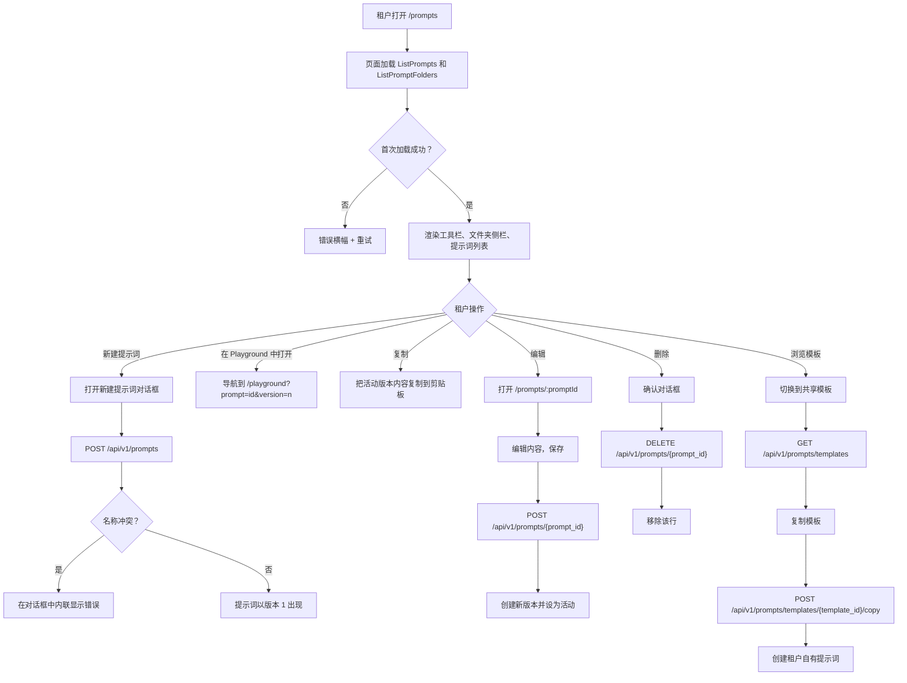
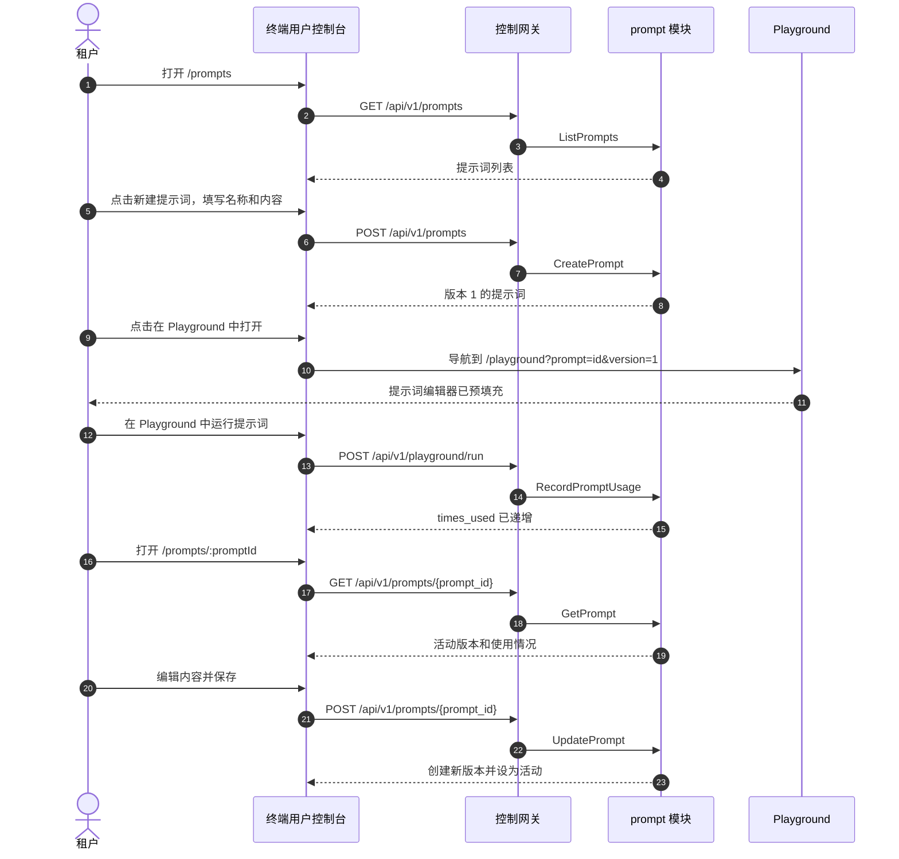

# 提示词管理与提示词库 — 需求分析与 UI/UX 设计

| 属性 | 内容 |
| --- | --- |
| 功能点 | 提示词管理与提示词库（提示词模板）——创建、版本化、按文件夹组织、搜索并复用提示词；在 Playground 中打开提示词；复制提示词文本；每个提示词的使用统计。管理端管理跨租户的提示词列表（脱敏）、提示词使用分析，以及租户可浏览并复制的共享提示词模板库（backlog 第 43 行） |
| 文档范围 | 需求分析、竞品调研、面向 `/prompts` 的终端用户提示词页面、面向 `/admin/prompts` 的管理端提示词页面、页面 → API 面映射表，以及编号的验收标准 |
| 所属模块 | `prompt`（新增——负责提示词生命周期、版本化、文件夹、使用计数器和共享模板库）、`infer`（只读：提示词引用的模型目录）、`audit`（只读：提示词操作的审计事件）、`pkg/server` 网关（用户面与管理面前缀绑定）、`web` 终端用户控制台（`UserShell` 中的 `PromptsPage`）与管理端控制台（`AdminShell` 中的 `AdminPromptsPage`） |
| 相关文档 | [架构设计](./architecture.zh-cn.md) — §2.5 `metering`、§3.1（管理端/用户面分离）· [请求日志与 API Playground](./request-logs-playground.zh-cn.md) — 提示词打开的兄弟 Playground 面 · [模型目录与部署](./model-catalog-deployment.zh-cn.md) — 提示词引用的模型目录 · [审计日志](./audit-logging.zh-cn.md) — 提示词操作发出的审计事件 · [控制台面分离](./console-surface-separation.zh-cn.md) — 本功能所在的两个面、`UserShell`/`AdminShell` 约定、脱敏投影规则 |
| 状态 | 设计完成，已移交给架构师智能体 |

---

## 1. 背景与竞品调研

### 1.1 为什么现在做提示词管理

go-taas 通过 OpenAI 兼容网关（功能 #2、#12）提供推理服务：智能体发送请求并实时收到补全结果。但真正构建集成的租户很快就会积累一批提示词——系统指令、少样本示例、输出格式约束——他们会在请求、模型和应用之间反复复用。如果没有一个地方来存储、版本化并组织这些提示词，租户就只能手动把它们粘贴到 Playground 或代码里，丢失哪个版本有效，也无法与队友分享调优好的提示词。每个主流推理平台都为此提供了**提示词库 / 提示词模板**能力：一次存储提示词，版本化它，组织它，并复用。

本功能新增**提示词管理与提示词库**能力：租户创建提示词、版本化、按文件夹组织、搜索、在 Playground 中打开、复制文本，并查看使用频率。平台管理员管理跨租户的提示词列表（脱敏）、提示词使用分析，以及租户可浏览并复制的共享提示词模板库。它是提示词工程能力中最小、可独立交付的增量：把「我一直在重复输入同一个提示词」变成「一次存储、版本化、随处复用」。它是一个**新增的 `prompt` 模块**，负责存储提示词元数据与内容——实时推理路径没有任何变化。

### 1.2 竞品如何实现提示词管理

| 产品 | 提示词面 | 创建 | 版本化 | 组织 | 复用 | 常见缺陷 |
| --- | --- | --- | --- | --- | --- | --- |
| **OpenAI Platform** | Playground + 示例 | 在 Playground 中保存提示词 | 无显式版本化 | 无文件夹 | 在 Playground 中复用 | 提示词与 Playground 会话绑定，可能丢失 |
| **Anthropic Console** | 提示词库 | 保存提示词 | 版本化 | 集合 | 在控制台中复用 | 仅限控制台；无 API 获取提示词 |
| **阿里云百炼** | 提示词模板 | 创建自定义模板；预置模板 | 无显式版本化 | 类型筛选 + 搜索 | 复制到应用、调用 API | 预置与自定义分离；变量使用 `${var}` 语法 |
| **火山方舟** | 提示词模板 | 创建模板 | 无显式版本化 | 搜索 | 在应用中复用 | 模板市场；逐行校验 |
| **百度千帆** | 提示词工程 | 创建提示词 | 版本化 | 文件夹 | 在应用中复用 | 提示词工程工作区 |

### 1.3 提炼的模式与决策

值得采纳的模式：

1. **提示词是一个可复用的模板，包含名称、内容、模型和变量。** 每个调研的平台都把提示词当作一个命名、可复用的单元。go-taas 采用同样的模型：提示词有名称、内容、可选的目标模型、可选的文件夹，以及可选的 `${var}` 变量。
2. **版本化。** Anthropic 和百度千帆对提示词做版本化；每次编辑都会创建新版本，租户可以回滚。go-taas 采用版本化：每次编辑都会创建新版本，租户可以回滚到之前的版本。
3. **按文件夹组织。** 百度千帆和 Anthropic 用文件夹/集合组织提示词。go-taas 采用文件夹。
4. **在 Playground 中复用。** 阿里云百炼把提示词填充到应用的提示词编辑器；OpenAI 在 Playground 中复用提示词。go-taas 采用「在 Playground 中打开」：提示词打开到现有 Playground（功能 #12）并预填充。
5. **复制提示词文本。** 阿里云百炼提供「复制 prompt」。go-taas 采用复制操作。
6. **共享模板库。** 阿里云百炼提供预置模板；火山方舟有模板市场。go-taas 采用共享提示词模板库，由管理员策划，租户浏览并复制。
7. **使用跟踪。** 了解提示词的使用频率和最后使用时间，有助于租户清理和改进。go-taas 跟踪轻量级的每提示词使用计数器。

要避免的缺陷：提示词与 Playground 会话绑定而丢失（go-taas 持久化存储提示词）；无版本化导致无法回滚（go-taas 对每次编辑做版本化）；提示词内容跨租户泄露（go-taas 在管理端面脱敏内容）；变量未校验（go-taas 校验 `${var}` 语法）；以及共享模板被租户就地编辑而破坏所有人的使用（go-taas 把模板复制为租户自有提示词，而不是共享一个实时引用）。

**go-taas 的决策**（依据自主决策规则记录理由）：

| # | 决策 | 理由 |
| --- | --- | --- |
| D1 | **提示词管理位于两个面。** 终端用户：路由 `/prompts`，API 前缀 `/api/v1/prompts/*`——租户创建并管理自己的提示词。管理端：路由 `/admin/prompts`，API 前缀 `/api/v1/admin/prompts/*`——操作员查看所有租户的提示词（脱敏）、查看提示词使用分析，并策划共享模板库 | 提示词管理既是租户自助能力（租户存储并复用自己的提示词），也是操作员关注点（操作员必须看到跨租户的提示词使用情况并策划共享模板）。与 webhook（功能 #23）、账单报表（功能 #25）和批量推理（功能 #42）的双面模式一致 |
| D2 | **提示词由名称、内容、模型、文件夹和变量定义。** `CreatePrompt` 接收 `name`、`content`、可选的 `model_id`、可选的 `folder_id` 和可选的 `variables`。租户复用的是活动版本的内容。变量使用 `${var}` 语法 | 名称/内容/模型/文件夹模型与调研的平台一致，并给控制台一个清晰的提示词记录。变量让租户可以参数化提示词以便复用 |
| D3 | **提示词版本化：每次编辑都会创建新版本。** `UpdatePrompt` 创建新版本并设为活动；`RollbackPrompt` 把之前的版本恢复为活动。版本历史不可变 | 版本化让租户可以迭代提示词并回滚糟糕的编辑，与 Anthropic 和百度千帆一致。不可变历史保证审计轨迹诚实 |
| D4 | **提示词按租户隔离并脱敏。** 用户面的 `CreatePrompt` 不接受 `organization_id` 过滤（调用者的组织是隐式的），绝不暴露其他租户的提示词。管理面前缀列出所有提示词但脱敏内容（脱敏投影规则，功能 #17） | 遵循功能 #17 的脱敏投影规则：租户的提示词绝不能泄露另一个租户的内容。管理端面看到提示词元数据和聚合使用情况，但看不到原始提示词文本 |
| D5 | **「在 Playground 中打开」导航到 `/playground?prompt=<prompt_id>&version=<version>`。** Playground（功能 #12）读取查询参数，并用活动版本的内容预填充其提示词编辑器 | 复用是提示词库的意义所在；打开到现有 Playground 是摩擦最小的复用路径，并复用功能 #12 的面 |
| D6 | **提示词使用是轻量级计数器，不是完整计量。** 每次提示词在 Playground 中打开并运行时，`prompt` 模块递增 `times_used` 并设置 `last_used_at`。`GetPromptUsage` 返回这些计数器 | 完整的 token 计量已经在 `metering` 管线中完成（功能 #4）；提示词模块只需要一个轻量级的「这个提示词用了多少次」信号，用于清理和改进 |
| D7 | **提示词块中的新错误码（12701–12708）**：**12701 `CodePromptNotFound`**、**12702 `CodePromptVersionNotFound`**、**12703 `CodePromptNameConflict`**、**12704 `CodePromptFolderNotFound`**、**12705 `CodePromptInvalidContent`**、**12706 `CodePromptInvalidVariable`**、**12707 `CodePromptTemplateNotFound`**、**12708 `CodePromptFolderNotEmpty`**。范围/格式校验在适用处复用现有错误码 | 提示词管理是一个新模块（D1），因此其错误码位于批量块（126xx）之后的新块中；不同的错误码让每种失败模式都可操作 |
| D8 | **共享模板库是复制即用。** 管理员创建/编辑/删除共享模板；租户浏览并把一个复制为租户自有提示词（`CopyPromptTemplate`）。租户绝不就地编辑共享模板 | 复制即用防止一个租户破坏所有人的共享模板，并与阿里云百炼的预置模板复制流程一致 |
| D9 | **提示词操作会被审计。** 提示词的创建、更新、回滚、删除和模板复制会被审计（功能 #15），记为 `prompt.created` / `prompt.updated` / `prompt.rolled_back` / `prompt.deleted` / `prompt.copied_from_template`。底层推理已由现有管线计量和记录 | 本功能存储提示词元数据和内容；只有新的提示词操作需要新的审计事件 |

### 1.4 范围边界

**范围内**：两个控制台的提示词页面（`/prompts` 和 `/admin/prompts`），包含提示词的创建/编辑/删除、版本化与回滚、文件夹组织、搜索/筛选、在 Playground 中打开、复制、每提示词使用统计，以及（管理端）跨租户提示词列表、使用分析和共享模板库。

**范围外**（由其他功能点跟踪）：实时推理 Playground（功能 #12）、模型目录（功能 #2）、请求日志与追踪（功能 #12、#27）、审计日志查看器（功能 #15）、批量推理（功能 #42）。

---

## 2. 用户角色

| 角色 | 描述 | 与提示词管理的交互 |
| --- | --- | --- |
| **租户开发者 / 智能体** | 针对 go-taas 推理 API 构建集成的消费者 | 打开 `/prompts`，创建并版本化提示词，按文件夹组织，并在 Playground 中打开 |
| **租户提示词工程师** | 设计并调优系统指令和少样本示例的租户 | 迭代提示词版本，回滚糟糕的编辑，并从模板库复制共享模板 |
| **平台管理员** | 运行 go-taas 集群的操作员 | 打开 `/admin/prompts`，查看所有租户的提示词（脱敏）、查看提示词使用分析，并策划共享模板库 |

> 术语：消费者侧调用方称为**智能体**（英文 "Agent"），与仓库约定一致。操作员侧调用方称为**平台管理员**（英文 "Platform administrator"）。

---

## 3. 用户故事

| # | 作为… | 我想要… | 以便… |
| --- | --- | --- | --- |
| US1 | 租户开发者 | 用名称、内容、模型和文件夹创建一个提示词 | 我可以一次存储可复用的提示词，而不是反复输入 |
| US2 | 租户提示词工程师 | 编辑提示词并保留其版本历史 | 我可以迭代提示词并回滚糟糕的编辑 |
| US3 | 租户开发者 | 把提示词按文件夹组织并搜索 | 我可以快速找到正确的提示词 |
| US4 | 租户开发者 | 在 Playground 中打开提示词 | 我可以针对模型测试它，而无需复制文本 |
| US5 | 租户开发者 | 复制提示词文本 | 我可以粘贴到代码中或分享 |
| US6 | 租户开发者 | 查看每个提示词的使用频率 | 我可以清理未使用的提示词并改进热门的 |
| US7 | 租户开发者 | 浏览共享模板库并复制模板 | 我可以从调优好的提示词开始 |
| US8 | 平台管理员 | 查看所有租户的提示词及其使用情况 | 我可以监控提示词使用并发现滥用 |
| US9 | 平台管理员 | 策划共享提示词模板库 | 我可以给租户一组调优好的起始提示词 |

---

## 4. 功能需求

### FR1 — 创建提示词

- **FR1.1** `CreatePrompt`（`POST /api/v1/prompts`）用 `name`、`content`、可选的 `model_id`、可选的 `folder_id` 和可选的 `variables` 创建提示词。它返回 `version = 1` 的提示词（D2、D3）。
- **FR1.2** `name` 必填，在调用者组织内唯一，且 ≤ 128 字符。重复名称返回 **12703 `CodePromptNameConflict`**（D7）。
- **FR1.3** `content` 必填且 ≤ 6144 字符。空或超长内容返回 **12705 `CodePromptInvalidContent`**（D7）。
- **FR1.4** `variables` 使用 `${var}` 语法；`CreatePrompt` 校验每个 `${var}` 引用格式正确（花括号配对、名称非空）。无效引用返回 **12706 `CodePromptInvalidVariable`**（D7）。
- **FR1.5** `model_id` 和 `folder_id` 可选。未知的 `folder_id` 返回 **12704 `CodePromptFolderNotFound`**（D7）。

### FR2 — 提示词版本化

- **FR2.1** `UpdatePrompt`（`POST /api/v1/prompts/{prompt_id}`）根据提交的 `content`（以及可选的 `model_id`、`variables`）创建新版本并设为活动。它返回新版本（D3）。
- **FR2.2** `ListPromptVersions`（`GET /api/v1/prompts/{prompt_id}/versions`）返回提示词的版本历史，最新在前，包含 `version`、`content`、`model_id`、`variables`、`created_at` 和 `created_by`。未知的 `prompt_id` 返回 **12701 `CodePromptNotFound`**（D7）。
- **FR2.3** `RollbackPrompt`（`POST /api/v1/prompts/{prompt_id}/rollback`）把之前的版本恢复为活动。未知版本返回 **12702 `CodePromptVersionNotFound`**（D7）。

### FR3 — 按文件夹组织

- **FR3.1** `CreatePromptFolder`（`POST /api/v1/prompts/folders`）用 `name`（必填，≤ 128 字符，组织内唯一）创建文件夹。
- **FR3.2** `ListPromptFolders`（`GET /api/v1/prompts/folders`）列出调用者的文件夹及其提示词数量。
- **FR3.3** `DeletePromptFolder`（`DELETE /api/v1/prompts/folders/{folder_id}`）删除空文件夹。非空文件夹返回 **12708 `CodePromptFolderNotEmpty`**（D7）。

### FR4 — 在 Playground 中复用与复制

- **FR4.1** 「在 Playground 中打开」导航到 `/playground?prompt={prompt_id}&version={version}`；Playground（功能 #12）读取查询参数，并用活动版本的内容预填充其提示词编辑器（D5）。
- **FR4.2** 「复制提示词」把活动版本的内容复制到剪贴板（D5）。

### FR5 — 使用跟踪

- **FR5.1** 每次提示词在 Playground 中打开并运行时，`prompt` 模块递增 `times_used` 并设置 `last_used_at`（D6）。
- **FR5.2** `GetPromptUsage`（`GET /api/v1/prompts/{prompt_id}/usage`）返回 `times_used` 和 `last_used_at`（D6）。

### FR6 — 共享模板库（管理端）

- **FR6.1** `AdminCreateTemplate`（`POST /api/v1/admin/prompts/templates`）用 `name`、`content`、可选的 `model_id` 和可选的 `variables` 创建共享模板。
- **FR6.2** `AdminListTemplates`（`GET /api/v1/admin/prompts/templates`）列出共享模板。
- **FR6.3** `AdminUpdateTemplate`（`POST /api/v1/admin/prompts/templates/{template_id}`）和 `AdminDeleteTemplate`（`DELETE /api/v1/admin/prompts/templates/{template_id}`）管理共享模板。未知的 `template_id` 返回 **12707 `CodePromptTemplateNotFound`**（D7）。
- **FR6.4** `ListPromptTemplates`（`GET /api/v1/prompts/templates`）让租户浏览共享模板（名称、内容预览、模型、变量）。
- **FR6.5** `CopyPromptTemplate`（`POST /api/v1/prompts/templates/{template_id}/copy`）把共享模板复制为租户自有提示词（D8）。未知的 `template_id` 返回 **12707 `CodePromptTemplateNotFound`**（D7）。

### FR7 — 面与 API 绑定

- **FR7.1** 提示词页面位于**终端用户面**：路由 `/prompts`，API 前缀 `/api/v1/prompts/*`。它被添加到 `UserShell` 导航（功能 #17），名为「Prompts」。
- **FR7.2** 提示词页面位于**管理端面**：路由 `/admin/prompts`，API 前缀 `/api/v1/admin/prompts/*`。它被添加到 `AdminShell` 导航（功能 #17），名为「Prompts」。
- **FR7.3** 终端用户页面只调用 `/api/v1/prompts/*` 路由，不包含任何 `/api/v1/admin/*` 字符串；管理端页面只调用 `/api/v1/admin/prompts/*` 路由，不包含任何 `/api/v1/prompts/*` 字符串（功能 #17）。
- **FR7.4** 管理端面脱敏提示词内容（D4）：它显示提示词元数据和聚合使用情况，但不显示原始提示词文本。

---

## 5. 页面与流程设计

### 5.1 面分配

| 功能 | 面 | Web 路由 | API 前缀 |
| --- | --- | --- | --- |
| 创建提示词 | 终端用户 | `/prompts` | `/api/v1/prompts` |
| 提示词列表 | 终端用户 | `/prompts` | `/api/v1/prompts` |
| 提示词详情与版本 | 终端用户 | `/prompts/:promptId` | `/api/v1/prompts/{prompt_id}` |
| 更新 / 回滚提示词 | 终端用户 | `/prompts/:promptId` | `/api/v1/prompts/{prompt_id}` |
| 文件夹 | 终端用户 | `/prompts` | `/api/v1/prompts/folders` |
| 提示词使用 | 终端用户 | `/prompts/:promptId` | `/api/v1/prompts/{prompt_id}/usage` |
| 浏览共享模板 | 终端用户 | `/prompts` | `/api/v1/prompts/templates` |
| 复制共享模板 | 终端用户 | `/prompts` | `/api/v1/prompts/templates/{template_id}/copy` |
| 在 Playground 中打开 | 终端用户 | `/playground?prompt=…` | `/api/v1/playground/*`（功能 #12） |
| 提示词列表（所有租户，脱敏） | 管理端 | `/admin/prompts` | `/api/v1/admin/prompts` |
| 提示词使用分析 | 管理端 | `/admin/prompts` | `/api/v1/admin/prompts/usage` |
| 共享模板库 | 管理端 | `/admin/prompts` | `/api/v1/admin/prompts/templates` |

上面的每个页面和 API 调用都位于其分配的面；终端用户页面绝不调用 `/api/v1/admin/*` 路由，管理端页面绝不调用 `/api/v1/prompts/*` 路由。终端用户面使用用户会话域；管理端面使用管理端会话域。

### 5.2 页面地图

| 页面 / 组件 | 用途 |
| --- | --- |
| **提示词页面**（`/prompts`） | 创建、版本化、组织、搜索并复用提示词；浏览并复制共享模板 |
| **提示词详情页面**（`/prompts/:promptId`） | 查看单个提示词的活动版本、版本历史、使用情况和操作（编辑、回滚、在 Playground 中打开、复制、删除） |
| **管理端提示词页面**（`/admin/prompts`） | 查看所有租户的提示词（脱敏）、提示词使用分析和共享模板库 |

### 5.3 页面：`/prompts` — 提示词（终端用户）

**用途**：给租户一个单一界面来创建、版本化、组织、搜索并复用提示词，以及浏览并复制共享模板。

**面**：终端用户 — 路由 `/prompts`，API `/api/v1/prompts/*`。

**布局**：在 `UserShell`（功能 #17）内渲染。页面头部（「Prompts」，副标题「存储、版本化并复用提示词」）带一个**新建提示词**主操作。下方：

1. **工具栏** — 一个搜索框（搜索名称和内容）、一个文件夹筛选（下拉）、一个模型筛选（下拉），以及一个**模板**开关，把列表在「我的提示词」和「共享模板」之间切换。
2. **文件夹侧栏** — 一个左侧栏列出文件夹（「全部提示词」、每个文件夹及其提示词数量、「未归档」）。选择文件夹会筛选列表。
3. **提示词列表** — 一个表格，列为：**名称**、**模型**、**文件夹**、**版本**、**已用**、**最后使用**、**更新**、**操作**。行操作：**在 Playground 中打开**、**复制**、**编辑**、**删除**。表格上方有一个**新建提示词**主操作。

**交互状态**：

| 状态 | 行为 |
| --- | --- |
| 默认 | 工具栏、文件夹侧栏和提示词列表从首次成功加载渲染 |
| 加载中 | 骨架表格；新建提示词和工具栏被禁用 |
| 空 | 「还没有提示词。」并提示创建一个；新建提示词操作保持可见 |
| 错误 | 带消息和重试按钮的错误横幅；页面保留最后的好数据并显示「显示过期数据」横幅 |
| 禁用 | 请求进行中时新建提示词被禁用；提示词删除中时删除被禁用；列表加载中时工具栏被禁用 |
| 权限不足 | 没有所需角色的会话收到 10036，页面显示标准权限不足状态（功能 #17），带返回用户首页的链接 |

**新建提示词对话框字段**：名称（文本，必填，≤ 128 字符）、内容（文本域，必填，≤ 6144 字符）、模型（下拉，可选，来自模型目录）、文件夹（下拉，可选，来自调用者的文件夹）、变量（标签输入，可选，`${var}` 语法）。校验：名称必填且唯一、内容必填、变量格式正确。错误文案：「输入提示词名称」、「已存在同名提示词」、「输入提示词内容」、「提示词内容必须 ≤ 6144 字符」、「变量必须使用 ${var} 语法」。

**提示词列表表格列**：名称、模型、文件夹、版本、已用、最后使用、更新、操作。可按名称、模型、文件夹、版本、已用、最后使用和更新排序。可按文件夹和模型筛选。可按名称和内容搜索。分页（点式分页）。

**创建提示词流程**：提交对话框调用 `CreatePrompt`，然后新提示词以 `version = 1` 出现在列表中。`12703` 名称冲突在对话框中内联显示错误。

**在 Playground 中打开流程**：点击**在 Playground 中打开**导航到 `/playground?prompt={prompt_id}&version={version}`；Playground 用活动版本的内容预填充其提示词编辑器（D5）。

**复制流程**：点击**复制**把活动版本的内容复制到剪贴板，并显示「已复制」提示。

**删除流程**：点击**删除**打开确认对话框（「删除此提示词及其所有版本？」），带**删除**（危险）和**保留**（次要）操作。确认后调用 `DeletePrompt` 并移除该行。

### 5.4 页面：`/prompts/:promptId` — 提示词详情（终端用户）

**用途**：查看单个提示词的活动版本、版本历史、使用情况和操作。

**面**：终端用户 — 路由 `/prompts/:promptId`，API `/api/v1/prompts/{prompt_id}/*`。

**布局**：在 `UserShell` 内渲染。页面头部带提示词名称和一个**返回提示词**次要操作。下方：

1. **提示词编辑器** — 活动版本的 `content`、`model_id` 和 `variables` 的只读视图，带一个**编辑**操作，把编辑器切换到可编辑模式。
2. **使用情况** — 一个卡片，显示 `times_used` 和 `last_used_at`。
3. **版本历史** — 一个版本列表，最新在前，每个包含 `version`、`created_at`、`created_by`，以及一个**回滚**操作（对非活动版本启用）。
4. **操作** — **在 Playground 中打开**、**复制**、**编辑**、**删除**。

**交互状态**：

| 状态 | 行为 |
| --- | --- |
| 默认 | 提示词编辑器、使用情况、版本历史和操作从首次成功加载渲染 |
| 加载中 | 骨架卡片；操作被禁用 |
| 错误 | 带消息和重试按钮的错误横幅；页面保留最后的好数据并显示「显示过期数据」横幅 |
| 禁用 | 活动版本的回滚被禁用；保存进行中时编辑被禁用；删除进行中时删除被禁用 |
| 权限不足 | 没有所需角色的会话收到 10036，页面显示标准权限不足状态（功能 #17），带返回用户首页的链接 |

**编辑流程**：点击**编辑**把编辑器切换到可编辑模式，带活动版本的内容、模型和变量。保存调用 `UpdatePrompt`，创建新版本并设为活动；编辑器返回只读模式，版本历史新增一行。

**回滚流程**：点击非活动版本上的**回滚**打开确认对话框（「回滚到版本 N？这会创建一个新的活动版本。」），带**回滚**（主）和**保留当前**（次要）操作。确认后调用 `RollbackPrompt` 并更新活动版本。

### 5.5 页面：`/admin/prompts` — 提示词（管理端）

**用途**：给操作员一个单一界面来查看所有租户的提示词（脱敏）、查看提示词使用分析，并策划共享模板库。

**面**：管理端 — 路由 `/admin/prompts`，API `/api/v1/admin/prompts/*`。

**布局**：在 `AdminShell`（功能 #17）内渲染。页面头部（「Prompts」，副标题「监控跨租户的提示词使用并策划共享模板」）。下方：

1. **标签页** — **全部提示词**、**使用情况**和**模板**。
2. **全部提示词标签页** — 一个表格，列为：**名称**、**组织**、**模型**、**版本**、**已用**、**最后使用**、**更新**。内容被脱敏（D4）：没有内容列，也没有查看内容的行操作。表格上方有一个**刷新**操作。
3. **使用情况标签页** — 跨租户提示词使用的摘要：提示词总数、总使用次数、最常用的提示词（前 10），以及按组织的分解。图表：按组织的使用柱状图和最常用提示词的柱状图。
4. **模板标签页** — 共享模板库：一个表格，列为**名称**、**模型**、**已用**、**更新**、**操作**（编辑、删除），以及一个**新建模板**主操作。

**交互状态**：

| 状态 | 行为 |
| --- | --- |
| 默认 | 活动标签页从首次成功加载渲染 |
| 加载中 | 骨架表格/图表；刷新和新建模板被禁用 |
| 空 | 「还没有提示词。」（全部提示词）、「还没有使用数据。」（使用情况）、「还没有模板。」（模板） |
| 错误 | 带消息和重试按钮的错误横幅；页面保留最后的好数据并显示「显示过期数据」横幅 |
| 禁用 | 请求进行中时新建模板被禁用；模板删除中时删除被禁用 |
| 权限不足 | 没有所需角色的会话收到 10036，页面显示标准权限不足状态（功能 #17），带返回管理端首页的链接 |

**全部提示词表格列**：名称、组织、模型、版本、已用、最后使用、更新。可按名称、组织、模型、版本、已用、最后使用和更新排序。可按组织和模型筛选。分页（点式分页）。内容被脱敏（D4）。

**新建模板对话框字段**：名称（文本，必填，≤ 128 字符）、内容（文本域，必填，≤ 6144 字符）、模型（下拉，可选）、变量（标签输入，可选）。校验：名称必填、内容必填、变量格式正确。错误文案：「输入模板名称」、「输入模板内容」、「变量必须使用 ${var} 语法」。

**删除模板流程**：点击**删除**打开确认对话框（「删除此共享模板？已复制它的租户保留其副本。」），带**删除**（危险）和**保留**（次要）操作。确认后调用 `AdminDeleteTemplate` 并移除该行。

### 5.6 流程

---

## 6. API 面影响

提示词 RPC 属于 **`prompt` 模块**（D1），通过控制网关在**用户前缀** `/api/v1/prompts/*` 和**管理端前缀** `/api/v1/admin/prompts/*` 上以 HTTP 提供（D1）。`infer` 模块提供提示词引用的模型目录；`audit` 模块记录提示词操作事件（D9）。

| RPC | 路由 | 前缀 | 状态 | 用途 |
| --- | --- | --- | --- | --- |
| `CreatePrompt`（`taas.prompt.v1`） | `POST /api/v1/prompts` | 用户 | **新增** | 创建提示词（名称、内容、模型、文件夹、变量） |
| `ListPrompts`（`taas.prompt.v1`） | `GET /api/v1/prompts` | 用户 | **新增** | 列出调用者的提示词 |
| `GetPrompt`（`taas.prompt.v1`） | `GET /api/v1/prompts/{prompt_id}` | 用户 | **新增** | 获取提示词的活动版本和元数据 |
| `UpdatePrompt`（`taas.prompt.v1`） | `POST /api/v1/prompts/{prompt_id}` | 用户 | **新增** | 创建新版本并设为活动 |
| `DeletePrompt`（`taas.prompt.v1`） | `DELETE /api/v1/prompts/{prompt_id}` | 用户 | **新增** | 删除提示词及其所有版本 |
| `ListPromptVersions`（`taas.prompt.v1`） | `GET /api/v1/prompts/{prompt_id}/versions` | 用户 | **新增** | 列出提示词的版本历史 |
| `RollbackPrompt`（`taas.prompt.v1`） | `POST /api/v1/prompts/{prompt_id}/rollback` | 用户 | **新增** | 把之前的版本恢复为活动 |
| `CreatePromptFolder`（`taas.prompt.v1`） | `POST /api/v1/prompts/folders` | 用户 | **新增** | 创建文件夹 |
| `ListPromptFolders`（`taas.prompt.v1`） | `GET /api/v1/prompts/folders` | 用户 | **新增** | 列出调用者的文件夹 |
| `DeletePromptFolder`（`taas.prompt.v1`） | `DELETE /api/v1/prompts/folders/{folder_id}` | 用户 | **新增** | 删除空文件夹 |
| `GetPromptUsage`（`taas.prompt.v1`） | `GET /api/v1/prompts/{prompt_id}/usage` | 用户 | **新增** | 获取提示词的使用计数器 |
| `RecordPromptUsage`（`taas.prompt.v1`） | `POST /api/v1/prompts/{prompt_id}/usage` | 用户 | **新增** | 递增提示词的使用计数器 |
| `ListPromptTemplates`（`taas.prompt.v1`） | `GET /api/v1/prompts/templates` | 用户 | **新增** | 浏览共享模板 |
| `CopyPromptTemplate`（`taas.prompt.v1`） | `POST /api/v1/prompts/templates/{template_id}/copy` | 用户 | **新增** | 把共享模板复制为租户自有提示词 |
| `AdminListPrompts`（`taas.prompt.v1`） | `GET /api/v1/admin/prompts` | 管理端 | **新增** | 列出所有租户的提示词（脱敏） |
| `AdminPromptUsage`（`taas.prompt.v1`） | `GET /api/v1/admin/prompts/usage` | 管理端 | **新增** | 获取跨租户的提示词使用分析 |
| `AdminCreateTemplate`（`taas.prompt.v1`） | `POST /api/v1/admin/prompts/templates` | 管理端 | **新增** | 创建共享模板 |
| `AdminListTemplates`（`taas.prompt.v1`） | `GET /api/v1/admin/prompts/templates` | 管理端 | **新增** | 列出共享模板 |
| `AdminUpdateTemplate`（`taas.prompt.v1`） | `POST /api/v1/admin/prompts/templates/{template_id}` | 管理端 | **新增** | 更新共享模板 |
| `AdminDeleteTemplate`（`taas.prompt.v1`） | `DELETE /api/v1/admin/prompts/templates/{template_id}` | 管理端 | **新增** | 删除共享模板 |

**给架构师智能体的契约说明**：

1. `CreatePrompt` 接收 `name`、`content`、可选的 `model_id`、可选的 `folder_id` 和可选的 `variables`。它返回 `version = 1` 的提示词（D2、D3）。
2. `UpdatePrompt` 创建新版本并设为活动；`RollbackPrompt` 把之前的版本恢复为活动；`ListPromptVersions` 返回不可变历史（FR2.1–FR2.3）。
3. `CreatePromptFolder` / `ListPromptFolders` / `DeletePromptFolder` 管理文件夹；非空文件夹返回 12708（FR3.1–FR3.3）。
4. `RecordPromptUsage` 递增 `times_used` 并设置 `last_used_at`；`GetPromptUsage` 返回它们（FR5.1、FR5.2）。
5. 提示词在用户面按租户隔离（D4）：它只聚合调用者自己组织的提示词。管理面前缀列出所有提示词但脱敏内容（D4）。
6. 共享模板库是复制即用（D8）：`AdminCreateTemplate`/`AdminUpdateTemplate`/`AdminDeleteTemplate` 管理共享模板；`ListPromptTemplates` 让租户浏览它们；`CopyPromptTemplate` 把一个复制为租户自有提示词。
7. 线上约定不变：成功返回 HTTP 200，业务错误为 `{"code": <int>, "message": "..."}`，int64 字段序列化为 JSON 字符串。

错误码（现有块，`pkg/errors/codes.go`）：

| 条件 | 错误码 | 常量 | 说明 |
| --- | --- | --- | --- |
| 未知的 `prompt_id` | 12701 | `CodePromptNotFound` | **新增**（D7） |
| 回滚中的未知版本 | 12702 | `CodePromptVersionNotFound` | **新增**（D7） |
| 重复的提示词名称 | 12703 | `CodePromptNameConflict` | **新增**（D7） |
| 未知的 `folder_id` | 12704 | `CodePromptFolderNotFound` | **新增**（D7） |
| 空或超长内容 | 12705 | `CodePromptInvalidContent` | **新增**（D7） |
| 无效的 `${var}` 引用 | 12706 | `CodePromptInvalidVariable` | **新增**（D7） |
| 未知的 `template_id` | 12707 | `CodePromptTemplateNotFound` | **新增**（D7） |
| 删除非空文件夹 | 12708 | `CodePromptFolderNotEmpty` | **新增**（D7） |

---

## 7. 验收标准

| # | 标准 | 级别 |
| --- | --- | --- |
| AC1 | `CreatePrompt` 返回 `version = 1` 的提示词；重复名称返回 12703，空/超长内容返回 12705，无效的 `${var}` 引用返回 12706 | FVT |
| AC2 | `UpdatePrompt` 创建新版本并设为活动；`ListPromptVersions` 返回历史；`RollbackPrompt` 恢复之前的版本；未知版本返回 12702 | FVT |
| AC3 | `CreatePromptFolder` / `ListPromptFolders` / `DeletePromptFolder` 管理文件夹；非空文件夹返回 12708 | FVT |
| AC4 | `RecordPromptUsage` 递增 `times_used` 并设置 `last_used_at`；`GetPromptUsage` 返回它们 | FVT |
| AC5 | 提示词在用户面按租户隔离：它只聚合调用者自己组织的提示词，绝不暴露其他租户的提示词 | FVT |
| AC6 | `AdminListPrompts` 列出所有租户的提示词且内容脱敏；`AdminPromptUsage` 返回使用分析；`AdminCreateTemplate`/`AdminUpdateTemplate`/`AdminDeleteTemplate` 管理共享模板；`CopyPromptTemplate` 把一个复制为租户自有提示词 | FVT |
| AC7 | `/prompts` 页面从首次成功加载渲染工具栏、文件夹侧栏和提示词列表，带新建提示词操作 | E2E |
| AC8 | 新建提示词对话框校验名称/内容/变量并创建以 `version = 1` 出现的提示词；名称冲突显示内联错误 | E2E |
| AC9 | `/prompts/:promptId` 详情页面显示活动版本、使用情况和版本历史；编辑创建新版本；回滚恢复之前的版本 | E2E |
| AC10 | 在 Playground 中打开导航到 `/playground?prompt=id&version=n` 并预填充提示词编辑器；复制把内容复制到剪贴板 | E2E |
| AC11 | `/admin/prompts` 页面列出所有租户的提示词，带组织列和脱敏内容，显示使用分析，并策划共享模板库 | E2E |
| AC12 | 提示词页面只在终端用户面可达：路由 `/prompts`，每个 API 调用使用 `/api/v1/prompts/*` 前缀且不含 `/api/v1/admin/*` 字符串；管理端页面只使用 `/api/v1/admin/prompts/*` 且不含 `/api/v1/prompts/*` 字符串 | E2E（面分离） |
| AC13 | 没有所需角色的会话在 `/prompts` 和 `/admin/prompts` 页面收到 10036，页面显示标准权限不足状态 | E2E |

---

## 8. 范围外（由其他功能点跟踪）

| 项目 | 位置 |
| --- | --- |
| 实时推理 Playground | 功能 #12 请求日志与 Playground |
| 模型目录 | 功能 #2 模型目录与部署 |
| 请求日志与追踪 | 功能 #12、#27 |
| 审计日志查看器 | 功能 #15 审计日志 |
| 批量推理 | 功能 #42 批量推理 |