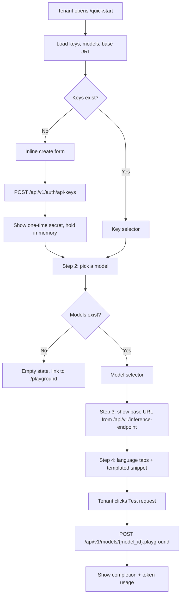
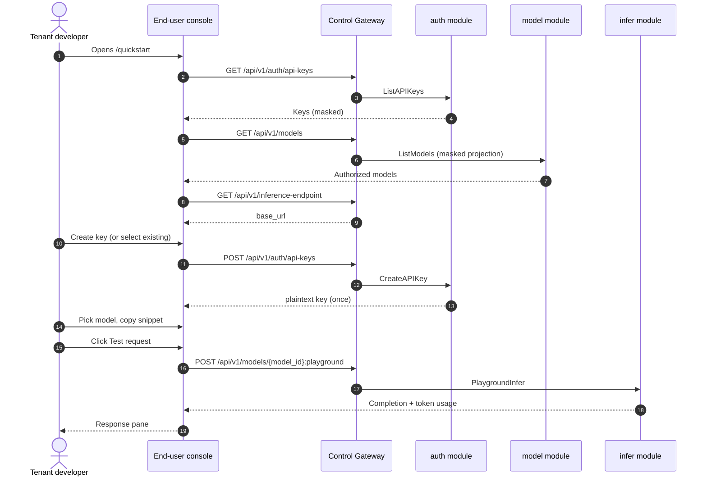

# SDK / Quickstart — Requirement Analysis and UI/UX Design

| Attribute | Content |
| --- | --- |
| Feature point | SDK / Quickstart — an end-user page with OpenAI-compatible code snippets (Python / Node / curl) and API-key setup for consuming models (backlog row 21) |
| Document scope | Requirement analysis, competitive research, the end-user-surface quickstart page design for `/quickstart` (create/select an API key, pick a model, show the inference base URL, copy a pre-filled OpenAI-compatible snippet, run a test request), the page → API surface table, and numbered acceptance criteria |
| Owning modules | `web` end-user console (`QuickstartPage` in `UserShell`), `pkg/server` gateway (user-prefix bindings), `auth` (API-key create/list, reused), `model` (masked model list, reused), `infer` (model-based playground proxy, reused), plus a new config-driven inference-endpoint read |
| Related documents | [Architecture Design](./architecture.md) — §3.2 data-plane gateway, §3.3 API-key authentication chain · [Console Surface Separation](./console-surface-separation.md) — the end-user surface this page lives on, the masked `GET /api/v1/models` projection (D15), the model-based playground (D14) · [API Key Lifecycle Management](./api-key-management.md) — the create/list/revoke surface this page reuses · [Model Catalog & One-Click Deployment](./model-catalog-deployment.md) — the model list this page consumes · [Request Logs & API Playground](./request-logs-playground.md) — the playground proxy this page reuses for the test request |
| Status | Design complete, handed to the Architect agent |

---

## 1. Background

go-taas sells OpenAI-compatible inference access to **Agents / SDKs**. A tenant who has been granted a model and issued an API key still faces a gap between "I have a key" and "my first inference call succeeds": the tenant must know the inference base URL, the exact model name to send, and the correct OpenAI-compatible request shape for their language. Today that knowledge lives nowhere in the product — the API Keys page (`/api-keys`) shows the endpoint line `{origin}/v1/chat/completions` but no model names and no code, and the Playground (`/playground`) lets a tenant try a model interactively but produces no copy-pasteable integration code. A new tenant must assemble the base URL, model name, and a snippet from documentation that does not exist yet.

This feature adds the **SDK / Quickstart** page: a single end-user surface that walks a tenant through the four steps to a working integration — (1) create or select an API key, (2) pick a model they are authorized for, (3) copy the inference base URL, and (4) copy a pre-filled OpenAI-compatible snippet in Python, Node, or curl, then run a test request to prove the setup works. It is the smallest independently valuable increment of the "developer onboarding" story: it turns "I have a key and a model" into "my first inference call succeeds, and I have the code to repeat it."

### 1.1 How Comparable Products Expose an SDK / Quickstart Surface

| Product | Quickstart surface | Snippet languages | Base URL handling | Key setup | Notable pitfalls |
| --- | --- | --- | --- | --- | --- |
| **OpenAI Platform** | Quickstart guide on the docs site; the console shows the endpoint and a key-creation flow | Python, Node, curl (and more) | Hardcoded `https://api.openai.com/v1` | Create key inline, shown once | Snippets assume the platform's own base URL; a self-hosted platform cannot copy them verbatim |
| **Anthropic Console** | Workbench + docs quickstart | Python, curl | Hardcoded `https://api.anthropic.com` | Create key inline | Message format is **not** OpenAI-compatible (`messages` with a different schema), so the snippet shape does not transfer |
| **Together AI** | Docs quickstart with a console endpoint display | Python, Node, curl | `https://api.together.xyz/v1`, OpenAI-compatible | Key from account settings | Model names differ from OpenAI's; the tenant must know the exact model id |
| **SiliconFlow** | 快速开始 page with snippets | Python, curl | `https://api.siliconflow.cn/v1`, OpenAI-compatible | Key created on the API-key page | Chinese-first docs; model naming is product-specific |
| **Aliyun Bailian** | Quickstart with two API modes | Python, curl | `https://dashscope.aliyuncs.com/compatible-mode/v1` (compatible mode) | Key from the workspace | **Two API modes** (native + OpenAI-compatible) confuse tenants about which base URL and schema to use |
| **Volcengine Ark** | Quickstart with snippets | Python, curl | `https://ark.cn-beijing.volces.com/api/v3`, OpenAI-compatible | Key from the API-key page | **Region-scoped** base URLs; a tenant in another region must know to change the host |

### 1.2 Distilled Patterns and Decisions

Patterns worth adopting: (1) **a linear step-by-step wizard** — every surveyed product reduces quickstart to a fixed sequence (key → model → endpoint → code), and a tenant should not have to jump between pages; (2) **language tabs** — Python / Node / curl is the standard trio every product ships; (3) **pre-filled snippets** — the snippet is templated with the selected model name and base URL so copy-paste works without editing; (4) **inline key creation** — the key is created inside the quickstart flow, not on a separate page, so the one-time secret lands directly in the snippet; (5) **a test action** — a "run it" step that proves the setup works before the tenant leaves; (6) **copy buttons** — one click per snippet.

Pitfalls to avoid: hardcoding the platform's base URL (OpenAI) — go-taas's inference gateway is deployment-specific, so the base URL must come from configuration, never from a constant; a non-OpenAI-compatible message schema (Anthropic) — go-taas is OpenAI-compatible, so every snippet must use `chat.completions`; two API modes (Bailian) — go-taas exposes exactly one OpenAI-compatible surface; region-scoped base URLs (Ark) — go-taas has one base URL; and persisting the secret into the snippet — the key is shown once, so a snippet for an *existing* key must use a placeholder, never a stored secret.

**Decisions for go-taas**:

| # | Decision | Rationale |
| --- | --- | --- |
| D1 | **The quickstart page is end-user surface only**: route `/quickstart`, API prefix `/api/v1/*`. It is added to the `UserShell` navigation as the first item, "Quickstart" (「快速开始」) | Onboarding a tenant to consume models is a tenant self-service task, not an operator task; the operator never needs this page. Placing it first in the user nav matches the tenant's task flow (get started → keys → try → usage → billing) |
| D2 | **The page is a linear four-step wizard**: (1) API key, (2) model, (3) base URL, (4) code snippets + test request. Each step is a card; the tenant completes them top to bottom | Every surveyed product reduces quickstart to this sequence; a fixed order removes the "what do I do next" question |
| D3 | **The inference base URL comes from a new config-driven user-realm endpoint `GET /api/v1/inference-endpoint`** returning `{ "base_url": "https://<inference-gateway>/v1" }`. It is never hardcoded in the client | The inference gateway (Envoy) is a separate deployment-specific entry point; a constant would be wrong on every deployment. A small read keeps the value authoritative and testable |
| D4 | **Snippets are templated with the selected model name and the base URL.** The API key is injected into the snippet **only if it was created in this page session** (held in component memory); for an existing key the snippet uses the placeholder `YOUR_API_KEY` | The plaintext key is shown exactly once (feature #1, D1); persisting it into a snippet would violate that posture. Holding a just-created key in memory lets the "copy and run" path work immediately without storing the secret |
| D5 | **A "Test request" action reuses the model-based playground proxy `POST /api/v1/models/{model_id}:playground`** to send a real metered inference and show the completion text and token usage | The proxy already exists (feature #12, D14) and routes through the real metered path; reusing it avoids a new inference RPC and proves the setup works end to end |
| D6 | **Language tabs Python / Node / curl**, each with a copy button; the active tab's snippet is pre-filled from the current model + base URL | The standard trio; copy buttons are the primary interaction |
| D7 | **The API-key step adapts to the tenant's state**: with no keys it shows an inline create form (reusing `POST /api/v1/auth/api-keys`); with keys it shows a selector plus a "Create new" link. The model step shows an empty state linking to the Playground when the organization is authorized for no models | The page must be useful both to a brand-new tenant (no keys, no models) and to an existing one (pick an existing key and model) |
| D8 | **The `UserShell` navigation gains a sixth item, "Quickstart", placed first.** The surface-separation feature's AC2 (which asserts exactly five `user-nav-*` items) must be updated to six | A new onboarding page is a new nav destination; the earlier assertion is a snapshot that this feature intentionally extends |

## 2. Goals and Non-goals

**Goals**: an end-user page `/quickstart` that walks a tenant through creating or selecting an API key, picking an authorized model, copying the inference base URL, and copying a pre-filled OpenAI-compatible snippet in Python / Node / curl, with a test request that proves the setup works (D1–D6); the page → API surface table with exact prefixes (D1, D3); per-page interactive states including empty, error, disabled, and permission-denied; numbered acceptance criteria testable in Nightwatch against the compose stack.

**Non-goals**: a full SDK reference or API reference documentation site (the page ships three canonical snippets, not a docs portal); a language beyond Python / Node / curl (Go, Java, and others are future additions); a persistent "my integrations" list (the page is stateless — it does not save the tenant's chosen model or key); embedding the secret in a snippet for an existing key (D4); a tenant-facing model catalog or price page (a future user-surface variant of features #2/#5); changing any data-plane (inference gateway) behaviour; an admin-surface variant of the quickstart page (D1).

## 3. Personas and Journeys

| Role | Surface | Journey |
| --- | --- | --- |
| **Tenant developer** (new) | end-user | Signs in at `/login` → opens `/quickstart` → creates an API key inline and copies the one-time secret → picks a model → copies the base URL → copies the Python snippet → runs the test request and sees the completion → integrates the snippet into their Agent |
| **Tenant developer** (existing) | end-user | Opens `/quickstart` → selects an existing key from the selector → picks a model → copies the Node or curl snippet (with `YOUR_API_KEY` placeholder) → pastes it into their Agent |
| **Tenant developer** (no models) | end-user | Opens `/quickstart` → creates a key → the model step shows "no authorized models" with a link to the Playground → asks their administrator to grant a model (feature #13) |
| **Agent / SDK** | neither | Calls the inference endpoint with an API key; touches no control-plane page. It is the consumer the quickstart page prepares the tenant to build |

> Terminology: the consumer-side caller is an **Agent** in English and 「智能体」 in Chinese, consistent with the repository convention.

## 4. Feature Requirements

### FR1 — Quickstart page structure and navigation

- **FR1.1** The end-user console gains a `/quickstart` route rendered inside `UserShell` (D1). The `UserShell` navigation gains a first item "Quickstart" (`user-nav-quickstart`), making six items total (D8).
- **FR1.2** The page is a linear four-step wizard (D2): **Step 1 API key**, **Step 2 Model**, **Step 3 Base URL**, **Step 4 Code & test**. Each step is a card with a numbered header; the tenant completes them top to bottom.

### FR2 — API key step

- **FR2.1** The step loads the organization's keys from `GET /api/v1/auth/api-keys` (reused, feature #1). With **no keys**, it renders an inline create form (name + optional expiry) that calls `POST /api/v1/auth/api-keys`; on success it shows the one-time secret with a copy button and a "I have saved this key" acknowledgment (feature #1's created-secret pattern), and holds the plaintext in component memory for snippet injection (D4).
- **FR2.2** With **existing keys**, it renders a key selector (`quickstart-key-select`) listing active keys by name + masked prefix, plus a "Create new" link that opens the same inline create form. Selecting an existing key sets the snippet key to the placeholder `YOUR_API_KEY` (D4).
- **FR2.3** The step shows the key's masked prefix and status; it never shows a stored secret.

### FR3 — Model step

- **FR3.1** The step loads the models the organization may use from `GET /api/v1/models` (reused, masked projection — `model_id`, `name`, `latest_version`; no `weight_path`, no image or service identifiers, feature #17 D15).
- **FR3.2** The tenant selects one model (`quickstart-model-select`); the selection drives the snippet's `model` field and the test request.
- **FR3.3** With **no authorized models**, the step shows an empty state "No models are available to your organization yet" with a link to the Playground (`/playground`) and a note to ask an administrator to grant a model (feature #13).

### FR4 — Base URL step

- **FR4.1** The step loads the inference base URL from the new `GET /api/v1/inference-endpoint` (D3) and displays it in a monospace field with a copy control (`quickstart-base-url-copy`).
- **FR4.2** The base URL is never hardcoded in the client; a failed load shows the step's error state (FR6).

### FR5 — Code snippets and test request

- **FR5.1** Step 4 renders language tabs **Python / Node / curl** (`quickstart-lang-python`, `quickstart-lang-node`, `quickstart-lang-curl`), each with a copy button (`quickstart-copy`). The active snippet is templated with the selected model name, the base URL, and the key (just-created plaintext or `YOUR_API_KEY` placeholder) (D4, D6).
- **FR5.2** The Python snippet uses the `openai` SDK with `base_url` set to the base URL; the Node snippet uses the `openai` SDK with `baseURL`; the curl snippet posts to `{base_url}/chat/completions` with `Authorization: Bearer`. All three use the OpenAI-compatible `chat.completions` schema.
- **FR5.3** A **Test request** action (`quickstart-test`) is enabled when a model and a key are selected; it calls `POST /api/v1/models/{model_id}:playground` (reused, feature #12 D14) with the selected key and a fixed sample prompt, and shows the completion text plus token usage in a response pane (`quickstart-test-response`). A failed call renders the error inline in the pane.

### FR6 — Interactive states

- **FR6.1** The page implements the six interactive states (default, loading, empty, error, disabled, permission-denied) with the copy given per step in §5.
- **FR6.2** Every control carries a `data-testid` in the console's `kebab-case` style (`quickstart-key-select`, `quickstart-model-select`, `quickstart-base-url-copy`, `quickstart-copy`, `quickstart-test`, …).
- **FR6.3** Error copy maps business codes to sentences (never a bare code), per the console's centralized mapping.

### FR7 — Surface and API binding

- **FR7.1** The quickstart page lives on the **end-user surface**: route `/quickstart`, API prefix `/api/v1/*` (D1).
- **FR7.2** The page calls only `/api/v1/*` routes: `GET /api/v1/auth/api-keys`, `POST /api/v1/auth/api-keys`, `GET /api/v1/models`, `GET /api/v1/inference-endpoint` (new), and `POST /api/v1/models/{model_id}:playground`. It contains no `/api/v1/admin/*` string (feature #17, D8).
- **FR7.3** The new `GET /api/v1/inference-endpoint` is a user-realm read; there is no admin-surface variant in this feature.

## 5. UI Design

### 5.1 Surface Assignment

| Feature | Surface | Web route | API prefix |
| --- | --- | --- | --- |
| SDK / Quickstart page | end-user | `/quickstart` | `/api/v1/*` |
| API-key create/select (reused) | end-user | `/quickstart` (step 1) | `/api/v1/auth/api-keys` |
| Masked model list (reused) | end-user | `/quickstart` (step 2) | `/api/v1/models` |
| Inference base URL (new) | end-user | `/quickstart` (step 3) | `/api/v1/inference-endpoint` |
| Test request (reused) | end-user | `/quickstart` (step 4) | `/api/v1/models/{model_id}:playground` |

### 5.2 Page: `/quickstart` — Quickstart

**Purpose**: give a tenant developer a single surface to go from "I have access" to "my first inference call succeeds", with copy-pasteable OpenAI-compatible code.

**Surface**: end-user — route `/quickstart`, API `/api/v1/*`.

**Layout**: rendered inside `UserShell` (feature #17). A page header ("Quickstart", subtitle "Get your first inference call working in four steps."). Below the header, four numbered step cards:

1. **Step 1 — API key** (`quickstart-step-key`): a key selector (existing keys) or an inline create form (no keys), with the one-time-secret reveal on creation.
2. **Step 2 — Model** (`quickstart-step-model`): a model selector from the masked model list, or the "no authorized models" empty state.
3. **Step 3 — Base URL** (`quickstart-step-baseurl`): the inference base URL in a monospace field with a copy control.
4. **Step 4 — Code & test** (`quickstart-step-code`): language tabs (Python / Node / curl), the pre-filled snippet with a copy button, and a **Test request** action with a response pane.

**Interactive states**:

| State | Behaviour |
| --- | --- |
| Default | All four steps render from the first successful load of keys, models, and base URL; the snippet reflects the current model + base URL + key |
| Loading | Skeleton placeholders in the key, model, and base URL steps; the snippet and Test request are disabled until the model and key are known |
| Empty | Step 1: inline create form when no keys exist (FR2.1); Step 2: "No models are available to your organization yet" with a link to `/playground` (FR3.3); Step 3: n/a (the base URL is always present when the endpoint loads) |
| Error | An `ErrorBanner` with the mapped copy and a Retry button; a failed step keeps its last good data with a "Showing stale data" banner where applicable |
| Disabled | The snippet copy and Test request are disabled until a model and a key are selected; the Test request is disabled while a test is in flight; the create-key submit is disabled while the request is in flight and while the name is empty |
| Permission-denied | A session without the required realm/session receives 10027/10038 and the shell redirects per feature #17 FR4.3; an organization that is disabled/gone receives 10017/10005; a model the organization is not authorized for receives 10105 and the model step shows the "no authorized models" empty state |

**Step 1 — API key**:

| Field | Control | Validation | Error copy |
| --- | --- | --- | --- |
| Key selector | `quickstart-key-select` (dropdown of active keys: name + masked prefix) | required when keys exist | "Select an API key." |
| Create new | `quickstart-key-create` (link) | — | — |
| Name (create form) | `quickstart-key-name` | required, 1–64 chars | "Enter a key name." / "Key name must be at most 64 characters." |
| Expiry (create form) | `quickstart-key-expiry` | optional: never / 30 / 90 / 365 days | — |
| Created secret | `quickstart-created-secret` + `quickstart-created-copy` | shown once; Close disabled until "I have saved this key" (`quickstart-created-confirm`) is checked | "This key is shown only once." |

**Step 2 — Model**:

| Field | Control | Validation | Error copy |
| --- | --- | --- | --- |
| Model selector | `quickstart-model-select` (dropdown of authorized models: name + latest version) | required | "Select a model." |
| Empty state | `quickstart-no-models` | — | "No models are available to your organization yet. Ask your administrator to grant a model, or try the Playground." |

**Step 3 — Base URL**:

| Field | Control | Validation | Error copy |
| --- | --- | --- | --- |
| Base URL | `quickstart-base-url` (monospace, read-only) + `quickstart-base-url-copy` | non-empty from `GET /api/v1/inference-endpoint` | "Could not load the inference endpoint." |

**Step 4 — Code & test**:

| Field | Control | Validation | Error copy |
| --- | --- | --- | --- |
| Language tabs | `quickstart-lang-python` / `quickstart-lang-node` / `quickstart-lang-curl` | exactly one active | — |
| Snippet | `quickstart-snippet` (pre, monospace) + `quickstart-copy` | templated from model + base URL + key | — |
| Test request | `quickstart-test` | enabled when model + key selected | inline in the response pane |

**Sample snippets** (templated; `{base_url}` and `{model}` are substituted, `{key}` is the just-created secret or `YOUR_API_KEY`):

```python
from openai import OpenAI

client = OpenAI(
    api_key="{key}",
    base_url="{base_url}",
)

response = client.chat.completions.create(
    model="{model}",
    messages=[{"role": "user", "content": "Hello!"}],
)
print(response.choices[0].message.content)
```

```javascript
import OpenAI from "openai";

const client = new OpenAI({
  apiKey: "{key}",
  baseURL: "{base_url}",
});

const response = await client.chat.completions.create({
  model: "{model}",
  messages: [{ role: "user", content: "Hello!" }],
});
console.log(response.choices[0].message.content);
```

```bash
curl {base_url}/chat/completions \
  -H "Authorization: Bearer {key}" \
  -H "Content-Type: application/json" \
  -d '{
    "model": "{model}",
    "messages": [{"role": "user", "content": "Hello!"}]
  }'
```

### 5.3 Flow





## 6. API Surface Implications

All quickstart reads are user-realm (`/api/v1/*`). Most are reused; one new endpoint is added.

| RPC | Route | Prefix | Status | Purpose |
| --- | --- | --- | --- | --- |
| `ListAPIKeys` | `GET /api/v1/auth/api-keys` | user | **reused** (feature #1) | The organization's keys for the key selector |
| `CreateAPIKey` | `POST /api/v1/auth/api-keys` | user | **reused** (feature #1) | Inline key creation; returns the plaintext once |
| `ListModels` | `GET /api/v1/models` | user | **reused** (feature #17 D15) | Masked model list (`model_id`, `name`, `latest_version`) for the model selector |
| `GetInferenceEndpoint` | `GET /api/v1/inference-endpoint` | user | **new** | Returns `{ "base_url": "https://<inference-gateway>/v1" }` from configuration (D3) |
| `PlaygroundInfer` | `POST /api/v1/models/{model_id}:playground` | user | **reused** (feature #12 D14) | Test request; real metered inference with the selected key |

**Contract notes for the Architect agent**:

1. `GetInferenceEndpoint` is a new user-realm read returning `{ "base_url": string }`. The value comes from server configuration (the inference gateway's public address), never from a client constant. It requires no organization context and no new error code — a missing configuration returns the standard internal error, and the page maps it to "Could not load the inference endpoint."
2. The quickstart page reuses `ListAPIKeys`, `CreateAPIKey`, `ListModels` (masked), and `PlaygroundInfer` unchanged; no existing RPC is modified.
3. `PlaygroundInfer` already carries `api_key_id`, `model_id`, and `prompt`; the quickstart test request sends a fixed sample prompt with the selected key and model, and the response already carries completion text and token usage (feature #12).
4. Wire conventions unchanged: HTTP 200 on success, business errors as `{"code": <int>, "message": "..."}`, dotted pagination where lists apply.

Error codes (no new codes; all reused):

| Condition | Code | Constant | Notes |
| --- | --- | --- | --- |
| No session / expired / realm mismatch | 10027 / 10038 | `CodeSessionInvalid` / `CodeRealmMismatch` | Shell redirect per feature #17 FR4.3 |
| Organization gone / disabled | 10005 / 10017 | `CodeOrganizationNotFound` / `CodeOrganizationDisabled` | Reused by the page's copy |
| Model not authorized for the organization | 10105 | `CodeModelUnauthorized` | The model step's empty state |
| No ready inference service for the model | 10301 / 10303 | `CodeInferServiceNotFound` / `CodeInferServiceStateInvalid` | Surfaced inline in the test-response pane |
| Inference endpoint not configured | 500 | `CodeInternal` | Via error normalization; mapped to "Could not load the inference endpoint." |

## 7. Acceptance Criteria

| # | Criterion | Level |
| --- | --- | --- |
| AC1 | `GET /api/v1/inference-endpoint` returns the configured `base_url`; the value matches the server configuration and is not a client constant | FVT |
| AC2 | `/quickstart` renders inside `UserShell` with the four step cards (key, model, base URL, code & test) from the first successful load of keys, models, and base URL | E2E |
| AC3 | With no API keys, Step 1 shows an inline create form; creating a key shows the one-time secret with a copy button and an acknowledgment gate, and the just-created plaintext is injected into the snippet | E2E |
| AC4 | With existing keys, Step 1 shows a key selector; selecting an existing key sets the snippet key to the `YOUR_API_KEY` placeholder (no stored secret appears) | E2E |
| AC5 | Step 2 lists the organization's authorized models from `GET /api/v1/models` (masked: `model_id`, `name`, `latest_version`; no `weight_path`, no image or service identifiers); selecting a model updates the snippet's `model` field | E2E |
| AC6 | Step 3 shows the base URL from `GET /api/v1/inference-endpoint` in a monospace field with a working copy control | E2E |
| AC7 | Step 4 renders Python / Node / curl tabs; each snippet is templated with the selected model and base URL, each has a working copy button, and switching tabs swaps the snippet | E2E |
| AC8 | The Test request action is disabled until a model and a key are selected; when enabled it calls `POST /api/v1/models/{model_id}:playground` and shows the completion text and token usage in the response pane; a failed call renders the error inline | E2E |
| AC9 | With no authorized models, Step 2 shows the "No models are available to your organization yet" empty state with a link to `/playground` | E2E |
| AC10 | A failed load shows an `ErrorBanner` with the mapped copy and a working Retry; a failed step keeps its last good data with a "Showing stale data" banner where applicable | E2E |
| AC11 | An organization not authorized for a model receives 10105 and the model step shows the empty state; a session without the required realm/session redirects per feature #17 FR4.3 | E2E + FVT |
| AC12 | The quickstart page is reachable only on the end-user surface: its route is `/quickstart`, it is in the `UserShell` navigation as `user-nav-quickstart`, and every API call it makes uses the `/api/v1/*` prefix with no `/api/v1/admin/*` string | E2E (surface separation) |
| AC13 | The `UserShell` navigation now shows six items including `user-nav-quickstart` first; the surface-separation AC2 assertion is updated to six items and still passes | E2E (regression) |

## 8. Out of Scope (tracked elsewhere)

| Item | Where |
| --- | --- |
| A full SDK / API reference documentation site | Future docs feature — the page ships three canonical snippets only |
| Additional snippet languages (Go, Java, …) | Future enhancement |
| A persistent "my integrations" list | Deliberately absent — the page is stateless (D4) |
| Embedding the secret in a snippet for an existing key | Deliberately absent (D4) — the key is shown once |
| A tenant-facing model catalog and price page | Future user-surface variant of features #2/#5 |
| An admin-surface variant of the quickstart page | Deliberately absent (D1) |
| Changing any data-plane (inference gateway) behaviour | Out of scope — the page only reads the base URL and reuses the playground proxy |