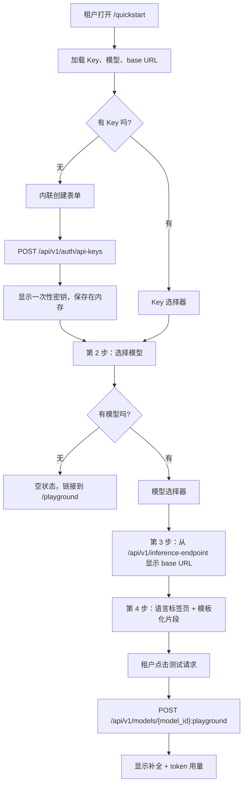
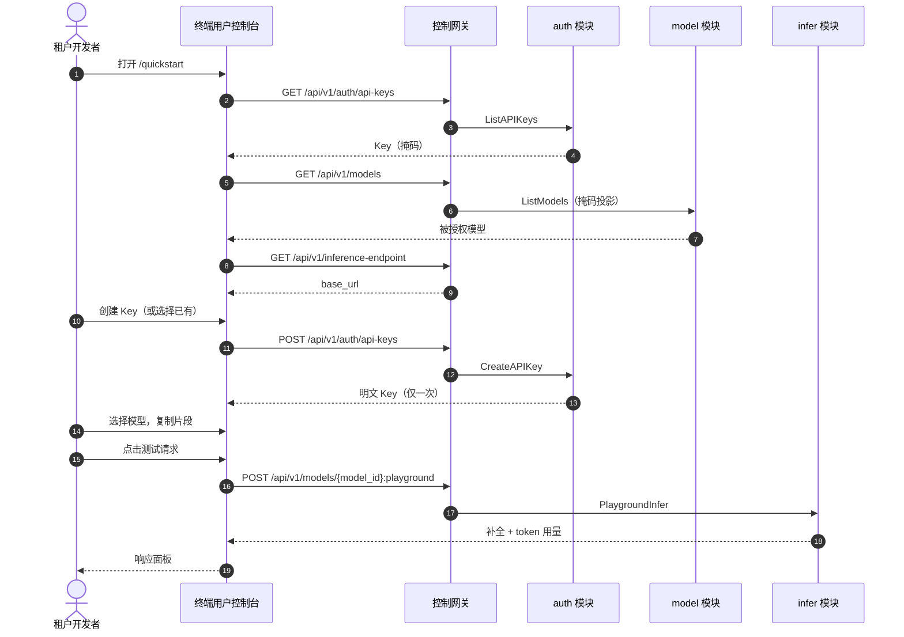

# SDK / 快速开始 — 需求分析与 UI/UX 设计

| 属性 | 内容 |
| --- | --- |
| 功能点 | SDK / 快速开始 —— 面向终端用户的页面，提供 OpenAI 兼容的代码片段（Python / Node / curl）与 API Key 配置，用于消费模型（backlog 第 21 行） |
| 文档范围 | 需求分析、竞品调研、终端用户面快速开始页面 `/quickstart` 的设计（创建/选择 API Key、选择模型、展示推理 base URL、复制预填充的 OpenAI 兼容代码片段、运行测试请求）、页面 → API 面映射表、编号验收标准 |
| 归属模块 | `web` 终端用户控制台（`UserShell` 中的 `QuickstartPage`）、`pkg/server` 网关（用户前缀绑定）、`auth`（API Key 创建/列表，复用）、`model`（掩码模型列表，复用）、`infer`（基于模型的 playground 代理，复用），以及一个新的配置驱动的推理端点读取 |
| 相关文档 | [架构设计](./architecture.md) —— §3.2 数据面网关、§3.3 API Key 认证链 · [控制台面分离](./console-surface-separation.md) —— 本页面所在的终端用户面、掩码 `GET /api/v1/models` 投影（D15）、基于模型的 playground（D14）· [API Key 生命周期管理](./api-key-management.md) —— 本页面复用的创建/列表/吊销面 · [模型目录与一键部署](./model-catalog-deployment.md) —— 本页面消费的模型列表 · [请求日志与 API Playground](./request-logs-playground.md) —— 本页面测试请求复用的 playground 代理 |
| 状态 | 设计完成，已交接给架构师智能体 |

---

## 1. 背景

go-taas 向 **智能体 / SDK** 提供 OpenAI 兼容的推理访问。一个已被授予模型、并已签发 API Key 的租户，仍然面临"我有 Key"与"我的第一次推理调用成功"之间的鸿沟：租户必须知道推理 base URL、要发送的确切模型名，以及符合其语言的 OpenAI 兼容请求格式。今天这些知识在产品中无处可寻——API Key 页面（`/api-keys`）只显示端点行 `{origin}/v1/chat/completions`，没有模型名也没有代码；Playground（`/playground`）让租户可以交互式试用模型，但不会生成可复制粘贴的集成代码。新租户必须从尚不存在的文档中拼凑出 base URL、模型名和代码片段。

本功能新增 **SDK / 快速开始** 页面：一个单一的终端用户面，引导租户完成到可用集成的四个步骤——(1) 创建或选择 API Key，(2) 选择其被授权的模型，(3) 复制推理 base URL，(4) 复制 Python、Node 或 curl 的预填充 OpenAI 兼容代码片段，然后运行测试请求以证明配置可用。这是"开发者上手"故事中最小、可独立交付的增量：它把"我有 Key 和模型"变成"我的第一次推理调用成功，并且我有可重复的代码"。

### 1.1 可比产品如何呈现 SDK / 快速开始面

| 产品 | 快速开始面 | 片段语言 | base URL 处理 | Key 配置 | 值得注意的坑 |
| --- | --- | --- | --- | --- | --- |
| **OpenAI Platform** | 文档站上的快速开始指南；控制台显示端点和 Key 创建流程 | Python、Node、curl（等） | 硬编码 `https://api.openai.com/v1` | 内联创建 Key，仅显示一次 | 片段假定平台自身的 base URL；自托管平台无法原样复制 |
| **Anthropic Console** | Workbench + 文档快速开始 | Python、curl | 硬编码 `https://api.anthropic.com` | 内联创建 Key | 消息格式**不**兼容 OpenAI（`messages` 使用不同 schema），片段形态无法迁移 |
| **Together AI** | 文档快速开始 + 控制台端点展示 | Python、Node、curl | `https://api.together.xyz/v1`，OpenAI 兼容 | Key 来自账户设置 | 模型名与 OpenAI 不同；租户必须知道确切模型 id |
| **SiliconFlow** | 快速开始页面 + 片段 | Python、curl | `https://api.siliconflow.cn/v1`，OpenAI 兼容 | 在 API Key 页面创建 Key | 中文优先文档；模型命名是产品特有的 |
| **阿里云百炼** | 两种 API 模式的快速开始 | Python、curl | `https://dashscope.aliyuncs.com/compatible-mode/v1`（兼容模式） | Key 来自工作空间 | **两种 API 模式**（原生 + OpenAI 兼容）让租户困惑该用哪个 base URL 和 schema |
| **火山方舟** | 带片段的快速开始 | Python、curl | `https://ark.cn-beijing.volces.com/api/v3`，OpenAI 兼容 | Key 来自 API Key 页面 | **按地域**的 base URL；其他地域的租户必须知道要改主机名 |

### 1.2 提炼的模式与决策

值得采纳的模式：(1) **线性分步向导** —— 每个被调研的产品都把快速开始简化为固定序列（Key → 模型 → 端点 → 代码），租户不应在页面间跳转；(2) **语言标签页** —— Python / Node / curl 是每个产品都提供的标准三件套；(3) **预填充片段** —— 片段用所选模型名和 base URL 模板化，复制粘贴即可用；(4) **内联创建 Key** —— 在快速开始流程内创建 Key，而不是在单独页面，这样一次性密钥直接进入片段；(5) **测试动作** —— 一个"运行它"的步骤，在租户离开前证明配置可用；(6) **复制按钮** —— 每个片段一键复制。

要避免的坑：硬编码平台 base URL（OpenAI）—— go-taas 的推理网关是部署相关的，base URL 必须来自配置，绝不能来自常量；非 OpenAI 兼容的消息 schema（Anthropic）—— go-taas 是 OpenAI 兼容的，每个片段都必须使用 `chat.completions`；两种 API 模式（百炼）—— go-taas 只暴露一个 OpenAI 兼容面；按地域的 base URL（方舟）—— go-taas 只有一个 base URL；以及把密钥持久化进片段—— Key 只显示一次，因此针对**已有** Key 的片段必须使用占位符，绝不能使用存储的密钥。

**go-taas 的决策**：

| # | 决策 | 理由 |
| --- | --- | --- |
| D1 | **快速开始页面仅属于终端用户面**：路由 `/quickstart`，API 前缀 `/api/v1/*`。它作为第一项加入 `UserShell` 导航，名为"快速开始" | 引导租户消费模型是租户自助任务，不是运维任务；运维人员永远不需要此页面。把它放在用户导航首位符合租户的任务流（开始 → Key → 试用 → 用量 → 账单） |
| D2 | **页面是线性四步向导**：(1) API Key，(2) 模型，(3) base URL，(4) 代码片段 + 测试请求。每一步是一张卡片；租户自上而下完成 | 每个被调研的产品都把快速开始简化为这个序列；固定顺序消除了"下一步做什么"的问题 |
| D3 | **推理 base URL 来自新的配置驱动的用户面端点 `GET /api/v1/inference-endpoint`**，返回 `{ "base_url": "https://<inference-gateway>/v1" }`。客户端绝不硬编码 | 推理网关（Envoy）是独立的、部署相关的入口；常量在每次部署上都是错的。一个小的读取让该值权威且可测试 |
| D4 | **片段用所选模型名和 base URL 模板化。** 仅当 Key 是在本页面会话中创建时，才把 API Key 注入片段（保存在组件内存中）；对于已有 Key，片段使用占位符 `YOUR_API_KEY` | 明文 Key 只显示一次（功能 #1，D1）；把它持久化进片段会违反该姿态。在内存中持有刚创建的 Key，让"复制并运行"路径无需存储密钥即可立即工作 |
| D5 | **"测试请求"动作复用基于模型的 playground 代理 `POST /api/v1/models/{model_id}:playground`**，发送一次真实的计量推理并显示补全文本和 token 用量 | 该代理已存在（功能 #12，D14），并走真实的计量路径；复用它避免新增推理 RPC，并端到端证明配置可用 |
| D6 | **语言标签页 Python / Node / curl**，每个都有复制按钮；当前标签页的片段由当前模型 + base URL 预填充 | 标准三件套；复制按钮是主要交互 |
| D7 | **API Key 步骤适配租户状态**：无 Key 时显示内联创建表单（复用 `POST /api/v1/auth/api-keys`）；有 Key 时显示选择器加"新建"链接。当组织未被授权任何模型时，模型步骤显示指向 Playground 的空状态 | 页面必须对全新租户（无 Key、无模型）和已有租户（选择已有 Key 和模型）都有用 |
| D8 | **`UserShell` 导航新增第六项"快速开始"，置于首位。** 面分离功能的 AC2（断言恰好五个 `user-nav-*` 项）必须更新为六项 | 新的上手页面是新的导航目的地；此前的断言是快照，本功能有意扩展它 |

## 2. 目标与非目标

**目标**：终端用户页面 `/quickstart`，引导租户创建或选择 API Key、选择被授权的模型、复制推理 base URL，并复制 Python / Node / curl 的预填充 OpenAI 兼容片段，附带证明配置可用的测试请求（D1–D6）；页面 → API 面映射表，带精确前缀（D1、D3）；每个页面的交互状态，包括空、错误、禁用、权限拒绝；可在 compose 栈上通过 Nightwatch 测试的编号验收标准。

**非目标**：完整的 SDK 参考或 API 参考文档站（页面只提供三个规范片段，不是文档门户）；Python / Node / curl 之外的语言（Go、Java 等是未来扩展）；持久的"我的集成"列表（页面是无状态的——它不保存租户选择的模型或 Key）；为已有 Key 的片段嵌入密钥（D4）；面向租户的模型目录或价格页（功能 #2/#5 的未来用户面变体）；改变任何数据面（推理网关）行为；快速开始页面的管理面变体（D1）。

## 3. 角色与旅程

| 角色 | 面 | 旅程 |
| --- | --- | --- |
| **租户开发者**（新） | 终端用户 | 在 `/login` 登录 → 打开 `/quickstart` → 内联创建 API Key 并复制一次性密钥 → 选择模型 → 复制 base URL → 复制 Python 片段 → 运行测试请求并看到补全 → 把片段集成进其智能体 |
| **租户开发者**（已有） | 终端用户 | 打开 `/quickstart` → 从选择器选择已有 Key → 选择模型 → 复制 Node 或 curl 片段（带 `YOUR_API_KEY` 占位符）→ 粘贴进其智能体 |
| **租户开发者**（无模型） | 终端用户 | 打开 `/quickstart` → 创建 Key → 模型步骤显示"无可用模型"并链接到 Playground → 请其管理员授予模型（功能 #13） |
| **智能体 / SDK** | 两者皆非 | 用 API Key 调用推理端点；不触碰控制面页面。它是快速开始页面为租户准备的消费方 |

> 术语：消费方调用方在英文中称为 **Agent**，中文为「智能体」，与仓库约定一致。

## 4. 功能需求

### FR1 — 快速开始页面结构与导航

- **FR1.1** 终端用户控制台新增 `/quickstart` 路由，在 `UserShell` 内渲染（D1）。`UserShell` 导航新增第一项"快速开始"（`user-nav-quickstart`），共六项（D8）。
- **FR1.2** 页面是线性四步向导（D2）：**第 1 步 API Key**、**第 2 步 模型**、**第 3 步 Base URL**、**第 4 步 代码与测试**。每一步是一张带编号标题的卡片；租户自上而下完成。

### FR2 — API Key 步骤

- **FR2.1** 该步骤从 `GET /api/v1/auth/api-keys`（复用，功能 #1）加载组织的 Key。**无 Key** 时，渲染内联创建表单（名称 + 可选过期时间），调用 `POST /api/v1/auth/api-keys`；成功后显示一次性密钥，带复制按钮和"我已保存此 Key"确认（功能 #1 的 created-secret 模式），并把明文保存在组件内存中用于片段注入（D4）。
- **FR2.2** **有已有 Key** 时，渲染 Key 选择器（`quickstart-key-select`），按名称 + 掩码前缀列出活跃 Key，外加"新建"链接，打开同一内联创建表单。选择已有 Key 会把片段 Key 设为占位符 `YOUR_API_KEY`（D4）。
- **FR2.3** 该步骤显示 Key 的掩码前缀和状态；绝不显示存储的密钥。

### FR3 — 模型步骤

- **FR3.1** 该步骤从 `GET /api/v1/models`（复用，掩码投影——`model_id`、`name`、`latest_version`；无 `weight_path`、无镜像或服务标识，功能 #17 D15）加载组织可用的模型。
- **FR3.2** 租户选择一个模型（`quickstart-model-select`）；该选择驱动片段的 `model` 字段和测试请求。
- **FR3.3** **无被授权模型**时，该步骤显示空状态"您的组织暂无可用的模型"，带指向 Playground（`/playground`）的链接，并提示请管理员授予模型（功能 #13）。

### FR4 — Base URL 步骤

- **FR4.1** 该步骤从新的 `GET /api/v1/inference-endpoint`（D3）加载推理 base URL，并在等宽字段中显示，带复制控件（`quickstart-base-url-copy`）。
- **FR4.2** base URL 绝不在客户端硬编码；加载失败显示该步骤的错误状态（FR6）。

### FR5 — 代码片段与测试请求

- **FR5.1** 第 4 步渲染语言标签页 **Python / Node / curl**（`quickstart-lang-python`、`quickstart-lang-node`、`quickstart-lang-curl`），每个都有复制按钮（`quickstart-copy`）。当前片段用所选模型名、base URL 和 Key（刚创建的明文或 `YOUR_API_KEY` 占位符）模板化（D4、D6）。
- **FR5.2** Python 片段使用 `openai` SDK，`base_url` 设为 base URL；Node 片段使用 `openai` SDK，`baseURL`；curl 片段向 `{base_url}/chat/completions` 发送 `Authorization: Bearer`。三者都使用 OpenAI 兼容的 `chat.completions` schema。
- **FR5.3** 当选择模型和 Key 后，**测试请求**动作（`quickstart-test`）启用；它用所选 Key 和固定示例提示调用 `POST /api/v1/models/{model_id}:playground`（复用，功能 #12 D14），并在响应面板（`quickstart-test-response`）中显示补全文本和 token 用量。失败调用在面板内联渲染错误。

### FR6 — 交互状态

- **FR6.1** 页面实现六种交互状态（默认、加载、空、错误、禁用、权限拒绝），文案按 §5 中每步给出。
- **FR6.2** 每个控件都带 `data-testid`，采用控制台已有的 `kebab-case` 风格（`quickstart-key-select`、`quickstart-model-select`、`quickstart-base-url-copy`、`quickstart-copy`、`quickstart-test` 等）。
- **FR6.3** 错误文案把业务码映射为句子（绝不显示裸码），遵循控制台的集中映射。

### FR7 — 面与 API 绑定

- **FR7.1** 快速开始页面位于**终端用户面**：路由 `/quickstart`，API 前缀 `/api/v1/*`（D1）。
- **FR7.2** 页面只调用 `/api/v1/*` 路由：`GET /api/v1/auth/api-keys`、`POST /api/v1/auth/api-keys`、`GET /api/v1/models`、`GET /api/v1/inference-endpoint`（新）、`POST /api/v1/models/{model_id}:playground`。它不含任何 `/api/v1/admin/*` 字符串（功能 #17，D8）。
- **FR7.3** 新的 `GET /api/v1/inference-endpoint` 是用户面读取；本功能没有管理面变体。

## 5. UI 设计

### 5.1 面分配

| 功能 | 面 | Web 路由 | API 前缀 |
| --- | --- | --- | --- |
| SDK / 快速开始页面 | 终端用户 | `/quickstart` | `/api/v1/*` |
| API Key 创建/选择（复用） | 终端用户 | `/quickstart`（第 1 步） | `/api/v1/auth/api-keys` |
| 掩码模型列表（复用） | 终端用户 | `/quickstart`（第 2 步） | `/api/v1/models` |
| 推理 base URL（新） | 终端用户 | `/quickstart`（第 3 步） | `/api/v1/inference-endpoint` |
| 测试请求（复用） | 终端用户 | `/quickstart`（第 4 步） | `/api/v1/models/{model_id}:playground` |

### 5.2 页面：`/quickstart` — 快速开始

**目的**：给租户开发者一个单一面，从"我有访问权限"到"我的第一次推理调用成功"，并提供可复制粘贴的 OpenAI 兼容代码。

**面**：终端用户 —— 路由 `/quickstart`，API `/api/v1/*`。

**布局**：在 `UserShell`（功能 #17）内渲染。页面头部（"快速开始"，副标题"四步完成您的第一次推理调用。"）。头部下方是四张编号步骤卡片：

1. **第 1 步 — API Key**（`quickstart-step-key`）：Key 选择器（已有 Key）或内联创建表单（无 Key），创建时显示一次性密钥。
2. **第 2 步 — 模型**（`quickstart-step-model`）：来自掩码模型列表的模型选择器，或"无可用模型"空状态。
3. **第 3 步 — Base URL**（`quickstart-step-baseurl`）：等宽字段中的推理 base URL，带复制控件。
4. **第 4 步 — 代码与测试**（`quickstart-step-code`）：语言标签页（Python / Node / curl）、带复制按钮的预填充片段，以及带响应面板的**测试请求**动作。

**交互状态**：

| 状态 | 行为 |
| --- | --- |
| 默认 | 四个步骤在 Key、模型、base URL 首次成功加载后渲染；片段反映当前模型 + base URL + Key |
| 加载 | Key、模型、base URL 步骤中的骨架占位；在模型和 Key 确定前，片段和测试请求禁用 |
| 空 | 第 1 步：无 Key 时显示内联创建表单（FR2.1）；第 2 步："您的组织暂无可用的模型"，带指向 `/playground` 的链接（FR3.3）；第 3 步：不适用（端点加载成功时 base URL 始终存在） |
| 错误 | 带映射文案和重试按钮的 `ErrorBanner`；失败的步骤在适用处保留最后的好数据并显示"正在显示过期数据"横幅 |
| 禁用 | 在选择模型和 Key 前，片段复制和测试请求禁用；测试进行中时测试请求禁用；请求进行中且名称为空时创建 Key 提交禁用 |
| 权限拒绝 | 无会话/过期/域不匹配的会话收到 10027/10038，外壳按功能 #17 FR4.3 重定向；组织被禁用/不存在收到 10017/10005；组织未被授权的模型收到 10105，模型步骤显示"无可用模型"空状态 |

**第 1 步 — API Key**：

| 字段 | 控件 | 校验 | 错误文案 |
| --- | --- | --- | --- |
| Key 选择器 | `quickstart-key-select`（活跃 Key 下拉：名称 + 掩码前缀） | 有 Key 时必填 | "请选择一个 API Key。" |
| 新建 | `quickstart-key-create`（链接） | — | — |
| 名称（创建表单） | `quickstart-key-name` | 必填，1–64 字符 | "请输入 Key 名称。" / "Key 名称最多 64 个字符。" |
| 过期时间（创建表单） | `quickstart-key-expiry` | 可选：永不 / 30 / 90 / 365 天 | — |
| 已创建密钥 | `quickstart-created-secret` + `quickstart-created-copy` | 仅显示一次；勾选"我已保存此 Key"（`quickstart-created-confirm`）前关闭禁用 | "此 Key 仅显示一次。" |

**第 2 步 — 模型**：

| 字段 | 控件 | 校验 | 错误文案 |
| --- | --- | --- | --- |
| 模型选择器 | `quickstart-model-select`（被授权模型下拉：名称 + 最新版本） | 必填 | "请选择一个模型。" |
| 空状态 | `quickstart-no-models` | — | "您的组织暂无可用的模型。请管理员授予模型，或试用 Playground。" |

**第 3 步 — Base URL**：

| 字段 | 控件 | 校验 | 错误文案 |
| --- | --- | --- | --- |
| Base URL | `quickstart-base-url`（等宽、只读）+ `quickstart-base-url-copy` | 来自 `GET /api/v1/inference-endpoint` 的非空值 | "无法加载推理端点。" |

**第 4 步 — 代码与测试**：

| 字段 | 控件 | 校验 | 错误文案 |
| --- | --- | --- | --- |
| 语言标签页 | `quickstart-lang-python` / `quickstart-lang-node` / `quickstart-lang-curl` | 恰好一个激活 | — |
| 片段 | `quickstart-snippet`（pre，等宽）+ `quickstart-copy` | 由模型 + base URL + Key 模板化 | — |
| 测试请求 | `quickstart-test` | 选择模型 + Key 后启用 | 在响应面板内联显示 |

**示例片段**（模板化；`{base_url}` 和 `{model}` 被替换，`{key}` 是刚创建的密钥或 `YOUR_API_KEY`）：

```python
from openai import OpenAI

client = OpenAI(
    api_key="{key}",
    base_url="{base_url}",
)

response = client.chat.completions.create(
    model="{model}",
    messages=[{"role": "user", "content": "Hello!"}],
)
print(response.choices[0].message.content)
```

```javascript
import OpenAI from "openai";

const client = new OpenAI({
  apiKey: "{key}",
  baseURL: "{base_url}",
});

const response = await client.chat.completions.create({
  model: "{model}",
  messages: [{ role: "user", content: "Hello!" }],
});
console.log(response.choices[0].message.content);
```

```bash
curl {base_url}/chat/completions \
  -H "Authorization: Bearer {key}" \
  -H "Content-Type: application/json" \
  -d '{
    "model": "{model}",
    "messages": [{"role": "user", "content": "Hello!"}]
  }'
```

### 5.3 流程





## 6. API 面影响

所有快速开始读取都是用户面（`/api/v1/*`）。大部分复用；新增一个端点。

| RPC | 路由 | 前缀 | 状态 | 用途 |
| --- | --- | --- | --- | --- |
| `ListAPIKeys` | `GET /api/v1/auth/api-keys` | 用户 | **复用**（功能 #1） | 组织的 Key，用于 Key 选择器 |
| `CreateAPIKey` | `POST /api/v1/auth/api-keys` | 用户 | **复用**（功能 #1） | 内联创建 Key；仅一次返回明文 |
| `ListModels` | `GET /api/v1/models` | 用户 | **复用**（功能 #17 D15） | 掩码模型列表（`model_id`、`name`、`latest_version`），用于模型选择器 |
| `GetInferenceEndpoint` | `GET /api/v1/inference-endpoint` | 用户 | **新** | 从配置返回 `{ "base_url": "https://<inference-gateway>/v1" }`（D3） |
| `PlaygroundInfer` | `POST /api/v1/models/{model_id}:playground` | 用户 | **复用**（功能 #12 D14） | 测试请求；用所选 Key 的真实计量推理 |

**给架构师智能体的契约说明**：

1. `GetInferenceEndpoint` 是新的用户面读取，返回 `{ "base_url": string }`。该值来自服务器配置（推理网关的公共地址），绝不来自客户端常量。它不需要组织上下文，也不需要新错误码——配置缺失返回标准内部错误，页面将其映射为"无法加载推理端点"。
2. 快速开始页面原样复用 `ListAPIKeys`、`CreateAPIKey`、`ListModels`（掩码）和 `PlaygroundInfer`；不修改任何现有 RPC。
3. `PlaygroundInfer` 已携带 `api_key_id`、`model_id` 和 `prompt`；快速开始测试请求用所选 Key 和模型发送固定示例提示，响应已携带补全文本和 token 用量（功能 #12）。
4. 线上约定不变：成功返回 HTTP 200，业务错误为 `{"code": <int>, "message": "..."}`，列表使用点分分页。

错误码（无新码；全部复用）：

| 条件 | 码 | 常量 | 说明 |
| --- | --- | --- | --- |
| 无会话 / 过期 / 域不匹配 | 10027 / 10038 | `CodeSessionInvalid` / `CodeRealmMismatch` | 外壳按功能 #17 FR4.3 重定向 |
| 组织不存在 / 被禁用 | 10005 / 10017 | `CodeOrganizationNotFound` / `CodeOrganizationDisabled` | 页面文案复用 |
| 组织未被授权的模型 | 10105 | `CodeModelUnauthorized` | 模型步骤的空状态 |
| 模型无就绪推理服务 | 10301 / 10303 | `CodeInferServiceNotFound` / `CodeInferServiceStateInvalid` | 在测试响应面板内联显示 |
| 推理端点未配置 | 500 | `CodeInternal` | 经错误归一化；映射为"无法加载推理端点。" |

## 7. 验收标准

| # | 标准 | 级别 |
| --- | --- | --- |
| AC1 | `GET /api/v1/inference-endpoint` 返回配置的 `base_url`；该值与服务器配置一致，且不是客户端常量 | FVT |
| AC2 | `/quickstart` 在 `UserShell` 内渲染四张步骤卡片（Key、模型、base URL、代码与测试），来自 Key、模型、base URL 的首次成功加载 | E2E |
| AC3 | 无 API Key 时，第 1 步显示内联创建表单；创建 Key 显示带复制按钮和确认门槛的一次性密钥，且刚创建的明文被注入片段 | E2E |
| AC4 | 有已有 Key 时，第 1 步显示 Key 选择器；选择已有 Key 会把片段 Key 设为 `YOUR_API_KEY` 占位符（不出现存储的密钥） | E2E |
| AC5 | 第 2 步从 `GET /api/v1/models` 列出组织被授权的模型（掩码：`model_id`、`name`、`latest_version`；无 `weight_path`、无镜像或服务标识）；选择模型更新片段的 `model` 字段 | E2E |
| AC6 | 第 3 步在等宽字段中显示来自 `GET /api/v1/inference-endpoint` 的 base URL，带可用的复制控件 | E2E |
| AC7 | 第 4 步渲染 Python / Node / curl 标签页；每个片段用所选模型和 base URL 模板化，每个都有可用的复制按钮，切换标签页会替换片段 | E2E |
| AC8 | 在选择模型和 Key 前，测试请求动作禁用；启用后调用 `POST /api/v1/models/{model_id}:playground` 并在响应面板显示补全文本和 token 用量；失败调用内联渲染错误 | E2E |
| AC9 | 无被授权模型时，第 2 步显示"您的组织暂无可用的模型"空状态，带指向 `/playground` 的链接 | E2E |
| AC10 | 加载失败显示带映射文案和可用重试按钮的 `ErrorBanner`；失败的步骤在适用处保留最后的好数据并显示"正在显示过期数据"横幅 | E2E |
| AC11 | 未被授权某模型的组织收到 10105，模型步骤显示空状态；无会话/过期/域不匹配的会话按功能 #17 FR4.3 重定向 | E2E + FVT |
| AC12 | 快速开始页面仅在终端用户面可达：路由为 `/quickstart`，在 `UserShell` 导航中为 `user-nav-quickstart`，且其每次 API 调用都使用 `/api/v1/*` 前缀，不含 `/api/v1/admin/*` 字符串 | E2E（面分离） |
| AC13 | `UserShell` 导航现在显示六项，`user-nav-quickstart` 居首；面分离的 AC2 断言更新为六项且仍然通过 | E2E（回归） |

## 8. 范围外（另行跟踪）

| 项 | 去向 |
| --- | --- |
| 完整的 SDK / API 参考文档站 | 未来文档功能——页面只提供三个规范片段 |
| 更多片段语言（Go、Java 等） | 未来增强 |
| 持久的"我的集成"列表 | 有意省略——页面无状态（D4） |
| 为已有 Key 的片段嵌入密钥 | 有意省略（D4）—— Key 只显示一次 |
| 面向租户的模型目录和价格页 | 功能 #2/#5 的未来用户面变体 |
| 快速开始页面的管理面变体 | 有意省略（D1） |
| 改变任何数据面（推理网关）行为 | 范围外——页面只读取 base URL 并复用 playground 代理 |