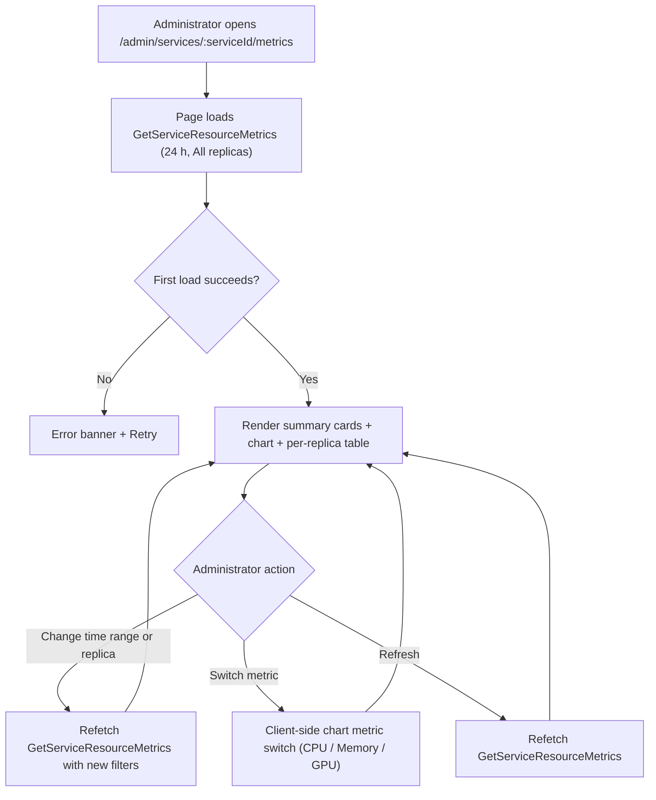
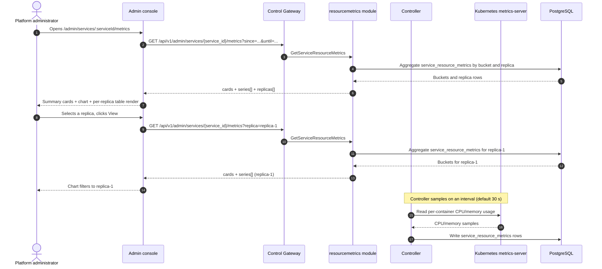

# Inference Service Resource Metrics — Requirement Analysis and UI/UX Design

| Attribute | Content |
| --- | --- |
| Feature point | Inference service resource metrics — per-service CPU / memory / GPU utilization over time, with time-range filters and resource-usage charts (backlog row 37) |
| Document scope | Requirement analysis, competitive research, the admin-surface service-metrics page for `/admin/services/:serviceId/metrics`, the page → API surface table, and numbered acceptance criteria |
| Owning modules | `resourcemetrics` (new — owns the read-only aggregation over the new `service_resource_metrics` table), `internal/controller` (read-only: per-service CPU/memory/GPU sampling from the Kubernetes metrics-server and the accelerator signals), `pkg/server` gateway (admin-prefix bindings), `web` admin console (`ServiceMetricsPage`) |
| Related documents | [Architecture Design](./architecture.md) — §2.4 `infer`, §2.7 Controller, §4.2 one-click deployment flow · [Model Observability Dashboard](./model-observability.md) — the sibling read-only time-series aggregation and its bucket/freshness/range conventions · [Accelerator Inventory & Health](./accelerator-inventory.md) — the sibling GPU health surface whose accelerator signals feed GPU utilization · [Inference Service Logs Viewer](./service-logs-viewer.md) — the sibling per-service diagnostic surface and the Controller read pattern this feature reuses · [Console Surface Separation](./console-surface-separation.md) — the two surfaces, the `AdminShell` conventions, the masked-projection rule |
| Status | Design complete, handed to the Architect agent |

---

## 1. Background and Competitive Research

### 1.1 Why the Resource Metrics Page Comes Now

go-taas runs inference services as Kubernetes Deployments (model-catalog-deployment §4.2): the Controller creates the Deployment and Service, and the inference engine (vLLM, etc.) runs in the container. The model-observability feature (row 24) explains *how the model performs* (latency, throughput, error rate, tokens/sec) from `request_logs`, and the service-logs viewer (row 33) shows *what the engine printed*. What the operator still cannot answer is the infrastructure question: *is this service actually using the resources it was given?* When a service is slow, the operator cannot tell whether it is CPU-bound, memory-constrained, or GPU-starved without leaving the console and running `kubectl top` against the pods or querying a metrics endpoint.

This feature adds an **inference service resource metrics** page: per-service CPU / memory / GPU utilization over time, with time-range filters and resource-usage charts. It is the smallest independently valuable increment of Phase 4's operations surface: it turns "the service is slow" into "the service is CPU-saturated at 95% for the last hour while GPU sits at 20% — the bottleneck is compute, not the accelerator". It is a **read-only** aggregation layer — nothing in the inference, metering, or billing pipelines changes.

### 1.2 How Comparable Products Expose Per-Service Resource Utilization

| Product | Resource surface | Metrics | Time range / charts | Notable pitfalls |
| --- | --- | --- | --- | --- |
| **kubectl top** | Per-pod/container CPU and memory usage at a point in time | CPU (millicores), memory (bytes) | No history; point-in-time only | CLI-only; no GPU; no time series; pod names leak |
| **Kubernetes Dashboard** | Per-workload CPU/memory usage charts | CPU, memory per pod/deployment | Time-range charts; no GPU | Operator-orchestration internals; pod names leak; no GPU utilization |
| **Grafana** | Dashboards of panels querying a metrics data source | Any (Prometheus, etc.) | Full time-series with pan/zoom, thresholds, legends | Requires a full observability stack (Prometheus + Grafana); dashboards are user-built |
| **Datadog** | Host/container/process resource charts | CPU, memory, I/O, GPU (via integrations) | Full time-series; process-level breakdown | Heavy agent; third-party SaaS; GPU requires vendor integration |
| **Prometheus** | Raw time-series metrics scraped from exporters | CPU, memory, GPU (node-exporter, DCGM) | PromQL queries; Grafana for charts | Raw metrics, not a product surface; requires a Prometheus stack the operator must run |
| **CloudWatch** | Per-container/EC2 resource metrics | CPU, memory, GPU (via custom metrics) | Time-series charts; AWS-bound | AWS-bound; GPU needs custom metric plumbing |
| **vLLM metrics** | Prometheus metrics endpoint (GPU utilization, KV cache, tokens/sec) | GPU utilization, KV cache usage | Prometheus time-series; Grafana dashboards | Raw metrics, not a product surface; requires a Prometheus/Grafana stack |

### 1.3 Distilled Patterns and Decisions

Patterns worth adopting:

1. **Summary cards above a metric-switcher time-series chart** — Grafana and Datadog lead with headline resource values (current CPU%, memory, GPU%) above a chart; one dashboard endpoint serving cards + buckets avoids the N+1-call slow console (the usage-dashboard D1 pattern).
2. **CPU and memory from the Kubernetes metrics-server** — Kubernetes's resource-metrics pipeline (`metrics.k8s.io`, served by metrics-server) is the canonical, dependency-light source of per-container CPU/memory usage; `kubectl top` and the Kubernetes Dashboard both read it. go-taas reuses it through the Controller (the only component with a Kubernetes client).
3. **GPU utilization from the accelerator signals** — the accelerator inventory (feature #18) already collects per-node GPU state through the Controller; GPU utilization per service is derived from the same accelerator signals (DCGM-style utilization where the vendor exposes it), and is **best-effort** when the vendor does not (heterogeneous accelerators: NVIDIA, Iluvatar, MetaX).
4. **Time-range presets with a custom picker** — 24 h / 7 d / 30 d / custom is the universal pattern (usage-dashboard, observability).
5. **Freshness labeling** — a data-through timestamp and a pending/partial marker, because sampled metrics lag the wall clock (the observability D6 pattern).
6. **Inline SVG charts** — the console is deliberately dependency-light (usage-dashboard D7, observability D9).

Pitfalls to avoid: raw Prometheus metrics as the product surface (Prometheus, vLLM) — the console must curate a small, scannable set; a blocking N+1 dashboard — one endpoint returns cards + buckets; exposing operator-orchestration internals (pod names, replica counts) to tenants — the page is admin-only and masks replicas as indices; silently stale metrics — the data-through marker must be explicit; heavy chart libraries in a dependency-light console; and a point-in-time snapshot masquerading as a time series (kubectl top) — this feature persists samples so the operator can see utilization *over time*.

**Decisions for go-taas** (recorded rationale, per the autonomous-decision rule):

| # | Decision | Rationale |
| --- | --- | --- |
| D1 | **The resource metrics page lives on the admin surface only**: `/admin/services/:serviceId/metrics` + `/api/v1/admin/services/{service_id}/metrics/*`. There is **no end-user surface** — per-service CPU/memory/GPU utilization is operator-orchestration internals (feature #17's masked-projection rule); tenants get model-level performance (row 24), not pod resource internals | The operator needs infrastructure utilization to debug capacity and bottlenecks; tenants need model performance, not pod internals. Consistent with the admin-only accelerator inventory (feature #18), system status (feature #30), and service logs (feature #33) |
| D2 | **CPU and memory are sampled from the Kubernetes metrics-server** (`metrics.k8s.io`) through the Controller, and **GPU utilization from the accelerator signals** (feature #18). The Controller is the only component with a Kubernetes client; it polls per-service per-replica CPU/memory/GPU on an interval (default 30 s) and writes a sample row per (service, replica, sample) to a new `service_resource_metrics` table | metrics-server is the canonical, dependency-light source of container CPU/memory (kubectl top, Kubernetes Dashboard both read it); the accelerator signals already carry GPU state (feature #18). The Controller owns the Kubernetes client (service-logs AD2, accelerator AD1), so it is the natural sampler. A new table persists the time series — unlike the point-in-time accelerator snapshot, utilization *over time* requires storage |
| D3 | **A new `resourcemetrics` module** (`services/resourcemetrics`) owns the read-only aggregation over the `service_resource_metrics` table, with its own error block **121xx**. It reuses the observability patterns (bucket builder, freshness, range contract 10404) but owns its own table and RPCs | Resource utilization is infrastructure telemetry (like accelerator), distinct from the request-derived observability aggregation over `request_logs` (model-observability AD3). A dedicated module keeps the concern separate and gives it one home, matching the per-feature-module pattern (accelerator, status, error-analysis) |
| D4 | **One new RPC `GetServiceResourceMetrics`** returns per-service summary cards, a time-series of buckets, and a per-replica breakdown for a time range and optional replica filter. It mirrors `GetModelObservability`'s cards + series + per-key shape | The page needs several shapes at once (headline cards, a time series, a per-replica table); a dedicated RPC keeps the resource concern out of the observability aggregation surface and gives it one home (D3) |
| D5 | **Time buckets adapt to the range**: hourly buckets for ranges ≤ 7 days, daily buckets for ranges > 7 days. The range is capped at **92 days** and validation reuses **10404** `CodeMeteringRangeInvalid` | Hourly granularity for short ranges shows intra-day spikes (the bottleneck-relevant signal); daily for long ranges keeps the payload small. The 92-day cap and 10404 reuse keep the range contract uniform with every metering/observability query (model-observability AD7) |
| D6 | **Freshness is explicit**: every response carries `data_through` — the start of the last complete sample bucket covered by the `service_resource_metrics` table. The console shows a "data through <time>" note plus a pending/partial marker when the selected range extends past it | Sampled metrics lag the wall clock by up to the sample interval; the marker keeps the freshness story honest with zero new pipeline work (model-observability AD8) |
| D7 | **GPU utilization is best-effort**: when the accelerator signals expose per-pod GPU utilization (DCGM-style), the series carries it; when the vendor does not (or the accelerator signals are absent), the GPU series is empty and the page shows a "GPU metrics unavailable" note | Heterogeneous accelerators (NVIDIA, Iluvatar, MetaX) vary in whether they expose utilization; a best-effort GPU series degrades gracefully to "unavailable" without a parsing contract (mirrors the service-logs best-effort level filter, D6) |
| D8 | **The chart renders with inline SVG** — one bar (or line) per bucket, with a metric switcher (CPU / Memory / GPU) — no new charting dependency | The console is deliberately dependency-light; a small, testable SVG component matches the usage-dashboard D7 and observability D9 decisions |
| D9 | **New error codes in a resource-metrics block (12101–12199)**: **12101 `CodeServiceMetricsInvalid`** (an invalid metric dimension or replica filter). Unknown `service_id` reuses **10301**; an unknown replica reuses **10304**; an invalid range reuses **10404** | Resource metrics is a new module (D3), so its codes live in a fresh block after the forecast block (120xx); distinct invalid keeps "bad metric/replica filter" actionable, while the service/range contracts stay uniform with infer and metering |
| D10 | **The page is read-only and audited only for access** — it writes nothing and mutates nothing; the page is reachable only by authenticated admin sessions, and no resource-metrics mutation is audited (there is nothing to mutate) | The feature is a pure read of the sampled metrics; the audit trail (feature #15) already covers the underlying service writes. No new audit events are needed |

### 1.4 Scope Boundary

**In scope**: a service-metrics page (summary cards, a metric-switcher time-series chart, a per-replica breakdown, time-range and replica filters), the Controller's per-service CPU/memory/GPU sampler writing to a new `service_resource_metrics` table, and the read-only aggregation RPC.

**Out of scope** (tracked by other feature points): model-level performance metrics (latency/throughput/error rate — feature #24), request-level traces (feature #27), container logs (feature #33), a Prometheus/Grafana stack or PromQL query language (deliberately absent, D2), alerting or threshold notifications on resource usage (feature #26 consumes observability events in-console — out of scope here), and a user-realm resource surface (deliberately absent, D1).

---

## 2. User Roles

| Role | Description | Interaction with the resource metrics page |
| --- | --- | --- |
| **Platform administrator** | The operator who runs the go-taas cluster and tunes inference services | Views an inference service's CPU/memory/GPU utilization over time, filters by time range and replica, and reads the summary cards to find bottlenecks |
| **Agent / SDK** | The programmatic consumer that calls `/v1/chat/completions` | Never touches the resource metrics page; consumes the service's endpoints through the gateway with an API Key |

> Terminology: the consumer-side caller is called an **Agent** (English) / 「智能体」(Chinese), consistent with the repo convention. This feature is admin-only, so the consumer-side terminology does not apply to a tenant surface.

---

## 3. User Stories

| # | As a… | I want to… | So that… |
| --- | --- | --- | --- |
| US1 | Platform administrator | open an inference service and see its CPU/memory/GPU utilization over time in the console | I can tell whether a slow service is CPU-bound, memory-constrained, or GPU-starved without running `kubectl top` |
| US2 | Platform administrator | filter the metrics by time range | I can focus on a specific window (e.g. the last hour before a failure) instead of the whole history |
| US3 | Platform administrator | switch the chart between CPU, memory, and GPU | I can compare the three resource dimensions at a glance |
| US4 | Platform administrator | see a per-replica breakdown | I can isolate a hot replica from a healthy one |
| US5 | Platform administrator | see summary cards for the current utilization | I can read the headline resource state without scanning the chart |
| US6 | Agent / SDK | call a deployed model through its endpoint with my API Key | I get completions without knowing anything about the service's resource utilization |

---

## 4. Functional Requirements

### FR1 — Per-service resource sampling

- **FR1.1** The Controller samples each inference service's CPU and memory usage from the Kubernetes metrics-server (`metrics.k8s.io`) and its GPU utilization from the accelerator signals (feature #18), on an interval (default 30 s), and writes one row per (service, replica, sample) to the `service_resource_metrics` table.
- **FR1.2** Each sample row carries `service_id`, `replica_index` (masked, e.g. `replica-1`), `sampled_at` (RFC3339), `cpu_percent` (usage ÷ request × 100, 0–100+), `memory_bytes`, and `gpu_percent` (best-effort, empty when the accelerator signals do not expose it, D7).
- **FR1.3** A service with no running replicas produces no samples; the page shows an empty state.

### FR2 — Read-only aggregation

- **FR2.1** `GetServiceResourceMetrics` (`GET /api/v1/admin/services/{service_id}/metrics`) returns the per-service resource metrics for a time range and optional replica filter: summary cards, a time-series of buckets, and a per-replica breakdown. It takes `since`/`until` (unix seconds; defaults `until = now`, `since = until − 24h`), `replica` (optional, a masked replica index), and `metric` (optional, one of `cpu` / `memory` / `gpu`). `since > until` or a range > 92 days returns **10404** (D5).
- **FR2.2** The response's `cards` carry `current_cpu_percent`, `current_memory_bytes`, `current_gpu_percent` (best-effort), `replica_count`, and `data_through` (the start of the last complete sample bucket, D6).
- **FR2.3** The response's `series[]` carry one entry per time bucket (hourly for ranges ≤ 7 days, daily otherwise, D5): `bucket` (unix seconds), `cpu_percent` (mean across replicas), `memory_bytes` (mean across replicas), and `gpu_percent` (mean across replicas, best-effort). When `replica` is set, the series is for that replica; otherwise it is service-wide.
- **FR2.4** The response's `replicas[]` carry one row per replica in the range: `replica_index`, `current_cpu_percent`, `current_memory_bytes`, `current_gpu_percent` (best-effort), and `data_through`. The table is sorted by `replica_index` ascending by default.

### FR3 — Surface and API binding

- **FR3.1** The resource metrics page lives on the **admin surface**: route `/admin/services/:serviceId/metrics`, API prefix `/api/v1/admin/services/{service_id}/metrics/*`. It is reached from the service detail page (feature #2) via a "Metrics" tab or link.
- **FR3.2** There is **no end-user surface** for resource metrics (D1): tenants do not see per-service CPU/memory/GPU utilization. The admin page calls only `/api/v1/admin/services/{service_id}/metrics/*` routes and contains no `/api/v1/*` string (feature #17, D1).

---

## 5. Page and Flow Design

### 5.1 Surface Assignment

| Feature | Surface | Web route | API prefix |
| --- | --- | --- | --- |
| Per-service resource metrics | admin | `/admin/services/:serviceId/metrics` | `/api/v1/admin/services/{service_id}/metrics` |

Every page and API call above is on the **admin surface**; there is no end-user surface (D1). Admin pages never call a `/api/v1/*` route, and the admin session realm is used throughout.

### 5.2 Page Map

| Page / component | Purpose |
| --- | --- |
| **Service Metrics page** (`/admin/services/:serviceId/metrics`) | Per-service CPU/memory/GPU utilization over time with summary cards, a metric-switcher time-series chart, a per-replica breakdown, and time-range/replica filters |

### 5.3 Page: `/admin/services/:serviceId/metrics` — Service Metrics (admin)

**Purpose**: give the platform administrator a single surface to read an inference service's resource utilization over time — summary cards, a metric-switcher chart, and a per-replica breakdown — to find CPU/memory/GPU bottlenecks.

**Surface**: admin — route `/admin/services/:serviceId/metrics`, API `/api/v1/admin/services/{service_id}/metrics`.

**Layout**: rendered inside `AdminShell` (feature #17). A page header ("Service Metrics", subtitle with the service name and `service_id`) with a **Back to Service** link (secondary) and a **Refresh** action (secondary). Below:

1. **Filter bar** — a **Time range** control (the shared preset: 24 h / 7 d / 30 d / custom with a date-time picker) and a **Replica** dropdown (from the per-replica breakdown, "All replicas" default). Changing either refetches.
2. **Summary cards** — a row of cards: **CPU** (current %), **Memory** (current bytes), **GPU** (current %, or "Unavailable" when best-effort is empty), **Replicas** (count). Each card shows the value for the selected range and replica filter, with a "data through <time>" freshness note (D6).
3. **Time-series chart** — an inline-SVG chart (D8) with a **metric switcher** (CPU / Memory / GPU). One bar (or line) per bucket; when a replica is selected the series is that replica, otherwise service-wide.
4. **Per-replica table** — the service's replicas with columns: **Replica** (masked index), **CPU** (current %), **Memory** (current bytes), **GPU** (current %, or "Unavailable"), **Data through**. Row action **View** filters the chart to that replica.

**Interactive states**:

| State | Behaviour |
| --- | --- |
| Default | Filter bar + summary cards + chart + per-replica table render from the first successful load; last-updated shows the load time |
| Loading | Skeleton cards and table; Refresh is disabled |
| Empty | "No resource metrics in this range." with a hint that samples appear after the service starts and the sample interval elapses; the filter bar stays visible |
| Error | An error banner with the message and a Retry button; the page keeps its last good data with a "Showing stale data" banner |
| Disabled | Refresh is disabled while a load is in flight; the metric switcher is disabled while a refetch is in flight |
| Permission-denied | A session without the required role receives 10036 and the page shows the standard permission-denied state (feature #17) with a link back to the admin home |

**Filter bar controls**: Time range (shared preset control), Replica dropdown (from the per-replica breakdown, "All replicas" default). Changing either refetches. The metric switcher toggles CPU / Memory / GPU client-side with no refetch.

**Summary cards**: CPU (current %), Memory (current bytes), GPU (current %, or "Unavailable"), Replicas (count). Each card shows a "data through <time>" freshness note (D6).

**Time-series chart**: inline-SVG, one bar (or line) per bucket, metric switcher (CPU / Memory / GPU). When a replica is selected the series is that replica, otherwise service-wide.

**Per-replica table columns**: Replica (masked index), CPU (current %), Memory (current bytes), GPU (current %, or "Unavailable"), Data through. Sortable by Replica, CPU, Memory, and GPU. Filterable by the Replica dropdown; paginated if the replica count exceeds the page size.

### 5.4 Flows

---

## 6. API Surface Implications

The resource-metrics RPC belongs to the **`resourcemetrics` module** (D3), served as HTTP via the Control Gateway on the **admin prefix** `/api/v1/admin/services/{service_id}/metrics` (D1). The Controller provides the read-only per-service CPU/memory/GPU sampling from the Kubernetes metrics-server and the accelerator signals (D2). There is **no user-prefix binding** (D1).

| RPC | Route | Prefix | Status | Purpose |
| --- | --- | --- | --- | --- |
| `GetServiceResourceMetrics` (`taas.resourcemetrics.v1`) | `GET /api/v1/admin/services/{service_id}/metrics` | admin | **new** | Return per-service CPU/memory/GPU utilization over time: summary cards, a time-series, and a per-replica breakdown |

**Contract notes for the Architect agent**:

1. `GetServiceResourceMetrics` accepts `since`/`until` (int64 unix seconds; defaults `until = now`, `since = until − 24h`), `replica` (optional, a masked replica index), and `metric` (optional, one of `cpu` / `memory` / `gpu`). It returns `cards` (current CPU/memory/GPU, replica count, `data_through`), `series[]` (one entry per bucket with `bucket`, `cpu_percent`, `memory_bytes`, `gpu_percent`), and `replicas[]` (one row per replica with `replica_index`, current CPU/memory/GPU, `data_through`).
2. The Controller samples CPU/memory from the Kubernetes metrics-server (`metrics.k8s.io`) and GPU utilization from the accelerator signals (feature #18), on an interval (default 30 s), and writes one row per (service, replica, sample) to the `service_resource_metrics` table (D2). It masks pod names to replica indices before writing (D1).
3. GPU utilization is best-effort (D7): when the accelerator signals do not expose it, `gpu_percent` is empty and the page shows a "GPU metrics unavailable" note.
4. Time buckets adapt to the range (hourly ≤ 7 days, daily otherwise, D5); every response carries `data_through` for the freshness marker (D6).
5. Wire conventions unchanged: HTTP 200 on success, business errors as `{"code": <int>, "message": "..."}`, int64 fields serialized as JSON strings.

Error codes (existing blocks, `pkg/errors/codes.go`):

| Condition | Code | Constant | Notes |
| --- | --- | --- | --- |
| Unknown `service_id` | 10301 | `CodeInferServiceNotFound` | Reused — the infer service contract (FR2.1) |
| Unknown replica | 10304 | `CodeInferEndpointNotFound` | Reused for an unknown replica (FR2.1) |
| Invalid `metric` dimension or replica filter | 12101 | `CodeServiceMetricsInvalid` | **New** (D9) |
| Invalid range (`since > until` or > 92 days) | 10404 | `CodeMeteringRangeInvalid` | Reused — the metering range contract (D5) |

---

## 7. Acceptance Criteria

| # | Criterion | Level |
| --- | --- | --- |
| AC1 | `GetServiceResourceMetrics` with a valid range returns summary cards, a time-series, and a per-replica breakdown; a range > 92 days or `since > until` returns 10404 | FVT |
| AC2 | The Controller writes `service_resource_metrics` rows per (service, replica, sample) with `cpu_percent`, `memory_bytes`, and best-effort `gpu_percent`; a service with no running replicas produces no samples | FVT |
| AC3 | Buckets are hourly for ranges ≤ 7 days and daily for ranges > 7 days; every response carries `data_through` | FVT |
| AC4 | The `/admin/services/:serviceId/metrics` page renders the filter bar, summary cards, the chart, and the per-replica table from the first successful load | E2E |
| AC5 | Changing the time range or replica refetches the metrics; the metric switcher toggles CPU / Memory / GPU client-side with no refetch | E2E |
| AC6 | The per-replica table shows masked replica indices (never raw pod names); the GPU card shows "Unavailable" when `gpu_percent` is empty | E2E |
| AC7 | The service-metrics page is reachable only on the admin surface: route `/admin/services/:serviceId/metrics`, every API call uses the `/api/v1/admin/services/{service_id}/metrics` prefix with no `/api/v1/*` string | E2E (surface separation) |
| AC8 | A session without the required role receives 10036 on the service-metrics page and the page shows the standard permission-denied state | E2E |

---

## 8. Out of Scope (tracked elsewhere)

| Item | Where |
| --- | --- |
| Model-level performance metrics (latency/throughput/error rate) | Feature #24 model observability |
| Request-level traces and latency breakdown | Feature #27 request tracing |
| Container logs | Feature #33 service logs viewer |
| A Prometheus/Grafana stack or PromQL query language | Deliberately absent (D2) — metrics are sampled from metrics-server and the accelerator signals |
| Alerting or threshold notifications on resource usage | Feature #26 notification center consumes observability events in-console |
| A user-realm resource surface | Deliberately absent (D1) — tenants get model performance, not pod resource internals |
| Resource-metrics retention / archival | Future refinement — the sample table's lifecycle stands |