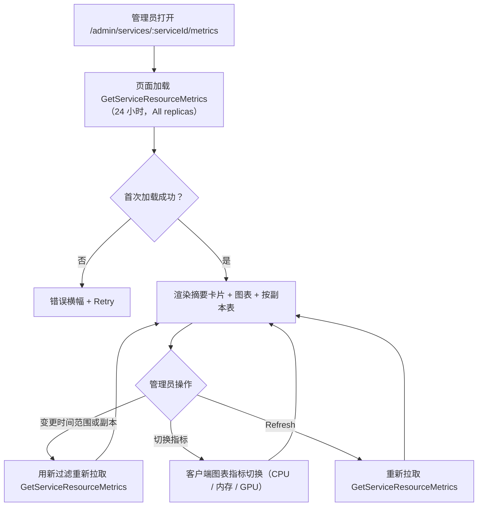
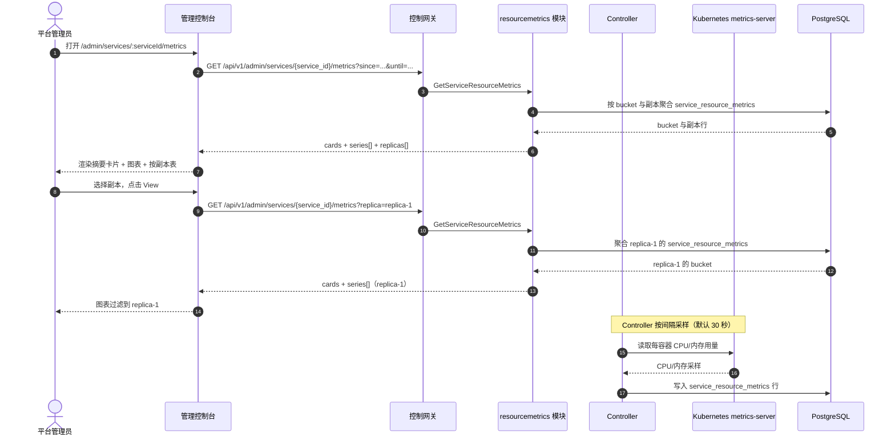

# 推理服务资源指标 — 需求分析与 UI/UX 设计

| 属性 | 内容 |
| --- | --- |
| 特性点 | 推理服务资源指标 — 按时间查看每个服务的 CPU / 内存 / GPU 利用率，支持时间范围过滤与资源使用图表（backlog 第 37 行） |
| 文档范围 | 需求分析、竞品调研、`/admin/services/:serviceId/metrics` 管理面服务指标页、页面 → API 面映射表，以及编号验收标准 |
| 归属模块 | `resourcemetrics`（新增 — 拥有对新增 `service_resource_metrics` 表的只读聚合）、`internal/controller`（只读：从 Kubernetes metrics-server 与加速器信号采样每个服务的 CPU/内存/GPU）、`pkg/server` 网关（管理前缀绑定）、`web` 管理控制台（`ServiceMetricsPage`） |
| 相关文档 | [架构设计](./architecture.md) — 第 2.4 节 `infer`、第 2.7 节 Controller、第 4.2 节一键部署流程 · [模型可观测性仪表盘](./model-observability.md) — 姊妹只读时序聚合及其 bucket/新鲜度/范围约定 · [加速器清单与健康](./accelerator-inventory.md) — 提供 GPU 利用率来源的姊妹 GPU 健康面 · [推理服务日志查看器](./service-logs-viewer.md) — 姊妹按服务诊断面及本特性复用的 Controller 读取模式 · [控制台面分离](./console-surface-separation.md) — 两个面、`AdminShell` 约定、掩码投影规则 |
| 状态 | 设计完成，已移交架构师代理 |

---

## 1. 背景与竞品调研

### 1.1 为什么现在做资源指标页

go-taas 将推理服务作为 Kubernetes Deployment 运行（model-catalog-deployment §4.2）：Controller 创建 Deployment 与 Service，推理引擎（vLLM 等）在容器中运行。模型可观测性特性（第 24 行）解释了*模型表现如何*（延迟、吞吐、错误率、token/秒），数据来自 `request_logs`；服务日志查看器（第 33 行）显示*引擎打印了什么*。运营者仍无法回答的基础设施问题是：*这个服务真的用上了分配给它的资源吗？* 当服务变慢时，运营者无法判断它是 CPU 受限、内存受限还是 GPU 饥饿，除非离开控制台对 Pod 执行 `kubectl top` 或查询指标端点。

本特性新增**推理服务资源指标**页：按时间查看每个服务的 CPU / 内存 / GPU 利用率，支持时间范围过滤与资源使用图表。这是 Phase 4 运维面中最小可独立交付的增量：它把「服务很慢」变成「服务在过去一小时 CPU 饱和到 95%，而 GPU 只有 20% —— 瓶颈在算力而非加速器」。它是**只读**聚合层 — 推理、计量或计费管线均无改动。

### 1.2 竞品如何呈现按服务的资源利用率

| 产品 | 资源面 | 指标 | 时间范围 / 图表 | 主要陷阱 |
| --- | --- | --- | --- | --- |
| **kubectl top** | 每 Pod/容器的 CPU 与内存用量（某一时刻） | CPU（毫核）、内存（字节） | 无历史；仅瞬时 | 仅 CLI；无 GPU；无时序；泄漏 Pod 名 |
| **Kubernetes Dashboard** | 每工作负载的 CPU/内存用量图表 | 每 Pod/Deployment 的 CPU、内存 | 时间范围图表；无 GPU | 运营者编排内部信息；泄漏 Pod 名；无 GPU 利用率 |
| **Grafana** | 查询指标数据源的仪表盘面板 | 任意（Prometheus 等） | 完整时序，支持平移/缩放、阈值、图例 | 需要完整可观测性栈（Prometheus + Grafana）；仪表盘由用户自建 |
| **Datadog** | 主机/容器/进程资源图表 | CPU、内存、I/O、GPU（经集成） | 完整时序；进程级分解 | 重型 agent；第三方 SaaS；GPU 需厂商集成 |
| **Prometheus** | 从 exporter 抓取的原始时序指标 | CPU、内存、GPU（node-exporter、DCGM） | PromQL 查询；Grafana 出图 | 原始指标，非产品面；需要运营者自跑的 Prometheus 栈 |
| **CloudWatch** | 每容器/EC2 资源指标 | CPU、内存、GPU（经自定义指标） | 时序图表；绑定 AWS | 绑定 AWS；GPU 需自定义指标管道 |
| **vLLM metrics** | Prometheus 指标端点（GPU 利用率、KV cache、token/秒） | GPU 利用率、KV cache 用量 | Prometheus 时序；Grafana 仪表盘 | 原始指标，非产品面；需要 Prometheus/Grafana 栈 |

### 1.3 提炼出的模式与决策

值得采纳的模式：

1. **指标切换时序图表上方的摘要卡片** — Grafana 与 Datadog 以头条资源值（当前 CPU%、内存、GPU%）开场，图表在其上；一个仪表盘端点同时返回卡片 + bucket，避免 N+1 调用的慢控制台（usage-dashboard D1 模式）。
2. **CPU 与内存来自 Kubernetes metrics-server** — Kubernetes 的资源指标管线（`metrics.k8s.io`，由 metrics-server 提供）是每容器 CPU/内存用量的规范、依赖精简来源；`kubectl top` 与 Kubernetes Dashboard 都读取它。go-taas 经 Controller（唯一持有 Kubernetes 客户端的组件）复用它。
3. **GPU 利用率来自加速器信号** — 加速器清单（特性 #18）已通过 Controller 收集每节点 GPU 状态；每服务的 GPU 利用率从同一加速器信号（厂商暴露 DCGM 式利用率处）推导，且为**尽力而为**（异构加速器：NVIDIA、Iluvatar、MetaX）。
4. **带自定义选择器的时间范围预设** — 24 小时 / 7 天 / 30 天 / 自定义是通用模式（usage-dashboard、observability）。
5. **新鲜度标注** — data-through 时间戳与待定/部分标记，因为采样指标滞后于墙钟（observability D6 模式）。
6. **内联 SVG 图表** — 控制台刻意依赖精简（usage-dashboard D7、observability D9）。

需要避免的陷阱：把原始 Prometheus 指标作为产品面（Prometheus、vLLM）— 控制台必须精选小而可扫读的集合；阻塞式 N+1 仪表盘 — 一个端点返回卡片 + bucket；向租户暴露运营者编排内部信息（Pod 名、副本数）— 页面仅管理面且将副本掩码为索引；静默过期的指标 — data-through 标记必须显式；在依赖精简的控制台中使用重型图表库；以及把瞬时快照伪装成时序（kubectl top）— 本特性持久化采样，让运营者能看到*随时间变化*的利用率。

**go-taas 的决策**（依据自主决策规则记录理由）：

| # | 决策 | 依据 |
| --- | --- | --- |
| D1 | **资源指标页仅存在于管理面**：`/admin/services/:serviceId/metrics` + `/api/v1/admin/services/{service_id}/metrics/*`。**无终端用户面** — 每服务的 CPU/内存/GPU 利用率是运营者编排内部信息（特性 #17 的掩码投影规则）；租户获得模型级性能（第 24 行），而非 Pod 资源内部信息 | 运营者需要基础设施利用率来调试容量与瓶颈；租户需要模型性能，而非 Pod 内部信息。与仅管理面的加速器清单（特性 #18）、系统状态（特性 #30）与服务日志（特性 #33）一致 |
| D2 | **CPU 与内存经 Controller 从 Kubernetes metrics-server（`metrics.k8s.io`）采样，GPU 利用率来自加速器信号（特性 #18）**。Controller 是唯一持有 Kubernetes 客户端的组件；它按间隔（默认 30 秒）轮询每个服务每个副本的 CPU/内存/GPU，并向新增的 `service_resource_metrics` 表写入每（服务、副本、采样）一行 | metrics-server 是容器 CPU/内存的规范、依赖精简来源（kubectl top、Kubernetes Dashboard 都读取它）；加速器信号已携带 GPU 状态（特性 #18）。Controller 拥有 Kubernetes 客户端（service-logs AD2、accelerator AD1），因此是自然的采样者。新表持久化时序 — 与瞬时加速器快照不同，*随时间变化*的利用率需要存储 |
| D3 | **新增 `resourcemetrics` 模块**（`services/resourcemetrics`）拥有对 `service_resource_metrics` 表的只读聚合，带自有错误块 **121xx**。它复用 observability 模式（bucket 构建器、新鲜度、范围契约 10404），但拥有自己的表与 RPC | 资源利用率是基础设施遥测（类似加速器），区别于对 `request_logs` 的请求派生可观测性聚合（model-observability AD3）。专用模块保持关注点分离并给它一个归属，契合按特性分模块的模式（accelerator、status、error-analysis） |
| D4 | **新增一个 RPC `GetServiceResourceMetrics`** 返回每服务的摘要卡片、bucket 时序与按副本分解，带时间范围与可选副本过滤。它镜像 `GetModelObservability` 的卡片 + 时序 + 按 key 形状 | 页面需要同时呈现多种形状（头条卡片、时序、按副本表）；专用 RPC 把资源关注点从可观测性聚合面分离并给它一个归属（D3） |
| D5 | **时间 bucket 随范围自适应**：范围 ≤ 7 天用小时 bucket，> 7 天用天 bucket。范围上限为 **92 天**，校验复用 **10404** `CodeMeteringRangeInvalid` | 短范围的小时粒度显示日内尖峰（瓶颈相关信号）；长范围的天粒度保持载荷精简。92 天上限与 10404 复用使范围契约与每次计量/可观测性查询统一（model-observability AD7） |
| D6 | **新鲜度显式**：每个响应携带 `data_through` — `service_resource_metrics` 表覆盖的最后一个完整采样 bucket 的起始。当所选范围超出它时，控制台显示「data through <time>」提示与待定/部分标记 | 采样指标滞后于墙钟最多一个采样间隔；标记在零新增管线工作下保持新鲜度故事诚实（model-observability AD8） |
| D7 | **GPU 利用率是尽力而为**：当加速器信号暴露每 Pod GPU 利用率（DCGM 式）时，时序携带它；当厂商不暴露（或加速器信号缺失）时，GPU 时序为空，页面显示「GPU 指标不可用」提示 | 异构加速器（NVIDIA、Iluvatar、MetaX）是否暴露利用率不一；尽力而为的 GPU 时序在无解析契约时优雅降级为「不可用」（镜像 service-logs 的尽力而为级别过滤，D6） |
| D8 | **图表用内联 SVG 渲染** — 每 bucket 一根柱（或线），带指标切换器（CPU / 内存 / GPU）— 无新增图表依赖 | 控制台刻意依赖精简；小而可测试的 SVG 组件契合 usage-dashboard D7 与 observability D9 决策 |
| D9 | **新增资源指标错误块（12101–12199）**：**12101 `CodeServiceMetricsInvalid`**（无效的指标维度或副本过滤）。未知 `service_id` 复用 **10301**；未知副本复用 **10304**；无效范围复用 **10404** | 资源指标是新模块（D3），因此其代码位于 forecast 块（120xx）之后的新块；独立的 invalid 让「指标/副本过滤错误」可操作，而服务/范围契约与 infer 和 metering 统一 |
| D10 | **页面只读且仅对访问审计** — 它不写数据、不改变任何东西；页面仅对已认证的管理会话可达，且无资源指标变更被审计（无可变更之物） | 该特性是对采样指标的纯读取；审计轨迹（特性 #15）已覆盖底层服务写入。无需新增审计事件 |

### 1.4 范围边界

**范围内**：服务指标页（摘要卡片、指标切换时序图表、按副本分解、时间范围与副本过滤）、Controller 的每服务 CPU/内存/GPU 采样器写入新增 `service_resource_metrics` 表，以及只读聚合 RPC。

**范围外**（由其他特性点跟踪）：模型级性能指标（延迟/吞吐/错误率 — 特性 #24）、请求级追踪（特性 #27）、容器日志（特性 #33）、Prometheus/Grafana 栈或 PromQL 查询语言（刻意缺失，D2）、资源用量的告警或阈值通知（特性 #26 在控制台内消费可观测性事件 — 此处范围外）、以及用户面资源面（刻意缺失，D1）。

---

## 2. 用户角色

| 角色 | 描述 | 与资源指标页的交互 |
| --- | --- | --- |
| **平台管理员** | 运行 go-taas 集群并调优推理服务的运营者 | 查看推理服务的 CPU/内存/GPU 随时间利用率，按时间范围与副本过滤，并读取摘要卡片以定位瓶颈 |
| **智能体 / SDK** | 调用 `/v1/chat/completions` 的程序化消费者 | 从不接触资源指标页；经网关用 API Key 消费服务的端点 |

> 术语：消费侧调用方称为 **Agent**（英文）/「智能体」（中文），与仓库约定一致。本特性仅管理面，因此消费侧术语不适用于租户面。

---

## 3. 用户故事

| # | 作为… | 我想要… | 以便… |
| --- | --- | --- | --- |
| US1 | 平台管理员 | 打开一个推理服务并在控制台查看其 CPU/内存/GPU 随时间利用率 | 无需运行 `kubectl top` 即可判断慢服务是 CPU 受限、内存受限还是 GPU 饥饿 |
| US2 | 平台管理员 | 按时间范围过滤指标 | 聚焦特定窗口（如故障前最后一小时）而非全部历史 |
| US3 | 平台管理员 | 在 CPU、内存、GPU 之间切换图表 | 一眼对比三个资源维度 |
| US4 | 平台管理员 | 查看按副本分解 | 隔离热点副本与健康副本 |
| US5 | 平台管理员 | 查看当前利用率的摘要卡片 | 无需扫读图表即可读取头条资源状态 |
| US6 | 智能体 / SDK | 经网关用 API Key 调用已部署模型的端点 | 获得补全结果，无需了解服务的资源利用率 |

---

## 4. 功能需求

### FR1 — 每服务资源采样

- **FR1.1** Controller 从 Kubernetes metrics-server（`metrics.k8s.io`）采样每个推理服务的 CPU 与内存用量，并从加速器信号（特性 #18）采样 GPU 利用率，按间隔（默认 30 秒），向 `service_resource_metrics` 表写入每（服务、副本、采样）一行。
- **FR1.2** 每个采样行携带 `service_id`、`replica_index`（掩码，如 `replica-1`）、`sampled_at`（RFC3339）、`cpu_percent`（用量 ÷ 请求 × 100，0–100+）、`memory_bytes`、`gpu_percent`（尽力而为，加速器信号不暴露时为空，D7）。
- **FR1.3** 无运行副本的服务不产生采样；页面显示空状态。

### FR2 — 只读聚合

- **FR2.1** `GetServiceResourceMetrics`（`GET /api/v1/admin/services/{service_id}/metrics`）返回指定时间范围与可选副本过滤下的每服务资源指标：摘要卡片、bucket 时序与按副本分解。它接受 `since`/`until`（unix 秒；默认 `until = now`、`since = until − 24h`）、`replica`（可选，掩码副本索引）与 `metric`（可选，`cpu` / `memory` / `gpu` 之一）。`since > until` 或范围 > 92 天返回 **10404**（D5）。
- **FR2.2** 响应的 `cards` 携带 `current_cpu_percent`、`current_memory_bytes`、`current_gpu_percent`（尽力而为）、`replica_count` 与 `data_through`（最后一个完整采样 bucket 的起始，D6）。
- **FR2.3** 响应的 `series[]` 携带每个时间 bucket 一项（范围 ≤ 7 天用小时，否则用天，D5）：`bucket`（unix 秒）、`cpu_percent`（跨副本均值）、`memory_bytes`（跨副本均值）、`gpu_percent`（跨副本均值，尽力而为）。当设置 `replica` 时，时序针对该副本；否则为服务级。
- **FR2.4** 响应的 `replicas[]` 携带范围内每个副本一行：`replica_index`、`current_cpu_percent`、`current_memory_bytes`、`current_gpu_percent`（尽力而为）与 `data_through`。表默认按 `replica_index` 升序排序。

### FR3 — 面与 API 绑定

- **FR3.1** 资源指标页位于**管理面**：路由 `/admin/services/:serviceId/metrics`，API 前缀 `/api/v1/admin/services/{service_id}/metrics/*`。它从服务详情页（特性 #2）经「Metrics」标签或链接到达。
- **FR3.2** 资源指标**无终端用户面**（D1）：租户看不到每服务的 CPU/内存/GPU 利用率。管理页仅调用 `/api/v1/admin/services/{service_id}/metrics/*` 路由，且不含任何 `/api/v1/*` 字符串（特性 #17，D1）。

---

## 5. 页面与流程设计

### 5.1 面分配

| 特性 | 面 | Web 路由 | API 前缀 |
| --- | --- | --- | --- |
| 每服务资源指标 | admin | `/admin/services/:serviceId/metrics` | `/api/v1/admin/services/{service_id}/metrics` |

以上每个页面与 API 调用都位于**管理面**；无终端用户面（D1）。管理页从不调用 `/api/v1/*` 路由，全程使用管理会话域。

### 5.2 页面地图

| 页面 / 组件 | 用途 |
| --- | --- |
| **服务指标页**（`/admin/services/:serviceId/metrics`） | 每服务 CPU/内存/GPU 随时间利用率，含摘要卡片、指标切换时序图表、按副本分解与时间范围/副本过滤 |

### 5.3 页面：`/admin/services/:serviceId/metrics` — 服务指标（admin）

**用途**：给平台管理员一个单一面读取推理服务的资源随时间利用率 — 摘要卡片、指标切换图表与按副本分解 — 以定位 CPU/内存/GPU 瓶颈。

**面**：admin — 路由 `/admin/services/:serviceId/metrics`，API `/api/v1/admin/services/{service_id}/metrics`。

**布局**：在 `AdminShell`（特性 #17）内渲染。页头（「Service Metrics」，副标题含服务名与 `service_id`）带 **Back to Service** 链接（次要）与 **Refresh** 操作（次要）。其下：

1. **过滤栏** — **时间范围**控件（共享预设：24 小时 / 7 天 / 30 天 / 自定义，带日期时间选择器）与**副本**下拉（来自按副本分解，「All replicas」默认）。任一变更即重新拉取。
2. **摘要卡片** — 一行卡片：**CPU**（当前 %）、**内存**（当前字节）、**GPU**（当前 %，尽力而为为空时显示「Unavailable」）、**副本数**（计数）。每张卡片显示所选范围与副本过滤下的值，带「data through <time>」新鲜度提示（D6）。
3. **时序图表** — 内联 SVG 图表（D8），带**指标切换器**（CPU / 内存 / GPU）。每 bucket 一根柱（或线）；选择副本时时序针对该副本，否则为服务级。
4. **按副本表** — 服务的副本，列：**副本**（掩码索引）、**CPU**（当前 %）、**内存**（当前字节）、**GPU**（当前 %，或「Unavailable」）、**Data through**。行操作 **View** 将图表过滤到该副本。

**交互状态**：

| 状态 | 行为 |
| --- | --- |
| 默认 | 过滤栏 + 摘要卡片 + 图表 + 按副本表从首次成功加载渲染；last-updated 显示加载时间 |
| 加载中 | 骨架卡片与表；Refresh 禁用 |
| 空 | 「No resource metrics in this range.」并提示采样在服务启动且采样间隔过后出现；过滤栏保持可见 |
| 错误 | 错误横幅含消息与 Retry 按钮；页面保留最后良好数据并显示「Showing stale data」横幅 |
| 禁用 | 加载进行中 Refresh 禁用；重新拉取进行中指标切换器禁用 |
| 权限拒绝 | 无所需角色的会话收到 10036，页面显示标准权限拒绝状态（特性 #17）并带返回管理首页的链接 |

**过滤栏控件**：时间范围（共享预设控件）、副本下拉（来自按副本分解，「All replicas」默认）。任一变更即重新拉取。指标切换器在客户端切换 CPU / 内存 / GPU，无需重新拉取。

**摘要卡片**：CPU（当前 %）、内存（当前字节）、GPU（当前 %，或「Unavailable」）、副本数（计数）。每张卡片显示「data through <time>」新鲜度提示（D6）。

**时序图表**：内联 SVG，每 bucket 一根柱（或线），指标切换器（CPU / 内存 / GPU）。选择副本时时序针对该副本，否则为服务级。

**按副本表列**：副本（掩码索引）、CPU（当前 %）、内存（当前字节）、GPU（当前 %，或「Unavailable」）、Data through。可按副本、CPU、内存、GPU 排序。可按副本下拉过滤；副本数超过页大小时分页。

### 5.4 流程

---

## 6. API 面影响

资源指标 RPC 属于 **`resourcemetrics` 模块**（D3），经控制网关以 HTTP 在**管理前缀** `/api/v1/admin/services/{service_id}/metrics` 提供（D1）。Controller 提供从 Kubernetes metrics-server 与加速器信号的只读每服务 CPU/内存/GPU 采样（D2）。**无用户前缀绑定**（D1）。

| RPC | 路由 | 前缀 | 状态 | 用途 |
| --- | --- | --- | --- | --- |
| `GetServiceResourceMetrics`（`taas.resourcemetrics.v1`） | `GET /api/v1/admin/services/{service_id}/metrics` | admin | **新增** | 返回每服务 CPU/内存/GPU 随时间利用率：摘要卡片、时序与按副本分解 |

**给架构师代理的契约说明**：

1. `GetServiceResourceMetrics` 接受 `since`/`until`（int64 unix 秒；默认 `until = now`、`since = until − 24h`）、`replica`（可选，掩码副本索引）与 `metric`（可选，`cpu` / `memory` / `gpu` 之一）。它返回 `cards`（当前 CPU/内存/GPU、副本数、`data_through`）、`series[]`（每 bucket 一项，含 `bucket`、`cpu_percent`、`memory_bytes`、`gpu_percent`）与 `replicas[]`（每副本一行，含 `replica_index`、当前 CPU/内存/GPU、`data_through`）。
2. Controller 从 Kubernetes metrics-server（`metrics.k8s.io`）采样 CPU/内存，从加速器信号（特性 #18）采样 GPU 利用率，按间隔（默认 30 秒），向 `service_resource_metrics` 表写入每（服务、副本、采样）一行（D2）。写入前将 Pod 名掩码为副本索引（D1）。
3. GPU 利用率是尽力而为（D7）：当加速器信号不暴露它时，`gpu_percent` 为空，页面显示「GPU 指标不可用」提示。
4. 时间 bucket 随范围自适应（≤ 7 天用小时，否则用天，D5）；每个响应携带 `data_through` 用于新鲜度标记（D6）。
5. 线上约定不变：成功返回 HTTP 200，业务错误为 `{"code": <int>, "message": "..."}`，int64 字段序列化为 JSON 字符串。

错误码（既有块，`pkg/errors/codes.go`）：

| 条件 | 代码 | 常量 | 说明 |
| --- | --- | --- | --- |
| 未知 `service_id` | 10301 | `CodeInferServiceNotFound` | 复用 — infer 服务契约（FR2.1） |
| 未知副本 | 10304 | `CodeInferEndpointNotFound` | 复用 — 未知副本（FR2.1） |
| 无效 `metric` 维度或副本过滤 | 12101 | `CodeServiceMetricsInvalid` | **新增**（D9） |
| 无效范围（`since > until` 或 > 92 天） | 10404 | `CodeMeteringRangeInvalid` | 复用 — 计量范围契约（D5） |

---

## 7. 验收标准

| # | 标准 | 级别 |
| --- | --- | --- |
| AC1 | `GetServiceResourceMetrics` 在有效范围内返回摘要卡片、时序与按副本分解；范围 > 92 天或 `since > until` 返回 10404 | FVT |
| AC2 | Controller 按（服务、副本、采样）写入 `service_resource_metrics` 行，含 `cpu_percent`、`memory_bytes` 与尽力而为的 `gpu_percent`；无运行副本的服务不产生采样 | FVT |
| AC3 | 范围 ≤ 7 天用小时 bucket，> 7 天用天 bucket；每个响应携带 `data_through` | FVT |
| AC4 | `/admin/services/:serviceId/metrics` 页从首次成功加载渲染过滤栏、摘要卡片、图表与按副本表 | E2E |
| AC5 | 变更时间范围或副本会重新拉取指标；指标切换器在客户端切换 CPU / 内存 / GPU，无需重新拉取 | E2E |
| AC6 | 按副本表显示掩码副本索引（绝不显示原始 Pod 名）；`gpu_percent` 为空时 GPU 卡片显示「Unavailable」 | E2E |
| AC7 | 服务指标页仅管理面可达：路由 `/admin/services/:serviceId/metrics`，每个 API 调用使用 `/api/v1/admin/services/{service_id}/metrics` 前缀且不含 `/api/v1/*` 字符串 | E2E（面分离） |
| AC8 | 无所需角色的会话在服务指标页收到 10036，页面显示标准权限拒绝状态 | E2E |

---

## 8. 范围外（在其他处跟踪）

| 项 | 位置 |
| --- | --- |
| 模型级性能指标（延迟/吞吐/错误率） | 特性 #24 模型可观测性 |
| 请求级追踪与延迟分解 | 特性 #27 请求追踪 |
| 容器日志 | 特性 #33 服务日志查看器 |
| Prometheus/Grafana 栈或 PromQL 查询语言 | 刻意缺失（D2）— 指标从 metrics-server 与加速器信号采样 |
| 资源用量的告警或阈值通知 | 特性 #26 通知中心在控制台内消费可观测性事件 |
| 用户面资源面 | 刻意缺失（D1）— 租户获得模型性能，而非 Pod 资源内部信息 |
| 资源指标保留 / 归档 | 未来细化 — 采样表的生命周期保持不变 |