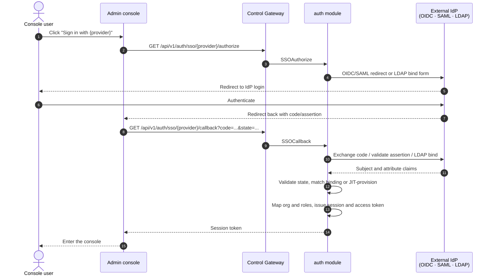
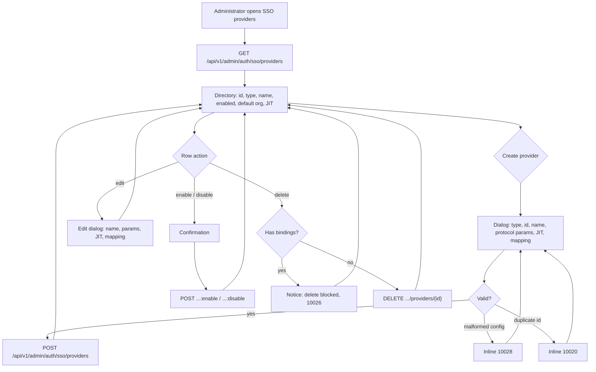
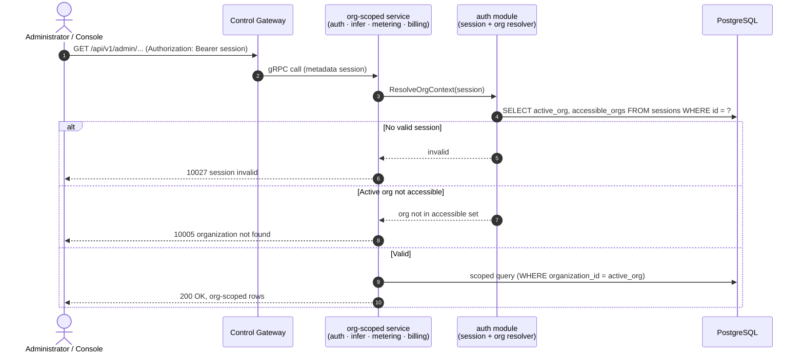

# SSO Federation (OIDC/LDAP/SAML) & Account Binding — Requirement Analysis and UI/UX Design

| Attribute | Content |
| --- | --- |
| Feature point | SSO federation (OIDC/LDAP/SAML) & account binding |
| Document scope | Requirement analysis and UI/UX design for the authentication core: the pluggable identity-provider (IdP) framework (OIDC, SAML 2.0, LDAP/LDAPS), provider configuration management, the SSO login flow (authorize + callback), account binding and Just-In-Time (JIT) provisioning, sessions and access tokens, attribute-to-role mapping, the console login page and session handling, the org context evolving from the transitional `X-Organization-Id` header to a session-derived context, and acceptance criteria |
| Owning modules | `auth` (IdP framework, identity bindings, sessions, and the session-derived org context every module consumes), with `tenancy` (org membership resolution for the session) |
| Related documents | [Architecture Design](./architecture.md) — Section 2.1 `auth` (SSO federation, account binding, JIT provisioning, attribute mapping, sessions), Section 3.1 admin/user surface separation, Section 4.1 SSO federated login flow · [Multi-Tenancy](./multi-tenancy.md) — the validated org context this feature replaces with a session (its D4/FR3.3), the org directory and switcher this feature grounds in session membership (its D10/FR4.3) · [API Key Management](./api-key-management.md) — the data-plane key verification this feature leaves unchanged |
| Status | Design complete, handed to the Architect agent |

---

## 1. Background and Competitive Research

### 1.1 Why SSO Federation Comes Now

Features #1–#6 shipped the platform's whole accounting, serving, and tenancy spine on a **transitional identity model**: the console keeps a free-text org id in localStorage and sends it as `X-Organization-Id` on every request; feature #6 validated that header against the `organizations` table, but there is still **no login, no user, and no session**. The admin console is open to anyone who can reach it; the org context is a header any caller can forge; and there is no way to say "who is operating this console" or "which organization does this person belong to".

This feature point introduces real authentication. It delivers the pluggable IdP framework the architecture doc promises (OIDC/OAuth 2.0, SAML 2.0, LDAP/LDAPS), the account model that makes roles and memberships enforceable, and the session that replaces the transitional header. It is the seam feature #6 explicitly reserved: the org-context resolver stays, only its input changes from a caller-supplied header to a session-derived context.

### 1.2 How Comparable Products Implement SSO Federation

| Product | SSO protocols | Account binding / provisioning | Org & role mapping | Login UX | Notable pitfalls |
| --- | --- | --- | --- | --- | --- |
| **OpenAI Platform** | SAML 2.0, OIDC (enterprise plans); SCIM for user provisioning | JIT provisioning on first login; SCIM for directory sync | IdP group → org role mapping; per-org membership | "Sign in with SSO" on the login page; IdP redirect | SSO is gated behind enterprise plans; SCIM sync lag causes stale memberships |
| **Anthropic Console** | SAML 2.0, OIDC; SCIM | JIT provisioning; SCIM sync | IdP group → workspace role mapping | SSO button on login; IdP redirect | Two selectors (org + project) confuse new users; role mapping is coarse |
| **Together AI** | OIDC, SAML (enterprise) | JIT provisioning | Group → role mapping | SSO button; IdP redirect | Enterprise SSO is a paid tier; self-serve users still use email/password |
| **SiliconFlow** | Phone/email login primary; enterprise SSO (OIDC/SAML) for teams | Account binding to phone/email; enterprise SSO binds to the same account | Org membership per team | Phone/email OTP; enterprise SSO button | OTP-first flow adds friction; SSO and local accounts can drift |
| **百度千帆 (Baidu Qianfan)** | Baidu account login; enterprise SSO (OIDC/SAML) | Baidu account binding; enterprise SSO binds to the Baidu account | Org membership per enterprise | Baidu account login; enterprise SSO button | Tied to the Baidu identity ecosystem; external SSO is secondary |
| **阿里云百炼 (Alibaba Cloud Bailian)** | Alibaba Cloud RAM/SSO (OIDC/SAML); Alibaba Cloud account login | RAM role binding; Alibaba Cloud account is the identity | RAM role → workspace permission | Alibaba Cloud account login; RAM SSO redirect | Identity is the Alibaba Cloud account; workspace switching reloads the console |
| **Volcengine Ark (火山方舟)** | Volcengine account login; enterprise SSO (OIDC/SAML) | Volcengine account binding | Org membership per enterprise | Volcengine account login; SSO button | Tied to the Volcengine identity ecosystem |
| **Okta / Auth0 / Keycloak** (the IdPs themselves) | OIDC, SAML 2.0, LDAP, plus social logins | JIT provisioning; SCIM; identity linking | Claim/attribute → role mapping; group-based authorization | Hosted login page; redirect-based SSO | The reference for how a *provider* should behave: state/nonce validation, claim mapping, session lifecycle |

### 1.3 Distilled Patterns and Decisions

Common industry patterns worth adopting:

1. **Redirect-based SSO with a hosted login page** — every surveyed platform puts a "Sign in with SSO" entry on its login page, redirects to the IdP, and returns via a callback. The console never handles credentials for federated logins; the IdP does.
2. **Stable external identity as the binding key** — `issuer + subject` (OIDC/SAML) or `DN` (LDAP) is the primary key of the external identity, bound to a platform account. Re-login matches the binding; it never creates a duplicate account.
3. **JIT provisioning with an opt-out** — the first login auto-creates an account (Just-In-Time Provisioning) by default, but administrators can disable it so accounts are pre-assigned. This is the standard enterprise pattern (Okta/Auth0/Keycloak all support both).
4. **Claim/attribute → role mapping** — the IdP's group/role claims map to platform org, project, and role. Permissions follow the enterprise directory, not a separate admin step.
5. **Session + access token after login** — a successful login issues a session (server-side, revocable) and an access token. Logout revokes the session. This is the seam that replaces the transitional header.
6. **Multiple coexisting IdPs** — enterprises run several directories (Okta + GitHub + LDAP). Providers are config rows, not code; enabling several at once is table stakes.

Pitfalls to avoid:

- **Free-text identity** (the status quo) — no login means anyone can reach the console and forge the org header. This feature's core fix.
- **Credentials in the console** — federated logins must never ask the console to handle passwords; the IdP owns credentials. LDAP is the exception (bind over the wire), but it is a directory bind, not a stored password.
- **Duplicate accounts on re-login** — matching by email instead of `issuer + subject` forks accounts when emails change. The binding key must be the stable external identifier.
- **Unvalidated callbacks** — callbacks must validate `state`/`nonce`/signatures to prevent request forgery (the Okta/Auth0 lesson).
- **Session as a client-side cookie only** — a stateless cookie cannot be revoked server-side. Sessions live in Redis and are revocable.
- **Two context carriers at once** — the console must not send both a session and a free-text org header; the session is authoritative and the header is deprecated for the console.

**Decisions for go-taas** (recorded rationale, per the autonomous-decision rule):

| # | Decision | Rationale |
| --- | --- | --- |
| D1 | **Pluggable IdP framework with a unified plugin interface** — `authorize`, `callback`, and `identity extraction` are the three plugin hooks. v1 ships **OIDC/OAuth 2.0**, **SAML 2.0**, and **LDAP/LDAPS** providers; **WeChat is deferred**. Providers are config rows (CRUD), and multiple can be enabled simultaneously | The architecture doc's promise (Section 2.1); pattern 6; the feature title names OIDC/LDAP/SAML, and WeChat is a distinct plugin that can land later without touching the core |
| D2 | **Provider configuration model** — each provider row carries: `provider_id`, `type` (oidc/saml/ldap), `display_name`, protocol params (OIDC: `issuer`, `client_id`, `client_secret`, `redirect_uri`, `scopes`; SAML: `metadata_url`/`entity_id`, `acs_url`; LDAP: `host`, `port`, `bind_dn`, `base_dn`, `user_filter`), `enabled`, `default_org`, `allow_auto_provision` (JIT), and an `attribute_mapping` (username/email/group/role claim paths) | Pattern 4; a single config shape keeps the console's provider form uniform across protocols while the plugin interprets the protocol-specific fields |
| D3 | **Identity binding table** — `identity_bindings` keyed by `(provider_id, external_subject)` where `external_subject` = `issuer + subject` (OIDC/SAML) or `DN` (LDAP), bound to a platform `user_id`. This is the primary key of the external identity | Pattern 2; the stable external identifier is the only correct binding key; email is mutable and must not be the key |
| D4 | **JIT provisioning with an opt-out** — on first login, if `allow_auto_provision`, auto-create a platform user and bind; if disabled, reject with a "no account" error (10025) and the administrator pre-assigns a binding | Pattern 3; the standard enterprise pattern; pre-assignment is how a locked-down deployment controls who gets in |
| D5 | **Sessions and access tokens** — a successful login issues a server-side session (stored in Redis, revocable) and an access token. `Logout` revokes the session. **Token rotation and Single Logout (SLO) are deferred** | Pattern 5; a revocable server-side session is the seam that replaces the header; rotation and SLO are hardening that can follow |
| D6 | **Org context from the session** — for authenticated console requests, the org context comes from the session's active org (validated against the user's accessible orgs), not the header. The console stops sending `X-Organization-Id`; the header remains supported for CLI/transitional programmatic access (validated as in feature #6). When both a session and a header are present, the session wins | Feature #6's D4/FR3.3 reserved exactly this seam: the resolver stays, its input changes. One authoritative carrier avoids the "two context carriers" pitfall |
| D7 | **Attribute-to-role mapping** — the provider's `attribute_mapping` maps IdP claims (group/role) to platform org, project, and role. On login the mapped org/project/role are applied to the session. **Role enforcement across individual admin APIs is deferred** — the session carries roles and accessible orgs, but per-API authorization gates land in a later feature | Pattern 4; the mapping is the deliverable; enforcement is a separate concern that needs the full RBAC design |
| D8 | **Console login page and session handling** — a `/admin/login` page lists enabled providers as "Sign in with {display_name}" buttons; the SSO callback returns the console authenticated; the session token is stored and sent as `Authorization: Bearer`; a logout button revokes the session. The org switcher now lists the user's accessible orgs (from the session), and switching updates the session's active org | Pattern 1; the login page is the console's new front door; the switcher (feature #6's FR4.3) is grounded in session membership instead of free text |
| D9 | **API surface** — new `AuthService` RPCs: admin provider management (`ListSSOProviders`, `CreateSSOProvider`, `UpdateSSOProvider`, `DeleteSSOProvider`, `EnableSSOProvider`, `DisableSSOProvider`) under `/api/v1/admin/auth/sso/providers`; user-facing SSO (`SSOAuthorize`, `SSOCallback`) under `/api/v1/auth/sso/{provider}/authorize` and `/callback`; session (`GetSession`, `Logout`, `UpdateSessionOrg`) under `/api/v1/auth/*`; and admin identity-binding management (`ListIdentityBindings`, `CreateIdentityBinding`, `DeleteIdentityBinding`) under `/api/v1/admin/auth/identity-bindings` | The architecture doc's admin/user surface separation (Section 3.1): provider and binding management are admin-surface; login and session are user-surface |
| D10 | **New error codes** in the auth block: **10020 `CodeSSOProviderExists`**, **10021 `CodeSSOProviderNotFound`**, **10022 `CodeSSOProviderDisabled`**, **10023 `CodeSSOInvalidState`** (bad state/nonce), **10024 `CodeSSOAuthFailed`** (IdP rejected the exchange/bind), **10025 `CodeSSONoAccount`** (JIT disabled, no binding), **10026 `CodeIdentityBindingExists`**, **10027 `CodeSessionInvalid`** (missing/expired/revoked session), **10028 `CodeSSOProviderInvalid`** (malformed provider config) | The 100xx block is auth's; each failure mode needs its own code so the console can render the right inline message (the metering D9 pattern) |
| D11 | **Deferred**: WeChat provider, full RBAC enforcement across admin APIs, token rotation, Single Logout, local password lifecycle (registration/password reset beyond the existing `CreateUser`/`Login`), SCIM directory sync, and project-scoped resource columns | WeChat is a distinct plugin; RBAC needs a dedicated design; rotation/SLO/SCIM are hardening; the local password lifecycle is secondary to federation; project columns were deferred in feature #6 |

### 1.4 Scope Boundary

**In scope**: the pluggable IdP framework with OIDC, SAML 2.0, and LDAP/LDAPS providers; provider configuration CRUD and enable/disable; the SSO login flow (authorize + callback) with state/nonce validation; the `identity_bindings` table and JIT provisioning; sessions and access tokens with logout; attribute-to-role mapping applied to the session; the console login page, session handling, and logout; the org context evolving from the header to the session; the org switcher grounded in session membership; new error codes 10020–10028.

**Out of scope** (tracked elsewhere): WeChat provider (future plugin), full RBAC enforcement across admin APIs (dedicated design), token rotation and Single Logout (hardening), SCIM directory sync (future), local password lifecycle beyond the existing `CreateUser`/`Login` (secondary), project-scoped resource columns (feature #6 deferral), and CLI SSO commands (follow the API, shipped when the CLI surface is next touched).

---

## 2. User Roles

| Role | Description | Interaction with SSO |
| --- | --- | --- |
| **Platform administrator** | The operator who runs the go-taas cluster; today also the console user | Configures SSO providers, enables/disables them, pre-assigns identity bindings when JIT is off, and logs in via SSO to operate the console |
| **Console user** | Anyone who operates the admin console | Signs in via an enabled provider, gets a session, and works within the orgs the session grants |
| **Agent / SDK** | The programmatic consumer whose calls generate usage | Unaffected directly: the data plane still authenticates by API key; SSO governs the control plane only |
| **Auditor** | Whoever resolves a billing or usage dispute | Traces console actions to a named user (from the session), not an anonymous header |
| **Console (this feature)** | The admin web UI | Renders the login page, the SSO providers page, the identity bindings page, and the session-aware org switcher |

> Terminology: the consuming caller is called an **Agent** (English) / 「智能体」(Chinese), consistent with the repo convention.

---

## 3. User Stories

| # | As a… | I want to… | So that… |
| --- | --- | --- | --- |
| US1 | Platform administrator | configure an OIDC provider (issuer, client id/secret, redirect URI) | my team can sign in with our existing identity provider |
| US2 | Platform administrator | enable several providers at once (OIDC + LDAP) | different teams can use the directory they already have |
| US3 | Platform administrator | disable a provider without deleting its config | I can pause a directory during an outage and re-enable it later |
| US4 | Console user | click "Sign in with {provider}" and be redirected to my IdP | I never type a password into the console |
| US5 | Console user | be auto-provisioned an account on my first login | I can start working without an administrator creating me first |
| US6 | Platform administrator | disable auto-provisioning and pre-assign accounts | only pre-approved identities can enter the console |
| US7 | Console user | sign in again and land on the same account | re-login never creates a duplicate account |
| US8 | Console user | have my IdP group mapped to a platform role | my permissions follow my enterprise directory |
| US9 | Console user | see only the organizations I have access to in the switcher | I cannot switch into a tenant I do not belong to |
| US10 | Console user | sign out and have my session revoked | a shared workstation cannot be left authenticated |
| US11 | Platform administrator | see which external identities are bound to which users | I can audit and pre-assign bindings |
| US12 | Agent / SDK operator | keep using my API key on the data plane unchanged | SSO on the control plane does not break inference traffic |

---

## 4. Functional Requirements

### FR1 — Provider configuration management

- **FR1.1** `CreateSSOProvider` (`POST /api/v1/admin/auth/sso/providers`) creates a provider: caller-supplied `provider_id` (3-64 chars, `[a-z0-9][a-z0-9-]{2,63}`, lowercase), `type` (`oidc`/`saml`/`ldap`), `display_name` (1-128 chars), protocol params per type, `enabled` (default false), `default_org`, `allow_auto_provision` (default true), and `attribute_mapping`. Duplicate id → 10020; malformed config → 10028.
- **FR1.2** `ListSSOProviders` (`GET /api/v1/admin/auth/sso/providers`) returns all providers paginated, each row carrying id, type, display name, enabled state, `default_org`, `allow_auto_provision`, and a redacted view of protocol params (secrets like `client_secret`/`bind_dn` are masked). Filter: `type`, `enabled` (optional).
- **FR1.3** `GetSSOProvider` (`GET /api/v1/admin/auth/sso/providers/{provider_id}`) returns one provider with the same redacted fields. Unknown id → 10021.
- **FR1.4** `UpdateSSOProvider` (`PATCH /api/v1/admin/auth/sso/providers/{provider_id}`) edits display name, protocol params, `default_org`, `allow_auto_provision`, and `attribute_mapping`. The id and type are immutable. Unknown id → 10021; malformed → 10028.
- **FR1.5** `EnableSSOProvider`/`DisableSSOProvider` (`POST …/providers/{provider_id}:enable` / `:disable`) flip `enabled` (idempotent). A disabled provider's `SSOAuthorize` → 10022.
- **FR1.6** `DeleteSSOProvider` (`DELETE …/providers/{provider_id}`) removes a provider **only if it has no identity bindings**; otherwise → 10026 (bindings are durable evidence). Unknown id → 10021.

### FR2 — SSO login flow

- **FR2.1** `SSOAuthorize` (`GET /api/v1/auth/sso/{provider}/authorize`) initiates login for an enabled provider: for OIDC/SAML it returns a redirect URL to the IdP carrying a signed `state`/`nonce`; for LDAP it returns a bind form (the console renders a username/password prompt that is sent to the IdP over the wire, never stored). Disabled provider → 10022; unknown → 10021.
- **FR2.2** `SSOCallback` (`GET /api/v1/auth/sso/{provider}/callback?code=…&state=…`) completes login: it validates `state`/`nonce` (mismatch → 10023), exchanges the code/assertion with the IdP (failure → 10024), extracts the external subject and claims, and resolves the identity.
- **FR2.3** **Identity resolution**: look up `identity_bindings` by `(provider_id, external_subject)`. On a hit, load the bound user. On a miss, if `allow_auto_provision`, create a user and binding (JIT); if disabled, → 10025 `CodeSSONoAccount`.
- **FR2.4** **Session issuance**: on success, create a session (Redis, revocable) carrying `user_id`, roles, accessible orgs, and the active org (from `default_org` or attribute mapping), and return a session token + access token. The console stores the session token.
- **FR2.5** **LDAP bind**: `SSOCallback` for an LDAP provider performs a directory bind with the submitted DN/password; success resolves the user by DN; failure → 10024. The password is used only for the bind and never persisted.

### FR3 — Account binding and JIT provisioning

- **FR3.1** `CreateIdentityBinding` (`POST /api/v1/admin/auth/identity-bindings`) pre-assigns a binding: `provider_id`, `external_subject`, `user_id`. Duplicate `(provider_id, external_subject)` → 10026; unknown provider → 10021; unknown user → 10005.
- **FR3.2** `ListIdentityBindings` (`GET /api/v1/admin/auth/identity-bindings`) returns bindings paginated, filtered by `provider_id` and `user_id` (optional), each row carrying provider id, external subject, user id, and created time.
- **FR3.3** `DeleteIdentityBinding` (`DELETE …/identity-bindings/{binding_id}`) removes a binding (idempotent). Removing a binding does not delete the user; it only severs the external identity link.
- **FR3.4** JIT provisioning creates a user with a generated `user_id`, a display name from the mapped username claim, and no password (federated-only). A JIT-created user cannot log in via local password until one is set.

### FR4 — Sessions and org context

- **FR4.1** `GetSession` (`GET /api/v1/auth/session`) returns the current session's `user_id`, display name, roles, accessible orgs, active org, and expiry. Missing/expired/revoked session → 10027.
- **FR4.2** `Logout` (`POST /api/v1/auth/logout`) revokes the session (idempotent). Subsequent `GetSession` → 10027.
- **FR4.3** `UpdateSessionOrg` (`POST /api/v1/auth/session/org`) sets the session's active org, validated against the user's accessible orgs. An org the user cannot access → 10005.
- **FR4.4** **Org context resolution**: every org-scoped admin API resolves the org context from the session's active org when a session is present (the feature-#6 resolver, now fed by the session). The `X-Organization-Id` header remains supported for CLI/transitional programmatic access (validated as in feature #6). When both are present, the session wins and the header is ignored.

### FR5 — Console login, session handling, and SSO pages

- **FR5.1** A `/admin/login` page lists enabled providers as "Sign in with {display_name}" buttons (from `ListSSOProviders`). Clicking one calls `SSOAuthorize` and redirects to the IdP; the callback returns the console authenticated. A disabled-provider state shows a notice.
- **FR5.2** The console stores the session token and sends it as `Authorization: Bearer` on every request; it **stops sending `X-Organization-Id`** (D6). A 10027 response redirects to `/admin/login`.
- **FR5.3** An "SSO providers" nav item (`/admin/sso`) opens the provider directory: one row per provider — id, type badge, display name, enabled state, `default_org`, `allow_auto_provision`; a "Create provider" dialog (type selector, id, name, protocol params, JIT toggle, attribute mapping); row actions: edit, enable/disable with confirmation, delete (blocked with a notice when bindings exist); inline errors for 10020/10021/10026/10028.
- **FR5.4** An "Identity bindings" nav item (`/admin/identity-bindings`) opens the binding directory: one row per binding — provider, external subject, user, created time; a "Pre-assign binding" dialog (provider dropdown, external subject, user); row actions: delete with confirmation; inline errors for 10026.
- **FR5.5** The sidebar org switcher lists the user's accessible orgs (from `GetSession`), replacing the free-text/global list; switching calls `UpdateSessionOrg`. A logout button in the user menu calls `Logout` and returns to `/admin/login`.

---

## 5. Page and Flow Design

### 5.1 Page Map

| Page / component | Purpose |
| --- | --- |
| **Login page** (`/admin/login`) | Lists enabled providers; "Sign in with {display_name}" buttons; redirects to the IdP |
| **SSO providers page** (`/admin/sso`) | Provider directory: rows, create/edit dialogs, enable/disable, delete |
| **Create/edit provider dialog** | Type selector, id, name, protocol params, JIT toggle, attribute mapping |
| **Identity bindings page** (`/admin/identity-bindings`) | Binding directory: rows, pre-assign dialog, delete |
| **Org switcher** (sidebar, session-aware) | Lists the user's accessible orgs; switches the session's active org |
| **User menu** | Logout button; current user display name |
| **All existing pages** | Unchanged layouts; org-scoped pages now use the session's active org and redirect to login on 10027 |

### 5.2 SSO Login Flow

### 5.3 SSO Providers Page Flow

### 5.4 Org Context Resolution (Session)

---

## 6. API Surface Implications

All APIs belong to the existing **`taas.auth.v1.AuthService`** (proto: `proto/taas/auth/v1/auth.proto`), served as HTTP via the Control Gateway. Provider and binding management are admin-surface under `/api/v1/admin/auth/*`; login, session, and logout are user-surface under `/api/v1/auth/*` (D9, per the architecture doc's Section 3.1 separation). The data-plane `VerifyAPIKey` RPC is unchanged.

| RPC | HTTP | Status | Purpose | Notes |
| --- | --- | --- | --- | --- |
| `CreateSSOProvider` | `POST /api/v1/admin/auth/sso/providers` | **new** | Create a provider | 10020/10028 on bad input |
| `ListSSOProviders` | `GET /api/v1/admin/auth/sso/providers` | **new** | The provider directory | Paginated; `type`/`enabled` filters; secrets masked |
| `GetSSOProvider` | `GET /api/v1/admin/auth/sso/providers/{provider_id}` | **new** | One provider | 10021 when unknown |
| `UpdateSSOProvider` | `PATCH /api/v1/admin/auth/sso/providers/{provider_id}` | **new** | Edit name/params/JIT/mapping | Id and type immutable |
| `EnableSSOProvider` | `POST …/providers/{provider_id}:enable` | **new** | Activate | Idempotent |
| `DisableSSOProvider` | `POST …/providers/{provider_id}:disable` | **new** | Pause | Idempotent; authorize → 10022 |
| `DeleteSSOProvider` | `DELETE …/providers/{provider_id}` | **new** | Remove | Blocked while bindings exist (10026) |
| `SSOAuthorize` | `GET /api/v1/auth/sso/{provider}/authorize` | **new** | Initiate login | Redirect URL or LDAP bind form |
| `SSOCallback` | `GET /api/v1/auth/sso/{provider}/callback` | **new** | Complete login | Validates state; issues session |
| `GetSession` | `GET /api/v1/auth/session` | **new** | Current session | 10027 when invalid |
| `UpdateSessionOrg` | `POST /api/v1/auth/session/org` | **new** | Switch active org | Validated against accessible orgs |
| `Logout` | `POST /api/v1/auth/logout` | **new** | Revoke session | Idempotent |
| `CreateIdentityBinding` | `POST /api/v1/admin/auth/identity-bindings` | **new** | Pre-assign a binding | 10026 on duplicate |
| `ListIdentityBindings` | `GET /api/v1/admin/auth/identity-bindings` | **new** | The binding directory | `provider_id`/`user_id` filters |
| `DeleteIdentityBinding` | `DELETE …/identity-bindings/{binding_id}` | **new** | Sever a binding | Idempotent; user kept |
| `VerifyAPIKey` | (gRPC, data plane) | unchanged | Data-plane auth | Unaffected by SSO |

Contract constraints:

1. Provider ids are caller-supplied and immutable; display names and protocol params are mutable; `enabled` transitions only through the enable/disable endpoints.
2. Wire-format conventions unchanged: dotted pagination (`?page.offset=0&page.limit=20`), success HTTP 200, business errors as `{"code": <int>, "message": "..."}`, int64 fields as JSON strings.
3. Secrets (`client_secret`, `bind_dn`) are write-only: returned masked (`"••••"`) in list/get responses and never echoed back.
4. The org-context change is contract-visible: the console now authenticates by session, and org-scoped APIs resolve the org from the session when present. The `X-Organization-Id` header remains supported for CLI/transitional access (feature #6 behavior unchanged for header-only callers).

Error codes (auth block 10001–10099, `pkg/errors/codes.go`):

| Condition | Code | Constant | Notes |
| --- | --- | --- | --- |
| Duplicate provider id | 10020 | `CodeSSOProviderExists` | **New** (D10) |
| Unknown provider | 10021 | `CodeSSOProviderNotFound` | **New** |
| Disabled provider on authorize | 10022 | `CodeSSOProviderDisabled` | **New** |
| Invalid state/nonce on callback | 10023 | `CodeSSOInvalidState` | **New** |
| IdP rejected exchange/bind | 10024 | `CodeSSOAuthFailed` | **New** |
| JIT disabled, no binding | 10025 | `CodeSSONoAccount` | **New** |
| Duplicate identity binding | 10026 | `CodeIdentityBindingExists` | **New** |
| Missing/expired/revoked session | 10027 | `CodeSessionInvalid` | **New** |
| Malformed provider config | 10028 | `CodeSSOProviderInvalid` | **New** |
| Unknown organization (org context) | 10005 | `CodeOrganizationNotFound` | Existing; reused for inaccessible active org |
| Missing `X-Organization-Id` (header-only) | 10001 | `CodeUnauthorized` | Unchanged for CLI/transitional |
| Database failure | 500 | `CodeInternal` | Via error normalization |

---

## 7. Acceptance Criteria

| # | Criterion | Verification |
| --- | --- | --- |
| AC1 | `CreateSSOProvider` stores an OIDC provider (issuer, client id/secret, redirect URI); `ListSSOProviders` returns it with the secret masked; duplicate id → 10020; malformed config → 10028 | Unit + FVT + E2E |
| AC2 | `EnableSSOProvider`/`DisableSSOProvider` transition idempotently; `SSOAuthorize` on a disabled provider → 10022 | Unit + FVT |
| AC3 | `UpdateSSOProvider` edits name/params/JIT/mapping (id and type untouched); unknown → 10021 | Unit + FVT |
| AC4 | `DeleteSSOProvider` removes a provider with no bindings; blocked with 10026 when bindings exist | Unit + FVT |
| AC5 | `SSOAuthorize` for an enabled OIDC provider returns a redirect URL carrying a signed state; `SSOCallback` with a valid code and state exchanges and issues a session; bad state → 10023; IdP rejection → 10024 | Unit + FVT |
| AC6 | First login with JIT enabled auto-creates a user and binding; a second login reuses the binding (no duplicate user) | Unit + FVT |
| AC7 | First login with JIT disabled and no pre-assigned binding → 10025; after `CreateIdentityBinding`, login succeeds | Unit + FVT |
| AC8 | `CreateIdentityBinding` stores the binding; duplicate `(provider, subject)` → 10026; `ListIdentityBindings` filters by provider/user; `DeleteIdentityBinding` severs it and keeps the user | Unit + FVT |
| AC9 | LDAP provider: a valid DN/password bind authenticates and resolves the user by DN; invalid → 10024 | Unit + FVT |
| AC10 | SAML provider: a valid signed assertion authenticates; an invalid signature → 10024 | Unit + FVT |
| AC11 | `GetSession` returns user, roles, accessible orgs, active org, expiry; `Logout` revokes it and subsequent `GetSession` → 10027 | Unit + FVT |
| AC12 | `UpdateSessionOrg` sets the active org when accessible; an inaccessible org → 10005 | Unit + FVT |
| AC13 | Attribute mapping maps an IdP group claim to a platform role; the session carries the mapped role | Unit + FVT |
| AC14 | The console login page lists enabled providers; clicking one redirects to the IdP; the callback returns the console authenticated | E2E |
| AC15 | The console sends the session token and stops sending `X-Organization-Id`; a 10027 response redirects to `/admin/login` | E2E |
| AC16 | The SSO providers page renders the directory, creates a provider via the dialog, enables/disables it, and surfaces inline 10020/10028 | E2E |
| AC17 | The identity bindings page renders the directory, pre-assigns a binding, and deletes one; inline 10026 surfaces | E2E |
| AC18 | The org switcher lists the user's accessible orgs and switching updates the session's active org; logout returns to `/admin/login` | E2E |
| AC19 | Regression: data-plane API key verification is unchanged; a CLI caller sending only `X-Organization-Id` still works (feature #6 behavior) | FVT + E2E regression |

---

## 8. Deferred Open Items

| Item | Deferred to |
| --- | --- |
| WeChat provider (QR login) | Future plugin (distinct IdP type) |
| Full RBAC enforcement across individual admin APIs | Dedicated authorization design |
| Token rotation and Single Logout (SLO) | Hardening follow-up |
| SCIM directory sync | Future |
| Local password lifecycle (registration/password reset beyond existing `CreateUser`/`Login`) | Secondary to federation |
| Project-scoped resource columns | Feature #6 deferral |
| CLI SSO commands | When the CLI surface is next touched |
| Session audit trail (who did what in the console) | Future operations tooling |