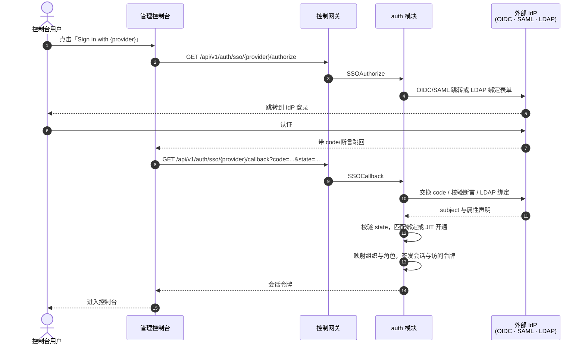
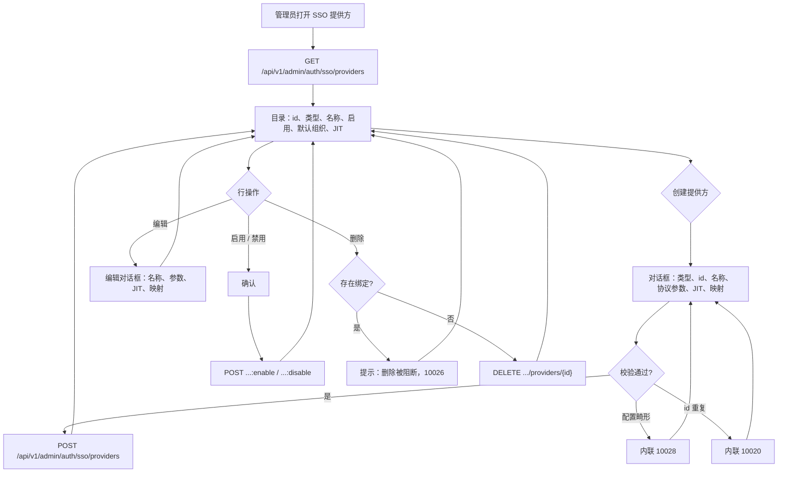
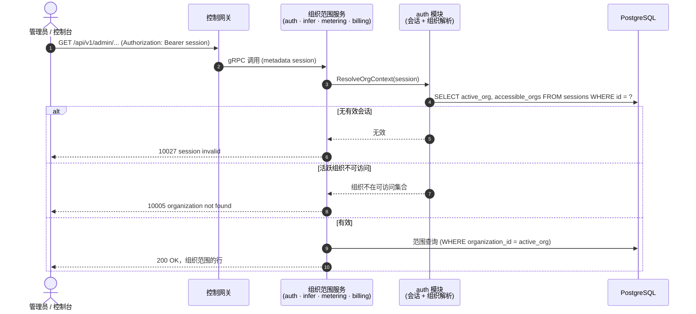

# SSO 联邦（OIDC/LDAP/SAML）与账号绑定 — 需求分析与 UI/UX 设计

| 属性 | 内容 |
| --- | --- |
| 特性点 | SSO 联邦（OIDC/LDAP/SAML）与账号绑定 |
| 文档范围 | 认证核心的需求分析与 UI/UX 设计：可插拔身份提供方（IdP）框架（OIDC、SAML 2.0、LDAP/LDAPS）、提供方配置管理、SSO 登录流程（authorize + callback）、账号绑定与即时开通（JIT Provisioning）、会话与访问令牌、属性到角色映射、控制台登录页与会话处理、组织上下文从过渡期 `X-Organization-Id` 头演进为会话派生上下文，以及验收标准 |
| 归属模块 | `auth`（IdP 框架、身份绑定、会话，及各模块消费的会话派生组织上下文），配合 `tenancy`（会话的组织成员解析） |
| 相关文档 | [架构设计](./architecture.zh-cn.md) — 第 2.1 节 `auth`（SSO 联邦、账号绑定、JIT 开通、属性映射、会话）、第 3.1 节管理面/用户面分离、第 4.1 节 SSO 联邦登录流程 · [多租户](./multi-tenancy.zh-cn.md) — 本特性以会话替换的经校验组织上下文（其 D4/FR3.3）、本特性以会话成员资格落地的组织目录与切换器（其 D10/FR4.3） · [API Key 管理](./api-key-management.zh-cn.md) — 本特性保持不变的数据面 Key 校验 |
| 状态 | 设计完成，已移交架构师代理 |

---

## 1. 背景与竞品调研

### 1.1 为什么现在做 SSO 联邦

特性 #1–#6 在一个**过渡期身份模型**之上交付了平台完整的计量、服务与租户主干：控制台把自由文本的 org id 存在 localStorage，并在每个请求上作为 `X-Organization-Id` 发送；特性 #6 已把该头对照 `organizations` 表校验，但**仍然没有登录、没有用户、没有会话**。管理控制台对任何能触达它的人开放；组织上下文是一个任何调用方都能伪造的头；也没有办法回答「谁在操作这个控制台」或「这个人属于哪个组织」。

本特性点引入真正的认证。它交付架构文档承诺的可插拔 IdP 框架（OIDC/OAuth 2.0、SAML 2.0、LDAP/LDAPS）、让角色与成员资格可执行的账号模型，以及取代过渡期头的会话。这正是特性 #6 明确预留的接缝：组织上下文解析函数保留，只有输入从调用方提供的头变为会话派生的上下文。

### 1.2 竞品的 SSO 联邦实现方式

| 产品 | SSO 协议 | 账号绑定 / 开通 | 组织与角色映射 | 登录 UX | 主要陷阱 |
| --- | --- | --- | --- | --- | --- |
| **OpenAI Platform** | SAML 2.0、OIDC（企业套餐）；SCIM 用户开通 | 首次登录 JIT 开通；SCIM 目录同步 | IdP 组 → 组织角色映射；按组织成员 | 登录页「Sign in with SSO」；IdP 跳转 | SSO 仅限企业套餐；SCIM 同步滞后导致成员过期 |
| **Anthropic Console** | SAML 2.0、OIDC；SCIM | JIT 开通；SCIM 同步 | IdP 组 → 工作区角色映射 | 登录页 SSO 按钮；IdP 跳转 | 双选择器（组织 + 项目）让新用户困惑；角色映射粗糙 |
| **Together AI** | OIDC、SAML（企业） | JIT 开通 | 组 → 角色映射 | SSO 按钮；IdP 跳转 | 企业 SSO 是付费档；自助用户仍用邮箱/密码 |
| **SiliconFlow** | 手机/邮箱登录为主；团队企业 SSO（OIDC/SAML） | 账号绑定到手机/邮箱；企业 SSO 绑定到同一账号 | 按团队的组织成员 | 手机/邮箱 OTP；企业 SSO 按钮 | OTP 优先流程增加摩擦；SSO 与本地账号可能漂移 |
| **百度千帆** | 百度账号登录；企业 SSO（OIDC/SAML） | 百度账号绑定；企业 SSO 绑定到百度账号 | 按企业的组织成员 | 百度账号登录；企业 SSO 按钮 | 绑定百度身份生态；外部 SSO 是次要的 |
| **阿里云百炼** | 阿里云 RAM/SSO（OIDC/SAML）；阿里云账号登录 | RAM 角色绑定；阿里云账号即身份 | RAM 角色 → 工作区权限 | 阿里云账号登录；RAM SSO 跳转 | 身份是阿里云账号；切换工作区整页刷新 |
| **火山方舟** | 火山账号登录；企业 SSO（OIDC/SAML） | 火山账号绑定 | 按企业的组织成员 | 火山账号登录；SSO 按钮 | 绑定火山身份生态 |
| **Okta / Auth0 / Keycloak**（IdP 本身） | OIDC、SAML 2.0、LDAP，外加社交登录 | JIT 开通；SCIM；身份关联 | 声明/属性 → 角色映射；基于组的授权 | 托管登录页；基于跳转的 SSO | 提供方行为的参照：state/nonce 校验、声明映射、会话生命周期 |

### 1.3 提炼出的模式与决策

值得采纳的行业通用模式：

1. **基于跳转的 SSO 与托管登录页** — 每个调研平台都在登录页放一个「Sign in with SSO」入口，跳转到 IdP，再经回调返回。控制台绝不处理联邦登录的凭据；凭据由 IdP 掌握。
2. **稳定外部身份作为绑定键** — `issuer + subject`（OIDC/SAML）或 `DN`（LDAP）是外部身份的主键，绑定到平台账号。重新登录匹配绑定；绝不创建重复账号。
3. **JIT 开通带可关闭开关** — 首次登录默认自动创建账号（即时开通），但管理员可关闭它，改为预分配账号。这是标准企业模式（Okta/Auth0/Keycloak 都支持两者）。
4. **声明/属性 → 角色映射** — IdP 的组/角色声明映射到平台组织、项目与角色。权限跟随企业目录，而非单独的管理步骤。
5. **登录后签发会话 + 访问令牌** — 成功登录签发服务端会话（可撤销）与访问令牌。登出撤销会话。这是取代过渡期头的接缝。
6. **多个 IdP 共存** — 企业运行多个目录（Okta + GitHub + LDAP）。提供方是配置行而非代码；同时启用多个是基本要求。

需要避免的陷阱：

- **自由文本身份**（现状）— 没有登录意味着任何人都能触达控制台并伪造组织头。本特性的核心修复。
- **控制台处理凭据** — 联邦登录绝不能让控制台处理密码；凭据由 IdP 掌握。LDAP 是例外（线上 bind），但那是目录绑定，不是存储的密码。
- **重新登录产生重复账号** — 用邮箱而非 `issuer + subject` 匹配会在邮箱变化时分叉账号。绑定键必须是稳定的外部标识符。
- **未校验的回调** — 回调必须校验 `state`/`nonce`/签名以防请求伪造（Okta/Auth0 的教训）。
- **仅客户端 cookie 的会话** — 无状态 cookie 无法在服务端撤销。会话存于 Redis 且可撤销。
- **两个上下文载体并存** — 控制台不能同时发送会话与自由文本组织头；会话是权威的，头对控制台已弃用。

**go-taas 的决策**（按自主决策规则记录依据）：

| # | 决策 | 依据 |
| --- | --- | --- |
| D1 | **可插拔 IdP 框架，统一插件接口** — `authorize`、`callback`、`identity extraction` 三个插件钩子。v1 交付 **OIDC/OAuth 2.0**、**SAML 2.0**、**LDAP/LDAPS** 提供方；**微信延后**。提供方是配置行（CRUD），可同时启用多个 | 架构文档的承诺（第 2.1 节）；模式 6；特性标题点名 OIDC/LDAP/SAML，微信是独立插件，可稍后落地而不触碰核心 |
| D2 | **提供方配置模型** — 每个提供方行携带：`provider_id`、`type`（oidc/saml/ldap）、`display_name`、协议参数（OIDC：`issuer`、`client_id`、`client_secret`、`redirect_uri`、`scopes`；SAML：`metadata_url`/`entity_id`、`acs_url`；LDAP：`host`、`port`、`bind_dn`、`base_dn`、`user_filter`）、`enabled`、`default_org`、`allow_auto_provision`（JIT）、`attribute_mapping`（username/email/group/role 声明路径） | 模式 4；单一配置形状让控制台的提供方表单跨协议统一，而插件解释协议特定字段 |
| D3 | **身份绑定表** — `identity_bindings` 以 `(provider_id, external_subject)` 为键，其中 `external_subject` = `issuer + subject`（OIDC/SAML）或 `DN`（LDAP），绑定到平台 `user_id`。这是外部身份的主键 | 模式 2；稳定外部标识符是唯一正确的绑定键；邮箱可变，不能作为键 |
| D4 | **JIT 开通带可关闭开关** — 首次登录时，若 `allow_auto_provision`，自动创建平台用户并绑定；若关闭，以「无账号」错误（10025）拒绝，由管理员预分配绑定 | 模式 3；标准企业模式；预分配是锁定部署控制谁能进入的方式 |
| D5 | **会话与访问令牌** — 成功登录签发服务端会话（存于 Redis、可撤销）与访问令牌。`Logout` 撤销会话。**令牌轮换与单点登出（SLO）延后** | 模式 5；可撤销的服务端会话是取代头的接缝；轮换与 SLO 是后续加固 |
| D6 | **组织上下文来自会话** — 对已认证的控制台请求，组织上下文来自会话的活跃组织（对照用户可访问组织校验），而非头。控制台停止发送 `X-Organization-Id`；头对 CLI/过渡期程序化访问仍受支持（按特性 #6 校验）。会话与头同时存在时，会话优先 | 特性 #6 的 D4/FR3.3 明确预留此接缝：解析函数保留，输入变化。单一权威载体避免「双上下文载体」陷阱 |
| D7 | **属性到角色映射** — 提供方的 `attribute_mapping` 把 IdP 声明（组/角色）映射到平台组织、项目与角色。登录时把映射的组织/项目/角色应用到会话。**各管理 API 上的角色执行延后** — 会话携带角色与可访问组织，但按 API 的授权闸门在后续特性落地 | 模式 4；映射是交付物；执行是独立关注点，需要完整的 RBAC 设计 |
| D8 | **控制台登录页与会话处理** — `/admin/login` 页把已启用提供方列为「Sign in with {display_name}」按钮；SSO 回调让控制台进入已认证状态；会话令牌存储并以 `Authorization: Bearer` 发送；登出按钮撤销会话。组织切换器现在列出用户可访问的组织（来自会话），切换更新会话的活跃组织 | 模式 1；登录页是控制台的新前门；切换器（特性 #6 的 FR4.3）以会话成员资格落地而非自由文本 |
| D9 | **API 面** — 新增 `AuthService` RPC：管理面提供方管理（`ListSSOProviders`、`CreateSSOProvider`、`UpdateSSOProvider`、`DeleteSSOProvider`、`EnableSSOProvider`、`DisableSSOProvider`）在 `/api/v1/admin/auth/sso/providers`；用户面 SSO（`SSOAuthorize`、`SSOCallback`）在 `/api/v1/auth/sso/{provider}/authorize` 与 `/callback`；会话（`GetSession`、`Logout`、`UpdateSessionOrg`）在 `/api/v1/auth/*`；管理面身份绑定管理（`ListIdentityBindings`、`CreateIdentityBinding`、`DeleteIdentityBinding`）在 `/api/v1/admin/auth/identity-bindings` | 架构文档的管理面/用户面分离（第 3.1 节）：提供方与绑定管理是管理面；登录与会话是用户面 |
| D10 | **新错误码**（auth 段）：**10020 `CodeSSOProviderExists`**、**10021 `CodeSSOProviderNotFound`**、**10022 `CodeSSOProviderDisabled`**、**10023 `CodeSSOInvalidState`**（坏 state/nonce）、**10024 `CodeSSOAuthFailed`**（IdP 拒绝交换/bind）、**10025 `CodeSSONoAccount`**（JIT 关闭、无绑定）、**10026 `CodeIdentityBindingExists`**、**10027 `CodeSessionInvalid`**（缺失/过期/已撤销会话）、**10028 `CodeSSOProviderInvalid`**（畸形提供方配置） | 100xx 段属于 auth；每种失败模式需要独立错误码，控制台才能渲染正确的内联消息（计量 D9 模式） |
| D11 | **延后**：微信提供方、各管理 API 的完整 RBAC 执行、令牌轮换、单点登出、本地密码生命周期（既有 `CreateUser`/`Login` 之外的注册/重置）、SCIM 目录同步、项目范围资源列 | 微信是独立插件；RBAC 需要专门设计；轮换/SLO/SCIM 是加固；本地密码生命周期次于联邦；项目列已在特性 #6 延后 |

### 1.4 范围边界

**范围内**：带 OIDC、SAML 2.0、LDAP/LDAPS 提供方的可插拔 IdP 框架；提供方配置 CRUD 与启用/禁用；带 state/nonce 校验的 SSO 登录流程（authorize + callback）；`identity_bindings` 表与 JIT 开通；带登出的会话与访问令牌；应用到会话的属性到角色映射；控制台登录页、会话处理与登出；组织上下文从头演进为会话；以会话成员资格落地的组织切换器；新错误码 10020–10028。

**范围外**（另行跟踪）：微信提供方（未来插件）、各管理 API 的完整 RBAC 执行（专门设计）、令牌轮换与单点登出（加固）、SCIM 目录同步（未来）、既有 `CreateUser`/`Login` 之外的本地密码生命周期（次要）、项目范围资源列（特性 #6 延后）、CLI SSO 命令（跟随 API，下次触碰 CLI 面时交付）。

---

## 2. 用户角色

| 角色 | 描述 | 与 SSO 的交互 |
| --- | --- | --- |
| **平台管理员** | 运营 go-taas 集群的人；今天也是控制台用户 | 配置 SSO 提供方、启用/禁用、在 JIT 关闭时预分配身份绑定，并经 SSO 登录操作控制台 |
| **控制台用户** | 任何操作管理控制台的人 | 经已启用提供方登录、获得会话，并在会话授予的组织内工作 |
| **智能体 / SDK** | 其调用产生用量的程序化消费方 | 不直接受影响：数据面仍按 API Key 认证；SSO 只治理控制面 |
| **审计者** | 解决账务或用量争议的人 | 把控制台操作追溯到具名用户（来自会话），而非匿名头 |
| **控制台（本特性）** | 管理 Web UI | 渲染登录页、SSO 提供方页、身份绑定页与会话感知的组织切换器 |

> 术语：消费方调用者称为**智能体**（Agent），与仓库惯例一致。

---

## 3. 用户故事

| # | 作为… | 我想要… | 以便… |
| --- | --- | --- | --- |
| US1 | 平台管理员 | 配置一个 OIDC 提供方（issuer、client id/secret、redirect URI） | 我的团队能用我们既有的身份提供方登录 |
| US2 | 平台管理员 | 同时启用多个提供方（OIDC + LDAP） | 不同团队能用他们已有的目录 |
| US3 | 平台管理员 | 禁用提供方而不删除其配置 | 我能在目录故障期间暂停它并稍后重新启用 |
| US4 | 控制台用户 | 点击「Sign in with {provider}」并被跳转到我的 IdP | 我绝不在控制台输入密码 |
| US5 | 控制台用户 | 首次登录时被自动开通账号 | 无需管理员先创建我就能开始工作 |
| US6 | 平台管理员 | 关闭自动开通并预分配账号 | 只有预先批准的身份能进入控制台 |
| US7 | 控制台用户 | 再次登录并落到同一账号 | 重新登录绝不创建重复账号 |
| US8 | 控制台用户 | 让我的 IdP 组映射到平台角色 | 我的权限跟随我的企业目录 |
| US9 | 控制台用户 | 在切换器中只看到我有权访问的组织 | 我不能切进一个不属于我的租户 |
| US10 | 控制台用户 | 登出并让我的会话被撤销 | 共享工作站不能保持已认证状态 |
| US11 | 平台管理员 | 看到哪些外部身份绑定到哪些用户 | 我能审计并预分配绑定 |
| US12 | 智能体 / SDK 运营者 | 在数据面继续使用我的 API Key 不变 | 控制面的 SSO 不破坏推理流量 |

---

## 4. 功能需求

### FR1 — 提供方配置管理

- **FR1.1** `CreateSSOProvider`（`POST /api/v1/admin/auth/sso/providers`）创建提供方：调用方提供 `provider_id`（3-64 字符，`[a-z0-9][a-z0-9-]{2,63}`，小写）、`type`（`oidc`/`saml`/`ldap`）、`display_name`（1-128 字符）、按类型的协议参数、`enabled`（默认 false）、`default_org`、`allow_auto_provision`（默认 true）、`attribute_mapping`。重复 id → 10020；畸形配置 → 10028。
- **FR1.2** `ListSSOProviders`（`GET /api/v1/admin/auth/sso/providers`）返回全部提供方分页，每行携带 id、类型、显示名、启用状态、`default_org`、`allow_auto_provision`，以及协议参数的脱敏视图（`client_secret`/`bind_dn` 等密钥被掩码）。过滤：`type`、`enabled`（可选）。
- **FR1.3** `GetSSOProvider`（`GET /api/v1/admin/auth/sso/providers/{provider_id}`）返回单个提供方及同脱敏字段。未知 id → 10021。
- **FR1.4** `UpdateSSOProvider`（`PATCH /api/v1/admin/auth/sso/providers/{provider_id}`）编辑显示名、协议参数、`default_org`、`allow_auto_provision`、`attribute_mapping`。id 与类型不可变。未知 id → 10021；畸形 → 10028。
- **FR1.5** `EnableSSOProvider`/`DisableSSOProvider`（`POST …/providers/{provider_id}:enable` / `:disable`）翻转 `enabled`（幂等）。被禁用提供方的 `SSOAuthorize` → 10022。
- **FR1.6** `DeleteSSOProvider`（`DELETE …/providers/{provider_id}`）**仅当提供方没有身份绑定**时移除；否则 → 10026（绑定是持久证据）。未知 id → 10021。

### FR2 — SSO 登录流程

- **FR2.1** `SSOAuthorize`（`GET /api/v1/auth/sso/{provider}/authorize`）为已启用提供方发起登录：对 OIDC/SAML 返回带签名 `state`/`nonce` 的 IdP 跳转 URL；对 LDAP 返回绑定表单（控制台渲染用户名/密码提示，经线上发送给 IdP，绝不存储）。被禁用提供方 → 10022；未知 → 10021。
- **FR2.2** `SSOCallback`（`GET /api/v1/auth/sso/{provider}/callback?code=…&state=…`）完成登录：校验 `state`/`nonce`（不匹配 → 10023）、与 IdP 交换 code/断言（失败 → 10024）、提取外部 subject 与声明、解析身份。
- **FR2.3** **身份解析**：按 `(provider_id, external_subject)` 查 `identity_bindings`。命中则加载绑定用户。未命中时，若 `allow_auto_provision`，创建用户与绑定（JIT）；若关闭，→ 10025 `CodeSSONoAccount`。
- **FR2.4** **会话签发**：成功后创建会话（Redis、可撤销），携带 `user_id`、角色、可访问组织、活跃组织（来自 `default_org` 或属性映射），返回会话令牌 + 访问令牌。控制台存储会话令牌。
- **FR2.5** **LDAP 绑定**：LDAP 提供方的 `SSOCallback` 用提交的 DN/密码执行目录绑定；成功按 DN 解析用户；失败 → 10024。密码仅用于绑定，绝不持久化。

### FR3 — 账号绑定与 JIT 开通

- **FR3.1** `CreateIdentityBinding`（`POST /api/v1/admin/auth/identity-bindings`）预分配绑定：`provider_id`、`external_subject`、`user_id`。重复 `(provider_id, external_subject)` → 10026；未知提供方 → 10021；未知用户 → 10005。
- **FR3.2** `ListIdentityBindings`（`GET /api/v1/admin/auth/identity-bindings`）返回绑定分页，按 `provider_id` 与 `user_id`（可选）过滤，每行携带提供方 id、外部 subject、用户 id、创建时间。
- **FR3.3** `DeleteIdentityBinding`（`DELETE …/identity-bindings/{binding_id}`）移除绑定（幂等）。移除绑定不删除用户；只切断外部身份链接。
- **FR3.4** JIT 开通创建带生成 `user_id` 的用户、来自映射 username 声明的显示名、无密码（仅联邦）。JIT 创建的用户在设置密码前不能经本地密码登录。

### FR4 — 会话与组织上下文

- **FR4.1** `GetSession`（`GET /api/v1/auth/session`）返回当前会话的 `user_id`、显示名、角色、可访问组织、活跃组织、过期时间。缺失/过期/已撤销会话 → 10027。
- **FR4.2** `Logout`（`POST /api/v1/auth/logout`）撤销会话（幂等）。随后的 `GetSession` → 10027。
- **FR4.3** `UpdateSessionOrg`（`POST /api/v1/auth/session/org`）设置会话的活跃组织，对照用户可访问组织校验。用户无权访问的组织 → 10005。
- **FR4.4** **组织上下文解析**：每个组织范围管理 API 在存在会话时从会话的活跃组织解析组织上下文（特性 #6 的解析函数，现在由会话供数）。`X-Organization-Id` 头对 CLI/过渡期程序化访问仍受支持（按特性 #6 校验）。两者同时存在时，会话优先，头被忽略。

### FR5 — 控制台登录、会话处理与 SSO 页面

- **FR5.1** `/admin/login` 页把已启用提供方列为「Sign in with {display_name}」按钮（来自 `ListSSOProviders`）。点击调用 `SSOAuthorize` 并跳转到 IdP；回调让控制台进入已认证状态。被禁用提供方状态显示提示。
- **FR5.2** 控制台存储会话令牌，并在每个请求上以 `Authorization: Bearer` 发送；**停止发送 `X-Organization-Id`**（D6）。10027 响应跳转到 `/admin/login`。
- **FR5.3** 「SSO 提供方」导航项（`/admin/sso`）打开提供方目录：每个提供方一行 — id、类型徽标、显示名、启用状态、`default_org`、`allow_auto_provision`；「创建提供方」对话框（类型选择器、id、名称、协议参数、JIT 开关、属性映射）；行操作：编辑、带确认的启用/禁用、删除（存在绑定时以提示阻断）；10020/10021/10026/10028 的内联错误。
- **FR5.4** 「身份绑定」导航项（`/admin/identity-bindings`）打开绑定目录：每个绑定一行 — 提供方、外部 subject、用户、创建时间；「预分配绑定」对话框（提供方下拉、外部 subject、用户）；行操作：带确认的删除；10026 的内联错误。
- **FR5.5** 侧边栏组织切换器列出用户可访问的组织（来自 `GetSession`），取代自由文本/全局列表；切换调用 `UpdateSessionOrg`。用户菜单中的登出按钮调用 `Logout` 并返回 `/admin/login`。

---

## 5. 页面与流程设计

### 5.1 页面地图

| 页面 / 组件 | 用途 |
| --- | --- |
| **登录页**（`/admin/login`） | 列出已启用提供方；「Sign in with {display_name}」按钮；跳转到 IdP |
| **SSO 提供方页**（`/admin/sso`） | 提供方目录：行、创建/编辑对话框、启用/禁用、删除 |
| **创建/编辑提供方对话框** | 类型选择器、id、名称、协议参数、JIT 开关、属性映射 |
| **身份绑定页**（`/admin/identity-bindings`） | 绑定目录：行、预分配对话框、删除 |
| **组织切换器**（侧边栏，会话感知） | 列出用户可访问的组织；切换会话的活跃组织 |
| **用户菜单** | 登出按钮；当前用户显示名 |
| **所有既有页面** | 布局不变；组织范围页面现在使用会话的活跃组织，并在 10027 时跳转到登录页 |

### 5.2 SSO 登录流程

### 5.3 SSO 提供方页流程

### 5.4 组织上下文解析（会话）

---

## 6. API 面影响

所有 API 属于既有 **`taas.auth.v1.AuthService`**（proto：`proto/taas/auth/v1/auth.proto`），经控制网关以 HTTP 提供。提供方与绑定管理是管理面，在 `/api/v1/admin/auth/*` 之下；登录、会话与登出是用户面，在 `/api/v1/auth/*` 之下（D9，按架构文档第 3.1 节分离）。数据面 `VerifyAPIKey` RPC 不变。

| RPC | HTTP | 状态 | 用途 | 备注 |
| --- | --- | --- | --- | --- |
| `CreateSSOProvider` | `POST /api/v1/admin/auth/sso/providers` | **新增** | 创建提供方 | 坏输入 10020/10028 |
| `ListSSOProviders` | `GET /api/v1/admin/auth/sso/providers` | **新增** | 提供方目录 | 分页；`type`/`enabled` 过滤；密钥掩码 |
| `GetSSOProvider` | `GET /api/v1/admin/auth/sso/providers/{provider_id}` | **新增** | 单个提供方 | 未知 10021 |
| `UpdateSSOProvider` | `PATCH /api/v1/admin/auth/sso/providers/{provider_id}` | **新增** | 编辑名称/参数/JIT/映射 | id 与类型不可变 |
| `EnableSSOProvider` | `POST …/providers/{provider_id}:enable` | **新增** | 激活 | 幂等 |
| `DisableSSOProvider` | `POST …/providers/{provider_id}:disable` | **新增** | 暂停 | 幂等；authorize → 10022 |
| `DeleteSSOProvider` | `DELETE …/providers/{provider_id}` | **新增** | 移除 | 存在绑定时阻断（10026） |
| `SSOAuthorize` | `GET /api/v1/auth/sso/{provider}/authorize` | **新增** | 发起登录 | 跳转 URL 或 LDAP 绑定表单 |
| `SSOCallback` | `GET /api/v1/auth/sso/{provider}/callback` | **新增** | 完成登录 | 校验 state；签发会话 |
| `GetSession` | `GET /api/v1/auth/session` | **新增** | 当前会话 | 无效时 10027 |
| `UpdateSessionOrg` | `POST /api/v1/auth/session/org` | **新增** | 切换活跃组织 | 对照可访问组织校验 |
| `Logout` | `POST /api/v1/auth/logout` | **新增** | 撤销会话 | 幂等 |
| `CreateIdentityBinding` | `POST /api/v1/admin/auth/identity-bindings` | **新增** | 预分配绑定 | 重复 10026 |
| `ListIdentityBindings` | `GET /api/v1/admin/auth/identity-bindings` | **新增** | 绑定目录 | `provider_id`/`user_id` 过滤 |
| `DeleteIdentityBinding` | `DELETE …/identity-bindings/{binding_id}` | **新增** | 切断绑定 | 幂等；用户保留 |
| `VerifyAPIKey` | （gRPC，数据面） | 不变 | 数据面认证 | 不受 SSO 影响 |

契约约束：

1. 提供方 id 由调用方提供且不可变；显示名与协议参数可变；`enabled` 只能经启用/禁用端点迁移。
2. 线格式惯例不变：点分分页（`?page.offset=0&page.limit=20`）、成功 HTTP 200、业务错误为 `{"code": <int>, "message": "..."}`、int64 字段为 JSON 字符串。
3. 密钥（`client_secret`、`bind_dn`）只写：在 list/get 响应中返回掩码（`"••••"`），绝不回显。
4. 组织上下文变化在契约上可见：控制台现在按会话认证，组织范围 API 在存在会话时从会话解析组织。`X-Organization-Id` 头对 CLI/过渡期访问仍受支持（仅头调用方保持特性 #6 行为）。

错误码（auth 段 10001–10099，`pkg/errors/codes.go`）：

| 条件 | 码 | 常量 | 备注 |
| --- | --- | --- | --- |
| 重复提供方 id | 10020 | `CodeSSOProviderExists` | **新增**（D10） |
| 未知提供方 | 10021 | `CodeSSOProviderNotFound` | **新增** |
| authorize 上的被禁用提供方 | 10022 | `CodeSSOProviderDisabled` | **新增** |
| 回调上的非法 state/nonce | 10023 | `CodeSSOInvalidState` | **新增** |
| IdP 拒绝交换/bind | 10024 | `CodeSSOAuthFailed` | **新增** |
| JIT 关闭、无绑定 | 10025 | `CodeSSONoAccount` | **新增** |
| 重复身份绑定 | 10026 | `CodeIdentityBindingExists` | **新增** |
| 缺失/过期/已撤销会话 | 10027 | `CodeSessionInvalid` | **新增** |
| 畸形提供方配置 | 10028 | `CodeSSOProviderInvalid` | **新增** |
| 未知组织（组织上下文） | 10005 | `CodeOrganizationNotFound` | 既有；复用于不可访问的活跃组织 |
| 缺 `X-Organization-Id`（仅头） | 10001 | `CodeUnauthorized` | 对 CLI/过渡期不变 |
| 数据库故障 | 500 | `CodeInternal` | 经错误归一化 |

---

## 7. 验收标准

| # | 标准 | 验证方式 |
| --- | --- | --- |
| AC1 | `CreateSSOProvider` 存储 OIDC 提供方（issuer、client id/secret、redirect URI）；`ListSSOProviders` 返回它且密钥掩码；重复 id → 10020；畸形配置 → 10028 | 单元 + FVT + E2E |
| AC2 | `EnableSSOProvider`/`DisableSSOProvider` 幂等迁移；被禁用提供方的 `SSOAuthorize` → 10022 | 单元 + FVT |
| AC3 | `UpdateSSOProvider` 编辑名称/参数/JIT/映射（id 与类型不动）；未知 → 10021 | 单元 + FVT |
| AC4 | `DeleteSSOProvider` 移除无绑定的提供方；存在绑定时以 10026 阻断 | 单元 + FVT |
| AC5 | 已启用 OIDC 提供方的 `SSOAuthorize` 返回带签名 state 的跳转 URL；`SSOCallback` 用有效 code 与 state 交换并签发会话；坏 state → 10023；IdP 拒绝 → 10024 | 单元 + FVT |
| AC6 | JIT 开启时首次登录自动创建用户与绑定；第二次登录复用绑定（无重复用户） | 单元 + FVT |
| AC7 | JIT 关闭且无预分配绑定时首次登录 → 10025；`CreateIdentityBinding` 后登录成功 | 单元 + FVT |
| AC8 | `CreateIdentityBinding` 存储绑定；重复 `(provider, subject)` → 10026；`ListIdentityBindings` 按提供方/用户过滤；`DeleteIdentityBinding` 切断它并保留用户 | 单元 + FVT |
| AC9 | LDAP 提供方：有效 DN/密码绑定认证并按 DN 解析用户；无效 → 10024 | 单元 + FVT |
| AC10 | SAML 提供方：有效签名断言认证；无效签名 → 10024 | 单元 + FVT |
| AC11 | `GetSession` 返回用户、角色、可访问组织、活跃组织、过期时间；`Logout` 撤销它且随后的 `GetSession` → 10027 | 单元 + FVT |
| AC12 | `UpdateSessionOrg` 在可访问时设置活跃组织；不可访问组织 → 10005 | 单元 + FVT |
| AC13 | 属性映射把 IdP 组声明映射到平台角色；会话携带映射后的角色 | 单元 + FVT |
| AC14 | 控制台登录页列出已启用提供方；点击跳转到 IdP；回调让控制台进入已认证状态 | E2E |
| AC15 | 控制台发送会话令牌并停止发送 `X-Organization-Id`；10027 响应跳转到 `/admin/login` | E2E |
| AC16 | SSO 提供方页渲染目录、经对话框创建提供方、启用/禁用，并浮出内联 10020/10028 | E2E |
| AC17 | 身份绑定页渲染目录、预分配绑定、删除一个；内联 10026 浮出 | E2E |
| AC18 | 组织切换器列出用户可访问的组织，切换更新会话的活跃组织；登出返回 `/admin/login` | E2E |
| AC19 | 回归：数据面 API Key 校验不变；仅发送 `X-Organization-Id` 的 CLI 调用方仍工作（特性 #6 行为） | FVT + E2E 回归 |

---

## 8. 延后的开放项

| 项 | 延后至 |
| --- | --- |
| 微信提供方（扫码登录） | 未来插件（独立 IdP 类型） |
| 各管理 API 的完整 RBAC 执行 | 专门的授权设计 |
| 令牌轮换与单点登出（SLO） | 加固后续 |
| SCIM 目录同步 | 未来 |
| 既有 `CreateUser`/`Login` 之外的本地密码生命周期（注册/重置） | 次于联邦 |
| 项目范围资源列 | 特性 #6 延后 |
| CLI SSO 命令 | 下次触碰 CLI 面时 |
| 会话审计轨迹（谁在控制台做了什么） | 未来运维工具 |